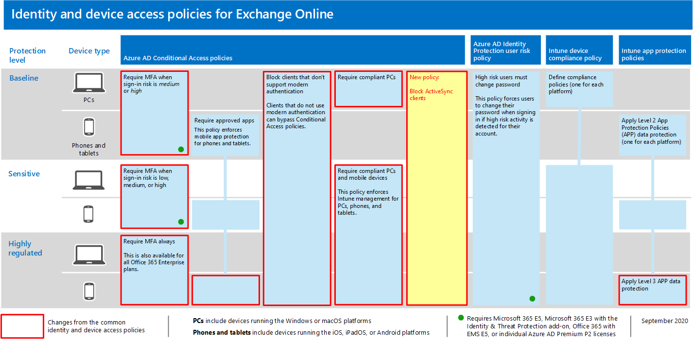

# <a name="policy-recommendations-for-securing-email"></a><span data-ttu-id="f628f-103">Richtlinienempfehlungen für sichere E-Mails</span><span class="sxs-lookup"><span data-stu-id="f628f-103">Policy recommendations for securing email</span></span>

<span data-ttu-id="f628f-104">**Gilt für**</span><span class="sxs-lookup"><span data-stu-id="f628f-104">**Applies to**</span></span>
- [<span data-ttu-id="f628f-105">Exchange Online Protection</span><span class="sxs-lookup"><span data-stu-id="f628f-105">Exchange Online Protection</span></span>](https://go.microsoft.com/fwlink/?linkid=2148611)
- [<span data-ttu-id="f628f-106">Microsoft Defender für Office 365 Plan 1 und Plan 2</span><span class="sxs-lookup"><span data-stu-id="f628f-106">Microsoft Defender for Office 365 plan 1 and plan 2</span></span>](https://go.microsoft.com/fwlink/?linkid=2148715)


<span data-ttu-id="f628f-107">In diesem Artikel wird beschrieben, wie Sie die empfohlenen Identitäts- und Gerätezugriffsrichtlinien implementieren, um E-Mail- und E-Mail-Clients der Organisation zu schützen, die moderne Authentifizierung und bedingten Zugriff unterstützen.</span><span class="sxs-lookup"><span data-stu-id="f628f-107">This article describes how to implement the recommended identity and device access policies to protect organizational email and email clients that support modern authentication and conditional access.</span></span> <span data-ttu-id="f628f-108">Dieser Leitfaden basiert auf den [allgemeinen Identitäts- und](identity-access-policies.md) Gerätezugriffsrichtlinien und enthält auch einige zusätzliche Empfehlungen.</span><span class="sxs-lookup"><span data-stu-id="f628f-108">This guidance builds on the [Common identity and device access policies](identity-access-policies.md) and also includes a few additional recommendations.</span></span>

<span data-ttu-id="f628f-109">Diese Empfehlungen basieren auf drei verschiedenen Sicherheits- und Schutzebenen, die basierend auf der Granularität Ihrer Anforderungen angewendet werden **können:** **Basisplan,** vertraulich und hochgradig **reguliert.**</span><span class="sxs-lookup"><span data-stu-id="f628f-109">These recommendations are based on three different tiers of security and protection that can be applied based on the granularity of your needs: **baseline**, **sensitive**, and **highly regulated**.</span></span> <span data-ttu-id="f628f-110">Weitere Informationen zu den Sicherheitsebenen und den empfohlenen Clientbetriebssystemen, auf die hier verwiesen wird, finden Sie in der [Einführung zu den empfohlenen Sicherheitsrichtlinien und -konfigurationen](microsoft-365-policies-configurations.md).</span><span class="sxs-lookup"><span data-stu-id="f628f-110">You can learn more about these security tiers, and the recommended client operating systems, referenced by these recommendations in the [recommended security policies and configurations introduction](microsoft-365-policies-configurations.md).</span></span>

<span data-ttu-id="f628f-111">Diese Empfehlungen erfordern, dass Ihre Benutzer moderne E-Mail-Clients verwenden, einschließlich Outlook für iOS und Android auf mobilen Geräten.</span><span class="sxs-lookup"><span data-stu-id="f628f-111">These recommendations require your users to use modern email clients, including Outlook for iOS and Android on mobile devices.</span></span> <span data-ttu-id="f628f-112">Outlook für iOS und Android bietet Unterstützung für die besten Features von Office 365.</span><span class="sxs-lookup"><span data-stu-id="f628f-112">Outlook for iOS and Android provide support for the best features of Office 365.</span></span> <span data-ttu-id="f628f-113">Diese mobilen Outlook-Apps sind auch mit Sicherheitsfunktionen entworfen, die die mobile Verwendung unterstützen und mit anderen Microsoft Cloud Security Funktionen zusammenarbeiten.</span><span class="sxs-lookup"><span data-stu-id="f628f-113">These mobile Outlook apps are also architected with security capabilities that support mobile use and work together with other Microsoft cloud security capabilities.</span></span> <span data-ttu-id="f628f-114">Weitere Informationen finden Sie unter Häufig gestellte Fragen zu [Outlook für iOS und Android.](https://docs.microsoft.com/exchange/clients-and-mobile-in-exchange-online/outlook-for-ios-and-android/outlook-for-ios-and-android-faq)</span><span class="sxs-lookup"><span data-stu-id="f628f-114">For more information, see [Outlook for iOS and Android FAQ](https://docs.microsoft.com/exchange/clients-and-mobile-in-exchange-online/outlook-for-ios-and-android/outlook-for-ios-and-android-faq).</span></span>

## <a name="update-common-policies-to-include-email"></a><span data-ttu-id="f628f-115">Aktualisieren gängiger Richtlinien mit E-Mails</span><span class="sxs-lookup"><span data-stu-id="f628f-115">Update common policies to include email</span></span>

<span data-ttu-id="f628f-116">Zum Schutz von E-Mails zeigt das folgende Diagramm, welche Richtlinien anhand der allgemeinen Identitäts- und Gerätezugriffsrichtlinien aktualisiert werden müssen.</span><span class="sxs-lookup"><span data-stu-id="f628f-116">To protect email, the following diagram illustrates which policies to update from the the common identity and device access policies.</span></span>

<span data-ttu-id="f628f-117">[](https://github.com/MicrosoftDocs/microsoft-365-docs/raw/public/microsoft-365/media/microsoft-365-policies-configurations/identity-access-ruleset-mail.png)</span><span class="sxs-lookup"><span data-stu-id="f628f-117">[](https://github.com/MicrosoftDocs/microsoft-365-docs/raw/public/microsoft-365/media/microsoft-365-policies-configurations/identity-access-ruleset-mail.png)</span></span>

[<span data-ttu-id="f628f-118">Sehen Sie sich eine größere Version dieses Bilds an.</span><span class="sxs-lookup"><span data-stu-id="f628f-118">See a larger version of this image</span></span>](https://github.com/MicrosoftDocs/microsoft-365-docs/raw/public/microsoft-365/media/microsoft-365-policies-configurations/identity-access-ruleset-mail.png)

<span data-ttu-id="f628f-119">Beachten Sie, dass eine neue Richtlinie für Exchange Online zum Blockieren von ActiveSync-Clients hinzu kommt.</span><span class="sxs-lookup"><span data-stu-id="f628f-119">Note the addition of a new policy for Exchange Online to block ActiveSync clients.</span></span> <span data-ttu-id="f628f-120">Dadurch wird die Verwendung von Outlook Mobile erzwingt.</span><span class="sxs-lookup"><span data-stu-id="f628f-120">This forces the use of Outlook mobile.</span></span>

<span data-ttu-id="f628f-121">Wenn Sie Exchange Online und Outlook beim Einrichten in den Bereich der Richtlinien aufgenommen haben, müssen Sie nur die neue Richtlinie erstellen, um die ActiveSync-Clients zu blockieren.</span><span class="sxs-lookup"><span data-stu-id="f628f-121">If you included Exchange Online and Outlook in the scope of the policies when you set them up, you only need to create the new policy to block ActiveSync clients.</span></span> <span data-ttu-id="f628f-122">Überprüfen Sie die in der folgenden Tabelle aufgeführten Richtlinien, und nehmen Sie die empfohlenen Ergänzungen vor, oder vergewissern Sie sich, dass diese bereits enthalten sind.</span><span class="sxs-lookup"><span data-stu-id="f628f-122">Review the policies listed in the following table and either make the recommended additions, or confirm that these are already included.</span></span> <span data-ttu-id="f628f-123">Jede Richtlinie ist mit den zugehörigen Konfigurationsanweisungen in [allgemeinen Identitäts- und Gerätezugriffsrichtlinien verknüpft.](identity-access-policies.md)</span><span class="sxs-lookup"><span data-stu-id="f628f-123">Each policy links to the associated configuration instructions in [Common identity and device access policies](identity-access-policies.md).</span></span>

|<span data-ttu-id="f628f-124">Schutzebene</span><span class="sxs-lookup"><span data-stu-id="f628f-124">Protection level</span></span>|<span data-ttu-id="f628f-125">Richtlinien</span><span class="sxs-lookup"><span data-stu-id="f628f-125">Policies</span></span>|<span data-ttu-id="f628f-126">Weitere Informationen</span><span class="sxs-lookup"><span data-stu-id="f628f-126">More information</span></span>|
|---|---|---|
|<span data-ttu-id="f628f-127">**Basisplan**</span><span class="sxs-lookup"><span data-stu-id="f628f-127">**Baseline**</span></span>|[<span data-ttu-id="f628f-128">MFA erforderlich, wenn das Anmelderisiko *mittel oder* hoch *ist*</span><span class="sxs-lookup"><span data-stu-id="f628f-128">Require MFA when sign-in risk is *medium* or *high*</span></span>](identity-access-policies.md#require-mfa-based-on-sign-in-risk)|<span data-ttu-id="f628f-129">Hinzufügen von Exchange Online in die Zuweisung von Cloud-Apps</span><span class="sxs-lookup"><span data-stu-id="f628f-129">Include Exchange Online in the assignment of cloud apps</span></span>|
||[<span data-ttu-id="f628f-130">Blockieren von Clients, die die moderne Authentifizierung nicht unterstützen</span><span class="sxs-lookup"><span data-stu-id="f628f-130">Block clients that don't support modern authentication</span></span>](identity-access-policies.md#block-clients-that-dont-support-multi-factor)|<span data-ttu-id="f628f-131">Hinzufügen von Exchange Online in die Zuweisung von Cloud-Apps</span><span class="sxs-lookup"><span data-stu-id="f628f-131">Include Exchange Online in the assignment of cloud apps</span></span>|
||[<span data-ttu-id="f628f-132">Anwenden von APP-Datenschutzrichtlinien</span><span class="sxs-lookup"><span data-stu-id="f628f-132">Apply APP data protection policies</span></span>](identity-access-policies.md#apply-app-data-protection-policies)|<span data-ttu-id="f628f-133">Stellen Sie sicher, dass Outlook in der Liste der Apps enthalten ist.</span><span class="sxs-lookup"><span data-stu-id="f628f-133">Be sure Outlook is included in the list of apps.</span></span> <span data-ttu-id="f628f-134">Achten Sie darauf, die Richtlinie für jede Plattform (iOS, Android, Windows) zu aktualisieren.</span><span class="sxs-lookup"><span data-stu-id="f628f-134">Be sure to update the policy for each platform (iOS, Android, Windows)</span></span>|
||[<span data-ttu-id="f628f-135">Erfordert genehmigte Apps und app-Schutz</span><span class="sxs-lookup"><span data-stu-id="f628f-135">Require approved apps and APP protection</span></span>](identity-access-policies.md#require-approved-apps-and-app-protection)|<span data-ttu-id="f628f-136">Hinzufügen von Exchange Online in die Liste der Cloud-Apps</span><span class="sxs-lookup"><span data-stu-id="f628f-136">Include Exchange Online in the list of cloud apps</span></span>|
||[<span data-ttu-id="f628f-137">Kompatible PCs erforderlich</span><span class="sxs-lookup"><span data-stu-id="f628f-137">Require compliant PCs</span></span>](identity-access-policies.md#require-compliant-pcs-but-not-compliant-phones-and-tablets)|<span data-ttu-id="f628f-138">Hinzufügen von Exchange Online in die Liste der Cloud-Apps</span><span class="sxs-lookup"><span data-stu-id="f628f-138">Include Exchange Online in list of cloud apps</span></span>|
||[<span data-ttu-id="f628f-139">Blockieren von ActiveSync-Clients</span><span class="sxs-lookup"><span data-stu-id="f628f-139">Block ActiveSync clients</span></span>](#block-activesync-clients)|<span data-ttu-id="f628f-140">Hinzufügen dieser neuen Richtlinie</span><span class="sxs-lookup"><span data-stu-id="f628f-140">Add this new policy</span></span>|
|<span data-ttu-id="f628f-141">**Vertraulich**</span><span class="sxs-lookup"><span data-stu-id="f628f-141">**Sensitive**</span></span>|[<span data-ttu-id="f628f-142">MFA erforderlich, wenn das Anmelderisiko *niedrig,* *mittel oder* *hoch ist*</span><span class="sxs-lookup"><span data-stu-id="f628f-142">Require MFA when sign-in risk is *low*, *medium* or *high*</span></span>](identity-access-policies.md#require-mfa-based-on-sign-in-risk)|<span data-ttu-id="f628f-143">Hinzufügen von Exchange Online in die Zuweisung von Cloud-Apps</span><span class="sxs-lookup"><span data-stu-id="f628f-143">Include Exchange Online in the assignment of cloud apps</span></span>|
||[<span data-ttu-id="f628f-144">Kompatible *PCs* und mobile Geräte erforderlich</span><span class="sxs-lookup"><span data-stu-id="f628f-144">Require compliant PCs *and* mobile devices</span></span>](identity-access-policies.md#require-compliant-pcs-and-mobile-devices)|<span data-ttu-id="f628f-145">Hinzufügen von Exchange Online in die Liste der Cloud-Apps</span><span class="sxs-lookup"><span data-stu-id="f628f-145">Include Exchange Online in the list of cloud apps</span></span>|
|<span data-ttu-id="f628f-146">**Streng geregelt**</span><span class="sxs-lookup"><span data-stu-id="f628f-146">**Highly regulated**</span></span>|[<span data-ttu-id="f628f-147">*MFA* immer erforderlich</span><span class="sxs-lookup"><span data-stu-id="f628f-147">*Always* require MFA</span></span>](identity-access-policies.md#require-mfa-based-on-sign-in-risk)|<span data-ttu-id="f628f-148">Hinzufügen von Exchange Online in die Zuweisung von Cloud-Apps</span><span class="sxs-lookup"><span data-stu-id="f628f-148">Include Exchange Online in the assignment of cloud apps</span></span>|
|

## <a name="block-activesync-clients"></a><span data-ttu-id="f628f-149">Blockieren von ActiveSync-Clients</span><span class="sxs-lookup"><span data-stu-id="f628f-149">Block ActiveSync clients</span></span>

<span data-ttu-id="f628f-150">Diese Richtlinie hindert ActiveSync-Clients daran, andere Richtlinien für bedingten Zugriff zu umgehen.</span><span class="sxs-lookup"><span data-stu-id="f628f-150">This policy prevents ActiveSync clients from bypassing other Conditional Access policies.</span></span> <span data-ttu-id="f628f-151">Die Richtlinienkonfiguration gilt nur für ActiveSync-Clients.</span><span class="sxs-lookup"><span data-stu-id="f628f-151">The policy configuration applies only to ActiveSync clients.</span></span> <span data-ttu-id="f628f-152">Durch Die Auswahl **[der Richtlinie "App-Schutz erforderlich"](https://docs.microsoft.com/azure/active-directory/conditional-access/concept-conditional-access-grant#require-app-protection-policy)** blockiert diese Richtlinie ActiveSync-Clients.</span><span class="sxs-lookup"><span data-stu-id="f628f-152">By selecting **[Require app protection policy](https://docs.microsoft.com/azure/active-directory/conditional-access/concept-conditional-access-grant#require-app-protection-policy)**, this policy blocks ActiveSync clients.</span></span> <span data-ttu-id="f628f-153">Details zum Erstellen dieser Richtlinie finden Sie unter "App-Schutzrichtlinie erforderlich" für den [Cloud-App-Zugriff mit bedingten Zugriff.](https://docs.microsoft.com/azure/active-directory/conditional-access/app-protection-based-conditional-access)</span><span class="sxs-lookup"><span data-stu-id="f628f-153">Details on creating this policy can be found in [Require app protection policy for cloud app access with Conditional Access](https://docs.microsoft.com/azure/active-directory/conditional-access/app-protection-based-conditional-access).</span></span>

- <span data-ttu-id="f628f-154">Folgen Sie "Schritt 2: Konfigurieren einer Azure AD-Richtlinie für bedingten Zugriff für Exchange Online mit ActiveSync (EAS)" in Szenario [1: Office 365-Apps](https://docs.microsoft.com/azure/active-directory/conditional-access/app-protection-based-conditional-access#scenario-1-office-365-apps-require-approved-apps-with-app-protection-policies)erfordern genehmigte Apps mit App-Schutzrichtlinien, die Exchange ActiveSync-Clients, die die Standardauthentifizierung nutzen, daran hindert, eine Verbindung mit Exchange Online zu herstellen.</span><span class="sxs-lookup"><span data-stu-id="f628f-154">Follow "Step 2: Configure an Azure AD Conditional Access policy for Exchange Online with ActiveSync (EAS)" in [Scenario 1: Office 365 apps require approved apps with app protection policies](https://docs.microsoft.com/azure/active-directory/conditional-access/app-protection-based-conditional-access#scenario-1-office-365-apps-require-approved-apps-with-app-protection-policies), which prevents Exchange ActiveSync clients leveraging basic authentication from connecting to Exchange Online.</span></span>

<span data-ttu-id="f628f-155">Sie können auch Authentifizierungsrichtlinien verwenden, um die [Standardauthentifizierung](https://docs.microsoft.com/exchange/clients-and-mobile-in-exchange-online/disable-basic-authentication-in-exchange-online)zu deaktivieren, wodurch alle Clientzugriffsanforderungen zur Verwendung der modernen Authentifizierung erzwingt werden.</span><span class="sxs-lookup"><span data-stu-id="f628f-155">You can also use authentication policies to [disable Basic authentication](https://docs.microsoft.com/exchange/clients-and-mobile-in-exchange-online/disable-basic-authentication-in-exchange-online), which forces all client access requests to use modern authentication.</span></span>

## <a name="limit-access-to-exchange-online-from-outlook-on-the-web"></a><span data-ttu-id="f628f-156">Einschränken des Zugriffs auf Exchange Online aus Outlook im Web</span><span class="sxs-lookup"><span data-stu-id="f628f-156">Limit access to Exchange Online from Outlook on the web</span></span>

<span data-ttu-id="f628f-157">Sie können die Möglichkeit für Benutzer einschränken, Anlagen von Outlook im Web auf umnanageten Geräten herunterzuladen.</span><span class="sxs-lookup"><span data-stu-id="f628f-157">You can restrict the ability for users to download attachments from Outlook on the web on umnanaged devices.</span></span> <span data-ttu-id="f628f-158">Benutzer auf diesen Geräten können diese Dateien mit Office Online anzeigen und bearbeiten, ohne die Dateien auf dem Gerät zu übertragen und zu speichern.</span><span class="sxs-lookup"><span data-stu-id="f628f-158">Users on these devices can view and edit these files using Office Online without leaking and storing the files on the device.</span></span> <span data-ttu-id="f628f-159">Sie können auch blockieren, dass Benutzern Anlagen auf einem nicht verwalteten Gerät angezeigt werden.</span><span class="sxs-lookup"><span data-stu-id="f628f-159">You can also block users from seeing attachments on an unmanaged device.</span></span>

<span data-ttu-id="f628f-160">Die Schritte sind hier aufgeführt:</span><span class="sxs-lookup"><span data-stu-id="f628f-160">Here are the steps:</span></span>

1. <span data-ttu-id="f628f-161">[Stellen Sie eine Verbindung mit einer Exchange Online Remote -PowerShell-Sitzung.](https://docs.microsoft.com/powershell/exchange/exchange-online/connect-to-exchange-online-powershell/connect-to-exchange-online-powershell)</span><span class="sxs-lookup"><span data-stu-id="f628f-161">[Connect to an Exchange Online Remote PowerShell session](https://docs.microsoft.com/powershell/exchange/exchange-online/connect-to-exchange-online-powershell/connect-to-exchange-online-powershell).</span></span>
2. <span data-ttu-id="f628f-162">Wenn Sie noch keine OWA-Postfachrichtlinie haben, erstellen Sie eine mit dem [Cmdlet "New-OwaMailboxPolicy".](https://docs.microsoft.com/powershell/module/exchange/new-owamailboxpolicy)</span><span class="sxs-lookup"><span data-stu-id="f628f-162">If you don't already have an OWA mailbox policy, create one with the [New-OwaMailboxPolicy](https://docs.microsoft.com/powershell/module/exchange/new-owamailboxpolicy) cmdlet.</span></span>
3. <span data-ttu-id="f628f-163">Wenn Sie das Anzeigen von Anlagen, aber kein Herunterladen zulassen möchten, verwenden Sie diesen Befehl:</span><span class="sxs-lookup"><span data-stu-id="f628f-163">If you want to allow viewing of attachments but no downloading, use this command:</span></span>

   ```powershell
   Set-OwaMailboxPolicy -Identity Default -ConditionalAccessPolicy ReadOnly
   ```

4. <span data-ttu-id="f628f-164">Wenn Sie Anlagen blockieren möchten, verwenden Sie diesen Befehl:</span><span class="sxs-lookup"><span data-stu-id="f628f-164">If you want to block attachments, use this command:</span></span>

   ```powershell
   Set-OwaMailboxPolicy -Identity Default -ConditionalAccessPolicy ReadOnlyPlusAttachmentsBlocked
   ```

5. <span data-ttu-id="f628f-165">Erstellen Sie im Azure-Portal eine neue Richtlinie für bedingten Zugriff mit den folgenden Einstellungen:</span><span class="sxs-lookup"><span data-stu-id="f628f-165">In the Azure portal, create a new Conditional Access policy with these settings:</span></span>

   <span data-ttu-id="f628f-166">**Zuordnungen** \> **Benutzer und Gruppen:** Wählen Sie die geeigneten Benutzer und Gruppen aus, um sie ein- und auszuschließen.</span><span class="sxs-lookup"><span data-stu-id="f628f-166">**Assignments** \> **Users and groups**: Select appropriate users and groups to include and exclude.</span></span>

   <span data-ttu-id="f628f-167">**Zuordnungen** \> **Cloud-Apps oder -Aktionen** \> **Cloud-Apps** \> **Include** \> **Auswählen von Apps:** **Auswählen von Office 365 Exchange Online**</span><span class="sxs-lookup"><span data-stu-id="f628f-167">**Assignments** \> **Cloud apps or actions** \> **Cloud apps** \> **Include** \> **Select apps**: Select **Office 365 Exchange Online**</span></span>

   <span data-ttu-id="f628f-168">**Zugriffssteuerungen** \> **Sitzung:** Auswählen von **erzwungenen Einschränkungen für die App verwenden**</span><span class="sxs-lookup"><span data-stu-id="f628f-168">**Access controls** \> **Session**: Select **Use app enforced restrictions**</span></span>

## <a name="require-that-ios-and-android-devices-must-use-outlook"></a><span data-ttu-id="f628f-169">Erfordern, dass iOS- und Android-Geräte Outlook verwenden müssen</span><span class="sxs-lookup"><span data-stu-id="f628f-169">Require that iOS and Android devices must use Outlook</span></span>

<span data-ttu-id="f628f-170">Um sicherzustellen, dass Benutzer von iOS- und Android-Geräten nur mit Outlook für iOS und Android auf Arbeits- oder Schulinhalte zugreifen können, benötigen Sie eine Richtlinie für bedingten Zugriff für diese potenziellen Benutzer.</span><span class="sxs-lookup"><span data-stu-id="f628f-170">To ensure that users of iOS and Android devices can only access work or school content using Outlook for iOS and Android, you need a Conditional Access policy that targets those potential users.</span></span>

<span data-ttu-id="f628f-171">Informationen zum Konfigurieren dieser Richtlinie finden Sie unter "Verwalten des Zugriffs auf die [Messagingzusammenarbeit mithilfe von Outlook für iOS und Android".]( https://docs.microsoft.com/mem/intune/apps/app-configuration-policies-outlook#apply-conditional-access)</span><span class="sxs-lookup"><span data-stu-id="f628f-171">See the steps to configure this policy in [Manage messaging collaboration access by using Outlook for iOS and Android]( https://docs.microsoft.com/mem/intune/apps/app-configuration-policies-outlook#apply-conditional-access).</span></span>

## <a name="set-up-message-encryption"></a><span data-ttu-id="f628f-172">Einrichten der Nachrichtenverschlüsselung</span><span class="sxs-lookup"><span data-stu-id="f628f-172">Set up message encryption</span></span>

<span data-ttu-id="f628f-173">Mit den neuen Funktionen der Office 365-Nachrichtenverschlüsselung (Office 365 Message Encryption, OME), die die Schutzfunktionen in Azure Information Protection nutzen, kann Ihre Organisation geschützte E-Mails problemlos für alle Benutzer auf jedem Gerät freigeben.</span><span class="sxs-lookup"><span data-stu-id="f628f-173">With the new Office 365 Message Encryption (OME) capabilities, which leverage the protection features in Azure Information Protection, your organization can easily share protected email with anyone on any device.</span></span> <span data-ttu-id="f628f-174">Benutzer können geschützte Nachrichten mit anderen Microsoft 365-Organisationen und Nicht-Kunden senden und empfangen, die Outlook.com, Gmail und andere E-Mail-Dienste verwenden.</span><span class="sxs-lookup"><span data-stu-id="f628f-174">Users can send and receive protected messages with other Microsoft 365 organizations as well as non-customers using Outlook.com, Gmail, and other email services.</span></span>

<span data-ttu-id="f628f-175">Weitere Informationen finden Sie unter [Einrichten der neuen Office 365-Nachrichtenverschlüsselungsfunktionen.](https://docs.microsoft.com/microsoft-365/compliance/set-up-new-message-encryption-capabilities)</span><span class="sxs-lookup"><span data-stu-id="f628f-175">For more information, see [Set up new Office 365 Message Encryption capabilities](https://docs.microsoft.com/microsoft-365/compliance/set-up-new-message-encryption-capabilities).</span></span>

## <a name="next-steps"></a><span data-ttu-id="f628f-176">Nächste Schritte</span><span class="sxs-lookup"><span data-stu-id="f628f-176">Next steps</span></span>


<span data-ttu-id="f628f-178">Konfigurieren Sie Richtlinien für bedingten Zugriff für:</span><span class="sxs-lookup"><span data-stu-id="f628f-178">Configure Conditional Access policies for:</span></span>

- [<span data-ttu-id="f628f-179">Microsoft Teams</span><span class="sxs-lookup"><span data-stu-id="f628f-179">Microsoft Teams</span></span>](teams-access-policies.md)
- [<span data-ttu-id="f628f-180">SharePoint</span><span class="sxs-lookup"><span data-stu-id="f628f-180">SharePoint</span></span>](sharepoint-file-access-policies.md)
