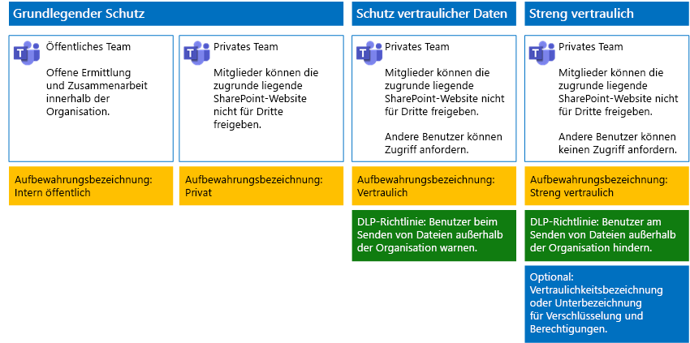

# Sichern von Dateien in Microsoft TeamsSecure files in Microsoft Teams

Dieser Artikel bietet Empfehlungen, wie Teams in Microsoft Teams und deren zugrunde liegenden SharePoint-Websites für den Dateischutz so konfiguriert werden können, dass sowohl die Sicherheit als auch eine einfache Zusammenarbeit sichergestellt sind.This article provides recommendations for configuring teams in Microsoft Teams and their underlying SharePoint sites for file protection that balances security with ease of collaboration. In diesem Artikel werden vier verschiedene Konfigurationen, beginnend mit einer öffentlichen Website in Ihrer Organisation mit sehr offenen Freigaberichtlinien definiert.This article defines four different configurations, starting with a public site within your organization with the most open sharing policies. Jede zusätzliche Konfiguration stellt einen sinnvollen Schritt im Hinblick auf einen zusätzlichen Schutz dar, die Möglichkeit des Zugriffs auf und der Zusammenarbeit an Dateien in Teams wird jedoch auf die entsprechenden Teammitglieder reduziert.Each additional configuration represents a meaningful step up in protection, but the ability to access and collaborate on files stored within Teams is reduced to the relevant set of team members. Verwenden Sie diese Empfehlungen als Ausgangspunkt, und passen Sie die Konfigurationen entsprechend den Bedürfnissen Ihrer Organisation an.Use these recommendations as a starting point and adjust the configurations to meet the needs of your organization.

Die Konfigurationen in diesem Artikel sind auf die Microsoft-Empfehlungen für drei Ebenen des Schutzes für Daten, Identitäten und Geräte ausgerichtet:The configurations in this article align with Microsoft's recommendations for three tiers of protection for data, identities, and devices:

- Grundlegender SchutzBaseline protection

- Schutz sensibler DatenSensitive protection

- Schutz von streng vertraulichen DatenHighly confidential protection

Weitere Informationen zu diesen Ebenen und Funktionen, die für jede Ebene empfohlen werden, finden Sie in den folgenden Ressourcen:For more information about these tiers and capabilities recommended for each tier, see the following resources.

- [Identität- und Geräteschutz für Office 365Identity and Device Protection for Office 365](https://docs.microsoft.com/office365/enterprise/microsoft-cloud-it-architecture-resources#identity-and-device-protection-for-office-365)

- [Lösungen zum Schutz von Dateien in Office 365File Protection Solutions in Office 365](https://docs.microsoft.com/office365/enterprise/microsoft-cloud-it-architecture-resources#file-protection-solutions-in-office-365)

## FunktionsübersichtCapability overview

Empfehlungen für gesicherte Teams greifen auf eine Vielzahl von Microsoft 365-Funktionen zurück.Recommendations for secured teams draw on a variety of Microsoft 365 capabilities. Die folgende Abbildung zeigt die empfohlenen Konfigurationen.The following illustration shows the recommended configurations.

Erläuterung der Abbildung:As illustrated:

- Der grundlegende Schutz enthält jeweils ein öffentliches Team und ein privates Team.Baseline protection includes a public team and private team. Öffentliche Teams können von allen Benutzern in der Organisation ermittelt werden und alle haben Zugriff auf diese.Public teams can be discovered and accessed by anybody in the organization. Private Teams können nur von Mitgliedern des Standorts ermittelt werden und nur diese haben Zugriff auf diese.Private teams can only be discovered and accessed by members of the team. Beide Konfigurationen ermöglichen die Freigabe der zugrunde liegenden SharePoint-Website, auf der Dateien außerhalb der Teamgruppe gespeichert werden.Both of these configurations allow for sharing of the underlying SharePoint site on which files are stored outside the team group.

- Teams für den vertraulichen und den streng vertraulichen Schutz sind private Teams, bei denen die Freigabe und das Anfordern von Access für die zugrunde liegende Website eingeschränkt ist.Teams for sensitive and highly confidential protection are private teams in which sharing and the requesting of access for the underlying site is limited.

- [Aufbewahrungsbezeichnungen](../../compliance/labels.md) bieten eine Möglichkeit, Dateien innerhalb der zugrunde liegenden SharePoint-Websites zu klassifizieren.[Retention labels](../../compliance/labels.md) provide a way to classify files within the underlying SharePoint sites. Jede zugrunde liegende SharePoint-Website wird so konfiguriert, dass die Dateien in Dokumentbibliotheken automatisch mit einer standardmäßigen Aufbewahrungsbezeichnung versehen werden.Each of the underlying SharePoint sites are configured to automatically label files in document libraries with a default retention label. Entsprechend der vier Teamkonfigurationen sind die Bezeichnungen in diesem Beispiel „Intern Öffentlich“, „Privat Vertraulich“ und „Streng Vertraulich“.Corresponding to the four team configurations, the labels in this example are Internal Public, Private, Sensitive, and Highly Confidential. Benutzer können die Bezeichnungen in den einzelnen Dateien ändern, aber diese Konfiguration sorgt dafür, dass alle Dateien eine Standardbezeichnung erhalten.Users can change the labels on the individual files, but this configuration ensures all files receive a default label.

- [Richtlinien zur Verhinderung von Datenverlust](../../compliance/data-loss-prevention-policies.md) sind für die Aufbewahrungsbezeichnungen „Sensibel“ und „Streng vertraulich“ konfiguriert, um Benutzer zu warnen oder daran zu hindern, diese Dateitypen außerhalb der Organisation zu senden.[Data loss prevention](../../compliance/data-loss-prevention-policies.md) (DLP) policies are configured for the Sensitive and Highly Confidential retention labels to either warn or prevent users when they attempt to send these types of files outside the organization.

- Falls dies für Ihr Szenario nötig sein sollte, können Sie [Vertraulichkeitsbezeichnungen](../../compliance/sensitivity-labels.md) verwenden, um streng vertrauliche Dateien mit Verschlüsselung und Berechtigungen zu schützen.If needed for your scenario, you can use [sensitivity labels](../../compliance/sensitivity-labels.md) to protect highly confidential files with encryption and permissions. Azure Information Protection-Kunden können Ihre Azure Information Protection-Bezeichnungen im Microsoft 365 Compliance Center verwenden, damit Ihre Bezeichnungen mit dem Azure-Portal synchronisiert werden, falls Sie eine zusätzliche oder erweiterte Konfiguration ausgewählt haben.For Azure Information Protection customers, you can use your Azure Information Protection labels in the Microsoft 365 compliance center, and your labels will be synced with the Azure portal in case you choose to perform additional or advanced configuration. Azure Information Protection-Bezeichnungen und Office 365-Vertraulichkeitsbezeichnungen sind miteinander vollständig kompatibel.Azure Information Protection labels and Office 365 sensitivity labels are fully compatible with each other. Dies bedeutet z. B., wenn Sie Inhalte mit Azure Information Protection gekennzeichnet haben, müssen Sie Ihre Inhalte nicht klassifizieren oder neu bezeichnen.This means, for example, if you have content labeled by Azure Information Protection, you won't need to reclassify or relabel your content. Nicht alle Kunden benötigen diese Schutzstufe.Not all customers need this level of protection.

## Organisationsweite Einstellungen für SharePoint und OneDriveOrganization-wide settings for SharePoint and OneDrive

SharePoint und OneDrive umfassen organisationsweite Einstellungen, die sich auf alle Websites und Benutzer auswirken.SharePoint and OneDrive include organization-wide settings that affect all sites and users. Einige dieser Einstellungen können auch auf Websiteebene angepasst werden, um diese restriktiver zu machen (aber nicht weniger restriktiv).Some of these settings can also be adjusted at the site level to be more restrictive (but not less). Dieser Abschnitt beschreibt mandantenweite Einstellungen, die die Sicherheit und die Zusammenarbeit betreffen.This section discusses tenant-wide settings that affect security and collaboration.

### FreigabeSharing

Für diese Lösung empfehlen wir die folgenden organisationsweiten Einstellungen:For this solution, we recommend the following organization-wide settings:

- Behalten Sie die Standardfreigaberichtlinie bei, die alle Freigabetypen für alle Arten von Konten zulässt, einschließlich der anonymen Freigabe.Keep the default sharing policy that allows all sharing with all account types, including anonymous sharing.

- Festlegen eines Ablaufdatums für anonyme Links, falls gewünscht.Set anonymous links to expire, if desired.

- Ändern des Standardlinktyps für die Freigabe in „Intern“. Dies verhindert versehentliche Datenlecks außerhalb Ihrer Organisation.Change the default link type for sharing to Internal. This helps prevent accidental data leakage outside your organization.

Das Zulassen der externen Freigabe mag zwar kontraintuitiv erscheinen, dennoch bietet dieser Ansatz mehr Kontrolle über die Dateifreigabe als dies beim Senden von Dateien per E-Mail der Fall ist.While it might seem counterintuitive to allow external sharing, this approach provides more control over file sharing compared to sending files in email. SharePoint und Outlook arbeiten zusammen, um eine sichere Zusammenarbeit an Dateien zu ermöglichen.SharePoint and Outlook work together to provide secure collaboration on files.

- Standardmäßig gibt Outlook einen Link zu einer Datei frei, anstatt die Datei per E-Mail zu senden.By default, Outlook shares a link to a file instead of sending the file in email.

- SharePoint und OneDrive erleichtern das Freigeben von Links zu Dateien für Mitwirkende sowohl innerhalb als auch außerhalb Ihrer Organisation.SharePoint and OneDrive make it easy to share links to files with contributors who are both inside and outside your organization

Außerdem stehen Ihnen Kontrollfunktionen zur Verfügung, mit denen Sie die externe Freigabe steuern können. Sie verfügen beispielsweise über folgende Möglichkeiten:You also have controls to help govern external sharing. For example, you can:

- Deaktivieren eines anonymen GastlinksDisable an anonymous guest link.

- Widerrufen des Benutzerzugriffs auf eine Website.Revoke user access to a site.

- Anzeigen lassen, wer Zugriff auf eine bestimmte Website oder ein Dokument hat.See who has access to a specific site or document.

- Festlegen eines Ablaufdatums für anonyme Freigabelinks (Mandanteneinstellung).Set anonymous sharing links to expire (tenant setting).

- Einschränken, wer außerhalb Ihrer Organisation zur Freigabe berechtigt ist (Mandanteneinstellung).Limit who can share outside your organization (tenant setting).

### Verwenden von externer Freigabe zusammen mit Verhinderung von Datenverlust (DLP)Use external sharing together with data loss prevention (DLP)

Wenn Sie die externe Freigabe nicht zulassen, stehen Benutzern mit einer Geschäftsanforderung alternative Tools und Methoden zur Verfügung. Microsoft empfiehlt, die externe Freigabe mit DLP-Richtlinien zu kombinieren, um sensible und streng vertrauliche Dateien zu schützen.If you don't allow external sharing, users with a business need will find alternate tools and methods. Microsoft recommends you combine external sharing with DLP policies to protect sensitive and highly confidential files.

### GerätezugriffseinstellungenDevice access settings

In den Gerätezugriffseinstellungen für SharePoint und OneDrive können Sie bestimmen, ob der Zugriff auf den Browser beschränkt ist (es können keine Dateien heruntergeladen werden) oder ob der Zugriff vollständig blockiert ist.Device access settings for SharePoint and OneDrive let you determine whether access is limited to browser only (files can't be downloaded) or if access is blocked. Weitere Informationen finden Sie unter [Steuern des Zugriffs von nicht verwalteten Geräten](https://docs.microsoft.com/sharepoint/control-access-from-unmanaged-devices).For more information, see [Control access from unmanaged devices](https://docs.microsoft.com/sharepoint/control-access-from-unmanaged-devices).

Wenn Sie Gerätezugriffseinstellungen mit empfohlenen bedingten Zugriffsrichtlinien in Azure Active Directory verwenden möchten, finden Sie unter [Richtlinienempfehlungen zum Schutz von SharePoint-Websites und -Dateien](https://docs.microsoft.com/microsoft-365/enterprise/sharepoint-file-access-policies) weitere Informationen.To use device access settings with recommended conditional access policies in Azure Active Directory, see [Policy recommendations for securing SharePoint sites and files](https://docs.microsoft.com/microsoft-365/enterprise/sharepoint-file-access-policies).

Besuchen Sie diese Einstellungen, um zu entscheiden, ob Sie die Standardeinstellungen für OneDrive-Websites ändern möchten.Visit these settings to decide if you want to change the default settings for OneDrive sites. Aktuell werden die Freigabe- und die Gerätezugriffseinstellungen über das SharePoint Admin Center dupliziert und gelten für beide Umgebungen.Currently, the sharing and device access settings are duplicated from the SharePoint admin center and apply to both environments.

## Konfiguration von Team und SharePoint-WebsitesTeam and SharePoint site configuration

In der folgenden Tabelle wird die Konfiguration für die einzelnen Teams und deren zugrunde liegende SharePoint-Website, die weiter oben in diesem Artikel beschrieben wurden, zusammengefasst.The following table summarizes the configuration for each of the teams and their underlying SharePoint site described earlier in this article. Verwenden Sie diese Konfigurationen als Ausgangsempfehlungen, und passen Sie die Websitetypen und Konfigurationen entsprechend den Bedürfnissen Ihrer Organisation an.Use these configurations as starting point recommendations and adjust the site types and configurations to meet the needs of your organization. Nicht jede Organisation benötigt jeden Teamtyp.Not every organization needs every type of team. Nur eine kleine Anzahl von Organisationen benötigt Teams streng vertraulichen Schutz.Only a small number of organizations require teams with highly confidential protection.

||||||
|:-----|:-----|:-----|:-----|:-----|
||**Basisschutz 1****Baseline protection #1**|**Grundlegender Schutz #2****Baseline protection #2**|**Schutz sensibler Daten****Sensitive protection**|**Streng vertraulich****Highly confidential**|
|BeschreibungDescription|Öffentliches Team mit offener Ermittlung und Zusammenarbeit innerhalb der Organisation.Public team with open discovery and collaboration within the organization.|Privates Team mit Freigabe der zugrunde liegenden SharePoint-Website außerhalb der Gruppe.Private team with sharing of the underlying SharePoint site allowed outside the group.|Privates Team, die Freigabe der zugrunde liegenden SharePoint-Website ist aber nur für Mitglieder der Website zulässig.Private team, but sharing of the underlying SharePoint site is only allowed to members of the site. Die DLP warnt den Benutzer bei dem Versuch, Dateien außerhalb der Organisation zu senden.DLP warns users when attempting to send files outside the organization.|Privates Team mit Vertraulichkeitsbezeichnungen für Dateiverschlüsselung und Berechtigungen, die mit der Datei verknüpft sind.Private team with sensitivity labels for file encryption and permissions that travel with the file. Die DLP hindert Benutzer daran, Dateien außerhalb der Organisation zu senden.DLP prevents users from sending files outside the organization.|
|Private oder öffentliche TeamwebsitePrivate or public team site|Public (Öffentlich)Public|PrivatePrivate|PrivatePrivate|PrivatePrivate|
|Wer hat Zugriff?Who has access?|Alle Benutzer in der Organisation, einschließlich der B2B-Benutzer.Everybody in the organization, including B2B users.|Nur Mitglieder der Website.Members of the site only. Andere Personen können den Zugriff anfordern.Others can request access.|Nur Mitglieder des Teams.Members of the team only. Andere Benutzer können den Zugriff auf die zugrunde liegende Website anfordern, die von einem Teambesitzer genehmigt wird.Others can request access to the underlying site, which is approved by a team owner.|Nur Mitglieder.Members only. Andere Benutzer können den Zugriff auf die zugrunde liegende Website nicht anfordern.Others cannot request access to the underlying site.|
|Freigabekontrollen auf WebsiteebeneSite-level sharing controls|Freigabe für beliebige Personen zulässig. Standardeinstellungen.Sharing allowed with anybody. Default settings.|Freigabe für beliebige Personen zulässig. Standardeinstellungen.Sharing allowed with anybody. Default settings.|Mitglieder können den Zugriff auf die Website nicht freigeben.Members cannot share access to the site.   Nichtmitglieder können den Zugriff auf die Website anfordern, aber diese Anforderungen müssen von einem Gruppenbesitzer für das Team bearbeitet werden.Non-members can request access to the site, but these requests need to be addressed by a group owner for the team.|Mitglieder können den Zugriff auf die Website nicht freigeben.Members cannot share access to the site.   Nichtmitglieder können den Zugriff auf die Website oder deren Inhalte nicht anfordern.Non-members cannot request access to the site or its contents.|
|Gerätezugriffssteuerungen auf WebsiteebeneSite-level device access controls|Keine zusätzlichen Steuerelemente.No additional controls.|Keine zusätzlichen Steuerelemente.No additional controls.|Verhindert, dass Benutzer Dateien auf nicht kompatible oder nicht der Domäne beigetretene Geräte herunterladen.Prevents users from downloading files to non-compliant or non-domain joined devices. Alle anderen Geräte erhalten nur Browserzugriff.This allows browser-only access from all other devices.|Blockieren des Downloads von Dateien auf nicht kompatible oder nicht der Domäne beigetretene Geräte.Block downloading of files to non-compliant or non-domain joined devices.|
|AufbewahrungsbezeichnungenRetention labels|Intern öffentlichInternal Public|PrivatePrivate|VertraulichSensitive|Streng vertraulichHighly Confidential|
|DLP-RichtlinienDLP policies|||Warnen Benutzer beim Senden von Dateien mit der Bezeichnung „Vertraulich“ außerhalb der Organisation.Warn users when sending files that are labeled as Sensitive outside the organization.   Um die externe Freigabe von sensiblen Datentypen wie z. B. Kreditkartennummern oder anderen persönlichen Daten zu blockieren, können Sie zusätzliche DLP-Richtlinien für diese Datentypen konfigurieren (einschließlich benutzerdefinierter Datentypen, die Sie selbst konfigurieren).To block external sharing of sensitive data types, such as credit card numbers or other personal data, you can configure additional DLP policies for these data types (including custom data types you configure).|Benutzer werden daran gehindert, Dateien mit der Bezeichnung „Streng vertraulich“ an Empfänger außerhalb der Organisation zu senden. Sie können es Benutzern ermöglichen, dies durch Angabe einer Rechtfertigung zu überschreiben, einschließlich der Person, für die sie die Datei freigeben.Block users from sending files that are labeled as highly confidential outside organization. Allow users to override this by providing justification, including who they are sharing the file with.|
|VertraulichkeitsbezeichnungenSensitivity labels||||Verwenden Sie Vertraulichkeitsbezeichnungen, um Dateien zu verschlüsseln und Berechtigungen für Dateien zu erteilen.Use sensitivity labels to encrypt and grant permissions to files. Dieser Schutz ist mit den Dateien verbunden, für den Fall, dass sie von der zugrunde liegenden SharePoint-Website offengelegt werden.This protection travels with the files in case they are leaked from the underlying SharePoint site.|

Die einzelnen Schritte zum Bereitstellen der vier verschiedenen Typen von Teams in dieser Lösung finden Sie unter [Bereitstellen von Teams für den Schutz auf drei Ebenen](deploy-teams-three-tiers.md).For the steps to deploy the four different types of teams in this solution, see [Deploy teams for three tiers of protection for files](deploy-teams-three-tiers.md).

## Office 365-AufbewahrungsbezeichnungenOffice 365 retention labels

Das Verwenden von Aufbewahrungsbezeichnungen wird für Umgebungen mit vertraulichen Daten empfohlen.Using retention labels is recommended for environments with sensitive data. Nachdem Sie Aufbewahrungsbezeichnungen konfiguriert und bereitgestellt haben, haben Sie folgende Möglichkeiten:After you configure and publish retention labels:

- Sie können eine Standardbezeichnung auf eine Dokumentbibliothek in der zugrunde liegenden SharePoint-Website anwenden, sodass alle Dokumente im Bereich **Dateien** des Teams mit der Standardbezeichnung versehen werden.You can apply a default label to a document library in the underlying SharePoint site for a team, so that all documents in the **Files** section of the team get the default label.

- Sie können Bezeichnungen automatisch auf Inhalt anwenden, wenn er bestimmten Bedingungen entspricht.You can apply labels to content automatically if it matches specific conditions.

- Sie können DLP-Richtlinien anwenden, die auf Aufbewahrungsbezeichnungen basieren.You can apply DLP policies that are based on retention labels.

- Personen in Ihrer Organisation haben die Möglichkeit zum manuellen Anwenden einer Bezeichnung, und zwar auf Inhalte in Outlook im Web, Outlook 2010 und höher, auf OneDrive, SharePoint und in Office 365-Gruppen.People in your organization can apply a label manually to content in Outlook on the web, Outlook 2010 and later, OneDrive, SharePoint, and Office 365 groups. Benutzer wissen häufig am besten, mit welcher Art von Inhalt sie arbeiten. Sie können den Inhalt somit klassifizieren und die entsprechende DLP-Richtlinie anwenden lassen.Users often know best what type of content they're working with, so they can classify it and have the appropriate DLP policy applied.

Wie dargestellt, umfasst diese Lösung die Erstellung der folgenden Aufbewahrungsbezeichnungen:As illustrated, this solution includes creating the following retention labels:

- Streng vertraulichHighly Confidential

- VertraulichSensitive

- PrivatePrivate

- Intern öffentlichInternal Public

Die Bezeichnungen sind den empfohlenen Websites in den Abbildungen und Diagrammen weiter oben in diesem Artikel zugeordnet. Diese Lösung empfiehlt die Konfiguration von DLP-Richtlinien, um Informationslecks bei Dateien zu verhindern, die als sensibel oder streng vertraulich klassifiziert sind.These labels are mapped to the recommended sites in the illustrations and charts earlier in this article. This solution recommends configuring DLP policies to help prevent the leakage of files labeled as Sensitive and Highly Confidential.

Die Schritte zum Konfigurieren von Aufbewahrungsbezeichnungen und DLP-Richtlinien in dieser Lösung finden Sie unter [Schützen von Dateien in Teams mit Aufbewahrungsbezeichnungen und Schutz vor Datenverlust (DLP)](deploy-teams-retention-DLP.md).For the steps to configure retention labels and DLP policies in this solution, see [Protect files in teams with retention labels and DLP](deploy-teams-retention-DLP.md).

## VertraulichkeitsbezeichnungenSensitivity labels

Falls dies für Ihr Sicherheitsszenario notwendig sein sollte, können Sie Vertraulichkeitsbezeichnungen verwenden, um Schutzfunktionen anzuwenden, die die Dateien immer und überall begleiten.If warranted for your security scenario, you can use sensitivity labels to apply protections that follow the files wherever they go. Vertraulichkeitsbezeichnungen im Microsoft 365 Compliance Center und Azure Information Protection-Bezeichnungen sind identisch.Sensitivity labels in the Microsoft 365 compliance center and Azure Information Protection labels are the same. Für diese Lösung empfehlen wir, eine Vertraulichkeitsbezeichnung oder eine Unterbezeichnung zu verwenden, um Dateien, die Schutz der höchsten Ebene benötigen, zu verschlüsseln und Berechtigungen für sie zu erteilen.For this solution, we recommend you use a sensitivity label or sublabel to encrypt and grant permissions to files that need to be protected with the highest level of security.

Weitere Informationen finden Sie unter [Übersicht über Vertraulichkeitsbezeichnungen](../../compliance/sensitivity-labels.md).For more information, see [Overview of sensitivity labels](../../compliance/sensitivity-labels.md).

Die Schritte zum Konfigurieren von Vertraulichkeitsbezeichnungen in dieser Lösung finden Sie unter [Schützen von Dateien in Teams mit Vertraulichkeitsbezeichnungen](deploy-teams-sensitivity-labels.md).For the steps to configure sensitivity labels in this solution, see [Protect files in teams with sensitivity labels](deploy-teams-sensitivity-labels.md).

## Siehe auchSee also

[Cloudakzeptanz und HybridlösungenCloud adoption and hybrid solutions](https://docs.microsoft.com/office365/enterprise/cloud-adoption-and-hybrid-solutions)
