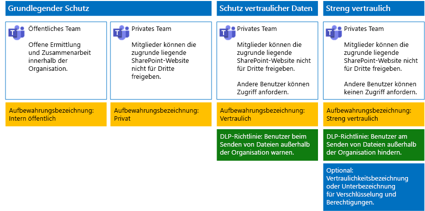

# Sichern von Dateien in Microsoft Teams

Dieser Artikel bietet Empfehlungen, wie Teams in Microsoft Teams und deren zugrunde liegenden SharePoint-Websites für den Dateischutz so konfiguriert werden können, dass sowohl die Sicherheit als auch eine einfache Zusammenarbeit sichergestellt sind. In diesem Artikel werden vier verschiedene Konfigurationen, beginnend mit einer öffentlichen Website in Ihrer Organisation mit sehr offenen Freigaberichtlinien definiert. Jede zusätzliche Konfiguration stellt einen sinnvollen Schritt im Hinblick auf einen zusätzlichen Schutz dar, die Möglichkeit des Zugriffs auf und der Zusammenarbeit an Dateien in Teams wird jedoch auf die entsprechenden Teammitglieder reduziert. Verwenden Sie diese Empfehlungen als Ausgangspunkt, und passen Sie die Konfigurationen entsprechend den Bedürfnissen Ihrer Organisation an. 
  
Die Konfigurationen in diesem Artikel sind auf die Microsoft-Empfehlungen für drei Ebenen des Schutzes für Daten, Identitäten und Geräte ausgerichtet:
  
- Grundlegender Schutz
    
- Schutz sensibler Daten
    
- Schutz von streng vertraulichen Daten
    
Weitere Informationen zu diesen Ebenen und Funktionen, die für jede Ebene empfohlen werden, finden Sie in den folgenden Ressourcen: 
  
- [Identität- und Geräteschutz für Office 365](https://docs.microsoft.com/office365/enterprise/microsoft-cloud-it-architecture-resources#BKMK_O365IDP)
    
- [Lösungen zum Schutz von Dateien in Office 365](https://docs.microsoft.com/office365/enterprise/microsoft-cloud-it-architecture-resources#BKMK_O365fileprotect)
    
## Funktionsübersicht

Empfehlungen für gesicherte Teams greifen auf eine Vielzahl von Microsoft 365-Funktionen zurück. Die folgende Abbildung zeigt die empfohlenen Konfigurationen.

Erläuterung der Abbildung:
  
- Der grundlegende Schutz enthält jeweils ein öffentliches Team und ein privates Team. Öffentliche Teams können von allen Benutzern in der Organisation ermittelt werden und alle haben Zugriff auf diese. Private Teams können nur von Mitgliedern des Standorts ermittelt werden und nur diese haben Zugriff auf diese. Beide Konfigurationen ermöglichen die Freigabe der zugrunde liegenden SharePoint-Website, auf der Dateien außerhalb der Teamgruppe gespeichert werden.
 
- Teams für den vertraulichen und den streng vertraulichen Schutz sind private Teams, bei denen die Freigabe und das Anfordern von Access für die zugrunde liegende Website eingeschränkt ist.

    
- [Aufbewahrungsbezeichnungen](../../compliance/labels.md) bieten eine Möglichkeit, Dateien innerhalb der zugrunde liegenden SharePoint-Websites zu klassifizieren. Jede zugrunde liegende SharePoint-Website wird so konfiguriert, dass die Dateien in Dokumentbibliotheken automatisch mit einer standardmäßigen Aufbewahrungsbezeichnung versehen werden. Entsprechend der vier Teamkonfigurationen sind die Bezeichnungen in diesem Beispiel „Intern Öffentlich“, „Privat Vertraulich“ und „Streng Vertraulich“. Benutzer können die Bezeichnungen in den einzelnen Dateien ändern, aber diese Konfiguration sorgt dafür, dass alle Dateien eine Standardbezeichnung erhalten.
    
- [Richtlinien zur Verhinderung von Datenverlust](../../compliance/data-loss-prevention-policies.md) sind für die Aufbewahrungsbezeichnungen „Sensibel“ und „Streng vertraulich“ konfiguriert, um Benutzer zu warnen oder daran zu hindern, diese Dateitypen außerhalb der Organisation zu senden.
    
- Falls dies für Ihr Szenario nötig sein sollte, können Sie [Vertraulichkeitsbezeichnungen](../../compliance/sensitivity-labels.md) verwenden, um streng vertrauliche Dateien mit Verschlüsselung und Berechtigungen zu schützen. Azure Information Protection-Kunden können Ihre Azure Information Protection-Bezeichnungen im Microsoft 365 Compliance Center verwenden, damit Ihre Bezeichnungen mit dem Azure-Portal synchronisiert werden, falls Sie eine zusätzliche oder erweiterte Konfiguration ausgewählt haben. Azure Information Protection-Bezeichnungen und Office 365-Vertraulichkeitsbezeichnungen sind miteinander vollständig kompatibel. Dies bedeutet z. B., wenn Sie Inhalte mit Azure Information Protection gekennzeichnet haben, müssen Sie Ihre Inhalte nicht klassifizieren oder neu bezeichnen. Nicht alle Kunden benötigen diese Schutzstufe. 
    
## Organisationsweite Einstellungen für SharePoint und OneDrive

SharePoint und OneDrive umfassen organisationsweite Einstellungen, die sich auf alle Websites und Benutzer auswirken. Einige dieser Einstellungen können auch auf Websiteebene angepasst werden, um diese restriktiver zu machen (aber nicht weniger restriktiv). Dieser Abschnitt beschreibt mandantenweite Einstellungen, die die Sicherheit und die Zusammenarbeit betreffen. 
  
### Freigabe

Für diese Lösung empfehlen wir die folgenden organisationsweiten Einstellungen:
  
- Behalten Sie die Standardfreigaberichtlinie bei, die alle Freigabetypen für alle Arten von Konten zulässt, einschließlich der anonymen Freigabe.
    
- Festlegen eines Ablaufdatums für anonyme Links, falls gewünscht.
    
- Ändern des Standardlinktyps für die Freigabe in „Intern“. Dies verhindert versehentliche Datenlecks außerhalb Ihrer Organisation.
    
Das Zulassen der externen Freigabe mag zwar kontraintuitiv erscheinen, dennoch bietet dieser Ansatz mehr Kontrolle über die Dateifreigabe als dies beim Senden von Dateien per E-Mail der Fall ist. SharePoint und Outlook arbeiten zusammen, um eine sichere Zusammenarbeit an Dateien zu ermöglichen. 
  
- Standardmäßig gibt Outlook einen Link zu einer Datei frei, anstatt die Datei per E-Mail zu senden. 
    
- SharePoint und OneDrive erleichtern das Freigeben von Links zu Dateien für Mitwirkende sowohl innerhalb als auch außerhalb Ihrer Organisation.
    
Außerdem stehen Ihnen Kontrollfunktionen zur Verfügung, mit denen Sie die externe Freigabe steuern können. Sie verfügen beispielsweise über folgende Möglichkeiten:
  
- Deaktivieren eines anonymen Gastlinks
    
- Widerrufen des Benutzerzugriffs auf eine Website.
    
- Anzeigen lassen, wer Zugriff auf eine bestimmte Website oder ein Dokument hat.
    
- Festlegen eines Ablaufdatums für anonyme Freigabelinks (Mandanteneinstellung).
    
- Einschränken, wer außerhalb Ihrer Organisation zur Freigabe berechtigt ist (Mandanteneinstellung).
    
### Verwenden von externer Freigabe zusammen mit Verhinderung von Datenverlust (DLP)

Wenn Sie die externe Freigabe nicht zulassen, stehen Benutzern mit einer Geschäftsanforderung alternative Tools und Methoden zur Verfügung. Microsoft empfiehlt, die externe Freigabe mit DLP-Richtlinien zu kombinieren, um sensible und streng vertrauliche Dateien zu schützen.
  
### Gerätezugriffseinstellungen

In den Gerätezugriffseinstellungen für SharePoint und OneDrive können Sie bestimmen, ob der Zugriff auf den Browser beschränkt ist (es können keine Dateien heruntergeladen werden) oder ob der Zugriff vollständig blockiert ist. Weitere Informationen finden Sie unter [Steuern des Zugriffs von nicht verwalteten Geräten](https://docs.microsoft.com/sharepoint/control-access-from-unmanaged-devices). 

Wenn Sie Gerätezugriffseinstellungen mit empfohlenen bedingten Zugriffsrichtlinien in Azure Active Directory verwenden möchten, finden Sie unter [Richtlinienempfehlungen zum Schutz von SharePoint-Websites und -Dateien](https://docs.microsoft.com/microsoft-365/enterprise/sharepoint-file-access-policies) weitere Informationen.
  
Besuchen Sie diese Einstellungen, um zu entscheiden, ob Sie die Standardeinstellungen für OneDrive-Websites ändern möchten. Aktuell werden die Freigabe- und die Gerätezugriffseinstellungen über das SharePoint Admin Center dupliziert und gelten für beide Umgebungen.
  
## Konfiguration von Team und SharePoint-Websites

In der folgenden Tabelle wird die Konfiguration für die einzelnen Teams und deren zugrunde liegende SharePoint-Website, die weiter oben in diesem Artikel beschrieben wurden, zusammengefasst. Verwenden Sie diese Konfigurationen als Ausgangsempfehlungen, und passen Sie die Websitetypen und Konfigurationen entsprechend den Bedürfnissen Ihrer Organisation an. Nicht jede Organisation benötigt jeden Teamtyp. Nur eine kleine Anzahl von Organisationen benötigt Teams streng vertraulichen Schutz.
  
||||||
|:-----|:-----|:-----|:-----|:-----|
||**Basisschutz 1**   |**Grundlegender Schutz #2**   |**Schutz sensibler Daten**   |**Streng vertraulich**   |
|Beschreibung    |Öffentliches Team mit offener Ermittlung und Zusammenarbeit innerhalb der Organisation.    |Privates Team mit Freigabe der zugrunde liegenden SharePoint-Website außerhalb der Gruppe.    |Privates Team, die Freigabe der zugrunde liegenden SharePoint-Website ist aber nur für Mitglieder der Website zulässig. Die DLP warnt den Benutzer bei dem Versuch, Dateien außerhalb der Organisation zu senden.    |Privates Team mit Vertraulichkeitsbezeichnungen für Dateiverschlüsselung und Berechtigungen, die mit der Datei verknüpft sind. Die DLP hindert Benutzer daran, Dateien außerhalb der Organisation zu senden.    |
|Private oder öffentliche Teamwebsite    |Public (Öffentlich)    |Private    |Private    |Private    |
|Wer hat Zugriff?    |Alle Benutzer in der Organisation, einschließlich der B2B-Benutzer.    |Nur Mitglieder der Website. Andere Personen können den Zugriff anfordern.    |Nur Mitglieder des Teams. Andere Benutzer können den Zugriff auf die zugrunde liegende Website anfordern, die von einem Teambesitzer genehmigt wird.    |Nur Mitglieder. Andere Benutzer können den Zugriff auf die zugrunde liegende Website nicht anfordern.    |
|Freigabekontrollen auf Websiteebene    |Freigabe für beliebige Personen zulässig. Standardeinstellungen.    |Freigabe für beliebige Personen zulässig. Standardeinstellungen.    |Mitglieder können den Zugriff auf die Website nicht freigeben.    Nichtmitglieder können den Zugriff auf die Website anfordern, aber diese Anforderungen müssen von einem Gruppenbesitzer für das Team bearbeitet werden.    |Mitglieder können den Zugriff auf die Website nicht freigeben.    Nichtmitglieder können den Zugriff auf die Website oder deren Inhalte nicht anfordern.    |
|Gerätezugriffssteuerungen auf Websiteebene    |Keine zusätzlichen Steuerelemente.    |Keine zusätzlichen Steuerelemente.    |Verhindert, dass Benutzer Dateien auf nicht kompatible oder nicht der Domäne beigetretene Geräte herunterladen. Alle anderen Geräte erhalten nur Browserzugriff.    |Blockieren des Downloads von Dateien auf nicht kompatible oder nicht der Domäne beigetretene Geräte.    |
|Aufbewahrungsbezeichnungen    |Intern öffentlich    |Private    |Vertraulich    |Streng vertraulich    |
|DLP-Richtlinien    |||Warnen Benutzer beim Senden von Dateien mit der Bezeichnung „Vertraulich“ außerhalb der Organisation.    Um die externe Freigabe von sensiblen Datentypen wie z. B. Kreditkartennummern oder anderen persönlichen Daten zu blockieren, können Sie zusätzliche DLP-Richtlinien für diese Datentypen konfigurieren (einschließlich benutzerdefinierter Datentypen, die Sie selbst konfigurieren).    |Benutzer werden daran gehindert, Dateien mit der Bezeichnung „Streng vertraulich“ an Empfänger außerhalb der Organisation zu senden. Sie können es Benutzern ermöglichen, dies durch Angabe einer Rechtfertigung zu überschreiben, einschließlich der Person, für die sie die Datei freigeben.    |
|Vertraulichkeitsbezeichnungen    ||||Verwenden Sie Vertraulichkeitsbezeichnungen, um Dateien zu verschlüsseln und Berechtigungen für Dateien zu erteilen. Dieser Schutz ist mit den Dateien verbunden, für den Fall, dass sie von der zugrunde liegenden SharePoint-Website offengelegt werden.    |
   
Die einzelnen Schritte zum Bereitstellen der vier verschiedenen Typen von Teams in dieser Lösung finden Sie unter [Bereitstellen von Teams für den Schutz auf drei Ebenen](deploy-teams-three-tiers.md).
  
## Office 365-Aufbewahrungsbezeichnungen

Das Verwenden von Aufbewahrungsbezeichnungen wird für Umgebungen mit vertraulichen Daten empfohlen. Nachdem Sie Aufbewahrungsbezeichnungen konfiguriert und bereitgestellt haben, haben Sie folgende Möglichkeiten:
  
- Sie können eine Standardbezeichnung auf eine Dokumentbibliothek in der zugrunde liegenden SharePoint-Website anwenden, sodass alle Dokumente im Bereich **Dateien** des Teams mit der Standardbezeichnung versehen werden. 
    
- Sie können Bezeichnungen automatisch auf Inhalt anwenden, wenn er bestimmten Bedingungen entspricht.
    
- Sie können DLP-Richtlinien anwenden, die auf Aufbewahrungsbezeichnungen basieren.
    
- Personen in Ihrer Organisation haben die Möglichkeit zum manuellen Anwenden einer Bezeichnung, und zwar auf Inhalte in Outlook im Web, Outlook 2010 und höher, auf OneDrive, SharePoint und in Office 365-Gruppen. Benutzer wissen häufig am besten, mit welcher Art von Inhalt sie arbeiten. Sie können den Inhalt somit klassifizieren und die entsprechende DLP-Richtlinie anwenden lassen.
    
Wie dargestellt, umfasst diese Lösung die Erstellung der folgenden Aufbewahrungsbezeichnungen:
  
- Streng vertraulich
    
- Vertraulich
    
- Private
    
- Intern öffentlich
    
Die Bezeichnungen sind den empfohlenen Websites in den Abbildungen und Diagrammen weiter oben in diesem Artikel zugeordnet. Diese Lösung empfiehlt die Konfiguration von DLP-Richtlinien, um Informationslecks bei Dateien zu verhindern, die als sensibel oder streng vertraulich klassifiziert sind.
  
Die Schritte zum Konfigurieren von Aufbewahrungsbezeichnungen und DLP-Richtlinien in dieser Lösung finden Sie unter [Schützen von Dateien in Teams mit Aufbewahrungsbezeichnungen und Schutz vor Datenverlust (DLP)](deploy-teams-retention-DLP.md).
  
## Vertraulichkeitsbezeichnungen 

Falls dies für Ihr Sicherheitsszenario notwendig sein sollte, können Sie Vertraulichkeitsbezeichnungen verwenden, um Schutzfunktionen anzuwenden, die die Dateien immer und überall begleiten. Vertraulichkeitsbezeichnungen im Microsoft 365 Compliance Center und Azure Information Protection-Bezeichnungen sind identisch. Für diese Lösung empfehlen wir, eine Vertraulichkeitsbezeichnung oder eine Unterbezeichnung zu verwenden, um Dateien, die Schutz der höchsten Ebene benötigen, zu verschlüsseln und Berechtigungen für sie zu erteilen. 

Weitere Informationen finden Sie unter [Übersicht über Vertraulichkeitsbezeichnungen](../../compliance/sensitivity-labels.md).

Die Schritte zum Konfigurieren von Vertraulichkeitsbezeichnungen in dieser Lösung finden Sie unter [Schützen von Dateien in Teams mit Vertraulichkeitsbezeichnungen](deploy-teams-sensitivity-labels.md).
   
   
## Siehe auch
  
[Cloudakzeptanz und Hybridlösungen](https://docs.microsoft.com/office365/enterprise/cloud-adoption-and-hybrid-solutions)
  
