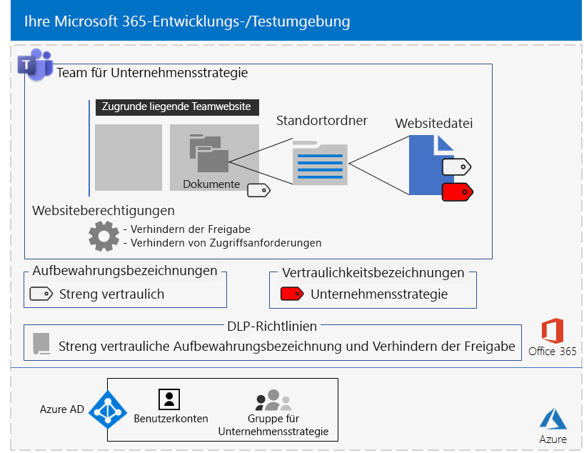

# <a name="secure-teams-for-files-in-a-devtest-environment"></a>Sichere Teams für Dateien in einer Entwicklungs-/Testumgebung

In diesem Artikel finden Sie schrittweise Anleitungen zum Erstellen einer Entwicklungs-/Testumgebung, die die vertraulichen und streng vertraulichen Teams für die Lösung [Sichern von Dateien in Microsoft Teams](secure-files-in-teams.md) umfasst.


Verwenden Sie diese Entwicklungs-/Testumgebung, um Einstellungen für Ihre spezifischen Anforderungen auszuprobieren und zu optimieren, bevor Sie diese Arten von Teams in der Produktion bereitstellen.

## <a name="phase-1-build-out-your-microsoft-365-enterprise-test-environment"></a>Phase 1: Erstellen Ihrer Microsoft 365 Enterprise-Testumgebung

Wenn Sie vertrauliche und streng vertrauliche Teams auf einfache Weise mit Minimalanforderungen testen möchten, befolgen Sie die Anweisungen unter [Einfache Basiskonfiguration](https://docs.microsoft.com/microsoft-365/enterprise/lightweight-base-configuration-microsoft-365-enterprise).

Wenn Sie vertrauliche und streng vertrauliche Teams in einem simulierten Unternehmen testen möchten, befolgen Sie die Anweisungen unter [Kennworthashsynchronisierung](https://docs.microsoft.com/microsoft-365/enterprise/password-hash-sync-m365-ent-test-environment).

>[!Note]
>Für das Testen von vertraulichen und streng vertraulichen Teams ist keine simulierte Unternehmenstestumgebung erforderlich, die ein simuliertes Intranet, das mit dem Internet verbunden ist, und die Verzeichnissynchronisierung für eine Active Directory Domain Services-Gesamtstruktur umfasst. Dies wird hier als Option bereitgestellt, damit Sie vertrauliche und streng vertrauliche Teams testen und damit in einer Umgebung, die eine typische Organisation darstellt, experimentieren können.
>

## <a name="phase-2-create-and-configure-your-azure-active-directory-ad-groups-and-users"></a>Phase 2: Erstellen und Konfigurieren der Azure Active Directory(AD)-Gruppen und -Benutzer

In dieser Phase erstellen und konfigurieren Sie die Azure AD-Gruppen und -Benutzer für eine fiktive Organisation.

Erstellen Sie zuerst zwei Gruppen für eine typische Organisation mit dem Azure-Portal.

1. Erstellen Sie eine separate Registerkarte in Ihrem Browser, und wechseln Sie dann zum Azure-Portal unter [https://portal.azure.com](https://portal.azure.com). Falls erforderlich, melden Sie sich mit den Anmeldeinformationen des globalen Administratorkontos für Ihr Microsoft 365 E5-Testabonnement oder Ihr kostenpflichtiges Abonnement an.

2. Klicken Sie im Azure-Portal auf **Azure Active Directory > Gruppen**.

3. Klicken Sie auf dem Blatt **Gruppen - Alle Gruppen** auf **+ Neue Gruppe**.

4. Auf dem Blatt **Gruppe**:

   - Wählen Sie unter **Gruppentyp** die Option **Sicherheit** aus.

   - Geben **C-Suite** unter **Name** ein.

   - Wählen Sie **Zugewiesen** unter **Mitgliedschaftstyp** aus.

5. Klicken Sie auf **Erstellen**, und schließen Sie dann das Blatt **Gruppe**.

6. Wiederholen Sie die Schritte 3-5 für eine neue Gruppe namens **Marketingmitarbeiter**.

Im nächsten Schritt wird die automatische Lizenzierung konfiguriert, sodass Mitgliedern von Gruppen automatisch Lizenzen für Ihre Microsoft 365- und EMS-Abonnements zugewiesen werden.

1. Klicken Sie im Azure-Portal auf **Azure Active Directory > Lizenzen > Alle Produkte**.

2. Wählen Sie in der Liste **Microsoft 365 Enterprise E5** aus, und klicken Sie dann auf **Zuweisen**.

3. Klicken Sie auf dem Blatt **Lizenz zuweisen** auf **Benutzer und Gruppen**.

4. Wählen Sie in der Liste der Gruppen Folgendes aus:

   - C-Suite

   - Marketingmitarbeiter

5. Klicken Sie auf **Auswählen** und dann auf **Zuweisen**.

6. Schließen Sie die Registerkarte für das Azure Portal in Ihrem Browser.

Danach müssen Sie [eine Verbindung mit dem Azure Active Directory PowerShell für Graph-Module herstellen](https://docs.microsoft.com/office365/enterprise/powershell/connect-to-office-365-powershell#connect-with-the-azure-active-directory-powershell-for-graph-module).

Geben Sie den Namen Ihrer Organisation, Ihren Standort und ein gemeinsames Kennwort ein, und führen Sie dann die folgenden Befehle über die PowerShell-Eingabeaufforderung oder in der ISE-Umgebung (Integrated Script Environment) aus, um Benutzerkonten zu erstellen und sie zu den Gruppen hinzuzufügen:

```powershell
$orgName="<organization name, such as contoso for the contoso.onmicrosoft.com trial subscription domain name>"
$location="<the ISO ALPHA2 country code, such as US for the United States>"
$commonPassword="<common password for all the new accounts>"

$PasswordProfile=New-Object -TypeName Microsoft.Open.AzureAD.Model.PasswordProfile
$PasswordProfile.Password=$commonPassword

$groupName="C-Suite"
$userNames=@("CEO","CFO","CIO")
$groupID=(Get-AzureADGroup | Where { $_.DisplayName -eq $groupName }).ObjectID
ForEach ($element in $userNames){
New-AzureADUser -DisplayName $element -PasswordProfile $PasswordProfile -UserPrincipalName ($element + "@" + $orgName + ".onmicrosoft.com") -AccountEnabled $true -MailNickName $element -UsageLocation $location
Add-AzureADGroupMember -RefObjectId (Get-AzureADUser | Where { $_.DisplayName -eq $element }).ObjectID -ObjectId $groupID
}
$groupName="Marketing staff"
$userNames=@("Marketing1", "Marketing2")
$groupID=(Get-AzureADGroup | Where { $_.DisplayName -eq $groupName }).ObjectID
ForEach ($element in $userNames){
New-AzureADUser -DisplayName $element -PasswordProfile $PasswordProfile -UserPrincipalName ($element + "@" + $orgName + ".onmicrosoft.com") -AccountEnabled $true -MailNickName $element -UsageLocation $location
Add-AzureADGroupMember -RefObjectId (Get-AzureADUser | Where { $_.DisplayName -eq $element }).ObjectID -ObjectId $groupID
}
```

> [!NOTE]
> Für die Automatisierung und Vereinfachung der Konfiguration einer Dev/Test-Umgebung wird hier ein gemeinsames Kennwort verwendet. Natürlich ist davon bei Produktionsabonnements dringend abzuraten.

Gehen Sie folgendermaßen vor, um sicherzustellen, dass die gruppenbasierte Lizenzierung ordnungsgemäß funktioniert.

1. Klicken Sie auf der Registerkarte **Microsoft Office Home** in Ihrem Browser auf die Kachel **Admin**.

2. Klicken Sie auf der neuen Registerkarte **Microsoft 365 Admin Center** des Browsers auf **Benutzer**.

3. Klicken Sie in der Liste der Benutzer auf **CEO**.

4. Stellen Sie im Bereich, der die Eigenschaften des Benutzerkontos **CEO** anzeigt, sicher, dass ihm die Lizenz **Microsoft 365 Enterprise E5** zugewiesen wurde (in **Produktlizenzen**).

## <a name="phase-3-create-retention-labels"></a>Phase 3: Erstellen von Aufbewahrungsbezeichnungen

In dieser Phase erstellen Sie die Aufbewahrungsbezeichnungen für die verschiedenen Sicherheitsstufen für Dokumentordner für die zugrunde liegende SharePoint-Website.

1. Melden Sie sich beim [Microsoft 365 Compliance-Portal](https://compliance.microsoft.com) mit Ihrem globalen Administratorkonto an.

2. Klicken Sie auf der Registerkarte **Start – Microsoft 365 Compliance ** im Browser auf **Klassifizierungen > Bezeichnungen**.

3. Klicken Sie auf **Aufbewahrungsbezeichnung > Erstellen einer Bezeichnung**.

4. Geben Sie im Bereich **Name für Bezeichnung** unter **Name für Bezeichnung** **Vertraulich** ein, und klicken Sie dann auf **Weiter**

5. Klicken Sie im Bereich **Dateiplanbeschreibungen** auf **Weiter**.

6. Legen Sie im Bereich **Bezeichnungseigenschaften**, falls erforderlich, **Aufbewahrung** auf **Ein** fest, und klicken Sie dann auf **Weiter**.

7. Klicken Sie im Bereich **Einstellungen überprüfen** auf **Beschriftung erstellen**.

8. Wiederholen Sie die Schritte 3-7 für eine zusätzliche Aufbewahrungsbezeichnung namens **Streng vertraulich**.

9. Klicken Sie im Bereich **Startseite > Bezeichnungen** auf **Bezeichnungen veröffentlichen**.

10. Klicken Sie im Bereich **Zu veröffentlichende Bezeichnungen wählen** auf **Zu veröffentlichende Bezeichnungen wählen**

11. Klicken Sie im Bereich **Choose labels** (Bezeichnungen auswählen) auf **Hinzufügen**, wählen Sie alle vier Bezeichnungen aus.

12. Klicken Sie auf **Fertig**.

13. Klicken Sie im Bereich **Zu veröffentlichende Bezeichnungen wählen** auf **Weiter**.

14. Klicken Sie im Bereich **Speicherorte auswählen** auf **Weiter**.

15. Geben Sie im Bereich **Richtlinie benennen** **Beispielorganisation** unter **Name** ein, und klicken Sie dann auf **Weiter**.

16. Klicken Sie im Bereich **Einstellungen überprüfen** auf **Bezeichnungen veröffentlichen**, und klicken Sie dann auf **Schließen**.

## <a name="phase-4-create-your-teams"></a>Phase 4: Erstellen Ihrer Teams

In dieser Phase erstellen und konfigurieren Sie vertrauliche und streng vertrauliche Teams für Ihre Beispielorganisation.

### <a name="sensitive-team-for-marketing-campaigns"></a>Vertrauliches Team für Marketingkampagnen

Gehen Sie folgendermaßen vor, um ein Team auf der Ebene „Vertraulich“ für Mitglieder der Marketinggruppe zu erstellen, damit Sie an laufenden Marketingkampagnen zusammenarbeiten können:

1. [Erstellen Sie ein neues privates Team](https://support.microsoft.com/office/174adf5f-846b-4780-b765-de1a0a737e2b) mit dem Namen **Marketingkampagnen**.
2. Öffnen Sie das Team **Marketingkampagnen**.
3. Klicken Sie auf der Symbolleiste des Teams auf **Dateien**.
4. Klicken Sie auf die drei Punkte "(…)" und dann auf **In SharePoint öffnen**.
5. Klicken Sie in der Symbolleiste der zugrunde liegenden SharePoint-Website auf das Symbol "Einstellungen" und anschließend auf **Websiteberechtigungen**.
6. Klicken Sie im Bereich **Websiteberechtigungen** unter **Freigabeeinstellungen** auf **Freigabeeinstellungen ändern**.
7. Wählen Sie unter **Freigabeberechtigungen** die Option **Nur Websitebesitzer können Dateien, Ordner und die Website teilen** aus, und klicken Sie dann auf **Speichern**.

Konfigurieren Sie anschließend den Ordner „Dokumente“ der zugrunde liegenden SharePoint-Website „Marketingkampagnen“ für die Bezeichnung „Vertraulich“.

1. Klicken Sie auf der Registerkarte **Marketingkampagnen – Startseite** in Ihrem Browser auf **Dokumente**.
2. Klicken Sie auf das Symbol „Einstellungen“, und klicken Sie dann auf **Bibliothekseinstellungen**.
3. Klicken Sie unter **Berechtigungen und Verwaltung** auf **Bezeichnung auf Elemente in dieser Bibliothek anwenden**.
4. Wählen Sie unter **Einstellungen -Bezeichnung anwenden** die Option **Vertraulich**, und klicken Sie dann auf **Speichern**.

Konfigurieren Sie als Nächstes eine Richtlinie zur Verhinderung von Datenverlust (Data Loss Prevention, DLP), die Benutzer benachrichtigt, wenn sie ein Dokument auf einer der zugrunde liegenden SharePoint-Website mit der Bezeichnung „Vertraulich“ freigeben, die die Marketingkampagnenwebsite enthält (außerhalb der Organisation).

1. Melden Sie sich beim [Microsoft 365 Compliance-Portal](https://compliance.microsoft.com/) mit Ihrem globalen Administratorkonto an.

2. Klicken Sie auf der Registerkarte **Microsoft 365 Compliance** in Ihrem Browser auf **Richtlinien > Verhinderung von Datenverlust**.

3. Klicken Sie im Bereich **Verhinderung von Datenverlust** auf **Richtlinie erstellen**.

4. Klicken Sie im Bereich **Mit einer Vorlage beginnen oder eine benutzerdefinierte Richtlinie erstellen** auf **Benutzerdefiniert**, und klicken Sie dann auf **Weiter**.

5. Geben Sie im Bereich **Ihre Richtlinie benennen** den Namen **Bezeichnung „Vertraulich" – SharePoint-Websites** bei **Name** ein, und klicken Sie dann auf **Weiter**.

6. Klicken Sie im Bereich **Speicherorte auswählen** auf **Bestimmte Speicherorte auswählen**, und klicken Sie dann auf **Weiter**.

7. Deaktivieren Sie in der Liste der Speicherorte **Exchange-E-Mail**, **OneDrive-Konten** und **Teams-Chat- und Kanalnachrichten**, und klicken Sie dann auf **Weiter**.

8. Klicken Sie im Bereich **Anpassen des zu schützenden Inhaltstyps** auf **Bearbeiten**.

9. In der **wählen Sie die Typen der Inhalte zum Schutz** Bereich, klicken Sie auf **hinzufügen** im Dropdown-Listenfeld, und klicken Sie dann auf **Aufbewahrungsbezeichnungen**.

10. Klicken Sie im Bereich **Aufbewahrungsbezeichnungen** auf **Hinzufügen**, wählen Sie die Bezeichnung **Vertraulich** aus, klicken Sie auf **Hinzufügen**, und klicken Sie dann auf **Fertig**.

11. Klicken Sie im Bereich **Typen des zu schützenden Inhalts auswählen** auf **Speichern**.

12. Klicken Sie im Bereich **Anpassen des zu schützenden Inhaltstyps** auf **Weiter**.

13. Klicken Sie im Bereich **Was möchten Sie tun, wenn vertrauliche Informationen erkannt werden?** auf **Richtlinientipptext anpassen**.

14. Klicken Sie im Bereich **Customize policy tips and email notifications** (Anpassen der Richtlinientipps und der E-Mail-Benachrichtigungen) auf **Customize the policy tip text** (Den Tipptext der Richtlinie als nächstes anpassen).

15. Geben Sie Folgendes in das Textfeld ein, oder fügen Sie es ein:

    Wenn Sie eine Datei für einen Benutzer außerhalb der Organisation freigeben möchten, laden Sie die Datei herunter, und öffnen Sie sie. Klicken Sie auf „Datei“ > „Dokument schützen“ > „Mit Kennwort verschlüsseln“, und geben Sie dann ein sicheres Kennwort ein. Senden Sie das Kennwort in einer separaten E-Mail oder auf andere Weise.

16. Klicken Sie auf **OK**.

17. Klicken Sie im Bereich **Was möchten Sie tun, wenn vertrauliche Informationen erkannt werden?** auf **Weiter**.

18. Klicken Sie im Bereich **Möchten Sie die Richtlinie aktivieren oder zunächst testen?** auf **Ja, Richtlinie aktivieren**, und klicken Sie dann auf **Weiter**.

19. Klicken Sie im Bereich **Einstellungen überprüfen** auf **Erstellen**, und klicken Sie dann auf **Schließen**.

Hier ist die resultierende Konfiguration für das Marketingkampagnenteam.


### <a name="company-strategy-team-site"></a>Teamwebsite für Unternehmensstrategie

Gehen Sie folgendermaßen vor, um ein Team auf der Ebene „Streng vertraulich“ für Mitglieder des Geschäftsleitungsteams zu erstellen, damit Sie an der Unternehmensstrategie zusammenarbeiten können:

1. [Erstellen Sie ein neues privates Team](https://support.microsoft.com/office/174adf5f-846b-4780-b765-de1a0a737e2b) mit dem Namen **Unternehmensstrategie**.
2. Öffnen Sie das Team **Unternehmensstrategie**.
3. Klicken Sie auf der Symbolleiste des Teams auf **Dateien**.
4. Klicken Sie auf die drei Punkte "(…)" und dann auf **In SharePoint öffnen**.
5. Klicken Sie in der Symbolleiste der zugrunde liegenden SharePoint-Website auf das Symbol "Einstellungen" und anschließend auf **Websiteberechtigungen**.
6. Klicken Sie im Bereich **Websiteberechtigungen** unter **Freigabeeinstellungen** auf **Freigabeeinstellungen ändern**.
7. Wählen Sie unter **Freigabeberechtigungen** die Option **Nur Websitebesitzer können Dateien, Ordner und die Website teilen** aus.
8. Deaktivieren Sie **Zugriffsanforderungen zulassen**, und klicken Sie dann auf **Speichern**.

Konfigurieren Sie anschließend den Ordner „Dokumente“ der zugrunde liegenden SharePoint-Website „Unternehmensstrategie“ für die Bezeichnung „Streng vertraulich“.

1. Klicken Sie auf der Registerkarte **Unternehmensstrategie – Startseite** in Ihrem Browser auf **Dokumente**.
2. Klicken Sie auf das Symbol „Einstellungen“, und klicken Sie dann auf **Bibliothekseinstellungen**.
3. Klicken Sie unter **Berechtigungen und Verwaltung** auf **Bezeichnung auf Elemente in dieser Bibliothek anwenden**.
4. Wählen Sie unter **Einstellungen -Bezeichnung anwenden** die Option **Streng vertraulich**, und klicken Sie dann auf **Speichern**.

Konfigurieren Sie als Nächstes eine DLP-Richtlinie, die Benutzer blockiert, wenn sie ein Dokument auf einer zugrunde liegenden SharePoint-Website mit der Bezeichnung „Streng vertraulich" freigeben, die die Unternehmensstrategiewebsite enthält (außerhalb der Organisation).

1. Melden Sie sich beim [Microsoft 365 Compliance-Portal](https://compliance.microsoft.com/) mit Ihrem globalen Administratorkonto an.

2. Klicken Sie auf der Registerkarte **Microsoft 365 Compliance** in Ihrem Browser auf **Richtlinien > Verhinderung von Datenverlust**.

3. Klicken Sie im Bereich **Verhinderung von Datenverlust** auf **Richtlinie erstellen**.

4. Klicken Sie im Bereich **Mit einer Vorlage beginnen oder eine benutzerdefinierte Richtlinie erstellen** auf **Benutzerdefiniert**, und klicken Sie dann auf **Weiter**.

5. Geben Sie im Bereich **Ihre Richtlinie benennen** den Namen **Bezeichnung „Streng vertraulich" – SharePoint-Websites** bei **Name** ein, und klicken Sie dann auf **Weiter**.

6. Klicken Sie im Bereich **Speicherorte auswählen** auf **Bestimmte Speicherorte auswählen**, und klicken Sie dann auf **Weiter**.

7. Deaktivieren Sie in der Liste der Speicherorte **Exchange-E-Mail**, **OneDrive-Konten** und **Teams-Chat- und Kanalnachrichten**, und klicken Sie dann auf **Weiter**.

8. Klicken Sie im Bereich **Anpassen des zu schützenden Inhaltstyps** auf **Bearbeiten**.

9. In der **wählen Sie die Typen der Inhalte zum Schutz** Bereich, klicken Sie auf **hinzufügen** im Dropdown-Listenfeld, und klicken Sie dann auf **Aufbewahrungsbezeichnungen**.

10. Klicken Sie im Bereich **Aufbewahrungsbezeichnungen** auf **Hinzufügen**, wählen Sie die Bezeichnung **Streng vertraulich** aus, klicken Sie auf **Hinzufügen**, und klicken Sie dann auf **Fertig**.

11. Klicken Sie im Bereich **Typen des zu schützenden Inhalts auswählen** auf **Speichern**.

12. Klicken Sie im Bereich **Anpassen des zu schützenden Inhaltstyps** auf **Weiter**.

13. Klicken Sie im Bereich **Was möchten Sie tun, wenn vertrauliche Informationen erkannt werden?** auf **Richtlinientipptext anpassen**.

14. Klicken Sie im Bereich **Customize policy tips and email notifications** (Anpassen der Richtlinientipps und der E-Mail-Benachrichtigungen) auf **Customize the policy tip text** (Den Tipptext der Richtlinie als nächstes anpassen).

15. Geben Sie Folgendes in das Textfeld ein, oder fügen Sie es ein:

    Wenn Sie eine Datei für einen Benutzer außerhalb der Organisation freigeben möchten, laden Sie die Datei herunter, und öffnen Sie sie. Klicken Sie auf „Datei“ > „Dokument schützen“ > „Mit Kennwort verschlüsseln“, und geben Sie dann ein sicheres Kennwort ein. Senden Sie das Kennwort in einer separaten E-Mail oder auf andere Weise.

16. Klicken Sie auf **OK**.

17. Klicken Sie im Bereich **Möchten Sie die Richtlinie aktivieren oder zunächst testen?** auf **Ja, Richtlinie aktivieren**, und klicken Sie dann auf **Weiter**.

18. Klicken Sie im Bereich **Möchten Sie die Richtlinie aktivieren oder zunächst testen?** auf **Ja, Richtlinie aktivieren**, und klicken Sie dann auf **Weiter**.

19. Klicken Sie im Bereich **Einstellungen überprüfen** auf **Erstellen**, und klicken Sie dann auf **Schließen**.

Verwenden Sie [diese Anweisungen ](https://docs.microsoft.com/microsoft-365/compliance/encryption-sensitivity-labels) zum Konfigurieren einer Vertraulichkeitsbezeichnung mit den folgenden Einstellungen:

- Der Name der Bezeichnung lautet „Unternehmensstrategie“.
- Die Verschlüsselung ist aktiviert.
- Die Gruppe „Unternehmensstrategie“ verfügt über Berechtigungen für die gemeinsame Dokumenterstellung.

Veröffentlichen Sie nach dem Erstellen die neue Bezeichnung. Wenn Sie sich als Mitglied der Gruppe „Unternehmensstrategie“ anmelden, wird die neue Bezeichnung auf der Symbolleiste „Start“ in Word, Excel und PowerPoint unter der Option „Vertraulichkeit“ angezeigt. Wählen Sie unter der Option „Vertraulichkeit“ die Bezeichnung „Unternehmensstrategie“ aus, um einer Datei eine Bezeichnung zuzuweisen.

Hier ist die resultierende Konfiguration für das Unternehmensstrategieteam.



Dateien im Abschnitt „Dokumente“ der zugrunde liegenden SharePoint-Website „Unternehmensstrategie“ wird die Aufbewahrungsbezeichnung „Streng vertraulich“ zugewiesen, und sie unterliegen der konfigurierten DLP-Richtlinie. Für Dateien kann auch die Vertraulichkeitsbezeichnung „Unternehmensstrategie“ zugewiesen werden.

## <a name="next-step"></a>Nächster Schritt

Wenn Sie für die Produktionsbereitstellung finden Sie unter [Sichern von Dateien in Microsoft Teams](secure-files-in-teams.md) ausführliche Informationen und Links zu schrittweisen Bereitstellungsartikeln.

## <a name="see-also"></a>Siehe auch

[Cloudakzeptanz und Hybridlösungen](https://docs.microsoft.com/office365/enterprise/cloud-adoption-and-hybrid-solutions)
