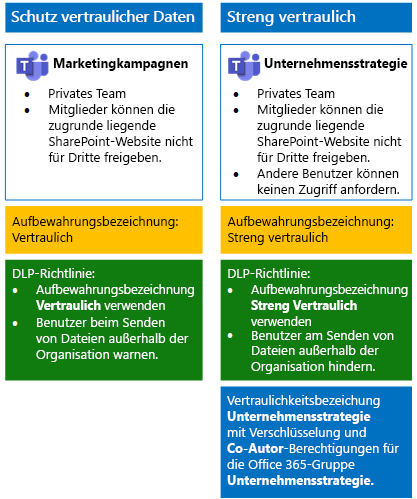
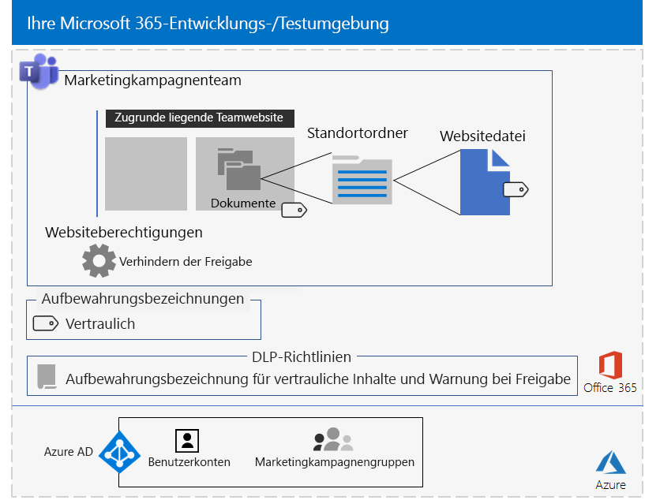

# <a name="secure-teams-for-files-in-a-devtest-environment"></a><span data-ttu-id="28ad5-103">Sichere Teams für Dateien in einer Entwicklungs-/Testumgebung</span><span class="sxs-lookup"><span data-stu-id="28ad5-103">Secure Teams for files in a dev/test environment</span></span>

<span data-ttu-id="28ad5-104">In diesem Artikel finden Sie schrittweise Anleitungen zum Erstellen einer Entwicklungs-/Testumgebung, die die vertraulichen und streng vertraulichen Teams für die Lösung [Sichern von Dateien in Microsoft Teams](secure-files-in-teams.md) umfasst.</span><span class="sxs-lookup"><span data-stu-id="28ad5-104">This article provides step-by-step instructions to create a dev/test environment that includes the sensitive and highly confidential teams for the [Secure files in Microsoft Teams](secure-files-in-teams.md) solution.</span></span>
  

  
<span data-ttu-id="28ad5-106">Verwenden Sie diese Entwicklungs-/Testumgebung, um Einstellungen für Ihre spezifischen Anforderungen auszuprobieren und zu optimieren, bevor Sie diese Arten von Teams in der Produktion bereitstellen.</span><span class="sxs-lookup"><span data-stu-id="28ad5-106">Use this dev/test environment to experiment and fine-tune settings for your specific needs before deploying these types of teams in production.</span></span>
  
## <a name="phase-1-build-out-your-microsoft-365-enterprise-test-environment"></a><span data-ttu-id="28ad5-107">Phase 1: Erstellen Ihrer Microsoft 365 Enterprise-Testumgebung</span><span class="sxs-lookup"><span data-stu-id="28ad5-107">Phase 1: Build out your Microsoft 365 Enterprise test environment</span></span>

<span data-ttu-id="28ad5-108">Wenn Sie vertrauliche und streng vertrauliche Teams auf einfache Weise mit Minimalanforderungen testen möchten, befolgen Sie die Anweisungen unter [Einfache Basiskonfiguration](https://docs.microsoft.com/microsoft-365/enterprise/lightweight-base-configuration-microsoft-365-enterprise).</span><span class="sxs-lookup"><span data-stu-id="28ad5-108">If you just want to test sensitive and highly confidential teams in a lightweight way with the minimum requirements, follow the instructions in [Lightweight base configuration](https://docs.microsoft.com/microsoft-365/enterprise/lightweight-base-configuration-microsoft-365-enterprise).</span></span>

<span data-ttu-id="28ad5-109">Wenn Sie vertrauliche und streng vertrauliche Teams in einem simulierten Unternehmen testen möchten, befolgen Sie die Anweisungen unter [Kennworthashsynchronisierung](https://docs.microsoft.com/microsoft-365/enterprise/password-hash-sync-m365-ent-test-environment).</span><span class="sxs-lookup"><span data-stu-id="28ad5-109">If you want to test sensitive and highly confidential teams in a simulated enterprise, follow the instructions in [Password hash synchronization](https://docs.microsoft.com/microsoft-365/enterprise/password-hash-sync-m365-ent-test-environment).</span></span>

>[!Note]
><span data-ttu-id="28ad5-110">Für das Testen von vertraulichen und streng vertraulichen Teams ist keine simulierte Unternehmenstestumgebung erforderlich, die ein simuliertes Intranet, das mit dem Internet verbunden ist, und die Verzeichnissynchronisierung für eine Active Directory Domain Services-Gesamtstruktur umfasst.</span><span class="sxs-lookup"><span data-stu-id="28ad5-110">Testing sensitive and highly confidential teams does not require the simulated enterprise test environment, which includes a simulated intranet connected to the Internet and directory synchronization for an Active Directory Domain Services (AD DS) forest.</span></span> <span data-ttu-id="28ad5-111">Dies wird hier als Option bereitgestellt, damit Sie vertrauliche und streng vertrauliche Teams testen und damit in einer Umgebung, die eine typische Organisation darstellt, experimentieren können.</span><span class="sxs-lookup"><span data-stu-id="28ad5-111">It is provided here as an option so that you can test sensitive and highly confidential teams and experiment with it in an environment that represents a typical organization.</span></span>
>
    
## <a name="phase-2-create-and-configure-your-azure-active-directory-ad-groups-and-users"></a><span data-ttu-id="28ad5-112">Phase 2: Erstellen und Konfigurieren der Azure Active Directory(AD)-Gruppen und -Benutzer</span><span class="sxs-lookup"><span data-stu-id="28ad5-112">Phase 2: Create and configure your Azure Active Directory (AD) groups and users</span></span>

<span data-ttu-id="28ad5-113">In dieser Phase erstellen und konfigurieren Sie die Azure AD-Gruppen und -Benutzer für eine fiktive Organisation.</span><span class="sxs-lookup"><span data-stu-id="28ad5-113">In this phase, you create and configure the Azure AD groups and users for your fictional organization.</span></span>
  
<span data-ttu-id="28ad5-114">Erstellen Sie zuerst zwei Gruppen für eine typische Organisation mit dem Azure-Portal.</span><span class="sxs-lookup"><span data-stu-id="28ad5-114">First, create two groups for a typical organization with the Azure portal.</span></span>
  
1. <span data-ttu-id="28ad5-115">Erstellen Sie eine separate Registerkarte in Ihrem Browser, und wechseln Sie dann zum Azure-Portal unter [https://portal.azure.com](https://portal.azure.com).</span><span class="sxs-lookup"><span data-stu-id="28ad5-115">Create a separate tab in your browser, and then go to the Azure portal at [https://portal.azure.com](https://portal.azure.com).</span></span> <span data-ttu-id="28ad5-116">Falls erforderlich, melden Sie sich mit den Anmeldeinformationen des globalen Administratorkontos für Ihr Microsoft 365 E5-Testabonnement oder Ihr kostenpflichtiges Abonnement an.</span><span class="sxs-lookup"><span data-stu-id="28ad5-116">If needed, sign in with the credentials of the global administrator account for your Microsoft 365 E5 trial or paid subscription.</span></span>
    
2. <span data-ttu-id="28ad5-117">Klicken Sie im Azure-Portal auf **Azure Active Directory > Gruppen**.</span><span class="sxs-lookup"><span data-stu-id="28ad5-117">In the Azure portal, click **Azure Active Directory > Groups**.</span></span>
    
3. <span data-ttu-id="28ad5-118">Klicken Sie auf dem Blatt **Gruppen - Alle Gruppen** auf **+ Neue Gruppe**.</span><span class="sxs-lookup"><span data-stu-id="28ad5-118">On the **Groups - All groups** blade, click **+ New group**.</span></span>
    
4. <span data-ttu-id="28ad5-119">Auf dem Blatt **Gruppe**:</span><span class="sxs-lookup"><span data-stu-id="28ad5-119">On the **Group** blade:</span></span>
    
  - <span data-ttu-id="28ad5-120">Wählen Sie unter **Gruppentyp** die Option **Sicherheit** aus.</span><span class="sxs-lookup"><span data-stu-id="28ad5-120">Select **Security** in **Group type**.</span></span>
    
  - <span data-ttu-id="28ad5-121">Geben **C-Suite** unter **Name** ein.</span><span class="sxs-lookup"><span data-stu-id="28ad5-121">Type **C-Suite** in **Name**.</span></span>
    
  - <span data-ttu-id="28ad5-122">Wählen Sie **Zugewiesen** unter **Mitgliedschaftstyp** aus.</span><span class="sxs-lookup"><span data-stu-id="28ad5-122">Select **Assigned** in **Membership type**.</span></span>
      
5. <span data-ttu-id="28ad5-123">Klicken Sie auf **Erstellen**, und schließen Sie dann das Blatt **Gruppe**.</span><span class="sxs-lookup"><span data-stu-id="28ad5-123">Click **Create**, and then close the **Group** blade.</span></span>
    
6.    <span data-ttu-id="28ad5-124">Wiederholen Sie die Schritte 3-5 für eine neue Gruppe namens **Marketingmitarbeiter**.</span><span class="sxs-lookup"><span data-stu-id="28ad5-124">Repeat steps 3-5 for a new group named **Marketing staff**.</span></span>
    
<span data-ttu-id="28ad5-125">Im nächsten Schritt wird die automatische Lizenzierung konfiguriert, sodass Mitgliedern von Gruppen automatisch Lizenzen für Ihre Microsoft 365- und EMS-Abonnements zugewiesen werden.</span><span class="sxs-lookup"><span data-stu-id="28ad5-125">Next, you configure automatic licensing so that members of your groups are automatically assigned licenses for your Microsoft 365 and EMS subscriptions.</span></span>
  
1. <span data-ttu-id="28ad5-126">Klicken Sie im Azure-Portal auf **Azure Active Directory > Lizenzen > Alle Produkte**.</span><span class="sxs-lookup"><span data-stu-id="28ad5-126">In the Azure portal, click **Azure Active Directory > Licenses > All products**.</span></span>
    
2. <span data-ttu-id="28ad5-127">Wählen Sie in der Liste **Microsoft 365 Enterprise E5** aus, und klicken Sie dann auf **Zuweisen**.</span><span class="sxs-lookup"><span data-stu-id="28ad5-127">In the list, select **Microsoft 365 Enterprise E5**, and then click **Assign**.</span></span>
    
3. <span data-ttu-id="28ad5-128">Klicken Sie auf dem Blatt **Lizenz zuweisen** auf **Benutzer und Gruppen**.</span><span class="sxs-lookup"><span data-stu-id="28ad5-128">In the **Assign license** blade, click **Users and groups**.</span></span>
    
4. <span data-ttu-id="28ad5-129">Wählen Sie in der Liste der Gruppen Folgendes aus:</span><span class="sxs-lookup"><span data-stu-id="28ad5-129">In the list of groups, select the following:</span></span>
    
  - <span data-ttu-id="28ad5-130">C-Suite</span><span class="sxs-lookup"><span data-stu-id="28ad5-130">C-Suite</span></span>
    
  - <span data-ttu-id="28ad5-131">Marketingmitarbeiter</span><span class="sxs-lookup"><span data-stu-id="28ad5-131">Marketing staff</span></span>
    
5. <span data-ttu-id="28ad5-132">Klicken Sie auf **Auswählen** und dann auf **Zuweisen**.</span><span class="sxs-lookup"><span data-stu-id="28ad5-132">Click **Select**, and then click **Assign**.</span></span>
    
6. <span data-ttu-id="28ad5-133">Schließen Sie die Registerkarte für das Azure Portal in Ihrem Browser.</span><span class="sxs-lookup"><span data-stu-id="28ad5-133">Close the Azure portal tab in your browser.</span></span>
    
<span data-ttu-id="28ad5-134">Danach müssen Sie [eine Verbindung mit dem Azure Active Directory PowerShell für Graph-Module herstellen](https://docs.microsoft.com/office365/enterprise/powershell/connect-to-office-365-powershell#connect-with-the-azure-active-directory-powershell-for-graph-module).</span><span class="sxs-lookup"><span data-stu-id="28ad5-134">Next, you [Connect with the Azure Active Directory PowerShell for Graph module ](https://docs.microsoft.com/office365/enterprise/powershell/connect-to-office-365-powershell#connect-with-the-azure-active-directory-powershell-for-graph-module).</span></span>
  
<span data-ttu-id="28ad5-135">Geben Sie den Namen Ihrer Organisation, Ihren Standort und ein gemeinsames Kennwort ein, und führen Sie dann die folgenden Befehle über die PowerShell-Eingabeaufforderung oder in der ISE-Umgebung (Integrated Script Environment) aus, um Benutzerkonten zu erstellen und sie zu den Gruppen hinzuzufügen:</span><span class="sxs-lookup"><span data-stu-id="28ad5-135">Fill in your organization name, your location, and a common password, and then run these commands from the PowerShell command prompt or Integrated Script Environment (ISE) to create user accounts and add them to their groups:</span></span>
  
```powershell
$orgName="<organization name, such as contoso for the contoso.onmicrosoft.com trial subscription domain name>"
$location="<the ISO ALPHA2 country code, such as US for the United States>"
$commonPassword="<common password for all the new accounts>"

$PasswordProfile=New-Object -TypeName Microsoft.Open.AzureAD.Model.PasswordProfile
$PasswordProfile.Password=$commonPassword

$groupName="C-Suite"
$userNames=@("CEO","CFO","CIO") 
$groupID=(Get-AzureADGroup | Where { $_.DisplayName -eq $groupName }).ObjectID
ForEach ($element in $userNames){ 
New-AzureADUser -DisplayName $element -PasswordProfile $PasswordProfile -UserPrincipalName ($element + "@" + $orgName + ".onmicrosoft.com") -AccountEnabled $true -MailNickName $element -UsageLocation $location 
Add-AzureADGroupMember -RefObjectId (Get-AzureADUser | Where { $_.DisplayName -eq $element }).ObjectID -ObjectId $groupID
}
$groupName="Marketing staff"
$userNames=@("Marketing1", "Marketing2") 
$groupID=(Get-AzureADGroup | Where { $_.DisplayName -eq $groupName }).ObjectID
ForEach ($element in $userNames){ 
New-AzureADUser -DisplayName $element -PasswordProfile $PasswordProfile -UserPrincipalName ($element + "@" + $orgName + ".onmicrosoft.com") -AccountEnabled $true -MailNickName $element -UsageLocation $location 
Add-AzureADGroupMember -RefObjectId (Get-AzureADUser | Where { $_.DisplayName -eq $element }).ObjectID -ObjectId $groupID
}
```

> [!NOTE]
> <span data-ttu-id="28ad5-136">Für die Automatisierung und Vereinfachung der Konfiguration einer Dev/Test-Umgebung wird hier ein gemeinsames Kennwort verwendet.</span><span class="sxs-lookup"><span data-stu-id="28ad5-136">The use of a common password here is for automation and ease of configuration for a dev/test environment.</span></span> <span data-ttu-id="28ad5-137">Natürlich ist davon bei Produktionsabonnements dringend abzuraten.</span><span class="sxs-lookup"><span data-stu-id="28ad5-137">Obviously, this is highly discouraged for production subscriptions.</span></span> 
  
<span data-ttu-id="28ad5-138">Gehen Sie folgendermaßen vor, um sicherzustellen, dass die gruppenbasierte Lizenzierung ordnungsgemäß funktioniert.</span><span class="sxs-lookup"><span data-stu-id="28ad5-138">Use these steps to verify that group-based licensing is working correctly.</span></span>
  
1. <span data-ttu-id="28ad5-139">Klicken Sie auf der Registerkarte **Microsoft Office Home** in Ihrem Browser auf die Kachel **Admin**.</span><span class="sxs-lookup"><span data-stu-id="28ad5-139">From the **Microsoft Office Home** tab of your browser, click the **Admin** tile.</span></span>
    
2. <span data-ttu-id="28ad5-140">Klicken Sie auf der neuen Registerkarte **Microsoft 365 Admin Center** des Browsers auf **Benutzer**.</span><span class="sxs-lookup"><span data-stu-id="28ad5-140">From the new **Microsoft 365 admin center** tab of your browser, click **Users**.</span></span>
    
3. <span data-ttu-id="28ad5-141">Klicken Sie in der Liste der Benutzer auf **CEO**.</span><span class="sxs-lookup"><span data-stu-id="28ad5-141">In the list of users, click **CEO**.</span></span>
    
4. <span data-ttu-id="28ad5-142">Stellen Sie im Bereich, der die Eigenschaften des Benutzerkontos **CEO** anzeigt, sicher, dass ihm die Lizenz **Microsoft 365 Enterprise E5** zugewiesen wurde (in **Produktlizenzen**).</span><span class="sxs-lookup"><span data-stu-id="28ad5-142">In the pane that lists the properties of the **CEO** user account, verify that it has been assigned the **Microsoft 365 Enterprise E5** license (in **Product licenses**).</span></span>
    
## <a name="phase-3-create-retention-labels"></a><span data-ttu-id="28ad5-143">Phase 3: Erstellen von Aufbewahrungsbezeichnungen</span><span class="sxs-lookup"><span data-stu-id="28ad5-143">Phase 3: Create retention labels</span></span>

<span data-ttu-id="28ad5-144">In dieser Phase erstellen Sie die Aufbewahrungsbezeichnungen für die verschiedenen Sicherheitsstufen für Dokumentordner für die zugrunde liegende SharePoint-Website.</span><span class="sxs-lookup"><span data-stu-id="28ad5-144">In this phase, you create the retention labels for the different levels of security for underlying SharePoint site documents folders.</span></span>

1. <span data-ttu-id="28ad5-145">Melden Sie sich beim [Microsoft 365 Compliance-Portal](https://compliance.microsoft.com) mit Ihrem globalen Administratorkonto an.</span><span class="sxs-lookup"><span data-stu-id="28ad5-145">Sign in to the [Microsoft 365 compliance portal](https://compliance.microsoft.com) with your global admin account.</span></span>
    
2. <span data-ttu-id="28ad5-146">Klicken Sie auf der Registerkarte \*\*Start – Microsoft 365 Compliance \*\* im Browser auf **Klassifizierungen > Bezeichnungen**.</span><span class="sxs-lookup"><span data-stu-id="28ad5-146">From the **Home - Microsoft 365 compliance** tab of your browser, click **Classifications > Labels**.</span></span>
    
3. <span data-ttu-id="28ad5-147">Klicken Sie auf **Aufbewahrungsbezeichnung > Erstellen einer Bezeichnung**.</span><span class="sxs-lookup"><span data-stu-id="28ad5-147">Click **Retention labels > Create a label**.</span></span>
    
4. <span data-ttu-id="28ad5-148">Geben Sie im Bereich **Name für Bezeichnung** unter **Name für Bezeichnung** **Vertraulich** ein, und klicken Sie dann auf **Weiter**</span><span class="sxs-lookup"><span data-stu-id="28ad5-148">On the **Name your label** pane, type **Sensitive** in **Name your label**, and then click **Next**.</span></span>

5. <span data-ttu-id="28ad5-149">Klicken Sie im Bereich **Dateiplanbeschreibungen** auf **Weiter**.</span><span class="sxs-lookup"><span data-stu-id="28ad5-149">On the **File plan descriptors** pane, click **Next**.</span></span>
    
6. <span data-ttu-id="28ad5-150">Legen Sie im Bereich **Bezeichnungseigenschaften**, falls erforderlich, **Aufbewahrung** auf **Ein** fest, und klicken Sie dann auf **Weiter**.</span><span class="sxs-lookup"><span data-stu-id="28ad5-150">On the **Label settings** pane, if needed, set **Retention** to **On**, and then click **Next**.</span></span>
    
7. <span data-ttu-id="28ad5-151">Klicken Sie im Bereich **Einstellungen überprüfen** auf **Beschriftung erstellen**.</span><span class="sxs-lookup"><span data-stu-id="28ad5-151">On the **Review your settings** pane, click **Create the label**.</span></span>
    
8. <span data-ttu-id="28ad5-152">Wiederholen Sie die Schritte 3-7 für eine zusätzliche Aufbewahrungsbezeichnung namens **Streng vertraulich**.</span><span class="sxs-lookup"><span data-stu-id="28ad5-152">Repeat steps 3-7 for an additional retention label named **Highly Confidential**.</span></span>
    
9. <span data-ttu-id="28ad5-153">Klicken Sie im Bereich **Startseite > Bezeichnungen** auf **Bezeichnungen veröffentlichen**.</span><span class="sxs-lookup"><span data-stu-id="28ad5-153">From the **Home > Labels** pane, click **Publish labels**.</span></span>
    
10. <span data-ttu-id="28ad5-154">Klicken Sie im Bereich **Zu veröffentlichende Bezeichnungen wählen** auf **Zu veröffentlichende Bezeichnungen wählen**</span><span class="sxs-lookup"><span data-stu-id="28ad5-154">On the **Choose labels to publish** pane, click **Choose labels to publish**.</span></span>
    
11. <span data-ttu-id="28ad5-155">Klicken Sie im Bereich **Choose labels** (Bezeichnungen auswählen) auf **Hinzufügen**, wählen Sie alle vier Bezeichnungen aus.</span><span class="sxs-lookup"><span data-stu-id="28ad5-155">On the **Choose labels** pane, click **Add** and select all four labels.</span></span>
    
12. <span data-ttu-id="28ad5-156">Klicken Sie auf **Fertig**.</span><span class="sxs-lookup"><span data-stu-id="28ad5-156">Click **Done**.</span></span>
    
13. <span data-ttu-id="28ad5-157">Klicken Sie im Bereich **Zu veröffentlichende Bezeichnungen wählen** auf **Weiter**.</span><span class="sxs-lookup"><span data-stu-id="28ad5-157">On the **Choose labels to publish** pane, click **Next**.</span></span>
    
14. <span data-ttu-id="28ad5-158">Klicken Sie im Bereich **Speicherorte auswählen** auf **Weiter**.</span><span class="sxs-lookup"><span data-stu-id="28ad5-158">On the **Choose locations** pane, click **Next**.</span></span>
    
15. <span data-ttu-id="28ad5-159">Geben Sie im Bereich **Richtlinie benennen** **Beispielorganisation** unter **Name** ein, und klicken Sie dann auf **Weiter**.</span><span class="sxs-lookup"><span data-stu-id="28ad5-159">On the **Name your policy** pane, type **Example organization** in **Name**, and then click **Next**.</span></span>
    
16. <span data-ttu-id="28ad5-160">Klicken Sie im Bereich **Einstellungen überprüfen** auf **Bezeichnungen veröffentlichen**, und klicken Sie dann auf **Schließen**.</span><span class="sxs-lookup"><span data-stu-id="28ad5-160">On the **Review your settings** pane, click **Publish labels**, and then click **Close**.</span></span>
    
## <a name="phase-4-create-your-teams"></a><span data-ttu-id="28ad5-161">Phase 4: Erstellen Ihrer Teams</span><span class="sxs-lookup"><span data-stu-id="28ad5-161">Phase 4: Create your teams</span></span>

<span data-ttu-id="28ad5-162">In dieser Phase erstellen und konfigurieren Sie vertrauliche und streng vertrauliche Teams für Ihre Beispielorganisation.</span><span class="sxs-lookup"><span data-stu-id="28ad5-162">In this phase, you create and configure sensitive and highly confidential teams for your example organization.</span></span>

### <a name="sensitive-team-for-marketing-campaigns"></a><span data-ttu-id="28ad5-163">Vertrauliches Team für Marketingkampagnen</span><span class="sxs-lookup"><span data-stu-id="28ad5-163">Sensitive team for marketing campaigns</span></span>

<span data-ttu-id="28ad5-164">Gehen Sie folgendermaßen vor, um ein Team auf der Ebene „Vertraulich“ für Mitglieder der Marketinggruppe zu erstellen, damit Sie an laufenden Marketingkampagnen zusammenarbeiten können:</span><span class="sxs-lookup"><span data-stu-id="28ad5-164">To create a sensitive-level team for members of the marketing group to collaborate on ongoing marketing campaigns:</span></span>

1. <span data-ttu-id="28ad5-165">[Erstellen Sie ein neues privates Team](https://support.office.com/article/174adf5f-846b-4780-b765-de1a0a737e2b) mit dem Namen **Marketingkampagnen**.</span><span class="sxs-lookup"><span data-stu-id="28ad5-165">[Create a new private team](https://support.office.com/article/174adf5f-846b-4780-b765-de1a0a737e2b) with the name **Marketing Campaigns**.</span></span>
2. <span data-ttu-id="28ad5-166">Öffnen Sie das Team **Marketingkampagnen**.</span><span class="sxs-lookup"><span data-stu-id="28ad5-166">Open the **Marketing Campaigns** team.</span></span>
3.    <span data-ttu-id="28ad5-167">Klicken Sie auf der Symbolleiste des Teams auf **Dateien**.</span><span class="sxs-lookup"><span data-stu-id="28ad5-167">In the tool bar for the team, click **Files**.</span></span>
4.    <span data-ttu-id="28ad5-168">Klicken Sie auf die drei Punkte "(…)" und dann auf **In SharePoint öffnen**.</span><span class="sxs-lookup"><span data-stu-id="28ad5-168">Click the ellipsis, and then click **Open in SharePoint**.</span></span>
5.    <span data-ttu-id="28ad5-169">Klicken Sie in der Symbolleiste der zugrunde liegenden SharePoint-Website auf das Symbol "Einstellungen" und anschließend auf **Websiteberechtigungen**.</span><span class="sxs-lookup"><span data-stu-id="28ad5-169">In the tool bar of the underlying SharePoint site, click the settings icon, and then click **Site permissions**.</span></span>
6.    <span data-ttu-id="28ad5-170">Klicken Sie im Bereich **Websiteberechtigungen** unter **Freigabeeinstellungen** auf **Freigabeeinstellungen ändern**.</span><span class="sxs-lookup"><span data-stu-id="28ad5-170">In the **Site permissions** pane, under **Sharing Settings**, click **Change sharing settings**.</span></span>
7.    <span data-ttu-id="28ad5-171">Wählen Sie unter **Freigabeberechtigungen** die Option **Nur Websitebesitzer können Dateien, Ordner und die Website teilen** aus, und klicken Sie dann auf **Speichern**.</span><span class="sxs-lookup"><span data-stu-id="28ad5-171">Under **Sharing permissions**, choose **Only site owners can share files, folders, and the site**, and then click **Save**.</span></span>

<span data-ttu-id="28ad5-172">Konfigurieren Sie anschließend den Ordner „Dokumente“ der zugrunde liegenden SharePoint-Website „Marketingkampagnen“ für die Bezeichnung „Vertraulich“.</span><span class="sxs-lookup"><span data-stu-id="28ad5-172">Next, configure the documents folder of the underlying Marketing Campaigns SharePoint site for the Sensitive label.</span></span>

1.    <span data-ttu-id="28ad5-173">Klicken Sie auf der Registerkarte **Marketingkampagnen – Startseite** in Ihrem Browser auf **Dokumente**.</span><span class="sxs-lookup"><span data-stu-id="28ad5-173">In the **Marketing Campaigns-Home** tab of your browser, click **Documents**.</span></span>
2.    <span data-ttu-id="28ad5-174">Klicken Sie auf das Symbol „Einstellungen“, und klicken Sie dann auf **Bibliothekseinstellungen**.</span><span class="sxs-lookup"><span data-stu-id="28ad5-174">Click the settings icon, and then click **Library settings**.</span></span>
3.    <span data-ttu-id="28ad5-175">Klicken Sie unter **Berechtigungen und Verwaltung** auf **Bezeichnung auf Elemente in dieser Bibliothek anwenden**.</span><span class="sxs-lookup"><span data-stu-id="28ad5-175">Under **Permissions and Management**, click **Apply label to items in this library**.</span></span>
4.    <span data-ttu-id="28ad5-176">Wählen Sie unter **Einstellungen -Bezeichnung anwenden** die Option **Vertraulich**, und klicken Sie dann auf **Speichern**.</span><span class="sxs-lookup"><span data-stu-id="28ad5-176">In **Settings-Apply Label**, select **Sensitive**, and then click **Save**.</span></span> 

<span data-ttu-id="28ad5-177">Konfigurieren Sie als Nächstes eine Richtlinie zur Verhinderung von Datenverlust (Data Loss Prevention, DLP), die Benutzer benachrichtigt, wenn sie ein Dokument auf einer der zugrunde liegenden SharePoint-Website mit der Bezeichnung „Vertraulich“ freigeben, die die Marketingkampagnenwebsite enthält (außerhalb der Organisation).</span><span class="sxs-lookup"><span data-stu-id="28ad5-177">Next, configure a data loss prevention (DLP) policy that notifies users when they share a document on the underlying SharePoint site with the Sensitive label, which includes the Marketing Campaigns site, outside the organization.</span></span>

1. <span data-ttu-id="28ad5-178">Melden Sie sich beim [Microsoft 365 Compliance-Portal](https://compliance.microsoft.com/) mit Ihrem globalen Administratorkonto an.</span><span class="sxs-lookup"><span data-stu-id="28ad5-178">Sign in to the [Microsoft 365 compliance portal](https://compliance.microsoft.com/) with your global admin account.</span></span>
    
2. <span data-ttu-id="28ad5-179">Klicken Sie auf der Registerkarte **Microsoft 365 Compliance** in Ihrem Browser auf **Richtlinien > Verhinderung von Datenverlust**.</span><span class="sxs-lookup"><span data-stu-id="28ad5-179">On the new **Microsoft 365 compliance** tab in your browser, click **Policies > Data loss prevention**.</span></span>
    
3. <span data-ttu-id="28ad5-180">Klicken Sie im Bereich **Verhinderung von Datenverlust** auf **Richtlinie erstellen**.</span><span class="sxs-lookup"><span data-stu-id="28ad5-180">In the **Home > Data loss prevention** pane, click **Create a policy**.</span></span>
    
4. <span data-ttu-id="28ad5-181">Klicken Sie im Bereich **Mit einer Vorlage beginnen oder eine benutzerdefinierte Richtlinie erstellen** auf **Benutzerdefiniert**, und klicken Sie dann auf **Weiter**.</span><span class="sxs-lookup"><span data-stu-id="28ad5-181">In the **Start with a template or create a custom policy** pane, click **Custom**, and then click **Next**.</span></span>
    
5. <span data-ttu-id="28ad5-182">Geben Sie im Bereich **Ihre Richtlinie benennen** den Namen **Bezeichnung „Vertraulich" – SharePoint-Websites** bei **Name** ein, und klicken Sie dann auf **Weiter**.</span><span class="sxs-lookup"><span data-stu-id="28ad5-182">In the **Name your policy** pane, type **Sensitive label SharePoint sites** in **Name**, and then click **Next**.</span></span>
    
6. <span data-ttu-id="28ad5-183">Klicken Sie im Bereich **Speicherorte auswählen** auf **Bestimmte Speicherorte auswählen**, und klicken Sie dann auf **Weiter**.</span><span class="sxs-lookup"><span data-stu-id="28ad5-183">In the **Choose locations** pane, click **Let me choose specific locations**, and then click **Next**.</span></span>
    
7. <span data-ttu-id="28ad5-184">Deaktivieren Sie in der Liste der Speicherorte **Exchange-E-Mail**, **OneDrive-Konten** und **Teams-Chat- und Kanalnachrichten**, und klicken Sie dann auf **Weiter**.</span><span class="sxs-lookup"><span data-stu-id="28ad5-184">In the list of locations, disable the **Exchange email**, **OneDrive accounts**, and **Teams chat and channel messages** locations, and then click **Next**.</span></span>
    
8. <span data-ttu-id="28ad5-185">Klicken Sie im Bereich **Anpassen des zu schützenden Inhaltstyps** auf **Bearbeiten**.</span><span class="sxs-lookup"><span data-stu-id="28ad5-185">In the **Customize the type of content you want to protect** pane, click **Edit**.</span></span>
    
9. <span data-ttu-id="28ad5-186">In der **wählen Sie die Typen der Inhalte zum Schutz** Bereich, klicken Sie auf **hinzufügen** im Dropdown-Listenfeld, und klicken Sie dann auf **Aufbewahrungsbezeichnungen**.</span><span class="sxs-lookup"><span data-stu-id="28ad5-186">In the **Choose the types of content to protect** pane, click **Add** in the drop-down box, and then click **Retention labels**.</span></span>
    
10. <span data-ttu-id="28ad5-187">Klicken Sie im Bereich **Aufbewahrungsbezeichnungen** auf **Hinzufügen**, wählen Sie die Bezeichnung **Vertraulich** aus, klicken Sie auf **Hinzufügen**, und klicken Sie dann auf **Fertig**.</span><span class="sxs-lookup"><span data-stu-id="28ad5-187">In the **Retention labels** pane, click **Add**, select the **Sensitive** label, click **Add**, and then click **Done**.</span></span>
    
11. <span data-ttu-id="28ad5-188">Klicken Sie im Bereich **Typen des zu schützenden Inhalts auswählen** auf **Speichern**.</span><span class="sxs-lookup"><span data-stu-id="28ad5-188">In the **Choose the types of content to protect** pane, click **Save**.</span></span>
    
12. <span data-ttu-id="28ad5-189">Klicken Sie im Bereich **Anpassen des zu schützenden Inhaltstyps** auf **Weiter**.</span><span class="sxs-lookup"><span data-stu-id="28ad5-189">In the **Customize the type of content you want to protect** pane, click **Next**.</span></span>

13. <span data-ttu-id="28ad5-190">Klicken Sie im Bereich **Was möchten Sie tun, wenn vertrauliche Informationen erkannt werden?** auf **Richtlinientipptext anpassen**.</span><span class="sxs-lookup"><span data-stu-id="28ad5-190">In the **What do you want to do if we detect sensitive info?** pane, click **Customize the tip and email**.</span></span>
    
14. <span data-ttu-id="28ad5-191">Klicken Sie im Bereich **Customize policy tips and email notifications** (Anpassen der Richtlinientipps und der E-Mail-Benachrichtigungen) auf **Customize the policy tip text** (Den Tipptext der Richtlinie als nächstes anpassen).</span><span class="sxs-lookup"><span data-stu-id="28ad5-191">In the **Customize policy tips and email notifications** pane, click **Customize the policy tip text**.</span></span>
    
15. <span data-ttu-id="28ad5-192">Geben Sie Folgendes in das Textfeld ein, oder fügen Sie es ein:</span><span class="sxs-lookup"><span data-stu-id="28ad5-192">In the text box, type or paste in the following:</span></span>
    
  - <span data-ttu-id="28ad5-p104">Wenn Sie eine Datei für einen Benutzer außerhalb der Organisation freigeben möchten, laden Sie die Datei herunter, und öffnen Sie sie. Klicken Sie auf „Datei“ > „Dokument schützen“ > „Mit Kennwort verschlüsseln“, und geben Sie dann ein sicheres Kennwort ein. Senden Sie das Kennwort in einer separaten E-Mail oder auf andere Weise.</span><span class="sxs-lookup"><span data-stu-id="28ad5-p104">To share with a user outside the organization, download the file and then open it. Click File, then Protect Document, and then Encrypt with Password, and then specify a strong password. Send the password in a separate email or other means of communication.</span></span>
    
16. <span data-ttu-id="28ad5-196">Klicken Sie auf **OK**.</span><span class="sxs-lookup"><span data-stu-id="28ad5-196">Click **OK**.</span></span>
    
17. <span data-ttu-id="28ad5-197">Klicken Sie im Bereich **Was möchten Sie tun, wenn vertrauliche Informationen erkannt werden?** auf **Weiter**.</span><span class="sxs-lookup"><span data-stu-id="28ad5-197">In the **What do you want to do if we detect sensitive info?** pane, click **Next**.</span></span>
    
18. <span data-ttu-id="28ad5-198">Klicken Sie im Bereich **Möchten Sie die Richtlinie aktivieren oder zunächst testen?** auf **Ja, Richtlinie aktivieren**, und klicken Sie dann auf **Weiter**.</span><span class="sxs-lookup"><span data-stu-id="28ad5-198">In the **Do you want to turn on the policy or test things out first?** pane, click **Yes, turn it on right away**, and then click **Next**.</span></span>
    
19. <span data-ttu-id="28ad5-199">Klicken Sie im Bereich **Einstellungen überprüfen** auf **Erstellen**, und klicken Sie dann auf **Schließen**.</span><span class="sxs-lookup"><span data-stu-id="28ad5-199">In the **Review your settings** pane, click **Create**, and then click **Close**.</span></span>

<span data-ttu-id="28ad5-200">Hier ist die resultierende Konfiguration für das Marketingkampagnenteam.</span><span class="sxs-lookup"><span data-stu-id="28ad5-200">Here is the resulting configuration for the Marketing Campaigns team.</span></span>


  
### <a name="company-strategy-team-site"></a><span data-ttu-id="28ad5-202">Teamwebsite für Unternehmensstrategie</span><span class="sxs-lookup"><span data-stu-id="28ad5-202">Company strategy team site</span></span>

<span data-ttu-id="28ad5-203">Gehen Sie folgendermaßen vor, um ein Team auf der Ebene „Streng vertraulich“ für Mitglieder des Geschäftsleitungsteams zu erstellen, damit Sie an der Unternehmensstrategie zusammenarbeiten können:</span><span class="sxs-lookup"><span data-stu-id="28ad5-203">To create a highly confidential-level team for members of the senior leadership team to collaborate on company strategy:</span></span>

1. <span data-ttu-id="28ad5-204">[Erstellen Sie ein neues privates Team](https://support.office.com/article/174adf5f-846b-4780-b765-de1a0a737e2b) mit dem Namen **Unternehmensstrategie**.</span><span class="sxs-lookup"><span data-stu-id="28ad5-204">[Create a new private team](https://support.office.com/article/174adf5f-846b-4780-b765-de1a0a737e2b) with the name **Company Strategy**.</span></span>
2. <span data-ttu-id="28ad5-205">Öffnen Sie das Team **Unternehmensstrategie**.</span><span class="sxs-lookup"><span data-stu-id="28ad5-205">Open the **Company Strategy** team.</span></span>
3.    <span data-ttu-id="28ad5-206">Klicken Sie auf der Symbolleiste des Teams auf **Dateien**.</span><span class="sxs-lookup"><span data-stu-id="28ad5-206">In the tool bar for the team, click **Files**.</span></span>
4.    <span data-ttu-id="28ad5-207">Klicken Sie auf die drei Punkte "(…)" und dann auf **In SharePoint öffnen**.</span><span class="sxs-lookup"><span data-stu-id="28ad5-207">Click the ellipsis, and then click **Open in SharePoint**.</span></span>
5.    <span data-ttu-id="28ad5-208">Klicken Sie in der Symbolleiste der zugrunde liegenden SharePoint-Website auf das Symbol "Einstellungen" und anschließend auf **Websiteberechtigungen**.</span><span class="sxs-lookup"><span data-stu-id="28ad5-208">In the tool bar of the underlying SharePoint site, click the settings icon, and then click **Site permissions**.</span></span>
6.    <span data-ttu-id="28ad5-209">Klicken Sie im Bereich **Websiteberechtigungen** unter **Freigabeeinstellungen** auf **Freigabeeinstellungen ändern**.</span><span class="sxs-lookup"><span data-stu-id="28ad5-209">In the **Site permissions** pane, under **Sharing Settings**, click **Change sharing settings**.</span></span>
7.    <span data-ttu-id="28ad5-210">Wählen Sie unter **Freigabeberechtigungen** die Option **Nur Websitebesitzer können Dateien, Ordner und die Website teilen** aus.</span><span class="sxs-lookup"><span data-stu-id="28ad5-210">Under **Sharing permissions**, choose **Only site owners can share files, folders, and the site**.</span></span>
8.    <span data-ttu-id="28ad5-211">Deaktivieren Sie **Zugriffsanforderungen zulassen**, und klicken Sie dann auf **Speichern**.</span><span class="sxs-lookup"><span data-stu-id="28ad5-211">Turn off **Allow access requests**, and then click **Save**.</span></span>

<span data-ttu-id="28ad5-212">Konfigurieren Sie anschließend den Ordner „Dokumente“ der zugrunde liegenden SharePoint-Website „Unternehmensstrategie“ für die Bezeichnung „Streng vertraulich“.</span><span class="sxs-lookup"><span data-stu-id="28ad5-212">Next, configure the documents folder of the underlying Company Strategy SharePoint site for the Highly Confidential label.</span></span>

1.    <span data-ttu-id="28ad5-213">Klicken Sie auf der Registerkarte **Unternehmensstrategie – Startseite** in Ihrem Browser auf **Dokumente**.</span><span class="sxs-lookup"><span data-stu-id="28ad5-213">In the **Company Strategy-Home** tab of your browser, click **Documents**.</span></span>
2.    <span data-ttu-id="28ad5-214">Klicken Sie auf das Symbol „Einstellungen“, und klicken Sie dann auf **Bibliothekseinstellungen**.</span><span class="sxs-lookup"><span data-stu-id="28ad5-214">Click the settings icon, and then click **Library settings**.</span></span>
3.    <span data-ttu-id="28ad5-215">Klicken Sie unter **Berechtigungen und Verwaltung** auf **Bezeichnung auf Elemente in dieser Bibliothek anwenden**.</span><span class="sxs-lookup"><span data-stu-id="28ad5-215">Under **Permissions and Management**, click **Apply label to items in this library**.</span></span>
4.    <span data-ttu-id="28ad5-216">Wählen Sie unter **Einstellungen -Bezeichnung anwenden** die Option **Streng vertraulich**, und klicken Sie dann auf **Speichern**.</span><span class="sxs-lookup"><span data-stu-id="28ad5-216">In **Settings-Apply Label**, select **Highly Confidential**, and then click **Save**.</span></span> 

<span data-ttu-id="28ad5-217">Konfigurieren Sie als Nächstes eine DLP-Richtlinie, die Benutzer blockiert, wenn sie ein Dokument auf einer zugrunde liegenden SharePoint-Website mit der Bezeichnung „Streng vertraulich" freigeben, die die Unternehmensstrategiewebsite enthält (außerhalb der Organisation).</span><span class="sxs-lookup"><span data-stu-id="28ad5-217">Next, configure a DLP policy that blocks users when they share a document on an underlying SharePoint site with the Highly Confidential label, which includes the Company Strategy site, outside the organization.</span></span>
  
1. <span data-ttu-id="28ad5-218">Melden Sie sich beim [Microsoft 365 Compliance-Portal](https://compliance.microsoft.com/) mit Ihrem globalen Administratorkonto an.</span><span class="sxs-lookup"><span data-stu-id="28ad5-218">Sign in to the [Microsoft 365 compliance portal](https://compliance.microsoft.com/) with your global admin.</span></span>
    
2. <span data-ttu-id="28ad5-219">Klicken Sie auf der Registerkarte **Microsoft 365 Compliance** in Ihrem Browser auf **Richtlinien > Verhinderung von Datenverlust**.</span><span class="sxs-lookup"><span data-stu-id="28ad5-219">On the new **Microsoft 365 compliance** tab in your browser, click **Policies > Data loss prevention**.</span></span>
    
3. <span data-ttu-id="28ad5-220">Klicken Sie im Bereich **Verhinderung von Datenverlust** auf **Richtlinie erstellen**.</span><span class="sxs-lookup"><span data-stu-id="28ad5-220">In the **Home > Data loss prevention** pane, click **Create a policy**.</span></span>
    
4. <span data-ttu-id="28ad5-221">Klicken Sie im Bereich **Mit einer Vorlage beginnen oder eine benutzerdefinierte Richtlinie erstellen** auf **Benutzerdefiniert**, und klicken Sie dann auf **Weiter**.</span><span class="sxs-lookup"><span data-stu-id="28ad5-221">In the **Start with a template or create a custom policy** pane, click **Custom**, and then click **Next**.</span></span>
    
5. <span data-ttu-id="28ad5-222">Geben Sie im Bereich **Ihre Richtlinie benennen** den Namen **Bezeichnung „Streng vertraulich" – SharePoint-Websites** bei **Name** ein, und klicken Sie dann auf **Weiter**.</span><span class="sxs-lookup"><span data-stu-id="28ad5-222">In the **Name your policy** pane, type **Highly Confidential label SharePoint sites** in **Name**, and then click **Next**.</span></span>
    
6. <span data-ttu-id="28ad5-223">Klicken Sie im Bereich **Speicherorte auswählen** auf **Bestimmte Speicherorte auswählen**, und klicken Sie dann auf **Weiter**.</span><span class="sxs-lookup"><span data-stu-id="28ad5-223">In the **Choose locations** pane, click **Let me choose specific locations**, and then click **Next**.</span></span>
    
7. <span data-ttu-id="28ad5-224">Deaktivieren Sie in der Liste der Speicherorte **Exchange-E-Mail**, **OneDrive-Konten** und **Teams-Chat- und Kanalnachrichten**, und klicken Sie dann auf **Weiter**.</span><span class="sxs-lookup"><span data-stu-id="28ad5-224">In the list of locations, disable the **Exchange email**, **OneDrive accounts**, and **Teams chat and channel messages** locations, and then click **Next**.</span></span>
    
8. <span data-ttu-id="28ad5-225">Klicken Sie im Bereich **Anpassen des zu schützenden Inhaltstyps** auf **Bearbeiten**.</span><span class="sxs-lookup"><span data-stu-id="28ad5-225">In the **Customize the type of content you want to protect** pane, click **Edit**.</span></span>
    
9. <span data-ttu-id="28ad5-226">In der **wählen Sie die Typen der Inhalte zum Schutz** Bereich, klicken Sie auf **hinzufügen** im Dropdown-Listenfeld, und klicken Sie dann auf **Aufbewahrungsbezeichnungen**.</span><span class="sxs-lookup"><span data-stu-id="28ad5-226">In the **Choose the types of content to protect** pane, click **Add** in the drop-down box, and then click **Retention labels**.</span></span>
    
10. <span data-ttu-id="28ad5-227">Klicken Sie im Bereich **Aufbewahrungsbezeichnungen** auf **Hinzufügen**, wählen Sie die Bezeichnung **Streng vertraulich** aus, klicken Sie auf **Hinzufügen**, und klicken Sie dann auf **Fertig**.</span><span class="sxs-lookup"><span data-stu-id="28ad5-227">In the **Retention labels** pane, click **Add**, select the **Highly Confidential** label, click **Add**, and then click **Done**.</span></span>
    
11. <span data-ttu-id="28ad5-228">Klicken Sie im Bereich **Typen des zu schützenden Inhalts auswählen** auf **Speichern**.</span><span class="sxs-lookup"><span data-stu-id="28ad5-228">In the **Choose the types of content to protect** pane, click **Save**.</span></span>
    
12. <span data-ttu-id="28ad5-229">Klicken Sie im Bereich **Anpassen des zu schützenden Inhaltstyps** auf **Weiter**.</span><span class="sxs-lookup"><span data-stu-id="28ad5-229">In the **Customize the type of content you want to protect** pane, click **Next**.</span></span>

13. <span data-ttu-id="28ad5-230">Klicken Sie im Bereich **Was möchten Sie tun, wenn vertrauliche Informationen erkannt werden?** auf **Richtlinientipptext anpassen**.</span><span class="sxs-lookup"><span data-stu-id="28ad5-230">In the **What do you want to do if we detect sensitive info?** pane, click **Customize the tip and email**.</span></span>
    
14. <span data-ttu-id="28ad5-231">Klicken Sie im Bereich **Customize policy tips and email notifications** (Anpassen der Richtlinientipps und der E-Mail-Benachrichtigungen) auf **Customize the policy tip text** (Den Tipptext der Richtlinie als nächstes anpassen).</span><span class="sxs-lookup"><span data-stu-id="28ad5-231">In the **Customize policy tips and email notifications** pane, click **Customize the policy tip text**.</span></span>
    
15. <span data-ttu-id="28ad5-232">Geben Sie Folgendes in das Textfeld ein, oder fügen Sie es ein:</span><span class="sxs-lookup"><span data-stu-id="28ad5-232">In the text box, type or paste in the following:</span></span>
    
  - <span data-ttu-id="28ad5-p105">Wenn Sie eine Datei für einen Benutzer außerhalb der Organisation freigeben möchten, laden Sie die Datei herunter, und öffnen Sie sie. Klicken Sie auf „Datei“ > „Dokument schützen“ > „Mit Kennwort verschlüsseln“, und geben Sie dann ein sicheres Kennwort ein. Senden Sie das Kennwort in einer separaten E-Mail oder auf andere Weise.</span><span class="sxs-lookup"><span data-stu-id="28ad5-p105">To share with a user outside the organization, download the file and then open it. Click File, then Protect Document, and then Encrypt with Password, and then specify a strong password. Send the password in a separate email or other means of communication.</span></span>
    
16. <span data-ttu-id="28ad5-236">Klicken Sie auf **OK**.</span><span class="sxs-lookup"><span data-stu-id="28ad5-236">Click **OK**.</span></span>
    
17. <span data-ttu-id="28ad5-237">Klicken Sie im Bereich **Möchten Sie die Richtlinie aktivieren oder zunächst testen?** auf **Ja, Richtlinie aktivieren**, und klicken Sie dann auf **Weiter**.</span><span class="sxs-lookup"><span data-stu-id="28ad5-237">In the **Do you want to turn on the policy or test things out first?** pane, click **Yes, turn it on right away**, and then click **Next**.</span></span>

18. <span data-ttu-id="28ad5-238">Klicken Sie im Bereich **Möchten Sie die Richtlinie aktivieren oder zunächst testen?** auf **Ja, Richtlinie aktivieren**, und klicken Sie dann auf **Weiter**.</span><span class="sxs-lookup"><span data-stu-id="28ad5-238">In the **Do you want to turn on the policy or test things out first?** pane, click **Yes, turn it on right away**, and then click **Next**.</span></span>
    
19. <span data-ttu-id="28ad5-239">Klicken Sie im Bereich **Einstellungen überprüfen** auf **Erstellen**, und klicken Sie dann auf **Schließen**.</span><span class="sxs-lookup"><span data-stu-id="28ad5-239">In the **Review your settings** pane, click **Create**, and then click **Close**.</span></span>

<span data-ttu-id="28ad5-240">Verwenden Sie [diese Anweisungen ](https://docs.microsoft.com/microsoft-365/compliance/encryption-sensitivity-labels) zum Konfigurieren einer Vertraulichkeitsbezeichnung mit den folgenden Einstellungen:</span><span class="sxs-lookup"><span data-stu-id="28ad5-240">Use [these instructions](https://docs.microsoft.com/microsoft-365/compliance/encryption-sensitivity-labels) to configure a sensitivity label with the following settings:</span></span>

- <span data-ttu-id="28ad5-241">Der Name der Bezeichnung lautet „Unternehmensstrategie“.</span><span class="sxs-lookup"><span data-stu-id="28ad5-241">The name of the label is Company Strategy</span></span>
- <span data-ttu-id="28ad5-242">Die Verschlüsselung ist aktiviert.</span><span class="sxs-lookup"><span data-stu-id="28ad5-242">Encryption is enabled</span></span>
- <span data-ttu-id="28ad5-243">Die Gruppe „Unternehmensstrategie“ verfügt über Berechtigungen für die gemeinsame Dokumenterstellung.</span><span class="sxs-lookup"><span data-stu-id="28ad5-243">The Company Strategy group has Co-Author permissions</span></span>

<span data-ttu-id="28ad5-244">Veröffentlichen Sie nach dem Erstellen die neue Bezeichnung.</span><span class="sxs-lookup"><span data-stu-id="28ad5-244">After creating, publish the new label.</span></span> <span data-ttu-id="28ad5-245">Wenn Sie sich als Mitglied der Gruppe „Unternehmensstrategie“ anmelden, wird die neue Bezeichnung auf der Symbolleiste „Start“ in Word, Excel und PowerPoint unter der Option „Vertraulichkeit“ angezeigt.</span><span class="sxs-lookup"><span data-stu-id="28ad5-245">If you sign in as a member of the Company Strategy group, you will see the new label in the Sensitivity option in the Home toolbar of Word, Excel, and PowerPoint.</span></span> <span data-ttu-id="28ad5-246">Wählen Sie unter der Option „Vertraulichkeit“ die Bezeichnung „Unternehmensstrategie“ aus, um einer Datei eine Bezeichnung zuzuweisen.</span><span class="sxs-lookup"><span data-stu-id="28ad5-246">Select the Company Strategy label from the Sensitivity option to assign the label to a file.</span></span>

<span data-ttu-id="28ad5-247">Hier ist die resultierende Konfiguration für das Unternehmensstrategieteam.</span><span class="sxs-lookup"><span data-stu-id="28ad5-247">Here is the resulting configuration for the Company Strategy team.</span></span>

 

<span data-ttu-id="28ad5-249">Dateien im Abschnitt „Dokumente“ der zugrunde liegenden SharePoint-Website „Unternehmensstrategie“ wird die Aufbewahrungsbezeichnung „Streng vertraulich“ zugewiesen, und sie unterliegen der konfigurierten DLP-Richtlinie.</span><span class="sxs-lookup"><span data-stu-id="28ad5-249">Files in the documents section of the underlying Company Strategy SharePoint site are assigned the Highly confidential retention label and are subject to the configured DLP policy.</span></span> <span data-ttu-id="28ad5-250">Für Dateien kann auch die Vertraulichkeitsbezeichnung „Unternehmensstrategie“ zugewiesen werden.</span><span class="sxs-lookup"><span data-stu-id="28ad5-250">Files can also have the Company Strategy sensitivity label assigned.</span></span>    
  
## <a name="next-step"></a><span data-ttu-id="28ad5-251">Nächster Schritt</span><span class="sxs-lookup"><span data-stu-id="28ad5-251">Next step</span></span>

<span data-ttu-id="28ad5-252">Wenn Sie für die Produktionsbereitstellung finden Sie unter [Sichern von Dateien in Microsoft Teams](secure-files-in-teams.md) ausführliche Informationen und Links zu schrittweisen Bereitstellungsartikeln.</span><span class="sxs-lookup"><span data-stu-id="28ad5-252">When you are ready for production deployment, see [Secure files in Microsoft Teams](secure-files-in-teams.md) for detailed information and links to step-by-step deployment articles.</span></span>
  
## <a name="see-also"></a><span data-ttu-id="28ad5-253">Siehe auch</span><span class="sxs-lookup"><span data-stu-id="28ad5-253">See Also</span></span>

[<span data-ttu-id="28ad5-254">Cloudakzeptanz und Hybridlösungen</span><span class="sxs-lookup"><span data-stu-id="28ad5-254">Cloud adoption and hybrid solutions</span></span>](https://docs.microsoft.com/office365/enterprise/cloud-adoption-and-hybrid-solutions)
