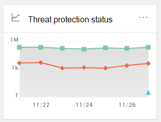

# Sicherheits DashboardSecurity Dashboard

[!INCLUDE [Microsoft 365 Defender rebranding](../includes/microsoft-defender-for-office.md)]

## Grundlegende Funktionen und Öffnen des Sicherheits DashboardsBasic functions and how to open Security Dashboard

Das [Security & Compliance Center](../../compliance/go-to-the-securitycompliance-center.md) ermöglicht Ihrer Organisation das Verwalten von Datenschutz und Compliance.The [Security & Compliance Center](../../compliance/go-to-the-securitycompliance-center.md) enables your organization to manage data protection and compliance. Unter der Voraussetzung, dass Sie über die erforderlichen Berechtigungen verfügen, können Sie mit dem Sicherheits Dashboard den Status des Bedrohungsschutzes überprüfen und Sicherheitswarnungen anzeigen und bearbeiten.Assuming you have the necessary permissions, the Security Dashboard enables you to review your Threat Protection Status, as well as view and act on security alerts.

Sehen Sie sich das Video an, um einen Überblick zu erhalten, und lesen Sie diesen Artikel, um mehr darüber zu erfahren.Watch the video to get an overview, and then read this article to learn more.

> [!VIDEO https://www.microsoft.com/videoplayer/embed/RE1VV3o]

Je nachdem, was das Abonnement Ihrer Organisation umfasst, enthält das Sicherheits Dashboard verschiedene Widgets, wie die in den folgenden Abschnitten beschriebene Zusammenfassung der Bedrohungs Verwaltung, Bedrohungsschutz Status, globale wöchentliche Bedrohungserkennungen, Schadsoftware und vieles mehr.Depending on what your organization's subscription includes, the Security Dashboard includes several widgets, such as Threat Management Summary, Threat Protection Status, Global Weekly Threat Detections, Malware, and more, as described in the following sections.

Um das Sicherheits Dashboard anzuzeigen, wechseln Sie im [Security & Compliance Center](../../compliance/go-to-the-securitycompliance-center.md)zu **Threat Management** \> **Dashboard**.To view the Security Dashboard, in the [Security & Compliance Center](../../compliance/go-to-the-securitycompliance-center.md), go to **Threat management** \> **Dashboard**.

> [!NOTE]
> Sie müssen ein globaler Administrator, ein Sicherheitsadministrator oder ein Sicherheits Leser sein, um das Sicherheits Dashboard anzuzeigen.You must be a global administrator, a security administrator, or a security reader to view the Security Dashboard. Einige Widgets erfordern zusätzliche Berechtigungen zur Anzeige.Some widgets require additional permissions to view. Weitere Informationen finden Sie unter [Permissions in the Security & Compliance Center](permissions-in-the-security-and-compliance-center.md).To learn more, see [Permissions in the Security & Compliance Center](permissions-in-the-security-and-compliance-center.md).

## Threat Management-ZusammenfassungThreat Management Summary

Das Widget "Threat Management Summary" informiert Sie auf einen Blick, wie Ihre Organisation vor Bedrohungen in den letzten sieben (7) Tagen geschützt wurde.The Threat Management Summary widget tells you at a glance how your organization was protected from threats over the past seven (7) days.

Die Informationen, die Sie in der Zusammenfassung des Threat Managements sehen, hängen davon ab, was Ihr Abonnement enthält.The information you'll see in the Threat Management Summary depends on what you subscription includes. In der folgenden Tabelle wird beschrieben, welche Informationen für Office 365 E3 und Office 365 E5 enthalten sind.The following table describes what information is included for Office 365 E3 and Office 365 E5.

|Office 365 E3Office 365 E3|Office 365 E5Office 365 E5|
|---|---|
|Blockierte Schadsoftware-NachrichtenMalware messages blocked Blockierte Phishing-NachrichtenPhishing messages blocked Von Benutzern gemeldete NachrichtenMessages reported by users    |Blockierte Schadsoftware-NachrichtenMalware messages blocked Blockierte Phishing-NachrichtenPhishing messages blocked Von Benutzern gemeldete NachrichtenMessages reported by users Zero-Day-Schadsoftware blockiertZero-day malware blocked Erweiterte Phishing-Nachrichten erkanntAdvanced phishing messages detected Blockierte schädliche URLsMalicious URLs blocked|

Zum Anzeigen oder zugreifen auf das Threat Management-Zusammenfassungs Widget benötigen Sie Berechtigungen zum Anzeigen von Defender für Office 365 Berichte.To view or access the Threat Management Summary widget, you must have permissions to view Defender for Office 365 reports. Weitere Informationen finden Sie unter [welche Berechtigungen sind erforderlich, um den Verteidiger für Office 365 Berichte anzuzeigen?](view-reports-for-atp.md#what-permissions-are-needed-to-view-the-defender-for-office-365-reports).To learn more, see [What permissions are needed to view the Defender for Office 365 reports?](view-reports-for-atp.md#what-permissions-are-needed-to-view-the-defender-for-office-365-reports).

## Bedrohungsschutz StatusThreat Protection Status

Das Threat Protection-Status-Widget zeigt die Effektivität des Bedrohungsschutzes mit einer Trend-und detaillierten Ansicht von Phishing und Schadsoftware.The Threat Protection Status widget shows threat protection effectiveness with a trending and detailed view of phish and malware.

Die Details hängen davon ab, ob Ihr Microsoft 365-Abonnement [Exchange Online Protection](exchange-online-protection-overview.md) (EoP) mit oder ohne [Microsoft Defender für Office 365](office-365-atp.md)enthält.The details depend on whether your Microsoft 365 subscription includes [Exchange Online Protection](exchange-online-protection-overview.md) (EOP) with or without [Microsoft Defender for Office 365](office-365-atp.md).

|Wenn Ihr Abonnement Folgendes enthält...If your subscription includes...|Diese Details werden angezeigt.You'll see these details|
|---|---|
|EoP, jedoch nicht Microsoft Defender für Office 365EOP but not Microsoft Defender for Office 365|Böswillige e-Mails, die von EoP erkannt und blockiert wurden.Malicious email that was detected and blocked by EOP.   Siehe [Threat Protection-Status Bericht (EoP)](view-email-security-reports.md#threat-protection-status-report).See [Threat Protection Status report (EOP)](view-email-security-reports.md#threat-protection-status-report).|
|Microsoft Defender für Office 365Microsoft Defender for Office 365|Böswillige Inhalte und böswillige e-Mails, die von EoP und Defender für Office 365 erkannt und blockiert wurdenMalicious content and malicious email detected and blocked by EOP and Defender for Office 365  Aggregierte Anzahl von eindeutigen e-Mail-Nachrichten mit böswilligen Inhalten, die vom Antischadsoftware-Modul, der [automatischen Säuberungs](zero-hour-auto-purge.md)Zeit und dem Verteidiger für Office 365 Funktionen (einschließlich [sicherer Links](atp-safe-links.md), [sicherer Anlagen](atp-safe-attachments.md)und [Anti-Phishing in Defender für Office 365](set-up-anti-phishing-policies.md#exclusive-settings-in-anti-phishing-policies-in-microsoft-defender-for-office-365)) blockiert wurden.Aggregated count of unique email messages with malicious content blocked by the anti-malware engine, [zero-hour auto purge](zero-hour-auto-purge.md), and Defender for Office 365 features (including [Safe Links](atp-safe-links.md), [Safe Attachments](atp-safe-attachments.md), and [Anti-phishing in Defender for Office 365](set-up-anti-phishing-policies.md#exclusive-settings-in-anti-phishing-policies-in-microsoft-defender-for-office-365)).  Siehe [Threat Protection-Statusbericht](view-reports-for-atp.md#threat-protection-status-report).See [Threat protection status report](view-reports-for-atp.md#threat-protection-status-report).|

Zum Anzeigen oder zugreifen auf das Threat Protection-Status-widget benötigen Sie Berechtigungen zum Anzeigen von Defender für Office 365 Berichte.To view or access the Threat Protection Status widget, you must have permissions to view Defender for Office 365 reports. Weitere Informationen finden Sie unter [welche Berechtigungen sind erforderlich, um den Verteidiger für Office 365 Berichte anzuzeigen?](view-reports-for-atp.md#what-permissions-are-needed-to-view-the-defender-for-office-365-reports)To learn more, see [What permissions are needed to view the Defender for Office 365 reports?](view-reports-for-atp.md#what-permissions-are-needed-to-view-the-defender-for-office-365-reports)

## Globale wöchentliche BedrohungserkennungenGlobal Weekly Threat Detections

Das Global Weekly Threat Detections-Widget zeigt, wie viele Bedrohungen in e-Mail-Nachrichten in den letzten sieben (7) Tagen erkannt wurden.The Global Weekly Threat Detections widget shows how many threats were detected in email messages over the past seven (7) days.

Die Metriken werden wie in der folgenden Tabelle beschrieben berechnet:The metrics are calculated as described in the following table:

|MetrikMetric|BerechnungHow it's calculated|
|---|---|
|Gescannte NachrichtenMessages scanned|Anzahl der gescannten e-Mail-Nachrichten multipliziert mit der Anzahl der EmpfängerNumber of email messages scanned multiplied by the number of recipients|
|Bedrohungen angehaltenThreats stopped|Anzahl von e-Mail-Nachrichten, die mit der Anzahl der Empfänger multipliziert wurden.Number of email messages identified as containing malware multiplied by the number of recipients|
|Von [Defender für Office 365](office-365-atp.md) blockiertBlocked by [Defender for Office 365 ](office-365-atp.md)|Anzahl der von Defender blockierten e-Mail-Nachrichten für Office 365 multipliziert mit der Anzahl der EmpfängerNumber of email messages blocked by Defender for Office 365 multiplied by the number of recipients|
|Nach Zustellung entferntRemoved after delivery|Die Anzahl der Nachrichten, die von der [automatischen Bereinigung ohne Stunden](zero-hour-auto-purge.md) entfernt werden multipliziert mit der Anzahl der EmpfängerNumber of messages removed by [zero-hour auto purge](zero-hour-auto-purge.md) multiplied by the number of recipients|

## SchadsoftwareMalware

Malware-Widgets zeigen Details zu Malware Trends und Malware Familientypen in den letzten sieben (7) Tagen an.Malware widgets show details about malware trends and malware family types over the past seven (7) days.

## InsightsInsights

Insights nicht nur grundlegende Probleme, die Sie überprüfen sollten, sondern auch Empfehlungen und zu berücksichtigende Maßnahmen.Insights not only surface key issues you should review, they also include recommendations and actions to consider.

Beispielsweise können Sie sehen, dass Phishing-e-Mails zugestellt werden, weil einige Benutzer Ihre Junk-e-Mail-Optionen deaktiviert haben.For example, you might see that phishing email messages are being delivered because some users have disabled their junk mail options. Weitere Informationen zur Funktionsweise von Insights finden Sie unter [Reports and Insights in the Security & Compliance Center](reports-and-insights-in-security-and-compliance.md).To learn more about how insights work, see [Reports and insights in the Security & Compliance Center](reports-and-insights-in-security-and-compliance.md).

## Untersuchung von und Antwort auf BedrohungenThreat investigation and response

Wenn das Abonnement Ihrer Organisation  [Microsoft Defender für Office 365 Plan 2](office-365-ti.md)enthält, enthält Ihr Sicherheits Dashboard einen Abschnitt mit erweiterten Tools für die Untersuchung und Antwort auf Bedrohungen.If your organization's subscription includes  [Microsoft Defender for Office 365 Plan 2](office-365-ti.md), your Security Dashboard has a section that includes advanced threat investigation and response tools. Zu diesen Tools zählen [automatisierte Ermittlungs-und Antwortfunktionen](automated-investigation-response-office.md).These tools include [automated investigation and response capabilities](automated-investigation-response-office.md). Automatisierte Untersuchungen und Antworten können in Szenarien wie der [schnellen Adressierung kompromittierter Benutzerkonten](address-compromised-users-quickly.md)hilfreich sein.Automated investigation and response can be helpful in scenarios such as [addressing compromised user accounts quickly](address-compromised-users-quickly.md).

Weitere Informationen finden Sie unter [Erste Schritte mit der automatisierten Untersuchung und Antwort (Air) in Office 365](office-365-air.md).To learn more, see [Get started using Automated investigation and response (AIR) in Office 365](office-365-air.md).

## TrendsTrends

Im unteren Bereich des Sicherheits Dashboards finden Sie einen Abschnitt **Trends** , in dem e-Mail-Fluss Trends für Ihre Organisation zusammengefasst werden.Near the bottom of the Security Dashboard is a **Trends** section, which summarizes email flow trends for your organization. Berichte bieten Informationen zu e-Mail-Nachrichten, die als Spam, Schadsoftware, Phishing-Versuche und gute e-Mails kategorisiert werden.Reports provide information about email categorized as spam, malware, phishing attempts, and good email. Klicken Sie auf eine Kachel, um ausführlichere Informationen im Bericht anzuzeigen.Click a tile to view more detailed information in the report.

Wenn das Abonnement Ihrer Organisation [Defender für Office 365 Plan 2](office-365-ti.md)enthält, haben Sie auch einen Bericht über **aktuelle Threat Management Alerts** in diesem Abschnitt, mit dem Ihr Sicherheitsteam Sicherheitswarnungen mit hoher Priorität anzeigen und ausführen kann.And, if your organization's subscription includes [Defender for Office 365 Plan 2](office-365-ti.md), you will also have a **Recent threat management alerts** report in this section that enables your security team to view and take action on high-priority security alerts.

Zum Anzeigen oder zugreifen auf das gesendete und empfangene e-Mail-widget benötigen Sie Berechtigungen zum Anzeigen von Defender für Office 365 Berichte.To view or access the Sent and Received Email widget, you must have permissions to view Defender for Office 365 reports. Weitere Informationen finden Sie unter [welche Berechtigungen sind erforderlich, um den Verteidiger für Office 365 Berichte anzuzeigen?](view-reports-for-atp.md#what-permissions-are-needed-to-view-the-defender-for-office-365-reports).To learn more, see [What permissions are needed to view the Defender for Office 365 reports?](view-reports-for-atp.md#what-permissions-are-needed-to-view-the-defender-for-office-365-reports).

Zum Anzeigen oder zugreifen auf das zuletzt verwendete Threat Management Alerts-Widget benötigen Sie Berechtigungen zum Anzeigen von Benachrichtigungen.To view or access the Recent Threat Management Alerts widget, you must have permissions to view alerts. Weitere Informationen finden Sie unter [RBAC-Berechtigungen, die zum Anzeigen von Warnungen erforderlich](../../compliance/alert-policies.md#rbac-permissions-required-to-view-alerts)sind.To learn more, see [RBAC permissions required to view alerts](../../compliance/alert-policies.md#rbac-permissions-required-to-view-alerts).

## Verwandte ThemenRelated topics

[Anzeigen von E-Mail-Sicherheitsberichten im Security & Compliance CenterView email security reports in the Security & Compliance Center](view-email-security-reports.md)

[Anzeigen von Berichten für Microsoft Defender für Office 365View reports for Microsoft Defender for Office 365](view-reports-for-atp.md)

[Verteidiger für Office 365Defender for Office 365](office-365-atp.md)

[Untersuchung und Reaktion der Office 365 BedrohungOffice 365 Threat investigation and response](office-365-ti.md)
