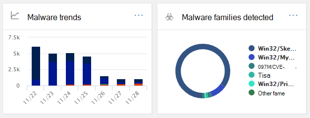
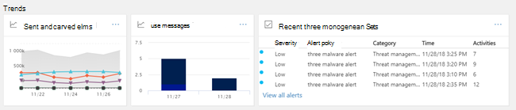

# Sicherheitsdashboard im Security & Compliance Center

[!INCLUDE [Microsoft 365 Defender rebranding](../includes/microsoft-defender-for-office.md)]

## Grundlegende Funktionen und Öffnen des Sicherheitsdashboards

Das Security & Compliance Center at ermöglicht Ihrer Organisation die Verwaltung von <https://protection.office.com> Datenschutz und Compliance. Wenn Sie über die erforderlichen Berechtigungen verfügen, können Sie mit dem Sicherheitsdashboard Ihren Bedrohungsschutzstatus überprüfen sowie Sicherheitswarnungen anzeigen und darauf reagieren.

Sehen Sie sich das Video an, um einen Überblick zu erhalten, und lesen Sie dann diesen Artikel, um mehr zu erfahren.

> [!VIDEO https://www.microsoft.com/videoplayer/embed/RE1VV3o]

Je nachdem, was das Abonnement Ihrer Organisation umfasst, enthält das Sicherheitsdashboard mehrere Widgets, wie z. B. die Zusammenfassung der Bedrohungsverwaltung, den Bedrohungsschutzstatus, globale wöchentliche Bedrohungserkennungen, Schadsoftware und vieles mehr, wie in den folgenden Abschnitten beschrieben.

Um das Sicherheitsdashboard im Security & Compliance Center anzuzeigen, wechseln Sie zum Dashboard für die **Bedrohungsverwaltung.** \>  Um direkt zum Sicherheitsdashboard zu wechseln, verwenden Sie <https://protection.office.com/searchandinvestigation/dashboard> .

> [!NOTE]
> Sie müssen ein globaler Administrator, ein Sicherheitsadministrator oder ein Sicherheitsleseberechtigter sein, um das Sicherheitsdashboard anzuzeigen. Einige Widgets erfordern zusätzliche Berechtigungen zum Anzeigen. Weitere Informationen finden Sie unter ["Berechtigungen" im Security & Compliance Center](permissions-in-the-security-and-compliance-center.md)[.

## Zusammenfassung zur Bedrohungsverwaltung

Das Zusammenfassungs-Widget für die Bedrohungsverwaltung teilt Ihnen auf einen Blick mit, wie Ihre Organisation in den letzten sieben (7) Tagen vor Bedrohungen geschützt wurde.

Welche Informationen in der Zusammenfassung zur Bedrohungsverwaltung angezeigt werden, hängt davon ab, was Ihr Abonnement enthält. In der folgenden Tabelle wird beschrieben, welche Informationen für Office 365 E3 und Office 365 E5 enthalten sind.

 

****

|Office 365 E3|Office 365 E5|
|---|---|
|Schadsoftwarenachrichten blockiert Phishingnachrichten blockiert Von Benutzern gemeldete Nachrichten    |Schadsoftwarenachrichten blockiert Phishingnachrichten blockiert Von Benutzern gemeldete Nachrichten Zero-Day-Schadsoftware blockiert Erweiterte Phishingnachrichten erkannt Bösartige URLs blockiert|
|

Um das Zusammenfassungs-Widget für die Bedrohungsverwaltung anzuzeigen oder darauf zuzugreifen, müssen Sie über Berechtigungen zum Anzeigen von Defender für Office 365 Berichte verfügen. Weitere Informationen finden Sie unter [Welche Berechtigungen sind zum Anzeigen von Defender für Office 365 Berichte erforderlich?](view-reports-for-mdo.md#what-permissions-are-needed-to-view-the-defender-for-office-365-reports).

## Bedrohungsschutzstatus

Das Bedrohungsschutz-Status-Widget zeigt die Effektivität des Bedrohungsschutzes mit einer trendigen und detaillierten Ansicht von Phishing und Schadsoftware.

Die Details hängen davon ab, ob Ihr Microsoft 365-Abonnement [Exchange Online Protection](exchange-online-protection-overview.md) (EOP) mit oder ohne [Microsoft Defender für Office 365](defender-for-office-365.md)enthält.

 

****

|Wenn Ihr Abonnement...|Diese Details werden angezeigt.|
|---|---|
|EOP, aber nicht Microsoft Defender für Office 365|Schädliche E-Mails, die von EOP erkannt und blockiert wurden.
 Siehe [Threat Protection Status Report (EOP)](view-email-security-reports.md#threat-protection-status-report).|
|Microsoft Defender für Office 365|Schädliche Inhalte und schädliche E-Mails, die von EOP und Defender für Office 365 erkannt und blockiert wurden 
 Aggregierte Anzahl eindeutiger E-Mail-Nachrichten mit schädlichen Inhalten, die vom Antischadsoftwaremodul blockiert wurden, der [automatischen Bereinigung](zero-hour-auto-purge.md)zur Nullstunde und Defender für Office 365 Features (einschließlich [Tresor Links,](safe-links.md) [Tresor Anlagen](safe-attachments.md)und [Antiphishing in Defender für Office 365).](set-up-anti-phishing-policies.md#exclusive-settings-in-anti-phishing-policies-in-microsoft-defender-for-office-365) 
 Siehe [Statusbericht zum Bedrohungsschutz.](view-reports-for-mdo.md#threat-protection-status-report)|
|

Um das Bedrohungsschutz-Status-Widget anzuzeigen oder darauf zuzugreifen, müssen Sie über Berechtigungen zum Anzeigen von Defender für Office 365 Berichte verfügen. Weitere Informationen finden Sie unter [Welche Berechtigungen sind zum Anzeigen von Defender für Office 365 Berichte erforderlich?](view-reports-for-mdo.md#what-permissions-are-needed-to-view-the-defender-for-office-365-reports)

## Globale wöchentliche Bedrohungserkennungen

Das Widget "Globale wöchentliche Bedrohungserkennungen" zeigt, wie viele Bedrohungen in den letzten sieben (7) Tagen in E-Mail-Nachrichten erkannt wurden.

Die Metriken werden wie in der folgenden Tabelle beschrieben berechnet:

 

****

|Metrik|Berechnung|
|---|---|
|Gescannte Nachrichten|Anzahl der gescannten E-Mail-Nachrichten multipliziert mit der Anzahl der Empfänger|
|Bedrohungen gestoppt|Anzahl der E-Mail-Nachrichten, die als Schadsoftware enthalten identifiziert wurden, multipliziert mit der Anzahl der Empfänger|
|Von [Defender für Office 365](defender-for-office-365.md) blockiert|Anzahl der von Defender blockierten E-Mail-Nachrichten für Office 365 multipliziert mit der Anzahl der Empfänger|
|Nach Der Zustellung entfernt|Anzahl der Nachrichten, die durch automatische Bereinigung zur [Nullstunde](zero-hour-auto-purge.md) entfernt wurden, multipliziert mit der Anzahl der Empfänger|
|

## Schadsoftware

Malware widgets show details about malware trends and malware family types over the past seven (7) days.

## Einblicke

Insights nicht nur wichtige Probleme, die Sie sich ansehen sollten, anzeigen, sie enthalten auch Empfehlungen und Aktionen, die Sie berücksichtigen sollten.

Beispielsweise können Sie feststellen, dass Phishing-E-Mail-Nachrichten zugestellt werden, da einige Benutzer ihre Junk-E-Mail-Optionen deaktiviert haben. Weitere Informationen zur Funktionsweise von Einblicken finden Sie [unter "Berichte und Einblicke" im Security & Compliance Center.](reports-and-insights-in-security-and-compliance.md)

## Untersuchung von und Antwort auf Bedrohungen

Wenn das Abonnement Ihrer Organisation [Microsoft Defender für Office 365 Plan 2](office-365-ti.md)enthält, verfügt Ihr Sicherheitsdashboard über einen Abschnitt, der erweiterte Tools für die Untersuchung und Reaktion auf Bedrohungen enthält. Diese Tools umfassen [automatisierte Untersuchungs- und Reaktionsfunktionen.](automated-investigation-response-office.md) Eine automatisierte Untersuchung und Reaktion kann in Szenarien wie der [schnellen Adressierung kompromittierten Benutzerkonten](address-compromised-users-quickly.md)hilfreich sein.

Weitere Informationen finden Sie unter [Erste Schritte mit der automatisierten Untersuchung und Reaktion (Air) in Office 365](office-365-air.md).

## Trends

Am unteren Rand des Sicherheitsdashboards befindet sich ein Abschnitt **"Trends",** in dem die E-Mail-Flusstrends für Ihre Organisation zusammengefasst werden. Berichte enthalten Informationen zu E-Mails, die als Spam, Schadsoftware, Phishing-Versuche und gute E-Mails kategorisiert sind. Klicken Sie auf eine Kachel, um ausführlichere Informationen im Bericht anzuzeigen.

Und wenn das Abonnement Ihrer Organisation [Defender für Office 365 Plan 2](office-365-ti.md)enthält, haben Sie in diesem Abschnitt auch einen Bericht über warnungen zur **Bedrohungsverwaltung,** der es Ihrem Sicherheitsteam ermöglicht, Sicherheitswarnungen mit hoher Priorität anzuzeigen und maßnahmen zu ergreifen.

Um das Widget "Gesendete und empfangene E-Mails" anzuzeigen oder darauf zuzugreifen, müssen Sie über Berechtigungen zum Anzeigen von Defender für Office 365 Berichte verfügen. Weitere Informationen finden Sie unter [Welche Berechtigungen sind zum Anzeigen von Defender für Office 365 Berichte erforderlich?](view-reports-for-mdo.md#what-permissions-are-needed-to-view-the-defender-for-office-365-reports).

Um das Widget "Zuletzt verwendete Bedrohungsverwaltungswarnungen" anzuzeigen oder darauf zuzugreifen, müssen Sie über Berechtigungen zum Anzeigen von Warnungen verfügen. Weitere Informationen finden Sie unter [RBAC-Berechtigungen, die zum Anzeigen von Warnungen erforderlich sind.](../../compliance/alert-policies.md#rbac-permissions-required-to-view-alerts)

## Verwandte Artikel

[Anzeigen von E-Mail-Sicherheitsberichten im Security & Compliance Center](view-email-security-reports.md)

[Anzeigen von Berichten für Microsoft Defender für Office 365](view-reports-for-mdo.md)

[Defender for Office 365](defender-for-office-365.md)

[Office 365 Untersuchung und Reaktion auf Bedrohungen](office-365-ti.md)
