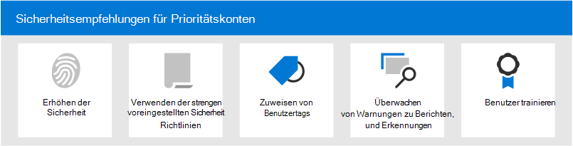

# Sicherheitsempfehlungen für Prioritätskonten in Microsoft 365Security recommendations for priority accounts in Microsoft 365

Nicht alle Benutzerkonten haben Zugriff auf dieselben Unternehmensinformationen.Not all user accounts have access to the same company information. Einige Konten haben Zugriff auf vertrauliche Informationen, z. B. Finanzdaten, Produktentwicklungsinformationen, Partnerzugriff auf kritische Buildsysteme und vieles mehr.Some accounts have access to sensitive information, such as financial data, product development information, partner access to critical build systems, and more. Wenn sie gefährdet sind, stellen Konten, die Zugriff auf streng vertrauliche Informationen haben, eine schwerwiegende Bedrohung dar.If compromised, accounts that have access to highly confidential information pose a serious threat. Wir bezeichnen diese Arten von Konten _als Prioritätskonten._We call these types of accounts _priority accounts_. Zu den Prioritätskonten gehören (aber nicht beschränkt auf) CEOs, CISOs, CFOs, Infrastrukturadministratorkonten, Buildsystemkonten und vieles mehr.Priority accounts include (but aren't limited to) CEOs, CISOs, CFOs, infrastructure admin accounts, build system accounts, and more.

Für Angreifer sind gewöhnliche Phishingangriffe, die ein zufälliges Netz für gewöhnliche oder unbekannte Benutzer umvariablen, ineffizient.For attackers, ordinary phishing attacks that cast a random net for ordinary or unknown users are inefficient. Andererseits sind _Phishing- oder_ _Whalingangriffe,_ die auf Prioritätskonten zielen, für Angreifer sehr lohnend.On the other hand, _spear phishing_ or _whaling_ attacks that target priority accounts are very rewarding for attackers. Daher erfordern Prioritätskonten einen stärkeren Als gewöhnlichen Schutz, um eine Kontoberomittung zu verhindern.So, priority accounts require stronger than ordinary protection to help prevent account compromise.

Microsoft 365 und Microsoft Defender für Office 365 enthalten mehrere wichtige Features, die zusätzliche Sicherheitsebenen für Ihre Prioritätskonten bereitstellen.Microsoft 365 and Microsoft Defender for Office 365 contain several key features that provide additional layers of security for your priority accounts. In diesem Artikel werden diese Funktionen und deren Verwendung beschrieben.This article describes these capabilities and how to use them.

****

|AufgabeTask|Alle Office 365 Enterprise-PläneAll Office 365 Enterprise plans|Microsoft 365 E3Microsoft 365 E3|Microsoft 365 E5Microsoft 365 E5|
|---|:---:|:---:|:---:|
|[Erhöhen der Anmeldesicherheit für PrioritätskontenIncrease sign-in security for priority accounts](#increase-sign-in-security-for-priority-accounts)||||
|[Verwenden von strengen voreingestellten Sicherheitsrichtlinien für PrioritätskontenUse Strict preset security policies for priority accounts](#use-strict-preset-security-policies-for-priority-accounts)||||
|[Anwenden von Benutzertags auf PrioritätskontenApply user tags to priority accounts](#apply-user-tags-to-priority-accounts)||||
|[Überwachen von Prioritätskonten in Warnungen, Berichten und ErkennungenMonitor priority accounts in alerts, reports, and detections](#monitor-priority-accounts-in-alerts-reports-and-detections)||||
|[Benutzer trainierenTrain users](#train-users)||||
|

## Erhöhen der Anmeldesicherheit für PrioritätskontenIncrease sign-in security for priority accounts

Prioritätskonten erfordern erhöhte Anmeldesicherheit.Priority accounts require increased sign-in security. Sie können die Anmeldesicherheit erhöhen, indem Sie die mehrstufige Authentifizierung (Multi-Factor Authentication, MFA) erfordern und Legacyauthentifizierungsprotokolle deaktivieren.You can increase their sign-in security by requiring multi-factor authentication (MFA) and disabling legacy authentication protocols.

Anweisungen finden Sie unter [Schritt 1. Erhöhen Sie die Anmeldesicherheit für Remotemitarbeiter mit MFA.](https://docs.microsoft.com/microsoft-365/solutions/empower-people-to-work-remotely-secure-sign-in)For instructions, see [Step 1. Increase sign-in security for remote workers with MFA](https://docs.microsoft.com/microsoft-365/solutions/empower-people-to-work-remotely-secure-sign-in). Obwohl es in diesem Artikel um Remotemitarbeiter geht, gelten die gleichen Konzepte für Benutzer mit Priorität.Although this article is about remote workers, the same concepts apply to priority users.

**Hinweis:** Es wird dringend empfohlen, legacybasierte Authentifizierungsprotokolle für alle Benutzer mit Priorität global zu deaktivieren, wie im vorherigen Artikel beschrieben.**Note**: We strongly recommend that you globally disable legacy authentication protocols for all priority users as described in the previous article. Wenn Ihre geschäftlichen Anforderungen Sie daran hindern, bietet Exchange Online die folgenden Steuerelemente, um den Umfang der Legacyauthentifizierungsprotokolle zu begrenzen:If your business requirements prevent you from doing so, Exchange Online offers the following controls to help limit the scope of legacy authentication protocols:

- Sie können [Authentifizierungsrichtlinien](https://docs.microsoft.com/exchange/clients-and-mobile-in-exchange-online/disable-basic-authentication-in-exchange-online) und [Clientzugriffsregeln](https://docs.microsoft.com/exchange/clients-and-mobile-in-exchange-online/client-access-rules/client-access-rules) in Exchange Online verwenden, um Standardauthentifizierungs- und Legacyauthentifizierungsprotokolle wie POP3, IMAP4 und authentifizierte SMTP für bestimmte Benutzer zu blockieren oder zu erlauben.You can use [authentication policies](https://docs.microsoft.com/exchange/clients-and-mobile-in-exchange-online/disable-basic-authentication-in-exchange-online) and [Client Access Rules](https://docs.microsoft.com/exchange/clients-and-mobile-in-exchange-online/client-access-rules/client-access-rules) in Exchange Online to block or allow Basic authentication and legacy authentication protocols like POP3, IMAP4, and authenticated SMTP for specific users.

- Sie können den POP3- und den IMAP4-Zugriff auf einzelne Postfächer deaktivieren.You can disable POP3 and IMAP4 access on individual mailboxes. Sie können authentifizierte SMTP auf Organisationsebene deaktivieren und für bestimmte Postfächer aktivieren, für die dies noch erforderlich ist.You can disable authenticated SMTP at the organizational level and enable it on specific mailboxes that still require it. Anweisungen finden Sie in den folgenden Themen:For instructions, see the following topics:
  - [Aktivieren oder Deaktivieren des POP3- oder IMAP4-Zugriffs für einen BenutzerEnable or Disable POP3 or IMAP4 access for a user](https://docs.microsoft.com/exchange/clients-and-mobile-in-exchange-online/pop3-and-imap4/enable-or-disable-pop3-or-imap4-access)
  - [Aktivieren oder Deaktivieren der authentifizierten Client-SMTP-Übermittlung (SMTP AUTH)Enable or disable authenticated client SMTP submission (SMTP AUTH)](https://docs.microsoft.com/exchange/clients-and-mobile-in-exchange-online/authenticated-client-smtp-submission)

Es ist auch erwähnenswert, dass die Standardauthentifizierung in Exchange Online für Exchange Web Services (EWS), Exchange ActiveSync, POP3, IMAP4 und Remote PowerShell veraltet ist.It's also worth noting that Basic authentication is in the process of being deprecated in Exchange Online for Exchange Web Services (EWS), Exchange ActiveSync, POP3, IMAP4, and remote PowerShell. Weitere Informationen finden Sie in diesem [Blogbeitrag.](https://developer.microsoft.com/office/blogs/deferred-end-of-support-date-for-basic-authentication-in-exchange-online/)For details, see this [blog post](https://developer.microsoft.com/office/blogs/deferred-end-of-support-date-for-basic-authentication-in-exchange-online/).

## Verwenden von strengen voreingestellten Sicherheitsrichtlinien für PrioritätskontenUse Strict preset security policies for priority accounts

Benutzer mit Priorität erfordern strengere Aktionen für die verschiedenen Schutzmaßnahmen, die in Exchange Online Protection (EOP) und Defender für Office 365 verfügbar sind.Priority users require more stringent actions for the various protections that are available in Exchange Online Protection (EOP) and Defender for Office 365.

Anstatt beispielsweise Nachrichten, die als Spam klassifiziert wurden, in den Junk-E-Mail-Ordner zu senden, sollten Sie dieselben Nachrichten unter Quarantäne stellen, wenn sie für Prioritätskonten vorgesehen sind.For example, instead of delivering messages that were classified as spam to the Junk Email folder, you should quarantine those same messages if they're intended for priority accounts.

Sie können diesen strikten Ansatz für Prioritätskonten implementieren, indem Sie das Profil "Strict" in voreingestellten Sicherheitsrichtlinien verwenden.You can implement this stringent approach for priority accounts by using the Strict profile in preset security policies.

Voreingestellte Sicherheitsrichtlinien sind ein bequemer und zentraler Ort, um die empfohlenen "Strict"-Richtlinieneinstellungen für alle Schutzmaßnahmen in EOP und Defender für Office 365 anzuwenden.Preset security policies are a convenient and central location to apply our recommended Strict policy settings for all of the protections in EOP and Defender for Office 365. Weitere Informationen finden Sie unter [voreingestellte Sicherheitsrichtlinien in EOP und Microsoft Defender für Office 365](preset-security-policies.md).For more information, see [Preset security policies in EOP and Microsoft Defender for Office 365](preset-security-policies.md).

Weitere Informationen dazu, wie sich die Strikte Richtlinieneinstellungen von den Standard- und Standardrichtlinieneinstellungen unterscheiden, finden Sie unter "Empfohlene Einstellungen für EOP und [Microsoft Defender für Office 365-Sicherheit".](recommended-settings-for-eop-and-office365-atp.md)For details about how the Strict policy settings differ from the the default and Standard policy settings, see [Recommended settings for EOP and Microsoft Defender for Office 365 security](recommended-settings-for-eop-and-office365-atp.md).

## Anwenden von Benutzertags auf PrioritätskontenApply user tags to priority accounts

Benutzertags in Microsoft Defender für Office 365 Plan 2 (als Teil von Microsoft 365 E5 oder einem Add-On-Abonnement) sind eine Möglichkeit, bestimmte Benutzer oder Benutzergruppen in Berichten und Vorfalluntersuchungen schnell zu identifizieren und zu klassifizieren.User tags in Microsoft Defender for Office 365 Plan 2 (as part of Microsoft 365 E5 or an add-on subscription) are a way to quickly identify and classify specific users or groups of users in reports and incident investigations.

**Bei Prioritätskonten** handelt es sich um eine Art von integriertem Benutzertag (auch als Systemtag bezeichnet), mit dem Sie Vorfälle und Warnungen identifizieren können, die Prioritätskonten betreffen.**Priority accounts** is a type of built-in user tag (known as a _system tag_) that you can use to identify incidents and alerts that involve priority accounts. Weitere Informationen zu **Prioritätskonten finden** Sie unter ["Verwalten und Überwachen von Prioritätskonten".](https://docs.microsoft.com/microsoft-365/admin/setup/priority-accounts)For more information about **priority accounts**, see [Manage and monitor priority accounts](https://docs.microsoft.com/microsoft-365/admin/setup/priority-accounts).

Sie können auch benutzerdefinierte Tags erstellen, um Ihre Prioritätskonten weiter zu identifizieren und zu klassifizieren.You can also create custom tags to further identify and classify your priority accounts. Weitere Informationen finden Sie unter [Benutzertags.](user-tags.md)For more information, see [User tags](user-tags.md). Beachten Sie, dass Sie **Prioritätskonten** (Systemtags) auf derselben Benutzeroberfläche wie benutzerdefinierte Benutzertags verwalten können.Note that you can manage **priority accounts** (system tags) in the same interface as custom user tags.

## Überwachen von Prioritätskonten in Warnungen, Berichten und ErkennungenMonitor priority accounts in alerts, reports, and detections

Nachdem Sie Ihre Prioritätsbenutzer gesichert und identifiziert haben, können Sie die verfügbaren Berichte, Warnungen und Untersuchungen in EOP und Defender für Office 365 verwenden, um Vorfälle oder Erkennungen mit Prioritätskonten schnell zu identifizieren.After you secure and tag your priority users, you can use the available reports, alerts, and investigations in EOP and Defender for Office 365 to quickly identify incidents or detections that involve priority accounts. Die Features, die Benutzertags unterstützen, werden in der folgenden Tabelle beschrieben.The features that support user tags are described in the following table.

 

****

|FeatureFeature|BeschreibungDescription|
|---|---|
|WarnungenAlerts|Die Benutzertags der betroffenen Benutzer sind als  Filter auf der Seite Benachrichtigungen anzeigen im Security & Compliance Center sichtbar und verfügbar.The user tags of affected users are visible and available as filters on the **View alerts** page in the Security & Compliance Center. Weitere Informationen finden Sie unter Anzeigen [von Warnungen.](https://docs.microsoft.com/microsoft-365/compliance/alert-policies#viewing-alerts)For more information, see [Viewing alerts](https://docs.microsoft.com/microsoft-365/compliance/alert-policies#viewing-alerts).|
|Sicherheitsrisiken-ExplorerThreat Explorer 
 EchtzeiterkennungenReal-time detections|Im **Bedrohungs-Explorer** (Microsoft Defender für Office 365 Plan 2) oder in Echtzeiterkennungen (Microsoft Defender für Office 365 Plan 1) werden Benutzertags in der Ansicht "E-Mail-Raster" und im Flyout **"E-Mail-Details"** angezeigt.In **Threat Explorer** (Microsoft Defender for Office 365 Plan 2) or **Real-time detections** (Microsoft Defender for Office 365 Plan 1), user tags are visible in the Email grid view and the Email details flyout. Benutzertags sind auch als filterbare Eigenschaft verfügbar.User tags are also available as a filterable property. Weitere Informationen finden Sie unter [Tags im Bedrohungs-Explorer.](threat-explorer.md#tags-in-threat-explorer)For more information, see  [Tags in Threat Explorer](threat-explorer.md#tags-in-threat-explorer).|
|KampagnenansichtenCampaign Views|Benutzertags sind eine von vielen filterbaren Eigenschaften in Kampagnenansichten in Microsoft Defender für Office 365 Plan 2.User tags are one of many filterable properties in Campaign Views in Microsoft Defender for Office 365 Plan 2. Weitere Informationen finden Sie unter [Kampagnenansichten](campaigns.md).For more information, see [Campaign Views](campaigns.md).|
|Threat Protection-StatusberichtThreat protection status report|In praktisch allen Ansichten und Detailtabellen im Statusbericht über Bedrohungsschutz können Sie die Ergebnisse nach **Prioritätskonten filtern.** In virtually all of the views and detail tables in the **Threat protection status report**, you can filter the results by **priority accounts**. Weitere Informationen finden Sie im [Statusbericht zum Bedrohungsschutz.](view-email-security-reports.md#threat-protection-status-report)For more information, see [Threat protection status report](view-email-security-reports.md#threat-protection-status-report).|
|E-Mail-Probleme bei PrioritätskontenberichtEmail issues for priority accounts report|Der **Bericht "E-Mail-Probleme** bei Prioritätskonten" im Exchange Admin Center (EAC) enthält Informationen zu nicht zugestellten und verzögerten Nachrichten für **Prioritätskonten.**The **Email issues for priority accounts** report in the Exchange admin center (EAC) contains information about undelivered and delayed messages for **priority accounts**. Weitere Informationen finden Sie im Bericht [zu E-Mail-Problemen mit Prioritätskonten.](https://docs.microsoft.com/exchange/monitoring/mail-flow-reports/mfr-email-issues-for-priority-accounts-report)For more information, see [Email issues for priority accounts report](https://docs.microsoft.com/exchange/monitoring/mail-flow-reports/mfr-email-issues-for-priority-accounts-report).|
|

## Benutzer trainierenTrain users

Die Schulung von Benutzern mit Prioritätskonten kann dazu beitragen, diese Benutzer und Ihr Sicherheitsteam viel Zeit und Frustration zu sparen.Training users with priority accounts can help save those users and your security operations team much time and frustration. Versierte Benutzer sind weniger wahrscheinlich, Anlagen zu öffnen oder auf Links in fragwürdigen E-Mail-Nachrichten zu klicken, und sie vermeiden eher verdächtige Websites.Savvy users are less likely to open attachments or click links in questionable email messages, and they are more likely to avoid suspicious websites.

Das Handbuch zur Cybersicherheitskampagne der "University [OfEnding](https://www.belfercenter.org/CyberPlaybook) School" bietet hervorragende Anleitungen zum Aufbau einer starken Kultur des Sicherheitsbewusstseins in Ihrer Organisation, einschließlich der Schulung von Benutzern zur Identifizierung von Phishingangriffen.The Harvard Kennedy School [Cybersecurity Campaign Handbook](https://www.belfercenter.org/CyberPlaybook) provides excellent guidance for establishing a strong culture of security awareness within your organization, including training users to identify phishing attacks.

Microsoft 365 bietet die folgenden Ressourcen, um Benutzer in Ihrer Organisation zu informieren:Microsoft 365 provides the following resources to help inform users in your organization:

 

****

|KonzeptConcept|RessourcenResources|BeschreibungDescription|
|---|---|---|
|Microsoft 365Microsoft 365|[Anpassbare LernpfadeCustomizable learning pathways](https://docs.microsoft.com/office365/customlearning/)|Diese Ressourcen können Ihnen dabei helfen, Schulungen für Benutzer in Ihrer Organisation zusammen zu stellen.These resources can help you put together training for users in your organization.|
|Microsoft 365 Security CenterMicrosoft 365 security|[Lernmodul: Sichern Ihrer Organisation mit integrierter, intelligenter Sicherheit von Microsoft 365Learning module: Secure your organization with built-in, intelligent security from Microsoft 365](https://docs.microsoft.com/learn/modules/security-with-microsoft-365)|In diesem Modul können Sie beschreiben, wie Microsoft 365-Sicherheitsfeatures zusammenarbeiten und welche Vorteile diese Sicherheitsfeatures bieten.This module enables you to describe how Microsoft 365 security features work together and to articulate the benefits of these security features.|
|Mehrstufige AuthentifizierungMulti-factor authentication|[Überprüfung in zwei Schritten: Was ist die zusätzliche Überprüfungsseite?Two-step verification: What is the additional verification page?](https://docs.microsoft.com/azure/active-directory/user-help/multi-factor-authentication-end-user-first-time)|Dieser Artikel hilft Endbenutzern zu verstehen, was die mehrstufige Authentifizierung ist und warum sie in Ihrer Organisation verwendet wird.This article helps end users understand what multi-factor authentication is and why it's being used at your organization.|
|Schulung zur AngriffssimulationAttack simulation training|[Erste Schritte mit dem AngriffssimulationstrainingGet started using Attack simulation training](attack-simulation-training-get-started.md)|Mit der Schulung zur Angriffssimulation in Microsoft Defender für Office 365 Plan 2 können Administratoren simulierte Phishingangriffe auf bestimmte Benutzergruppen konfigurieren, starten und nachverfolgen.Attack simulation training in Microsoft Defender for Office 365 Plan 2 allows admin to configure, launch, and track simulated phishing attacks against specific groups of users.|

Darüber hinaus empfiehlt Microsoft Benutzern, die in diesem Artikel beschriebenen Aktionen zu ergreifen: Schützen Ihres Kontos und Ihrer Geräte [vor Hackern und Schadsoftware.](https://support.microsoft.com/office/066d6216-a56b-4f90-9af3-b3a1e9a327d6)In addition, Microsoft recommends that users take the actions described in this article: [Protect your account and devices from hackers and malware](https://support.microsoft.com/office/066d6216-a56b-4f90-9af3-b3a1e9a327d6). Diese setzen sich wie folgt zusammen:These actions include:

- Verwenden von starken KennwörternUsing strong passwords
- Schützen von GerätenProtecting devices
- Aktivieren von Sicherheitsfeatures auf Windows 10- und Mac-PCs (für nicht verwaltete Geräte)Enabling security features on Windows 10 and Mac PCs (for unmanaged devices)

## Weitere Informationen:See also

[Ankündigung von Prioritätskontoschutz in Microsoft Defender für Office 365Announcing Priority Account Protection in Microsoft Defender for Office 365](https://techcommunity.microsoft.com/t5/microsoft-defender-for-office/announcing-priority-account-protection-in-microsoft-defender-for/ba-p/1696385)
