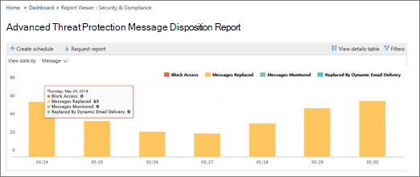
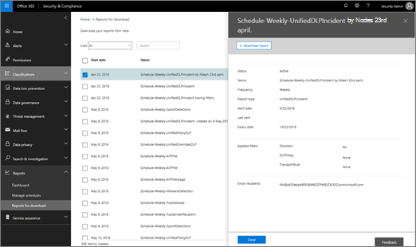

# Einrichten und Herunterladen eines benutzerdefinierten Berichts im Security &amp; Compliance Center

Im [ &amp; Security Compliance Center](https://protection.office.com)stehen mehrere [Berichte und Einblicke](reports-and-insights-in-security-and-compliance.md) zur Verfügung, mit denen das Sicherheitsteam Ihrer Organisation Bedrohungen für Ihre Organisation entschärfen und adressieren kann. Wenn Sie ein Mitglied des Sicherheitsteams Ihrer Organisation sind, können Sie einen Bericht mit benutzerdefinierten Datumsbereichen und Filtern konfigurieren und dann den benutzerdefinierten Bericht herunterladen. 
  
## Herunterladen eines benutzerdefinierten Berichts

> [!IMPORTANT]
> Stellen Sie sicher, dass Sie über die erforderlichen [Berechtigungen für &amp; das Security Compliance Center](permissions-in-the-security-and-compliance-center.md)verfügen. Im Allgemeinen können globale Administratoren, Sicherheitsadministratoren und Sicherheits Leser auf Berichte im Security &amp; Compliance Center zugreifen. 
  
1. Wechseln Sie [im &amp; Security Compliance Center](https://protection.office.com)zu **Berichte** \> - **Dashboard**.
    
2. Wählen Sie einen Bericht aus. (In diesem Beispiel wird der Bericht zur Nachrichten Disposition verwendet.) 
  
3. Wählen Sie in der oberen linken Ecke des Berichts **Anforderungsbericht**aus.
    
4. Geben Sie im Dialogfeld **Anforderungsbericht** einen Namen, ein Startdatum und ein Enddatum für den Bericht an. Klicken Sie dann auf **weiter**. 
  
5. Geben Sie alle Filter an, die Sie für den Bericht verwenden möchten. (Sie können beispielsweise eine Client-IP-Adresse für den Bericht zur Nachrichten Disposition angeben.) Klicken Sie dann auf **weiter**.
    
6. Geben Sie e-Mail-Empfänger für den Bericht an, und wählen Sie dann **Speichern**aus.
    
## Verwandte Themen

[Berichte und Einblicke im &amp; Security Compliance Center](reports-and-insights-in-security-and-compliance.md)
  
[Erstellen eines Zeitplans für einen Bericht im &amp; Security Compliance Center](create-a-schedule-for-a-report.md)
  
[Verwalten von Zeitplänen für Berichte im &amp; Security Compliance Center](manage-schedules-for-multiple-reports.md)
  
[Herunterladen vorhandener Berichte im Security &amp; Compliance Center](download-existing-reports.md)
  

