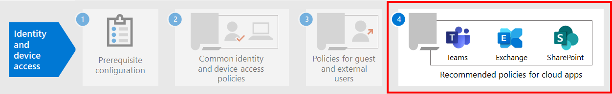

# Richtlinienempfehlungen zum Sichern von SharePoint-Websites und -Dateien

In diesem Artikel wird beschrieben, wie Sie die empfohlenen Identitäts- und Gerätezugriffsrichtlinien zum Schutz von SharePoint und OneDrive for Business implementieren. Dieser Leitfaden baut auf den [allgemeinen Identitäts- und Gerätezugriffsrichtlinien auf.](identity-access-policies.md)

Diese Empfehlungen basieren auf drei verschiedenen Sicherheits- und Schutzebenen für SharePoint-Dateien, die basierend auf der Granularität Ihrer Anforderungen angewendet werden **können:** **Basisplan,** vertraulich und hochgradig **reguliert.** Weitere Informationen zu diesen Sicherheitsebenen und den empfohlenen Clientbetriebssystemen, auf die in diesen Empfehlungen verwiesen wird, finden Sie in [der Übersicht.](microsoft-365-policies-configurations.md)

Stellen Sie zusätzlich zur Implementierung dieser Anleitung sicher, dass Sie die SharePoint-Websites mit dem richtigen Schutz konfigurieren, einschließlich der Festlegung geeigneter Berechtigungen für vertrauliche und stark regulierte Inhalte.

## Aktualisieren gängiger Richtlinien für SharePoint und OneDrive for Business

Zum Schutz von Dateien in SharePoint und OneDrive zeigt das folgende Diagramm, welche Richtlinien aus den allgemeinen Identitäts- und Gerätezugriffsrichtlinien aktualisiert werden.

[Sehen Sie sich eine größere Version dieses Bilds an.](https://github.com/MicrosoftDocs/microsoft-365-docs/raw/public/microsoft-365/media/microsoft-365-policies-configurations/identity-access-ruleset-sharepoint.png)

Wenn Sie SharePoint beim Erstellen der allgemeinen Richtlinien eingeschlossen haben, müssen Sie nur die neuen Richtlinien erstellen. Für Richtlinien für bedingten Zugriff enthält SharePoint OneDrive.

Die neuen Richtlinien implementieren den Geräteschutz für vertrauliche und stark regulierte Inhalte, indem bestimmte Zugriffsanforderungen auf von Ihnen festgelegte SharePoint-Websites angewendet werden.

In der folgenden Tabelle sind die Richtlinien aufgeführt, die Sie entweder überprüfen und aktualisieren oder neue für SharePoint erstellen müssen. Die allgemeinen Richtlinien sind mit den zugehörigen Konfigurationsanweisungen im Artikel ["Allgemeine Identitäts- und Gerätezugriffsrichtlinien"](identity-access-policies.md) verknüpft.

|Schutzebene|Richtlinien|Weitere Informationen|
|---|---|---|
|**Basisplan**|[MFA erforderlich, wenn das Anmelderisiko *mittel oder* hoch *ist*](identity-access-policies.md#require-mfa-based-on-sign-in-risk)|Fügen Sie SharePoint in die Zuweisung von Cloud-Apps ein.|
||[Blockieren von Clients, die die moderne Authentifizierung nicht unterstützen](identity-access-policies.md#block-clients-that-dont-support-modern-authentication)|Fügen Sie SharePoint in die Zuweisung von Cloud-Apps ein.|
||[Anwenden von APP-Datenschutzrichtlinien](identity-access-policies.md#apply-app-data-protection-policies)|Stellen Sie sicher, dass alle empfohlenen Apps in der Liste der Apps enthalten sind. Achten Sie darauf, die Richtlinie für jede Plattform (iOS, Android, Windows) zu aktualisieren.|
||[Kompatible PCs erforderlich](identity-access-policies.md#require-compliant-pcs-but-not-compliant-phones-and-tablets)|Fügen Sie SharePoint in die Liste der Cloud-Apps ein.|
||[Verwenden erzwungener Einschränkungen für Apps in SharePoint](#use-app-enforced-restrictions-in-sharepoint)|Fügen Sie diese neue Richtlinie hinzu. Dies weist Azure Active Directory (Azure AD) an, die in SharePoint angegebenen Einstellungen zu verwenden. Diese Richtlinie gilt für alle Benutzer, betrifft jedoch nur den Zugriff auf Websites, die in den SharePoint-Zugriffsrichtlinien enthalten sind.|
|**Vertraulich**|[MFA erforderlich, wenn das Anmelderisiko *niedrig,* *mittel oder* hoch *ist*](identity-access-policies.md#require-mfa-based-on-sign-in-risk)|Fügen Sie SharePoint in die Zuweisungen von Cloud-Apps ein.|
||[Kompatible *PCs* und mobile Geräte erforderlich](identity-access-policies.md#require-compliant-pcs-and-mobile-devices)|Fügen Sie SharePoint in die Liste der Cloud-Apps ein.|
||[SharePoint-Zugriffssteuerungsrichtlinie:](#sharepoint-access-control-policies)Zulassen des ausschließlichen Browserzugriffs auf bestimmte SharePoint-Websites von nicht verwalteten Geräten aus.|Dadurch wird das Bearbeiten und Herunterladen von Dateien verhindert. Verwenden Sie PowerShell, um Websites anzugeben.|
|**Streng geregelt**|[*MFA* immer erforderlich](identity-access-policies.md#require-mfa-based-on-sign-in-risk)|Fügen Sie SharePoint in die Zuweisung von Cloud-Apps ein.|
||[SharePoint-Zugriffssteuerungsrichtlinie:](#use-app-enforced-restrictions-in-sharepoint)Blockieren des Zugriffs auf bestimmte SharePoint-Websites von nicht verwalteten Geräten.|Verwenden Sie PowerShell, um Websites anzugeben.|
|

## Verwenden von von apps erzwungenen Einschränkungen in SharePoint

Wenn Sie Zugriffssteuerungen in SharePoint implementieren, müssen Sie diese Richtlinie für bedingten Zugriff in Azure AD erstellen, damit Azure AD die richtlinien erzwingen kann, die Sie in SharePoint konfigurieren. Diese Richtlinie gilt für alle Benutzer, betrifft jedoch nur den Zugriff auf die Websites, die Sie mithilfe von PowerShell angeben, wenn Sie die Zugriffssteuerungen in SharePoint erstellen.

Informationen zum Konfigurieren dieser Richtlinie finden Sie unter "Blockieren oder Einschränken des Zugriffs auf bestimmte #A0 oder OneDrive-Konten" im Thema "Steuern des Zugriffs von nicht [verwalteten Geräten".](https://docs.microsoft.com/sharepoint/control-access-from-unmanaged-devices)

## Zugriffssteuerungsrichtlinien für SharePoint

Microsoft empfiehlt, Inhalte auf SharePoint-Websites mit vertraulichen und hochgradig regulierten Inhalten mit Gerätezugriffssteuerungen zu schützen. Erstellen Sie dazu eine Richtlinie, die die Schutzebene und die Websites angibt, auf die der Schutz angewendet werden soll.

- Vertrauliche Websites: Nur Browserzugriff zulassen. Dadurch wird verhindert, dass Benutzer Dateien bearbeiten und herunterladen.
- Stark regulierte Websites: Blockieren des Zugriffs von nicht verwalteten Geräten.

Weitere Informationen finden Sie unter "Blockieren oder Einschränken des Zugriffs auf bestimmte #A0 oder OneDrive-Konten" im Steuerelement für den Zugriff von [nicht verwalteten Geräten.](https://docs.microsoft.com/sharepoint/control-access-from-unmanaged-devices)

## Funktionsweise dieser Richtlinien

Es ist wichtig zu wissen, dass Berechtigungen für die SharePoint-Website in der Regel auf geschäftsbezogenen Zugriffsberechtigungen für Websites basieren. Diese Berechtigungen werden von Websitebesitzern verwaltet und können hochgradig dynamisch sein. Die Verwendung von Richtlinien für den Gerätezugriff in SharePoint gewährleistet den Schutz dieser Websites, unabhängig davon, ob Benutzer einer Azure AD-Gruppe zugewiesen sind, die dem grundlegenden, vertraulichen oder hochgradig regulierten Schutz zugeordnet ist.

Die folgende Abbildung enthält ein Beispiel dafür, wie SharePoint-Gerätezugriffsrichtlinien den Zugriff auf Websites für einen Benutzer schützen.

[Sehen Sie sich eine größere Version dieses Bilds an.](https://github.com/MicrosoftDocs/microsoft-365-docs/raw/public/microsoft-365/media/microsoft-365-policies-configurations/SharePoint-rules-scenario.png)

James hat grundlegende Richtlinien für bedingten Zugriff zugewiesen, aber er kann Zugriff auf SharePoint-Websites mit vertraulichem oder hochgradig regulierten Schutz erhalten.

- Wenn James auf eine vertrauliche oder stark regulierte Website zu zugegriffen hat, ist er Mitglied der Verwendung seines PCs, wird sein Zugriff gewährt, solange sein PC kompatibel ist.
- Wenn James auf eine vertrauliche Website zukommt, ist er Mitglied der Verwendung seines nicht verwalteten Telefons, das für Basisbenutzer zulässig ist, und erhält aufgrund der für diese Website konfigurierten Gerätezugriffsrichtlinie nur Browserzugriff auf die vertrauliche Website.
- Wenn James auf eine stark regulierte Website zu zugegriffen hat, ist er Mitglied der Verwendung seines nicht verwalteten Telefons, wird er aufgrund der für diese Website konfigurierten Zugriffsrichtlinie blockiert. Er kann nur über seinen verwalteten und kompatiblen PC auf diese Website zugreifen.

## Nächster Schritt

Konfigurieren Sie Richtlinien für bedingten Zugriff für:

- [Microsoft Teams](teams-access-policies.md)
- [Exchange Online](secure-email-recommended-policies.md)
