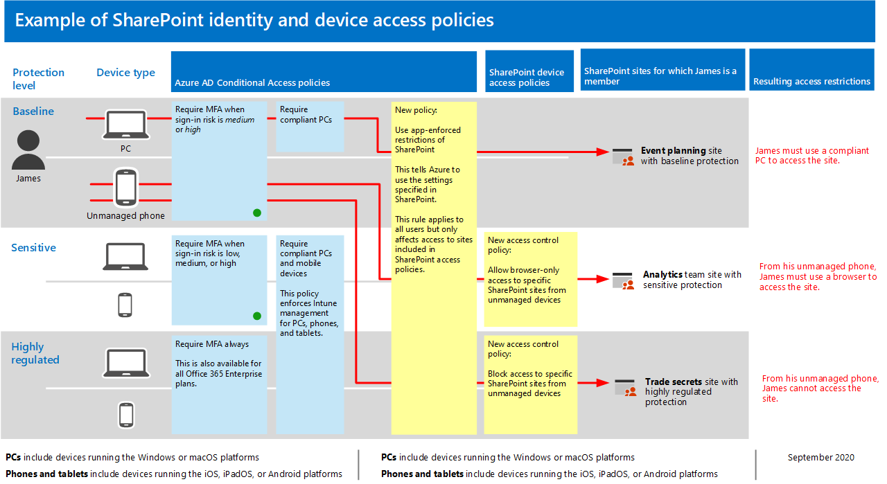

# Richtlinienempfehlungen zum Schützen von SharePoint-Websites und -DateienPolicy recommendations for securing SharePoint sites and files

**Gilt für****Applies to**
- [Exchange Online ProtectionExchange Online Protection](exchange-online-protection-overview.md)
- [Microsoft Defender für Office 365 Plan 1 und Plan 2Microsoft Defender for Office 365 plan 1 and plan 2](office-365-atp.md)
- SharePoint OnlineSharePoint Online 

In diesem Artikel wird beschrieben, wie Sie die empfohlenen Identitäts- und Gerätezugriffsrichtlinien zum Schutz von SharePoint und OneDrive for Business implementieren.This article describes how to implement the recommended identity and device-access policies to protect SharePoint and OneDrive for Business. Diese Anleitung baut auf den [allgemeinen Identitäts- und Gerätezugriffsrichtlinien auf.](identity-access-policies.md)This guidance builds on the [common identity and device access policies](identity-access-policies.md).

Diese Empfehlungen basieren auf drei verschiedenen Sicherheits- und Schutzebenen für SharePoint-Dateien, die basierend auf der Granularität Ihrer Anforderungen angewendet werden können: **Basisplan** **,** vertraulich und streng **reguliert.**These recommendations are based on three different tiers of security and protection for SharePoint files that can be applied based on the granularity of your needs: **baseline**, **sensitive**, and **highly regulated**. Weitere Informationen zu diesen Sicherheitsebenen und zu den empfohlenen Clientbetriebssystemen, auf die in diesen Empfehlungen verwiesen wird, finden Sie in [der Übersicht](microsoft-365-policies-configurations.md).You can learn more about these security tiers, and the recommended client operating systems, referenced by these recommendations in [the overview](microsoft-365-policies-configurations.md).

Stellen Sie neben der Implementierung dieser Anleitung sicher, dass Sie SharePoint-Websites mit dem richtigen Schutz konfigurieren, einschließlich der Festlegung geeigneter Berechtigungen für vertrauliche und stark regulierte Inhalte.In addition to implementing this guidance, be sure to configure SharePoint sites with the right amount of protection, including setting appropriate permissions for sensitive and highly-regulated content.

## Aktualisieren gängiger Richtlinien für SharePoint und OneDrive for BusinessUpdating common policies to include SharePoint and OneDrive for Business

Zum Schutz von Dateien in SharePoint und OneDrive zeigt das folgende Diagramm, welche Richtlinien aus den allgemeinen Identitäts- und Gerätezugriffsrichtlinien aktualisiert werden.To protect files in SharePoint and OneDrive, the following diagram illustrates which policies to update from the the common identity and device access policies.

Wenn Sie SharePoint bei der Erstellung der allgemeinen Richtlinien einbezogen haben, müssen Sie nur die neuen Richtlinien erstellen.If you included SharePoint when you created the common policies, you only need to create the new policies. Für Richtlinien für bedingten Zugriff enthält SharePoint OneDrive.For Conditional Access policies, SharePoint includes OneDrive.

Die neuen Richtlinien implementieren den Geräteschutz für vertrauliche und stark regulierte Inhalte, indem bestimmte Zugriffsanforderungen auf von Ihnen festgelegte SharePoint-Websites angewendet werden.The new policies implement device protection for sensitive and highly-regulated content by applying specific access requirements to SharePoint sites that you specify.

In der folgenden Tabelle sind die Richtlinien aufgeführt, die Sie entweder überprüfen und aktualisieren oder neue richtlinien für SharePoint erstellen müssen.The following table lists the policies you either need to review and update or create new for SharePoint. Die allgemeinen Richtlinien verknüpfen mit den zugehörigen Konfigurationsanweisungen im Artikel [Allgemeine Identitäts- und Gerätezugriffsrichtlinien.](identity-access-policies.md)The common policies link to the associated configuration instructions in the [Common identity and device access policies](identity-access-policies.md) article.

|SchutzebeneProtection level|RichtlinienPolicies|Weitere InformationenMore information|
|---|---|---|
|**Basisplan****Baseline**|[MFA erforderlich, wenn das Anmelderisiko *mittel oder* hoch *ist*Require MFA when sign-in risk is *medium* or *high*](identity-access-policies.md#require-mfa-based-on-sign-in-risk)|Fügen Sie SharePoint in die Zuweisung von Cloud-Apps ein.Include SharePoint in the assignment of cloud apps.|
||[Blockieren von Clients, die die moderne Authentifizierung nicht unterstützenBlock clients that don't support modern authentication](identity-access-policies.md#block-clients-that-dont-support-multi-factor)|Fügen Sie SharePoint in die Zuweisung von Cloud-Apps ein.Include SharePoint in the assignment of cloud apps.|
||[Anwenden von APP-DatenschutzrichtlinienApply APP data protection policies](identity-access-policies.md#apply-app-data-protection-policies)|Stellen Sie sicher, dass alle empfohlenen Apps in der Liste der Apps enthalten sind.Be sure all recommended apps are included in the list of apps. Achten Sie darauf, die Richtlinie für jede Plattform (iOS, Android, Windows) zu aktualisieren.Be sure to update the policy for each platform (iOS, Android, Windows).|
||[Kompatible PCs erforderlichRequire compliant PCs](identity-access-policies.md#require-compliant-pcs-but-not-compliant-phones-and-tablets)|Fügen Sie SharePoint in die Liste der Cloud-Apps ein.Include SharePoint in list of cloud apps.|
||[Verwenden erzwungener Einschränkungen für Apps in SharePointUse app enforced restrictions in SharePoint](#use-app-enforced-restrictions-in-sharepoint)|Fügen Sie diese neue Richtlinie hinzu.Add this new policy. Dies weist Azure Active Directory (Azure AD) an, die in SharePoint angegebenen Einstellungen zu verwenden.This tells Azure Active Directory (Azure AD) to use the settings specified in SharePoint. Diese Richtlinie gilt für alle Benutzer, wirkt sich jedoch nur auf den Zugriff auf Websites aus, die in SharePoint-Zugriffsrichtlinien enthalten sind.This policy applies to all users, but only affects access to sites included in SharePoint access policies.|
|**Vertraulich****Sensitive**|[MFA erforderlich, wenn das Anmelderisiko *niedrig,* *mittel oder* hoch *ist*Require MFA when sign-in risk is *low*, *medium* or *high*](identity-access-policies.md#require-mfa-based-on-sign-in-risk)|Fügen Sie SharePoint in die Zuweisungen von Cloud-Apps ein.Include SharePoint in the assignments of cloud apps.|
||[Erfordern kompatibler PCs *und* mobiler GeräteRequire compliant PCs *and* mobile devices](identity-access-policies.md#require-compliant-pcs-and-mobile-devices)|Fügen Sie SharePoint in die Liste der Cloud-Apps ein.Include SharePoint in the list of cloud apps.|
||[SharePoint-Zugriffssteuerungsrichtlinie:](#sharepoint-access-control-policies)Nur Browserzugriff auf bestimmte SharePoint-Websites von nicht verwalteten Geräten zulassen.[SharePoint access control policy](#sharepoint-access-control-policies): Allow browser-only access to specific SharePoint sites from unmanaged devices.|Dadurch wird das Bearbeiten und Herunterladen von Dateien verhindert.This prevents edit and download of files. Verwenden Sie PowerShell, um Websites anzugeben.Use PowerShell to specify sites.|
|**Streng geregelt****Highly regulated**|[*MFA* immer erforderlich*Always* require MFA](identity-access-policies.md#require-mfa-based-on-sign-in-risk)|Fügen Sie SharePoint in die Zuweisung von Cloud-Apps ein.Include SharePoint in the assignment of cloud apps.|
||[SharePoint-Zugriffssteuerungsrichtlinie:](#use-app-enforced-restrictions-in-sharepoint)Blockieren des Zugriffs auf bestimmte SharePoint-Websites von nicht verwalteten Geräten.[SharePoint access control policy](#use-app-enforced-restrictions-in-sharepoint): Block access to specific SharePoint sites from unmanaged devices.|Verwenden Sie PowerShell, um Websites anzugeben.Use PowerShell to specify sites.|
|

## Verwenden von Einschränkungen, die von Apps erzwungen werden, in SharePointUse app-enforced restrictions in SharePoint

Wenn Sie Zugriffssteuerelemente in SharePoint implementieren, müssen Sie diese Richtlinie für bedingten Zugriff in Azure AD erstellen, damit Azure AD die richtlinien erzwingen kann, die Sie in SharePoint konfigurieren.If you implement access controls in SharePoint, you must create this Conditional Access policy in Azure AD to tell Azure AD to enforce the policies you configure in SharePoint. Diese Richtlinie gilt für alle Benutzer, wirkt sich jedoch nur auf den Zugriff auf die Websites aus, die Sie mithilfe von PowerShell angeben, wenn Sie die Zugriffssteuerelemente in SharePoint erstellen.This policy applies to all users, but only affects access to the sites you specify using PowerShell when you create the access controls in SharePoint.

Informationen zum Konfigurieren dieser Richtlinie finden Sie unter "Blockieren oder Einschränken des Zugriffs auf bestimmte SharePoint-Websitesammlungen oder #A0" unter Steuern des Zugriffs von [nicht verwalteten Geräten.](/sharepoint/control-access-from-unmanaged-devices)To configure this policy see "Block or limit access to specific SharePoint site collections or OneDrive accounts" in [Control access from unmanaged devices](/sharepoint/control-access-from-unmanaged-devices).

## Richtlinien für die SharePoint-ZugriffssteuerungSharePoint access control policies

Microsoft empfiehlt, Inhalte auf SharePoint-Websites mit vertraulichen und streng regulierten Inhalten mit Gerätezugriffssteuerelementen zu schützen.Microsoft recommends you protect content in SharePoint sites with sensitive and highly-regulated content with device access controls. Dazu erstellen Sie eine Richtlinie, die das Schutzniveau und die Websites angibt, auf die der Schutz angewendet werden soll.You do this by creating a policy that specifies the level of protection and the sites to apply the protection to.

- Vertrauliche Websites: Nur Browserzugriff zulassen.Sensitive sites: Allow browser-only access. Dadurch wird verhindert, dass Benutzer Dateien bearbeiten und herunterladen.This prevents users from editing and downloading files.
- Streng regulierte Websites: Blockieren des Zugriffs von nicht verwalteten Geräten.Highly regulated sites: Block access from unmanaged devices.

Weitere Informationen finden Sie unter "Blockieren oder Einschränken des Zugriffs auf bestimmte SharePoint-Websitesammlungen oder #A0" unter Steuern des Zugriffs von [nicht verwalteten Geräten](/sharepoint/control-access-from-unmanaged-devices).See "Block or limit access to specific SharePoint site collections or OneDrive accounts" in [Control access from unmanaged devices](/sharepoint/control-access-from-unmanaged-devices).

## Funktionsweise dieser RichtlinienHow these policies work together

Es ist wichtig zu wissen, dass SharePoint-Websiteberechtigungen in der Regel auf den geschäftlichen Notwendigkeiten für den Zugriff auf Websites basieren.It's important to understand that SharePoint site permissions are typically based on business need for access to sites. Diese Berechtigungen werden von Websitebesitzern verwaltet und können sehr dynamisch sein.These permissions are managed by site owners and can be highly dynamic. Die Verwendung von SharePoint-Gerätezugriffsrichtlinien stellt den Schutz dieser Websites sicher, unabhängig davon, ob Benutzer einer Azure AD-Gruppe zugewiesen sind, die dem Basisschutz, vertraulichen oder streng regulierten Schutz zugeordnet ist.Using SharePoint device access policies ensures protection to these sites, regardless of whether users are assigned to an Azure AD group associated with baseline, sensitive, or highly regulated protection.

Die folgende Abbildung enthält ein Beispiel dafür, wie SharePoint-Gerätezugriffsrichtlinien den Zugriff auf Websites für einen Benutzer schützen.The following illustration provides an example of how SharePoint device access policies protect access to sites for a user.

[Eine größere Version dieses Bilds sehenSee a larger version of this image](https://github.com/MicrosoftDocs/microsoft-365-docs/raw/public/microsoft-365/media/microsoft-365-policies-configurations/SharePoint-rules-scenario.png)

James wurden grundlegende Richtlinien für bedingten Zugriff zugewiesen, aber er kann Zugriff auf SharePoint-Websites mit vertraulichem oder streng regulierten Schutz erhalten.James has baseline Conditional Access policies assigned, but he can be given access to SharePoint sites with sensitive or highly-regulated protection.

- Wenn James auf eine sensible oder stark regulierte Website zutritt, ist er Mitglied der Verwendung seines PCs, wird sein Zugriff gewährt, solange sein PC kompatibel ist.If James accesses a sensitive or highly-regulated site he is a member of using his PC, his access is granted as long as his PC is compliant.
- Wenn James auf eine vertrauliche Website zutritt, ist er Mitglied der Verwendung seines nicht verwalteten Telefons, was für Basisbenutzer zulässig ist, erhält er aufgrund der für diese Website konfigurierten Gerätezugriffsrichtlinie nur Browserzugriff auf die vertrauliche Website.If James accesses a sensitive site he is a member of using his unmanaged phone, which is allowed for baseline users, he will receive browser-only access to the sensitive site due to the device access policy configured for this site.
- Wenn James auf eine stark regulierte Website zutritt, ist er Mitglied der Verwendung seines nicht verwalteten Telefons, wird er aufgrund der für diese Website konfigurierten Zugriffsrichtlinie blockiert.If James accesses a highly regulated site he is a member of using his unmanaged phone, he will be blocked due to the access policy configured for this site. Er kann nur über seinen verwalteten und kompatiblen PC auf diese Website zugreifen.He can only access this site using his managed and compliant PC.

## Nächster SchrittNext step

Konfigurieren von Richtlinien für bedingten Zugriff für:Configure Conditional Access policies for:

- [Microsoft TeamsMicrosoft Teams](teams-access-policies.md)
- [Exchange OnlineExchange Online](secure-email-recommended-policies.md)