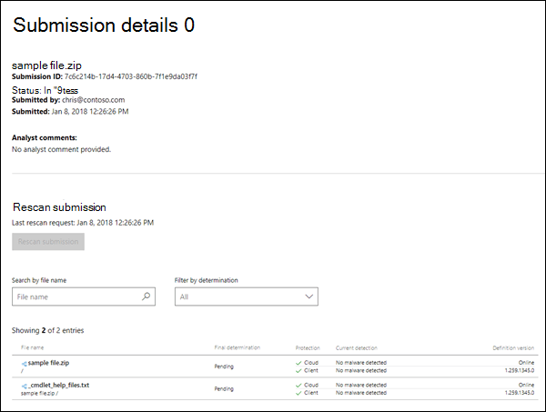

# Übermitteln von Schadsoftware und Nicht-Schadsoftware zur Analyse an Microsoft

[!INCLUDE [Microsoft 365 Defender rebranding](../includes/microsoft-defender-for-office.md)]

**Gilt für**
- [Exchange Online Protection](exchange-online-protection-overview.md)
- [Microsoft Defender für Office 365 Plan 1 und Plan 2](defender-for-office-365.md)
- [Microsoft 365 Defender](../defender/microsoft-365-defender.md)

> [!NOTE]
> Wenn Sie ein Administrator in einer Organisation mit Exchange Online sind, wird empfohlen, das Übermittlungsportal im Security & Compliance Center zu verwenden. Weitere Informationen finden Sie unter [Use Admin Submission to submit suspected spam, phish, URLs, and files to Microsoft](admin-submission.md).

In Microsoft 365 Organisationen mit Postfächern in Exchange Online oder eigenständigen Exchange Online Protection (EOP)-Organisationen ohne Exchange Online-Postfächern umfasst EOP schutz vor Schadsoftware, der automatisch aktiviert wird. Weitere Informationen finden Sie unter [Schutz vor Schadsoftware in EOP](anti-malware-protection.md).

Wahrscheinlich haben Sie die folgenden bewährten Methoden seit Jahren gehört:

- Vermeiden Sie das Öffnen von Nachrichten, die verdächtig aussehen.
- Öffnen Sie niemals eine Anlage von einer Person, die Sie nicht kennen.
- Vermeiden Sie das Öffnen von Anlagen in Nachrichten, die Sie zum Öffnen oder Klicken auffordern.

Was können Sie jedoch tun, wenn Sie eine Nachricht mit einer verdächtigen Anlage erhalten? Oder was passiert, wenn Sie vermuten, dass Ihr Computer oder Gerät von einer E-Mail-Anlage infiziert wurde, die den Filter überfing? In diesen Fällen sollten Sie die Schadsoftwareanlage an Microsoft übermitteln. Wenn dagegen eine Anlage in einer E-Mail-Nachricht fälschlicherweise als Schadsoftware identifiziert wurde, können Sie dies auch übermitteln.

## Was sollten Sie wissen, bevor Sie beginnen?

- Nachrichten mit Anlagen, die Skripts oder andere schädliche ausführbare Dateien enthalten, werden als Schadsoftware betrachtet, und Sie können die Verfahren in diesem Artikel verwenden, um sie zu melden.

- Nachrichten mit Links zu schädlichen Websites werden als Spam betrachtet. Weitere Informationen zum Melden von Spam und Nichtspam finden Sie unter [Melden von Nachrichten und Dateien an Microsoft](report-junk-email-messages-to-microsoft.md).

## Übermitteln von Schadsoftwaredateien an Microsoft

Wechseln Sie zur Microsoft Security Intelligence Website <https://www.microsoft.com/wdsi/filesubmission> unter, um die Datei zu übermitteln. Um Analyseupdates zu erhalten, melden Sie sich bei der Website an, oder geben Sie eine gültige E-Mail-Adresse ein. Es wird empfohlen, Ihr Microsoft-Arbeits- oder Schulkonto zu verwenden.

Nachdem Sie die Datei oder Dateien hochgeladen haben, notieren Sie sich die **Übermittlungs-ID,** die für Ihre Beispielübermittlung erstellt wurde (z. B. `7c6c214b-17d4-4703-860b-7f1e9da03f7f` ).

Nachdem wir das Beispiel erhalten haben, werden wir untersuchen. Wenn wir feststellen, dass die Beispieldatei schädlich ist, ergreifen wir Korrekturmaßnahmen, um zu verhindern, dass die Schadsoftware unentdeckt bleibt.

Wenn Sie weiterhin infizierte Nachrichten oder Anlagen empfangen, sollten Sie die Nachrichtenkopfzeilen aus der E-Mail-Nachricht kopieren und den Microsoft-Kundendienst und -Support kontaktieren, um weitere Unterstützung zu erhalten. Sie sollten auch Ihre **Übermittlungs-ID** zur Hand haben.

## Übermitteln von Dateien ohne Schadsoftware an Microsoft

Sie können auch eine Datei übermitteln, von der Sie glauben, dass sie fälschlicherweise als Schadsoftware identifiziert wurde (wählen Sie einfach **Nein** für die Frage aus, Glauben Sie, dass diese Datei **Schadsoftware enthält?**).

Nachdem wir das Beispiel erhalten haben, werden wir untersuchen. Wenn wir feststellen, dass die Beispieldatei sauber ist, ergreifen wir Korrekturmaßnahmen, um zu verhindern, dass die Datei als Schadsoftware erkannt wird.
