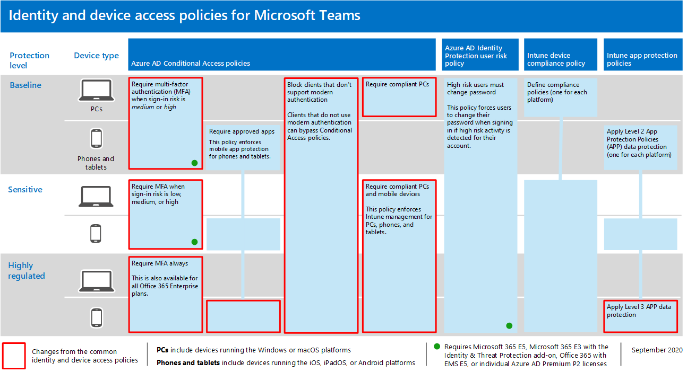

# Richtlinienempfehlungen zum Sichern von Teams-Chats, -Gruppen und -Dateien

In diesem Artikel wird beschrieben, wie Sie die empfohlenen Identitäts- und Gerätezugriffsrichtlinien zum Schutz von Microsoft Teams-Chats, -Gruppen und -Inhalten wie Dateien und Kalendern implementieren. Dieser Leitfaden baut auf den [allgemeinen Identitäts- und](identity-access-policies.md)Gerätezugriffsrichtlinien auf und enthält zusätzliche Teams-spezifische Informationen. Da Teams in unsere anderen Produkte integriert ist, finden Sie auch Richtlinienempfehlungen zum Sichern von [SharePoint-Websites](sharepoint-file-access-policies.md) und -Dateien sowie Richtlinienempfehlungen zum Sichern [von E-Mails.](secure-email-recommended-policies.md)

Diese Empfehlungen basieren auf drei verschiedenen Sicherheits- und Schutzebenen für Teams, die basierend auf der Granularität Ihrer Anforderungen angewendet werden können: Basisplan, vertraulich und hochgradig reguliert. Weitere Informationen zu diesen Sicherheitsebenen und den empfohlenen Richtlinien, auf die in diesen Empfehlungen verwiesen wird, finden Sie in den Identitäts- und [Gerätezugriffskonfigurationen.](microsoft-365-policies-configurations.md)

Zusätzliche Empfehlungen speziell für die Bereitstellung von Teams sind in diesem Artikel enthalten, um bestimmte Authentifizierungsanforderungen zu abdecken, einschließlich für Benutzer außerhalb Ihrer Organisation. Sie müssen diesen Leitfaden befolgen, um eine vollständige Sicherheitserfahrung zu gewährleisten.

## Erste Schritte mit Teams vor anderen abhängigen Diensten

Sie müssen abhängige Dienste nicht aktivieren, um mit Microsoft Teams zu beginnen. Alle diese "funktionieren einfach". Sie müssen jedoch darauf vorbereitet sein, Folgendes zu verwalten:

- Microsoft 365-Gruppen
- SharePoint-Teamwebsites
- OneDrive for Business
- Exchange-Postfächer
- Streamvideos und Planner-Pläne (wenn diese Dienste aktiviert sind)

## Aktualisieren gängiger Richtlinien, um Teams zu enthalten

Zum Schutz von Chats, Gruppen und Inhalten in Teams zeigt das folgende Diagramm, welche Richtlinien aus den allgemeinen Identitäts- und Gerätezugriffsrichtlinien aktualisiert werden müssen. Stellen Sie für jede zu aktualisierende Richtlinie sicher, dass Teams und abhängige Dienste in die Zuweisung von Cloud-Apps einbezogen werden.

[Sehen Sie sich eine größere Version dieses Bilds an.](https://github.com/MicrosoftDocs/microsoft-365-docs/raw/public/microsoft-365/media/microsoft-365-policies-configurations/identity-access-ruleset-teams.png)

Dies sind die abhängigen Dienste, die in die Zuweisung von Cloud-Apps für Teams enthalten sein sollen:

- Microsoft Teams
- SharePoint und OneDrive for Business
- Exchange Online
- Skype for Business Online
- Microsoft Stream (Besprechungsaufzeichnungen)
- Microsoft Planner (Planner-Aufgaben und Plandaten)

In dieser Tabelle sind die Richtlinien aufgeführt, die erneut durchdacht werden müssen, sowie Links zu den einzelnen Richtlinien in den allgemeinen Identitäts- und Gerätezugriffsrichtlinien, für die die umfassendere Richtlinie für alle Office-Anwendungen festgelegt ist.

|Schutzebene|Richtlinien|Weitere Informationen zur Implementierung von Teams|
|---|---|---|
|**Basisplan**|[MFA erforderlich, wenn das Anmelderisiko *mittel oder* hoch *ist*](identity-access-policies.md#require-mfa-based-on-sign-in-risk)|Stellen Sie sicher, dass Teams und abhängige Dienste in der Liste der Apps enthalten sind. Teams verfügt über Gastzugriffs- und externe Zugriffsregeln, die Sie ebenfalls berücksichtigen sollten. Weitere Informationen zu diesen Regeln finden Sie weiter später in diesem Artikel.|
||[Blockieren von Clients, die die moderne Authentifizierung nicht unterstützen](identity-access-policies.md#block-clients-that-dont-support-modern-authentication)|Schließen Sie Teams und abhängige Dienste in die Zuweisung von Cloud-Apps ein.|
||[Nutzer mit hohem Risiko müssen das Kennwort ändern](identity-access-policies.md#high-risk-users-must-change-password)|Erzwingt Teams-Benutzer, ihr Kennwort bei der Anmeldung zu ändern, wenn für ihr Konto Aktivität mit hohem Risiko erkannt wird. Stellen Sie sicher, dass Teams und abhängige Dienste in der Liste der Apps enthalten sind.|
||[Anwenden von APP-Datenschutzrichtlinien](identity-access-policies.md#apply-app-data-protection-policies)|Stellen Sie sicher, dass Teams und abhängige Dienste in der Liste der Apps enthalten sind. Aktualisieren Sie die Richtlinie für jede Plattform (iOS, Android, Windows).|
||[Definieren von Gerätekonformitätsrichtlinien](identity-access-policies.md#define-device-compliance-policies)|Schließen Sie Teams und abhängige Dienste in diese Richtlinie ein.|
||[Kompatible PCs erforderlich](identity-access-policies.md#require-compliant-pcs-but-not-compliant-phones-and-tablets)|Schließen Sie Teams und abhängige Dienste in diese Richtlinie ein.|
|**Vertraulich**|[MFA erforderlich, wenn das Anmelderisiko *niedrig,* *mittel oder* hoch *ist*](identity-access-policies.md#require-mfa-based-on-sign-in-risk)|Teams muss auch Gastzugriffs- und externe Zugriffsregeln berücksichtigen. Weitere Informationen zu diesen Regeln finden Sie weiter später in diesem Artikel. Schließen Sie Teams und abhängige Dienste in diese Richtlinie ein.|
||[Kompatible *PCs* und mobile Geräte erforderlich](identity-access-policies.md#require-compliant-pcs-and-mobile-devices)|Schließen Sie Teams und abhängige Dienste in diese Richtlinie ein.|
|**Streng geregelt**|[*MFA* immer erforderlich](identity-access-policies.md#require-mfa-based-on-sign-in-risk)|Unabhängig von der Benutzeridentität wird MFA von Ihrer Organisation verwendet. Schließen Sie Teams und abhängige Dienste in diese Richtlinie ein. |
|

## Architektur abhängiger Dienste von Teams

Als Referenz veranschaulicht das folgende Diagramm die Dienste, auf die Teams basiert. Weitere Informationen und zusätzliche Abbildungen finden Sie unter Microsoft Teams und zugehörige Produktivitätsdienste [in Microsoft 365 für IT-Architekten.](../../solutions/productivity-illustrations.md)

[Sehen Sie sich eine größere Version dieses Bilds an.](https://github.com/MicrosoftDocs/microsoft-365-docs/raw/public/microsoft-365/media/microsoft-365-policies-configurations/identity-access-logical-architecture-teams.png)

## Gast- und externer Zugriff für Teams

Microsoft Teams definiert Folgendes:

- **Der** Gastzugriff verwendet ein Azure AD B2B-Konto für einen Gast oder externen Benutzer, das als Mitglied eines Teams hinzugefügt werden kann und über alle berechtigten Zugriffsrechte auf die Kommunikation und die Ressourcen des Teams verfügt.

- **Der externe Zugriff** ist für einen externen Benutzer, der kein Azure AD B2B-Konto hat. Der externe Zugriff kann Einladungen und die Teilnahme an Anrufen, Chats und Besprechungen umfassen, umfasst jedoch keine Teammitgliedschaft und keinen Zugriff auf die Ressourcen des Teams.

Richtlinien für bedingten Zugriff gelten nur für den Gastzugriff in Teams, da es ein entsprechendes Azure AD B2B-Konto gibt.

<!--
In Azure AD, guest and external users are the same. The user type for both of these is Guest. Guest users are B2B users. Microsoft Teams differentiates between guest users and external users in the app. While it's important to understand how each of these are treated in Teams, both types of users are B2B users in Azure AD and the recommended policies for B2B users apply to both.

-->

Empfohlene Richtlinien zum Zulassen des Zugriffs für Gastbenutzer und externe Benutzer mit einem Azure AD B2B-Konto finden Sie unter "Richtlinien zum Zulassen des Zugriffs auf Gast- und externe [B2B-Konten".](identity-access-policies-guest-access.md)

### Gastzugriff in Teams

Zusätzlich zu den Richtlinien für Benutzer, die für Ihr Unternehmen oder Ihre Organisation intern sind, können Administratoren den Gastzugriff aktivieren, um Benutzern, die sich außerhalb Ihres Unternehmens oder Ihrer Organisation befinden, den Zugriff auf Teams-Ressourcen und die Interaktion mit internen Personen für Dinge wie Gruppenunterhaltungen, Chats und Besprechungen zu ermöglichen.

Weitere Informationen zum Gastzugriff und zur Implementierung finden Sie unter ["Teams-Gastzugriff".](https://docs.microsoft.com/microsoftteams/guest-access)

### Externer Zugriff in Teams

Da der externe Zugriff manchmal mit dem Gastzugriff verwechselt wird, ist es wichtig, klar zu sein, dass diese beiden nicht internen Zugriffsmechanismen tatsächlich sehr unterschiedlich sind.

Der externe Zugriff ist eine Möglichkeit für Teams-Benutzer aus einer gesamten externen Domäne, Besprechungen mit Ihren Benutzern in Teams zu suchen, zu anrufen, zu chatten und zu richten. Teamadministratoren konfigurieren den externen Zugriff auf Organisationsebene. Weitere Informationen finden Sie unter [Verwalten des externen Zugriffs in Microsoft Teams](https://docs.microsoft.com/microsoftteams/manage-external-access).

Benutzer mit externem Zugriff haben weniger Zugriff und Funktionalität als eine Einzelperson, die über den Gastzugriff hinzugefügt wurde. Beispielsweise können Benutzer mit externem Zugriff mit Ihren internen Benutzern mit Teams chatten, aber nicht auf Teamkanäle, Dateien oder andere Ressourcen zugreifen.

Der externe Zugriff verwendet keine Azure AD B2B-Benutzerkonten und verwendet daher keine Richtlinien für bedingten Zugriff.

## Teams-Richtlinien

Außerhalb der oben aufgeführten allgemeinen Richtlinien gibt es Teams-spezifische Richtlinien, die für die Verwaltung verschiedener Funktionen von Teams konfiguriert werden können und sollten.

### Richtlinien für Teams und Kanäle

Teams und Kanäle sind zwei häufig verwendete Elemente in Microsoft Teams, und es gibt Richtlinien, mit denen Sie steuern können, was Benutzer bei der Verwendung von Teams und Kanälen tun können und was nicht. Sie können zwar ein globales Team erstellen, wenn Ihre Organisation jedoch über 5.000 Benutzer oder weniger verfügt, ist es wahrscheinlich hilfreich, kleinere Teams und Kanäle für bestimmte Zwecke in Einklang mit den Anforderungen Ihrer Organisation zu haben.

Es wird empfohlen, die Standardrichtlinie zu ändern oder benutzerdefinierte Richtlinien zu erstellen. Weitere Informationen zum Verwalten Ihrer Richtlinien finden Sie unter diesem Link: Verwalten von Teamrichtlinien [in Microsoft Teams.](https://docs.microsoft.com/microsoftteams/teams-policies)

### Messagingrichtlinien

Nachrichten oder Chats können auch über die globale Standardrichtlinie oder benutzerdefinierte Richtlinien verwaltet werden. Dadurch können Ihre Benutzer auf eine weise miteinander kommunizieren, die für Ihre Organisation geeignet ist. Diese Informationen können unter "Verwalten von [Messagingrichtlinien in Teams" überprüft werden.](https://docs.microsoft.com/microsoftteams/messaging-policies-in-teams)

### Besprechungsrichtlinien

Die Diskussion über Teams wäre ohne Planung und Implementierung von Richtlinien für Teams-Besprechungen nicht abgeschlossen. Besprechungen sind eine wesentliche Komponente von Teams, sodass Sich viele Benutzer auf einmal formell treffen und präsentieren können und inhalte, die für die Besprechung relevant sind, gemeinsam verwendet werden können. Das Festlegen der richtigen Richtlinien für Ihre Organisation im Rahmen von Besprechungen ist unerlässlich.

Weitere Informationen [finden Sie unter "Verwalten von Besprechungsrichtlinien in Teams".](https://docs.microsoft.com/microsoftteams/meeting-policies-in-teams)

### Richtlinien für Die App-Berechtigung

Teams ermöglicht ihnen auch die Verwendung von Apps an verschiedenen Orten, z. B. Kanälen oder persönlichen Chats. Richtlinien dazu, welche Apps hinzugefügt und verwendet werden können und wo, sind für die Aufrechterhaltung einer inhaltsreichen Umgebung, die ebenfalls sicher ist, unerlässlich.

Weitere Informationen zu App-Berechtigungsrichtlinien finden Sie unter "Verwalten von [App-Berechtigungsrichtlinien in Microsoft Teams".](https://docs.microsoft.com/microsoftteams/teams-app-permission-policies)

## Nächste Schritte

Konfigurieren Sie Richtlinien für bedingten Zugriff für:

- [Exchange Online](secure-email-recommended-policies.md)
- [SharePoint](sharepoint-file-access-policies.md)
