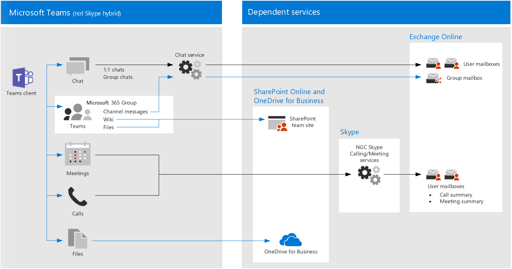

# Richtlinien Empfehlungen für das Sichern von teamchats,-Gruppen und-DateienPolicy recommendations for securing Teams chats, groups, and files

In diesem Artikel wird beschrieben, wie Sie die empfohlenen Identitäts-und Gerätezugriffs Richtlinien implementieren, um Microsoft Teams-Chats,-Gruppen und-Inhalte wie Dateien und Kalender zu schützen.This article describes how to implement the recommended identity and device-access policies to protect Microsoft Teams chats, groups, and content such as files and calendars. Dieser Leitfaden basiert auf den [allgemeinen Richtlinien für Identitäts-und Geräte Zugriff](identity-access-policies.md)mit zusätzlichen Informationen, die für Teams spezifisch sind.This guidance builds on the [common identity and device access policies](identity-access-policies.md), with additional information that's Teams-specific. Da Teams in unsere anderen Produkte integriert werden, finden Sie weitere Informationen unter [Richtlinien Empfehlungen zum Sichern von SharePoint-Websites und-Dateien](sharepoint-file-access-policies.md) und [Richtlinien Empfehlungen zum Sichern von e-Mails](secure-email-recommended-policies.md).Because Teams integrates with our other products, also see [Policy recommendations for securing SharePoint sites and files](sharepoint-file-access-policies.md) and [Policy recommendations for securing email](secure-email-recommended-policies.md).

Diese Empfehlungen basieren auf drei verschiedenen Ebenen der Sicherheit und des Schutzes für Teams, die basierend auf der Granularität Ihrer Anforderungen angewendet werden können: Baseline, sensibel und stark reguliert.These recommendations are based on three different tiers of security and protection for Teams that can be applied based on the granularity of your needs: baseline, sensitive, and highly regulated. Weitere Informationen zu diesen Sicherheitsebenen und den empfohlenen Richtlinien, auf die diese Empfehlungen verweisen, finden Sie unter [Identitäts-und Gerätezugriffs Konfigurationen](microsoft-365-policies-configurations.md).You can learn more about these security tiers and the recommended policies referenced by these recommendations in the [Identity and device access configurations](microsoft-365-policies-configurations.md).

In diesem Artikel werden zusätzliche Empfehlungen speziell für die Microsoft Teams-Bereitstellung aufgeführt, um bestimmte Authentifizierungs Bedingungen, einschließlich für Benutzer außerhalb Ihrer Organisation, abzudecken.Additional recommendations specific to Teams deployment are included in this article to cover specific authentication circumstances, including for users outside your organization. Sie müssen diese Anleitung befolgen, um eine vollständige Sicherheitserfahrung zu erhalten.You will need to follow this guidance for a complete security experience.

## Erste Schritte mit Microsoft Teams vor anderen abhängigen DienstenGetting started with Teams before other dependent services

Sie müssen abhängige Dienste nicht für den Einstieg in Microsoft Teams aktivieren.You don't need to enable dependent services to get started with Microsoft Teams. Diese werden alle "nur arbeiten".These will all "just work." Sie müssen jedoch bereit sein, Folgendes zu verwalten:However, you do need to be prepared to manage the following:

- Microsoft 365-GruppenMicrosoft 365 groups
- SharePoint-TeamwebsitesSharePoint team sites
- OneDrive for BusinessOneDrive for Business
- Exchange-PostfächerExchange mailboxes
- Stream Videos and Planner Plans (wenn diese Dienste aktiviert sind)Stream videos and Planner plans (if these services are enabled)

## Aktualisieren allgemeiner Richtlinien für die Einbeziehung von TeamsUpdating common policies to include Teams

Um Chat, Gruppen und Inhalte in Microsoft Teams zu schützen, zeigt das folgende Diagramm, welche Richtlinien aus den allgemeinen Richtlinien für Identitäts-und Geräte Zugriff zu aktualisieren sind.To protect chat, groups and content in Teams, the following diagram illustrates which policies to update from the the common identity and device access policies. Stellen Sie sicher, dass für jede zu aktualisierende Richtlinie Teams und abhängige Dienste in der Zuweisung von Cloud-Apps enthalten sind.For each policy to update, make sure that Teams and dependent services are included in the assignment of cloud apps.

[Anzeigen einer größeren Version dieses BildsSee a larger version of this image](https://github.com/MicrosoftDocs/microsoft-365-docs/raw/public/microsoft-365/media/microsoft-365-policies-configurations/identity-access-ruleset-teams.png)

Hierbei handelt es sich um die abhängigen Dienste, die in die Zuweisung von Cloud-Apps für Teams einbezogen werden sollen:These are the dependent services to include in the assignment of cloud apps for Teams:

- Microsoft TeamsMicrosoft Teams
- SharePoint und OneDrive for BusinessSharePoint and OneDrive for Business
- Exchange OnlineExchange Online
- Skype for Business OnlineSkype for Business Online
- Microsoft-Datenstrom (Besprechungsaufzeichnungen)Microsoft Stream (meeting recordings)
- Microsoft Planner (planerische Aufgaben und Plandaten)Microsoft Planner (Planner tasks and plan data)

Diese Tabelle enthält eine Liste der Richtlinien, die erneut besucht werden müssen, sowie Links zu den einzelnen Richtlinien in den allgemeinen [Identitäts-und Gerätezugriffs Richtlinien](identity-access-policies.md), bei denen die umfassendere Richtlinie für alle Office-Anwendungen festgelegt ist.This table lists the policies that need to be revisited and links to each policy in the [common identity and device access policies](identity-access-policies.md), which has the wider policy set for all Office applications.

|SchutzebeneProtection level|RichtlinienPolicies|Weitere Informationen für die Implementierung von TeamsFurther information for Teams implementation|
|:---------------|:-------|:----------------|
|**Basisplan****Baseline**|[MFA erforderlich, wenn das Anmelde Risiko *Mittel* groß oder *hoch* istRequire MFA when sign-in risk is *medium* or *high*](identity-access-policies.md#require-mfa-based-on-sign-in-risk)|Stellen Sie sicher, dass Microsoft Teams und abhängige Dienste in der Liste der Apps enthalten sind.Be sure Teams and dependent services are included in the list of apps. Microsoft Teams verfügt über Gastzugriff und Regeln für den externen Zugriff, die Sie später in diesem Artikel erfahren sollten.Teams has Guest Access and External Access rules to consider as well, you'll learn more about these later in this article.|
|        |[Blockieren von Clients, die die moderne Authentifizierung nicht unterstützenBlock clients that don't support modern authentication](identity-access-policies.md#block-clients-that-dont-support-modern-authentication)|Einbeziehen von Teams und abhängigen Diensten in die Zuweisung von Cloud-apps.Include Teams and dependent services in the assignment of cloud apps.|
|        |[Nutzer mit hohem Risiko müssen das Kennwort ändernHigh risk users must change password](identity-access-policies.md#high-risk-users-must-change-password)|Zwingt Teams-Benutzer, Ihr Kennwort zu ändern, wenn Sie sich anmelden, wenn hochriskante Aktivitäten für Ihr Konto erkannt werden.Forces Teams users to change their password when signing in if high-risk activity is detected for their account. Stellen Sie sicher, dass Microsoft Teams und abhängige Dienste in der Liste der Apps enthalten sind.Be sure Teams and dependent services are included in the list of apps.|
|        |[Anwenden von App-DatenschutzrichtlinienApply APP data protection policies](identity-access-policies.md#apply-app-data-protection-policies)|Stellen Sie sicher, dass Microsoft Teams und abhängige Dienste in der Liste der Apps enthalten sind.Be sure Teams and dependent services are included in the list of apps. Aktualisieren Sie die Richtlinie für jede Plattform (Ios, Android, Windows).Update the policy for each platform (iOS, Android, Windows).|
|        |[Definieren von Geräte KonformitätsrichtlinienDefine device compliance policies](identity-access-policies.md#define-device-compliance-policies)|Schließen Sie Teams und abhängige Dienste in diese Richtlinie ein.Include Teams and dependent services in this policy.|
|        |[Kompatible PCs erforderlichRequire compliant PCs](identity-access-policies.md#require-compliant-pcs-but-not-compliant-phones-and-tablets)|Schließen Sie Teams und abhängige Dienste in diese Richtlinie ein.Include Teams and dependent services in this policy.|
|**Vertraulich****Sensitive**|[MFA erforderlich, wenn das Anmelde Risiko *niedrig*, *Mittel* oder *hoch* istRequire MFA when sign-in risk is *low*, *medium* or *high*](identity-access-policies.md#require-mfa-based-on-sign-in-risk)|Microsoft Teams verfügt über Gastzugriff und Regeln für den externen Zugriff, die Sie später in diesem Artikel erfahren sollten.Teams has Guest Access and External Access rules to consider as well, you'll learn more about these later in this article. Schließen Sie Teams und abhängige Dienste in diese Richtlinie ein.Include Teams and dependent services in this policy.|
|         |[Erfordern von kompatiblen PCs *und* mobilen GerätenRequire compliant PCs *and* mobile devices](identity-access-policies.md#require-compliant-pcs-and-mobile-devices)|Schließen Sie Teams und abhängige Dienste in diese Richtlinie ein.Include Teams and dependent services in this policy.|
|**Streng geregelt****Highly regulated**|[*Immer* MFA erforderlich*Always* require MFA](identity-access-policies.md#require-mfa-based-on-sign-in-risk)|Unabhängig von der Benutzeridentität wird MFA von Ihrer Organisation verwendet.Regardless of user identity, MFA will be used by your organization. Schließen Sie Teams und abhängige Dienste in diese Richtlinie ein.Include Teams and dependent services in this policy. |
| | |

## Architektur der Teams-abhängigen DiensteTeams dependent services architecture

Als Referenz zeigt das folgende Diagramm die Dienste, auf denen Teams basiert.For reference, the following diagram illustrates the services Teams relies on. Weitere Informationen und weitere Illustrationen finden Sie unter [Microsoft Teams und verwandte Produktivitätsdienste in Microsoft 365 für IT-Architekten](../../solutions/productivity-illustrations.md).For more information and additional illustrations, see [Microsoft Teams and related productivity services in Microsoft 365 for IT architects](../../solutions/productivity-illustrations.md).

[Anzeigen einer größeren Version dieses BildsSee a larger version of this image](https://github.com/MicrosoftDocs/microsoft-365-docs/raw/public/microsoft-365/media/microsoft-365-policies-configurations/identity-access-logical-architecture-teams.png)

## Gast-und externer Zugriff für TeamsGuest and external access for Teams

Microsoft Teams definiert Folgendes:Microsoft Teams defines the following:

- **Gastzugriff** verwendet ein Azure AD B2B-Konto für einen Gast oder einen externen Benutzer, der als Mitglied eines Teams hinzugefügt werden kann und über alle Berechtigungen verfügt, die auf die Kommunikation und die Ressourcen des Teams zugreifen können.**Guest access** uses an Azure AD B2B account for a guest or external user that can be added as a member of a team and have all permissioned access to the communication and resources of the team.

- **Externer Zugriff** ist für einen externen Benutzer, der über kein Azure AD B2B-Konto verfügt.**External access** is for an external user that does not have an Azure AD B2B account. Externer Zugriff kann Einladungen und Teilnahme an anrufen, Chats und Besprechungen umfassen, umfasst jedoch nicht die Teammitgliedschaft und den Zugriff auf die Ressourcen des Teams.External access can include invitations and participation in calls, chats, and meetings, but does not include team membership and access to the resources of the team.

Richtlinien für den bedingten Zugriff gelten nur für Gastzugriff in Microsoft Teams, da ein entsprechendes Azure AD B2B-Konto vorhanden ist.Conditional Access policies only apply to guest access in Teams because there is a corresponding Azure AD B2B account.

<!--
In Azure AD, guest and external users are the same. The user type for both of these is Guest. Guest users are B2B users. Microsoft Teams differentiates between guest users and external users in the app. While it's important to understand how each of these are treated in Teams, both types of users are B2B users in Azure AD and the recommended policies for B2B users apply to both. 

--> 

Empfohlene Richtlinien für den Zugriff für Gast-und externe Benutzer mit einem Azure AD B2B-Konto finden Sie unter [Richtlinien für das Zulassen von Gast-und externen B2B-Konto Zugriffen](identity-access-policies-guest-access.md).For recommended policies to allow access for guest and external users with an Azure AD B2B account, see [Policies for allowing guest and external B2B account access](identity-access-policies-guest-access.md).

### Gastzugriff in TeamsGuest access in Teams

Zusätzlich zu den Richtlinien für Benutzer, die für Ihr Unternehmen oder Ihre Organisation intern sind, können Administratoren den Gastzugriff aktivieren, um Personen, die sich außerhalb Ihres Unternehmens oder Ihrer Organisation befinden, für den Zugriff auf Microsoft Teams-Ressourcen und die Interaktion mit internen Personen für Gruppenunterhaltungen, Chats und Besprechungen zu ermöglichen.In addition to the policies for users who are internal to your business or organization, administrators may enable guest access to allow, on a user-by-user basis, people who are external to your business or organization to access Teams resources and interact with internal people for things like group conversations, chat, and meetings. 

Weitere Informationen zum Gastzugriff und zur Implementierung finden Sie unter  [Teams Gastzugriff](https://docs.microsoft.com/microsoftteams/guest-access).For more information about guest access and how to implement it, see  [Teams guest access](https://docs.microsoft.com/microsoftteams/guest-access).

### Externer Zugriff in Microsoft TeamsExternal access in Teams

Der externe Zugriff ist manchmal mit Gastzugriff verwechselt, daher ist es wichtig zu beachten, dass diese beiden nicht internen Zugriffsmechanismen tatsächlich ganz unterschiedlich sind.External access is sometimes confused with guest access, so it's important to be clear that these two non-internal access mechanisms are actually quite different. 

Externer Zugriff ist eine Möglichkeit für Microsoft Teams-Benutzer aus einer ganzen externen Domäne, Besprechungen mit ihren Benutzern in Microsoft Teams zu finden, anzurufen, zu chatten und einzurichten.External access is a way for Teams users from an entire external domain to find, call, chat, and set up meetings with your users in Teams. Microsoft Teams-Administratoren konfigurieren den externen Zugriff auf Organisationsebene.Teams administrators configure external access at the organization level. Weitere Informationen finden Sie unter [Verwalten von externem Zugriff in Microsoft Teams](https://docs.microsoft.com/microsoftteams/manage-external-access).For more information, see [Manage external access in Microsoft Teams](https://docs.microsoft.com/microsoftteams/manage-external-access).

Benutzer mit externem Zugriff haben weniger Zugriff und Funktionalität als eine Person, die über Gastzugriff hinzugefügt wurde.External access users have less access and functionality than an individual who's been added via guest access. Beispielsweise können externe Benutzer mit ihren internen Benutzern mit Microsoft Teams chatten, aber nicht auf Team Kanäle, Dateien oder andere Ressourcen zugreifen.For example, external access users can chat with your internal users with Teams but cannot access team channels, files, or other resources.

Der externe Zugriff verwendet keine Azure AD B2B-Benutzerkonten und verwendet daher keine Richtlinien für den bedingten Zugriff.External access does not use Azure AD B2B user accounts and therefore does not use Conditional Access policies. 

## Teams-RichtlinienTeams policies

Außerhalb der oben aufgeführten allgemeinen Richtlinien gibt es Teams-spezifische Richtlinien, die für die Verwaltung verschiedener Teams-Funktionen konfiguriert werden können und sollten.Outside of the common policies listed above, there are Teams-specific policies that can and should be configured to manage various Teams functionalities.

### Richtlinien für Teams und KanäleTeams and channels policies

Teams und Kanäle sind zwei häufig verwendete Elemente in Microsoft Teams, und es gibt Richtlinien, die Sie einführen können, um zu steuern, was Benutzer bei der Verwendung von Teams und Kanälen tun können und was nicht.Teams and channels are two commonly used elements in Microsoft Teams, and there are policies you can put in place to control what users can and cannot do when using teams and channels. Sie können zwar ein globales Team erstellen, aber wenn Ihre Organisation 5000 oder weniger Benutzer hat, ist es wahrscheinlich hilfreich, kleinere Teams und Kanäle für bestimmte Zwecke im Einklang mit Ihren organisatorischen Anforderungen zu haben.While you can create a global team, if your organization has 5000 users or less, you are likely to find it helpful to have smaller teams and channels for specific purposes, in-line with your organizational needs.

Es empfiehlt sich, die Standardrichtlinie zu ändern oder benutzerdefinierte Richtlinien zu erstellen, und weitere Informationen zum Verwalten von Richtlinien finden Sie unter diesem Link: [Verwalten von Teams-Richtlinien in Microsoft Teams](https://docs.microsoft.com/microsoftteams/teams-policies).Changing the default policy or creating custom policies would be recommended, and you can learn more about managing your policies at this link: [Manage teams policies in Microsoft Teams](https://docs.microsoft.com/microsoftteams/teams-policies).

### Messaging RichtlinienMessaging policies

Messaging oder Chat können auch über die standardmäßige globale Richtlinie oder durch benutzerdefinierte Richtlinien verwaltet werden, was dazu beitragen kann, dass Ihre Benutzer miteinander auf eine Weise kommunizieren, die für Ihre Organisation geeignet ist.Messaging, or chat, can also be managed through the default global policy, or through custom policies, and this can help your users communicate with one another in a way that's appropriate for your organization. Diese Informationen können unter [Managing Messaging Policies in Teams](https://docs.microsoft.com/microsoftteams/messaging-policies-in-teams)überprüft werden.This information can be reviewed at [Managing messaging policies in Teams](https://docs.microsoft.com/microsoftteams/messaging-policies-in-teams).

### BesprechungsrichtlinienMeeting policies

Keine Besprechung von Teams wäre ohne Planung und Implementierung von Richtlinien in Teams-Besprechungen abgeschlossen.No discussion of Teams would be complete without planning and implementing policies around Teams meetings. Besprechungen stellen eine wesentliche Komponente von Teams dar und ermöglichen es den Benutzern, viele Benutzer gleichzeitig formell zu treffen und vorzustellen, sowie Inhalte für die Besprechung freizugeben.Meetings are an essential component of Teams, allowing people to formally meet and present to many users at once, as well as share content relevant to the meeting. Das Festlegen der richtigen Richtlinien für Ihre Organisation in Besprechungen ist unerlässlich.Setting the right policies for your organization around meetings is essential.

Weitere Informationen finden Sie [unter Manage Meeting Policies in Teams](https://docs.microsoft.com/microsoftteams/meeting-policies-in-teams) .Please review [Manage meeting policies in Teams](https://docs.microsoft.com/microsoftteams/meeting-policies-in-teams) for more information.

### Richtlinien für App-BerechtigungenApp permission policies

Mit Microsoft Teams können Sie auch apps an verschiedenen Orten wie Kanälen oder persönlichen Chats verwenden.Teams also allows you to use apps in various places, such as channels or personal chats. Wenn Sie Richtlinien dazu haben, welche apps hinzugefügt und verwendet werden können, und wo dies erforderlich ist, ist dies für die Verwaltung einer inhaltsreichen Umgebung unerlässlich, die auch sicher ist.Having policies around what apps can be added and used, and where, is essential to maintaining a content-rich environment that is also secure.

Weitere Informationen zu app-Berechtigungsrichtlinien finden Sie [unter Verwalten von App-Berechtigungsrichtlinien in Microsoft Teams](https://docs.microsoft.com/microsoftteams/teams-app-permission-policies).For more reading about App Permission Policies, check out [Manage app permission policies in Microsoft Teams](https://docs.microsoft.com/microsoftteams/teams-app-permission-policies).

## Nächste SchritteNext steps

Konfigurieren von Richtlinien für bedingten Zugriff für:Configure Conditional Access policies for:

- [Exchange OnlineExchange Online](secure-email-recommended-policies.md)
- [SharePointSharePoint](sharepoint-file-access-policies.md)

