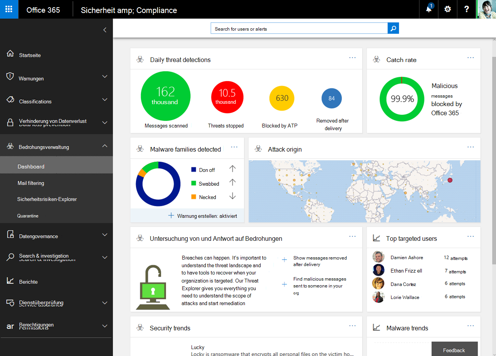
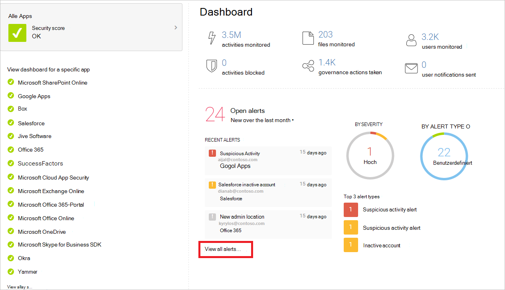

# Konfigurieren Ihres Microsoft 365-Mandanten für mehr Sicherheit

In diesem Thema werden Sie durch die empfohlene Konfiguration für Mandantenweite Einstellungen geleitet, die sich auf die Sicherheit Ihrer Microsoft 365-Umgebung auswirken. Ihre Sicherheitsanforderungen erfordern möglicherweise mehr oder weniger Sicherheit. Verwenden Sie diese Empfehlungen als Ausgangspunkt.

## Office 365 sicheres Ergebnis überprüfen

Office 365 Secure Score analysiert die Sicherheit Ihrer Organisation basierend auf Ihren regulären Aktivitäten und Sicherheitseinstellungen und weist eine Bewertung zu. Notieren Sie sich zunächst Ihre aktuelle Bewertung. Durch das Anpassen einiger Mandanten weiter Einstellungen wird die Punktzahl erhöht. Ziel ist nicht die maximale Punktzahl, sondern die Möglichkeiten zum Schutz Ihrer Umgebung, die sich nicht negativ auf die Produktivität Ihrer Benutzer auswirken. Siehe [Microsoft Secure Score](../mtp/microsoft-secure-score.md).

## Tune Threat Management Policies im Microsoft 365 Security Center

Das Microsoft 365 Security Center umfasst Funktionen, die Ihre Umgebung schützen. Es enthält auch Berichte und Dashboards, die Sie zum Überwachen und ergreifen von Aktionen verwenden können. Einige Bereiche verfügen über Standardrichtlinien Konfigurationen. Einige Bereiche enthalten keine Standardrichtlinien oder-Regeln. Besuchen Sie diese Richtlinien unter Threat Management, um Einstellungen für die Bedrohungs Verwaltung für eine sicherere Umgebung zu optimieren.

||||
|---|---|---|
|**Bereich**|**Enthält eine Standardrichtlinie**|**Empfehlung**|
|**Anti-Phishing**|Ja|Wenn Sie über eine benutzerdefinierte Domäne verfügen, konfigurieren Sie die standardmäßige Anti-Phishing-Richtlinie, um die e-Mail-Konten Ihrer wertvollsten Benutzer wie Ihr CEO zu schützen und Ihre Domäne zu schützen. Überprüfen Sie die [Anti-Phishing-Richtlinien in Office 365](set-up-anti-phishing-policies.md) und lesen Sie [configure Anti-Phishing Policies in EoP](configure-anti-phishing-policies-eop.md) oder [configure ATP Anti-Phishing Policies in Office 365](configure-atp-anti-phishing-policies.md).|
|**Anti-Malware-Modul**|Ja| Bearbeiten der Standardrichtlinie:   &ensp;&ensp;* Filter für allgemeine Anlagentypen – auswählen auf    Sie können auch benutzerdefinierte Filterrichtlinien für Schadsoftware erstellen und diese auf bestimmte Benutzer, Gruppen oder Domänen in Ihrer Organisation anwenden.    Weitere Informationen:   &ensp;&ensp;* [Anti-Malware-Schutz](anti-malware-protection.md)   &ensp;&ensp;* [Konfigurieren von Anti-Malware-Richtlinien](configure-anti-malware-policies.md)|
|**Sichere Anlagen in ATP**|Nein| Schützen Sie auf der Hauptseite für sichere Anlagen die Dateien in SharePoint, OneDrive und Microsoft Teams, indem Sie dieses Kontrollkästchen aktivieren:   &ensp;&ensp;* Aktivieren von ATP für SharePoint, OneDrive und Microsoft Teams    Fügen Sie mit den folgenden Einstellungen eine neue Richtlinie für sichere Anlagen hinzu:   &ensp;&ensp;* Block – blockiert die aktuellen und zukünftigen e-Mails und Anlagen mit erkannter Schadsoftware (Wählen Sie diese Option)   &ensp;&ensp;* Redirect aktivieren – (aktivieren Sie dieses Kontrollkästchen, und geben Sie eine e-Mail-Adresse wie ein Administrator-oder Quarantäne Konto ein)   &ensp;&ensp;* Apply die obige Auswahl, wenn Malware-Scans für Anlagen Timeout oder Fehler auftritt (aktivieren Sie dieses Kontrollkästchen)   &ensp;&ensp;* Angewendet auf – die Empfängerdomäne lautet (Wählen Sie Ihre Domäne aus)   Weitere Informationen: [Einrichten Office 365 Richtlinien für ATP-sichere Anlagen](set-up-atp-safe-attachments-policies.md)|
|**ATP-sichere Links**|Ja| Fügen Sie diese Einstellung der Standardrichtlinie für die gesamte Organisation hinzu:   &ensp;&ensp;* Verwenden Sie sichere Links in: Microsoft 365 apps for Enterprise, Office für IOS und Android (Wählen Sie diese Option aus).   Empfohlene Richtlinie für bestimmte Empfänger:   &ensp;&ensp;* URLs werden umgeschrieben und anhand einer Liste bekannter böswilliger Links überprüft, wenn der Benutzer auf den Link klickt (Wählen Sie diese Option aus).   &ensp;&ensp;* Verwenden Sie sichere Anlagen zum Überprüfen herunterladbarer Inhalte (aktivieren Sie dieses Kontrollkästchen).   &ensp;&ensp;* Angewendet auf – die Empfängerdomäne lautet (Wählen Sie Ihre Domäne aus).    Weitere Informationen: [Office 365 ATP-sichere Links](atp-safe-links.md).|
|**Anti-Spam (e-Mail-Filterung)**|Ja| Was Sie beachten sollten:   &ensp;&ensp;* Zu viel Spam – wählen Sie die benutzerdefinierten Einstellungen aus, und bearbeiten Sie die standardmäßige Spamfilter Richtlinie.   &ensp;&ensp;* Spoof Intelligence – überprüfen von Absendern, die Ihre Domäne Spoofing sind. Diese Absender blockieren oder zulassen.   Weitere Informationen: [Microsoft 365 Email Anti-Spam Protection](anti-spam-protection.md).|
|***E-Mail-Authentifizierung***|Ja|Bei der e-Mail-Authentifizierung wird ein Domain Name System (DNS) verwendet, um e-Mail-Nachrichten über den Absender einer e-Mail überprüfbare Informationen hinzuzufügen. Microsoft 365 richtet die e-Mail-Authentifizierung für die Standarddomäne (onmicrosoft.com) ein, Microsoft 365-Administratoren können jedoch auch die e-Mail-Authentifizierung für benutzerdefinierte Domänen verwenden. Es werden drei Authentifizierungsmethoden verwendet:    &ensp;&ensp;* Sender Policy Framework (oder SPF). &ensp;&ensp;&ensp;&ensp;-Informationen zum Einrichten finden Sie unter [Einrichten von SPF in Microsoft 365, um Spoofing zu verhindern](set-up-spf-in-office-365-to-help-prevent-spoofing.md).   &ensp;&ensp;* DomainKeys Identified Mail (DKIM).   &ensp;&ensp;&ensp;&ensp;-Siehe [Verwenden von DKIM zum Überprüfen ausgehender e-Mails, die von Ihrer benutzerdefinierten Domäne gesendet wurden](use-dkim-to-validate-outbound-email.md).  &ensp;&ensp;&ensp;&ensp;– Nachdem Sie DKIM konfiguriert haben, aktivieren Sie es im Sicherheitscenter.  &ensp;&ensp;* Domänenbasierte Nachrichtenauthentifizierung, Berichterstellung und Konformität (DMARC).   &ensp;&ensp;&ensp;&ensp;-Für DMARC-Setup [verwenden Sie DMARC, um e-Mails in Microsoft 365 zu validieren](use-dmarc-to-validate-email.md).|
|

> [!NOTE]
> Für nicht standardmäßige Bereitstellungen von SPF, hybridbereitstellungen und Problembehandlung: [wie Microsoft 365 das SPF (Sender Policy Framework) verwendet, um Spoofing zu verhindern](how-office-365-uses-spf-to-prevent-spoofing.md).

## Anzeigen von Dashboards und Berichten im Security and Compliance Center

Besuchen Sie diese Berichte und Dashboards, um mehr über die Integrität Ihrer Umgebung zu erfahren. Die Daten in diesen Berichten werden reicher, wenn Ihre Organisation Office 365 Dienste verwendet. Machen Sie sich jetzt mit dem vertraut, was Sie überwachen und Aktionen ausführen können. Weitere Informationen finden Sie unter: [Reports in den Microsoft 365 Security and Compliance Centers](../../compliance/reports-in-security-and-compliance.md).

|||
|---|---|
|**Dashboard**|**Beschreibung**|
|[Threat Management-Dashboard](security-dashboard.md)|Verwenden Sie im Abschnitt " **Threat Management** " des Sicherheitscenters dieses Dashboard, um Bedrohungen zu sehen, die bereits behandelt wurden, und als ein handliches Tool für die Berichterstellung an Entscheidungsträger in Unternehmen darüber, welche Bedrohungen Untersuchung und Antwortfunktionen bereits zur Sicherung Ihres Unternehmens ausgeführt haben.|
|[Sicherheitsrisiken-Explorer (oder Echtzeit-Erkennung)](threat-explorer.md)|Dies befindet sich auch im Abschnitt " **Threat Management** " des Sicherheitscenters. Wenn Sie einen Angriff auf ihren Mandanten untersuchen oder auftreten, verwenden Sie Explorer (oder Echtzeiterkennung), um Bedrohungen zu analysieren. Explorer (und der Bericht über Echt Zeit Erkennungen) zeigt die Anzahl der Angriffe im Laufe der Zeit an, und Sie können diese Daten nach Bedrohungs Familien, Angreifer-Infrastruktur und vielem mehr analysieren. Sie können auch verdächtige e-Mails für die Liste der Vorfälle markieren.|
|Berichte – Dashboard|Zeigen Sie im Sicherheitscenter im Abschnitt **Berichte** die Überwachungsberichte für Ihre SharePoint Online und Exchange Online Organisationen an. Sie können auf der Seite **Berichte anzeigen** auch auf Azure Active Directory (Azure AD)-Benutzeranmelde Berichte, Benutzer Aktivitätsberichte und das Azure AD Überwachungsprotokoll zugreifen.|
|

## Konfigurieren zusätzlicher Exchange Online Mandanten weiten Einstellungen

Viele der Steuerelemente für Sicherheit und Schutz im Exchange Admin Center sind ebenfalls im Sicherheitscenter enthalten. Sie müssen diese nicht an beiden Stellen konfigurieren. Hier sind einige zusätzliche Einstellungen, die empfohlen werden.

||||
|---|---|---|
|**Bereich**|**Enthält eine Standardrichtlinie**|**Empfehlung**|
|**Nachrichtenfluss** (e-Mail-Flussregeln, auch als Transportregeln bezeichnet)|Nein|Hinzufügen einer e-Mail-Fluss Regel zum Schutz vor Ransomware durch das Blockieren von ausführbaren Dateitypen und Office-Dateitypen, die Makros enthalten. Weitere Informationen finden Sie unter [use Mail Flow Rules to Inspect Message Attachments in Exchange Online](https://docs.microsoft.com/exchange/security-and-compliance/mail-flow-rules/inspect-message-attachments).    Weitere Informationen finden Sie in den folgenden Themen:  * [Schutz vor Ransomware](https://docs.microsoft.com/office365/admin/security-and-compliance/secure-your-business-data?view=o365-worldwide#ransomware) * [Schutz vor Schadsoftware und Ransomware in Office 365](https://docs.microsoft.com/Office365/Enterprise/office-365-malware-and-ransomware-protection)  * [Wiederherstellen nach einem Ransomware-Angriff in Office 365](recover-from-ransomware.md)    Erstellen Sie eine e-Mail-Fluss Regel, um die automatische Weiterleitung von e-Mails an externe Domänen zu verhindern. Weitere Informationen finden Sie unter [mildernde Client-externe Weiterleitungsregeln mit Secure Score](https://blogs.technet.microsoft.com/office365security/mitigating-client-external-forwarding-rules-with-secure-score/).    Weitere Informationen: [Nachrichtenfluss Regeln (Transportregeln) in Exchange Online](https://docs.microsoft.com/exchange/security-and-compliance/mail-flow-rules/mail-flow-rules)|
|**Aktivieren der modernen Authentifizierung**|Nein|Die moderne Authentifizierung ist eine Voraussetzung für die Verwendung der mehrstufigen Authentifizierung (MFA). MFA wird empfohlen, um den Zugriff auf Cloud-Ressourcen einschließlich e-Mail zu sichern.    Weitere Informationen finden Sie in den folgenden Themen:  * [Aktivieren oder Deaktivieren der modernen Authentifizierung in Exchange Online](https://docs.microsoft.com/Exchange/clients-and-mobile-in-exchange-online/enable-or-disable-modern-authentication-in-exchange-online)  * [Skype for Business Online: Aktivieren des Mandanten für die moderne Authentifizierung](https://social.technet.microsoft.com/wiki/contents/articles/34339.skype-for-business-online-enable-your-tenant-for-modern-authentication.aspx)    Die moderne Authentifizierung ist für Office 2016 Clients, SharePoint Online und OneDrive für Unternehmen standardmäßig aktiviert.    Weitere Informationen: [Funktionsweise der modernen Authentifizierung für Office 2013-und Office 2016-Client-apps](https://docs.microsoft.com/office365/enterprise/modern-auth-for-office-2013-and-2016)|
|

## Konfigurieren von Mandanten weiten Freigaberichtlinien im SharePoint Admin Center

Microsoft-Empfehlungen zum Konfigurieren von SharePoint-Teamwebsites mit zunehmender Schutzebene, beginnend mit dem Basisplan-Schutz. Weitere Informationen finden Sie unter [Secure SharePoint Online Sites and Files](https://docs.microsoft.com/microsoft-365-enterprise/secure-sharepoint-online-sites-and-files)

SharePoint-Teamwebsites, die auf Basis der Grundstufe konfiguriert sind, ermöglichen das Freigeben von Dateien für externe Benutzer mithilfe von anonymen Zugriffs Links. Dieser Ansatz wird empfohlen, anstatt Dateien per e-Mail zu senden.

Um die Ziele für den Basisschutz zu unterstützen, konfigurieren Sie die Mandantenweite Freigaberichtlinien wie hier empfohlen. Die Freigabeeinstellungen für einzelne Websites können restriktiver sein als diese Mandantenweite Richtlinie, jedoch nicht restriktiver.

||||
|---|---|---|
|**Bereich**|**Enthält eine Standardrichtlinie**|**Empfehlung**|
|**Freigabe** (SharePoint Online und OneDrive für Unternehmen)|Ja|Die externe Freigabe ist standardmäßig aktiviert. Diese Einstellungen werden empfohlen:  * Freigabe für authentifizierte externe Benutzer zulassen und anonyme Zugriffs Links verwenden (Standardeinstellung)   * Anonyme Zugriffs links laufen in diesen vielen Tagen ab. Geben Sie bei Bedarf eine Nummer ein, beispielsweise 30 Tage.  * Standardverknüpfungstyp – wählen Sie intern aus (nur Personen in der Organisation). Benutzer, die über anonyme Links freigeben möchten, müssen diese Option im Menü "Freigabe" auswählen.    Weitere Informationen: [Übersicht über externe Freigaben](https://docs.microsoft.com/sharepoint/external-sharing-overview)|
|

SharePoint Admin Center und OneDrive für Unternehmen Admin Center enthalten dieselben Einstellungen. Die Einstellungen in beiden Admin Center gelten für beide.

## Konfigurieren von Einstellungen in Azure Active Directory

Stellen Sie sicher, dass Sie diese beiden Bereiche in Azure Active Directory besuchen, um das Mandantenweite Setup für sicherere Umgebungen abzuschließen.

### Konfigurieren benannter Speicherorte (unter bedingter Zugriff)

Wenn Ihre Organisation Niederlassungen mit einem sicheren Netzwerkzugriff umfasst, fügen Sie die vertrauenswürdigen IP-Adressbereiche Azure Active Directory als benannte Speicherorte hinzu. Dieses Feature hilft bei der Verringerung der Anzahl gemeldeter falsch positiver Ergebnisse für Anmelde Risikoereignisse.

Siehe: [benannte Speicherorte in Azure Active Directory](https://docs.microsoft.com/azure/active-directory/active-directory-named-locations)

### Blockieren von apps, die moderne Authentifizierung nicht unterstützen

Die mehrstufige Authentifizierung erfordert apps, die moderne Authentifizierung unterstützen. Apps, die die moderne Authentifizierung nicht unterstützen, können nicht mithilfe von Regeln für bedingten Zugriff blockiert werden.

Für sichere Umgebungen müssen Sie die Authentifizierung für apps deaktivieren, die die moderne Authentifizierung nicht unterstützen. Dies können Sie in Azure Active Directory mit einem in Kürze erscheinenden Steuerelement tun.

Verwenden Sie in der Zwischenzeit eine der folgenden Methoden, um dies für SharePoint Online und OneDrive für Unternehmen zu erreichen:

- Verwenden von PowerShell finden Sie unter [Blockieren von apps, die nicht die moderne Authentifizierung verwenden (Adal)](https://docs.microsoft.com/mem/intune/protect/app-modern-authentication-block).

- Konfigurieren Sie diese im SharePoint Admin Center auf der Seite "Geräte Zugriff", und Steuern Sie den Zugriff von apps, die nicht die moderne Authentifizierung verwenden. Wählen Sie Block aus.

## Erste Schritte mit Cloud App Security oder Office 365 Cloud-App-Sicherheit

Verwenden Sie Office 365 Cloud-App-Sicherheit, um Risiken auszuwerten, auf verdächtige Aktivitäten zu warnen und automatisch Maßnahmen zu ergreifen. Erfordert Office 365 E5-Plan.

Oder verwenden Sie Microsoft Cloud App Security, um eine tiefere Sichtbarkeit zu erhalten, auch wenn der Zugriff gewährt wird, umfassende Steuerelemente und ein besserer Schutz für alle Cloud-Anwendungen, einschließlich Office 365.

Da diese Lösung den EMS E5-Plan empfiehlt, empfehlen wir Ihnen, mit der Cloud-App-Sicherheit zu beginnen, damit Sie diese mit anderen SaaS-Anwendungen in Ihrer Umgebung verwenden können. Beginnen Sie mit den Standardrichtlinien und-Einstellungen.

Weitere Informationen:

- [Bereitstellen von Cloud App Security](https://docs.microsoft.com/cloud-app-security/getting-started-with-cloud-app-security)

- [Weitere Informationen zu Microsoft Cloud App Security](https://www.microsoft.com/cloud-platform/cloud-app-security)

- [Was ist Cloud-App-Sicherheit?](https://docs.microsoft.com/cloud-app-security/what-is-cloud-app-security)

## Weitere Ressourcen

Diese Artikel und Leitfäden bieten zusätzliche Informationen zum Sichern Ihrer Microsoft 365-Umgebung:

- [Microsoft-Sicherheitsleitfaden für politische Kampagnen, gemeinnützige Organisationen und andere Agile Organisationen](https://docs.microsoft.com/microsoft-365/security/office-365-security/microsoft-security-guidance-for-political-campaigns-nonprofits-and-other-agile-o) (Sie können diese Empfehlung in jeder Umgebung verwenden, insbesondere in Cloud-Umgebungen)

- [Empfohlene Sicherheitsrichtlinien und-Konfigurationen für Identitäten und Geräte](https://docs.microsoft.com/microsoft-365-enterprise/microsoft-365-policies-configurations) (diese Empfehlungen enthalten Hilfe für AD FS-Umgebungen)
