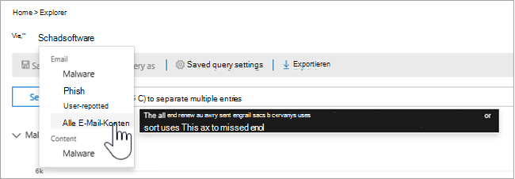
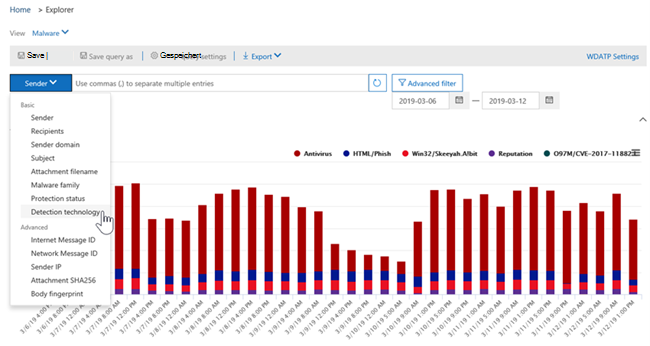

# Ansichten im Bedrohungs-Explorer und EchtzeiterkennungenViews in Threat Explorer and real-time detections

[!INCLUDE [Microsoft 365 Defender rebranding](../includes/microsoft-defender-for-office.md)]

**Gilt für****Applies to**
- [Microsoft Defender für Office 365 Plan 1 und Plan 2Microsoft Defender for Office 365 plan 1 and plan 2](office-365-atp.md)
- [Microsoft 365 DefenderMicrosoft 365 Defender](../mtp/microsoft-threat-protection.md)

[Der Bedrohungs-Explorer](threat-explorer.md) (und der Bericht über Echtzeiterkennungen) ist ein leistungsfähiges, nahezu echtzeitnahes Tool, mit dem Sicherheitsteams Bedrohungen im Security & Compliance Center untersuchen und darauf reagieren können.[Threat Explorer](threat-explorer.md) (and the real-time detections report) is a powerful, near real-time tool to help Security Operations teams investigate and respond to threats in the Security & Compliance Center. Explorer (und der Bericht über Echtzeiterkennungen) zeigt Informationen zu mutmaßlicher Schadsoftware und Phishing in E-Mails und Dateien in Office 365 sowie andere Sicherheitsbedrohungen und Risiken für Ihre Organisation an.Explorer (and the real-time detections report) displays information about suspected malware and phish in email and files in Office 365, as well as other security threats and risks to your organization.

- Wenn Sie [Über Microsoft Defender für Office 365](office-365-atp.md) Plan 2 verfügen, haben Sie Explorer.If you have [Microsoft Defender for Office 365](office-365-atp.md) Plan 2, then you have Explorer.
- Wenn Sie über Microsoft Defender für Office 365 Plan 1 verfügen, verfügen Sie über Echtzeiterkennungen.If you have Microsoft Defender for Office 365 Plan 1, then you have real-time detections.

Wenn Sie Explorer (oder den Bericht über Echtzeiterkennungen) zum ersten Mal öffnen, zeigt die Standardansicht E-Mail-Schadsoftwareerkennungen für die letzten 7 Tage an.When you first open Explorer (or the real-time detections report), the default view shows email malware detections for the past 7 days. Dieser Bericht kann auch Microsoft Defender für Office 365-Erkennungen anzeigen, z. B. bösartige URLs, die von sicheren Links erkannt [werden,](atp-safe-links.md)und schädliche Dateien, die von sicheren [Anlagen erkannt werden.](atp-safe-attachments.md)This report can also show Microsoft Defender for Office 365 detections, such as malicious URLs detected by [Safe Links](atp-safe-links.md), and malicious files detected by [Safe Attachments](atp-safe-attachments.md). Dieser Bericht kann so geändert werden, dass Daten für die letzten 30 Tage angezeigt werden (mit einem kostenpflichtigen Microsoft Defender for Office 365 P2-Abonnement).This report can be modified to show data for the past 30 days (with a Microsoft Defender for Office 365 P2 paid subscription). Testabonnements enthalten nur Daten für die letzten sieben Tage.Trial subscriptions will include data for the past seven days only.

****

|AbonnementSubscription|DienstprogrammUtility|Tage der DatenDays of Data|
|---|---|---|
|Microsoft Defender für Office 365 P1-TestversionMicrosoft Defender for Office 365 P1 trial|EchtzeiterkennungenReal-time detections|7 7|
|Microsoft Defender für Office 365 P1 kostenpflichtigMicrosoft Defender for Office 365 P1 paid|EchtzeiterkennungenReal-time detections|3030|
|Microsoft Defender für Office 365 P1 kostenpflichtige Tests Defender für Office 365 P2-TestversionMicrosoft Defender for Office 365 P1 paid testing Defender for Office 365 P2 trial|Sicherheitsrisiken-ExplorerThreat Explorer|7 7|
|Microsoft Defender für Office 365 P2-TestversionMicrosoft Defender for Office 365 P2 trial|Sicherheitsrisiken-ExplorerThreat Explorer|7 7|
|Microsoft Defender für Office 365 P2 kostenpflichtigMicrosoft Defender for Office 365 P2 paid|Sicherheitsrisiken-ExplorerThreat Explorer|3030|
|

> [!NOTE]
> Wir werden in Kürze das Datenaufbewahrungs- und Suchlimit von Explorer (und Echtzeiterkennungen) für Test-Mandanten von 7 auf 30 Tage erweitern.We will soon be extending the Explorer (and Real-time detections) data retention and search limit for trial tenants from 7 to 30 days. Diese Änderung wird im Rahmen des Roadmapelements Nr. 70544 nachverfolgt und befindet sich derzeit in einer Roll-out-Phase.This change is being tracked as part of roadmap item no. 70544, and is currently in a roll-out phase.

Verwenden **Sie** das Menü Ansicht, um zu ändern, welche Informationen angezeigt werden.Use the **View** menu to change what information is displayed. Mithilfe von QuickInfos können Sie bestimmen, welche Ansicht verwendet werden soll.Tooltips help you determine which view to use.

Nachdem Sie eine Ansicht ausgewählt haben, können Sie Filter anwenden und Abfragen einrichten, um weitere Analysen durchzuführen.Once you have selected a view, you can apply filters and set up queries to conduct further analysis. Die folgenden Abschnitte bieten eine kurze Übersicht über die verschiedenen Ansichten, die im Explorer verfügbar sind (oder Echtzeiterkennungen).The following sections provide a brief overview of the various views available in Explorer (or real-time detections).

## E-Mail > SchadsoftwareEmail > Malware

Um diesen Bericht anzeigen zu können, wählen Sie im Explorer (oder In-Echtzeit-Erkennungen) Die Option **E-Mail-Schadsoftware** \>  \> **anzeigen aus.**To view this report, in Explorer (or real-time detections), choose **View** \> **Email** \> **Malware**. Diese Ansicht zeigt Informationen zu E-Mail-Nachrichten, die als Schadsoftware identifiziert wurden.This view shows information about email messages that were identified as containing malware.

Klicken **Sie auf Absender,** um die Liste der Anzeigeoptionen zu öffnen.Click **Sender** to open your list of viewing options. Verwenden Sie diese Liste, um Daten nach Absender, Empfängern, Absenderdomäne, Betreff, Erkennungstechnologie, Schutzstatus und mehr anzeigen zu können.Use this list to view data by sender, recipients, sender domain, subject, detection technology, protection status, and more.

Wenn Sie beispielsweise sehen möchten, welche Aktionen für erkannte E-Mail-Nachrichten ergriffen wurden, wählen **Sie** in der Liste Schutzstatus aus.For example, to see what actions were taken on detected email messages, choose **Protection status** in the list. Wählen Sie eine Option aus, und klicken Sie dann auf die Schaltfläche Aktualisieren, um diesen Filter auf Ihren Bericht anzuwenden.Select an option, and then click the Refresh button to apply that filter to your report.

Zeigen Sie unter dem Diagramm weitere Details zu bestimmten Nachrichten an.Below the chart, view more details about specific messages. Wenn Sie ein Element in der Liste auswählen, wird ein Fly-Out-Bereich geöffnet, in dem Sie mehr über das ausgewählte Element erfahren können.When you select an item in the list, a fly-out pane opens, where you can learn more about the item you selected.

## E-Mail > PhishEmail > Phish

Wählen Sie zum Anzeigen dieses Berichts im Explorer (oder in Echtzeiterkennungen) **Die** Option E-Mail-Phish \>  \> **anzeigen aus.**To view this report, in Explorer (or real-time detections), choose **View** \> **Email** \> **Phish**. Diese Ansicht zeigt E-Mail-Nachrichten, die als Phishingversuche identifiziert wurden.This view shows email messages identified as phishing attempts.

Klicken **Sie auf Absender,** um die Liste der Anzeigeoptionen zu öffnen.Click **Sender** to open your list of viewing options. Verwenden Sie diese Liste zum Anzeigen von Daten nach Absender, Empfängern, Absenderdomäne, Absender-IP, URL-Domäne, klicken Sie auf Urteil und vieles mehr.Use this list to view data by sender, recipients, sender domain, sender IP, URL domain, click verdict, and more.

Wenn Sie beispielsweise sehen möchten, welche Aktionen beim Klicken auf URLs, die als Phishingversuche identifiziert wurden, ergriffen wurden, wählen Sie **in** der Liste Auf Urteil klicken, wählen Sie eine oder mehrere Optionen aus, und klicken Sie dann auf die Schaltfläche Aktualisieren.For example, to see what actions were taken when people clicked on URLs that were identified as phishing attempts, choose **Click verdict** in the list, select one or more options, and then click the Refresh button.

Unter dem Diagramm können Sie weitere Details zu bestimmten Nachrichten, URL-Klicks, URLs und E-Mail-Ursprung anzeigen.Below the chart, view more details about specific messages, URL clicks, URLs, and email origin.

Wenn Sie ein Element in der Liste auswählen, z. B. eine gefundene URL, wird ein Fly-Out-Bereich geöffnet, in dem Sie mehr über das ausgewählte Element erfahren können.When you select an item in the list, such as a URL that was detected, a fly-out pane opens, where you can learn more about the item you selected.

## E>-ÜbermittlungenEmail > Submissions

Wählen Sie zum Anzeigen dieses Berichts im Explorer (oder in Echtzeiterkennungen) **Die** Option E-Mail-Übermittlungen \>  \> **anzeigen aus.**To view this report, in Explorer (or real-time detections), choose **View** \> **Email** \> **Submissions**. Diese Ansicht zeigt E-Mails, die Benutzer als Junk- und nicht Junk- oder Phishing-E-Mails gemeldet haben.This view shows email that users have reported as junk, not junk, or phishing email.

Klicken **Sie auf Absender,** um die Liste der Anzeigeoptionen zu öffnen.Click **Sender** to open your list of viewing options. Verwenden Sie diese Liste, um Informationen nach Absender, Empfängern, Berichtstyp (der Bestimmung des Benutzers, dass es sich bei der E-Mail um Junk, nicht Junk oder Phishing) und vieles mehr handeln soll.Use this list to view information by sender, recipients, report type (the user's determination that the email was junk, not junk, or phish), and more.

Wenn Sie z. B. Informationen zu E-Mail-Nachrichten anzeigen möchten, die als Phishingversuche gemeldet wurden, klicken Sie auf Absenderberichtstyp, Wählen Sie  \>  **Phish** aus, und klicken Sie dann auf die Schaltfläche Aktualisieren.For example, to view information about email messages that were reported as phishing attempts, click **Sender** \> **Report type**, select **Phish**, and then click the Refresh button.

Zeigen Sie unterhalb des Diagramms weitere Details zu bestimmten E-Mail-Nachrichten an, z. B. Betreffzeile, IP-Adresse des Absenders, Benutzer, der die Nachricht als Junk, nicht Junk oder Phishing gemeldet hat, und vieles mehr.Below the chart, view more details about specific email messages, such as subject line, the sender's IP address, the user that reported the message as junk, not junk, or phish, and more.

Wählen Sie ein Element in der Liste aus, um weitere Details anzuzeigen.Select an item in the list to view additional details.

## E> Alle E-MailsEmail > All email

Um diesen Bericht anzeigen zu können, wählen Sie im Explorer **E-Mail** \> **alle** \> **E-Mails anzeigen aus.**To view this report, in Explorer, choose **View** \> **Email** \> **All mail**. Diese Ansichten zeigen eine all-up-Ansicht von E-Mail-Aktivitäten, einschließlich E-Mails, die aufgrund von Phishing oder Schadsoftware als schädlich identifiziert wurden, sowie alle nicht schädlichen E-Mails (normale E-Mails, Spam und Massen-E-Mails).This views shows an all-up view of email activity, including email identified as malicious due to phishing or malware, as well all non-malicious mail (normal email, spam, and bulk mail).

> [!NOTE]
> Wenn Sie einen Fehler erhalten, der **Zu** viele Daten zum Anzeigen liest, fügen Sie einen Filter hinzu, und verengt gegebenenfalls den angezeigten Datumsbereich.If you get an error that reads **Too much data to display**, add a filter and, if necessary, narrow the date range you're viewing.

Wenn Sie einen Filter anwenden möchten, wählen Sie **Absender** aus, wählen Sie ein Element in der Liste aus, und klicken Sie dann auf die Schaltfläche Aktualisieren.To apply a filter, choose **Sender**, select an item in the list, and then click the Refresh button. In unserem Beispiel haben wir die **Erkennungstechnologie** als Filter verwendet (es stehen mehrere Optionen zur Verfügung).In our example, we used **Detection technology** as a filter (there are several options available). Anzeigen von Informationen nach Absender, Absenderdomäne, Empfängern, Betreff, Anlagendateiname, Schadsoftwarefamilie, Schutzstatus (Aktionen, die von Den Bedrohungsschutzfeatures und -richtlinien in Office 365 ergriffen wurden), Erkennungstechnologie (wie die Schadsoftware erkannt wurde) und vieles mehr.View information by sender, sender's domain, recipients, subject, attachment filename, malware family, protection status (actions taken by your threat protection features and policies in Office 365), detection technology (how the malware was detected), and more.

Zeigen Sie unterhalb des Diagramms weitere Details zu bestimmten E-Mail-Nachrichten an, z. B. Betreffzeile, Empfänger, Absender, Status und so weiter.Below the chart, view more details about specific email messages, such as subject line, recipient, sender, status, and so on.

## Inhalt > SchadsoftwareContent > Malware

Um diesen Bericht anzuzeigen, wählen Sie im Explorer (oder In-Echtzeit-Erkennungen) Die Option **Inhalt Schadsoftware** \>  \> **anzeigen aus.**To view this report, in Explorer (or real-time detections), choose **View** \> **Content** \> **Malware**. Diese Ansicht zeigt Dateien, die von [Microsoft Defender für Office 365 in SharePoint Online, OneDrive for Business](atp-for-spo-odb-and-teams.md)und Microsoft Teams als schädlich identifiziert wurden.This view shows files that were identified as malicious by [Microsoft Defender for Office 365 in SharePoint Online, OneDrive for Business, and Microsoft Teams](atp-for-spo-odb-and-teams.md).

Anzeigen von Informationen nach Schadsoftwarefamilie, Erkennungstechnologie (wie die Schadsoftware erkannt wurde) und Arbeitsauslastung (OneDrive, SharePoint oder Teams).View information by malware family, detection technology (how the malware was detected), and workload (OneDrive, SharePoint, or Teams).

Zeigen Sie unterhalb des Diagramms weitere Details zu bestimmten Dateien an, z. B. Anlagendateiname, Arbeitsauslastung, Dateigröße, Personen, die die Datei zuletzt geändert haben, und vieles mehr.Below the chart, view more details about specific files, such as attachment filename, workload, file size, who last modified the file, and more.

## Klick-und-Filter-FunktionenClick-to-filter capabilities

Mit Explorer (und Echtzeiterkennungen) können Sie einen Filter mit einem Klick anwenden.With Explorer (and real-time detections), you can apply a filter in a click. Klicken Sie in der Legende auf ein Element, und dieses Element wird zu einem Filter für den Bericht.Click an item in the legend, and that item becomes a filter for the report. Angenommen, wir sehen uns die Schadsoftwareansicht im Explorer an:For example, suppose we are looking at the Malware view in Explorer:

Wenn Sie in diesem Diagramm auf **ATP-Detonation** klicken, wird eine Ansicht wie die folgende angezeigt:Clicking **ATP Detonation** in this chart results in a view like this:

In dieser Ansicht sehen wir uns nun Daten für Dateien an, die von sicheren Anlagen [detoniert wurden.](atp-safe-attachments.md)In this view, we are now looking at data for files that were detonated by [Safe Attachments](atp-safe-attachments.md). Unterhalb des Diagramms sehen wir Details zu bestimmten E-Mail-Nachrichten mit Anlagen, die von sicheren Anlagen erkannt wurden.Below the chart, we can see details about specific email messages that had attachments that were detected by Safe Attachments.

Durch Auswählen eines oder mehrerer Elemente wird das Menü **Aktionen** aktiviert, das verschiedene Auswahlmöglichkeiten für die ausgewählten Elemente bietet.Selecting one or more items activates the **Actions** menu, which offers several choices from which to choose for the selected item(s).

Die Möglichkeit, mit einem Klick zu filtern und zu bestimmten Details zu navigieren, kann Ihnen bei der Untersuchung von Bedrohungen viel Zeit sparen.The ability to filter in a click and navigate to specific details can save you a lot of time in investigating threats.

## Abfragen und FilterQueries and filters

Der Explorer (sowie der Bericht über Echtzeiterkennungen) verfügt über mehrere leistungsstarke Filter und Abfragefunktionen, mit denen Sie details anzeigen können, z. B. Top-Zielbenutzer, Top-Malwarefamilien, Erkennungstechnologie und vieles mehr.Explorer (as well as the real-time detections report) has several powerful filters and querying capabilities that enable you to drill into details, such as top targeted users, top malware families, detection technology and more. Jede Art von Bericht bietet eine Vielzahl von Möglichkeiten zum Anzeigen und Untersuchen von Daten.Each kind of report offers a variety of ways to view and explore data.

> [!IMPORTANT]
> Verwenden Sie keine Platzhalterzeichen, z. B. sternchen oder Fragezeichen, in der Abfrageleiste für Explorer (oder Echtzeiterkennungen).Do not use wildcard characters, such as an asterisk or a question mark, in the query bar for Explorer (or real-time detections). Wenn Sie im  Feld Betreff nach E-Mail-Nachrichten suchen, führt Explorer (oder Echtzeiterkennungen) einen teilweisen Abgleich durch und liefert Ergebnisse, die einer Platzhaltersuche ähneln.When you search on the **Subject field** for email messages, Explorer (or real-time detections) will perform partial matching and yield results similar to a wildcard search.
