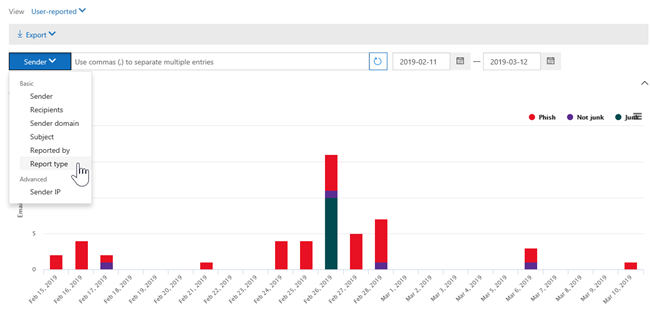
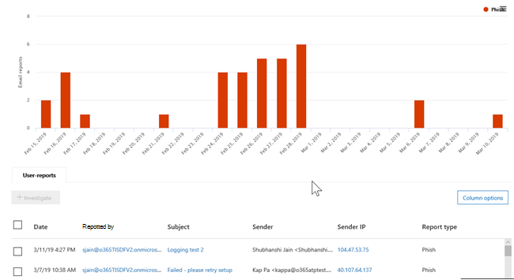

# Ansichten im Bedrohungs-Explorer und Echtzeiterkennungen

[!INCLUDE [Microsoft 365 Defender rebranding](../includes/microsoft-defender-for-office.md)]

**Gilt für**
- [Microsoft Defender für Office 365 Plan 1 und Plan 2](defender-for-office-365.md)
- [Microsoft 365 Defender](../defender/microsoft-365-defender.md)

[Der Bedrohungs-Explorer](threat-explorer.md) (und der Bericht über Echtzeiterkennungen) ist ein leistungsfähiges, nahezu echtzeitnahes Tool, mit dem Sicherheitsteams Bedrohungen im Security & Compliance Center untersuchen und darauf reagieren können. Explorer (und der Bericht über Echtzeiterkennungen) zeigt Informationen zu mutmaßlicher Schadsoftware und Phishing in E-Mails und Dateien in Office 365 sowie andere Sicherheitsbedrohungen und Risiken für Ihre Organisation an.

- Wenn Sie [Microsoft Defender für Office 365](defender-for-office-365.md) Plan 2 haben, haben Sie Explorer.
- Wenn Sie Microsoft Defender für Office 365 Plan 1 haben, verfügen Sie über Echtzeiterkennungen.

Wenn Sie Explorer (oder den Bericht über Echtzeiterkennungen) zum ersten Mal öffnen, zeigt die Standardansicht E-Mail-Schadsoftwareerkennungen für die letzten 7 Tage an. Dieser Bericht kann auch Microsoft Defender für Office 365 anzeigen, z. B. bösartige URLs, die von sicheren Links erkannt [werden,](safe-links.md)und schädliche Dateien, die von sicheren Anlagen [erkannt werden.](safe-attachments.md) Dieser Bericht kann so geändert werden, dass Daten für die letzten 30 Tage angezeigt werden (mit einem kostenpflichtigen Microsoft Defender for Office 365 P2-Abonnement). Testabonnements enthalten nur Daten für die letzten sieben Tage.

****

|Abonnement|Dienstprogramm|Tage der Daten|
|---|---|---|
|Microsoft Defender für Office 365 P1-Testversion|Echtzeiterkennungen|7 |
|Microsoft Defender für Office 365 P1 kostenpflichtig|Echtzeiterkennungen|30|
|Microsoft Defender for Office 365 P1 paid testing Defender for Office 365 P2 trial|Sicherheitsrisiken-Explorer|7 |
|Microsoft Defender für Office 365 P2-Testversion|Sicherheitsrisiken-Explorer|7 |
|Microsoft Defender für Office 365 P2 kostenpflichtig|Sicherheitsrisiken-Explorer|30|
|

> [!NOTE]
> Wir werden in Kürze das Datenaufbewahrungs- und Suchlimit von Explorer (und Echtzeiterkennungen) für Test-Mandanten von 7 auf 30 Tage erweitern. Diese Änderung wird im Rahmen des Roadmapelements Nr. 70544 nachverfolgt und befindet sich derzeit in einer Roll-out-Phase.

Verwenden **Sie** das Menü Ansicht, um zu ändern, welche Informationen angezeigt werden. Mithilfe von QuickInfos können Sie bestimmen, welche Ansicht verwendet werden soll.

Nachdem Sie eine Ansicht ausgewählt haben, können Sie Filter anwenden und Abfragen einrichten, um weitere Analysen durchzuführen. Die folgenden Abschnitte bieten eine kurze Übersicht über die verschiedenen Ansichten, die im Explorer verfügbar sind (oder Echtzeiterkennungen).

## E-Mail > Schadsoftware

Um diesen Bericht anzeigen zu können, wählen Sie im Explorer (oder In-Echtzeit-Erkennungen) Die Option **E-Mail-Schadsoftware** \>  \> **anzeigen aus.** Diese Ansicht zeigt Informationen zu E-Mail-Nachrichten, die als Schadsoftware identifiziert wurden.

Klicken **Sie auf Absender,** um die Liste der Anzeigeoptionen zu öffnen. Verwenden Sie diese Liste, um Daten nach Absender, Empfängern, Absenderdomäne, Betreff, Erkennungstechnologie, Schutzstatus und mehr anzeigen zu können.

Wenn Sie beispielsweise sehen möchten, welche Aktionen für erkannte E-Mail-Nachrichten ergriffen wurden, wählen **Sie** in der Liste Schutzstatus aus. Wählen Sie eine Option aus, und klicken Sie dann auf die Schaltfläche Aktualisieren, um diesen Filter auf Ihren Bericht anzuwenden.

Zeigen Sie unter dem Diagramm weitere Details zu bestimmten Nachrichten an. Wenn Sie ein Element in der Liste auswählen, wird ein Fly-Out-Bereich geöffnet, in dem Sie mehr über das ausgewählte Element erfahren können.

## E-Mail > Phish

Wählen Sie zum Anzeigen dieses Berichts im Explorer (oder in Echtzeiterkennungen) **Die** Option E-Mail-Phish \>  \> **anzeigen aus.** Diese Ansicht zeigt E-Mail-Nachrichten, die als Phishingversuche identifiziert wurden.

Klicken **Sie auf Absender,** um die Liste der Anzeigeoptionen zu öffnen. Verwenden Sie diese Liste zum Anzeigen von Daten nach Absender, Empfängern, Absenderdomäne, Absender-IP, URL-Domäne, klicken Sie auf Urteil und vieles mehr.

Wenn Sie beispielsweise sehen möchten, welche Aktionen beim Klicken auf URLs, die als Phishingversuche identifiziert wurden, ergriffen wurden, wählen Sie **in** der Liste Auf Urteil klicken, wählen Sie eine oder mehrere Optionen aus, und klicken Sie dann auf die Schaltfläche Aktualisieren.

Unter dem Diagramm können Sie weitere Details zu bestimmten Nachrichten, URL-Klicks, URLs und E-Mail-Ursprung anzeigen.

Wenn Sie ein Element in der Liste auswählen, z. B. eine gefundene URL, wird ein Fly-Out-Bereich geöffnet, in dem Sie mehr über das ausgewählte Element erfahren können.

## E>-Übermittlungen

Wählen Sie zum Anzeigen dieses Berichts im Explorer (oder in Echtzeiterkennungen) **Die** Option E-Mail-Übermittlungen \>  \> **anzeigen aus.** Diese Ansicht zeigt E-Mails, die Benutzer als Junk- und nicht Junk- oder Phishing-E-Mails gemeldet haben.

Klicken **Sie auf Absender,** um die Liste der Anzeigeoptionen zu öffnen. Verwenden Sie diese Liste, um Informationen nach Absender, Empfängern, Berichtstyp (der Bestimmung des Benutzers, dass es sich bei der E-Mail um Junk, nicht Junk oder Phishing) und vieles mehr handeln soll.

Wenn Sie z. B. Informationen zu E-Mail-Nachrichten anzeigen möchten, die als Phishingversuche gemeldet wurden, klicken Sie auf Absenderberichtstyp, Wählen Sie  \>  **Phish** aus, und klicken Sie dann auf die Schaltfläche Aktualisieren.

Zeigen Sie unterhalb des Diagramms weitere Details zu bestimmten E-Mail-Nachrichten an, z. B. Betreffzeile, IP-Adresse des Absenders, Benutzer, der die Nachricht als Junk, nicht Junk oder Phishing gemeldet hat, und vieles mehr.

Wählen Sie ein Element in der Liste aus, um weitere Details anzuzeigen.

## E> Alle E-Mails

Um diesen Bericht anzeigen zu können, wählen Sie im Explorer **E-Mail** \> **alle** \> **E-Mails anzeigen aus.** Diese Ansichten zeigen eine all-up-Ansicht von E-Mail-Aktivitäten, einschließlich E-Mails, die aufgrund von Phishing oder Schadsoftware als schädlich identifiziert wurden, sowie alle nicht schädlichen E-Mails (normale E-Mails, Spam und Massen-E-Mails).

> [!NOTE]
> Wenn Sie einen Fehler erhalten, der **Zu** viele Daten zum Anzeigen liest, fügen Sie einen Filter hinzu, und verengt gegebenenfalls den angezeigten Datumsbereich.

Wenn Sie einen Filter anwenden möchten, wählen Sie **Absender** aus, wählen Sie ein Element in der Liste aus, und klicken Sie dann auf die Schaltfläche Aktualisieren. In unserem Beispiel haben wir die **Erkennungstechnologie** als Filter verwendet (es stehen mehrere Optionen zur Verfügung). Anzeigen von Informationen nach Absender, Absenderdomäne, Empfängern, Betreff, Anlagendateiname, Schadsoftwarefamilie, Schutzstatus (Aktionen, die von Den Bedrohungsschutzfeatures und -richtlinien in Office 365 ergriffen wurden), Erkennungstechnologie (wie die Schadsoftware erkannt wurde) und vieles mehr.

Zeigen Sie unterhalb des Diagramms weitere Details zu bestimmten E-Mail-Nachrichten an, z. B. Betreffzeile, Empfänger, Absender, Status und so weiter.

## Inhalt > Schadsoftware

Um diesen Bericht anzuzeigen, wählen Sie im Explorer (oder In-Echtzeit-Erkennungen) Die Option **Inhalt Schadsoftware** \>  \> **anzeigen aus.** Diese Ansicht zeigt Dateien, die von [Microsoft Defender for Office 365 in SharePoint Online, OneDrive for Business und Microsoft Teams.](mdo-for-spo-odb-and-teams.md)

Anzeigen von Informationen nach Schadsoftwarefamilie, Erkennungstechnologie (wie die Schadsoftware erkannt wurde) und Arbeitsauslastung (OneDrive, SharePoint oder Teams).

Zeigen Sie unterhalb des Diagramms weitere Details zu bestimmten Dateien an, z. B. Anlagendateiname, Arbeitsauslastung, Dateigröße, Personen, die die Datei zuletzt geändert haben, und vieles mehr.

## Klick-und-Filter-Funktionen

Mit Explorer (und Echtzeiterkennungen) können Sie einen Filter mit einem Klick anwenden. Klicken Sie in der Legende auf ein Element, und dieses Element wird zu einem Filter für den Bericht. Angenommen, wir sehen uns die Schadsoftwareansicht im Explorer an:

Wenn Sie in diesem Diagramm auf **ATP-Detonation** klicken, wird eine Ansicht wie die folgende angezeigt:

In dieser Ansicht sehen wir uns nun Daten für Dateien an, die von sicheren Anlagen [detoniert wurden.](safe-attachments.md) Unterhalb des Diagramms sehen wir Details zu bestimmten E-Mail-Nachrichten mit Anlagen, die von sicheren Anlagen erkannt wurden.

Durch Auswählen eines oder mehrerer Elemente wird das Menü **Aktionen** aktiviert, das verschiedene Auswahlmöglichkeiten für die ausgewählten Elemente bietet.

Die Möglichkeit, mit einem Klick zu filtern und zu bestimmten Details zu navigieren, kann Ihnen bei der Untersuchung von Bedrohungen viel Zeit sparen.

## Abfragen und Filter

Der Explorer (sowie der Bericht über Echtzeiterkennungen) verfügt über mehrere leistungsstarke Filter und Abfragefunktionen, mit denen Sie details anzeigen können, z. B. Top-Zielbenutzer, Top-Malwarefamilien, Erkennungstechnologie und vieles mehr. Jede Art von Bericht bietet eine Vielzahl von Möglichkeiten zum Anzeigen und Untersuchen von Daten.

> [!IMPORTANT]
> Verwenden Sie keine Platzhalterzeichen, z. B. sternchen oder Fragezeichen, in der Abfrageleiste für Explorer (oder Echtzeiterkennungen). Wenn Sie im  Feld Betreff nach E-Mail-Nachrichten suchen, führt Explorer (oder Echtzeiterkennungen) einen teilweisen Abgleich durch und liefert Ergebnisse, die einer Platzhaltersuche ähneln.
