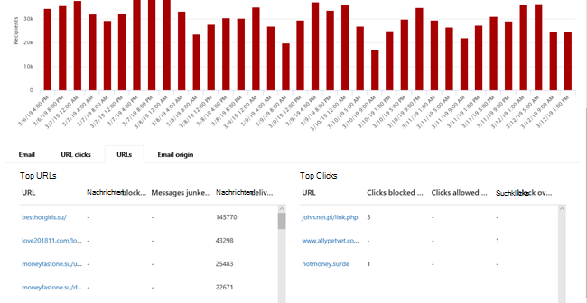
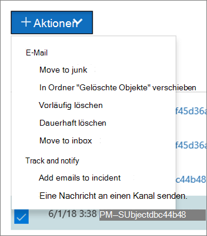

# Ansichten im Bedrohungs-Explorer und Echtzeiterkennungen

[!INCLUDE [Microsoft 365 Defender rebranding](../includes/microsoft-defender-for-office.md)]

**Gilt für**
- [Microsoft Defender für Office 365 Plan 1 und Plan 2](defender-for-office-365.md)
- [Microsoft 365 Defender](../defender/microsoft-365-defender.md)

[Der Bedrohungs-Explorer](threat-explorer.md) (und der Bericht über Echtzeiterkennungen) ist ein leistungsstarkes, nahezu in Echtzeit verfügbares Tool, mit dem Sicherheitsteams Bedrohungen im Microsoft 365 Defender-Portal untersuchen und darauf reagieren können. Explorer (und der Bericht über Echtzeiterkennungen) zeigt Informationen zu verdächtiger Schadsoftware und Phishing in E-Mails und Dateien in Office 365 sowie andere Sicherheitsbedrohungen und Risiken für Ihre Organisation an.

- Wenn Sie [über Microsoft Defender für Office 365](defender-for-office-365.md) Plan 2 verfügen, verfügen Sie über Explorer.
- Wenn Sie Über Microsoft Defender für Office 365 Plan 1 verfügen, haben Sie Echtzeiterkennungen.

Wenn Sie den Explorer (oder den Bericht über Echtzeiterkennungen) zum ersten Mal öffnen, zeigt die Standardansicht E-Mail-Schadsoftwareerkennungen für die letzten 7 Tage an. Dieser Bericht kann auch Microsoft Defender für Office 365 Erkennungen anzeigen, z. B. bösartige URLs, die von [sicheren Links](safe-links.md)erkannt werden, und schädliche Dateien, die von [sicheren Anlagen](safe-attachments.md)erkannt werden. Dieser Bericht kann so geändert werden, dass Daten für die letzten 30 Tage angezeigt werden (mit einem kostenpflichtigen Microsoft Defender für Office 365 P2-Abonnement). Testabonnements enthalten nur Daten für die letzten sieben Tage.

****

|Abonnement|Dienstprogramm|Datentage|
|---|---|---|
|Testversion von Microsoft Defender für Office 365 P1|Echtzeiterkennungen|7 |
|Microsoft Defender für Office 365 P1 bezahlt|Echtzeiterkennungen|30|
|Microsoft Defender for Office 365 P1 paid testing Defender for Office 365 P2 trial|Sicherheitsrisiken-Explorer|7 |
|Testversion von Microsoft Defender für Office 365 P2|Sicherheitsrisiken-Explorer|7 |
|Microsoft Defender für Office 365 P2, bezahlt|Sicherheitsrisiken-Explorer|30|
|

> [!NOTE]
> Wir werden in Kürze die Datenaufbewahrungs- und Suchgrenze von Explorer (und Echtzeiterkennungen) für Testmandanten von 7 auf 30 Tage erweitern. Diese Änderung wird als Teil des Roadmap-Elements Nr. 70544 nachverfolgt und befindet sich derzeit in einer Rolloutphase.

Verwenden Sie das Menü **"Ansicht",** um zu ändern, welche Informationen angezeigt werden. Mithilfe von QuickInfos können Sie bestimmen, welche Ansicht verwendet werden soll.

Nachdem Sie eine Ansicht ausgewählt haben, können Sie Filter anwenden und Abfragen einrichten, um weitere Analysen durchzuführen. Die folgenden Abschnitte bieten eine kurze Übersicht über die verschiedenen Ansichten, die im Explorer verfügbar sind (oder Echtzeiterkennungen).

## E-Mail-> Schadsoftware

Um diesen Bericht anzuzeigen, wählen Sie im Explorer  (oder Echtzeiterkennungen) die Option \> **"E-Mail-Schadsoftware** \> anzeigen" aus. In dieser Ansicht werden Informationen zu E-Mail-Nachrichten angezeigt, die als schadsoftware enthalten identifiziert wurden.

Klicken Sie auf **"Absender",** um die Liste der Anzeigeoptionen zu öffnen. Verwenden Sie diese Liste, um Daten nach Absender, Empfänger, Absenderdomäne, Betreff, Erkennungstechnologie, Schutzstatus und mehr anzuzeigen.

Wenn Sie beispielsweise sehen möchten, welche Aktionen für erkannte E-Mail-Nachrichten ausgeführt wurden, wählen Sie den **Schutzstatus** in der Liste aus. Wählen Sie eine Option aus, und klicken Sie dann auf die Schaltfläche "Aktualisieren", um diesen Filter auf Ihren Bericht anzuwenden.

Zeigen Sie unterhalb des Diagramms weitere Details zu bestimmten Nachrichten an. Wenn Sie ein Element in der Liste auswählen, wird ein Flyoutbereich geöffnet, in dem Sie mehr über das ausgewählte Element erfahren können.

## E-Mail-> Phishing

Um diesen Bericht anzuzeigen, wählen Sie im Explorer  (oder Echtzeiterkennungen) \> **E-Mail-Phishing** anzeigen \> aus. In dieser Ansicht werden E-Mail-Nachrichten angezeigt, die als Phishingversuche identifiziert wurden.

Klicken Sie auf **"Absender",** um die Liste der Anzeigeoptionen zu öffnen. Verwenden Sie diese Liste, um Daten nach Absender, Empfänger, Absenderdomäne, Absender-IP, URL-Domäne, Klickbewertung und mehr anzuzeigen.

Um beispielsweise zu sehen, welche Aktionen ausgeführt wurden, wenn Benutzer auf URLs geklickt haben, die als Phishingversuche identifiziert wurden, wählen Sie in der Liste **auf "Bewertung klicken",** wählen Sie eine oder mehrere Optionen aus, und klicken Sie dann auf die Schaltfläche "Aktualisieren".

Zeigen Sie unterhalb des Diagramms weitere Details zu bestimmten Nachrichten, URL-Klicks, URLs und E-Mail-Ursprung an.

Wenn Sie ein Element in der Liste auswählen, z. B. eine url, die erkannt wurde, wird ein Flyoutbereich geöffnet, in dem Sie mehr über das ausgewählte Element erfahren können.

## E-Mail->-Übermittlungen

Um diesen Bericht anzuzeigen, wählen Sie im Explorer  (oder Echtzeiterkennungen) die Option \> **"E-Mail-Übermittlungen** \> anzeigen" **aus.** Diese Ansicht zeigt E-Mails, die Benutzer als Junk-, nicht Junk- oder Phishing-E-Mails gemeldet haben.

Klicken Sie auf **"Absender",** um die Liste der Anzeigeoptionen zu öffnen. Verwenden Sie diese Liste, um Informationen nach Absender, Empfängern, Berichtstyp (die Entscheidung des Benutzers, dass die E-Mail Junk war, nicht Junk oder Phishing) und mehr anzuzeigen.

Wenn Sie z. B. Informationen zu E-Mail-Nachrichten anzeigen möchten, die als Phishingversuche gemeldet wurden, klicken Sie auf  \> **"Absenderbericht",** wählen Sie **"Phishing"** aus, und klicken Sie dann auf die Schaltfläche "Aktualisieren".

Zeigen Sie unterhalb des Diagramms weitere Details zu bestimmten E-Mail-Nachrichten an, z. B. Betreffzeile, DIE IP-Adresse des Absenders, der Benutzer, der die Nachricht als Junk, nicht Junk oder Phishing gemeldet hat, und vieles mehr.

Wählen Sie ein Element in der Liste aus, um weitere Details anzuzeigen.

## E-Mail > Alle E-Mails

Um diesen Bericht anzuzeigen,  wählen Sie im Explorer \> **"Alle E-Mail anzeigen"** \> aus. Diese Ansichten zeigen eine Gesamtansicht der E-Mail-Aktivitäten, einschließlich E-Mails, die aufgrund von Phishing oder Schadsoftware als bösartig erkannt wurden, sowie alle nicht schädlichen E-Mails (normale E-Mails, Spam und Massen-E-Mails).

> [!NOTE]
> Wenn ein Fehler angezeigt wird, der **zu viele Daten anzeigt,** fügen Sie einen Filter hinzu, und schränken Sie ggf. den angezeigten Datumsbereich ein.

Um einen Filter anzuwenden, wählen Sie **"Absender"** aus, wählen Sie ein Element in der Liste aus, und klicken Sie dann auf die Schaltfläche "Aktualisieren". In unserem Beispiel haben wir **die Erkennungstechnologie** als Filter verwendet (es stehen mehrere Optionen zur Verfügung). Anzeigen von Informationen nach Absender, Domäne des Absenders, Empfänger, Betreff, Dateiname der Anlage, Schadsoftwarefamilie, Schutzstatus (Aktionen, die von Ihren Bedrohungsschutzfeatures und -richtlinien in Office 365 ausgeführt werden), Erkennungstechnologie (wie die Schadsoftware erkannt wurde) und vieles mehr.

Zeigen Sie unterhalb des Diagramms weitere Details zu bestimmten E-Mail-Nachrichten an, z. B. Betreffzeile, Empfänger, Absender, Status usw.

## Inhalt > Schadsoftware

Um diesen Bericht anzuzeigen, wählen Sie im Explorer  (oder Echtzeiterkennungen) \> **inhaltsbezogene** \> **Schadsoftware** anzeigen aus. In dieser Ansicht werden Dateien angezeigt, die von [Microsoft Defender für Office 365 in SharePoint Online, OneDrive for Business und Microsoft Teams](mdo-for-spo-odb-and-teams.md)als bösartig erkannt wurden.

Anzeigen von Informationen nach Schadsoftwarefamilie, Erkennungstechnologie (wie die Schadsoftware erkannt wurde) und Workload (OneDrive, SharePoint oder Teams).

Zeigen Sie unterhalb des Diagramms weitere Details zu bestimmten Dateien an, z. B. Anlagendateiname, Arbeitsauslastung, Dateigröße, wer die Datei zuletzt geändert hat und vieles mehr.

## Klick-und-Filter-Funktionen

Mit Explorer (und Echtzeiterkennungen) können Sie einen Filter in einem Klick anwenden. Klicken Sie in der Legende auf ein Element, und dieses Element wird zu einem Filter für den Bericht. Nehmen wir beispielsweise an, dass wir die Schadsoftwareansicht im Explorer betrachten:

Durch Klicken auf **die ATP-Detonation** in diesem Diagramm wird eine Ansicht wie die folgende angezeigt:

In dieser Ansicht betrachten wir jetzt Daten für Dateien, die durch [sichere Anlagen](safe-attachments.md)detoniert wurden. Unterhalb des Diagramms sehen wir Details zu bestimmten E-Mail-Nachrichten mit Anlagen, die von sicheren Anlagen erkannt wurden.

Wenn Sie ein oder mehrere Elemente auswählen, wird das Menü **"Aktionen"** aktiviert, das mehrere Auswahlmöglichkeiten für die ausgewählten Elemente bietet.

Die Möglichkeit, in einem Klick zu filtern und zu bestimmten Details zu navigieren, kann Ihnen viel Zeit bei der Untersuchung von Bedrohungen sparen.

## Abfragen und Filter

Der Explorer (sowie der Bericht über Echtzeiterkennungen) verfügt über mehrere leistungsstarke Filter und Abfragefunktionen, mit denen Sie details anzeigen können, z. B. benutzerorientierte Top-Benutzer, top Schadsoftwarefamilien, Erkennungstechnologie und vieles mehr. Jede Art von Bericht bietet eine Vielzahl von Möglichkeiten zum Anzeigen und Erkunden von Daten.

> [!IMPORTANT]
> Verwenden Sie keine Platzhalterzeichen, z. B. ein Sternchen oder ein Fragezeichen, in der Abfrageleiste für Explorer (oder Echtzeiterkennungen). Wenn Sie im **Feld Betreff** nach E-Mail-Nachrichten suchen, führt Explorer (oder Echtzeiterkennungen) einen teilweisen Abgleich durch und liefert Ergebnisse, die einer Platzhaltersuche ähneln.
