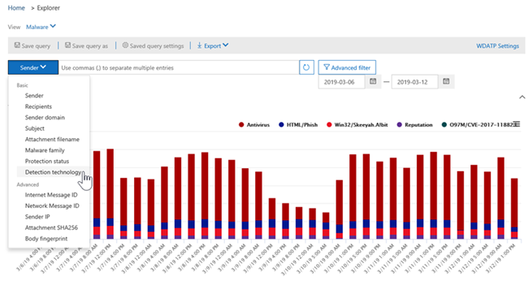
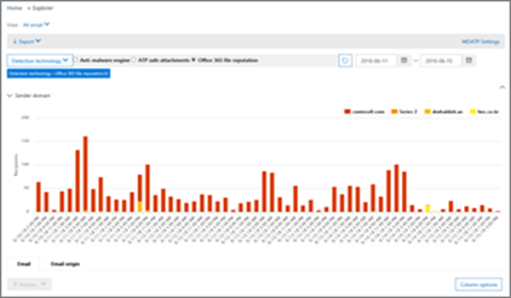

# Ansichten im Bedrohungs-Explorer und Echtzeiterkennungen

[!INCLUDE [Microsoft 365 Defender rebranding](../includes/microsoft-defender-for-office.md)]

**Gilt für**
- [Microsoft Defender für Office 365 Plan 1 und Plan 2](office-365-atp.md)
- [Microsoft 365 Defender](../mtp/microsoft-threat-protection.md)

[Der Bedrohungs-Explorer](threat-explorer.md) (und der Bericht über Echtzeiterkennungen) ist ein leistungsstarkes, nahezu echtzeitnahes Tool, mit dem Sicherheitsteams Bedrohungen im Security & Compliance Center untersuchen und darauf reagieren können. Explorer (und der Bericht über Echtzeiterkennungen) zeigt Informationen zu verdächtiger Schadsoftware und Phishing in E-Mails und Dateien in Office 365 sowie andere Sicherheitsbedrohungen und Risiken für Ihre Organisation an.

- Wenn Sie [über Microsoft Defender für Office 365](office-365-atp.md) Plan 2 verfügen, verfügen Sie über Explorer.
- Wenn Sie über Microsoft Defender für Office 365 Plan 1 verfügen, verfügen Sie über Echtzeiterkennungen.

Wenn Sie Explorer (oder den Bericht über Echtzeiterkennungen) zum ersten Mal öffnen, werden in der Standardansicht E-Mail-Schadsoftwareerkennungen für die letzten 7 Tage angezeigt. Dieser Bericht kann auch Microsoft Defender für Office 365-Erkennungen anzeigen, z. B. bösartige URLs, die von sicheren Links erkannt [werden,](atp-safe-links.md)und schädliche Dateien, die von sicheren Anlagen [erkannt werden.](atp-safe-attachments.md) Dieser Bericht kann so geändert werden, dass Daten für die letzten 30 Tage angezeigt werden (mit einem kostenpflichtigen Microsoft Defender für Office 365 P2-Abonnement). Testabonnements enthalten nur Daten für die letzten sieben Tage.

****

|Abonnement|Dienstprogramm|Tage der Daten|
|---|---|---|
|Testversion von Microsoft Defender für Office 365 P1|Echtzeiterkennungen|7 |
|Microsoft Defender für Office 365 P1 kostenpflichtig|Echtzeiterkennungen|30|
|Testversion von Microsoft Defender für Office 365 P1 mit kostenpflichtigen Tests für Defender für Office 365 P2|Sicherheitsrisiken-Explorer|7 |
|Testversion von Microsoft Defender für Office 365 P2|Sicherheitsrisiken-Explorer|7 |
|Microsoft Defender für Office 365 P2 kostenpflichtig|Sicherheitsrisiken-Explorer|30|
|

Verwenden Sie das **Menü** "Ansicht", um zu ändern, welche Informationen angezeigt werden. Mithilfe von QuickInfos können Sie bestimmen, welche Ansicht verwendet werden soll.

Nachdem Sie eine Ansicht ausgewählt haben, können Sie Filter anwenden und Abfragen einrichten, um weitere Analysen durchzuführen. Die folgenden Abschnitte bieten eine kurze Übersicht über die verschiedenen Ansichten, die im Explorer verfügbar sind (oder Echtzeiterkennungen).

## Schadsoftware > E-Mail

Wählen Sie zum Anzeigen dieses Berichts im Explorer (oder in Echtzeiterkennungen) die Option **"E-Mail-Schadsoftware** \>  \> **anzeigen" aus.** In dieser Ansicht werden Informationen zu E-Mail-Nachrichten angezeigt, die als Schadsoftware erkannt wurden.

Klicken **Sie auf "Absender",** um die Liste der Anzeigeoptionen zu öffnen. In dieser Liste können Sie Daten nach Absender, Empfängern, Absenderdomäne, Betreff, Erkennungstechnologie, Schutzstatus und mehr anzeigen.

Um beispielsweise zu sehen, welche Aktionen für erkannte E-Mail-Nachrichten ergriffen wurden, **wählen** Sie in der Liste "Schutzstatus" aus. Wählen Sie eine Option aus, und klicken Sie dann auf die Schaltfläche "Aktualisieren", um diesen Filter auf Ihren Bericht anzuwenden.

Zeigen Sie unter dem Diagramm weitere Details zu bestimmten Nachrichten an. Wenn Sie ein Element in der Liste auswählen, wird ein Flyoutbereich geöffnet, in dem Sie mehr über das ausgewählte Element erfahren können.

## Phishing > E-Mail

Um diesen Bericht anzeigen zu können, wählen Sie im Explorer (oder in Echtzeit Erkennungen) die Option "E-Mail-Phishing  \>  \> **anzeigen" aus.** In dieser Ansicht werden E-Mail-Nachrichten angezeigt, die als Phishingversuche identifiziert wurden.

Klicken **Sie auf "Absender",** um die Liste der Anzeigeoptionen zu öffnen. Verwenden Sie diese Liste zum Anzeigen von Daten nach Absender, Empfängern, Absenderdomäne, Absender-IP, URL-Domäne, Klicken auf "Verdingung" und mehr.

Um z. B. zu sehen, welche Aktionen beim Klicken auf URLs, die als Phishingversuche identifiziert wurden, ergriffen wurden, wählen Sie in der Liste **"Click-Verdict"** aus, wählen Sie eine oder mehrere Optionen aus, und klicken Sie dann auf die Schaltfläche "Aktualisieren".

Zeigen Sie unter dem Diagramm weitere Details zu bestimmten Nachrichten, URL-Klicks, URLs und E-Mail-Ursprung an.

Wenn Sie ein Element in der Liste auswählen, z. B. eine url, die erkannt wurde, wird ein Flyoutbereich geöffnet, in dem Sie mehr über das ausgewählte Element erfahren können.

## E->-Übermittlungen

Wählen Sie zum Anzeigen dieses Berichts im Explorer (oder in Echtzeiterkennungen) die Option "E-Mail-Übermittlungen  \>  \> **anzeigen" aus.** Diese Ansicht zeigt E-Mails, die Benutzer als Junk-E-Mail, nicht als Junk- oder Phishing-E-Mail gemeldet haben.

Klicken **Sie auf "Absender",** um die Liste der Anzeigeoptionen zu öffnen. Verwenden Sie diese Liste, um Informationen nach Absender, Empfängern, Berichtstyp (die Bestimmung des Benutzers, dass es sich bei der E-Mail um Junk- oder Phishing-E-Mails handeln soll) und vieles mehr anzeigen zu können.

Wenn Sie beispielsweise Informationen zu E-Mail-Nachrichten anzeigen möchten, die als Phishingversuche gemeldet wurden, klicken Sie auf **"Absenderbericht",** wählen \>  **"Phishing"** aus, und klicken Sie dann auf die Schaltfläche "Aktualisieren".

Zeigen Sie unterhalb des Diagramms weitere Details zu bestimmten E-Mail-Nachrichten an, z. B. Betreffzeile, die IP-Adresse des Absenders, den Benutzer, der die Nachricht als Junk, nicht Junk oder Phishing gemeldet hat, und vieles mehr.

Wählen Sie ein Element in der Liste aus, um weitere Details anzuzeigen.

## E> Alle E-Mails

Wählen Sie zum Anzeigen dieses Berichts im Explorer **"Alle** E-Mails \>  \> **anzeigen" aus.** Diese Ansichten zeigen eine all-up-Ansicht der E-Mail-Aktivitäten, einschließlich E-Mails, die aufgrund von Phishing oder Schadsoftware als bösartig identifiziert wurden, sowie alle nicht schädlichen E-Mails (normale E-Mails, Spam und Massen-E-Mails).

> [!NOTE]
> Wenn eine Fehlermeldung angezeigt wird, die zu viele Daten zum Anzeigen **liest,** fügen Sie einen Filter hinzu, und enengnen Sie bei Bedarf den angezeigten Datumsbereich ein.

Wählen Sie zum Anwenden eines Filters **"Absender"** aus, wählen Sie ein Element in der Liste aus, und klicken Sie dann auf die Schaltfläche "Aktualisieren". In unserem Beispiel haben wir die **Erkennungstechnologie** als Filter verwendet (es stehen mehrere Optionen zur Verfügung). Informationen nach Absender, Absenderdomäne, Empfänger, Betreff, Anlagendateiname, Schadsoftwarefamilie, Schutzstatus (Aktionen, die von Ihren Bedrohungsschutzfeatures und -richtlinien in Office 365 ergriffen wurden), Erkennungstechnologie (wie die Schadsoftware erkannt wurde) und vieles mehr anzeigen.

Zeigen Sie unter dem Diagramm weitere Details zu bestimmten E-Mail-Nachrichten an, z. B. Betreffzeile, Empfänger, Absender, Status und so weiter.

## Inhalt > Schadsoftware

Um diesen Bericht anzuzeigen, wählen Sie im Explorer (oder In-Time-Erkennungen) die Option **"Schadsoftware** \>  \> **anzeigen" aus.** Diese Ansicht zeigt Dateien, die von [Microsoft Defender für Office 365 in SharePoint Online, OneDrive for Business](atp-for-spo-odb-and-teams.md)und Microsoft Teams als bösartig identifiziert wurden.

Anzeigen von Informationen nach Schadsoftwarefamilie, Erkennungstechnologie (wie die Schadsoftware erkannt wurde) und Arbeitsauslastung (OneDrive, SharePoint oder Teams).

Zeigen Sie unterhalb des Diagramms weitere Details zu bestimmten Dateien an, z. B. den Dateinamen der Anlage, die Arbeitsauslastung, die Dateigröße, den Benutzer, der die Datei zuletzt geändert hat, und vieles mehr.

## Klick-und-Filter-Funktionen

Mit Explorer (und Echtzeiterkennungen) können Sie einen Filter mit einem Klick anwenden. Klicken Sie auf ein Element in der Legende, und dieses Element wird zu einem Filter für den Bericht. Angenommen, wir betrachten die Ansicht "Schadsoftware" im Explorer:

Wenn Sie in diesem Diagramm auf die **ATP-Detonation** klicken, wird eine Ansicht wie die folgende angezeigt:

In dieser Ansicht betrachten wir nun Daten für Dateien, die durch sichere Anlagen [gedetont wurden.](atp-safe-attachments.md) Unterhalb des Diagramms sehen wir Details zu bestimmten E-Mail-Nachrichten mit Anlagen, die von sicheren Anlagen erkannt wurden.

Durch Auswählen eines oder mehrerer Elemente wird das **Menü** "Aktionen" aktiviert, das verschiedene Auswahlmöglichkeiten für die ausgewählten Elemente bietet.

Die Möglichkeit, mit einem Klick zu filtern und zu bestimmten Details zu navigieren, kann Ihnen bei der Untersuchung von Bedrohungen viel Zeit sparen.

## Abfragen und Filter

Der Explorer (sowie der Bericht über Echtzeiterkennungen) verfügt über mehrere leistungsstarke Filter und Abfragefunktionen, mit denen Sie Details anzeigen können, z. B. die benutzersten Benutzer, die am stärksten betroffenen Schadsoftwarefamilien, die Erkennungstechnologie und vieles mehr. Jede Art von Bericht bietet eine Vielzahl von Möglichkeiten zum Anzeigen und Untersuchen von Daten.

> [!IMPORTANT]
> Verwenden Sie in der Abfrageleiste für Explorer (oder Echtzeiterkennungen) keine Platzhalterzeichen wie Sternchen oder Fragezeichen. Wenn Sie im  Feld "Betreff" nach E-Mail-Nachrichten suchen, führt Explorer (oder Echtzeiterkennungen) einen teilweisen Abgleich durch und liefert Ergebnisse ähnlich wie bei einer Platzhaltersuche.
