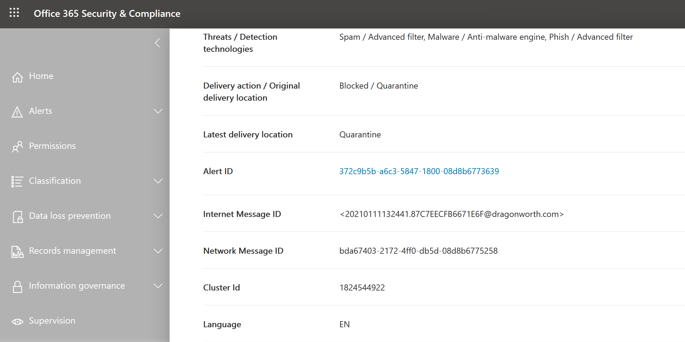

# Bedrohungs-Explorer und EchtzeiterkennungenThreat Explorer and Real-time detections

**Gilt für****Applies to**
- [Microsoft Defender für Office 365 Plan 1 und Plan 2Microsoft Defender for Office 365 plan 1 and plan 2](defender-for-office-365.md)
- [Microsoft 365 DefenderMicrosoft 365 Defender](../defender/microsoft-365-defender.md)

Wenn Ihre Organisation [Über Microsoft Defender für Office 365](defender-for-office-365.md)verfügt und Sie über die erforderlichen Berechtigungen [verfügen,](#required-licenses-and-permissions)verfügen Sie entweder über **Explorer-** oder Echtzeiterkennungen **(ehemals** Echtzeitberichte *–* siehe neues [!).](#new-features-in-threat-explorer-and-real-time-detections)If your organization has [Microsoft Defender for Office 365](defender-for-office-365.md), and you have the [necessary permissions](#required-licenses-and-permissions), you have either **Explorer** or **Real-time detections** (formerly *Real-time reports* — [see what's new](#new-features-in-threat-explorer-and-real-time-detections)!). Wechseln Sie im Security & Compliance Center zu Bedrohungsverwaltung, und wählen Sie dann **Explorer**  oder  **Echtzeiterkennungen aus.**In the Security & Compliance Center, go to **Threat management**, and then choose **Explorer** _or_ **Real-time detections**.

|Mit Microsoft Defender für Office 365 Plan 2 sehen Sie:With Microsoft Defender for Office 365 Plan 2, you see:|Mit Microsoft Defender für Office 365 Plan 1 sehen Sie:With Microsoft Defender for Office 365 Plan 1, you see:|
|---|---|
|||
|

Explorer- oder Echtzeiterkennungen helfen Ihrem Sicherheitsteam dabei, Bedrohungen effizient zu untersuchen und darauf zu reagieren.Explorer or Real-time detections helps your security operations team investigate and respond to threats efficiently. Der Bericht ähnelt der folgenden Abbildung:The report resembles the following image:

Mit diesem Bericht können Sie:With this report, you can:

- [Siehe Schadsoftware, die von Microsoft 365-Sicherheitsfeatures erkannt wirdSee malware detected by Microsoft 365 security features](#see-malware-detected-in-email-by-technology)
- [Anzeigen der Phishing-URL und Klicken auf VerdingungsdatenView phishing URL and click verdict data](#view-phishing-url-and-click-verdict-data)
- [Starten eines automatisierten Untersuchungs-](#start-automated-investigation-and-response) und Reaktionsprozesses aus einer Ansicht im Explorer (nur Defender für Office 365 Plan 2)[Start an automated investigation and response process from a view in Explorer](#start-automated-investigation-and-response) (Defender for Office 365 Plan 2 only)
- [Untersuchen bösartiger E-Mails und mehrInvestigate malicious email, and more](#more-ways-to-use-explorer-and-real-time-detections)

## Verbesserungen bei der BedrohungssucheImprovements to Threat Hunting Experience

### Einführung der Warnungs-ID für MDO-Warnungen in Explorer/Echtzeiterkennungen (Vorschau)Introduction of Alert ID for MDO alerts within Explorer/Real-time detections (Preview)
Wenn Sie heute von einer Warnung zum Bedrohungs-Explorer navigieren, wird im Explorer eine gefilterte Ansicht geöffnet, deren Ansicht nach der Warnungsrichtlinien-ID gefiltert ist (Richtlinien-ID ist ein eindeutiger Bezeichner für eine Warnungsrichtlinie).Today, if you navigate from an alert to Threat Explorer, it opens a filtered view within the Explorer, with the view filtered by Alert policy ID (policy ID being a unique identifier for an Alert policy).
Wir machen diese Integration relevanter, indem wir die Warnungs-ID (siehe ein Beispiel für die Warnungs-ID unten) im Bedrohungs-Explorer und in Echtzeiterkennungen einführen, sodass Nachrichten angezeigt werden, die für die jeweilige Warnung relevant sind, sowie eine Anzahl von E-Mails.We are making this integration more relevant by introducing the alert ID (see an example of alert ID below) in Threat Explorer and Real-time detections so that you see messages which are relevant to the specific alert, as well as a count of emails. Sie können auch sehen, ob eine Nachricht Teil einer Warnung war, und von dieser Nachricht zu der spezifischen Warnung navigieren.You will also be able to see if a message was part of an alert, as well as navigate from that message to the specific alert.  

Die Warnungs-ID ist innerhalb der URL verfügbar, wenn Sie eine einzelne Warnung anzeigen. Ein Beispiel ist `https://protection.office.com/viewalerts?id=372c9b5b-a6c3-5847-fa00-08d8abb04ef1` .Alert ID is available within the URL when you are viewing an individual alert; an example being `https://protection.office.com/viewalerts?id=372c9b5b-a6c3-5847-fa00-08d8abb04ef1`.

> [!div class="mx-imgBorder"]
> 

> [!div class="mx-imgBorder"]
> 

 
### Erweitern des Speicher- und Suchgrenzwerts für Explorer (und Echtzeiterkennungen) für Test-Mandanten von 7 auf 30 Tage (Vorschau)Extending the Explorer (and Real-time detections) data retention and search limit for trial tenants from 7 to 30 days (Preview)  
Im Rahmen dieser Änderung können Sie E-Mail-Daten innerhalb von 30 Tagen (gegenüber den vorherigen 7 Tagen) in Threat Explorer/Echtzeiterkennungen für Defender für Office P1 und P2-Test-Mandanten suchen und filtern.As part of this change, you will be able to search for, and filter email data across 30 days (an increase from the previous 7 days) in Threat Explorer/Real-time detections for both Defender for Office P1 and P2 trial tenants. Dies wirkt sich nicht auf Produktions mandanten für P1- und P2/E5-Kunden aus, die bereits über die 30-tägigen Funktionen zur Datenspeicherung und -suche verfügen.This does not impact any production tenants for both P1 and P2/E5 customers, which already has the 30 day data retention and search capabilities. 

### Aktualisierte Grenzwerte für den Export von Datensätzen für Den Bedrohungs-Explorer (Vorschau)Updated limits for Export of records for Threat Explorer (Preview) 
Im Rahmen dieses Updates wird die Anzahl der Zeilen für E-Mail-Datensätze, die aus dem Bedrohungs-Explorer exportiert werden können, von 9990 auf 200.000 Datensätze erhöht.As part of this update, the number of rows for Email records that can be exported from Threat Explorer is increased from 9990 to 200,000 records. Der Satz von Spalten, die derzeit exportiert werden können, bleibt unverändert, die Anzahl der Zeilen wird jedoch vom aktuellen Grenzwert an zunehmen.The set of columns that can be exported currently will remain the same, but the number of rows will increase from the current limit.

### Tags im Bedrohungs-ExplorerTags in Threat Explorer

> [!NOTE]
> Das Feature für Benutzertags befindet sich in *der Vorschau,* ist nicht für alle verfügbar und kann geändert werden.The user tags feature is in *Preview*, isn't available to everyone, and is subject to change. Informationen zum Veröffentlichungszeitplan finden Sie in der Microsoft 365-Roadmap.For information about the release schedule, check out the Microsoft 365 roadmap.

Benutzertags identifizieren bestimmte Benutzergruppen in Microsoft Defender für Office 365.User tags identify specific groups of users in Microsoft Defender for Office 365. Weitere Informationen zu Tags, einschließlich Lizenzierung und Konfiguration, finden Sie unter [User tags](user-tags.md).For more information about tags, including licensing and configuration, see [User tags](user-tags.md).

Im Bedrohungs-Explorer finden Sie Informationen zu Benutzertags in den folgenden Benutzeroberflächen.In Threat Explorer, you can see information about user tags in the following experiences.

#### E-Mail-RasteransichtEmail grid view

Die **Spalte Tags** im E-Mail-Raster enthält alle Tags, die auf die Absender- oder Empfängerpostfächer angewendet wurden.The **Tags** column in the email grid contains all the tags that have been applied to the sender or recipient mailboxes. Standardmäßig werden Systemtags wie Prioritätskonten zuerst angezeigt.By default, system tags like priority accounts are shown first.

> [!div class="mx-imgBorder"]
> 

#### FilternFiltering

Sie können Tags als Filter verwenden.You can use tags as a filter. Suche nur über Prioritätskonten oder bestimmte Benutzertagsszenarien hinweg.Hunt just across priority accounts or specific user tags scenarios. Sie können auch Ergebnisse mit bestimmten Tags ausschließen.You can also exclude results that have certain tags. Kombinieren Sie diese Funktionalität mit anderen Filtern, um den Untersuchungsbereich zu einent-Combine this functionality with other filters to narrow your scope of investigation.

> [!div class="mx-imgBorder"]
> 

#### Flyout für E-Mail-DetailsEmail detail flyout
Um die einzelnen Tags für Absender und Empfänger anzuzeigen, wählen Sie den Betreff aus, um das Flyout für Nachrichtendetails zu öffnen.To view the individual tags for sender and recipient, select the subject to open the message details flyout. Auf der **Registerkarte Zusammenfassung** werden die Absender- und Empfängertags separat angezeigt, wenn sie für eine E-Mail vorhanden sind.On the **Summary** tab, the sender and recipient tags are shown separately, if they're present for an email.
Die Informationen zu einzelnen Tags für Absender und Empfänger erstrecken sich auch auf exportierte CSV-Daten, in denen diese Details in zwei separaten Spalten angezeigt werden.The information about individual tags for sender and recipient also extends to exported CSV data, where you can see these details in two separate columns.

> [!div class="mx-imgBorder"]
> 

Tags-Informationen werden auch im Flyout "URL-Klicks" angezeigt.Tags information is also shown in the URL clicks flyout. Wechseln Sie zum Anzeigen zu Phish oder Alle E-Mail-Ansicht und dann zur Registerkarte **URLs** oder **URL-Klicks.** Wählen Sie ein einzelnes URL-Flyout aus, um zusätzliche Details zu Klicks für diese URL anzuzeigen, einschließlich tags, die diesem Klick zugeordnet sind.To view it, go to Phish or All Email view and then to the **URLs** or **URL Clicks** tab. Select an individual URL flyout to view additional details about clicks for that URL, including tags associated with that click.

### Aktualisierte ZeitachsenansichtUpdated Timeline View

> [!div class="mx-imgBorder"]
> 

## Verbesserungen bei der Bedrohungssuche (anstehender)Improvements to the threat hunting experience (upcoming)

### Aktualisierte Bedrohungsinformationen für E-MailsUpdated threat information for emails

Wir haben uns auf Verbesserungen der Plattform- und Datenqualität konzentriert, um die Datengenauigkeit und Konsistenz für E-Mail-Datensätze zu erhöhen.We've focused on platform and data-quality improvements to increase data accuracy and consistency for email records. Zu den Verbesserungen gehört die Konsolidierung von Pre-Delivery- und Post-Delivery-Informationen, z. B. Aktionen, die für eine E-Mail als Teil des ZAP-Prozesses ausgeführt werden, in einem einzigen Datensatz.Improvements include consolidation of pre-delivery and post-delivery information, such as actions executed on an email as part of the ZAP process, into a single record. Zusätzliche Details wie Spam-Urteil, Bedrohungen auf Entitätsebene (z. B. welche URL schädlich war) und aktuelle Zustellungsorte sind ebenfalls enthalten.Additional details like spam verdict, entity-level threats (for example, which URL was malicious), and latest delivery locations are also included.

Nach diesen Updates wird ein einzelner Eintrag für jede Nachricht angezeigt, unabhängig von den verschiedenen Ereignissen nach der Zustellung, die sich auf die Nachricht auswirken.After these updates, you'll see a single entry for each message, regardless of the different post-delivery events that affect the message. Aktionen können ZAP, manuelle Korrektur (d. h. Administratoraktion), dynamische Zustellung und so weiter umfassen.Actions can include ZAP, manual remediation (which means admin action), dynamic delivery, and so on.

Zusätzlich zum Anzeigen von Schadsoftware und Phishingbedrohungen wird das Spam-Urteil angezeigt, das einer E-Mail zugeordnet ist.In addition to showing malware and phishing threats, you see the spam verdict associated with an email. Sehen Sie sich in der E-Mail alle mit der E-Mail verbundenen Bedrohungen zusammen mit den entsprechenden Erkennungstechnologien an.Within the email, see all the threats associated with the email along with the corresponding detection technologies. Eine E-Mail kann null, eine oder mehrere Bedrohungen haben.An email can have zero, one, or multiple threats. Die aktuellen Bedrohungen werden im Abschnitt **Details** des E-Mail-Flyouts angezeigt.You'll see the current threats in the **Details** section of the email flyout. Bei mehreren Bedrohungen (z.  B. Schadsoftware und Phishing) zeigt das Tech-Feld Erkennung die Zuordnung zur Bedrohungserkennung, d. h. die Erkennungstechnologie, die die Bedrohung identifiziert hat.For multiple threats (such as malware and phishing), the **Detection tech** field shows the threat-detection mapping, which is the detection technology that identified the threat.

Der Satz von Erkennungstechnologien umfasst jetzt neue Erkennungsmethoden sowie Spamerkennungstechnologien.The set of detection technologies now includes new detection methods, as well as spam-detection technologies. Sie können den gleichen Satz von Erkennungstechnologien verwenden, um die Ergebnisse in den verschiedenen E-Mail-Ansichten zu filtern (Schadsoftware, Phish, Alle E-Mails).You can use the same set of detection technologies to filter the results across the different email views (Malware, Phish, All Email).

> [!NOTE]
> Die Diktieranalyse ist möglicherweise nicht unbedingt an Entitäten gebunden.Verdict analysis might not necessarily be tied to entities. Beispielsweise kann eine E-Mail als Phishing oder Spam klassifiziert werden, es gibt jedoch keine URLs, die mit einem Phishing-/Spam-Urteil gestempelt sind.As an example, an email might be classified as phish or spam, but there are no URLs that are stamped with a phish/spam verdict. Der Grund dafür ist, dass die Filter auch Inhalte und andere Details für eine E-Mail auswerten, bevor sie ein Urteil zuweisen.This is because the filters also evaluate content and other details for an email before assigning a verdict.

#### Bedrohungen in URLsThreats in URLs

Die spezifische Bedrohung für eine URL wird nun  auf der Registerkarte E-Mail-Flyoutdetails angezeigt. Die Bedrohung kann *Schadsoftware,* *Phishing,* *Spam* oder *keine sein.)*You can now see the specific threat for a URL on the email flyout **Details** tab. The threat can be *malware*, *phish*, *spam*, or *none*.)

> [!div class="mx-imgBorder"]
> 

### Aktualisierte Zeitachsenansicht (anstehender)Updated timeline view (upcoming)

> [!div class="mx-imgBorder"]
> 

Die Zeitachsenansicht identifiziert alle Zustellungs- und Postzustellungsereignisse.Timeline view identifies all delivery and post-delivery events. Sie enthält Informationen zur Bedrohung, die zu diesem Zeitpunkt für eine Teilmenge dieser Ereignisse identifiziert wurde.It includes information about the threat identified at that point of time for a subset of these events. Die Zeitachsenansicht enthält außerdem Informationen über alle zusätzlichen Aktionen (z. B. ZAP oder manuelle Korrektur) sowie das Ergebnis dieser Aktion.Timeline view also provides information about any additional action taken (such as ZAP or manual remediation), along with the result of that action. Informationen zur Zeitachsenansicht umfassen:Timeline view information includes:

- **Quelle:** Quelle des Ereignisses.**Source:** Source of the event. Es kann administrator/system/user sein.It can be admin/system/user.
- **Ereignis:** Umfasst Ereignisse auf oberster Ebene wie originale Zustellung, manuelle Korrektur, ZAP, Übermittlungen und dynamische Zustellung.**Event:** Includes top-level events like original delivery, manual remediation, ZAP, submissions, and dynamic delivery.
- **Aktion:** Die spezifische Aktion, die im Rahmen der ZAP- oder Administratoraktion (z. B. soft delete) ergriffen wurde.**Action:** The specific action that was taken either as part of ZAP or admin action (for example, soft delete).
- **Bedrohungen:** Deckt die zu diesem Zeitpunkt identifizierten Bedrohungen (Schadsoftware, Phishing, Spam) ab.**Threats:** Covers the threats (malware, phish, spam) identified at that point of time.
- **Ergebnis/Details:** Weitere Informationen zum Ergebnis der Aktion, z. B. ob sie im Rahmen der ZAP/Admin-Aktion ausgeführt wurde.**Result/Details:** More information about the result of the action, such as whether it was performed as part of ZAP/admin action.

### Ursprünglicher und aktueller ZustellungsspeicherortOriginal and latest delivery location

Derzeit wird der Zustellungsspeicherort im E-Mail-Raster und im E-Mail-Flyout angezeigt.Currently, we surface delivery location in the email grid and email flyout. Das **Feld Zustellungsspeicherort** wird in **_Originalzustellungsspeicherort _umbenannt._*Und wir stellen ein weiteres Feld vor: _*_Aktueller Zustellungsspeicherort_**.The **Delivery location** field is getting renamed **_Original delivery location_*_. And we're introducing another field, _*_Latest delivery location_**.

**Der ursprüngliche Zustellungsspeicherort** enthält weitere Informationen darüber, wo eine E-Mail ursprünglich zugestellt wurde.**Original delivery location** will give more information about where an email was delivered initially. **Der neueste Zustellungsspeicherort** gibt an, wo eine E-Mail nach Systemaktionen wie *ZAP* oder Administratoraktionen wie *Verschieben zu gelöschten Elementen gelandet ist.***Latest delivery location** will state where an email landed after system actions like *ZAP* or admin actions like *Move to deleted items*. Der neueste Zustellungsspeicherort soll Administratoren den letzten bekannten Speicherort der Nachricht nach der Zustellung oder alle System-/Administratoraktionen mitteilen.Latest delivery location is intended to tell admins the message's last-known location post-delivery or any system/admin actions. Es enthält keine Endbenutzeraktionen für die E-Mail.It doesn't include any end-user actions on the email. Wenn ein Benutzer beispielsweise eine Nachricht gelöscht oder die Nachricht in archiv/pst verschoben hat, wird der Nachrichtenspeicherort "Zustellung" nicht aktualisiert.For example, if a user deleted a message or moved the message to archive/pst, the message "delivery" location won't be updated. Wenn jedoch durch eine Systemaktion der Speicherort aktualisiert wurde (z. B. ZAP, was zu einer E-Mail **führt,** die in quarantäne verschoben wird), würde der letzte Zustellungsspeicherort als "Quarantäne" anzeigen.But if a system action updated the location (for example, ZAP resulting in an email moving to quarantine), **Latest delivery location** would show as "quarantine."

> [!div class="mx-imgBorder"]
> 

> [!NOTE]
> Es gibt einige  Fälle, in denen Zustellungsspeicherort und **Zustellungsaktion** als "unbekannt" anzeigen können:There are a few cases where **Delivery location** and **Delivery action** may show as "unknown":
>
> - Möglicherweise wird  der Zustellungsspeicherort  als "zugestellt" und der Zustellungsspeicherort als "unbekannt" angezeigt, wenn die Nachricht zugestellt wurde, aber eine Posteingangsregel hat die Nachricht in einen Standardordner (z. B. Entwurf oder Archiv) anstatt in den Ordner Posteingang oder Junk-E-Mail verschoben.You might see **Delivery location** as "delivered" and **Delivery location** as "unknown" if the message was delivered, but an Inbox rule moved the message to a default folder (such as Draft or Archive) instead of to the Inbox or Junk Email folder.
>
> - **Der neueste Zustellungsspeicherort** kann unbekannt sein, wenn eine Administrator-/Systemaktion (z. B. ZAP) versucht wurde, die Nachricht jedoch nicht gefunden wurde.**Latest delivery location** can be unknown if an admin/system action (such as ZAP) was attempted, but the message wasn't found. In der Regel erfolgt die Aktion, nachdem der Benutzer die Nachricht verschoben oder gelöscht hat.Typically, the action happens after the user  moved or deleted the message. Überprüfen Sie in solchen Fällen die **Spalte Ergebnis/Details** in der Zeitachsenansicht.In such cases, verify the **Result/Details** column in timeline view. Suchen Sie nach der Anweisung "Vom Benutzer verschobene oder gelöschte Nachricht".Look for the statement "Message moved or deleted by the user."

> [!div class="mx-imgBorder"]
> 

### Zusätzliche AktionenAdditional actions

*Zusätzliche Aktionen* wurden nach der Zustellung der E-Mail angewendet.*Additional actions* were applied after delivery of the email. Sie können *ZAP,* manuelle Korrektur *(von* einem Administrator ergriffene Aktion, z. B. soft *delete),* dynamische Zustellung und erneute Verarbeitung *(für* eine E-Mail, die rückwirkend als gut erkannt wurde) umfassen.They can include *ZAP*, *manual remediation* (action taken by an Admin such as soft delete), *dynamic delivery*, and *reprocessed* (for an email that was retroactively detected as good).

> [!NOTE]
> - Im Rahmen der ausstehenden Änderungen geht der Wert "Entfernt von ZAP", der derzeit im Filter Zustellungsaktion angezeigt wird, weg.As part of the pending changes, the "Removed by ZAP" value currently surfaced in the Delivery Action filter is going away. Sie haben eine Möglichkeit, mit dem ZAP-Versuch über zusätzliche Aktionen nach allen E-Mails **zu suchen.**You'll have a way to search for all email with the ZAP attempt through **Additional actions**.
>
> - Es gibt neue Felder und Werte **für** Erkennungstechnologien und **zusätzliche Aktionen** (insbesondere für ZAP-Szenarien).There will be new fields and values for **Detection technologies** and **Additional actions** (especially for ZAP scenarios). Sie müssen Ihre vorhandenen gespeicherten und nachverfolgten Abfragen auswerten, um sicherzustellen, dass sie mit den neuen Werten funktionieren.You'll need to evaluate your existing saved queries and tracked queries to make sure they work with the new values.

> [!div class="mx-imgBorder"]
> 

### SystemüberschreibungenSystem overrides

*Systemüberschreibungen* ermöglichen es Ihnen, Ausnahmen vom beabsichtigten Zustellungsspeicherort einer Nachricht zu machen.*System overrides* enable you to make exceptions to the intended delivery location of a message. Sie setzen den vom System bereitgestellten Zustellungsspeicherort basierend auf den Bedrohungen und anderen Erkennungen außer Kraft, die durch den Filterstapel identifiziert werden.You override the delivery location provided by the system, based on the threats and other detections identified by the filtering stack. Systemüberschreibungen können über Mandanten- oder Benutzerrichtlinien festgelegt werden, um die Nachricht wie von der Richtlinie vorgeschlagen zu senden.System overrides can be set through tenant or user policy to deliver the message as suggested by the policy. Außerkraftsetzungen können die unbeabsichtigte Zustellung schädlicher Nachrichten aufgrund von Konfigurationslücken identifizieren, z. B. eine zu umfassende Richtlinie für sichere Absender, die von einem Benutzer festgelegt wurde.Overrides can identify unintentional delivery of malicious messages due to configurations gaps, such as an overly broad Safe Sender policy set by a user. Diese Außerkraftsetzungswerte können wie die folgenden sein:These override values can be:

- Benutzerrichtlinie zulässig: Ein Benutzer erstellt Richtlinien auf Postfachebene, um Domänen oder Absender zu ermöglichen.Allowed by user policy: A user creates policies at the mailbox level to allows domains or senders.

- Durch Benutzerrichtlinie blockiert: Ein Benutzer erstellt Richtlinien auf Postfachebene, um Domänen oder Absender zu blockieren.Blocked by user policy: A user creates policies at the mail box level to block domains or senders.

- Durch Organisationsrichtlinie zulässig: Die Sicherheitsteams der Organisation legen Richtlinien oder Exchange-Nachrichtenflussregeln (auch als Transportregeln bezeichnet) fest, um Absendern und Domänen für Benutzer in ihrer Organisation zu ermöglichen.Allowed by org policy: The organization's security teams set policies or Exchange mail flow rules (also known as transport rules) to allow senders and domains for users in their organization. Dies kann für eine Gruppe von Benutzern oder die gesamte Organisation sein.This can be for a set of users or the entire organization.

- Durch Organisationsrichtlinie blockiert: Die Sicherheitsteams der Organisation legen Richtlinien oder Nachrichtenflussregeln zum Blockieren von Absendern, Domänen, Nachrichtensprachen oder Quell-IPs für Benutzer in ihrer Organisation bereit.Blocked by org policy: The organization's security teams set policies or mail flow rules to block senders, domains, message languages, or source IPs for users in their organization. Dies kann auf eine Gruppe von Benutzern oder die gesamte Organisation angewendet werden.This can be applied to a set of users or the entire organization.

- Durch Die Organisationsrichtlinie blockierte Dateierweiterung: Das Sicherheitsteam einer Organisation blockiert eine Dateinamenerweiterung über die Richtlinieneinstellungen für Ansoftware.File extension blocked by org policy: An organization's security team blocks a file name extension through the anti-malware policy settings. Diese Werte werden nun in E-Mail-Details angezeigt, um Bei Untersuchungen zu unterstützen.These values will now be displayed in email details to help with investigations. Secops-Teams können auch die Rich-Filtering-Funktion verwenden, um nach blockierten Dateierweiterungen zu filtern.Secops teams can also use the rich-filtering capability to filter on blocked file extensions.

> [!div class="mx-imgBorder"]
> 

### Verbesserungen für die URL- und KlickerfahrungImprovements for the URL and clicks experience

Zu den Verbesserungen gehören:The improvements include:

- Zeigen Sie die vollständig geklickte URL (einschließlich aller Abfrageparameter, die Teil der URL sind) im Abschnitt **Klicks** des URL-Flyouts an.Show the full clicked URL (including any query parameters that are part of the URL) in the **Clicks** section of the URL flyout. Derzeit werden die URL-Domäne und der Pfad in der Titelleiste angezeigt.Currently, the URL domain and path appear in the title bar. Wir erweitern diese Informationen, um die vollständige URL anzeigen zu können.We're extending that information to show the full URL.

- Korrekturen über URL-Filter hinweg (*URL* versus *URL-Domäne* im Vergleich zu *URL-Domäne* und -Pfad ): Die Updates wirken sich auf die Suche nach Nachrichten aus, die eine URL/Klick-Urteil enthalten.Fixes across URL filters (*URL* versus *URL domain* versus *URL domain and path*): The updates affect searching for messages that contain a URL/click verdict. Wir haben die Unterstützung für protokollagnostische Suchen aktiviert, sodass Sie ohne verwendung nach einer URL suchen `http` können.We enabled support for protocol-agnostic searches, so you can search for a URL without using `http`. Standardmäßig wird die URL-Suche http zugestellt, es sei denn, ein anderer Wert wird explizit angegeben.By default, the URL search maps to http, unless another value is explicitly specified. Beispiel:For example:

   -  Suchen Sie mit und ohne präfix `http://` in den **Feldern URL,** **URL Domain** und URL Domain and **Path.**Search with and without the `http://` prefix in the **URL**, **URL Domain**, and **URL Domain and Path** filter fields. Die Suchergebnisse sollten die gleichen Ergebnisse anzeigen.The searches should show the same results.

   -  Suchen Sie in `https://` URL nach dem **Präfix.**Search for the `https://` prefix in **URL**. Wenn kein Wert angegeben wird, wird `http://` das Präfix angenommen.When no value is specified, the `http://` prefix is assumed.

   - `/`wird am Anfang und Ende der Felder **URL-Pfad,** **URL-Domäne,** **URL-Domäne und Pfad ignoriert.**`/` is ignored at the beginning and end of the **URL path**, **URL Domain**, **URL domain and path** fields. `/` am Ende des **URL-Felds** wird ignoriert.`/` at the end of the **URL** field is ignored.

### Phish confidence levelPhish confidence level

Die Phish Confidence Level hilft, den Grad an Vertrauen zu identifizieren, mit dem eine E-Mail als "Phish" kategorisiert wurde.Phish confidence level helps identify the degree of confidence with which an email was categorized as "phish." Die beiden möglichen Werte sind *High* und *Normal.*The two possible values are *High* and *Normal*. In den ersten Phasen ist dieser Filter nur in der Phish-Ansicht des Bedrohungs-Explorers verfügbar.In the initial stages, this filter will be available only in the Phish view of Threat Explorer.

### ZAP-URL-SignalZAP URL signal

Das ZAP-URL-Signal wird in der Regel für ZAP Phish-Warnungsszenarien verwendet, in denen eine E-Mail als Phish identifiziert und nach der Zustellung entfernt wurde.The ZAP URL signal is typically used for ZAP Phish alert scenarios where an email was identified as Phish and removed after delivery. Dieses Signal verbindet die Warnung mit den entsprechenden Ergebnissen im Explorer.This signal connects the alert with the corresponding results in Explorer. Es ist eine der IOCs für die Warnung.It's one of the IOCs for the alert.

Um den Suchesprozess zu verbessern, haben wir Den Bedrohungs-Explorer und Echtzeiterkennungen aktualisiert, um die Suche konsistenter zu machen.To improve the hunting process, we've updated Threat Explorer and Real-time detections to make the hunting experience more consistent. Die Änderungen werden hier beschrieben:The changes are outlined here:

- [Verbesserungen an zeitzonenTimezone improvements](#timezone-improvements)
- [Aktualisieren im AktualisierungsprozessUpdate in the refresh process](#update-in-the-refresh-process)
- [Diagramm-Drilldown zum Hinzufügen zu FilternChart drilldown to add to filters](#chart-drilldown-to-add-to-filters)
- [In ProduktinformationsupdatesIn product information updates](#in-product-information-updates)

### Filtern nach BenutzertagsFilter by user tags

Sie können nun System- oder benutzerdefinierte Benutzertags sortieren und filtern, um den Umfang von Bedrohungen schnell zu erfassen.You can now sort and filter on system or custom user tags to quickly grasp the scope of threats. Weitere Informationen finden Sie unter [User tags](user-tags.md).To learn more, see [User tags](user-tags.md).

> [!IMPORTANT]
> Das Filtern und Sortieren nach Benutzertags befindet sich derzeit in der öffentlichen Vorschau.Filtering and sorting by user tags is currently in public preview. Diese Funktionalität kann erheblich geändert werden, bevor sie kommerziell veröffentlicht wird.This functionality may be substantially modified before it's commercially released. Microsoft gibt keine ausdrücklichen oder impliziten Garantien in Bezug auf die informationen, die darüber bereitgestellt werden.Microsoft makes no warranties, express or implied, with respect to the information provided about it.

> [!div class="mx-imgBorder"]
> 

### Verbesserungen an zeitzonenTimezone improvements

Sie sehen die Zeitzone für die E-Mail-Einträge im Portal sowie für exportierte Daten.You'll see the time zone for the email records in the Portal as well as for Exported data. Er wird in verschiedenen Erfahrungen wie E-Mail-Raster, Details-Flyout, E-Mail-Zeitachse und ähnliche E-Mails angezeigt, sodass die Zeitzone für den Ergebnissatz klar ist.It will be visible across experiences like Email Grid, Details flyout, Email Timeline, and Similar Emails, so the time zone for the result set is clear.

> [!div class="mx-imgBorder"]
> 

### Aktualisieren im AktualisierungsprozessUpdate in the refresh process

Einige Benutzer haben verwirrung mit der automatischen Aktualisierung (z. B. sobald Sie das Datum ändern, die Seite aktualisiert) und der manuellen Aktualisierung (für andere Filter) kommentiert.Some users have commented about confusion with automatic refresh (for example, as soon as you change the date, the page refreshes) and manual refresh (for other filters). Auf ähnliche Weise führt das Entfernen von Filtern zu einer automatischen Aktualisierung.Similarly, removing filters leads to automatic refresh. Das Ändern von Filtern beim Ändern der Abfrage kann zu inkonsistenten Sucherfahrungen führen.Changing filters while modifying the query can cause inconsistent search experiences. Um diese Probleme zu beheben, wird ein manueller Filtermechanismus verwendet.To resolve these issues, we're moving to a manual-filtering mechanism.

Aus Sicht der Benutzererfahrung kann der Benutzer den unterschiedlichen Filterbereich (aus dem Filtersatz und Datum) anwenden und entfernen und die Schaltfläche Aktualisieren auswählen, um die Ergebnisse zu filtern, nachdem er die Abfrage definiert hat.From an experience standpoint, the user can apply and remove the different range of filters (from the filter set and date) and select the refresh button to filter the results after they've defined the query. Die Schaltfläche "Aktualisieren" wird nun auch auf dem Bildschirm hervorgehoben.The refresh button is also now emphasized on the screen. Außerdem haben wir die zugehörigen QuickInfos und produktbezogene Dokumentation aktualisiert.We've also updated the related tooltips and in-product documentation.

> [!div class="mx-imgBorder"]
> 

### Diagramm-Drilldown zum Hinzufügen zu FilternChart drilldown to add to filters

Sie können jetzt Legendenwerte diagrammieren, um sie als Filter hinzuzufügen.You can now chart legend values to add them as filters. Wählen Sie die **Schaltfläche Aktualisieren** aus, um die Ergebnisse zu filtern.Select the **Refresh** button to filter the results.

> [!div class="mx-imgBorder"]
> 

### Produktin-Produkt-InformationsupdatesIn-product information updates

Zusätzliche Details sind jetzt im Produkt verfügbar, z. B. die Gesamtanzahl der Suchergebnisse innerhalb des Rasters (siehe unten).Additional details are now available within the product, such as the total number of search results within the grid (see below). Wir haben Bezeichnungen, Fehlermeldungen und QuickInfos verbessert, um weitere Informationen zu Filtern, Sucherfahrung und Ergebnissatz zu erhalten.We've improved labels, error messages, and tooltips to provide more information about the filters, search experience, and result set.

> [!div class="mx-imgBorder"]
> 

## Erweiterte Funktionen im Bedrohungs-ExplorerExtended capabilities in Threat Explorer

### Benutzer mit den meisten ZielbenutzernTop targeted users

Heute stellen wir die Liste der am meisten gezielten Benutzer in der Ansicht Schadsoftware für E-Mails im **Abschnitt Top Malware Families** zur Verfügung.Today we expose the list of the top targeted users in the Malware view for emails, in the **Top Malware Families** section. Diese Ansicht wird auch in den Ansichten Phish und All Email erweitert.We'll be extending this view in the Phish and All Email views as well. Sie können die fünf zielorientierten Benutzer sowie die Anzahl der Versuche für jeden Benutzer für die entsprechende Ansicht anzeigen.You'll be able to see the top-five targeted users, along with the number of attempts for each user for the corresponding view. Für die Phish-Ansicht wird z. B. die Anzahl der Phish-Versuche angezeigt.For example, for Phish view, you'll see the number of Phish attempts.

Sie können die Liste der zielorientierten Benutzer bis zu einem Grenzwert von 3.000 zusammen mit der Anzahl der Versuche für die Offlineanalyse für jede E-Mail-Ansicht exportieren.You'll be able to export the list of targeted users, up to a limit of 3,000, along with the number of attempts for offline analysis for each email view. Darüber hinaus wird beim Auswählen der Anzahl der Versuche (z. B. 13 Versuche in der abbildung unten) eine gefilterte Ansicht im Bedrohungs-Explorer geöffnet, damit Sie weitere Details in E-Mails und Bedrohungen für diesen Benutzer sehen können.In addition, selecting the number of attempts (for example, 13 attempts in the image below) will open a filtered view in Threat Explorer, so you can see more details across emails and threats for that user.

> [!div class="mx-imgBorder"]
> 

### Exchange-TransportregelnExchange transport rules

Im Rahmen der Datenerweiterung können Sie alle verschiedenen Exchange-Transportregeln (EXCHANGE Transport Rules, ETR) anzeigen, die auf eine Nachricht angewendet wurden.As part of data enrichment, you'll be able to see all the different Exchange transport rules (ETR) that were applied to a message. Diese Informationen sind in der Ansicht E-Mail-Raster verfügbar.This information will be available in the Email grid view. Wählen Sie zum Anzeigen im Raster **Spaltenoptionen** aus, und fügen Sie dann in den Spaltenoptionen **Exchange-Transportregel** hinzu.To view it,  select **Column options** in the grid and then **Add Exchange Transport Rule** from the column options. Sie wird auch im **Flyout Details** in der E-Mail angezeigt.It will also be visible on the **Details** flyout in the email.

Sie können sowohl die GUID als auch den Namen der Transportregeln anzeigen, die auf die Nachricht angewendet wurden.You'll be able to see both the GUID and the name of the transport rules that were applied to the message. Sie können mithilfe des Namens der Transportregel nach den Nachrichten suchen.You'll be able to search for the messages by using the name of the transport rule. Dies ist eine "Contains"-Suche, was bedeutet, dass Sie auch Teilsuchen machen können.This is a "Contains" search, which means you can do partial searches as well.

> [!IMPORTANT]
> Die Verfügbarkeit von ETR-Such- und -Namen hängt von der bestimmten Rolle ab, die Ihnen zugewiesen ist.ETR search and name availability depend on the specific role that's assigned to you. Sie benötigen eine der folgenden Rollen/Berechtigungen, um die ETR-Namen und die Suche anzeigen zu können.You need to have one of the following roles/permissions to view the ETR names and search. Wenn Ihnen keine dieser Rollen zugewiesen ist, können Sie die Namen der Transportregeln nicht anzeigen oder mithilfe von ETR-Namen nach Nachrichten suchen.If you don't have any of these roles assigned to you, you can't see the names of the transport rules or search for messages by using ETR names. In den E-Mail-Details können Sie jedoch die ETR-Bezeichnung und GUID-Informationen sehen.However, you could see the ETR label and GUID information in the Email Details. Andere Aufzeichnungsansichtserfahrungen in E-Mail-Rastern, E-Mail-Flyouts, Filtern und Export sind nicht betroffen.Other record-viewing experiences in Email Grids, Email flyouts, Filters, and Export are not affected.
> 
> - Nur EXO – Verhinderung von Datenverlust: AlleEXO Only - Data Loss Prevention: All
> - Nur EXO - O365SupportViewConfig: AlleEXO Only - O365SupportViewConfig: All
> - Microsoft Azure Active Directory oder EXO – Sicherheitsadministrator: AlleMicrosoft Azure Active Directory or EXO - Security Admin: All
> - AAD oder EXO - Security Reader: AlleAAD or EXO - Security Reader: All
> - Nur EXO - Transportregeln: AlleEXO Only - Transport Rules: All
> - Nur EXO – View-Only Konfiguration: AlleEXO Only - View-Only Configuration: All
> 
> Innerhalb des E-Mail-Rasters, des Details-Flyouts und des exportierten CSV erhalten die ETRs eine Name/GUID, wie unten gezeigt.Within the email grid, Details flyout, and Exported CSV, the ETRs are presented with a Name/GUID as shown below.
> 
> > [!div class="mx-imgBorder"]
> > 

### Eingehende ConnectorsInbound connectors

Connectors sind eine Sammlung von Anweisungen, die anpassen, wie Ihre E-Mails zu Und von Ihrer Microsoft 365- oder Office 365-Organisation fließen.Connectors are a collection of instructions that customize how your email flows to and from your Microsoft 365 or Office 365 organization. Sie ermöglichen ihnen das Anwenden von Sicherheitseinschränkungen oder -steuerelementen.They enable you to apply any security restrictions or controls. Im Bedrohungs-Explorer können Sie jetzt die Connectors anzeigen, die mit einer E-Mail in Zusammenhang stehen, und mithilfe von Connectornamen nach E-Mails suchen.Within Threat Explorer, you can now view the connectors that are related to an email and search for emails by using connector names.

Die Suche nach Connectors ist "enthält", was bedeutet, dass auch teilweise Stichwortsuchen funktionieren sollten.The search for connectors is "contains" in nature, which means partial keyword searches should work as well. In der Hauptrasteransicht, dem Flyout Details und der exportierten CSV werden die Connectors im Name/GUID-Format wie hier gezeigt angezeigt:Within the Main grid view, the Details flyout, and the Exported CSV, the connectors are shown in the Name/GUID format as shown here:

> [!div class="mx-imgBorder"]
> 

## Neue Features in Threat Explorer und EchtzeiterkennungenNew features in Threat Explorer and Real-time detections

- [Anzeigen von Phishing-E-Mails, die an imitierte Benutzer und Domänen gesendet werdenView phishing emails sent to impersonated users and domains](#view-phishing-emails-sent-to-impersonated-users-and-domains)
-  [Vorschau des E-Mail-Headers und des E-Mail-Textkörpers herunterladenPreview email header and download email body](#preview-email-header-and-download-email-body)
- [E-Mail-ZeitachseEmail timeline](#email-timeline)
- [Exportieren von URL-KlickdatenExport URL click data](#export-url-click-data)

### Anzeigen von Phishing-E-Mails, die an imitierte Benutzer und Domänen gesendet werdenView phishing emails sent to impersonated users and domains

Um Phishingversuche gegen Benutzer und Domänen zu identifizieren, bei der es sich um benutzeridentitierte Benutzer handelt, müssen sie der Liste der Benutzer hinzugefügt werden, die *geschützt werden sollen.*To identify phishing attempts against users and domains that are impersonated users must be added to the list of *Users to protect*. Bei Domänen müssen Administratoren entweder Organisationsdomänen aktivieren *oder* Domänen einen Domänennamen hinzufügen, um *zu schützen*.For domains, admins must either enable *Organization domains*, or add a domain name to *Domains to protect*. Die zu schützende Domäne finden Sie auf der *Seite Antiphishingrichtlinien* im Abschnitt *Identitätswechsel.*The domains to protect are found on the *Anti-Phishing policy page* in the *Impersonation* section.

Verwenden Sie die E-Mail-> [Phish-Ansicht](threat-explorer-views.md) des Explorers, um Phishingnachrichten zu überprüfen und nach imitierten Benutzern oder Domänen zu suchen.To review phish messages and search for impersonated users or domains, use the [Email > Phish view](threat-explorer-views.md) of Explorer.

In diesem Beispiel wird Der Bedrohungs-Explorer verwendet.This example uses Threat Explorer.

1. Wählen Sie [im Security & Compliance Center](https://protection.office.com) ( die Option https://protection.office.com) Bedrohungsverwaltung > Explorer (oder Echtzeiterkennungen) aus.In the [Security & Compliance Center](https://protection.office.com) (https://protection.office.com), choose Threat management > Explorer (or Real-time detections).

2. Wählen Sie im Menü Ansicht die Option Email > Phish aus.In the View menu, choose Email > Phish.

   Hier können Sie die **Identitätswechseldomäne oder** den **identitätswechselten Benutzer auswählen.**Here you can choose **impersonated domain** or **impersonated user**.

3. **Wählen Sie** **entweder Imitierte Domäne** aus, und geben Sie dann eine geschützte Domäne in das Textfeld ein.**EITHER** select **Impersonated domain**, and then type a protected domain in the textbox.

   Suchen Sie beispielsweise nach geschützten Domänennamen wie *contoso*, *contoso.com* oder *contoso.com.au*.For example, search for protected domain names like *contoso*, *contoso.com*, or *contoso.com.au*.

4. Wählen Sie den Betreff einer Nachricht unter der Registerkarte E-Mail-> Details aus, um zusätzliche Identitätswechselinformationen wie Identitätswechseldomäne /Erkannter Speicherort anzuzeigen.Select the Subject of any message under the Email tab > Details tab to see additional impersonation information like Impersonated Domain / Detected location.

    **OR****OR** 

    Wählen **Sie Imitierter Benutzer aus,** und geben Sie die E-Mail-Adresse eines geschützten Benutzers in das Textfeld ein.Select **Impersonated user** and type a protected user's email address in the textbox.

    > [!TIP]
    > **Verwenden Sie vollständige** E-Mail-Adressen, um geschützte Benutzer *zu durchsuchen,* um optimale Ergebnisse zu erzielen.**For best results**, use *full email addresses* to search protected users. Sie finden Ihren geschützten Benutzer schneller und erfolgreicher, wenn Sie nach firstname.lastname@contoso.com *suchen,* z. B. bei der Untersuchung des Identitätswechsels von Benutzern.You will find your protected user quicker and more successfully if you search for *firstname.lastname@contoso.com*, for example, when investigating user impersonation. Bei der Suche nach einer geschützten Domäne wird die Stammdomäne (z. B. contoso.com) und der Domänenname ( contoso )*verwendet.*When searching for a protected domain the search will take the root domain (contoso.com, for example), and the domain name (*contoso*). Bei der Suche nach der *Stammdomäne contoso.com* sowohl  Identitätswechsel von contoso.com als auch den Domänennamen *contoso zurück.*Searching for the root domain *contoso.com* will return both impersonations of *contoso.com* and the domain name *contoso*.

5. Wählen Sie **auf** der Registerkarte E-Mail-Registerkarte Details die Option Betreff einer Nachricht aus, um zusätzliche Identitätswechselinformationen zum Benutzer oder der Domäne sowie den Speicherort  >   *"Erkannt" anzuzeigen.*Select the **Subject** of any message under **Email tab** > **Details tab** to see additional impersonation information about the user or domain, and the *Detected location*.

    :::image type="content" source="../../media/threat-ex-views-impersonated-user-image.png" alt-text="Der Detailbereich des Bedrohungs-Explorers für einen geschützten Benutzer, der den Erkennungsspeicherort und die erkannte Bedrohung (hier den Identitätswechsel eines Benutzers) zeigt.":::

> [!NOTE]
> Wenn Sie in Schritt 3 oder 5  Erkennungstechnologie auswählen  und Identitätswechseldomäne bzw. Identitätswechselbenutzer auswählen, werden die Informationen auf der Registerkarte    >   *E-Mail-Details* über den Benutzer oder die Domäne und der Speicherort "Erkannt" nur in den Nachrichten angezeigt, die mit dem Benutzer oder der Domäne im Zusammenhang stehen, die auf der Seite Antiphishingrichtlinien aufgeführt sind.In step 3 or 5, if you choose **Detection Technology** and select **Impersonation domain** or **Impersonation user** respectively, the information in the **Email tab** > **Details tab** about the user or domain, and the *Detected location* will be shown only on the messages that are related to the user or domain listed on the *Anti-Phishing policy* page. 

### Vorschau des E-Mail-Headers und des E-Mail-Textkörpers herunterladenPreview email header and download email body

Sie können jetzt eine Vorschau eines E-Mail-Headers anzeigen und den E-Mail-Textkörper im Bedrohungs-Explorer herunterladen.You can now preview an email header and download the email body in Threat Explorer. Administratoren können heruntergeladene Kopfzeilen/E-Mail-Nachrichten auf Bedrohungen analysieren.Admins can analyze downloaded headers/email messages for threats. Da das Herunterladen von E-Mail-Nachrichten das Risiko der Informationsexposition darstellen kann, wird dieser Prozess durch die rollenbasierte Zugriffssteuerung (RBAC) gesteuert.Because downloading email messages can risk exposure of information, this process is controlled by role-based access control (RBAC). Eine neue Rolle, *Vorschau*, muss einer anderen Rollengruppe hinzugefügt werden (z. B. Sicherheitsvorgänge oder Sicherheitsadministrator), um das Herunterladen von E-Mails in der Ansicht für E-Mail-Nachrichten zu gewähren.A new role, *Preview*, must be added to another role group (such as Security Operations or Security Administrator) to grant the ability to download mails in all-email messages view. Für das Anzeigen des E-Mail-Headers ist jedoch keine zusätzliche Rolle erforderlich (es sei denn, dies ist erforderlich, um Nachrichten im Bedrohungs-Explorer anzeigen zu können).However, viewing the email header does not require any additional role (other than what is required to view messages in Threat Explorer).

Explorer- und Echtzeiterkennungen erhalten auch neue Felder, die ein vollständigeres Bild davon bieten, wo Ihre E-Mail-Nachrichten landen.Explorer and Real-time detections will also get new fields that provide a more complete picture of where your email messages land. Diese Änderungen erleichtern die Suche für Sicherheits-Ops.These changes  make hunting easier for Security Ops. Das Hauptergebnis ist jedoch, dass Sie den Speicherort von problematischen E-Mail-Nachrichten auf einen Blick kennen.But the main result is you can know the location of problem email messages at a glance.

Wie wird dies durchgeführt?How is this done? Der Zustellungsstatus ist nun in zwei Spalten aufgeschlüsselt:Delivery status is now broken out into two columns:

- **Zustellungsaktion** – Status der E-Mail.**Delivery action** - Status of the email.
- **Zustellungsspeicherort** : Wo die E-Mail geroutet wurde.**Delivery location** - Where the email was routed.

*Übermittlungsaktion* ist die Aktion, die aufgrund vorhandener Richtlinien oder Erkennungen für eine E-Mail ergriffen wird.*Delivery action* is the action taken on an email due to existing policies or detections. Hier sind die möglichen Aktionen für eine E-Mail:Here are the possible actions for an email:

|ZugestelltDelivered|JunkedJunked|GesperrtBlocked|ErsetztReplaced|
|---|---|---|---|
|E-Mails wurden an den Posteingang oder Ordner eines Benutzers übermittelt, und der Benutzer kann darauf zugreifen.Email was delivered to the inbox or folder of a user, and the user can access it.|E-Mails wurden an den Junk- oder Den Gelöschten Ordner des Benutzers gesendet, und der Benutzer kann darauf zugreifen.Email was sent to the user's Junk  or Deleted folder, and the user can access it.|E-Mails, die isoliert, fehlgeschlagen oder gelöscht wurden.Emails that are quarantined, that failed, or were dropped. Auf diese E-Mails kann der Benutzer nicht zugegriffen werden.These mails are inaccessible to the user.|Bei E-Mails wurden schädliche Anlagen durch TXT-Dateien ersetzt, in deren Zustand die Anlage schädlich war.Email had malicious attachments replaced by .txt files that state the attachment was malicious.|

Dies ist das, was der Benutzer sehen kann und nicht:Here is what the user can and can't see:

|Für Endbenutzer zugänglichAccessible to end users|Zugriff für Endbenutzer nicht möglichInaccessible to end users|
|---|---|
|ZugestelltDelivered|GesperrtBlocked|
|JunkedJunked|ErsetztReplaced|

**Der Zustellungsspeicherort** zeigt die Ergebnisse von Richtlinien und Erkennungen an, die nach der Zustellung ausgeführt werden.**Delivery location** shows the results of policies and detections that run post-delivery. Es ist mit der **_Zustellungsaktion verknüpft._**It's linked to **_Delivery action_**. Dies sind die möglichen Werte:These are the possible values:

- *Posteingang oder Ordner:* Die E-Mail befindet sich im Posteingang oder in einem Ordner (gemäß Ihren E-Mail-Regeln).*Inbox or folder*: The email is in the inbox or a folder (according to your email rules).
- *Lokal oder extern:* Das Postfach ist nicht in der Cloud vorhanden, sondern lokal.*On-prem or external*: The mailbox doesn't exist on cloud but is on-premises.
- *Junkordner:* Die E-Mail befindet sich im Junkordner eines Benutzers.*Junk folder*: The email is in a user's Junk folder.
- *Ordner "Gelöschte* Elemente": Die E-Mail im Ordner "Gelöschte Elemente" eines Benutzers.*Deleted items folder*: The email in a user's Deleted items folder.
- *Quarantäne:* Die E-Mail befindet sich in Quarantäne und nicht im Postfach eines Benutzers.*Quarantine*: The email is in quarantine and not in a user's mailbox.
- *Fehler:* Die E-Mail konnte das Postfach nicht erreichen.*Failed*: The email failed to reach the mailbox.
- *Dropped*: Die E-Mails sind an einer Stelle im E-Mail-Fluss verloren gegangen.*Dropped*: The email got lost somewhere in the mail flow.

### E-Mail-ZeitachseEmail timeline

Die **E-Mail-Zeitachse** ist ein neues Explorer-Feature, das die Suche für Administratoren verbessert.The **Email timeline** is a new Explorer feature that improves the hunting experience for admins. Es reduziert die Zeit, die die Überprüfung verschiedener Speicherorte auf sich hat, um zu versuchen, das Ereignis zu verstehen.It cuts the time spent checking different locations to try to understand the event. Wenn mehrere Ereignisse gleichzeitig oder in der Nähe einer E-Mail eintreten, werden diese Ereignisse in einer Zeitachsenansicht angezeigt.When multiple events happen at or close to the same time an email arrives, those events are displayed in a timeline view. Einige Ereignisse, die nach der Zustellung ihrer E-Mail auftreten, werden in der Spalte **Spezielle Aktion** erfasst.Some events that happen to your email post-delivery are captured in the **Special action** column. Administratoren können Informationen aus der Zeitachse mit der speziellen Aktion für die E-Mail-Postzustellung kombinieren, um einen Einblick in die Funktionsweise ihrer Richtlinien zu erhalten, wo die E-Mail schließlich geroutet wurde, und in einigen Fällen, was die endgültige Bewertung war.Admins can combine  information from the timeline with the special action taken on the mail post-delivery to get insight into how their policies work, where the mail was finally routed, and, in some cases, what the final assessment was.

Weitere Informationen finden Sie unter [Investigate and remediate malicious email that was delivered in Office 365](investigate-malicious-email-that-was-delivered.md).For more information, see [Investigate and remediate malicious email that was delivered in Office 365](investigate-malicious-email-that-was-delivered.md).

### Exportieren von URL-KlickdatenExport URL click data

Sie können jetzt Berichte für URL-Klicks  nach Microsoft Excel exportieren, um ihre Netzwerknachrichten-ID ein- und auf **"Verdict"** zu klicken. Dadurch wird erläutert, woher der URL-Klickdatenverkehr stammt.You can now export reports for URL clicks to Microsoft Excel to view their **network message ID** and **click verdict**, which helps explain where your URL click traffic originated. So funktioniert's: Folgen Sie in Threat Management auf der Office 365-Schnellstartleiste dieser Kette:Here's how it works: In Threat Management on the Office 365 quick-launch bar, follow this chain:

**Explorer** \> **Phish anzeigen** \> **Klicks** \> **Top URLs or** **URL Top Clicks** \> select any record to open the URL flyout.**Explorer** \> **View Phish** \> **Clicks** \> **Top URLs** or **URL Top Clicks** \> select any record to open the URL flyout.

Wenn Sie eine URL in der Liste auswählen, wird eine neue Schaltfläche **Exportieren** im Fly-Out-Bereich angezeigt.When you select a URL in the list, you'll see a new **Export** button on the fly-out panel. Verwenden Sie diese Schaltfläche, um Daten zur einfacheren Berichterstellung in eine Excel-Kalkulationstabelle zu verschieben.Use this button to move data to an Excel spreadsheet for easier reporting.

Gehen Sie wie folgt vor, um an denselben Ort im Bericht über Echtzeiterkennungen zu kommen:Follow this path to get to the same location in the Real-time detections report:

**Explorer** \> **Echtzeiterkennungen** \> **Phish anzeigen** \> **URLs** \> **Top URLs or** **Top Clicks** Wählen Sie einen beliebigen Datensatz aus, um das \> URL-Flyout zu \> öffnen, navigieren Sie zur Registerkarte **Klicks.****Explorer** \> **Real-time detections** \> **View Phish** \> **URLs** \> **Top URLs** or **Top Clicks** \> Select any record to open the URL flyout \> navigate to the **Clicks** tab.

> [!TIP]
> Die Netzwerknachrichten-ID ordnet das Zurückklicken bestimmten E-Mails zu, wenn Sie die ID über Explorer oder zugeordnete Drittanbietertools durchsuchen.The Network Message ID maps the click back to specific mails when you search on the ID through Explorer or associated third-party tools. Bei solchen Suchen wird die E-Mail identifiziert, die einem Klickergebnis zugeordnet ist.Such searches identify the email associated with a click result. Die korrelierte Netzwerknachrichten-ID ermöglicht eine schnellere und leistungsstärkere Analyse.Having the correlated Network Message ID makes for quicker and more powerful analysis.

> [!div class="mx-imgBorder"]
> 

## Siehe Schadsoftware, die in E-Mails durch Technologie erkannt wurdeSee malware detected in email by technology

Angenommen, Sie möchten Schadsoftware in E-Mails nach Microsoft 365-Technologie sortiert sehen.Suppose you want to see malware detected in email sorted by Microsoft 365 technology. Verwenden Sie dazu die [E-Mail->-Ansicht](threat-explorer-views.md#email--malware) von Explorer (oder Erkennungen in Echtzeit).To do this, use the [Email > Malware](threat-explorer-views.md#email--malware) view of Explorer (or Real-time detections).

1. Wählen Sie im Security & Compliance Center ( <https://protection.office.com> ) die Option Bedrohungsverwaltungs-Explorer  \>  (oder **Echtzeiterkennungen) aus.**In the Security & Compliance Center (<https://protection.office.com>), choose **Threat management** \> **Explorer** (or **Real-time detections**). (In diesem Beispiel wird Explorer verwendet.)(This example uses Explorer.)

2. Wählen Sie **im** Menü Ansicht die Option **E-Mail-Schadsoftware** \> **aus.**In the **View** menu, choose **Email** \> **Malware**.

   > [!div class="mx-imgBorder"]
   > 

3. Klicken **Sie auf Absender,** und wählen Sie **dann Grundlegende** \> **Erkennungstechnologie aus.**Click **Sender**, and then choose **Basic** \> **Detection technology**.

   Ihre Erkennungstechnologien sind jetzt als Filter für den Bericht verfügbar.Your detection technologies are now available as filters for the report.

   > [!div class="mx-imgBorder"]
   > 

4. Wählen Sie eine Option aus.Choose an option. Wählen Sie dann die **Schaltfläche Aktualisieren** aus, um diesen Filter anzuwenden.Then select the **Refresh** button to apply that filter.

   > [!div class="mx-imgBorder"]
   > 

Der Bericht wird aktualisiert, um die Ergebnisse zu zeigen, die Schadsoftware in E-Mails mithilfe der von Ihnen ausgewählten Technologieoption erkannt hat.The report refreshes to show the results that malware detected in email, using the technology option you selected. Von hier aus können Sie weitere Analysen durchführen.From here, you can conduct further analysis.

## Anzeigen der Phishing-URL und Klicken auf VerdingungsdatenView phishing URL and click verdict data

Angenommen, Sie möchten Phishingversuche über URLs in E-Mails sehen, einschließlich einer Liste der URLs, die zugelassen, blockiert und außer Kraft gesetzt wurden.Suppose that you want to see phishing attempts through URLs in email, including a list of URLs that were allowed, blocked, and overridden. Zum Identifizieren von URLs, auf die geklickt wurde, müssen [sichere](safe-links.md) Links konfiguriert werden.To identify URLs that were clicked, [Safe Links](safe-links.md) must be configured. Stellen Sie sicher, dass Sie [Richtlinien](set-up-safe-links-policies.md) für sichere Links für den Schutz und die Protokollierung von Klickverdingen durch sichere Links einrichten.Make sure that you set up [Safe Links policies](set-up-safe-links-policies.md) for time-of-click protection and logging of click verdicts by Safe Links.

Verwenden Sie zum Überprüfen von Phish-URLs in Nachrichten und Klicken auf URLs in Phishingnachrichten die E-Mail-Phish-Ansicht von Explorer oder Echtzeiterkennungen. [   >   ](threat-explorer-views.md#email--phish)To review phish URLs in messages and clicks on URLs in phish messages, use the [**Email** > **Phish**](threat-explorer-views.md#email--phish) view of Explorer or Real-time detections.

1. Wählen Sie im Security & Compliance Center ( <https://protection.office.com> ) die Option Bedrohungsverwaltungs-Explorer  \>  (oder **Echtzeiterkennungen) aus.**In the Security & Compliance Center (<https://protection.office.com>), choose **Threat management** \> **Explorer** (or **Real-time detections**). (In diesem Beispiel wird Explorer verwendet.)(This example uses Explorer.)

2. Wählen Sie **im** Menü Ansicht die Option **E-Mail-Phish** \> **aus.**In the **View** menu, choose **Email** \> **Phish**.

   > [!div class="mx-imgBorder"]
   > 

3. Klicken **Sie auf Absender,** und wählen Sie **dann URLs Klicken** Sie auf \> **Urteil**.Click **Sender**, and then choose **URLs** \> **Click verdict**.

4. Wählen Sie eine oder  mehrere Optionen aus, z. B. Blockiert und außer Kraft **gesetzt,** und wählen Sie dann die Schaltfläche **Aktualisieren** in derselben Zeile wie die Optionen aus, um diesen Filter anzuwenden.Select one or more options, such as **Blocked** and **Block overridden**, and then select the **Refresh** button on the same line as the options to apply that filter. (Aktualisieren Sie das Browserfenster nicht.)(Don't refresh your browser window.)

   > [!div class="mx-imgBorder"]
   > 

   Der Bericht wird aktualisiert, um zwei unterschiedliche URL-Tabellen auf der Registerkarte URL unter dem Bericht zu zeigen:The report refreshes to show two different URL tables on the URL tab under the report:

   - **Die obersten URLs** sind die URLs in den Nachrichten, in die Sie gefiltert haben, und die Anzahl der E-Mail-Zustellungsaktion für jede URL.**Top URLs** are the URLs in the messages that you filtered down to and the email delivery action counts for each URL. In der Phish-E-Mail-Ansicht enthält diese Liste in der Regel legitime URLs.In the Phish email view, this list typically contains legitimate URLs. Angreifer enthalten eine Mischung aus guten und schlechten URLs in ihren Nachrichten, um zu versuchen, sie zu liefern, aber sie machen die schädlichen Links interessanter.Attackers include a mix of good and bad URLs in their messages to try to get them delivered, but they make the malicious links look more interesting. Die Tabelle der URLs wird nach der Gesamtzahl der E-Mails sortiert, diese Spalte ist jedoch ausgeblendet, um die Ansicht zu vereinfachen.The table of URLs is sorted by total email count, but this column is hidden to simplify the view.

   - **Top clicks** are the Safe Links-wrapped URLs that were clicked, sorted by total click count.**Top clicks** are the Safe Links-wrapped URLs that were clicked, sorted by total click count. Diese Spalte wird auch nicht angezeigt, um die Ansicht zu vereinfachen.This column also isn't displayed, to simplify the view. Die Gesamtzahlen nach Spalte geben die Anzahl der Klicks auf sichere Links für jede geklickte URL an.Total counts by column indicate the Safe Links click verdict count for each clicked URL. In der Phish-E-Mail-Ansicht handelt es sich in der Regel um verdächtige oder bösartige URLs.In the Phish email view, these are usually suspicious or malicious URLs. Die Ansicht kann jedoch URLs enthalten, die keine Bedrohungen sind, aber in Phishnachrichten enthalten sind.But the view could include URLs that aren't threats but are in phish messages. URL-Klicks auf unverpackte Links werden hier nicht angezeigt.URL clicks on unwrapped links don't show up here.

   Die beiden URL-Tabellen zeigen die besten URLs in Phishing-E-Mail-Nachrichten nach Zustellungsaktion und Speicherort.The two URL tables show top URLs in phishing email messages by delivery action and location. Die Tabellen zeigen URL-Klicks, die trotz einer Warnung blockiert oder besucht wurden, damit Sie sehen können, welche potenziellen ungültigen Links benutzern angezeigt wurden und auf die der Benutzer geklickt hat.The tables show URL clicks that were blocked or visited despite a warning, so you can see what potential bad links were presented to users and that the user's clicked. Von hier aus können Sie weitere Analysen durchführen.From here, you can conduct further analysis. Unterhalb des Diagramms werden beispielsweise die obersten URLs in E-Mail-Nachrichten angezeigt, die in der Umgebung Ihrer Organisation blockiert wurden.For example, below the chart you can see the top URLs in email messages that were blocked in your organization's environment.

   > [!div class="mx-imgBorder"]
   > 

   Wählen Sie eine URL aus, um ausführlichere Informationen anzeigen zu können.Select a URL to view more detailed information.

   > [!NOTE]
   > Im Dialogfeld URL-Flyout wird die Filterung für E-Mail-Nachrichten entfernt, um die vollständige Ansicht der Belichtung der URL in Ihrer Umgebung anzuzeigen.In the URL flyout dialog box, the filtering on email messages is removed to show the full view of the URL's exposure in your environment. Auf diese Weise können Sie nach E-Mail-Nachrichten filtern, über die Sie im Explorer besorgt sind, bestimmte URLs finden, die potenzielle Bedrohungen sind, und dann Ihr Verständnis der URL-Belichtung in Ihrer Umgebung (über das Dialogfeld URL-Details) erweitern, ohne der Exploreransicht selbst URL-Filter hinzufügen zu müssen.This lets you filter for email messages you're concerned about in Explorer, find specific URLs that are potential threats, and then expand your understanding of the URL exposure in your environment (via the URL details dialog box) without having to add URL filters to the Explorer view itself.

### Interpretation von KlickverkündungenInterpretation of click verdicts

Innerhalb der Flyouts "E-Mail" oder "URL", "Top Clicks" und in unseren Filterfunktionen werden unterschiedliche Klick-/Verdingungswerte angezeigt:Within the Email or URL flyouts, Top Clicks as well as within our filtering experiences, you'll see different click verdict values:

- **Keine:** Das Urteil für die URL kann nicht erfasst werden.**None:** Unable to capture the verdict for the URL. Der Benutzer hat möglicherweise durch die URL geklickt.The user might have clicked through the URL.
- **Zulässig:** Der Benutzer konnte zur URL navigieren.**Allowed:** The user was allowed to navigate to the URL.
- **Blockiert:** Der Benutzer konnte nicht zur URL navigieren.**Blocked:** The user was blocked from navigating to the URL.
- **Ausstehendes Urteil:** Dem Benutzer wurde die Seite zum Ausstehen der Detonation angezeigt.**Pending verdict:** The user was presented with the detonation-pending page.
- **Überschreibend blockiert:** Der Benutzer konnte nicht direkt zur URL navigieren.**Blocked overridden:** The user was blocked from navigating directly to the URL. Der Benutzer übernimmt jedoch den Block, um zur URL zu navigieren.But the user overrode the block to navigate to the URL.
- **Ausstehendes Urteil umgangen:** Dem Benutzer wurde die Detonationsseite angezeigt.**Pending verdict bypassed:** The user was presented with the detonation page. Der Benutzer übernimmt jedoch die Nachricht, um auf die URL zu zugreifen.But the user overrode the message to access the URL.
- **Fehler:** Dem Benutzer wurde die Fehlerseite angezeigt, oder beim Erfassen des Urteils ist ein Fehler aufgetreten.**Error:** The user was presented with the error page, or an error occurred in capturing the verdict.
- **Fehler:** Beim Erfassen des Urteils ist eine unbekannte Ausnahme aufgetreten.**Failure:** An unknown exception occurred while capturing the verdict. Der Benutzer hat möglicherweise durch die URL geklickt.The user might have clicked through the URL.

## Überprüfen von E-Mail-Nachrichten, die von Benutzern gemeldet wurdenReview email messages reported by users

Angenommen, Sie möchten [E-Mail-Nachrichten](enable-the-report-message-add-in.md) anzeigen, die Benutzer in Ihrer Organisation über das Add-In "Nachricht melden" oder das [Phishing-Add-In](enable-the-report-phish-add-in.md)melden als *Junk,* nicht Junk oder *Phishing* gemeldet haben.Suppose that you want to see email messages that users in your organization reported as *Junk*, *Not Junk*, or *Phishing* through the [Report Message add-in](enable-the-report-message-add-in.md) or the [Report Phishing add-in](enable-the-report-phish-add-in.md). Um sie zu sehen, verwenden Sie die [ **Ansicht**  >  **E-Mail-Übermittlungen**](threat-explorer-views.md#email--submissions) von Explorer (oder Echtzeiterkennungen).To see them, use the [**Email** > **Submissions**](threat-explorer-views.md#email--submissions) view of Explorer (or Real-time detections).

1. Wählen Sie im Security & Compliance Center ( <https://protection.office.com> ) die Option Bedrohungsverwaltungs-Explorer  \>  (oder **Echtzeiterkennungen) aus.**In the Security & Compliance Center (<https://protection.office.com>), choose **Threat management** \> **Explorer** (or **Real-time detections**). (In diesem Beispiel wird Explorer verwendet.)(This example uses Explorer.)

2. Wählen Sie **im** Menü Ansicht die Option **E-Mail-Übermittlungen** \> **aus.**In the **View** menu, choose **Email** \> **Submissions**.

   > [!div class="mx-imgBorder"]
   > 

3. Klicken **Sie auf Absender,** und wählen Sie **dann Standardberichtstyp** \> **aus.**Click **Sender**, and then choose **Basic** \> **Report type**.

4. Wählen Sie eine Option aus, z. **B. Phish**, und wählen Sie dann die Schaltfläche **Aktualisieren** aus.Select an option, such as **Phish**, and then select the **Refresh** button.

   > [!div class="mx-imgBorder"]
   > 

Der Bericht wird aktualisiert, um Daten zu E-Mail-Nachrichten zu zeigen, die Personen in Ihrer Organisation als Phishingversuch gemeldet haben.The report refreshes to show data about email messages that people in your organization reported as a phishing attempt. Sie können diese Informationen verwenden, um weitere Analysen durchzuführen und bei Bedarf Ihre [Antiphishingrichtlinien in Microsoft Defender für Office 365 anzupassen.](configure-atp-anti-phishing-policies.md)You can use this information to conduct further analysis, and, if necessary, adjust your [anti-phishing policies in Microsoft Defender for Office 365](configure-atp-anti-phishing-policies.md).

## Starten einer automatisierten Untersuchung und ReaktionStart automated investigation and response

> [!NOTE]
> Automatisierte Untersuchungs- und Reaktionsfunktionen sind in *Microsoft Defender für Office 365 Plan 2* und Office *365 E5 verfügbar.*Automated investigation and response capabilities are available in *Microsoft Defender for Office 365 Plan 2* and *Office 365 E5*.

[Automatisierte Untersuchung und Reaktion können](automated-investigation-response-office.md) Ihrem Sicherheitsteam Zeit und Aufwand für die Untersuchung und Minderung von Cyberangriffen sparen.[Automated investigation and response](automated-investigation-response-office.md) can save your security operations team time and effort spent investigating and mitigating cyberattacks. Zusätzlich zum Konfigurieren von Warnungen, die ein Sicherheitsspielbuch auslösen können, können Sie einen automatisierten Untersuchungs- und Reaktionsprozess aus einer Ansicht im Explorer starten.In addition to configuring alerts that can trigger a security playbook, you can start an automated investigation and response process from a view in Explorer. Weitere Informationen finden Sie [unter Beispiel: Ein Sicherheitsadministrator löst eine Untersuchung aus Explorer aus.](automated-investigation-response-office.md#example-a-security-administrator-triggers-an-investigation-from-threat-explorer)For details, see [Example: A security administrator triggers an investigation from Explorer](automated-investigation-response-office.md#example-a-security-administrator-triggers-an-investigation-from-threat-explorer).

## Weitere Möglichkeiten zur Verwendung von Explorer- und EchtzeiterkennungenMore ways to use Explorer and Real-time detections

Zusätzlich zu den in diesem Artikel beschriebenen Szenarien stehen Ihnen mit Explorer (oder Echtzeiterkennungen) viele weitere Berichterstellungsoptionen zur Verfügung.In addition to the scenarios outlined in this article, you have many more reporting options available with Explorer (or Real-time detections). Lesen Sie die folgenden Artikel:See the following articles:

- [Suchen und Untersuchen von bösartigen E-Mails, die zugestellt wurdenFind and investigate malicious email that was delivered](investigate-malicious-email-that-was-delivered.md)
- [Anzeigen schädlicher Dateien in SharePoint Online, OneDrive und Microsoft TeamsView malicious files detected in SharePoint Online, OneDrive, and Microsoft Teams](./mdo-for-spo-odb-and-teams.md)
- [Erhalten Sie eine Übersicht über die Ansichten im Bedrohungs-Explorer (und Echtzeiterkennungen)Get an overview of the views in Threat Explorer (and Real-time detections)](threat-explorer-views.md)
- [Threat Protection-StatusberichtThreat protection status report](view-email-security-reports.md#threat-protection-status-report)
- [Automatische Untersuchung und Reaktion in Microsoft Threat ProtectionAutomated investigation and response in Microsoft Threat Protection](https://docs.microsoft.com/microsoft-365/security/defender/mtp-autoir)

## Erforderliche Lizenzen und BerechtigungenRequired licenses and permissions

Sie müssen [über Microsoft Defender für Office 365 verfügen,](defender-for-office-365.md) um Explorer oder Echtzeiterkennungen verwenden zu können.You must have [Microsoft Defender for Office 365](defender-for-office-365.md) to use Explorer or Real-time detections.

- Explorer ist in Defender for Office 365 Plan 2 enthalten.Explorer is included in Defender for Office 365 Plan 2.
- Der Bericht über Echtzeiterkennungen ist in Defender for Office 365 Plan 1 enthalten.The Real-time detections report is included in Defender for Office 365 Plan 1.
- Planen Sie die Zuweisung von Lizenzen für alle Benutzer, die von Defender für Office 365 geschützt werden sollten.Plan to assign licenses for all users who should be protected by Defender for Office 365. Explorer- und Echtzeiterkennungen zeigen Erkennungsdaten für lizenzierte Benutzer an.Explorer and Real-time detections show detection data for licensed users.

Zum Anzeigen und Verwenden von Explorer- oder Echtzeiterkennungen müssen Sie über entsprechende Berechtigungen verfügen, z. B. über berechtigungen, die einem Sicherheitsadministrator oder Einem Sicherheitsleser erteilt wurden.To view and use Explorer or Real-time detections, you must have appropriate permissions, such as those granted to a security administrator or security reader.

- Für das Security & Compliance Center muss eine der folgenden Rollen zugewiesen sein:For the Security & Compliance Center, you must have one of the following roles assigned:

  - OrganisationsverwaltungOrganization Management
  - Sicherheitsadministrator (dies kann im Azure Active Directory Admin Center zugewiesen werden ( <https://aad.portal.azure.com> )Security Administrator (this can be assigned in the Azure Active Directory admin center (<https://aad.portal.azure.com>)
  - SicherheitsleseberechtigterSecurity Reader

- Für Exchange Online muss eine der folgenden Rollen entweder im Exchange Admin Center ( <https://admin.protection.outlook.com/ecp/> ) oder in Exchange Online [PowerShell zugewiesen sein:](/powershell/exchange/exchange-online-powershell)For Exchange Online, you must have one of the following roles assigned in either the Exchange admin center (<https://admin.protection.outlook.com/ecp/>) or [Exchange Online PowerShell](/powershell/exchange/exchange-online-powershell):

  - OrganisationsverwaltungOrganization Management
  - Organisationsverwaltung – nur LeserechteView-Only Organization Management
  - Schreibgeschützte EmpfängerView-Only Recipients
  - Verwaltung der RichtlinientreueCompliance Management

Weitere Informationen zu Rollen und Berechtigungen finden Sie in den folgenden Ressourcen:To learn more about roles and permissions, see the following resources:

- [Berechtigungen im Security & Compliance CenterPermissions in the Security & Compliance Center](permissions-in-the-security-and-compliance-center.md)
- [Featureberechtigungen in Exchange OnlineFeature permissions in Exchange Online](/exchange/permissions-exo/feature-permissions)

## Unterschiede zwischen Bedrohungs-Explorer und EchtzeiterkennungDifferences between Threat Explorer and Real-time detections

- Der *Bericht über Echtzeiterkennungen* ist in Defender for Office 365 Plan 1 verfügbar.The *Real-time detections* report is available in Defender for Office 365 Plan 1. *Der Bedrohungs-Explorer* ist in Defender for Office 365 Plan 2 verfügbar.*Threat Explorer* is available in Defender for Office 365 Plan 2.
- Mit dem Bericht über Echtzeiterkennungen können Sie Erkennungen in Echtzeit anzeigen.The Real-time detections report allows you to view detections in real time. Der Bedrohungs-Explorer führt dies ebenfalls aus, bietet aber auch zusätzliche Details für einen bestimmten Angriff.Threat Explorer does this as well, but it also provides additional details for a given attack.
- Eine *Alle-E-Mail-Ansicht* ist im Bedrohungs-Explorer verfügbar, jedoch nicht im Bericht über Echtzeiterkennungen.An *All email* view is available in Threat Explorer but not in the Real-time detections report.
- Weitere Filterfunktionen und verfügbare Aktionen sind im Bedrohungs-Explorer enthalten.More filtering capabilities and available actions are included in Threat Explorer. Weitere Informationen finden Sie unter [Microsoft Defender for Office 365 Service Description: Feature availability across Defender for Office 365 plans](/office365/servicedescriptions/office-365-advanced-threat-protection-service-description#feature-availability-across-advanced-threat-protection-atp-plans).For more information, see [Microsoft Defender for Office 365 Service Description: Feature availability across Defender for Office 365 plans](/office365/servicedescriptions/office-365-advanced-threat-protection-service-description#feature-availability-across-advanced-threat-protection-atp-plans).

## Weitere ArtikelOther articles

[Untersuchen von E-Mails mit der Seite "E-Mail-Entität"Investigate emails with the Email Entity Page](mdo-email-entity-page.md)
