# Bedrohungs-Explorer und Echtzeiterkennungen

**Gilt für**
- [Microsoft Defender für Office 365 Plan 1 und Plan 2](defender-for-office-365.md)
- [Microsoft 365 Defender](../defender/microsoft-365-defender.md)

Wenn Ihre Organisation [Über Microsoft Defender für Office 365](defender-for-office-365.md)verfügt und Sie über die erforderlichen Berechtigungen [verfügen,](#required-licenses-and-permissions)verfügen Sie entweder über **Explorer-** oder Echtzeiterkennungen **(ehemals** Echtzeitberichte *–* siehe neues [!).](#new-features-in-threat-explorer-and-real-time-detections) Wechseln Sie im Security & Compliance Center zu Bedrohungsverwaltung, und wählen Sie dann **Explorer**  oder  **Echtzeiterkennungen aus.**

|Mit Microsoft Defender für Office 365 Plan 2 sehen Sie:|Mit Microsoft Defender für Office 365 Plan 1 sehen Sie:|
|---|---|
||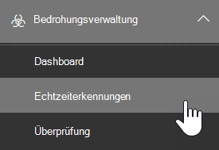|
|

Explorer- oder Echtzeiterkennungen helfen Ihrem Sicherheitsteam dabei, Bedrohungen effizient zu untersuchen und darauf zu reagieren. Der Bericht ähnelt der folgenden Abbildung:

Mit diesem Bericht können Sie:

- [Siehe Schadsoftware, die von Microsoft 365-Sicherheitsfeatures erkannt wird](#see-malware-detected-in-email-by-technology)
- [Anzeigen der Phishing-URL und Klicken auf Verdingungsdaten](#view-phishing-url-and-click-verdict-data)
- [Starten eines automatisierten Untersuchungs-](#start-automated-investigation-and-response) und Reaktionsprozesses aus einer Ansicht im Explorer (nur Defender für Office 365 Plan 2)
- [Untersuchen bösartiger E-Mails und mehr](#more-ways-to-use-explorer-and-real-time-detections)

## Verbesserungen bei der Bedrohungssuche

### Einführung der Warnungs-ID für MDO-Warnungen in Explorer/Echtzeiterkennungen (Vorschau)
Wenn Sie heute von einer Warnung zum Bedrohungs-Explorer navigieren, wird im Explorer eine gefilterte Ansicht geöffnet, deren Ansicht nach der Warnungsrichtlinien-ID gefiltert ist (Richtlinien-ID ist ein eindeutiger Bezeichner für eine Warnungsrichtlinie).
Wir machen diese Integration relevanter, indem wir die Warnungs-ID (siehe ein Beispiel für die Warnungs-ID unten) im Bedrohungs-Explorer und in Echtzeiterkennungen einführen, sodass Nachrichten angezeigt werden, die für die jeweilige Warnung relevant sind, sowie eine Anzahl von E-Mails. Sie können auch sehen, ob eine Nachricht Teil einer Warnung war, und von dieser Nachricht zu der spezifischen Warnung navigieren.  

Die Warnungs-ID ist innerhalb der URL verfügbar, wenn Sie eine einzelne Warnung anzeigen. Ein Beispiel ist `https://protection.office.com/viewalerts?id=372c9b5b-a6c3-5847-fa00-08d8abb04ef1` .

> [!div class="mx-imgBorder"]
> 

> [!div class="mx-imgBorder"]
> 

 
### Erweitern des Speicher- und Suchgrenzwerts für Explorer (und Echtzeiterkennungen) für Test-Mandanten von 7 auf 30 Tage (Vorschau)  
Im Rahmen dieser Änderung können Sie E-Mail-Daten innerhalb von 30 Tagen (gegenüber den vorherigen 7 Tagen) in Threat Explorer/Echtzeiterkennungen für Defender für Office P1 und P2-Test-Mandanten suchen und filtern. Dies wirkt sich nicht auf Produktions mandanten für P1- und P2/E5-Kunden aus, die bereits über die 30-tägigen Funktionen zur Datenspeicherung und -suche verfügen. 

### Aktualisierte Grenzwerte für den Export von Datensätzen für Den Bedrohungs-Explorer (Vorschau) 
Im Rahmen dieses Updates wird die Anzahl der Zeilen für E-Mail-Datensätze, die aus dem Bedrohungs-Explorer exportiert werden können, von 9990 auf 200.000 Datensätze erhöht. Der Satz von Spalten, die derzeit exportiert werden können, bleibt unverändert, die Anzahl der Zeilen wird jedoch vom aktuellen Grenzwert an zunehmen.

### Tags im Bedrohungs-Explorer

> [!NOTE]
> Das Feature für Benutzertags befindet sich in *der Vorschau,* ist nicht für alle verfügbar und kann geändert werden. Informationen zum Veröffentlichungszeitplan finden Sie in der Microsoft 365-Roadmap.

Benutzertags identifizieren bestimmte Benutzergruppen in Microsoft Defender für Office 365. Weitere Informationen zu Tags, einschließlich Lizenzierung und Konfiguration, finden Sie unter [User tags](user-tags.md).

Im Bedrohungs-Explorer finden Sie Informationen zu Benutzertags in den folgenden Benutzeroberflächen.

#### E-Mail-Rasteransicht

Die **Spalte Tags** im E-Mail-Raster enthält alle Tags, die auf die Absender- oder Empfängerpostfächer angewendet wurden. Standardmäßig werden Systemtags wie Prioritätskonten zuerst angezeigt.

> [!div class="mx-imgBorder"]
> 

#### Filtern

Sie können Tags als Filter verwenden. Suche nur über Prioritätskonten oder bestimmte Benutzertagsszenarien hinweg. Sie können auch Ergebnisse mit bestimmten Tags ausschließen. Kombinieren Sie diese Funktionalität mit anderen Filtern, um den Untersuchungsbereich zu einent-

> [!div class="mx-imgBorder"]
> 

#### Flyout für E-Mail-Details
Um die einzelnen Tags für Absender und Empfänger anzuzeigen, wählen Sie den Betreff aus, um das Flyout für Nachrichtendetails zu öffnen. Auf der **Registerkarte Zusammenfassung** werden die Absender- und Empfängertags separat angezeigt, wenn sie für eine E-Mail vorhanden sind.
Die Informationen zu einzelnen Tags für Absender und Empfänger erstrecken sich auch auf exportierte CSV-Daten, in denen diese Details in zwei separaten Spalten angezeigt werden.

> [!div class="mx-imgBorder"]
> 

Tags-Informationen werden auch im Flyout "URL-Klicks" angezeigt. Wechseln Sie zum Anzeigen zu Phish oder Alle E-Mail-Ansicht und dann zur Registerkarte **URLs** oder **URL-Klicks.** Wählen Sie ein einzelnes URL-Flyout aus, um zusätzliche Details zu Klicks für diese URL anzuzeigen, einschließlich tags, die diesem Klick zugeordnet sind.

### Aktualisierte Zeitachsenansicht

> [!div class="mx-imgBorder"]
> 
> 
Erfahren Sie mehr, in dem Sie [dieses Video](https://www.youtube.com/watch?v=UoVzN0lYbfY&list=PL3ZTgFEc7LystRja2GnDeUFqk44k7-KXf&index=4) ansehen. 

## Verbesserungen bei der Bedrohungssuche (anstehender)

### Aktualisierte Bedrohungsinformationen für E-Mails

Wir haben uns auf Verbesserungen der Plattform- und Datenqualität konzentriert, um die Datengenauigkeit und Konsistenz für E-Mail-Datensätze zu erhöhen. Zu den Verbesserungen gehört die Konsolidierung von Pre-Delivery- und Post-Delivery-Informationen, z. B. Aktionen, die für eine E-Mail als Teil des ZAP-Prozesses ausgeführt werden, in einem einzigen Datensatz. Zusätzliche Details wie Spam-Urteil, Bedrohungen auf Entitätsebene (z. B. welche URL schädlich war) und aktuelle Zustellungsorte sind ebenfalls enthalten.

Nach diesen Updates wird ein einzelner Eintrag für jede Nachricht angezeigt, unabhängig von den verschiedenen Ereignissen nach der Zustellung, die sich auf die Nachricht auswirken. Aktionen können ZAP, manuelle Korrektur (d. h. Administratoraktion), dynamische Zustellung und so weiter umfassen.

Zusätzlich zum Anzeigen von Schadsoftware und Phishingbedrohungen wird das Spam-Urteil angezeigt, das einer E-Mail zugeordnet ist. Sehen Sie sich in der E-Mail alle mit der E-Mail verbundenen Bedrohungen zusammen mit den entsprechenden Erkennungstechnologien an. Eine E-Mail kann null, eine oder mehrere Bedrohungen haben. Die aktuellen Bedrohungen werden im Abschnitt **Details** des E-Mail-Flyouts angezeigt. Bei mehreren Bedrohungen (z.  B. Schadsoftware und Phishing) zeigt das Tech-Feld Erkennung die Zuordnung zur Bedrohungserkennung, d. h. die Erkennungstechnologie, die die Bedrohung identifiziert hat.

Der Satz von Erkennungstechnologien umfasst jetzt neue Erkennungsmethoden sowie Spamerkennungstechnologien. Sie können den gleichen Satz von Erkennungstechnologien verwenden, um die Ergebnisse in den verschiedenen E-Mail-Ansichten zu filtern (Schadsoftware, Phish, Alle E-Mails).

> [!NOTE]
> Die Diktieranalyse ist möglicherweise nicht unbedingt an Entitäten gebunden. Beispielsweise kann eine E-Mail als Phishing oder Spam klassifiziert werden, es gibt jedoch keine URLs, die mit einem Phishing-/Spam-Urteil gestempelt sind. Der Grund dafür ist, dass die Filter auch Inhalte und andere Details für eine E-Mail auswerten, bevor sie ein Urteil zuweisen.

#### Bedrohungen in URLs

Die spezifische Bedrohung für eine URL wird nun  auf der Registerkarte E-Mail-Flyoutdetails angezeigt. Die Bedrohung kann *Schadsoftware,* *Phishing,* *Spam* oder *keine sein.)*

> [!div class="mx-imgBorder"]
> 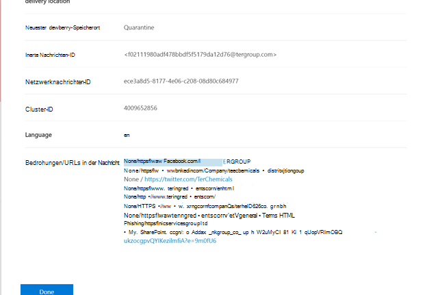

### Aktualisierte Zeitachsenansicht (anstehender)

> [!div class="mx-imgBorder"]
> 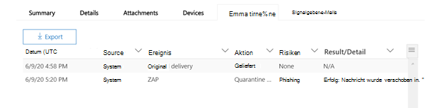

Die Zeitachsenansicht identifiziert alle Zustellungs- und Postzustellungsereignisse. Sie enthält Informationen zur Bedrohung, die zu diesem Zeitpunkt für eine Teilmenge dieser Ereignisse identifiziert wurde. Die Zeitachsenansicht enthält außerdem Informationen über alle zusätzlichen Aktionen (z. B. ZAP oder manuelle Korrektur) sowie das Ergebnis dieser Aktion. Informationen zur Zeitachsenansicht umfassen:

- **Quelle:** Quelle des Ereignisses. Es kann administrator/system/user sein.
- **Ereignis:** Umfasst Ereignisse auf oberster Ebene wie originale Zustellung, manuelle Korrektur, ZAP, Übermittlungen und dynamische Zustellung.
- **Aktion:** Die spezifische Aktion, die im Rahmen der ZAP- oder Administratoraktion (z. B. soft delete) ergriffen wurde.
- **Bedrohungen:** Deckt die zu diesem Zeitpunkt identifizierten Bedrohungen (Schadsoftware, Phishing, Spam) ab.
- **Ergebnis/Details:** Weitere Informationen zum Ergebnis der Aktion, z. B. ob sie im Rahmen der ZAP/Admin-Aktion ausgeführt wurde.

### Ursprünglicher und aktueller Zustellungsspeicherort

Derzeit wird der Zustellungsspeicherort im E-Mail-Raster und im E-Mail-Flyout angezeigt. Das **Feld Zustellungsspeicherort** wird in **_Originalzustellungsspeicherort _umbenannt._*Und wir stellen ein weiteres Feld vor: _*_Aktueller Zustellungsspeicherort_**.

**Der ursprüngliche Zustellungsspeicherort** enthält weitere Informationen darüber, wo eine E-Mail ursprünglich zugestellt wurde. **Der neueste Zustellungsspeicherort** gibt an, wo eine E-Mail nach Systemaktionen wie *ZAP* oder Administratoraktionen wie *Verschieben zu gelöschten Elementen gelandet ist.* Der neueste Zustellungsspeicherort soll Administratoren den letzten bekannten Speicherort der Nachricht nach der Zustellung oder alle System-/Administratoraktionen mitteilen. Es enthält keine Endbenutzeraktionen für die E-Mail. Wenn ein Benutzer beispielsweise eine Nachricht gelöscht oder die Nachricht in archiv/pst verschoben hat, wird der Nachrichtenspeicherort "Zustellung" nicht aktualisiert. Wenn jedoch durch eine Systemaktion der Speicherort aktualisiert wurde (z. B. ZAP, was zu einer E-Mail **führt,** die in quarantäne verschoben wird), würde der letzte Zustellungsspeicherort als "Quarantäne" anzeigen.

> [!div class="mx-imgBorder"]
> 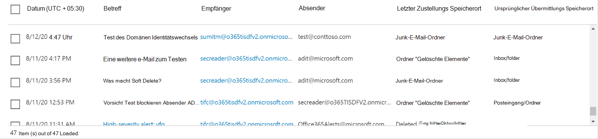

> [!NOTE]
> Es gibt einige  Fälle, in denen Zustellungsspeicherort und **Zustellungsaktion** als "unbekannt" anzeigen können:
>
> - Möglicherweise wird  der Zustellungsspeicherort  als "zugestellt" und der Zustellungsspeicherort als "unbekannt" angezeigt, wenn die Nachricht zugestellt wurde, aber eine Posteingangsregel hat die Nachricht in einen Standardordner (z. B. Entwurf oder Archiv) anstatt in den Ordner Posteingang oder Junk-E-Mail verschoben.
>
> - **Der neueste Zustellungsspeicherort** kann unbekannt sein, wenn eine Administrator-/Systemaktion (z. B. ZAP) versucht wurde, die Nachricht jedoch nicht gefunden wurde. In der Regel erfolgt die Aktion, nachdem der Benutzer die Nachricht verschoben oder gelöscht hat. Überprüfen Sie in solchen Fällen die **Spalte Ergebnis/Details** in der Zeitachsenansicht. Suchen Sie nach der Anweisung "Vom Benutzer verschobene oder gelöschte Nachricht".

> [!div class="mx-imgBorder"]
> 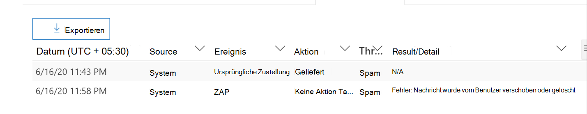

### Zusätzliche Aktionen

*Zusätzliche Aktionen* wurden nach der Zustellung der E-Mail angewendet. Sie können *ZAP,* manuelle Korrektur *(von* einem Administrator ergriffene Aktion, z. B. soft *delete),* dynamische Zustellung und erneute Verarbeitung *(für* eine E-Mail, die rückwirkend als gut erkannt wurde) umfassen.

> [!NOTE]
> - Im Rahmen der ausstehenden Änderungen geht der Wert "Entfernt von ZAP", der derzeit im Filter Zustellungsaktion angezeigt wird, weg. Sie haben eine Möglichkeit, mit dem ZAP-Versuch über zusätzliche Aktionen nach allen E-Mails **zu suchen.**
>
> - Es gibt neue Felder und Werte **für** Erkennungstechnologien und **zusätzliche Aktionen** (insbesondere für ZAP-Szenarien). Sie müssen Ihre vorhandenen gespeicherten und nachverfolgten Abfragen auswerten, um sicherzustellen, dass sie mit den neuen Werten funktionieren.

> [!div class="mx-imgBorder"]
> 

### Systemüberschreibungen

*Systemüberschreibungen* ermöglichen es Ihnen, Ausnahmen vom beabsichtigten Zustellungsspeicherort einer Nachricht zu machen. Sie setzen den vom System bereitgestellten Zustellungsspeicherort basierend auf den Bedrohungen und anderen Erkennungen außer Kraft, die durch den Filterstapel identifiziert werden. Systemüberschreibungen können über Mandanten- oder Benutzerrichtlinien festgelegt werden, um die Nachricht wie von der Richtlinie vorgeschlagen zu senden. Außerkraftsetzungen können die unbeabsichtigte Zustellung schädlicher Nachrichten aufgrund von Konfigurationslücken identifizieren, z. B. eine zu umfassende Richtlinie für sichere Absender, die von einem Benutzer festgelegt wurde. Diese Außerkraftsetzungswerte können wie die folgenden sein:

- Benutzerrichtlinie zulässig: Ein Benutzer erstellt Richtlinien auf Postfachebene, um Domänen oder Absender zu ermöglichen.

- Durch Benutzerrichtlinie blockiert: Ein Benutzer erstellt Richtlinien auf Postfachebene, um Domänen oder Absender zu blockieren.

- Durch Organisationsrichtlinie zulässig: Die Sicherheitsteams der Organisation legen Richtlinien oder Exchange-Nachrichtenflussregeln (auch als Transportregeln bezeichnet) fest, um Absendern und Domänen für Benutzer in ihrer Organisation zu ermöglichen. Dies kann für eine Gruppe von Benutzern oder die gesamte Organisation sein.

- Durch Organisationsrichtlinie blockiert: Die Sicherheitsteams der Organisation legen Richtlinien oder Nachrichtenflussregeln zum Blockieren von Absendern, Domänen, Nachrichtensprachen oder Quell-IPs für Benutzer in ihrer Organisation bereit. Dies kann auf eine Gruppe von Benutzern oder die gesamte Organisation angewendet werden.

- Durch Die Organisationsrichtlinie blockierte Dateierweiterung: Das Sicherheitsteam einer Organisation blockiert eine Dateinamenerweiterung über die Richtlinieneinstellungen für Ansoftware. Diese Werte werden nun in E-Mail-Details angezeigt, um Bei Untersuchungen zu unterstützen. Secops-Teams können auch die Rich-Filtering-Funktion verwenden, um nach blockierten Dateierweiterungen zu filtern.

> [!div class="mx-imgBorder"]
> 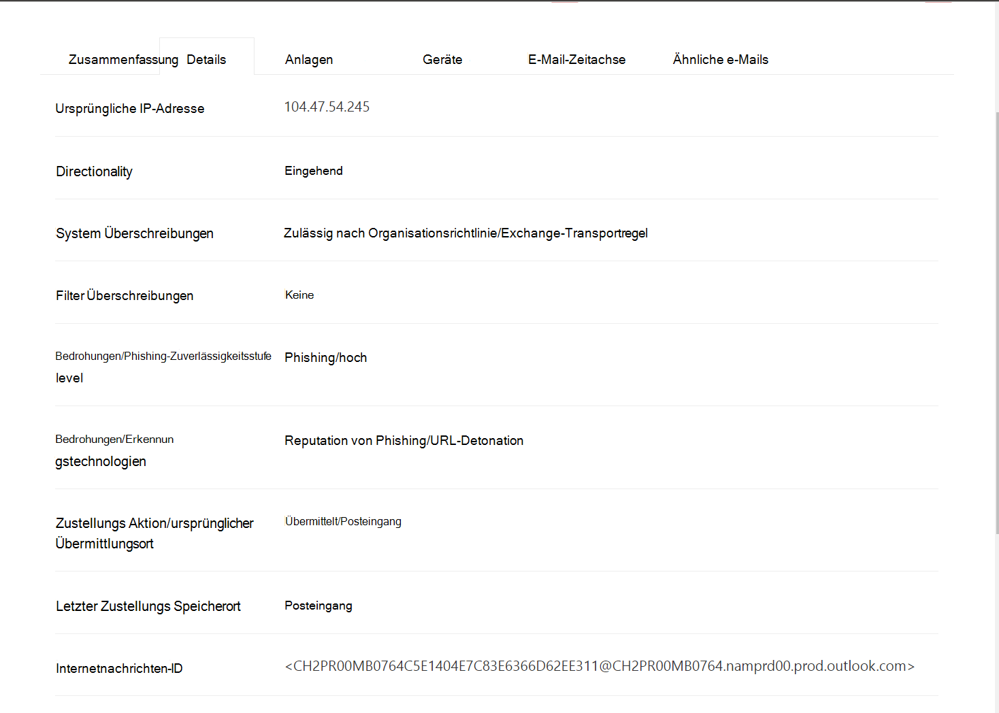

### Verbesserungen für die URL- und Klickerfahrung

Zu den Verbesserungen gehören:

- Zeigen Sie die vollständig geklickte URL (einschließlich aller Abfrageparameter, die Teil der URL sind) im Abschnitt **Klicks** des URL-Flyouts an. Derzeit werden die URL-Domäne und der Pfad in der Titelleiste angezeigt. Wir erweitern diese Informationen, um die vollständige URL anzeigen zu können.

- Korrekturen über URL-Filter hinweg (*URL* versus *URL-Domäne* im Vergleich zu *URL-Domäne* und -Pfad ): Die Updates wirken sich auf die Suche nach Nachrichten aus, die eine URL/Klick-Urteil enthalten. Wir haben die Unterstützung für protokollagnostische Suchen aktiviert, sodass Sie ohne verwendung nach einer URL suchen `http` können. Standardmäßig wird die URL-Suche http zugestellt, es sei denn, ein anderer Wert wird explizit angegeben. Beispiel:

   -  Suchen Sie mit und ohne präfix `http://` in den **Feldern URL,** **URL Domain** und URL Domain and **Path.** Die Suchergebnisse sollten die gleichen Ergebnisse anzeigen.

   -  Suchen Sie in `https://` URL nach dem **Präfix.** Wenn kein Wert angegeben wird, wird `http://` das Präfix angenommen.

   - `/`wird am Anfang und Ende der Felder **URL-Pfad,** **URL-Domäne,** **URL-Domäne und Pfad ignoriert.** `/` am Ende des **URL-Felds** wird ignoriert.

### Phish confidence level

Die Phish Confidence Level hilft, den Grad an Vertrauen zu identifizieren, mit dem eine E-Mail als "Phish" kategorisiert wurde. Die beiden möglichen Werte sind *High* und *Normal.* In den ersten Phasen ist dieser Filter nur in der Phish-Ansicht des Bedrohungs-Explorers verfügbar.

### ZAP-URL-Signal

Das ZAP-URL-Signal wird in der Regel für ZAP Phish-Warnungsszenarien verwendet, in denen eine E-Mail als Phish identifiziert und nach der Zustellung entfernt wurde. Dieses Signal verbindet die Warnung mit den entsprechenden Ergebnissen im Explorer. Es ist eine der IOCs für die Warnung.

Um den Suchesprozess zu verbessern, haben wir Den Bedrohungs-Explorer und Echtzeiterkennungen aktualisiert, um die Suche konsistenter zu machen. Die Änderungen werden hier beschrieben:

- [Verbesserungen an zeitzonen](#timezone-improvements)
- [Aktualisieren im Aktualisierungsprozess](#update-in-the-refresh-process)
- [Diagramm-Drilldown zum Hinzufügen zu Filtern](#chart-drilldown-to-add-to-filters)
- [In Produktinformationsupdates](#in-product-information-updates)

### Filtern nach Benutzertags

Sie können nun System- oder benutzerdefinierte Benutzertags sortieren und filtern, um den Umfang von Bedrohungen schnell zu erfassen. Weitere Informationen finden Sie unter [User tags](user-tags.md).

> [!IMPORTANT]
> Das Filtern und Sortieren nach Benutzertags befindet sich derzeit in der öffentlichen Vorschau. Diese Funktionalität kann erheblich geändert werden, bevor sie kommerziell veröffentlicht wird. Microsoft gibt keine ausdrücklichen oder impliziten Garantien in Bezug auf die informationen, die darüber bereitgestellt werden.

> [!div class="mx-imgBorder"]
> 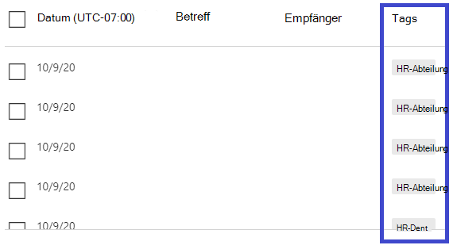

### Verbesserungen an zeitzonen

Sie sehen die Zeitzone für die E-Mail-Einträge im Portal sowie für exportierte Daten. Er wird in verschiedenen Erfahrungen wie E-Mail-Raster, Details-Flyout, E-Mail-Zeitachse und ähnliche E-Mails angezeigt, sodass die Zeitzone für den Ergebnissatz klar ist.

> [!div class="mx-imgBorder"]
> 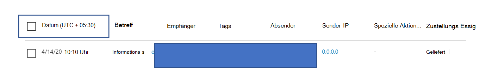

### Aktualisieren im Aktualisierungsprozess

Einige Benutzer haben verwirrung mit der automatischen Aktualisierung (z. B. sobald Sie das Datum ändern, die Seite aktualisiert) und der manuellen Aktualisierung (für andere Filter) kommentiert. Auf ähnliche Weise führt das Entfernen von Filtern zu einer automatischen Aktualisierung. Das Ändern von Filtern beim Ändern der Abfrage kann zu inkonsistenten Sucherfahrungen führen. Um diese Probleme zu beheben, wird ein manueller Filtermechanismus verwendet.

Aus Sicht der Benutzererfahrung kann der Benutzer den unterschiedlichen Filterbereich (aus dem Filtersatz und Datum) anwenden und entfernen und die Schaltfläche Aktualisieren auswählen, um die Ergebnisse zu filtern, nachdem er die Abfrage definiert hat. Die Schaltfläche "Aktualisieren" wird nun auch auf dem Bildschirm hervorgehoben. Außerdem haben wir die zugehörigen QuickInfos und produktbezogene Dokumentation aktualisiert.

> [!div class="mx-imgBorder"]
> 

### Diagramm-Drilldown zum Hinzufügen zu Filtern

Sie können jetzt Legendenwerte diagrammieren, um sie als Filter hinzuzufügen. Wählen Sie die **Schaltfläche Aktualisieren** aus, um die Ergebnisse zu filtern.

> [!div class="mx-imgBorder"]
> 

### Produktin-Produkt-Informationsupdates

Zusätzliche Details sind jetzt im Produkt verfügbar, z. B. die Gesamtanzahl der Suchergebnisse innerhalb des Rasters (siehe unten). Wir haben Bezeichnungen, Fehlermeldungen und QuickInfos verbessert, um weitere Informationen zu Filtern, Sucherfahrung und Ergebnissatz zu erhalten.

> [!div class="mx-imgBorder"]
> 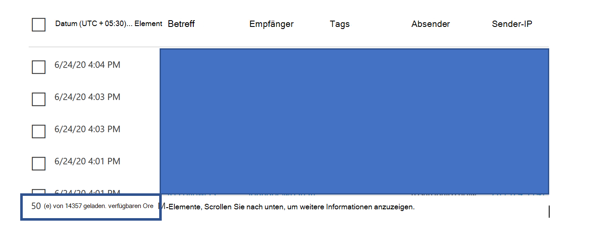

## Erweiterte Funktionen im Bedrohungs-Explorer

### Benutzer mit den meisten Zielbenutzern

Heute stellen wir die Liste der am meisten gezielten Benutzer in der Ansicht Schadsoftware für E-Mails im **Abschnitt Top Malware Families** zur Verfügung. Diese Ansicht wird auch in den Ansichten Phish und All Email erweitert. Sie können die fünf zielorientierten Benutzer sowie die Anzahl der Versuche für jeden Benutzer für die entsprechende Ansicht anzeigen. Für die Phish-Ansicht wird z. B. die Anzahl der Phish-Versuche angezeigt.

Sie können die Liste der zielorientierten Benutzer bis zu einem Grenzwert von 3.000 zusammen mit der Anzahl der Versuche für die Offlineanalyse für jede E-Mail-Ansicht exportieren. Darüber hinaus wird beim Auswählen der Anzahl der Versuche (z. B. 13 Versuche in der abbildung unten) eine gefilterte Ansicht im Bedrohungs-Explorer geöffnet, damit Sie weitere Details in E-Mails und Bedrohungen für diesen Benutzer sehen können.

> [!div class="mx-imgBorder"]
> 

### Exchange-Transportregeln

Im Rahmen der Datenerweiterung können Sie alle verschiedenen Exchange-Transportregeln (EXCHANGE Transport Rules, ETR) anzeigen, die auf eine Nachricht angewendet wurden. Diese Informationen sind in der Ansicht E-Mail-Raster verfügbar. Wählen Sie zum Anzeigen im Raster **Spaltenoptionen** aus, und fügen Sie dann in den Spaltenoptionen **Exchange-Transportregel** hinzu. Sie wird auch im **Flyout Details** in der E-Mail angezeigt.

Sie können sowohl die GUID als auch den Namen der Transportregeln anzeigen, die auf die Nachricht angewendet wurden. Sie können mithilfe des Namens der Transportregel nach den Nachrichten suchen. Dies ist eine "Contains"-Suche, was bedeutet, dass Sie auch Teilsuchen machen können.

> [!IMPORTANT]
> Die Verfügbarkeit von ETR-Such- und -Namen hängt von der bestimmten Rolle ab, die Ihnen zugewiesen ist. Sie benötigen eine der folgenden Rollen/Berechtigungen, um die ETR-Namen und die Suche anzeigen zu können. Wenn Ihnen keine dieser Rollen zugewiesen ist, können Sie die Namen der Transportregeln nicht anzeigen oder mithilfe von ETR-Namen nach Nachrichten suchen. In den E-Mail-Details können Sie jedoch die ETR-Bezeichnung und GUID-Informationen sehen. Andere Aufzeichnungsansichtserfahrungen in E-Mail-Rastern, E-Mail-Flyouts, Filtern und Export sind nicht betroffen.
> 
> - Nur EXO – Verhinderung von Datenverlust: Alle
> - Nur EXO - O365SupportViewConfig: Alle
> - Microsoft Azure Active Directory oder EXO – Sicherheitsadministrator: Alle
> - AAD oder EXO - Security Reader: Alle
> - Nur EXO - Transportregeln: Alle
> - Nur EXO – View-Only Konfiguration: Alle
> 
> Innerhalb des E-Mail-Rasters, des Details-Flyouts und des exportierten CSV erhalten die ETRs eine Name/GUID, wie unten gezeigt.
> 
> > [!div class="mx-imgBorder"]
> > 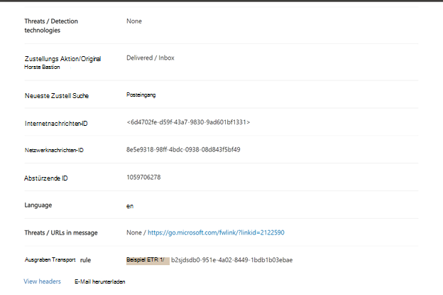

### Eingehende Connectors

Connectors sind eine Sammlung von Anweisungen, die anpassen, wie Ihre E-Mails zu Und von Ihrer Microsoft 365- oder Office 365-Organisation fließen. Sie ermöglichen ihnen das Anwenden von Sicherheitseinschränkungen oder -steuerelementen. Im Bedrohungs-Explorer können Sie jetzt die Connectors anzeigen, die mit einer E-Mail in Zusammenhang stehen, und mithilfe von Connectornamen nach E-Mails suchen.

Die Suche nach Connectors ist "enthält", was bedeutet, dass auch teilweise Stichwortsuchen funktionieren sollten. In der Hauptrasteransicht, dem Flyout Details und der exportierten CSV werden die Connectors im Name/GUID-Format wie hier gezeigt angezeigt:

> [!div class="mx-imgBorder"]
> 

## Neue Features in Threat Explorer und Echtzeiterkennungen

- [Anzeigen von Phishing-E-Mails, die an imitierte Benutzer und Domänen gesendet werden](#view-phishing-emails-sent-to-impersonated-users-and-domains)
-  [Vorschau des E-Mail-Headers und des E-Mail-Textkörpers herunterladen](#preview-email-header-and-download-email-body)
- [E-Mail-Zeitachse](#email-timeline)
- [Exportieren von URL-Klickdaten](#export-url-click-data)

### Anzeigen von Phishing-E-Mails, die an imitierte Benutzer und Domänen gesendet werden

Um Phishingversuche gegen Benutzer und Domänen zu identifizieren, bei der es sich um benutzeridentitierte Benutzer handelt, müssen sie der Liste der Benutzer hinzugefügt werden, die *geschützt werden sollen.* Bei Domänen müssen Administratoren entweder Organisationsdomänen aktivieren *oder* Domänen einen Domänennamen hinzufügen, um *zu schützen*. Die zu schützende Domäne finden Sie auf der *Seite Antiphishingrichtlinien* im Abschnitt *Identitätswechsel.*

Verwenden Sie die E-Mail-> [Phish-Ansicht](threat-explorer-views.md) des Explorers, um Phishingnachrichten zu überprüfen und nach imitierten Benutzern oder Domänen zu suchen.

In diesem Beispiel wird Der Bedrohungs-Explorer verwendet.

1. Wählen Sie [im Security & Compliance Center](https://protection.office.com) ( die Option https://protection.office.com) Bedrohungsverwaltung > Explorer (oder Echtzeiterkennungen) aus.

2. Wählen Sie im Menü Ansicht die Option Email > Phish aus.

   Hier können Sie die **Identitätswechseldomäne oder** den **identitätswechselten Benutzer auswählen.**

3. **Wählen Sie** **entweder Imitierte Domäne** aus, und geben Sie dann eine geschützte Domäne in das Textfeld ein.

   Suchen Sie beispielsweise nach geschützten Domänennamen wie *contoso*, *contoso.com* oder *contoso.com.au*.

4. Wählen Sie den Betreff einer Nachricht unter der Registerkarte E-Mail-> Details aus, um zusätzliche Identitätswechselinformationen wie Identitätswechseldomäne /Erkannter Speicherort anzuzeigen.

    **OR** 

    Wählen **Sie Imitierter Benutzer aus,** und geben Sie die E-Mail-Adresse eines geschützten Benutzers in das Textfeld ein.

    > [!TIP]
    > **Verwenden Sie vollständige** E-Mail-Adressen, um geschützte Benutzer *zu durchsuchen,* um optimale Ergebnisse zu erzielen. Sie finden Ihren geschützten Benutzer schneller und erfolgreicher, wenn Sie nach firstname.lastname@contoso.com *suchen,* z. B. bei der Untersuchung des Identitätswechsels von Benutzern. Bei der Suche nach einer geschützten Domäne wird die Stammdomäne (z. B. contoso.com) und der Domänenname ( contoso )*verwendet.* Bei der Suche nach der *Stammdomäne contoso.com* sowohl  Identitätswechsel von contoso.com als auch den Domänennamen *contoso zurück.*

5. Wählen Sie **auf** der Registerkarte E-Mail-Registerkarte Details die Option Betreff einer Nachricht aus, um zusätzliche Identitätswechselinformationen zum Benutzer oder der Domäne sowie den Speicherort  >   *"Erkannt" anzuzeigen.*

    :::image type="content" source="../../media/threat-ex-views-impersonated-user-image.png" alt-text="Der Detailbereich des Bedrohungs-Explorers für einen geschützten Benutzer, der den Erkennungsspeicherort und die erkannte Bedrohung (hier den Identitätswechsel eines Benutzers) zeigt.":::

> [!NOTE]
> Wenn Sie in Schritt 3 oder 5  Erkennungstechnologie auswählen  und Identitätswechseldomäne bzw. Identitätswechselbenutzer auswählen, werden die Informationen auf der Registerkarte    >   *E-Mail-Details* über den Benutzer oder die Domäne und der Speicherort "Erkannt" nur in den Nachrichten angezeigt, die mit dem Benutzer oder der Domäne im Zusammenhang stehen, die auf der Seite Antiphishingrichtlinien aufgeführt sind. 

### Vorschau des E-Mail-Headers und des E-Mail-Textkörpers herunterladen

Sie können jetzt eine Vorschau eines E-Mail-Headers anzeigen und den E-Mail-Textkörper im Bedrohungs-Explorer herunterladen. Administratoren können heruntergeladene Kopfzeilen/E-Mail-Nachrichten auf Bedrohungen analysieren. Da das Herunterladen von E-Mail-Nachrichten das Risiko der Informationsexposition darstellen kann, wird dieser Prozess durch die rollenbasierte Zugriffssteuerung (RBAC) gesteuert. Eine neue Rolle, *Vorschau*, muss einer anderen Rollengruppe hinzugefügt werden (z. B. Sicherheitsvorgänge oder Sicherheitsadministrator), um das Herunterladen von E-Mails in der Ansicht für E-Mail-Nachrichten zu gewähren. Für das Anzeigen des E-Mail-Headers ist jedoch keine zusätzliche Rolle erforderlich (es sei denn, dies ist erforderlich, um Nachrichten im Bedrohungs-Explorer anzeigen zu können).

Explorer- und Echtzeiterkennungen erhalten auch neue Felder, die ein vollständigeres Bild davon bieten, wo Ihre E-Mail-Nachrichten landen. Diese Änderungen erleichtern die Suche für Sicherheits-Ops. Das Hauptergebnis ist jedoch, dass Sie den Speicherort von problematischen E-Mail-Nachrichten auf einen Blick kennen.

Wie wird dies durchgeführt? Der Zustellungsstatus ist nun in zwei Spalten aufgeschlüsselt:

- **Zustellungsaktion** – Status der E-Mail.
- **Zustellungsspeicherort** : Wo die E-Mail geroutet wurde.

*Übermittlungsaktion* ist die Aktion, die aufgrund vorhandener Richtlinien oder Erkennungen für eine E-Mail ergriffen wird. Hier sind die möglichen Aktionen für eine E-Mail:

|Zugestellt|Junked|Gesperrt|Ersetzt|
|---|---|---|---|
|E-Mails wurden an den Posteingang oder Ordner eines Benutzers übermittelt, und der Benutzer kann darauf zugreifen.|E-Mails wurden an den Junk- oder Den Gelöschten Ordner des Benutzers gesendet, und der Benutzer kann darauf zugreifen.|E-Mails, die isoliert, fehlgeschlagen oder gelöscht wurden. Auf diese E-Mails kann der Benutzer nicht zugegriffen werden.|Bei E-Mails wurden schädliche Anlagen durch TXT-Dateien ersetzt, in deren Zustand die Anlage schädlich war.|

Dies ist das, was der Benutzer sehen kann und nicht:

|Für Endbenutzer zugänglich|Zugriff für Endbenutzer nicht möglich|
|---|---|
|Zugestellt|Gesperrt|
|Junked|Ersetzt|

**Der Zustellungsspeicherort** zeigt die Ergebnisse von Richtlinien und Erkennungen an, die nach der Zustellung ausgeführt werden. Es ist mit der **_Zustellungsaktion verknüpft._** Dies sind die möglichen Werte:

- *Posteingang oder Ordner:* Die E-Mail befindet sich im Posteingang oder in einem Ordner (gemäß Ihren E-Mail-Regeln).
- *Lokal oder extern:* Das Postfach ist nicht in der Cloud vorhanden, sondern lokal.
- *Junkordner:* Die E-Mail befindet sich im Junkordner eines Benutzers.
- *Ordner "Gelöschte* Elemente": Die E-Mail im Ordner "Gelöschte Elemente" eines Benutzers.
- *Quarantäne:* Die E-Mail befindet sich in Quarantäne und nicht im Postfach eines Benutzers.
- *Fehler:* Die E-Mail konnte das Postfach nicht erreichen.
- *Dropped*: Die E-Mails sind an einer Stelle im E-Mail-Fluss verloren gegangen.

### E-Mail-Zeitachse

Die **E-Mail-Zeitachse** ist ein neues Explorer-Feature, das die Suche für Administratoren verbessert. Es reduziert die Zeit, die die Überprüfung verschiedener Speicherorte auf sich hat, um zu versuchen, das Ereignis zu verstehen. Wenn mehrere Ereignisse gleichzeitig oder in der Nähe einer E-Mail eintreten, werden diese Ereignisse in einer Zeitachsenansicht angezeigt. Einige Ereignisse, die nach der Zustellung ihrer E-Mail auftreten, werden in der Spalte **Spezielle Aktion** erfasst. Administratoren können Informationen aus der Zeitachse mit der speziellen Aktion für die E-Mail-Postzustellung kombinieren, um einen Einblick in die Funktionsweise ihrer Richtlinien zu erhalten, wo die E-Mail schließlich geroutet wurde, und in einigen Fällen, was die endgültige Bewertung war.

Weitere Informationen finden Sie unter [Investigate and remediate malicious email that was delivered in Office 365](investigate-malicious-email-that-was-delivered.md).

### Exportieren von URL-Klickdaten

Sie können jetzt Berichte für URL-Klicks  nach Microsoft Excel exportieren, um ihre Netzwerknachrichten-ID ein- und auf **"Verdict"** zu klicken. Dadurch wird erläutert, woher der URL-Klickdatenverkehr stammt. So funktioniert's: Folgen Sie in Threat Management auf der Office 365-Schnellstartleiste dieser Kette:

**Explorer** \> **Phish anzeigen** \> **Klicks** \> **Top URLs or** **URL Top Clicks** \> select any record to open the URL flyout.

Wenn Sie eine URL in der Liste auswählen, wird eine neue Schaltfläche **Exportieren** im Fly-Out-Bereich angezeigt. Verwenden Sie diese Schaltfläche, um Daten zur einfacheren Berichterstellung in eine Excel-Kalkulationstabelle zu verschieben.

Gehen Sie wie folgt vor, um an denselben Ort im Bericht über Echtzeiterkennungen zu kommen:

**Explorer** \> **Echtzeiterkennungen** \> **Phish anzeigen** \> **URLs** \> **Top URLs or** **Top Clicks** Wählen Sie einen beliebigen Datensatz aus, um das \> URL-Flyout zu \> öffnen, navigieren Sie zur Registerkarte **Klicks.**

> [!TIP]
> Die Netzwerknachrichten-ID ordnet das Zurückklicken bestimmten E-Mails zu, wenn Sie die ID über Explorer oder zugeordnete Drittanbietertools durchsuchen. Bei solchen Suchen wird die E-Mail identifiziert, die einem Klickergebnis zugeordnet ist. Die korrelierte Netzwerknachrichten-ID ermöglicht eine schnellere und leistungsstärkere Analyse.

> [!div class="mx-imgBorder"]
> 

## Siehe Schadsoftware, die in E-Mails durch Technologie erkannt wurde

Angenommen, Sie möchten Schadsoftware in E-Mails nach Microsoft 365-Technologie sortiert sehen. Verwenden Sie dazu die [E-Mail->-Ansicht](threat-explorer-views.md#email--malware) von Explorer (oder Erkennungen in Echtzeit).

1. Wählen Sie im Security & Compliance Center ( <https://protection.office.com> ) die Option Bedrohungsverwaltungs-Explorer  \>  (oder **Echtzeiterkennungen) aus.** (In diesem Beispiel wird Explorer verwendet.)

2. Wählen Sie **im** Menü Ansicht die Option **E-Mail-Schadsoftware** \> **aus.**

   > [!div class="mx-imgBorder"]
   > 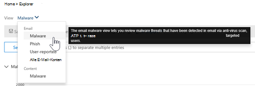

3. Klicken **Sie auf Absender,** und wählen Sie **dann Grundlegende** \> **Erkennungstechnologie aus.**

   Ihre Erkennungstechnologien sind jetzt als Filter für den Bericht verfügbar.

   > [!div class="mx-imgBorder"]
   > 

4. Wählen Sie eine Option aus. Wählen Sie dann die **Schaltfläche Aktualisieren** aus, um diesen Filter anzuwenden.

   > [!div class="mx-imgBorder"]
   > 

Der Bericht wird aktualisiert, um die Ergebnisse zu zeigen, die Schadsoftware in E-Mails mithilfe der von Ihnen ausgewählten Technologieoption erkannt hat. Von hier aus können Sie weitere Analysen durchführen.

## Anzeigen der Phishing-URL und Klicken auf Verdingungsdaten

Angenommen, Sie möchten Phishingversuche über URLs in E-Mails sehen, einschließlich einer Liste der URLs, die zugelassen, blockiert und außer Kraft gesetzt wurden. Zum Identifizieren von URLs, auf die geklickt wurde, müssen [sichere](safe-links.md) Links konfiguriert werden. Stellen Sie sicher, dass Sie [Richtlinien](set-up-safe-links-policies.md) für sichere Links für den Schutz und die Protokollierung von Klickverdingen durch sichere Links einrichten.

Verwenden Sie zum Überprüfen von Phish-URLs in Nachrichten und Klicken auf URLs in Phishingnachrichten die E-Mail-Phish-Ansicht von Explorer oder Echtzeiterkennungen. [   >   ](threat-explorer-views.md#email--phish)

1. Wählen Sie im Security & Compliance Center ( <https://protection.office.com> ) die Option Bedrohungsverwaltungs-Explorer  \>  (oder **Echtzeiterkennungen) aus.** (In diesem Beispiel wird Explorer verwendet.)

2. Wählen Sie **im** Menü Ansicht die Option **E-Mail-Phish** \> **aus.**

   > [!div class="mx-imgBorder"]
   > 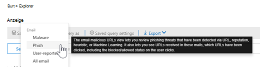

3. Klicken **Sie auf Absender,** und wählen Sie **dann URLs Klicken** Sie auf \> **Urteil**.

4. Wählen Sie eine oder  mehrere Optionen aus, z. B. Blockiert und außer Kraft **gesetzt,** und wählen Sie dann die Schaltfläche **Aktualisieren** in derselben Zeile wie die Optionen aus, um diesen Filter anzuwenden. (Aktualisieren Sie das Browserfenster nicht.)

   > [!div class="mx-imgBorder"]
   > 

   Der Bericht wird aktualisiert, um zwei unterschiedliche URL-Tabellen auf der Registerkarte URL unter dem Bericht zu zeigen:

   - **Die obersten URLs** sind die URLs in den Nachrichten, in die Sie gefiltert haben, und die Anzahl der E-Mail-Zustellungsaktion für jede URL. In der Phish-E-Mail-Ansicht enthält diese Liste in der Regel legitime URLs. Angreifer enthalten eine Mischung aus guten und schlechten URLs in ihren Nachrichten, um zu versuchen, sie zu liefern, aber sie machen die schädlichen Links interessanter. Die Tabelle der URLs wird nach der Gesamtzahl der E-Mails sortiert, diese Spalte ist jedoch ausgeblendet, um die Ansicht zu vereinfachen.

   - **Top clicks** are the Safe Links-wrapped URLs that were clicked, sorted by total click count. Diese Spalte wird auch nicht angezeigt, um die Ansicht zu vereinfachen. Die Gesamtzahlen nach Spalte geben die Anzahl der Klicks auf sichere Links für jede geklickte URL an. In der Phish-E-Mail-Ansicht handelt es sich in der Regel um verdächtige oder bösartige URLs. Die Ansicht kann jedoch URLs enthalten, die keine Bedrohungen sind, aber in Phishnachrichten enthalten sind. URL-Klicks auf unverpackte Links werden hier nicht angezeigt.

   Die beiden URL-Tabellen zeigen die besten URLs in Phishing-E-Mail-Nachrichten nach Zustellungsaktion und Speicherort. Die Tabellen zeigen URL-Klicks, die trotz einer Warnung blockiert oder besucht wurden, damit Sie sehen können, welche potenziellen ungültigen Links benutzern angezeigt wurden und auf die der Benutzer geklickt hat. Von hier aus können Sie weitere Analysen durchführen. Unterhalb des Diagramms werden beispielsweise die obersten URLs in E-Mail-Nachrichten angezeigt, die in der Umgebung Ihrer Organisation blockiert wurden.

   > [!div class="mx-imgBorder"]
   > 

   Wählen Sie eine URL aus, um ausführlichere Informationen anzeigen zu können.

   > [!NOTE]
   > Im Dialogfeld URL-Flyout wird die Filterung für E-Mail-Nachrichten entfernt, um die vollständige Ansicht der Belichtung der URL in Ihrer Umgebung anzuzeigen. Auf diese Weise können Sie nach E-Mail-Nachrichten filtern, über die Sie im Explorer besorgt sind, bestimmte URLs finden, die potenzielle Bedrohungen sind, und dann Ihr Verständnis der URL-Belichtung in Ihrer Umgebung (über das Dialogfeld URL-Details) erweitern, ohne der Exploreransicht selbst URL-Filter hinzufügen zu müssen.

### Interpretation von Klickverkündungen

Innerhalb der Flyouts "E-Mail" oder "URL", "Top Clicks" und in unseren Filterfunktionen werden unterschiedliche Klick-/Verdingungswerte angezeigt:

- **Keine:** Das Urteil für die URL kann nicht erfasst werden. Der Benutzer hat möglicherweise durch die URL geklickt.
- **Zulässig:** Der Benutzer konnte zur URL navigieren.
- **Blockiert:** Der Benutzer konnte nicht zur URL navigieren.
- **Ausstehendes Urteil:** Dem Benutzer wurde die Seite zum Ausstehen der Detonation angezeigt.
- **Überschreibend blockiert:** Der Benutzer konnte nicht direkt zur URL navigieren. Der Benutzer übernimmt jedoch den Block, um zur URL zu navigieren.
- **Ausstehendes Urteil umgangen:** Dem Benutzer wurde die Detonationsseite angezeigt. Der Benutzer übernimmt jedoch die Nachricht, um auf die URL zu zugreifen.
- **Fehler:** Dem Benutzer wurde die Fehlerseite angezeigt, oder beim Erfassen des Urteils ist ein Fehler aufgetreten.
- **Fehler:** Beim Erfassen des Urteils ist eine unbekannte Ausnahme aufgetreten. Der Benutzer hat möglicherweise durch die URL geklickt.

## Überprüfen von E-Mail-Nachrichten, die von Benutzern gemeldet wurden

Angenommen, Sie möchten [E-Mail-Nachrichten](enable-the-report-message-add-in.md) anzeigen, die Benutzer in Ihrer Organisation über das Add-In "Nachricht melden" oder das [Phishing-Add-In](enable-the-report-phish-add-in.md)melden als *Junk,* nicht Junk oder *Phishing* gemeldet haben. Um sie zu sehen, verwenden Sie die [ **Ansicht**  >  **E-Mail-Übermittlungen**](threat-explorer-views.md#email--submissions) von Explorer (oder Echtzeiterkennungen).

1. Wählen Sie im Security & Compliance Center ( <https://protection.office.com> ) die Option Bedrohungsverwaltungs-Explorer  \>  (oder **Echtzeiterkennungen) aus.** (In diesem Beispiel wird Explorer verwendet.)

2. Wählen Sie **im** Menü Ansicht die Option **E-Mail-Übermittlungen** \> **aus.**

   > [!div class="mx-imgBorder"]
   > 

3. Klicken **Sie auf Absender,** und wählen Sie **dann Standardberichtstyp** \> **aus.**

4. Wählen Sie eine Option aus, z. **B. Phish**, und wählen Sie dann die Schaltfläche **Aktualisieren** aus.

   > [!div class="mx-imgBorder"]
   > 

Der Bericht wird aktualisiert, um Daten zu E-Mail-Nachrichten zu zeigen, die Personen in Ihrer Organisation als Phishingversuch gemeldet haben. Sie können diese Informationen verwenden, um weitere Analysen durchzuführen und bei Bedarf Ihre [Antiphishingrichtlinien in Microsoft Defender für Office 365 anzupassen.](configure-atp-anti-phishing-policies.md)

## Starten einer automatisierten Untersuchung und Reaktion

> [!NOTE]
> Automatisierte Untersuchungs- und Reaktionsfunktionen sind in *Microsoft Defender für Office 365 Plan 2* und Office *365 E5 verfügbar.*

[Automatisierte Untersuchung und Reaktion können](automated-investigation-response-office.md) Ihrem Sicherheitsteam Zeit und Aufwand für die Untersuchung und Minderung von Cyberangriffen sparen. Zusätzlich zum Konfigurieren von Warnungen, die ein Sicherheitsspielbuch auslösen können, können Sie einen automatisierten Untersuchungs- und Reaktionsprozess aus einer Ansicht im Explorer starten. Weitere Informationen finden Sie [unter Beispiel: Ein Sicherheitsadministrator löst eine Untersuchung aus Explorer aus.](automated-investigation-response-office.md#example-a-security-administrator-triggers-an-investigation-from-threat-explorer)

## Weitere Möglichkeiten zur Verwendung von Explorer- und Echtzeiterkennungen

Zusätzlich zu den in diesem Artikel beschriebenen Szenarien stehen Ihnen mit Explorer (oder Echtzeiterkennungen) viele weitere Berichterstellungsoptionen zur Verfügung. Lesen Sie die folgenden Artikel:

- [Suchen und Untersuchen von bösartigen E-Mails, die zugestellt wurden](investigate-malicious-email-that-was-delivered.md)
- [Anzeigen schädlicher Dateien in SharePoint Online, OneDrive und Microsoft Teams](./mdo-for-spo-odb-and-teams.md)
- [Erhalten Sie eine Übersicht über die Ansichten im Bedrohungs-Explorer (und Echtzeiterkennungen)](threat-explorer-views.md)
- [Threat Protection-Statusbericht](view-email-security-reports.md#threat-protection-status-report)
- [Automatische Untersuchung und Reaktion in Microsoft Threat Protection](../defender/m365d-autoir.md)

## Erforderliche Lizenzen und Berechtigungen

Sie müssen [über Microsoft Defender für Office 365 verfügen,](defender-for-office-365.md) um Explorer oder Echtzeiterkennungen verwenden zu können.

- Explorer ist in Defender for Office 365 Plan 2 enthalten.
- Der Bericht über Echtzeiterkennungen ist in Defender for Office 365 Plan 1 enthalten.
- Planen Sie die Zuweisung von Lizenzen für alle Benutzer, die von Defender für Office 365 geschützt werden sollten. Explorer- und Echtzeiterkennungen zeigen Erkennungsdaten für lizenzierte Benutzer an.

Zum Anzeigen und Verwenden von Explorer- oder Echtzeiterkennungen müssen Sie über entsprechende Berechtigungen verfügen, z. B. über berechtigungen, die einem Sicherheitsadministrator oder Einem Sicherheitsleser erteilt wurden.

- Für das Security & Compliance Center muss eine der folgenden Rollen zugewiesen sein:

  - Organisationsverwaltung
  - Sicherheitsadministrator (dies kann im Azure Active Directory Admin Center zugewiesen werden ( <https://aad.portal.azure.com> )
  - Sicherheitsleseberechtigter

- Für Exchange Online muss eine der folgenden Rollen entweder im Exchange Admin Center ( <https://admin.protection.outlook.com/ecp/> ) oder in Exchange Online [PowerShell zugewiesen sein:](/powershell/exchange/exchange-online-powershell)

  - Organisationsverwaltung
  - Organisationsverwaltung – nur Leserechte
  - Schreibgeschützte Empfänger
  - Verwaltung der Richtlinientreue

Weitere Informationen zu Rollen und Berechtigungen finden Sie in den folgenden Ressourcen:

- [Berechtigungen im Security & Compliance Center](permissions-in-the-security-and-compliance-center.md)
- [Featureberechtigungen in Exchange Online](/exchange/permissions-exo/feature-permissions)

## Unterschiede zwischen Bedrohungs-Explorer und Echtzeiterkennung

- Der *Bericht über Echtzeiterkennungen* ist in Defender for Office 365 Plan 1 verfügbar. *Der Bedrohungs-Explorer* ist in Defender for Office 365 Plan 2 verfügbar.
- Mit dem Bericht über Echtzeiterkennungen können Sie Erkennungen in Echtzeit anzeigen. Der Bedrohungs-Explorer führt dies ebenfalls aus, bietet aber auch zusätzliche Details für einen bestimmten Angriff.
- Eine *Alle-E-Mail-Ansicht* ist im Bedrohungs-Explorer verfügbar, jedoch nicht im Bericht über Echtzeiterkennungen.
- Weitere Filterfunktionen und verfügbare Aktionen sind im Bedrohungs-Explorer enthalten. Weitere Informationen finden Sie unter [Microsoft Defender for Office 365 Service Description: Feature availability across Defender for Office 365 plans](/office365/servicedescriptions/office-365-advanced-threat-protection-service-description#feature-availability-across-advanced-threat-protection-atp-plans).

## Weitere Artikel

[Untersuchen von E-Mails mit der Seite "E-Mail-Entität"](mdo-email-entity-page.md)
