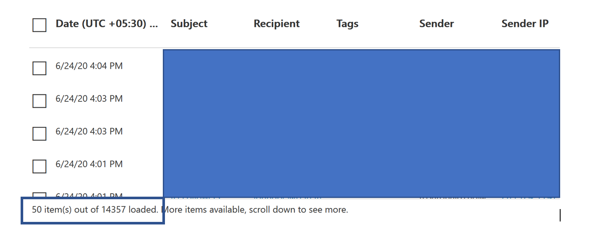

# Threat Explorer und EchtzeiterkennungThreat Explorer and real-time detections

Wenn Ihre Organisation [Office 365 Advanced Threat Protection](office-365-atp.md) (Office 365 ATP) verfügt und Sie über die [erforderlichen Berechtigungen](#required-licenses-and-permissions)verfügen, haben Sie entweder **Explorer** -oder **Echt Zeit Erkennungen** (früher *Echtzeitberichte* – [Siehe What es New](#new-features-in-threat-explorer-and-real-time-detections)!).If your organization has [Office 365 Advanced Threat Protection](office-365-atp.md) (Office 365 ATP), and you have the [necessary permissions](#required-licenses-and-permissions), you have either **Explorer** or **real-time detections** (formerly *real-time reports* — [see what's new](#new-features-in-threat-explorer-and-real-time-detections)!). Wechseln Sie im Security & Compliance Center zu **Threat Management**, und wählen Sie dann **Explorer** _oder_ **Real-Time Detections**aus.In the Security & Compliance Center, go to **Threat management**, and then choose **Explorer** _or_ **Real-time detections**.

|Mit ATP-Plan 2 sehen Sie Folgendes:With ATP Plan 2, you see:|Mit ATP-Plan 1 sehen Sie Folgendes:With ATP Plan 1, you see:|
|---|---|
|||
|

Mit Explorer (oder Echtzeiterkennung) haben Sie einen leistungsfähigen Bericht, der es Ihrem Sicherheitsteam ermöglicht, Bedrohungen effektiv und effizient zu untersuchen und auf diese zu reagieren.With Explorer (or real-time detections), you have a powerful report that enables your Security Operations team to investigate and respond to threats effectively and efficiently. Der Bericht ähnelt dem folgenden Bild:The report resembles the following image:

Mit diesem Bericht haben Sie folgende Möglichkeiten:With this report, you can:

- [Siehe von Microsoft 365-Sicherheitsfeatures erkannte SchadsoftwareSee malware detected by Microsoft 365 security features](#see-malware-detected-in-email-by-technology)
- [Anzeigen von Daten zu Phishing-URLs und klicken auf UrteilView data about phishing URLs and click verdict](#view-data-about-phishing-urls-and-click-verdict)
- [Starten eines automatisierten unter Such-und Antwort Prozesses aus einer Ansicht im Explorer](#start-automated-investigation-and-response) (nur ATP-Plan 2)[Start an automated investigation and response process from a view in Explorer](#start-automated-investigation-and-response) (ATP Plan 2 only)
- ... [Untersuchung schädlicher e-Mails und vieles mehr](#more-ways-to-use-explorer-or-real-time-detections)!... [Investigate malicious email, and more](#more-ways-to-use-explorer-or-real-time-detections)!

## Verbesserungen an Threat Explorer und Echt Zeit ErkennungenExperience Improvements to Threat Explorer and Real-Time Detections

Im Rahmen der Verbesserung des Jagd Prozesses haben wir einige Updates für den Threat Explorer und Echt Zeit Erkennungen vorgenommen.As part of improving the hunting process, we have made a few updates to Threat Explorer and Real-Time Detections. Dabei handelt es sich um Verbesserungen der Erfahrung, wobei der Schwerpunkt darauf liegt, die Jagd Erfahrung konsistenter zu machen.These are ‘experience’ improvements, with the focus on making the hunting experience more consistent. Diese Änderungen werden im folgenden beschrieben:These changes are outlined below:

- [Verbesserungen der ZeitzoneTimezone improvements](#timezone-improvements)
- [Aktualisieren im AktualisierungsprozessUpdate in the Refresh process](#update-in-the-refresh-process)
- [Zu filtern Hinzuzufügender Diagramm DrilldownChart drilldown to add to filters](#chart-drilldown-to-add-to-filters)
- [In Produkt Informations UpdatesIn product information updates](#in-product-information-updates)

### Verbesserungen der ZeitzoneTimezone improvements

Wir zeigen die Zeitzone für die e-Mail-Einträge innerhalb des Portals sowie für exportierte Daten an.We will show the timezone for the email records within the Portal, as well as for Exported data. Die Zeitzone wird in verschiedenen Bereichen wie dem e-Mail-Raster, dem Detail Flyout, der e-Mail-Zeitachse und ähnlichen e-Mails angezeigt, sodass die Zeitzone für das Resultset für den Benutzer eindeutig ist.The timezone will be visible across experiences like Email Grid, Details Flyout, Email Timeline, and Similar Emails, so that the timezone for the result set is clear to the user.

### Aktualisieren im AktualisierungsprozessUpdate in the Refresh process

Wir haben Feedback rund um Verwirrung mit automatischer Aktualisierung gehört (beispielsweise für Datum, sobald Sie das Datum ändern, die Seite aktualisiert wird) und die manuelle Aktualisierung (für andere Filter).We have heard feedback around confusion with automatic refresh (e.g. for date, as soon as you change the date, the page would refresh) and manual refresh (for other filters). Auf ähnliche Weise führt das Entfernen von Filtern zu automatischer Aktualisierung, was dazu führt, dass beim Ändern der verschiedenen Filter beim Ändern der Abfrage inkonsistente Sucherfahrungen auftreten können.Similarly, removing filters leads to automatic refresh, this causes situations where changing the different filters while modifying the query can cause inconsistent search experiences. Um dies zu beheben, bewegen wir uns zu einem manuellen Filtermechanismus.To solve this, we are moving to a manual filtering mechanism.
Aus Erfahrungsgründen kann der Benutzer den unterschiedlichen Filterbereich (aus Filtersatz und Datum) anwenden und entfernen und die Schaltfläche aktualisieren drücken, um die Ergebnisse zu filtern, sobald Sie mit der Definition der Abfrage fertig sind.From an experience standpoint, the user can apply and remove the different range of filters (from the filter set, and date), and press the refresh button to filter the results once they are done with defining the query. Die Schaltfläche Aktualisieren wurde auch aktualisiert, um Sie deutlich auf dem Bildschirm aufzurufen.The refresh button has also been updated to call it out clearly on the screen. Wir haben auch Tooltips und Produktdokumentationen zu dieser Änderung aktualisiert.We have also updated tooltips and in-product documentation around this change.

### Zu filtern Hinzuzufügender Diagramm DrilldownChart drilldown to add to filters

Nun können Sie auf die Werte der Diagrammlegende klicken, um diesen Wert als Filter hinzuzufügen.You will now be able to click on the chart legend values to add that value as a filter. Beachten Sie, dass Sie weiterhin auf die Schaltfläche Aktualisieren klicken müssen, um die Ergebnisse als Teil der oben beschriebenen Änderung zu filtern.Note that you will still have to click on the refresh button to filter the results as part of the change described above.

### In Produkt Informations UpdatesIn product information updates

Außerdem sollten weitere Details im Produkt angezeigt werden.You should also see additional details within the product. Beispielsweise die Gesamtzahl der Suchergebnisse im Raster (siehe unten) sowie Verbesserungen bei Beschriftungen, Fehlermeldungen und QuickInfos, um weitere Informationen zu filtern, Suchfunktionen und Resultsets zu erhalten.For example, the total number of search results within grid (see below), as well as improvements around labels, error messages and tooltips, to give more information around filters, search experience, and result set.

## Erweiterte Funktionen im Threat-ExplorerExtended capabilities in Threat Explorer

### Am häufigsten verwendete BenutzerTop targeted users

Heute stellen wir die Liste der Top-Zielbenutzer in der Malware-Ansicht für e-Mails (im Abschnitt "Top-Malware Familien") bereit.Today we expose the list of the top targeted users in the Malware View for Emails (within the Top Malware Families section). Wir werden diese Ansicht auch in Phishing und alle e-Mail-Ansichten erweitern, wo Sie die ersten fünf Zielbenutzer zusammen mit der Anzahl der Versuche für jeden Benutzer für die entsprechende Ansicht anzeigen können (beispielsweise für die Phishing-Ansicht können Sie die Anzahl der Phishing-Versuche sehen).We will be extending this view within Phish and All Email views as well, where you will be able to see the top five targeted users along with the number of attempts for each user for the corresponding view (for example, for Phish view you will be able to see the number of Phish attempts).
Außerdem können Sie die Liste der Zielbenutzer bis zu einem Grenzwert von 3000 zusammen mit der Anzahl der Versuche für die Offlineanalyse für jede e-Mail-Ansicht exportieren.You will also be able to export the list of targeted users up to a limit of 3000 along with the number of attempts for offline analysis for each email view. Darüber hinaus wählen Sie Nein aus.In addition to that, selecting No. von versuchen (beispielsweise 13 Versuche unten) würde eine gefilterte Ansicht in Threat Explorer öffnen, sodass Sie weitere Details in e-Mails und Bedrohungen für diesen Benutzer anzeigen können.of attempts (for example, 13 attempts below) would open a filtered view in Threat Explorer, so that you can look at more details across emails and threats for that user. 

### Exchange-TransportregelnExchange transport rules
Im Rahmen der Datenanreicherung sollten Sie auch alle unterschiedlichen Transportregeln anzeigen können, die auf eine Nachricht angewendet wurden.As part of data enrichment, you should also be able to see all the different transport rules which were applied to a message. Diese Informationen werden in der e-Mail-Rasteransicht angezeigt (um dies anzuzeigen, wählen Sie Spaltenoptionen im Raster aus und fügen die Exchange-Transport Regel aus den Spaltenoptionen im Raster hinzu) sowie Details Flyout in der e-Mail.This information will be present within the Email grid view (to view this, select Column options in the grid and add Exchange Transport Rule from the Column options in the grid) as well as Details flyout in the email.
Sie können sowohl die GUID als auch den Namen der Transportregeln sehen, die auf die Nachricht angewendet wurden.You would be able to see both the GUID as well as the name of the transport rules which were applied to the message. Darüber hinaus können Sie Nachrichten mit dem Namen der Transportregel suchen.Additionally, you would be able to search for the messages using the name of the transport rule. Dies wäre eine "Contains"-Suche, was bedeutet, dass Sie auch mithilfe von partiellen Suchvorgängen suchen können.This would be a ‘Contains’ search which means you will be able to search using partial searches as well. 

#### Wichtiger Hinweis:Important Note: 
Die Verfügbarkeit von ETR-Suche und-Namen hängt von der jeweiligen Rolle ab, die Ihnen zugewiesen wurde.ETR search and name availability would depend on the specific role that has been assigned to you. Sie müssen über eine der folgenden Rollen/Berechtigungen verfügen, um die ETR-Namen und-Suche anzeigen zu können.You will need to have one of the following roles/permissions in order to view the ETR names and search.  Wenn Ihnen keine der folgenden Rollen zugewiesen ist, können Sie die Namen der Transportregeln nicht anzeigen und Nachrichten mithilfe der ETR-Namen suchen.If you do not have any of the following roles assigned to you, you will not be able to see the names of the transport rules, and search for the messages using the ETR names. Sie können jedoch die ETR-Label-und GUID-Informationen in den e-Mail-Details anzeigen.However, you will be able to see the ETR label and GUID information within the Email Details. Ihre anderen Erfahrungen rund um das Anzeigen von Datensätzen in e-Mail-Rastern, e-Mail-Flyouts, Filtern und Export werden nicht beeinträchtigt.Your other experiences around viewing records in Email Grids, Email flyouts, Filters, and Export are not impacted. 
 
- Nur Exo – Verhinderung von Datenverlust: allEXO Only - Data Loss Prevention: All
- Nur Exo-O365SupportViewConfig: allEXO Only - O365SupportViewConfig: All
- Aad oder Exo-Security Admin: allAAD or EXO - Security Admin: All
- Aad oder Exo-Security Reader: allAAD or EXO - Security Reader: All
- Nur Exo-Transport Regeln: allEXO Only - Transport Rules: All
- Nur Exo-Ansicht-Konfiguration: alleEXO Only - View-Only Configuration: All

Im e-Mail-Raster, im Detail-Flyout und in der exportierten CSV-Datei werden die ETRs mit einem Namen/einer GUID angezeigt, wie unten dargestellt.Within the email grid, Details flyout, and Exported CSV, the ETRs are presented with a Name/GUID as shown below. 

### Eingehende ConnectorsInbound connectors 

Connectors sind eine Sammlung von Anweisungen, mit denen die Art und Weise angepasst werden, in der Ihre e-Mail-nach Richt-oder Office 365 Organisation mit der Möglichkeit zum Anwenden von Sicherheitseinschränkungen oder-Steuerelementen in und aus Ihrer Microsoft 365-oderConnectors are a collection of instructions that customize the way your email flows to and from your Microsoft 365 or Office 365 organization, with the ability to apply any security restriction or controls. Im Threat Explorer haben Sie nun die Möglichkeit, die Connectors anzuzeigen, die sich auf eine e-Mail beziehen, sowie die Suche nach e-Mails unter Verwendung der Konnektornamen.Within Threat Explorer, you will now have the ability to view the connectors which are related to an email as well as search for emails using the connector names. Die Suche nach Konnektoren ist in der Natur "Contains", was bedeutet, dass partielle Stichwortsuche auch funktionieren sollte.The search for connectors is ‘Contains’ in nature which means partial keyword searches should work as well. In der Hauptraster Ansicht, im Detail Flyout und in der exportierten CSV werden die Konnektoren im Format Name/GUID wie unten gezeigt angezeigt:Within the Main grid view, the Details flyout, and the Exported CSV, the connectors are shown in the Name/GUID format as shown below: 

## Neue Features in Threat Explorer und Echt Zeit ErkennungenNew features in Threat Explorer and real-time detections

Drei neue Features in Threat Explorer und Echt Zeit Erkennungen hinzugefügt:Three new features added into Threat Explorer and real-time detections:

- [E-Mail-Kopfzeile anzeigen und e-Mail-Textkörper downloadenPreview email header and download email body](#preview-email-header-and-download-email-body)
- [E-Mail-ZeitachseEmail timeline](#email-timeline)
- [Export-URL klicken Sie auf DatenExport URL click data](#export-url-click-data)

Diese neuen Features werden unten erläutert.These new features are outlined below.

### E-Mail-Kopfzeile anzeigen und e-Mail-Textkörper downloadenPreview email header and download email body

Die Möglichkeit zum Anzeigen einer e-Mail-Kopfzeile und zum Herunterladen des e-Mail-Texts sind neue Features, die in Threat Explorer verfügbar sind.The ability to preview an email header and download the email body are new features available in Threat Explorer. Administratoren können heruntergeladene Kopfzeilen/e-Mail-Nachrichten auf Bedrohungen analysieren.Admins will be able to analyze downloaded headers/email messages for threats. Da das Herunterladen von e-Mail-Nachrichten die Exposition von Informationen gefährden kann, wird dieser Prozess durch rollenbasierte Zugriffssteuerung (RBAC) gesteuert.Because downloading email messages can risk the exposure of information, this process is controlled by roles-based access control (RBAC). Eine neue Rolle, *Vorschau*, muss einer anderen Rollengruppe hinzugefügt werden (beispielsweise Sicherheitsvorgänge oder Sicherheits Administrator), um die Möglichkeit zum Herunterladen von e-Mails und der Vorschau von Kopfzeilen in der Ansicht "All-e-Mail-Nachrichten" zu gewähren.A new role, *Preview*, must be added to another role group (such as Security Operations or Security Administrator) to grant the ability to download mails and preview headers in all-email messages view.

Durch Explorer (und Echtzeiterkennung) werden jedoch auch neue Felder hinzugefügt, mit denen Sie ein vollständigeres Bild davon erhalten, wo Ihre e-Mail-Nachrichten landen.But Explorer (and real-time detections) also adds fresh new fields designed to give you a more complete picture of where your email messages land. Ein Teil des Ziels dieser Änderung besteht darin, die Suche für Sicherheitsmitarbeiter einfacher zu machen, aber das Ergebnis ist, dass der Speicherort der Problem-e-Mail-Nachrichten auf einen Blick zu erkennen ist.Part of the goal of this change is to make hunting easier for Security Ops people, but the net result is knowing the location of problem email messages at a glance.

Wie wird das gemacht?How is this done? Der Zustellungs Status wird nun in zwei Spalten aufgeteilt:Delivery Status is now broken out into two columns:

- **Zustellungs Aktion** – wie lautet der Status dieser e-Mail?**Delivery Action** - What is the status of this email?
- **Zustellungs Speicherort** – wohin wurde diese e-Mail weitergeleitet?**Delivery Location** - Where was this email routed as a result?

Zustellungs Aktion ist die Aktion, die aufgrund vorhandener Richtlinien oder Erkennungen auf eine e-Mail angewendet wird.Delivery Action is the action taken on an email due to existing policies or detections. Hier sind die möglichen Aktionen, die eine e-Mail ausführen kann:Here are the possible actions an email can take:

|GeliefertDelivered|AusrangiertenJunked|GesperrtBlocked|ErsetztReplaced|
|---|---|---|---|
|E-Mail wurde im Posteingang oder Ordner eines Benutzers zugestellt, und der Benutzer kann direkt darauf zugreifen.Email was delivered to Inbox or folder of a user and the user can directly access it.|E-Mails wurden entweder an den Junk-Ordner des Benutzers oder den Ordner "gelöscht" gesendet, und der Benutzer hat Zugriff auf e-Mails in diesen Ordnern.Email was sent to either user’s Junk folder or Deleted folder, and the user has access to emails in those folders.|Alle e-Mails, die unter Quarantäne gestellt wurden, die nicht erfolgreich waren oder gelöscht wurden.Any emails that are quarantined, that  failed, or were dropped. Auf diesen Zugriff kann der Benutzer vollständig zugreifen!This is completely inaccessible by the user!|Jede e-Mail-Nachricht, bei der böswillige Anlagen durch txt-Dateien ersetzt werden, die den Status der Anlage aufweisen, war bösartig.Any email where malicious attachments are replaced by .txt files that state the attachment was malicious.|

|GeliefertDelivered|AusrangiertenJunked|GesperrtBlocked|ErsetztReplaced|
|---|---|---|---|
|E-Mail wurde an den Posteingang des Benutzers oder einen anderen Ordner zugestellt, und der Benutzer kann direkt darauf zugreifen.Email was delivered to the user's inbox or another folder, and the user can directly access it.|E-Mails wurden entweder an den Junk-Ordner des Benutzers oder den Ordner "gelöscht" gesendet, und der Benutzer hat Zugriff auf e-Mail-Nachrichten in diesen Ordnern.Email was sent to either user's Junk folder or Deleted folder, and the user has access to email messages in those folders.|Alle e-Mail-Nachrichten, die isoliert, fehlerhaft oder gelöscht wurden und auf die der Benutzer nicht zugreifen kann.Any email messages that are quarantined, that failed, or were dropped, and are not accessible by the user.|Alle e-Mail-Nachrichten, bei denen böswillige Anlagen durch txt-Dateien ersetzt wurden, in denen die Anlagen als schädlich eintraten.Any email messages where malicious attachments were replaced by .txt files that state the attachments were malicious.|
|

Und hier ist, was der Benutzer sehen kann und was er nicht kann:And here is what the user can see, and what they can't:

|Für Endbenutzer zugänglichAccessible to end users|Für Endbenutzer unzugänglichInaccessible to end users|
|---|---|
|GeliefertDelivered|GesperrtBlocked|
|AusrangiertenJunked|ErsetztReplaced|

Der Übermittlungsort zeigt die Ergebnisse von Richtlinien und Erkennungen an, die nach der Zustellung ausgeführt werden.Delivery location shows the results of policies and detections that run post-delivery. Sie ist mit einer Zustellungs Aktion verknüpft.It's linked to a Delivery Action. Dieses Feld wurde hinzugefügt, um Einblicke in die Aktion zu geben, die ausgeführt wird, wenn ein Problem mit e-Mails gefunden wird.This field was added to give insight into the action taken when a problem mail is found. Im folgenden sind die möglichen Werte für den Zustellungs Speicherort zu finden:Here are the possible values of delivery location:

- **Posteingang oder Ordner**: die e-Mail befindet sich im Posteingang oder in einem Ordner (entsprechend Ihren e-Mail-Regeln).**Inbox or folder**: The email is in inbox or a folder (according to your email rules).
- **On-Prem oder extern**: das Postfach ist nicht in der Cloud vorhanden, sondern lokal.**On-prem or external**: The mailbox doesn't exist on cloud but is on-premises.
- **Junk-Ordner**: die e-Mail befindet sich im Ordner Junk eines Benutzers.**Junk folder**: The email is in the Junk folder of a user.
- **Ordner "Gelöschte Elemente"**: die e-Mail im Ordner "Gelöschte Elemente" eines Benutzers.**Deleted items folder**: The email in the Deleted items folder of a user.
- **Quarantine**: die e-Mail-Nachricht in Quarantäne und befindet sich nicht im Postfach eines Benutzers.**Quarantine**: The email in quarantine, and is not in a user's mailbox.
- **Fehler**: die e-Mail konnte das Postfach nicht erreichen.**Failed**: The email failed to reach the mailbox.
- **Abgelegt**: die e-Mail wird irgendwo im Nachrichtenfluss verloren.**Dropped**: The email gets lost somewhere in the mail flow.

### E-Mail-ZeitachseEmail timeline

Die **e-Mail-Zeitachse** ist eine weitere neue Explorer-Funktion, mit der die Jagd Erfahrung für Administratoren verbessert werden soll.The **Email Timeline** is another new Explorer feature aimed at making the hunting experience better for admins. Es reduziert die Zufallsgenerierung, da die Überprüfung verschiedener Standorte kürzer ist, um zu versuchen, das Ereignis zu verstehen.It cuts down on randomization because there is less time spent checking different locations to try to understand the event. Wenn mehrere Ereignisse bei oder nahe gleichzeitig in einer e-Mail auftreten, werden diese Ereignisse in einer Zeitachsenansicht angezeigt.When multiple events happen at, or close to, the same time on an email, those events will show up in a timeline view. In der Tat werden einige Ereignisse, die nach der Zustellung an Ihre e-Mails geschehen, in der Spalte "spezielle Aktion" erfasst.In fact, some events that happen post-delivery to your mail will be captured in the 'Special action' column. Durch die Kombination der Informationen aus der Zeitachse dieser e-Mail mit der speziellen Aktion, die Sie für die e-Mail-Zustellung durchführen, erhalten Administratoren einen Einblick in die Funktionsweise Ihrer Richtlinien, wo die e-Mails schließlich weitergeleitet wurden, und in einigen Fällen was die abschließende Bewertung war.Combining the information from the timeline of that mail with the special action taken on the mail post-delivery will give admins insight into how their policies work, where the mail was finally routed, and, in some cases, what the final assessment was.

Weitere Informationen zur Untersuchung schädlicher e-Mail-Nachrichten finden Sie unter [untersuchen und Beheben von böswilligen e-Mails, die in Office 365 bereitgestellt wurden](investigate-malicious-email-that-was-delivered.md).For more discussion about investigating malicious email messages, see [Investigate and remediate malicious email that was delivered in Office 365](investigate-malicious-email-that-was-delivered.md).

### Export-URL klicken Sie auf DatenExport URL click data

Außerdem können Sie nun Berichte für URL-Klicks in Microsoft Excel exportieren, um sowohl die Netzwerknachrichten-ID als auch das Klick Urteil anzuzeigen, um zu verstehen, wo Ihre URL auf den Datenverkehr fällt.Also, you will now be able to export reports for URL clicks to Microsoft Excel in order to view both their Network Message ID, and their Click Verdict, making the task of understanding where your URL click traffic originated easier. So funktioniert es.Here's how it works. Klicken Sie auf der Office 365-Schnellstartleiste in Threat Management auf diese Kette:Starting in Threat Management on the Office 365 quick-launch, click through this chain:

**Explorer** \> **Phishing anzeigen** \> **Klicks** \> Top- **URLs oder URL-Top-Klicks** \> **Klicken Sie auf einen beliebigen Datensatz, um das URL-Flyout zu öffnen****Explorer** \> **View Phish** \> **Clicks** \> **Top URLs or URL Top Clicks** \> **Click on any record to open URL flyout**

Wenn Sie auf eine URL in der Liste klicken, wird im Ausklappbereich eine neue Schaltfläche Exportieren angezeigt.When you click on a URL in the list, you'll see a new Export button on the fly-out panel. Verwenden Sie diese Schaltfläche, um Daten zur einfacheren Berichterstellung in eine Excel-Tabelle zu migrieren.Use this button to move data to an Excel spreadsheet for easier reporting.

Sie können den gleichen Speicherort im Bericht über Echt Zeit Erkennungen wie folgt abrufen:You can get to the same location in the real-time detections report as follows:

**Explorer** \> **Echt Zeit Erkennungen** \> **Phishing anzeigen** \> **URLs** \> **Top-URLs oder Top-Klicks** \> **Klicken Sie auf einen beliebigen Datensatz, um das URL-Flyout** \> zu öffnen **Navigieren Sie zur Registerkarte Klicks.****Explorer** \> **Real-time Detections** \> **View Phish** \> **URLs** \> **Top URLs or Top Clicks** \> **Click on any record to open URL flyout** \> **Navigate to the Clicks Tab.**

> [!TIP]
> Network Message ID ordnet den Klick zurück zu bestimmten Mails zu, wenn Sie über den Explorer oder zugeordnete Tools von Drittanbietern über die Netzwerknachrichten-ID suchen.Network Message ID maps the click back to specific mails when you search through Explorer or associated 3rd party tools via Network Message ID. Durch die Suche über die Netzwerknachrichten-ID erhalten Administratoren die spezifische e-Mail-Adresse, die mit einem Klick Ergebnis verknüpft ist.Searching through the Network Message ID will give admins the specific email associated with a click result. Für eine schnellere und leistungsstärkere Analyse durch den Export mit wird die korrelierte Identifikation der Netzwerknachrichten-ID ermöglicht.On export having, the correlating identification of Network Message ID makes for quicker and more powerful analysis.

## Siehe in e-Mail erkannte Malware nach TechnologieSee malware detected in email by technology

Angenommen, Sie möchten die von Microsoft 365-Technologie erkannte Schadsoftware in e-Mails sehen.Suppose you want to see malware detected in email, by Microsoft 365 technology. Verwenden Sie dazu die [e-Mail->](threat-explorer-views.md#email--malware) Ansicht "Malware" des Explorers (oder Echtzeiterkennung).To do this, use the [Email > Malware](threat-explorer-views.md#email--malware) view of Explorer (or real-time detections).

1. Wählen Sie im Security & Compliance Center ( [https://protection.office.com](https://protection.office.com) ) **Threat Management**  >  **Explorer** (oder **Echtzeiterkennung**) aus.In the Security & Compliance Center ([https://protection.office.com](https://protection.office.com)), choose **Threat management** > **Explorer** (or **Real-time detections**). (In diesem Beispiel wird der Explorer verwendet.)(This example uses Explorer.)

2. Wählen Sie im Menü **Ansicht** die Option **e-Mail-**  >  **Schadsoftware**aus.In the **View** menu, choose **Email** > **Malware**.

   

3. Klicken Sie auf **Absender**, und wählen Sie dann **Basis**  >  **Erkennungstechnologie**aus.Click **Sender**, and then choose **Basic** > **Detection technology**.

   Ihre Erkennungstechnologien stehen nun als Filter für den Bericht zur Verfügung.Your detection technologies are now available as filters for the report.

   

4. Wählen Sie eine Option aus, und klicken Sie dann auf die Schaltfläche **Aktualisieren** , um diesen Filter anzuwenden.Select an option, and then click the **Refresh** button to apply that filter.

   

Der Bericht wird aktualisiert, um die in e-Mail-Nachweise erkannten Ergebnisse mithilfe der ausgewählten Technologie-Option anzuzeigen.The report refreshes to show the results malware detected in email, using the technology option you selected. Von hier aus können Sie weitere Analysen durchführen.From here, you can conduct further analysis.

## Anzeigen von Daten zu Phishing-URLs und klicken auf UrteilView data about phishing URLs and click verdict

Angenommen, Sie möchten Phishing-Versuche über URLs in e-Mails sehen, einschließlich einer Liste von URLs, die zugelassen, blockiert und außer Kraft gesetzt wurden.Suppose that you want to see phishing attempts through URLs in email, including a list of URLs that were allowed, blocked, and overridden. Zum Identifizieren von URLs, auf die geklickt wurde, müssen [ATP-sichere Links](atp-safe-links.md) konfiguriert werden.Identifying URLs that were clicked requires [ATP Safe links](atp-safe-links.md) to be configured. Stellen Sie sicher, dass Sie [Richtlinien für ATP-sichere Links](set-up-atp-safe-links-policies.md) zum Zeitpunkt des Klick Schutzes und zur Protokollierung von Klick urteilen durch ATP-sichere Links eingerichtet haben.Make sure that you have set up [ATP Safe Links policies](set-up-atp-safe-links-policies.md) for time-of-click protection and logging of click verdicts by ATP Safe Links.

Um Phishing-URLs in Nachrichten und Klicks auf URLs in Phishing-Nachrichten zu überprüfen, verwenden Sie die [e-Mail-> Phishing-](threat-explorer-views.md#email--phish) Ansicht des Explorers (oder Echtzeiterkennung).To review phish URLs in messages and clicks on URLs in phish messages, use the [Email > Phish](threat-explorer-views.md#email--phish) view of Explorer (or real-time detections).

1. Wählen Sie im Security & Compliance Center ( [https://protection.office.com](https://protection.office.com) ) **Threat Management**  >  **Explorer** (oder **Echtzeiterkennung**) aus.In the Security & Compliance Center ([https://protection.office.com](https://protection.office.com)), choose **Threat management** > **Explorer** (or **Real-time detections**). (In diesem Beispiel wird der Explorer verwendet.)(This example uses Explorer.)

2. Wählen Sie im Menü **Ansicht** die Option Phishing **per e-Mail**aus  >  **Phish**.In the **View** menu, choose **Email** > **Phish**.

   

3. Klicken Sie auf **Absender**, und wählen Sie dann **URLs**  >  **Klicken Sie auf Urteil**.Click **Sender**, and then choose **URLs** > **Click verdict**.

4. Wählen Sie eine oder mehrere Optionen aus, beispielsweise " **blockiert** " und "über **schrieben**", und klicken Sie dann auf die Schaltfläche **Aktualisieren** , die sich in derselben Reihe befindet wie die Optionen zum Anwenden des Filters.Select one or more options, such as **Blocked** and **Block overridden**, and then click the **Refresh** button that is on the same line as the options to apply that filter. (Aktualisieren Sie Ihr Browserfenster nicht.)(Don't refresh your browser window.)

   

    Der Bericht wird aktualisiert, um zwei unterschiedliche URL-Tabellen auf der Registerkarte URL unter dem Bericht anzuzeigen:The report refreshes to show two different URL tables on the URL tab under the report:

   - **Top-URLs** sind die URLs, die in den Nachrichten enthalten sind, nach denen Sie nach unten gefiltert haben, und die e-Mail-Zustellungs Aktion zählt für jede URL.**Top URLs** are the URLs contained in the messages you have filtered down to, and the email delivery action counts for each URL. In der Phishing-e-Mail-Ansicht enthält diese Liste normalerweise legitime URLs.In the phish email view, this list typically will contain legitimate URLs. Angreifer enthalten eine Mischung aus guten und ungültigen URLs in ihren Nachrichten, um Sie zu übermitteln, aber Sie machen die bösartigen Links für den Benutzer interessanter, auf Sie zuwerden.Attackers include a mix of good and bad URLs in their messages to try to get them delivered, but they will make the malicious links more interesting for the user to click. Die Tabelle der URLs wird nach der Gesamtzahl der e-Mails sortiert (Beachten Sie jedoch, dass diese Spalte ausgeblendet ist, um die Ansicht zu vereinfachen).The table of URLs is sorted by total email count (but note that this column is hidden to simplify the view).

   - Zu den **wichtigsten Klicks** gehören die eingebundenen URLs, auf die geklickt wurde, sortiert nach der Gesamtanzahl der Klick Zähler (diese Spalte wird auch nicht angezeigt, um die Ansicht zu vereinfachen).**Top clicks** are the Safe Links wrapped URLs that were clicked, sorted by total click count (this column is also not shown to simplify the view). Gesamtanzahl Zählungen nach Spalte geben Sie die sichere Links klicken Sie auf Urteils Zählung für jede URL, auf die geklickt wurde.Total counts by column indicate the Safe Links click verdict count for each clicked URL. In der Phishing-e-Mail-Ansicht sind dies häufiger verdächtige oder böswillige URLs, aber Sie können URLs enthalten, die keine Bedrohungen, sondern Phishing-Nachrichten darstellen.In the phish email view, these are more often suspicious or malicious URLs, but could include URLs that are not threats but are in phish messages. URL Klicks auf unverpackte Links werden hier nicht angezeigt.URL clicks on unwrapped links will not show up here.

   Die zwei URL-Tabellen zeigen die wichtigsten URLs in Phishing-e-Mails nach Zustellungs Aktion und Speicherort an, und Sie zeigen URL-Klicks an, die blockiert wurden (oder trotz einer Warnung besucht wurden), sodass Sie verstehen, welche möglichen fehlerhaften Links von Benutzern empfangen und mit den Benutzern in Interaktion stehen.The two URL tables show top URLs in phishing email messages by delivery action and location, and they show URL clicks that were blocked (or visited despite a warning) so that you can understand what potential bad links were received by users and interacted with by users. Von hier aus können Sie weitere Analysen durchführen.From here, you can conduct further analysis. Beispielsweise können Sie unter dem Diagramm die häufigsten URLs in e-Mail-Nachrichten sehen, die in der Umgebung Ihrer Organisation blockiert wurden.For example, below the chart, you can see the top URLs in email messages that were blocked in your organization's environment.

   

   Wählen Sie eine URL aus, um ausführlichere Informationen anzuzeigen.Select a URL to view more detailed information.

   > [!NOTE]
   > Im Dialogfeld URL-Flyout wird die Filterung für e-Mail-Nachrichten entfernt, um Ihnen die vollständige Ansicht der URL-Exposition in Ihrer Umgebung anzuzeigen.In the URL flyout dialog, the filtering on email messages is removed to show you the full view of the URL's exposure in your environment. Auf diese Weise können Sie nach e-Mail-Nachrichten im Explorer nach bestimmten URLs suchen, die potenzielle Bedrohungen darstellen, und dann Ihr Verständnis der URL-Exposition in Ihrer Umgebung (über das Dialogfeld URL-Details) erweitern, ohne der Explorer-Ansicht selbst URL-Filter hinzufügen zu müssen.This lets you filter down email messages in Explorer to ones you are concerned about, find specific URLs that are potential threats, then expand your understanding of the URL exposure in your environment (via the URL details dialog) without having to add URL filters to the Explorer view itself.

**Interpretation verschiedener Klick Urteile****Interpretation of different click verdicts**

Innerhalb der e-Mail-oder URL-Flyouts, der wichtigsten Klicks sowie in unseren Filter-Erlebnissen werden Ihnen unterschiedliche Klick-Werte als Teil Ihres Jagd Erlebnisses angezeigt.Within the Email or URL flyouts, Top Clicks as well as within our filtering experiences, you will see different click values as part of your hunting experience. Im folgenden sind die möglichen Werte von Klick Urteilen und deren Interpretation aufgeführt:Below are the possible values of Click Verdicts and their interpretation:

- **None**: das Urteil für die URL konnte nicht erfasst werden.**None**: We were unable to capture the verdict for the URL. Der Benutzer hat möglicherweise auf die URL geklickt.The user might have clicked through the URL.
- **Zulässig**: der Benutzer durfte zur URL navigieren.**Allowed**: The user was allowed to navigate to the URL.
- **Blockiert**: der Benutzer wurde für die Navigation zur URL gesperrt.**Blocked**: The User was blocked from navigating to the URL.
- **Ausstehender Urteilsspruch**: der Benutzer wurde mit der ausstehenden detonations Seite angezeigt.**Pending verdict**: The user was presented with the detonation pending page.
- **Blockiert außer Kraft gesetzt**: der Benutzer wurde für die Navigation zur URL gesperrt. der Benutzer hat den Block jedoch übersteuert, um zur URL zu navigieren.**Blocked overridden**: The user was blocked from navigating to the URL; however, the user overrode the block to navigate to the URL.
- **Ausstehender Urteilsspruch umgangen**: der Benutzer wurde mit der detonations Seite angezeigt; der Benutzer hat die Seite jedoch übersteuert, um zur URL zu navigieren.**Pending verdict bypassed**: The user was presented with the detonation page; however, the user overrode the page to navigate to the URL.
- **Fehler**: der Benutzer wurde mit der Fehlerseite angezeigt.**Error**: The user was presented with the error page. Dies kann auch bedeuten, dass beim Erfassen des Urteils ein Fehler aufgetreten ist.This can also mean there was an error in capturing the verdict.
- **Fehler**: beim Erfassen des Urteils ist eine unbekannte Ausnahme aufgetreten.**Failure**: There was unknown exception while capturing the verdict. Der Benutzer hat möglicherweise auf die URL geklickt.The user might have clicked through the URL. 

## Überprüfen von von Benutzern gemeldeten e-Mail-NachrichtenReview email messages reported by users

Angenommen, Sie möchten e-Mail-Nachrichten anzeigen, die Benutzer in Ihrer Organisation als Junk-, kein Junk-oder als Phishing gemeldet haben, indem Sie das [Berichtsnachrichten-Add-in für Outlook und Outlook im Internet](enable-the-report-message-add-in.md)verwenden.Suppose that you want to see email messages that users in your organization have reported as Junk, Not Junk, or Phishing by using the [Report Message add-in for Outlook and Outlook on the web](enable-the-report-message-add-in.md). Verwenden Sie dazu die Ansicht [e-Mail > Übermittlungen](threat-explorer-views.md#email--submissions) des Explorers (oder Echtzeiterkennung).To do this, use the [Email > Submissions](threat-explorer-views.md#email--submissions) view of Explorer (or real-time detections).

1. Wählen Sie im Security & Compliance Center ( [https://protection.office.com](https://protection.office.com) ) **Threat Management**  >  **Explorer** (oder **Echtzeiterkennung**) aus.In the Security & Compliance Center ([https://protection.office.com](https://protection.office.com)), choose **Threat management** > **Explorer** (or **Real-time detections**). (In diesem Beispiel wird der Explorer verwendet.)(This example uses Explorer.)

2. Wählen Sie im Menü **Ansicht** die Option **e-Mail-** über  >  **mittlungen**aus.In the **View** menu, choose **Email** > **Submissions**.

   

3. Klicken Sie auf **Absender**, und wählen Sie **Standard**  >  **Berichtstyp**aus.Click **Sender**, and then choose **Basic** > **Report type**.

4. Wählen Sie eine Option wie **Phishing**aus, und klicken Sie dann auf die Schaltfläche **Aktualisieren** .Select an option, such as **Phish**, and then click the **Refresh** button.

   

Der Bericht wird aktualisiert, um Daten über e-Mail-Nachrichten anzuzeigen, die Personen in Ihrer Organisation als Phishing-Versuch gemeldet haben.The report refreshes to show data about email messages that people in your organization have reported as a phishing attempt. Sie können diese Informationen verwenden, um weitere Analysen durchzuführen und bei Bedarf Ihre [ATP-Anti-Phishing-Richtlinien](configure-atp-anti-phishing-policies.md)anzupassen.You can use this information to conduct further analysis, and if necessary, adjust your [ATP anti-phishing policies](configure-atp-anti-phishing-policies.md).

## Starten der automatischen Untersuchung und AntwortStart automated investigation and response

> [!NOTE]
> In **Office 365 ATP-Plan 2** und **Office 365 E5**stehen automatisierte Ermittlungs-und Antwortfunktionen zur Verfügung.Automated investigation and response capabilities are available in **Office 365 ATP Plan 2** and **Office 365 E5**.

(Neu!) Durch [Automatische Untersuchung und Antwort](automated-investigation-response-office.md) können Sie Ihr Sicherheits Betriebsteam viel Zeit und Mühe beim untersuchen und verringern von Cyberangriffe speichern.(NEW!) [Automated investigation and response](automated-investigation-response-office.md) can save your security operations team much time and effort in investigating and mitigating cyberattacks. Zusätzlich zum Konfigurieren von Warnungen, die ein Sicherheits Textbuch auslösen können, können Sie einen automatisierten Ermittlungs-und Antwortprozess aus einer Ansicht im Explorer starten.In addition to configuring alerts that can trigger a security playbook, you can start an automated investigation and response process from a view in Explorer.

Ausführliche Informationen hierzu finden Sie unter [Beispiel: ein Sicherheitsadministrator löst eine Untersuchung im Explorer aus](automated-investigation-response-office.md#example-a-security-administrator-triggers-an-investigation-from-threat-explorer).For details on this, see [Example: A security administrator triggers an investigation from Explorer](automated-investigation-response-office.md#example-a-security-administrator-triggers-an-investigation-from-threat-explorer).

## Weitere Möglichkeiten zum Verwenden von Explorer (oder Echtzeiterkennung)More ways to use Explorer (or real-time detections)

Zusätzlich zu den in diesem Artikel beschriebenen Szenarien stehen Ihnen viele weitere Berichtsoptionen mit Explorer (oder Echtzeiterkennung) zur Verfügung.In addition to the scenarios outlined in this article, you have many more reporting options available with Explorer (or real-time detections).

- [Suchen und Untersuchen von bösartigen E-Mails, die zugestellt wurdenFind and investigate malicious email that was delivered](investigate-malicious-email-that-was-delivered.md)
- [Anzeigen schädlicher Dateien, die in SharePoint Online, OneDrive und Microsoft Teams erkannt wurdenView malicious files detected in SharePoint Online, OneDrive, and Microsoft Teams](malicious-files-detected-in-spo-odb-or-teams.md)
- [Erhalten einer Übersicht über die Ansichten in Threat Explorer (und Echtzeiterkennung)Get an overview of the views in Threat Explorer (and real-time detections)](threat-explorer-views.md)
- [Automatische Untersuchung und Reaktion in Microsoft Threat ProtectionAutomated investigation and response in Microsoft Threat Protection](https://docs.microsoft.com/microsoft-365/security/mtp/mtp-autoir)

## Erforderliche Lizenzen und BerechtigungenRequired licenses and permissions

Sie benötigen [Office 365 ATP](office-365-atp.md) , um den Explorer oder Echt Zeit Erkennungen zu erhalten.You must have [Office 365 ATP](office-365-atp.md) to get Explorer or real-time detections.

- Der Explorer ist in Office 365 ATP-Plan 2 enthalten.Explorer is included in Office 365 ATP Plan 2.
- Der Bericht über Echt Zeit Erkennungen ist in Office 365 ATP-Plan 1 enthalten.The real-time detections report is included in Office 365 ATP Plan 1.
- Planen Sie die Zuweisung von Lizenzen für alle Benutzer, die durch Office 365 ATP geschützt werden sollen.Plan to assign licenses for all users who should be protected by Office 365 ATP. (Explorer-oder Echt Zeit Erkennungen zeigen Erkennungsdaten für lizenzierte Benutzer.)(Explorer or real-time detections shows detection data for licensed users.)

Zum Anzeigen und Verwenden von Explorer-oder Echt Zeit Erkennungen müssen Sie über die entsprechenden Berechtigungen verfügen, beispielsweise solche, die einem Sicherheitsadministrator oder Sicherheits Leser erteilt werden.To view and use Explorer or real-time detections, you must have appropriate permissions, such as those granted to a security administrator or security reader.

- Für das Security &amp; Compliance Center müssen Sie eine der folgenden Rollen zugewiesen haben:For the Security &amp; Compliance Center, you must have one of the following roles assigned:

  - OrganisationsverwaltungOrganization Management
  - Sicherheits Administrator (Dies kann im Azure Active Directory Admin Center zugewiesen werden ( [https://aad.portal.azure.com](https://aad.portal.azure.com) ))Security Administrator (this can be assigned in the Azure Active Directory admin center ([https://aad.portal.azure.com](https://aad.portal.azure.com)))
  - SicherheitsleseberechtigterSecurity Reader

- Für Exchange Online müssen Sie eine der folgenden Rollen entweder in der Exchange-Verwaltungskonsole ( [https://outlook.office365.com/ecp](https://outlook.office365.com/ecp) ) oder mit PowerShell-Cmdlets zugewiesen haben (siehe [Exchange Online PowerShell](https://docs.microsoft.com/powershell/exchange/exchange-online-powershell)):For Exchange Online, you must have one of the following roles assigned in either the Exchange admin center ([https://outlook.office365.com/ecp](https://outlook.office365.com/ecp)) or with PowerShell cmdlets (See [Exchange Online PowerShell](https://docs.microsoft.com/powershell/exchange/exchange-online-powershell)):

  - OrganisationsverwaltungOrganization Management
  - Organisationsverwaltung mit LeserechtenView-only Organization Management
  - Rolle „Empfänger mit Leserechten“View-Only Recipients role
  - ComplianceverwaltungCompliance Management

Weitere Informationen zu Rollen und Berechtigungen finden Sie in den folgenden Ressourcen:To learn more about roles and permissions, see the following resources:

- [Berechtigungen im Security &amp; Compliance CenterPermissions in the Security &amp; Compliance Center](permissions-in-the-security-and-compliance-center.md)
- [Featureberechtigungen in Exchange OnlineFeature permissions in Exchange Online](https://docs.microsoft.com/exchange/permissions-exo/feature-permissions)

## Einige Unterschiede zwischen dem Bedrohungs-Explorer und Echt Zeit ErkennungenSome differences between Threat Explorer and real-time detections

- Der Bericht über **Echt Zeit Erkennungen** steht in Office 365 ATP-Plan 1 zur Verfügung, während **Threat Explorer** in Office 365 ATP-Plan 2 zur Verfügung steht.The **real-time detections** report is available in Office 365 ATP Plan 1, whereas **Threat Explorer** is available in Office 365 ATP Plan 2.
- Der Bericht über **Echt Zeit Erkennungen** ermöglicht das Anzeigen von Erkennungen in Echtzeit.The **real-time detections** report allows you to view detections in real-time. Dieser Vorgang wird auch von **Threat Explorer** durchgesetzt, aber Sie können auch zusätzliche Details für einen bestimmten Angriff anzeigen.**Threat Explorer** does this as well, but also allows you to view additional details for a given attack.
- Eine **alle e-Mail-** Ansicht ist in **Threat Explorer** verfügbar (und befindet sich nicht im Bericht über **Echt Zeit Erkennungen** ).An **All email** view is available in **Threat Explorer** (and is not in the **real-time detections** report).
- In **Threat Explorer**sind weitere Filterfunktionen und verfügbare Aktionen enthalten.More filtering capabilities and available actions are included in **Threat Explorer**.

Weitere Informationen finden Sie unter [Office 365 ATP-Dienstbeschreibung: Verfügbarkeit von Features in Advanced Threat Protection (ATP)-Plänen](https://docs.microsoft.com/office365/servicedescriptions/office-365-advanced-threat-protection-service-description#feature-availability-across-advanced-threat-protection-atp-plans).For more details, see [Office 365 ATP Service Description: Feature availability across Advanced Threat Protection (ATP) plans](https://docs.microsoft.com/office365/servicedescriptions/office-365-advanced-threat-protection-service-description#feature-availability-across-advanced-threat-protection-atp-plans).
