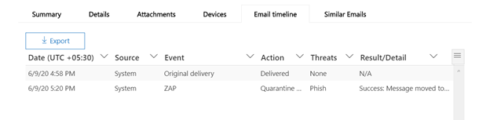
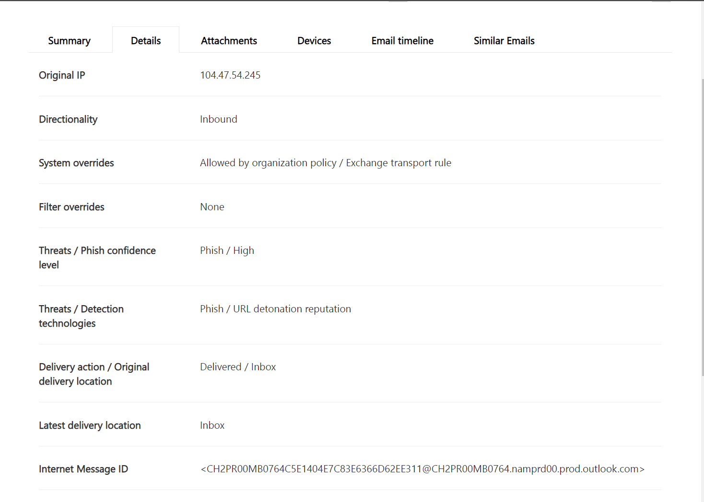

# Threat Explorer und Echtzeiterkennung

Wenn Ihre Organisation [Microsoft Defender für Office 365](office-365-atp.md)hat und Sie über die [erforderlichen Berechtigungen](#required-licenses-and-permissions)verfügen, haben Sie entweder **Explorer** -oder **Echtzeiterkennung** (früher *Echtzeitberichte* – [Siehe What es New](#new-features-in-threat-explorer-and-real-time-detections)!). Wechseln Sie im Security & Compliance Center zu **Threat Management** , und wählen Sie dann **Explorer** _oder_ **Real-Time Detections** aus.

|Mit Microsoft Defender für Office 365 Plan 2 sehen Sie Folgendes:|Mit Microsoft Defender für Office 365 Plan 1 sehen Sie Folgendes:|
|---|---|
|||
|

Mit Explorer (oder Echtzeiterkennung) haben Sie einen leistungsfähigen Bericht, der es Ihrem Sicherheitsteam ermöglicht, Bedrohungen effektiv und effizient zu untersuchen und auf diese zu reagieren. Der Bericht ähnelt dem folgenden Bild:

Mit diesem Bericht haben Sie folgende Möglichkeiten:

- [Siehe von Microsoft 365-Sicherheitsfeatures erkannte Schadsoftware](#see-malware-detected-in-email-by-technology)
- [Anzeigen von Daten zu Phishing-URLs und klicken auf Urteil](#view-data-about-phishing-urls-and-click-verdict)
- [Starten eines automatisierten unter Such-und Antwort Prozesses aus einer Ansicht im Explorer](#start-automated-investigation-and-response) (nur für Office 365 Plan 2)
- ... [Untersuchung schädlicher e-Mails und vieles mehr](#more-ways-to-use-explorer-or-real-time-detections)!

## Verbesserungen an Threat Explorer und Echt Zeit Erkennungen

### Tags im Threat-Explorer

> [!NOTE]
> Das Feature "Benutzer Tags" befindet sich in der Vorschau, steht nicht allen zur Verfügung und kann jederzeit geändert werden. Weitere Informationen zum Veröffentlichungszeitplan finden Sie in der Microsoft 365-Roadmap.

Benutzer Tags sind Bezeichner für bestimmte Benutzergruppen in Microsoft Defender für Office 365. Weitere Informationen rund um Tags, Lizenzierung und Konfigurieren von Tags finden Sie unter [User Tags in Defender for Office 365](user-tags.md).

Im Threat Explorer werden Informationen zu Benutzer Tags in den folgenden Erfahrungen angezeigt:

#### E-Mail-Rasteransicht

Die im e-Mail-Raster angezeigte Tags-Spalte enthält alle Tags, die auf die Absender-oder Empfängerpostfächer angewendet wurden. Standardmäßig werden System Tags wie Priority-Konten zuerst angezeigt.

> [!div class="mx-imgBorder"]
> 

#### Filtern
Wir haben jetzt Tags als Filter, damit Sie nur für Prioritäts Konten oder bestimmte Benutzer Tags Szenarien jagen können (und sogar Ergebnisse mit bestimmten Tags als Teil dieser Erfahrung ausschließen). Wenn Sie diese mit den verschiedenen anderen Filtern kombinieren, die wir bereitstellen, können Sie den Umfang der Untersuchung einschränken.

> [!div class="mx-imgBorder"]
> 

#### E-Mail-Detail Flyout
Um die einzelnen Tags für Absender und Empfänger anzuzeigen, klicken Sie auf den Betreff. Das Flyout Nachrichtendetails wird geöffnet. Auf der Registerkarte Zusammenfassung werden die Absender-und Empfänger Tags separat angezeigt, sofern Sie für eine e-Mail vorhanden sind.
Die Informationen zu einzelnen Tags für Absender und Empfänger erstreckt sich auch auf exportierte CSV-Datei, in der Sie diese Details in 2 separaten Spalten sehen können.

> [!div class="mx-imgBorder"]
> 

Tags-Informationen werden auch im Flyout URL-Klicks angezeigt. Um zu der URL auf Flyout zu gelangen, müssen Sie zu Phishing oder alle e-Mail-Ansicht, und dann auf die Registerkarte URLs oder URL-Klicks wechseln. Wenn Sie auf ein einzelnes URL-Flyout klicken, werden weitere Details zu Klicks für diese URL angezeigt, und dem Klick sind Tags zugeordnet.

> [!div class="mx-imgBorder"]
> 

## Verbesserungen bei der Jagd nach Bedrohungen (bevorstehende)

### Aktualisierte Bedrohungsinformationen für e-Mails

Wir haben uns auf Plattform-und Daten Qualitätsverbesserungen konzentriert, um die Datengenauigkeit und Konsistenz für e-Mail-Datensätze zu verbessern. Diese Reihe von Updates umfasst die Konsolidierung von vorab Bereitstellungs-und Post Zustellungsinformationen (Beispielaktion, die in einer e-Mail als Teil des Zap-Prozesses ausgeführt wird) in einen einzelnen Datensatz zusammen mit hinzugefügtem Umfang wie Spam Urteil, Bedrohungen auf Entitätsebene (beispielsweise, welche URL böswillig war) und den neuesten Zustellungs Standorten.

Nach diesen Updates wird für jede Nachricht ein einzelner Eintrag angezeigt, unabhängig von den unterschiedlichen nach Zustellungs Ereignissen, die in der Nachricht stattfinden. Zu den Aktionen können zap, manuelle Korrektur (also Administratoraktion), dynamische Zustellung usw. gehören.

Neben Malware-und Phishing-Bedrohungen können Sie nun das Spam Urteil sehen, das einer e-Mail zugeordnet ist. In der e-Mail können Sie alle mit der e-Mail verbundenen Bedrohungen zusammen mit den entsprechenden Erkennungstechnologien sehen. Jede e-Mail kann 0, 1 oder mehrere Bedrohungen haben. Im Abschnitt Details des e-Mail-Flyouts werden die aktuellen Bedrohungen angezeigt. Außerdem würde das Erkennungstechnologie Feld für mehrere Bedrohungen (beispielsweise eine e-Mail mit Schadsoftware und Phishing) die Threat-Detection Zuordnung ergeben, was bedeutet, dass die Erkennungstechnologie zur Identifizierung der Bedrohung geführt hat.

Die Reihe von Erkennungstechnologien wurde aktualisiert, um neue Erkennungsmethoden sowie Spamerkennungstechnologien sowie für alle unterschiedlichen e-Mail-Ansichten (Schadsoftware, Phishing, alle e-Mail-Nachrichten) zu verwenden, Sie verfügen über denselben konsistenten Reihe von Erkennungstechnologien, um die Ergebnisse zu filtern.

> [!NOTE]
> Die Urteils Analyse ist möglicherweise nicht unbedingt an Entitäten gebunden. Beispielsweise kann eine e-Mail als Phishing oder Spam klassifiziert werden, aber es gibt keine URLs, auf die ein Phishing/Spam-Urteil abgestempelt wurde. Dies liegt daran, dass unsere Filter auch Inhalte und andere Details für eine e-Mail auswerten, bevor Sie ein Urteil zuweisen.

#### Bedrohungen in URLs

Auf der Registerkarte e-Mail-Flyout-> Details können Sie nun die spezifische Bedrohung für eine URL anzeigen (Bedrohung für eine URL kann Malware, Phishing, Spam oder keine sein).

> [!div class="mx-imgBorder"]
> 

### Aktualisierte Zeitachsenansicht (bevorstehende)

> [!div class="mx-imgBorder"]
> 

Zusätzlich zur Identifizierung aller Zustellungs-und Post Zustellungs Ereignisse gibt die Zeitachsenansicht auch Informationen zu der zu diesem Zeitpunkt identifizierten Bedrohung für eine Teilmenge dieser Ereignisse. Außerdem erhalten Sie weitere Informationen zu zusätzlichen Aktionen (beispielsweise zap, manuelle Korrektur) sowie das Ergebnis dieser Aktion. Die Zeitachsenansicht enthält Informationen über die ursprüngliche Zustellung und anschließend alle Ereignisse nach der Zustellung, die für eine e-Mail ausgeführt wurden.

-   Quelle: Dies kann admin/System/User basierend auf der Quelle des Ereignisses sein.
-   Ereignis: Dies umfasst Ereignisse der obersten Ebene wie Original Zustellung, manuelle Korrektur, Zap, Übermittlungen und dynamische Zustellung.
-   Action: Dies umfasst die spezifische Aktion, die entweder im Rahmen von zap-oder admin-Aktionen durchgeführt wurde (beispielsweise Soft Delete).
-   Bedrohungen: deckt die zu diesem Zeitpunkt identifizierten Bedrohungen (Schadsoftware, Phishing, Spam) ab.
-   Ergebnis/Details: enthält weitere Informationen zum Ergebnis der Aktion, unabhängig davon, ob es im Rahmen der zap/admin-Aktion ausgeführt wurde.

### Ursprünglicher und aktueller Zustellungs Speicherort

Heute wird der Zustellungs Standort im e-Mail-Raster und im e-Mail-Flyout angezeigt. Das Feld Zustellungs Speicherort wird in Zukunft in den ursprünglichen Übermittlungsort umbenannt. Darüber hinaus führen wir auch ein weiteres Feld mit dem Namen letzter Zustellungs Speicherort ein.

Der ursprüngliche Übermittlungsort würde mehr Informationen darüber geben, wo anfänglich eine e-Mail zugestellt wurde. Der aktuelle Zustellungsort würde einen Ort enthalten, an dem eine e-Mail nach Systemaktionen wie zap-oder Administratoraktionen wie dem **Wechsel zu gelöschten Elementen** gelandet ist. Neuester Übermittlungsort dient dazu, Administratoren über den letzten bekannten Standort der Nachricht nach Zustellung oder System-admin-Aktionen zu informieren. Das Design umfasst keine Endbenutzer bezogenen Aktionen für die e-Mail. Beispiel: Wenn ein Benutzer eine Nachricht löscht oder die Nachricht in Archiv/PST verschiebt, wird der Speicherort der Nachricht "Zustellung" nicht aktualisiert. Wenn jedoch eine Systemaktion den Standort aktualisiert hat (z. b. zap, was dazu führt, dass eine e-Mail in die Quarantäne verschoben wird), wird der letzte Übermittlungsort als Quarantäne angezeigt.

> [!div class="mx-imgBorder"]
> 

> [!NOTE]
> Es gibt nur wenige Fälle, in denen der Übermittlungsort und die Zustellungs Aktion als Wert "unbekannt" angezeigt werden können:
>
> - Möglicherweise wird der Übermittlungsort als zugestellt und der Übermittlungsort als unbekannt angezeigt. Dies geschieht, wenn die Nachricht zugestellt wurde, aber eine Posteingangsregel hat die Nachricht in einen Standardordner (Entwurf, Archiv usw.) anstelle der Posteingang-oder Junk-e-Mail-Ordner verschoben.
>
> - Der aktuelle Übermittlungsort kann unbekannt sein, wenn eine Administrator/System-Aktion (beispielsweise zap, Administratoraktion) versucht wird, die Nachricht jedoch nicht gefunden wird. In der Regel geschieht die Aktion, nachdem der Benutzer die Nachricht verschoben oder gelöscht hat. Überprüfen Sie in diesen Fällen die Spalte Ergebnis/Details in der Zeitachsenansicht. Suchen Sie nach der Nachricht: Nachricht, die vom Benutzer verschoben oder gelöscht wurde.

> [!div class="mx-imgBorder"]
> 

### Zusätzliche Aktionen

Weitere Aktionen bestehen aus den Aktionen, die nach der Zustellung der e-Mail angewendet wurden, und kann zap, manuelle Korrektur (Aktion, die von einem Administrator ausgeführt wird, beispielsweise "Soft Delete"), dynamischer Zustellung und erneuter Verarbeitung (eine e-Mail wurde rückwirkend als "gut" erkannt) enthalten.

> [!NOTE]
>
> - Im Rahmen dieser Änderung wird der Wert "Remove by Zap", der derzeit im Zustellungs Aktionsfilter angezeigt wird, entfernt. Sie haben eine Möglichkeit, alle e-Mails mit dem zap-Versuch durch die zusätzlichen Aktionen zu suchen.
>
> - Es werden neue Felder und Werte für Erkennungstechnologien und zusätzliche Aktionen (insbesondere für zap-Szenarien) vorhanden sein. Bewerten Sie die vorhandenen gespeicherten Abfragen und nachverfolgten Abfragen, um sicherzustellen, dass Sie mit den neuen Werten funktionieren.

> [!div class="mx-imgBorder"]
> 

### System Überschreibungen

System Überschreibungen sind eine Methode zum Festlegen von Ausnahmen für den vorgesehenen Übermittlungsort einer Nachricht, indem Sie den vom System bereitgestellten Übermittlungs Speicherort (basierend auf den Bedrohungen und anderen Erkennungen, die von unserem Filter Stapel identifiziert werden) überschreiben. System Überschreibungen können über Mandanten-oder Benutzerrichtlinien festgelegt werden, um die von der Richtlinie vorgeschlagene Nachricht zuzustellen. Außerkraftsetzungen sind nützlich, um eine unbeabsichtigte Zustellung schädlicher Nachrichten aufgrund von Konfigurations Lücken zu identifizieren (beispielsweise eine sehr breite Richtlinie für sichere Absender, die von einem Benutzer festgelegt wird). Diese Außerkraftsetzungswerte können wie folgt lauten:

- Durch Benutzerrichtlinie zulässig: Dies ist, wenn ein Benutzerdomänen oder Absender durch Erstellen von Richtlinien auf Postfachebene zulässt.
- Durch Benutzerrichtlinie blockiert: Dies ist der Zeitpunkt, zu dem ein Benutzerdomänen oder Absender blockiert, indem er Richtlinien auf Postfachebene erstellt.
- Zulässig durch org-Richtlinie: Dies ist der Zeitpunkt, zu dem die Sicherheitsteams der Organisation Richtlinien oder Exchange-Nachrichtenfluss Regeln (auch bekannt als Transportregeln) festlegen, um Absender und Domänen für Benutzer in Ihrer Organisation zuzulassen. Dies kann für eine Gruppe von Benutzern oder die gesamte Organisation sein.
- Durch org-Richtlinie blockiert: Dies ist der Fall, wenn die Sicherheitsteams der Organisation Richtlinien oder Nachrichtenfluss Regeln festlegen, um Absender, Domänen, Nachrichten Sprachen oder Quell-IPs für Benutzer in Ihrer Organisation zu blockieren. Dies kann auch für eine Gruppe von Benutzern oder die gesamte Organisation erfolgen.
- Durch die org-Richtlinie blockierte Dateierweiterung: Dies ist der Zeitpunkt, zu dem eine Dateitypen Erweiterung durch die Sicherheitsteams einer Organisation durch die Antischadsoftware-Richtlinieneinstellungen blockiert wird. Diese Werte werden nun in e-Mail-Details angezeigt, um bei Untersuchungen behilflich zu sein. Die Teams von Seeräubern können auch nach blockierten Dateierweiterungen filtern, indem Sie die Funktion für umfangreiche Filterung verwenden.

> [!div class="mx-imgBorder"]
> 

### Verbesserungen bei der URL-und Klicks-Umgebung

Die Verbesserungen im Hinblick auf die URL-und URL-Klicks Daten umfassen Folgendes:

 - Anzeigen der vollständig angeklickten URL (einschließlich aller Abfrageparameter, die Teil der URL sind) im Abschnitt Klicks im URL-Flyout. Derzeit zeigen wir die URL-Domäne und den Pfad in der Titelleiste an. Diese Informationen werden erweitert, um die vollständige URL anzuzeigen.

 - Fixes für URL-Filter (URL-URL-Domäne vs-URL-Domäne und-Pfad): Wir haben Aktualisierungen bei der Suche nach Nachrichten durchgeführt, die eine URL/Klick Urteil enthalten. Im Rahmen dieser Vorgehensweise haben wir die Unterstützung für protokollunabhängige Suchvorgänge aktiviert (was bedeutet, dass Sie direkt nach einer URL ohne http suchen können). Standardmäßig wird die URL-Suche dem http-Wert zugeordnet, sofern nicht explizit angegeben. Zum Beispiel:

   1. Suchen Sie mit und ohne das `http://` Präfix in den Filterfeldern "URL", "URL-Domäne" und "URL-Domäne und-Pfad". Dieses Verhalten ist konsistent und sollte dasselbe Ergebnis aufweisen.

   1. Suchen Sie nach dem `https://` Präfix in "URL". Wenn diese nicht vorhanden `http://` ist, wird das Präfix angenommen.

   1. `/` am Anfang und Ende des "URL-Pfads" werden die Felder "URL-Domäne", "URL-Domäne" und "Pfad" ignoriert. `/` am Ende des Felds "URL" wird ignoriert.

### Phishing-Zuverlässigkeitsstufe

Die Phishing-Zuverlässigkeitsstufe hilft bei der Identifizierung des Vertrauens Grads, mit dem eine e-Mail als Phishing kategorisiert wurde. Die beiden möglichen Werte sind hoch und normal. In der Anfangsphase ist dieser Filter nur in der Phishing-Ansicht von Threat Explorer verfügbar.

### Zap-URL-Signal

Wird in der Regel für zap-Phishing-Warnungs Szenarien verwendet, in denen eine e-Mail als Phishing identifiziert und nach der Zustellung entfernt wurde. Dies wird verwendet, um die Benachrichtigung mit den entsprechenden Ergebnissen im Explorer zu verbinden. Es handelt sich um eine der IOCs für die Warnung.

Im Rahmen der Verbesserung des Jagd Prozesses haben wir einige Updates für den Threat Explorer und Echt Zeit Erkennungen vorgenommen. Dabei handelt es sich um Verbesserungen der Erfahrung, wobei der Schwerpunkt darauf liegt, die Jagd Erfahrung konsistenter zu machen. Diese Änderungen werden im folgenden beschrieben:

- [Verbesserungen der Zeitzone](#timezone-improvements)
- [Aktualisieren im Aktualisierungsprozess](#update-in-the-refresh-process)
- [Zu filtern Hinzuzufügender Diagramm Drilldown](#chart-drilldown-to-add-to-filters)
- [In Produkt Informations Updates](#in-product-information-updates)

### Nach Benutzer Tags Filtern

Sie können jetzt entweder nach System-oder benutzerdefinierten Tags sortieren und Filtern, um den Umfang der Bedrohungen schnell zu erfassen. Weitere Informationen finden Sie unter [User Tags in Office 365 ATP](user-tags.md) .

> [!IMPORTANT]
> Das Filtern und Sortieren nach Benutzer Tags befindet sich derzeit in der öffentlichen Vorschau.
> Es kann erheblich geändert werden, bevor es kommerziell veröffentlicht wird. Microsoft leistet keine ausdrücklichen oder impliziten Garantien in Bezug auf die Informationen, die darüber bereitgestellt werden.

### Verbesserungen der Zeitzone

Sie sehen die Zeitzone für die e-Mail-Einträge innerhalb des Portals sowie für exportierte Daten. Die Zeitzone wird in verschiedenen Bereichen wie dem e-Mail-Raster, dem Detail Flyout, der e-Mail-Zeitachse und ähnlichen e-Mails angezeigt, sodass die Zeitzone für das Resultset für den Benutzer eindeutig ist.

> [!div class="mx-imgBorder"]
> 

### Aktualisieren im Aktualisierungsprozess

Wir haben Feedback rund um Verwirrung mit automatischer Aktualisierung gehört (beispielsweise für Datum, sobald Sie das Datum ändern, die Seite aktualisiert wird) und die manuelle Aktualisierung (für andere Filter). Auf ähnliche Weise führt das Entfernen von Filtern zu automatischer Aktualisierung, was dazu führt, dass beim Ändern der verschiedenen Filter beim Ändern der Abfrage inkonsistente Sucherfahrungen auftreten können. Um dies zu beheben, bewegen wir uns zu einem manuellen Filtermechanismus.

Aus Erfahrungsgründen kann der Benutzer den unterschiedlichen Filterbereich (aus Filtersatz und Datum) anwenden und entfernen und die Schaltfläche aktualisieren drücken, um die Ergebnisse zu filtern, sobald Sie mit der Definition der Abfrage fertig sind. Die Schaltfläche Aktualisieren wurde auch aktualisiert, um Sie deutlich auf dem Bildschirm aufzurufen. Wir haben auch Tooltips und Produktdokumentationen zu dieser Änderung aktualisiert.

> [!div class="mx-imgBorder"]
> 

### Zu filtern Hinzuzufügender Diagramm Drilldown

Nun können Sie auf die Werte der Diagrammlegende klicken, um diesen Wert als Filter hinzuzufügen. Beachten Sie, dass Sie weiterhin auf die Schaltfläche Aktualisieren klicken müssen, um die Ergebnisse als Teil der oben beschriebenen Änderung zu filtern.

> [!div class="mx-imgBorder"]
> 

### In Produkt Informations Updates

Außerdem sollten weitere Details im Produkt angezeigt werden. Beispielsweise die Gesamtzahl der Suchergebnisse im Raster (siehe unten) sowie Verbesserungen bei Beschriftungen, Fehlermeldungen und QuickInfos, um weitere Informationen zu filtern, Suchfunktionen und Resultsets zu erhalten.

> [!div class="mx-imgBorder"]
> 

## Erweiterte Funktionen im Threat-Explorer

### Am häufigsten verwendete Benutzer

Heute stellen wir die Liste der Top-Zielbenutzer in der Malware-Ansicht für e-Mails (im Abschnitt "Top-Malware Familien") bereit. Wir werden diese Ansicht auch in Phishing und alle e-Mail-Ansichten erweitern, wo Sie die ersten fünf Zielbenutzer zusammen mit der Anzahl der Versuche für jeden Benutzer für die entsprechende Ansicht anzeigen können (beispielsweise für die Phishing-Ansicht können Sie die Anzahl der Phishing-Versuche sehen).
Außerdem können Sie die Liste der Zielbenutzer bis zu einem Grenzwert von 3000 zusammen mit der Anzahl der Versuche für die Offlineanalyse für jede e-Mail-Ansicht exportieren. Darüber hinaus wählen Sie Nein aus. von versuchen (beispielsweise 13 Versuche unten) würde eine gefilterte Ansicht in Threat Explorer öffnen, sodass Sie weitere Details in e-Mails und Bedrohungen für diesen Benutzer anzeigen können.

> [!div class="mx-imgBorder"]
> 

### Exchange-Transportregeln
Im Rahmen der Datenanreicherung sollten Sie auch alle unterschiedlichen Transportregeln anzeigen können, die auf eine Nachricht angewendet wurden. Diese Informationen werden in der e-Mail-Rasteransicht angezeigt (um dies anzuzeigen, wählen Sie Spaltenoptionen im Raster aus und fügen die Exchange-Transport Regel aus den Spaltenoptionen im Raster hinzu) sowie Details Flyout in der e-Mail.
Sie können sowohl die GUID als auch den Namen der Transportregeln sehen, die auf die Nachricht angewendet wurden. Darüber hinaus können Sie Nachrichten mit dem Namen der Transportregel suchen. Dies wäre eine "Contains"-Suche, was bedeutet, dass Sie auch mithilfe von partiellen Suchvorgängen suchen können.

#### Wichtiger Hinweis:
Die Verfügbarkeit von ETR-Suche und-Namen hängt von der jeweiligen Rolle ab, die Ihnen zugewiesen wurde. Sie müssen über eine der folgenden Rollen/Berechtigungen verfügen, um die ETR-Namen und-Suche anzeigen zu können.  Wenn Ihnen keine der folgenden Rollen zugewiesen ist, können Sie die Namen der Transportregeln nicht anzeigen und Nachrichten mithilfe der ETR-Namen suchen. Sie können jedoch die ETR-Label-und GUID-Informationen in den e-Mail-Details anzeigen. Ihre anderen Erfahrungen rund um das Anzeigen von Datensätzen in e-Mail-Rastern, e-Mail-Flyouts, Filtern und Export werden nicht beeinträchtigt.

- Nur Exo – Verhinderung von Datenverlust: all
- Nur Exo-O365SupportViewConfig: all
- Aad oder Exo-Security Admin: all
- Aad oder Exo-Security Reader: all
- Nur Exo-Transport Regeln: all
- Nur Exo-View-Only Konfiguration: all

Im e-Mail-Raster, im Detail-Flyout und in der exportierten CSV-Datei werden die ETRs mit einem Namen/einer GUID angezeigt, wie unten dargestellt.

> [!div class="mx-imgBorder"]
> 

### Eingehende Connectors

Connectors sind eine Sammlung von Anweisungen, mit denen die Art und Weise angepasst werden, in der Ihre e-Mail-nach Richt-oder Office 365 Organisation mit der Möglichkeit zum Anwenden von Sicherheitseinschränkungen oder-Steuerelementen in und aus Ihrer Microsoft 365-oder Im Threat Explorer haben Sie nun die Möglichkeit, die Connectors anzuzeigen, die sich auf eine e-Mail beziehen, sowie die Suche nach e-Mails unter Verwendung der Konnektornamen.
Die Suche nach Konnektoren ist in der Natur "Contains", was bedeutet, dass partielle Stichwortsuche auch funktionieren sollte.
In der Hauptraster Ansicht, im Detail Flyout und in der exportierten CSV werden die Konnektoren im Format Name/GUID wie unten gezeigt angezeigt:

> [!div class="mx-imgBorder"]
> 

## Neue Features in Threat Explorer und Echt Zeit Erkennungen

Drei neue Features in Threat Explorer und Echt Zeit Erkennungen hinzugefügt:

- [E-Mail-Kopfzeile anzeigen und e-Mail-Textkörper downloaden](#preview-email-header-and-download-email-body)
- [E-Mail-Zeitachse](#email-timeline)
- [Export-URL klicken Sie auf Daten](#export-url-click-data)

Diese neuen Features werden unten erläutert.

### E-Mail-Kopfzeile anzeigen und e-Mail-Textkörper downloaden

Die Möglichkeit zum Anzeigen einer e-Mail-Kopfzeile und zum Herunterladen des e-Mail-Texts sind neue Features, die in Threat Explorer verfügbar sind. Administratoren können heruntergeladene Kopfzeilen/e-Mail-Nachrichten auf Bedrohungen analysieren. Da das Herunterladen von e-Mail-Nachrichten die Exposition von Informationen gefährden kann, wird dieser Prozess durch rollenbasierte Zugriffssteuerung (RBAC) gesteuert. Eine neue Rolle, *Vorschau* , muss einer anderen Rollengruppe hinzugefügt werden (beispielsweise Sicherheitsvorgänge oder Sicherheits Administrator), um die Möglichkeit zum Herunterladen von e-Mails und der Vorschau von Kopfzeilen in der Ansicht "All-e-Mail-Nachrichten" zu gewähren.

Durch Explorer (und Echtzeiterkennung) werden jedoch auch neue Felder hinzugefügt, mit denen Sie ein vollständigeres Bild davon erhalten, wo Ihre e-Mail-Nachrichten landen. Ein Teil des Ziels dieser Änderung besteht darin, die Suche für Sicherheitsmitarbeiter einfacher zu machen, aber das Ergebnis ist, dass der Speicherort der Problem-e-Mail-Nachrichten auf einen Blick zu erkennen ist.

Wie wird das gemacht? Der Zustellungs Status wird nun in zwei Spalten aufgeteilt:

- **Zustellungs Aktion** – wie lautet der Status dieser e-Mail?
- **Zustellungs Speicherort** – wohin wurde diese e-Mail weitergeleitet?

Zustellungs Aktion ist die Aktion, die aufgrund vorhandener Richtlinien oder Erkennungen auf eine e-Mail angewendet wird. Hier sind die möglichen Aktionen, die eine e-Mail ausführen kann:

|Geliefert|Ausrangierten|Gesperrt|Ersetzt|
|---|---|---|---|
|E-Mail wurde im Posteingang oder Ordner eines Benutzers zugestellt, und der Benutzer kann direkt darauf zugreifen.|E-Mails wurden entweder an den Junk-Ordner des Benutzers oder den Ordner "gelöscht" gesendet, und der Benutzer hat Zugriff auf e-Mails in diesen Ordnern.|Alle e-Mails, die unter Quarantäne gestellt wurden, die nicht erfolgreich waren oder gelöscht wurden. Auf diesen Zugriff kann der Benutzer vollständig zugreifen!|Jede e-Mail-Nachricht, bei der böswillige Anlagen durch txt-Dateien ersetzt werden, die den Status der Anlage aufweisen, war bösartig.|

|Geliefert|Ausrangierten|Gesperrt|Ersetzt|
|---|---|---|---|
|E-Mail wurde an den Posteingang des Benutzers oder einen anderen Ordner zugestellt, und der Benutzer kann direkt darauf zugreifen.|E-Mails wurden entweder an den Junk-Ordner des Benutzers oder den Ordner "gelöscht" gesendet, und der Benutzer hat Zugriff auf e-Mail-Nachrichten in diesen Ordnern.|Alle e-Mail-Nachrichten, die isoliert, fehlerhaft oder gelöscht wurden und auf die der Benutzer nicht zugreifen kann.|Alle e-Mail-Nachrichten, bei denen böswillige Anlagen durch txt-Dateien ersetzt wurden, in denen die Anlagen als schädlich eintraten.|
|

Und hier ist, was der Benutzer sehen kann und was er nicht kann:

|Für Endbenutzer zugänglich|Für Endbenutzer unzugänglich|
|---|---|
|Geliefert|Gesperrt|
|Ausrangierten|Ersetzt|

Der Übermittlungsort zeigt die Ergebnisse von Richtlinien und Erkennungen an, die nach der Zustellung ausgeführt werden. Sie ist mit einer Zustellungs Aktion verknüpft. Dieses Feld wurde hinzugefügt, um Einblicke in die Aktion zu geben, die ausgeführt wird, wenn ein Problem mit e-Mails gefunden wird. Im folgenden sind die möglichen Werte für den Zustellungs Speicherort zu finden:

- **Posteingang oder Ordner** : die e-Mail befindet sich im Posteingang oder in einem Ordner (entsprechend Ihren e-Mail-Regeln).
- **On-Prem oder extern** : das Postfach ist nicht in der Cloud vorhanden, sondern lokal.
- **Junk-Ordner** : die e-Mail befindet sich im Ordner Junk eines Benutzers.
- **Ordner "Gelöschte Elemente"** : die e-Mail im Ordner "Gelöschte Elemente" eines Benutzers.
- **Quarantine** : die e-Mail-Nachricht in Quarantäne und befindet sich nicht im Postfach eines Benutzers.
- **Fehler** : die e-Mail konnte das Postfach nicht erreichen.
- **Abgelegt** : die e-Mail wird irgendwo im Nachrichtenfluss verloren.

### E-Mail-Zeitachse

Die **e-Mail-Zeitachse** ist eine weitere neue Explorer-Funktion, mit der die Jagd Erfahrung für Administratoren verbessert werden soll. Es reduziert die Zufallsgenerierung, da die Überprüfung verschiedener Standorte kürzer ist, um zu versuchen, das Ereignis zu verstehen. Wenn mehrere Ereignisse bei oder nahe gleichzeitig in einer e-Mail auftreten, werden diese Ereignisse in einer Zeitachsenansicht angezeigt. In der Tat werden einige Ereignisse, die nach der Zustellung an Ihre e-Mails geschehen, in der Spalte "spezielle Aktion" erfasst. Durch die Kombination der Informationen aus der Zeitachse dieser e-Mail mit der speziellen Aktion, die Sie für die e-Mail-Zustellung durchführen, erhalten Administratoren einen Einblick in die Funktionsweise Ihrer Richtlinien, wo die e-Mails schließlich weitergeleitet wurden, und in einigen Fällen was die abschließende Bewertung war.

Weitere Informationen zur Untersuchung schädlicher e-Mail-Nachrichten finden Sie unter [untersuchen und Beheben von böswilligen e-Mails, die in Office 365 bereitgestellt wurden](investigate-malicious-email-that-was-delivered.md).

### Export-URL klicken Sie auf Daten

Außerdem können Sie nun Berichte für URL-Klicks in Microsoft Excel exportieren, um sowohl die Netzwerknachrichten-ID als auch das Klick Urteil anzuzeigen, um zu verstehen, wo Ihre URL auf den Datenverkehr fällt. So funktioniert es. Klicken Sie auf der Office 365-Schnellstartleiste in Threat Management auf diese Kette:

**Explorer** \> **Phishing anzeigen** \> **Klicks** \> Top- **URLs oder URL-Top-Klicks** \> **Klicken Sie auf einen beliebigen Datensatz, um das URL-Flyout zu öffnen**

Wenn Sie auf eine URL in der Liste klicken, wird im Ausklappbereich eine neue Schaltfläche Exportieren angezeigt. Verwenden Sie diese Schaltfläche, um Daten zur einfacheren Berichterstellung in eine Excel-Tabelle zu migrieren.

Sie können den gleichen Speicherort im Bericht über Echt Zeit Erkennungen wie folgt abrufen:

**Explorer** \> **Echt Zeit Erkennungen** \> **Phishing anzeigen** \> **URLs** \> **Top-URLs oder Top-Klicks** \> **Klicken Sie auf einen beliebigen Datensatz, um das URL-Flyout** \> zu öffnen **Navigieren Sie zur Registerkarte Klicks.**

> [!TIP]
> Netzwerknachrichten-ID ordnet den Klick zurück zu bestimmten e-Mails, wenn Sie über den Explorer oder zugeordnete Tools von Drittanbietern über die Netzwerknachrichten-ID suchen. Durch die Suche über die Netzwerknachrichten-ID erhalten Administratoren die spezifische e-Mail-Adresse, die mit einem Klick Ergebnis verknüpft ist. Für eine schnellere und leistungsstärkere Analyse wird beim Export die korrelierte Identifikation der Netzwerknachrichten-ID festgesetzt.

> [!div class="mx-imgBorder"]
> 

## Siehe in e-Mail erkannte Malware nach Technologie

Angenommen, Sie möchten die von Microsoft 365-Technologie erkannte Schadsoftware in e-Mails sehen. Verwenden Sie dazu die [e-Mail->](threat-explorer-views.md#email--malware) Ansicht "Malware" des Explorers (oder Echtzeiterkennung).

1. Wählen Sie im Security & Compliance Center ( [https://protection.office.com](https://protection.office.com) ) **Threat Management**  >  **Explorer** (oder **Echtzeiterkennung** ) aus. (In diesem Beispiel wird der Explorer verwendet.)

2. Wählen Sie im Menü **Ansicht** die Option **e-Mail-**  >  **Schadsoftware** aus.

   > [!div class="mx-imgBorder"]
   > 

3. Klicken Sie auf **Absender** , und wählen Sie dann **Basis**  >  **Erkennungstechnologie** aus.

   Ihre Erkennungstechnologien stehen nun als Filter für den Bericht zur Verfügung.

   > [!div class="mx-imgBorder"]
   > 

4. Wählen Sie eine Option aus, und klicken Sie dann auf die Schaltfläche **Aktualisieren** , um diesen Filter anzuwenden.

   > [!div class="mx-imgBorder"]
   > 

Der Bericht wird aktualisiert, um die in e-Mail-Nachweise erkannten Ergebnisse mithilfe der ausgewählten Technologie-Option anzuzeigen. Von hier aus können Sie weitere Analysen durchführen.

## Anzeigen von Daten zu Phishing-URLs und klicken auf Urteil

Angenommen, Sie möchten Phishing-Versuche über URLs in e-Mails sehen, einschließlich einer Liste von URLs, die zugelassen, blockiert und außer Kraft gesetzt wurden. Zum Identifizieren von URLs, auf die geklickt wurde, müssen [sichere Links](atp-safe-links.md) konfiguriert werden. Stellen Sie sicher, dass Sie [Richtlinien für sichere Links](set-up-atp-safe-links-policies.md) zum Zeitpunkt des Klick Schutzes und zur Protokollierung von Klick Urteilen über sichere Links eingerichtet haben.

Um Phishing-URLs in Nachrichten und Klicks auf URLs in Phishing-Nachrichten zu überprüfen, verwenden Sie die [e-Mail-> Phishing-](threat-explorer-views.md#email--phish) Ansicht des Explorers (oder Echtzeiterkennung).

1. Wählen Sie im Security & Compliance Center ( [https://protection.office.com](https://protection.office.com) ) **Threat Management**  >  **Explorer** (oder **Echtzeiterkennung** ) aus. (In diesem Beispiel wird der Explorer verwendet.)

2. Wählen Sie im Menü **Ansicht** die Option Phishing **per e-Mail** aus  >  **Phish**.

   > [!div class="mx-imgBorder"]
   > 

3. Klicken Sie auf **Absender** , und wählen Sie dann **URLs**  >  **Klicken Sie auf Urteil**.

4. Wählen Sie eine oder mehrere Optionen aus, beispielsweise " **blockiert** " und "über **schrieben** ", und klicken Sie dann auf die Schaltfläche **Aktualisieren** , die sich in derselben Reihe befindet wie die Optionen zum Anwenden des Filters. (Aktualisieren Sie Ihr Browserfenster nicht.)

   > [!div class="mx-imgBorder"]
   > 

   Der Bericht wird aktualisiert, um zwei unterschiedliche URL-Tabellen auf der Registerkarte URL unter dem Bericht anzuzeigen:

   - **Top-URLs** sind die URLs, die in den Nachrichten enthalten sind, nach denen Sie nach unten gefiltert haben, und die e-Mail-Zustellungs Aktion zählt für jede URL. In der Phishing-e-Mail-Ansicht enthält diese Liste normalerweise legitime URLs. Angreifer enthalten eine Mischung aus guten und ungültigen URLs in ihren Nachrichten, um Sie zu übermitteln, aber Sie machen die bösartigen Links für den Benutzer interessanter, auf Sie zuwerden. Die Tabelle der URLs wird nach der Gesamtzahl der e-Mails sortiert (Beachten Sie jedoch, dass diese Spalte ausgeblendet ist, um die Ansicht zu vereinfachen).

   - Zu den **wichtigsten Klicks** gehören die eingebundenen URLs, auf die geklickt wurde, sortiert nach der Gesamtanzahl der Klick Zähler (diese Spalte wird auch nicht angezeigt, um die Ansicht zu vereinfachen). Gesamtanzahl Zählungen nach Spalte geben Sie die sichere Links klicken Sie auf Urteils Zählung für jede URL, auf die geklickt wurde. In der Phishing-e-Mail-Ansicht sind dies häufiger verdächtige oder böswillige URLs, aber Sie können URLs enthalten, die keine Bedrohungen, sondern Phishing-Nachrichten darstellen. URL Klicks auf unverpackte Links werden hier nicht angezeigt.

   Die zwei URL-Tabellen zeigen die wichtigsten URLs in Phishing-e-Mails nach Zustellungs Aktion und Speicherort an, und Sie zeigen URL-Klicks an, die blockiert wurden (oder trotz einer Warnung besucht wurden), sodass Sie verstehen, welche möglichen fehlerhaften Links von Benutzern empfangen und mit den Benutzern in Interaktion stehen. Von hier aus können Sie weitere Analysen durchführen. Beispielsweise können Sie unter dem Diagramm die häufigsten URLs in e-Mail-Nachrichten sehen, die in der Umgebung Ihrer Organisation blockiert wurden.

   > [!div class="mx-imgBorder"]
   > 

   Wählen Sie eine URL aus, um ausführlichere Informationen anzuzeigen.

   > [!NOTE]
   > Im Dialogfeld URL-Flyout wird die Filterung für e-Mail-Nachrichten entfernt, um Ihnen die vollständige Ansicht der URL-Exposition in Ihrer Umgebung anzuzeigen. Auf diese Weise können Sie nach e-Mail-Nachrichten im Explorer nach bestimmten URLs suchen, die potenzielle Bedrohungen darstellen, und dann Ihr Verständnis der URL-Exposition in Ihrer Umgebung (über das Dialogfeld URL-Details) erweitern, ohne der Explorer-Ansicht selbst URL-Filter hinzufügen zu müssen.

### Interpretation verschiedener Klick Urteile

Innerhalb der e-Mail-oder URL-Flyouts, der wichtigsten Klicks sowie in unseren Filter-Erlebnissen werden Ihnen unterschiedliche Klick-Werte als Teil Ihres Jagd Erlebnisses angezeigt. Im folgenden sind die möglichen Werte von Klick Urteilen und deren Interpretation aufgeführt:

- **None** : das Urteil für die URL konnte nicht erfasst werden. Der Benutzer hat möglicherweise auf die URL geklickt.
- **Zulässig** : der Benutzer durfte zur URL navigieren.
- **Blockiert** : der Benutzer wurde für die Navigation zur URL gesperrt.
- **Ausstehender Urteilsspruch** : der Benutzer wurde mit der ausstehenden detonations Seite angezeigt.
- **Blockiert außer Kraft gesetzt** : der Benutzer wurde für die Navigation zur URL gesperrt. der Benutzer hat den Block jedoch übersteuert, um zur URL zu navigieren.
- **Ausstehender Urteilsspruch umgangen** : der Benutzer wurde mit der detonations Seite angezeigt; der Benutzer hat die Seite jedoch übersteuert, um zur URL zu navigieren.
- **Fehler** : der Benutzer wurde mit der Fehlerseite angezeigt. Dies kann auch bedeuten, dass beim Erfassen des Urteils ein Fehler aufgetreten ist.
- **Fehler** : beim Erfassen des Urteils ist eine unbekannte Ausnahme aufgetreten. Der Benutzer hat möglicherweise auf die URL geklickt.

## Überprüfen von von Benutzern gemeldeten e-Mail-Nachrichten

Angenommen, Sie möchten e-Mail-Nachrichten anzeigen, die Benutzer in Ihrer Organisation als Junk-, kein Junk-oder als Phishing gemeldet haben, indem Sie das [Berichtsnachrichten-Add-in für Outlook und Outlook im Internet](enable-the-report-message-add-in.md)verwenden. Verwenden Sie dazu die Ansicht [e-Mail > Übermittlungen](threat-explorer-views.md#email--submissions) des Explorers (oder Echtzeiterkennung).

1. Wählen Sie im Security & Compliance Center ( [https://protection.office.com](https://protection.office.com) ) **Threat Management**  >  **Explorer** (oder **Echtzeiterkennung** ) aus. (In diesem Beispiel wird der Explorer verwendet.)

2. Wählen Sie im Menü **Ansicht** die Option **e-Mail-** über  >  **mittlungen** aus.

   > [!div class="mx-imgBorder"]
   > 

3. Klicken Sie auf **Absender** , und wählen Sie **Standard**  >  **Berichtstyp** aus.

4. Wählen Sie eine Option wie **Phishing** aus, und klicken Sie dann auf die Schaltfläche **Aktualisieren** .

   > [!div class="mx-imgBorder"]
   > 

Der Bericht wird aktualisiert, um Daten über e-Mail-Nachrichten anzuzeigen, die Personen in Ihrer Organisation als Phishing-Versuch gemeldet haben. Sie können diese Informationen verwenden, um weitere Analysen durchzuführen und gegebenenfalls Ihre [Anti-Phishing-Richtlinien in Microsoft Defender für Office 365](configure-atp-anti-phishing-policies.md)anzupassen.

## Starten der automatischen Untersuchung und Antwort

> [!NOTE]
> In **Microsoft Defender für Office 365 Plan 2** und **Office 365 E5** stehen automatisierte Ermittlungs-und Antwortfunktionen zur Verfügung.

(Neu!) Durch [Automatische Untersuchung und Antwort](automated-investigation-response-office.md) können Sie Ihr Sicherheits Betriebsteam viel Zeit und Mühe beim untersuchen und verringern von Cyberangriffe speichern. Zusätzlich zum Konfigurieren von Warnungen, die ein Sicherheits Textbuch auslösen können, können Sie einen automatisierten Ermittlungs-und Antwortprozess aus einer Ansicht im Explorer starten.

Ausführliche Informationen hierzu finden Sie unter [Beispiel: ein Sicherheitsadministrator löst eine Untersuchung im Explorer aus](automated-investigation-response-office.md#example-a-security-administrator-triggers-an-investigation-from-threat-explorer).

## Weitere Möglichkeiten zum Verwenden von Explorer (oder Echtzeiterkennung)

Zusätzlich zu den in diesem Artikel beschriebenen Szenarien stehen Ihnen viele weitere Berichtsoptionen mit Explorer (oder Echtzeiterkennung) zur Verfügung.

- [Suchen und Untersuchen von bösartigen E-Mails, die zugestellt wurden](investigate-malicious-email-that-was-delivered.md)
- [Anzeigen schädlicher Dateien, die in SharePoint Online, OneDrive und Microsoft Teams erkannt wurden](malicious-files-detected-in-spo-odb-or-teams.md)
- [Erhalten einer Übersicht über die Ansichten in Threat Explorer (und Echtzeiterkennung)](threat-explorer-views.md)
- [Threat Protection-Statusbericht](view-email-security-reports.md#threat-protection-status-report)
- [Automatische Untersuchung und Reaktion in Microsoft Threat Protection](https://docs.microsoft.com/microsoft-365/security/mtp/mtp-autoir)

## Erforderliche Lizenzen und Berechtigungen

Sie benötigen [Microsoft Defender für Office 365](office-365-atp.md) , um Explorer oder Echt Zeit Erkennungen zu erhalten.

- Der Explorer ist in Defender für Office 365 Plan 2 enthalten.
- Der Bericht über Echt Zeit Erkennungen ist in Defender für Office 365 Plan 1 enthalten.
- Planen Sie die Zuweisung von Lizenzen für alle Benutzer, die für Office 365 durch Defender geschützt werden sollen. (Explorer-oder Echt Zeit Erkennungen zeigen Erkennungsdaten für lizenzierte Benutzer.)

Zum Anzeigen und Verwenden von Explorer-oder Echt Zeit Erkennungen müssen Sie über die entsprechenden Berechtigungen verfügen, beispielsweise solche, die einem Sicherheitsadministrator oder Sicherheits Leser erteilt werden.

- Für das Security &amp; Compliance Center müssen Sie eine der folgenden Rollen zugewiesen haben:

  - Organisationsverwaltung
  - Sicherheits Administrator (Dies kann im Azure Active Directory Admin Center zugewiesen werden ( [https://aad.portal.azure.com](https://aad.portal.azure.com) ))
  - Sicherheitsleseberechtigter

- Für Exchange Online müssen Sie eine der folgenden Rollen entweder in der Exchange-Verwaltungskonsole ( [https://outlook.office365.com/ecp](https://outlook.office365.com/ecp) ) oder mit PowerShell-Cmdlets zugewiesen haben (siehe [Exchange Online PowerShell](https://docs.microsoft.com/powershell/exchange/exchange-online-powershell)):

  - Organisationsverwaltung
  - Organisationsverwaltung mit Leserechten
  - Rolle „Empfänger mit Leserechten“
  - Complianceverwaltung

Weitere Informationen zu Rollen und Berechtigungen finden Sie in den folgenden Ressourcen:

- [Berechtigungen im Security &amp; Compliance Center](permissions-in-the-security-and-compliance-center.md)
- [Featureberechtigungen in Exchange Online](https://docs.microsoft.com/exchange/permissions-exo/feature-permissions)

## Einige Unterschiede zwischen dem Bedrohungs-Explorer und Echt Zeit Erkennungen

- Der Bericht über **Echt Zeit Erkennungen** steht in Defender für Office 365 Plan 1 zur Verfügung, während **Threat Explorer** in Defender für Office 365 Plan 2 zur Verfügung steht.
- Der Bericht über **Echt Zeit Erkennungen** ermöglicht das Anzeigen von Erkennungen in Echtzeit. Dieser Vorgang wird auch von **Threat Explorer** durchgesetzt, aber Sie können auch zusätzliche Details für einen bestimmten Angriff anzeigen.
- Eine **alle e-Mail-** Ansicht ist in **Threat Explorer** verfügbar (und befindet sich nicht im Bericht über **Echt Zeit Erkennungen** ).
- In **Threat Explorer** sind weitere Filterfunktionen und verfügbare Aktionen enthalten.

Weitere Informationen finden Sie unter [Microsoft Defender für Office 365-Dienstbeschreibung: Verfügbarkeit von Features in Defender für Office 365 Pläne](https://docs.microsoft.com/office365/servicedescriptions/office-365-advanced-threat-protection-service-description#feature-availability-across-advanced-threat-protection-atp-plans).
