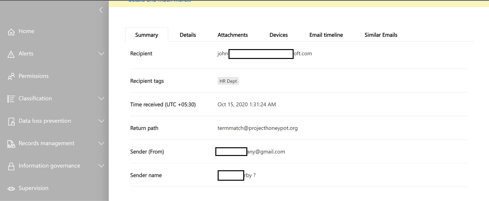
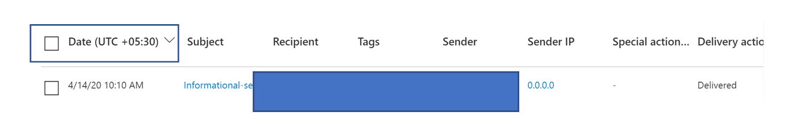

# Threat Explorer und Echtzeiterkennung

Wenn Ihre Organisation [Microsoft Defender für Office 365](office-365-atp.md) hat und Sie über die [erforderlichen Berechtigungen](#required-licenses-and-permissions)verfügen, haben Sie Zugriff auf den *Explorer* oder *Echt Zeit Erkennungen*, die früher *Echtzeitberichte* waren. ([Weitere Informationen finden Sie unter What es New.](#new-features-in-threat-explorer-and-real-time-detections)) Wechseln Sie im Security & Compliance Center zu **Threat Management**, und wählen Sie dann **Explorer** _oder_ **Real-Time Detections** aus.

|Mit Microsoft Defender für Office 365 Plan 2 sehen Sie Folgendes:|Mit Microsoft Defender für Office 365 Plan 1 sehen Sie Folgendes:|
|---|---|
|||
|

Explorer oder Echt Zeit Erkennungen unterstützen das Team für Sicherheitsvorgänge beim ermitteln und reagieren auf Bedrohungen effizient. Der Bericht ähnelt dem folgenden Bild:

Mit diesem Bericht haben Sie folgende Möglichkeiten:

- [Siehe von Microsoft 365-Sicherheitsfeatures erkannte Schadsoftware](#see-malware-detected-in-email-by-technology)
- [Anzeigen der Phishing-URL und klicken auf Urteils Daten](#view-phishing-url-and-click-verdict-data)
- [Starten eines automatisierten unter Such-und Antwort Prozesses aus einer Ansicht im Explorer](#start-automated-investigation-and-response) (nur für Office 365 Plan 2)
- [Untersuchen schädlicher e-Mails und vieles mehr](#more-ways-to-use-explorer-and-real-time-detections)

## Verbesserungen an Threat Explorer und Echtzeiterkennung

### Tags im Threat-Explorer

> [!NOTE]
> Das Feature "Benutzer Tags" befindet sich in der *Vorschau*, steht nicht allen zur Verfügung und kann jederzeit geändert werden. Weitere Informationen zum Veröffentlichungszeitplan finden Sie in der Microsoft 365-Roadmap.

Benutzer Tags identifizieren bestimmte Benutzergruppen in Microsoft Defender für Office 365. Weitere Informationen zu Tags, einschließlich Lizenzierung und Konfiguration, finden Sie unter [User Tags](user-tags.md).

In Threat Explorer werden Informationen zu Benutzer Tags in den folgenden Erfahrungen angezeigt.

#### E-Mail-Rasteransicht

Die Spalte **Tags** im e-Mail-Raster enthält alle Tags, die auf die Absender-oder Empfängerpostfächer angewendet wurden. Standardmäßig werden System Tags wie Priority-Konten zuerst angezeigt.

> [!div class="mx-imgBorder"]
> 

#### Filtern

Sie können Tags als Filter verwenden. Jagen nur für Prioritäts Konten oder bestimmte Benutzer Tags-Szenarien. Sie können auch Ergebnisse mit bestimmten Tags ausschließen. Kombinieren Sie diese Funktionalität mit anderen Filtern, um den Umfang der Untersuchung einzuschränken.

> [!div class="mx-imgBorder"]
> 

#### E-Mail-Detail Flyout
Um die einzelnen Tags für Absender und Empfänger anzuzeigen, wählen Sie den Betreff aus, um das Nachrichtendetail-Flyout zu öffnen. Auf der Registerkarte **Zusammenfassung** werden die Absender-und Empfänger Tags separat angezeigt, sofern Sie für eine e-Mail vorhanden sind.
Die Informationen zu einzelnen Tags für Absender und Empfänger erstreckt sich auch auf exportierte CSV-Daten, wo Sie diese Details in zwei separaten Spalten sehen können.

> [!div class="mx-imgBorder"]
> 

Tags-Informationen werden auch im Flyout "URL Klicks" angezeigt. Um es anzuzeigen, wechseln Sie zu Phishing-oder alle e-Mail-Ansicht und dann auf die Registerkarte **URLs** oder **URL Klicks** . Wählen Sie ein einzelnes URL-Flyout aus, um weitere Details zu Klicks für diese URL anzuzeigen, einschließlich der Tags, die diesem Klick zugeordnet sind.

> [!div class="mx-imgBorder"]
> 

## Verbesserungen am Jagderlebnis für Bedrohungen (bevorstehende)

### Aktualisierte Bedrohungsinformationen für e-Mails

Wir haben uns auf Plattform-und Daten Qualitätsverbesserungen konzentriert, um die Datengenauigkeit und Konsistenz von e-Mail-Datensätzen zu verbessern. Zu den Verbesserungen gehören die Konsolidierung von Informationen vor der Zustellung und Postzustellung, wie beispielsweise Aktionen, die in einer e-Mail als Teil des Zap-Prozesses ausgeführt werden, in einem einzelnen Datensatz. Weitere Details wie Spam Urteil, Bedrohungen auf Entitätsebene (beispielsweise die bösartige URL) und die neuesten Zustellungsorte sind ebenfalls enthalten.

Nach diesen Updates wird für jede Nachricht ein einzelner Eintrag angezeigt, unabhängig von den verschiedenen nach Zustellungs Ereignissen, die sich auf die Nachricht auswirken. Zu den Aktionen können zap, manuelle Korrektur (also Administratoraktion), dynamische Zustellung usw. gehören.

Neben Malware-und Phishing-Bedrohungen sehen Sie das Spam-Urteil, das einer e-Mail zugeordnet ist. Lesen Sie in der e-Mail alle Bedrohungen, die mit der e-Mail zusammenhängen, sowie die entsprechenden Erkennungstechnologien. Eine e-Mail-Nachricht kann 0, 1 oder mehrere Bedrohungen aufweisen. Im Abschnitt **Details** des e-Mail-Flyouts werden die aktuellen Bedrohungen angezeigt. Für mehrere Bedrohungen (wie Malware und Phishing) zeigt das Feld **Erkennungs** Technologie die Zuordnung der Bedrohungserkennung an, bei der es sich um die Erkennungstechnologie handelt, die die Bedrohung identifiziert hat.

Der Reihe von Erkennungstechnologien enthält jetzt neue Erkennungsmethoden sowie Technologien zur Spam Erkennung. Sie können dieselbe Reihe von Erkennungstechnologien verwenden, um die Ergebnisse in den verschiedenen e-Mail-Ansichten zu filtern (Malware, Phishing, alle e-Mails).

> [!NOTE]
> Die Urteils Analyse ist möglicherweise nicht unbedingt an Entitäten gebunden. Beispielsweise kann eine e-Mail als Phishing oder Spam klassifiziert werden, aber es gibt keine URLs, die mit einem Phishing/Spam-Urteil versehen sind. Dies liegt daran, dass die Filter auch Inhalte und andere Details für eine e-Mail auswerten, bevor Sie ein Urteil zuweisen.

#### Bedrohungen in URLs

Sie können nun die spezifische Bedrohung für eine URL auf der Registerkarte e-Mail-Flyout- **Details** sehen. Die Bedrohung kann *Malware*, *Phishing*, *Spam* oder *keine* sein.)

> [!div class="mx-imgBorder"]
> 

### Aktualisierte Zeitachsenansicht (bevorstehende)

> [!div class="mx-imgBorder"]
> 

Zeitachsenansicht identifiziert alle Zustellungs-und Post Zustellungs Ereignisse. Sie enthält Informationen zu der zu diesem Zeitpunkt identifizierten Bedrohung für eine Teilmenge dieser Ereignisse. Die Zeitachsenansicht enthält außerdem Informationen zu allen weiteren ausgeführten Aktionen (wie zap oder manuelle Korrektur) sowie dem Ergebnis dieser Aktion. Zu den Zeitachsen Ansichtsinformationen gehören:

- **Quelle:** Die Quelle des Ereignisses. Er kann Administrator/System/Benutzer sein.
- **Ereignis:** Umfasst Ereignisse der obersten Ebene wie Original Zustellung, manuelle Korrektur, Zap, Übermittlungen und dynamische Zustellung.
- **Aktion:** Die Aktion, die entweder im Rahmen von zap-oder Administratoraktionen ausgeführt wurde (beispielsweise "Soft Delete").
- **Bedrohungen:** Deckt die zu diesem Zeitpunkt identifizierten Bedrohungen (Schadsoftware, Phishing, Spam) ab.
- **Ergebnis/Details:** Weitere Informationen zum Ergebnis der Aktion, beispielsweise, ob Sie als Teil der zap/admin-Aktion ausgeführt wurde.

### Ursprünglicher und aktueller Zustellungs Speicherort

Derzeit wird der Übermittlungsort im e-Mail-Raster und im e-Mail-Flyout angezeigt. Das Feld **Zustellungs Speicherort** wird umbenannt in *_ursprünglicher Zustellungs Speicherort_* _. Und wir führen ein weiteres Feld mit dem _*_neuesten Zustellungs Standort_*_ ein.

_ *Original Delivery Location** gibt weitere Informationen darüber, wo eine e-Mail ursprünglich zugestellt wurde. Der **aktuelle Übermittlungsort** gibt an, wo eine e-Mail-Nachricht nach Systemaktionen wie *zap* -oder admin-Aktionen wie dem *Wechsel zu gelöschten Elementen* landete. Neuester Zustellungsort soll Administratoren die Nachricht mit dem zuletzt bekannten Standort nach Zustellung oder System-admin-Aktionen mitteilen. Es enthält keine Endbenutzeraktionen für die e-Mail. Wenn ein Benutzer beispielsweise eine Nachricht gelöscht oder die Nachricht in Archiv/PST verschoben hat, wird der Speicherort der Nachricht "Zustellung" nicht aktualisiert. Wenn jedoch eine Systemaktion den Standort aktualisiert hat (beispielsweise zap, was zu einer e-Mail-Verschiebung in Quarantäne führt), wird der **aktuelle Übermittlungsort** als "Quarantäne" angezeigt.

> [!div class="mx-imgBorder"]
> 

> [!NOTE]
> Es gibt einige Fälle, in denen der **Übermittlungsort** und die **Zustellungs Aktion** als "unbekannt" angezeigt werden können:
>
> - Möglicherweise wird der **Übermittlungsort** als "zugestellt" und der **Übermittlungsort** als "unbekannt" angezeigt, wenn die Nachricht zugestellt wurde, aber eine Posteingangsregel hat die Nachricht in einen Standardordner (wie Entwurf oder Archiv) anstatt in den Posteingang oder den Junk-e-Mail-Ordner verschoben.
>
> - Der **aktuelle Übermittlungsort** kann unbekannt sein, wenn eine Administrator/System-Aktion (wie zap) versucht wurde, die Nachricht wurde jedoch nicht gefunden. Normalerweise geschieht die Aktion, nachdem der Benutzer die Nachricht verschoben oder gelöscht hat. Überprüfen Sie in diesen Fällen die Spalte **Ergebnis/Details** in der Zeitachsenansicht. Suchen Sie nach der Anweisung "Nachricht, die vom Benutzer verschoben oder gelöscht wurde."

> [!div class="mx-imgBorder"]
> 

### Zusätzliche Aktionen

*Zusätzliche Aktionen* wurden nach der Zustellung der e-Mail angewendet. Sie können *zap*, *Manuelle Korrekturen* (Aktionen, die von einem Administrator wie "Soft Delete" ausgeführt werden), die *dynamische Zustellung* und die *erneute Verarbeitung* (für eine e-Mail, die rückwirkend als "gut" erkannt wurde) einschließen.

> [!NOTE]
> - Im Rahmen der ausstehenden Änderungen wird der Wert "Remove by Zap", der aktuell im Filter für die Zustellungs Aktion angezeigt wird, entfernt. Sie haben eine Möglichkeit, alle e-Mails mit dem zap-Versuch durch **zusätzliche Aktionen** zu suchen.
>
> - Es werden neue Felder und Werte für **Erkennungstechnologien** und **zusätzliche Aktionen** (insbesondere für zap-Szenarien) vorhanden sein. Sie müssen die vorhandenen gespeicherten Abfragen und nachverfolgten Abfragen auswerten, um sicherzustellen, dass Sie mit den neuen Werten funktionieren.

> [!div class="mx-imgBorder"]

> 

### System Überschreibungen

*System Überschreibungen* ermöglichen es Ihnen, Ausnahmen für den gewünschten Übermittlungsort einer Nachricht vorzunehmen. Sie überschreiben den vom System bereitgestellten Übermittlungsort basierend auf den Bedrohungen und anderen Erkennungen, die vom Filter Stapel identifiziert werden. System Überschreibungen können über Mandanten-oder Benutzerrichtlinien festgelegt werden, um die von der Richtlinie vorgeschlagene Nachricht zuzustellen. Außerkraftsetzungen können eine unbeabsichtigte Zustellung schädlicher Nachrichten aufgrund von Konfigurations Lücken erkennen, beispielsweise eine übermäßig Breite Richtlinie für sichere Absender, die von einem Benutzer festgelegt wurde. Diese Außerkraftsetzungswerte können wie folgt lauten:

- Nach Benutzerrichtlinie zulässig: ein Benutzer erstellt Richtlinien auf Postfachebene, um Domänen oder Absender zuzulassen.
- Durch Benutzerrichtlinie blockiert: ein Benutzer erstellt Richtlinien auf der Ebene des Postfachs, um Domänen oder Absender zu blockieren.
- Zugelassen nach org-Richtlinie: die Sicherheitsteams der Organisation legen Richtlinien oder Exchange-Nachrichtenfluss Regeln fest (auch bekannt als Transportregeln), um Absender und Domänen für Benutzer in Ihrer Organisation zuzulassen. Dies kann für eine Gruppe von Benutzern oder die gesamte Organisation sein.
- Durch die org-Richtlinie blockiert: die Sicherheitsteams der Organisation legen Richtlinien oder Nachrichtenfluss Regeln fest, um Absender, Domänen, Nachrichten Sprachen oder Quell-IPs für Benutzer in Ihrer Organisation zu blockieren. Dies kann auf eine Gruppe von Benutzern oder die gesamte Organisation angewendet werden.
- Durch die org-Richtlinie blockierte Dateierweiterung: das Sicherheitsteam einer Organisation blockiert eine Dateinamenerweiterung über die Antischadsoftware-Richtlinieneinstellungen. Diese Werte werden nun in e-Mail-Details angezeigt, um bei Untersuchungen behilflich zu sein. Team Teams können auch die Rich-Filtering-Funktion verwenden, um nach blockierten Dateierweiterungen zu filtern.

> [!div class="mx-imgBorder"]
> 

### Verbesserungen für die URL und Klicks Experience

Zu den Verbesserungen gehören:

- Zeigen Sie die vollständig geklickte URL (einschließlich aller Abfrageparameter, die Teil der URL sind) im Abschnitt **Klicks** des URL-Flyouts an. Derzeit werden die URL-Domäne und der Pfad in der Titelleiste angezeigt. Diese Informationen werden erweitert, um die vollständige URL anzuzeigen.

- Korrekturen über URL-Filter (*URL* - *URL-Domäne* im Vergleich zu URL-Domäne *und-Pfad*): die Aktualisierungen wirken sich auf die Suche nach Nachrichten aus, die eine URL/Klick Urteil enthalten. Wir haben die Unterstützung für protokollunabhängige Suchvorgänge aktiviert, sodass Sie eine URL ohne verwenden können `http` . Standardmäßig ordnet die URL-Suche http zu, es sei denn, ein anderer Wert wird explizit angegeben. Zum Beispiel:

   -  Suchen Sie mit und ohne das `http://` Präfix in den Feldern **URL**, **URL-Domäne** und URL- **Domäne und Pfad** Filter. Die Suchvorgänge sollten dieselben Ergebnisse aufweisen.

   -  Suchen Sie nach dem `https://` Präfix in der **URL**. Wenn kein Wert angegeben wird, `http://` wird das Präfix angenommen.

   - `/` wird am Anfang und am Ende des URL- **Pfads**, der **URL-Domäne**, der URL- **Domäne und der Pfad** Felder ignoriert. `/` am Ende des **URL** -Felds wird ignoriert.

### Phishing-Zuverlässigkeitsstufe

Die Phishing-Zuverlässigkeitsstufe hilft bei der Identifizierung des Vertrauens Grads, mit dem eine e-Mail als "Phishing" kategorisiert wurde. Die beiden möglichen Werte sind *hoch* und *Normal*. In der Anfangsphase ist dieser Filter nur in der Phishing-Ansicht von Threat Explorer verfügbar.

### Zap-URL-Signal

Das ZAP-URL-Signal wird in der Regel für zap-Phishing-Warnungs Szenarien verwendet, in denen eine e-Mail als Phishing identifiziert und nach der Zustellung entfernt wurde. Dieses Signal verbindet die Benachrichtigung mit den entsprechenden Ergebnissen im Explorer. Es ist einer der IOCs für die Warnung.

Um den Jagd Prozess zu verbessern, haben wir den Threat Explorer und Echt Zeit Erkennungen aktualisiert, damit die Jagd Erfahrung konsistenter wird. Die Änderungen werden hier beschrieben:

- [Verbesserungen der Zeitzone](#timezone-improvements)
- [Aktualisieren im Aktualisierungsprozess](#update-in-the-refresh-process)
- [Zu filtern Hinzuzufügender Diagramm Drilldown](#chart-drilldown-to-add-to-filters)
- [In Produkt Informations Updates](#in-product-information-updates)

### Nach Benutzer Tags Filtern

Sie können jetzt System-oder benutzerdefinierte Benutzerkategorien sortieren und Filtern, um den Umfang der Bedrohungen schnell zu erfassen. Weitere Informationen finden Sie unter [User Tags](user-tags.md).

> [!IMPORTANT]
> Das Filtern und Sortieren nach Benutzer Tags befindet sich derzeit in der öffentlichen Vorschau. Diese Funktionalität kann erheblich geändert werden, bevor Sie kommerziell veröffentlicht wird. Microsoft leistet keine ausdrücklichen oder impliziten Garantien in Bezug auf die Informationen, die darüber bereitgestellt werden.

### Verbesserungen der Zeitzone

Sie sehen die Zeitzone für die e-Mail-Einträge im Portal sowie für exportierte Daten. Es wird in verschiedenen Bereichen wie e-Mail-Raster, Detail Flyout, e-Mail-Zeitachse und ähnlicher e-Mails angezeigt, sodass die Zeitzone für das Resultset eindeutig ist.

> [!div class="mx-imgBorder"]
> 

### Aktualisieren im Aktualisierungsprozess

Einige Benutzer äußerten sich zu Verwirrung bei der automatischen Aktualisierung (beispielsweise, sobald Sie das Datum ändern, die Seite aktualisiert wird) und die manuelle Aktualisierung (für andere Filter). Entsprechend führt das Entfernen von Filtern zu automatischer Aktualisierung. Das Ändern von Filtern beim Ändern der Abfrage kann inkonsistente Sucherfahrungen verursachen. Um diese Probleme zu beheben, werden wir zu einem Mechanismus für die manuelle Filterung verschoben.

Aus Erfahrungsgründen kann der Benutzer den unterschiedlichen Filterbereich (von Filtersätzen und Datum) anwenden und entfernen und die Schaltfläche Aktualisieren auswählen, um die Ergebnisse zu filtern, nachdem die Abfrage definiert wurde. Die Schaltfläche Aktualisieren wird nun auch auf dem Bildschirm hervorgehoben. Außerdem haben wir die zugehörigen QuickInfos und die produktbezogene Dokumentation aktualisiert.

> [!div class="mx-imgBorder"]
> 

### Zu filtern Hinzuzufügender Diagramm Drilldown

Sie können jetzt Legendenwerte Diagramm, um Sie als Filter hinzufügen. Klicken Sie auf die Schaltfläche **Aktualisieren** , um die Ergebnisse zu filtern.

> [!div class="mx-imgBorder"]
> 

### Updates für produktbezogene Informationen

Weitere Details sind jetzt innerhalb des Produkts verfügbar, beispielsweise die Gesamtzahl der Suchergebnisse im Raster (siehe unten). Wir haben Beschriftungen, Fehlermeldungen und QuickInfos verbessert, um weitere Informationen zu den Filtern, der Suchumgebung und der Ergebnismenge zu erhalten.

> [!div class="mx-imgBorder"]
> 

## Erweiterte Funktionen im Threat-Explorer

### Am häufigsten verwendete Benutzer

Heute stellen wir die Liste der am häufigsten gezielten Benutzer in der Malware-Ansicht für e-Mails im Abschnitt **Top-Malware Familien** zur Verfügung. Wir erweitern diese Ansicht auch in den Ansichten Phishing und alle e-Mails. Sie können die Top-fünf-Zielbenutzer sowie die Anzahl der Versuche für jeden Benutzer für die entsprechende Ansicht anzeigen. Beispielsweise sehen Sie für die Phishing-Ansicht die Anzahl der Phishing-Versuche.

Sie können die Liste der Zielbenutzer (bis zu einem Grenzwert von 3.000) zusammen mit der Anzahl der Versuche für die Offlineanalyse für jede e-Mail-Ansicht exportieren. Wenn Sie außerdem die Anzahl der Versuche auswählen (beispielsweise 13 Versuche in der Abbildung unten), wird eine gefilterte Ansicht in Threat Explorer geöffnet, damit Sie mehr über e-Mails und Bedrohungen für diesen Benutzer erfahren können.

> [!div class="mx-imgBorder"]
> 

### Exchange-Transportregeln

Im Rahmen der Datenanreicherung können Sie alle verschiedenen Exchange-Transportregeln (ETR) anzeigen, die auf eine Nachricht angewendet wurden. Diese Informationen sind in der e-Mail-Rasteransicht verfügbar. Um es anzuzeigen, wählen Sie **Spaltenoptionen** im Raster aus, und fügen Sie dann **Exchange-Transport Regel** aus den Spaltenoptionen hinzu. Sie wird auch im **Detail** -Flyout in der e-Mail angezeigt.

Sie können sowohl die GUID als auch den Namen der Transportregeln sehen, die auf die Nachricht angewendet wurden. Sie können nach den Nachrichten suchen, indem Sie den Namen der Transportregel verwenden. Dies ist eine "Contains"-Suche, was bedeutet, dass Sie auch partielle Suchvorgänge ausführen können.

#### Wichtiger Hinweis:

Die Verfügbarkeit von ETR-Suche und-Namen hängt von der jeweiligen Rolle ab, die Ihnen zugewiesen ist. Sie müssen über eine der folgenden Rollen/Berechtigungen verfügen, um die ETR Namen und die Suche anzuzeigen. Wenn Ihnen keine dieser Rollen zugewiesen ist, werden die Namen der Transportregeln oder die Suche nach Nachrichten nicht mithilfe von ETR-Namen angezeigt. In den e-Mail-Details können jedoch die ETR-Bezeichnung und die GUID-Informationen angezeigt werden. Andere Datensätze, die in e-Mail-Rastern, e-Mail-Flyouts, Filtern und Exporten angezeigt werden, sind davon nicht betroffen.

- Nur Exo – Verhinderung von Datenverlust: all
- Nur Exo-O365SupportViewConfig: all
- Microsoft Azure Active Directory oder Exo-Security Admin: all
- Aad oder Exo-Security Reader: all
- Nur Exo-Transport Regeln: all
- Nur Exo-View-Only Konfiguration: all

Im e-Mail-Raster, im Detail-Flyout und in der exportierten CSV-Datei werden die ETRs mit einem Namen/einer GUID angezeigt, wie unten dargestellt.

> [!div class="mx-imgBorder"]
> 

### Eingehende Connectors

Connectors sind eine Sammlung von Anweisungen, die die Art und Weise anpassen, wie Ihre e-Mails zu und von Ihrer Microsoft 365-oder Office 365-Organisation fließen. Sie ermöglichen es Ihnen, Sicherheitseinschränkungen oder-Steuerelemente anzuwenden. Im Threat Explorer können Sie nun die Connectors anzeigen, die sich auf eine e-Mail beziehen, und mithilfe von Konnektornamen nach e-Mails suchen.

Die Suche nach Connectors ist in der Natur "Contains", was bedeutet, dass partielle Stichwortsuche auch funktionieren sollte. In der Hauptraster Ansicht, im Detail Flyout und in der exportierten CSV werden die Connectors im Format Name/GUID wie hier gezeigt angezeigt:

> [!div class="mx-imgBorder"]
> 

## Neue Features in Threat Explorer und Echt Zeit Erkennungen

Im Threat Explorer und in Echt Zeit Erkennungen stehen drei neue Features zur Verfügung:

- [E-Mail-Kopfzeile anzeigen und e-Mail-Textkörper downloaden](#preview-email-header-and-download-email-body)
- [E-Mail-Zeitachse](#email-timeline)
- [Export-URL klicken Sie auf Daten](#export-url-click-data)

Diese neuen Features werden unten erläutert.

### E-Mail-Kopfzeile anzeigen und e-Mail-Textkörper downloaden

Sie können jetzt eine Vorschau einer e-Mail-Kopfzeile anzeigen und den e-Mail-Text in Threat Explorer herunterladen Administratoren können heruntergeladene Kopfzeilen/e-Mail-Nachrichten auf Bedrohungen Da das Herunterladen von e-Mail-Nachrichten eine Gefährdung von Informationen zur Folge haben kann, wird dieser Prozess durch die rollenbasierte Zugriffssteuerung (RBAC) gesteuert. Eine neue Rolle, *Vorschau*, muss einer anderen Rollengruppe hinzugefügt werden (beispielsweise Sicherheitsvorgänge oder Sicherheits Administrator), um die Möglichkeit zum Herunterladen von e-Mails und der Vorschau von Kopfzeilen in der Ansicht "All-e-Mail-Nachrichten" zu gewähren.

Explorer und Echt Zeit Erkennungen erhalten auch neue Felder, die ein vollständigeres Bild davon liefern, wo Ihre e-Mail-Nachrichten landen. Diese Änderungen erleichtern die Suche für Sicherheitsoperationen. Das wichtigste Ergebnis ist jedoch, dass Sie den Speicherort der Problem-e-Mail-Nachrichten auf einen Blick kennen können.

Wie wird das gemacht? Der Zustellungsstatus wird nun in zwei Spalten aufgeteilt:

- **Zustellungs Aktion** – Status der e-Mail.
- **Zustellungs Standort** – wohin die e-Mail weitergeleitet wurde.

*Zustellungs Aktion* ist die Aktion, die aufgrund vorhandener Richtlinien oder Erkennungen auf eine e-Mail angewendet wird. Hier sind die möglichen Aktionen für eine e-Mail:

|Geliefert|Ausrangierten|Gesperrt|Ersetzt|
|---|---|---|---|
|E-Mail wurde an den Posteingang oder Ordner eines Benutzers zugestellt, und der Benutzer kann darauf zugreifen.|E-Mail-Nachrichten wurden an den Junk-oder Deleted-Ordner des Benutzers gesendet, und der Benutzer kann darauf zugreifen.|E-Mail-Nachrichten, die isoliert, fehlerhaft oder gelöscht wurden. Für diese e-Mails kann der Benutzer nicht darauf zugreifen.|E-Mail-Nachweise haben schädliche Anlagen durch txt-Dateien ersetzt, die angeben, dass die Anlage bösartig war.|

Hier erfahren Sie, was der Benutzer sehen kann und was nicht:

|Für Endbenutzer zugänglich|Für Endbenutzer unzugänglich|
|---|---|
|Geliefert|Gesperrt|
|Ausrangierten|Ersetzt|

Der **Übermittlungsort** zeigt die Ergebnisse von Richtlinien und Erkennungen an, die nach der Zustellung ausgeführt werden. Sie ist mit **_Zustellungs Aktion_* _ verknüpft. Dies sind die möglichen Werte:

- _Inbox oder Ordner *: die e-Mail befindet sich im Posteingang oder in einem Ordner (entsprechend Ihren e-Mail-Regeln).
- *On-Prem oder extern*: das Postfach ist nicht in der Cloud vorhanden, sondern lokal.
- *Junk-Ordner*: die e-Mail befindet sich im Junk-Ordner eines Benutzers.
- *Ordner "Gelöschte Elemente"*: die e-Mail im Ordner "Gelöschte Elemente" eines Benutzers.
- *Quarantäne*: die e-Mail befindet sich in der Quarantäne und nicht im Postfach eines Benutzers.
- *Fehler*: die e-Mail konnte das Postfach nicht erreichen.
- *Abgelegt*: die e-Mail-Nachricht wurde irgendwo im Nachrichtenfluss verloren.

### E-Mail-Zeitachse

Die **e-Mail-Zeitachse** ist eine neue Explorer-Funktion, die die Jagd Erfahrung für Administratoren verbessert. Es verkürzt die Zeit, die für die Überprüfung verschiedener Standorte aufgewendet wurde, um zu versuchen, das Ereignis zu verstehen. Wenn mehrere Ereignisse bei oder nahe gleichzeitig einer e-Mail eintreffen, werden diese Ereignisse in einer Zeitachsenansicht angezeigt. Einige Ereignisse, die mit Ihrer e-Mail-nach Zustellung geschehen, werden in der Spalte **Spezial Aktion** erfasst. Administratoren können Informationen aus der Zeitachse mit der speziellen Aktion in der e-Mail-nach Zustellung kombinieren, um Einblicke in die Funktionsweise Ihrer Richtlinien zu erhalten, wo die e-Mail schließlich weitergeleitet wurde, und in einigen Fällen, was die abschließende Bewertung war.

Weitere Informationen finden Sie unter [untersuchen und Beheben von böswilligen e-Mails, die in Office 365 bereitgestellt wurden](investigate-malicious-email-that-was-delivered.md).

### Export-URL klicken Sie auf Daten

Sie können jetzt Berichte für URL-Klicks exportieren, um Microsoft Excel, Ihre **Netzwerknachrichten-ID** anzuzeigen und **auf Urteil zu klicken**, wodurch erklärt wird, wo Ihre URL auf den Datenverkehr zugestellt wurde. Hier ist die Funktionsweise: führen Sie in Threat Management auf der Office 365 Schnellstartleiste die folgende Kette aus:

**Explorer** \> **Phishing anzeigen** \> **Klicks** \> Top- **URLs** oder **URL-Top-Klicks** \> Wählen Sie einen beliebigen Datensatz aus, um das URL-Flyout zu öffnen.

Wenn Sie eine URL in der Liste auswählen, wird im Ausklappbereich eine neue Schaltfläche **exportieren** angezeigt. Verwenden Sie diese Schaltfläche, um Daten zur einfacheren Berichterstellung in eine Excel-Tabelle zu migrieren.

Führen Sie diesen Pfad aus, um zum gleichen Speicherort im Bericht über Echt Zeit Erkennungen zu gelangen:

**Explorer** \> **Echt Zeit Erkennungen** \> **Phishing anzeigen** \> **URLs** \> **Top-URLs** oder **Top-Klicks** \> Wählen Sie einen Eintrag aus, um das URL \> -Flyout zu öffnen, navigieren Sie zur Registerkarte **Klicks** .

> [!TIP]
> Die Netzwerknachrichten-ID ordnet den Klick zurück zu bestimmten Mails zu, wenn Sie die ID über den Explorer oder zugeordnete Tools von Drittanbietern durchsuchen. Solche Suchvorgänge identifizieren die e-Mail-Nachricht, die einem Klick Ergebnis zugeordnet ist. Die korrelierte Netzwerknachrichten-ID ermöglicht eine schnellere und leistungsstärkere Analyse.

> [!div class="mx-imgBorder"]
> 

## Siehe in e-Mail erkannte Malware nach Technologie

Angenommen, Sie möchten sehen, dass Schadsoftware in e-Mails nach Microsoft 365-Technologie sortiert erkannt wird. Verwenden Sie dazu die [e-Mail->](threat-explorer-views.md#email--malware) Ansicht "Malware" des Explorers (oder Echtzeiterkennung).

1. Wählen Sie im Security & Compliance Center ( <https://protection.office.com> ) **Threat Management** \> **Explorer** (oder **Echtzeiterkennung**) aus. (In diesem Beispiel wird der Explorer verwendet.)

2. Wählen Sie im Menü **Ansicht** die Option **e-Mail-** \> **Schadsoftware** aus.

   > [!div class="mx-imgBorder"]
   > 

3. Klicken Sie auf **Absender**, und wählen Sie dann **Basis** \> **Erkennungstechnologie** aus.

   Ihre Erkennungstechnologien stehen nun als Filter für den Bericht zur Verfügung.

   > [!div class="mx-imgBorder"]
   > 

4. Wählen Sie eine Option aus. Klicken Sie dann auf die Schaltfläche **Aktualisieren** , um diesen Filter anzuwenden.

   > [!div class="mx-imgBorder"]
   > 

Der Bericht wird aktualisiert, um die Ergebnisse anzuzeigen, die Schadsoftware in e-Mails mithilfe der ausgewählten technologieoption erkannt hat. Von hier aus können Sie weitere Analysen durchführen.

## Anzeigen der Phishing-URL und klicken auf Urteils Daten

Angenommen, Sie möchten Phishing-Versuche über URLs in e-Mails sehen, einschließlich einer Liste von URLs, die zugelassen, blockiert und außer Kraft gesetzt wurden. Zum Identifizieren von URLs, auf die geklickt wurde, müssen [sichere Links](atp-safe-links.md) konfiguriert werden. Stellen Sie sicher, dass Sie [Richtlinien für sichere Links](set-up-atp-safe-links-policies.md) für Zeit-zu-Klick-Schutz und Protokollierung von Klick Urteilen über sichere Links einrichten.

Um Phishing-URLs in Nachrichten und Klicks auf URLs in Phishing-Nachrichten zu überprüfen, verwenden Sie die [ **e-Mail-**  >  **Phishing** -](threat-explorer-views.md#email--phish) Ansicht von Explorer oder Echt Zeit Erkennungen.

1. Wählen Sie im Security & Compliance Center ( <https://protection.office.com> ) **Threat Management** \> **Explorer** (oder **Echtzeiterkennung**) aus. (In diesem Beispiel wird der Explorer verwendet.)

2. Wählen Sie im Menü **Ansicht** die Option Phishing **per e-Mail** aus \> .

   > [!div class="mx-imgBorder"]
   > 

3. Klicken Sie auf **Absender**, und wählen Sie dann **URLs** \> **Klicken Sie auf Urteil**.

4. Wählen Sie eine oder mehrere Optionen aus, beispielsweise " **blockiert** " und " **außer Kraft gesetzt**", und wählen Sie dann die Schaltfläche " **Aktualisieren** " in derselben Reihe wie die Optionen zum Anwenden des Filters aus. (Aktualisieren Sie Ihr Browserfenster nicht.)

   > [!div class="mx-imgBorder"]
   > 

   Der Bericht wird aktualisiert, um zwei unterschiedliche URL-Tabellen auf der Registerkarte URL unter dem Bericht anzuzeigen:

   - **Top-URLs** sind die URLs in den Nachrichten, die Sie nach unten gefiltert haben, und die Anzahl der e-Mail-Zustellungs Aktionen für jede URL. In der Phishing-e-Mail-Ansicht enthält diese Liste normalerweise legitime URLs. Angreifer bieten eine Mischung aus guten und ungültigen URLs in ihren Nachrichten an, um Sie zu übermitteln, aber Sie machen die bösartigen Links interessanter aussehen. Die Tabelle mit URLs wird nach der Gesamtzahl der e-Mails sortiert, diese Spalte wird jedoch ausgeblendet, um die Ansicht zu vereinfachen.

   - Die **wichtigsten Klicks** sind die eingebundenen URLs, auf die geklickt wurde, sortiert nach der Gesamtanzahl der Klicks. Diese Spalte wird auch nicht angezeigt, um die Ansicht zu vereinfachen. Gesamtanzahl Zählungen nach Spalte geben Sie die sichere Links klicken Sie auf Urteils Zählung für jede URL, auf die geklickt wurde. In der Phishing-e-Mail-Ansicht handelt es sich normalerweise um verdächtige oder bösartige URLs. Die Ansicht kann jedoch URLs enthalten, die keine Bedrohungen, sondern Phishing-Nachrichten darstellen. URL Klicks auf unverpackte Links werden hier nicht angezeigt.

   Die zwei URL-Tabellen zeigen die wichtigsten URLs in Phishing-e-Mails nach Zustellungs Aktion und Speicherort. In den Tabellen werden URL-Klicks angezeigt, die trotz einer Warnung blockiert oder besucht wurden, sodass Sie sehen können, welche potenziellen fehlerhaften Links Benutzern angezeigt wurden und auf die der Benutzer geklickt hat. Von hier aus können Sie weitere Analysen durchführen. Beispielsweise können unter dem Diagramm die häufigsten URLs in e-Mail-Nachrichten angezeigt werden, die in der Umgebung Ihrer Organisation blockiert wurden.

   > [!div class="mx-imgBorder"]
   > 

   Wählen Sie eine URL aus, um ausführlichere Informationen anzuzeigen.

   > [!NOTE]
   > Im Dialogfeld URL-Flyout wird die Filterung in e-Mail-Nachrichten entfernt, um die vollständige Ansicht der URL-Exposition in Ihrer Umgebung anzuzeigen. Auf diese Weise können Sie nach e-Mail-Nachrichten filtern, die im Explorer betroffen sind, bestimmte URLs, die potenzielle Bedrohungen darstellen, und dann Ihr Verständnis der URL-Exposition in Ihrer Umgebung (über das Dialogfeld URL-Details) erweitern, ohne der Explorer-Ansicht selbst URL-Filter hinzufügen zu müssen.

### Interpretation von Klick Urteilen

Innerhalb der e-Mail-oder URL-Flyouts, der wichtigsten Klicks sowie in unseren Filter-Erlebnissen werden unterschiedliche Klick Urteils Werte angezeigt:

- **None:** Das Urteil für die URL kann nicht erfasst werden. Der Benutzer hat möglicherweise auf die URL geklickt.
- **Zulässig:** Der Benutzer durfte zur URL navigieren.
- **Blockiert:** Der Benutzer wurde für die Navigation zur URL gesperrt.
- **Ausstehender Urteilsspruch:** Dem Benutzer wurde die Seite detonations anstehenden angezeigt.
- **Blockiert außer Kraft gesetzt:** Der Benutzer wurde für die direkte Navigation zur URL gesperrt. Der Benutzer hat den Block jedoch übersteuert, um zur URL zu navigieren.
- **Ausstehender Urteils Umgehung:** Dem Benutzer wurde die detonations Seite angezeigt. Der Benutzer hat die Nachricht jedoch für den Zugriff auf die URL über Gefahren.
- **Fehler:** Der Benutzer wurde mit der Fehlerseite angezeigt, oder beim Erfassen des Urteils ist ein Fehler aufgetreten.
- **Fehler:** Beim Erfassen des Urteils ist eine unbekannte Ausnahme aufgetreten. Der Benutzer hat möglicherweise auf die URL geklickt.

## Überprüfen von von Benutzern gemeldeten e-Mail-Nachrichten

Angenommen, Sie möchten e-Mail-Nachrichten anzeigen, die Benutzer in Ihrer Organisation als *Junk*-, *kein Junk*-oder als *Phishing* -Meldung über das [Add-in "Berichtsnachricht" für Outlook und Outlook im Internet](enable-the-report-message-add-in.md)angegeben haben. Um Sie anzuzeigen, verwenden Sie die Ansicht [ **e-Mail-** über  >  **mittlungen**](threat-explorer-views.md#email--submissions) des Explorers (oder Echtzeiterkennung).

1. Wählen Sie im Security & Compliance Center ( <https://protection.office.com> ) **Threat Management** \> **Explorer** (oder **Echtzeiterkennung**) aus. (In diesem Beispiel wird der Explorer verwendet.)

2. Wählen Sie im Menü **Ansicht** die Option **e-Mail-** über \> **mittlungen** aus.

   > [!div class="mx-imgBorder"]
   > 

3. Klicken Sie auf **Absender**, und wählen Sie **Standard** \> **Berichtstyp** aus.

4. Wählen Sie eine Option wie **Phishing** aus, und klicken Sie dann auf die Schaltfläche **Aktualisieren** .

   > [!div class="mx-imgBorder"]
   > 

Der Bericht wird aktualisiert, um Daten über e-Mail-Nachrichten anzuzeigen, die Personen in Ihrer Organisation als Phishing-Versuch gemeldet haben. Sie können diese Informationen verwenden, um eine weitere Analyse durchzuführen und bei Bedarf Ihre [Anti-Phishing-Richtlinien in Microsoft Defender für Office 365](configure-atp-anti-phishing-policies.md)anzupassen.

## Starten der automatischen Untersuchung und Antwort

> [!NOTE]
> In *Microsoft Defender für Office 365 Plan 2* und *Office 365 E5* stehen automatisierte Ermittlungs-und Antwortfunktionen zur Verfügung.

Durch die [Automatische Untersuchung und Antwort](automated-investigation-response-office.md) können Ihre Sicherheitsvorgänge Team Zeit und-Aufwand für die Untersuchung und Milderung von Cyberangriffe gespeichert werden. Zusätzlich zum Konfigurieren von Warnungen, die ein Sicherheits Textbuch auslösen können, können Sie einen automatisierten Ermittlungs-und Antwortprozess aus einer Ansicht im Explorer starten. Ausführliche Informationen finden Sie unter [Beispiel: ein Sicherheitsadministrator löst eine Untersuchung im Explorer aus](automated-investigation-response-office.md#example-a-security-administrator-triggers-an-investigation-from-threat-explorer).

## Weitere Möglichkeiten zum Verwenden von Explorer und Echtzeiterkennung

Zusätzlich zu den in diesem Artikel beschriebenen Szenarien stehen Ihnen viele weitere Berichtsoptionen mit Explorer (oder Echtzeiterkennung) zur Verfügung. Lesen Sie die folgenden Artikel:

- [Suchen und Untersuchen von bösartigen E-Mails, die zugestellt wurden](investigate-malicious-email-that-was-delivered.md)
- [Anzeigen schädlicher Dateien, die in SharePoint Online, OneDrive und Microsoft Teams erkannt wurden](malicious-files-detected-in-spo-odb-or-teams.md)
- [Erhalten einer Übersicht über die Ansichten in Threat Explorer (und Echtzeiterkennung)](threat-explorer-views.md)
- [Threat Protection-Statusbericht](view-email-security-reports.md#threat-protection-status-report)
- [Automatische Untersuchung und Reaktion in Microsoft Threat Protection](https://docs.microsoft.com/microsoft-365/security/mtp/mtp-autoir)

## Erforderliche Lizenzen und Berechtigungen

Sie benötigen [Microsoft Defender für Office 365](office-365-atp.md) , um den Explorer oder Echt Zeit Erkennungen zu verwenden.

- Der Explorer ist in Defender für Office 365 Plan 2 enthalten.
- Der Bericht über Echt Zeit Erkennungen ist in Defender für Office 365 Plan 1 enthalten.
- Planen Sie die Zuweisung von Lizenzen für alle Benutzer, die für Office 365 durch Defender geschützt werden sollen. Explorer und Echt Zeit Erkennungen zeigen Erkennungsdaten für lizenzierte Benutzer an.

Zum Anzeigen und Verwenden von Explorer-oder Echt Zeit Erkennungen müssen Sie über die entsprechenden Berechtigungen verfügen, beispielsweise solche, die einem Sicherheitsadministrator oder Sicherheits Leser erteilt werden.

- Für das Security & Compliance Center muss eine der folgenden Rollen zugewiesen sein:

  - Organisationsverwaltung
  - Sicherheits Administrator (Dies kann im Azure Active Directory Admin Center zugewiesen werden ( <https://aad.portal.azure.com> )
  - Sicherheitsleseberechtigter

- Für Exchange Online muss eine der folgenden Rollen entweder in der Exchange-Verwaltungskonsole ( <https://admin.protection.outlook.com/ecp/> ) oder [Exchange Online PowerShell](https://docs.microsoft.com/powershell/exchange/exchange-online-powershell)zugewiesen sein:

  - Organisationsverwaltung
  - Organisationsverwaltung – nur Leserechte
  - Schreibgeschützte Empfänger
  - Complianceverwaltung

Weitere Informationen zu Rollen und Berechtigungen finden Sie in den folgenden Ressourcen:

- [Berechtigungen im Security & Compliance Center](permissions-in-the-security-and-compliance-center.md)
- [Featureberechtigungen in Exchange Online](https://docs.microsoft.com/exchange/permissions-exo/feature-permissions)

## Unterschiede zwischen Threat Explorer und Echtzeiterkennung

- Der Bericht über *Echt Zeit Erkennungen* steht in Defender für Office 365 Plan 1 zur Verfügung. *Threat Explorer* steht in Defender für Office 365 Plan 2 zur Verfügung.
- Der Bericht über Echt Zeit Erkennungen ermöglicht das Anzeigen von Erkennungen in Echtzeit. Dieser Vorgang wird auch von Threat Explorer durchgesetzt, es werden jedoch auch zusätzliche Details für einen bestimmten Angriff bereitgestellt.
- Eine Ansicht " *alle e-Mails* " ist im Threat Explorer verfügbar, jedoch nicht im Bericht über Echt Zeit Erkennungen.
- In Threat Explorer sind weitere Filterfunktionen und verfügbare Aktionen enthalten. Weitere Informationen finden Sie unter [Microsoft Defender für Office 365-Dienstbeschreibung: Verfügbarkeit von Features in Defender für Office 365 Pläne](https://docs.microsoft.com/office365/servicedescriptions/office-365-advanced-threat-protection-service-description#feature-availability-across-advanced-threat-protection-atp-plans).
