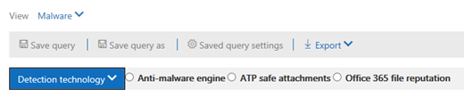

# Bedrohungs-Explorer und Echtzeiterkennungen

**Gilt für**
- [Microsoft Defender für Office 365 Plan 1 und Plan 2](https://go.microsoft.com/fwlink/?linkid=2148715)
- [Microsoft 365 Defender](https://go.microsoft.com/fwlink/?linkid=2118804)

Wenn Ihre Organisation [über Microsoft Defender für Office 365](office-365-atp.md)verfügt und Sie über die erforderlichen Berechtigungen [verfügen,](#required-licenses-and-permissions)verfügen Sie über **Explorer-** oder **Echtzeiterkennungen** (früher Echtzeitberichte *–* sehen Sie sich an, was neu [ist!).](#new-features-in-threat-explorer-and-real-time-detections) Wechseln Sie im Security & Compliance Center zu Bedrohungsverwaltung, und wählen Sie dann **Explorer**  oder  **Echtzeiterkennungen aus.**

|Mit Microsoft Defender für Office 365 Plan 2 sehen Sie:|Mit Microsoft Defender für Office 365 Plan 1 sehen Sie:|
|---|---|
|||
|

Explorer- oder Echtzeiterkennungen helfen Ihrem Sicherheitsteam dabei, Bedrohungen effizient zu untersuchen und darauf zu reagieren. Der Bericht ähnelt der folgenden Abbildung:

Mit diesem Bericht können Sie:

- [Sehen Sie sich Schadsoftware an, die von Microsoft 365-Sicherheitsfeatures erkannt wurde](#see-malware-detected-in-email-by-technology)
- [Anzeigen der Phishing-URL und Klicken auf "Verdingungsdaten"](#view-phishing-url-and-click-verdict-data)
- [Starten eines automatisierten Untersuchungs-](#start-automated-investigation-and-response) und Reaktionsprozesses aus einer Ansicht im Explorer (nur Defender für Office 365 Plan 2)
- [Untersuchen bösartiger E-Mails und vieles mehr](#more-ways-to-use-explorer-and-real-time-detections)

## Verbesserungen beim Bedrohungs-Explorer und bei Echtzeiterkennungen

### Tags im Bedrohungs-Explorer

> [!NOTE]
> Das Feature für Benutzertags befindet sich in *der Vorschau,* ist nicht für alle verfügbar und kann geändert werden. Informationen zum Veröffentlichungszeitplan finden Sie in der Microsoft 365-Roadmap.

Benutzertags identifizieren bestimmte Benutzergruppen in Microsoft Defender für Office 365. Weitere Informationen zu Tags, einschließlich Lizenzierung und Konfiguration, finden Sie unter [Benutzertags.](user-tags.md)

Im Bedrohungs-Explorer können Sie Informationen zu Benutzertags in den folgenden Benutzeroberflächen anzeigen.

#### E-Mail-Rasteransicht

Die **Spalte "Tags"** im E-Mail-Raster enthält alle Tags, die auf die Postfächer des Absenders oder Empfängers angewendet wurden. Standardmäßig werden Systemtags wie Prioritätskonten zuerst angezeigt.

> [!div class="mx-imgBorder"]
> 

#### Filtern

Sie können Tags als Filter verwenden. Suche nur über Prioritätskonten oder bestimmte Benutzertagsszenarien hinweg. Sie können auch Ergebnisse ausschließen, die bestimmte Tags enthalten. Kombinieren Sie diese Funktion mit anderen Filtern, um den Umfang der Untersuchung zu einent einengt.

> [!div class="mx-imgBorder"]
> 

#### Flyout für E-Mail-Details
Um die einzelnen Tags für Absender und Empfänger anzuzeigen, wählen Sie den Betreff aus, um das Flyout "Nachrichtendetails" zu öffnen. Auf der **Registerkarte "Zusammenfassung"** werden die Absender- und Empfängertags separat angezeigt, wenn sie für eine E-Mail vorhanden sind.
Die Informationen zu einzelnen Tags für Absender und Empfänger erstrecken sich auch auf exportierte CSV-Daten, in denen Diese Details in zwei separaten Spalten angezeigt werden.

> [!div class="mx-imgBorder"]
> 

Tagsinformationen werden auch im Flyout "URL-Klicks" angezeigt. To view it, go to Phish or All Email view and then to the **URLs** or **URL Clicks** tab. Wählen Sie ein einzelnes URL-Flyout aus, um zusätzliche Details zu Klicks für diese URL anzuzeigen, einschließlich Tags, die diesem Klick zugeordnet sind.

> [!div class="mx-imgBorder"]
> 

## Verbesserungen bei der Bedrohungssuche (anstehende)

### Aktualisierte Bedrohungsinformationen für E-Mails

Wir konzentrieren uns auf Plattform- und Datenqualitätsverbesserungen, um die Datengenauigkeit und -konsistenz für E-Mail-Datensätze zu erhöhen. Zu den Verbesserungen gehört die Konsolidierung von Pre-Delivery- und Post-Delivery-Informationen, z. B. Aktionen, die für eine E-Mail als Teil des ZAP-Prozesses ausgeführt werden, in einem einzigen Datensatz. Zusätzliche Details wie Spam-Beanstandung, Bedrohungen auf Entitätsebene (z. B. welche URL schädlich war) und aktuelle Zustellungsorte sind ebenfalls enthalten.

Nach diesen Updates wird ein einzelner Eintrag für jede Nachricht angezeigt, unabhängig von den unterschiedlichen Ereignissen nach der Zustellung, die sich auf die Nachricht auswirken. Aktionen können ZAP, manuelle Korrekturen (d. h. Administratoraktionen), dynamische Übermittlungen und vieles mehr umfassen.

Zusätzlich zur Anzeige von Schadsoftware- und Phishingbedrohungen sehen Sie die Spam-E-Mail-Nachricht. Sehen Sie in der E-Mail alle Bedrohungen, die mit der E-Mail verbunden sind, zusammen mit den entsprechenden Erkennungstechnologien. Eine E-Mail kann null, eine oder mehrere Bedrohungen haben. Die aktuellen Bedrohungen werden im Abschnitt **"Details"** des E-Mail-Flyouts angezeigt. Für mehrere Bedrohungen (z. B. Schadsoftware und Phishing) zeigt das **Tech-Feld** "Erkennung" die Zuordnung zur Bedrohungserkennung, bei der es sich um die Erkennungstechnologie handelt, die die Bedrohung identifiziert hat.

Der Satz von Erkennungstechnologien umfasst jetzt neue Erkennungsmethoden sowie Spamerkennungstechnologien. Sie können den gleichen Satz von Erkennungstechnologien verwenden, um die Ergebnisse in den verschiedenen E-Mail-Ansichten zu filtern (Schadsoftware, Phishing, alle E-Mails).

> [!NOTE]
> Die Analyse der Prüfung ist möglicherweise nicht unbedingt an Entitäten gebunden. Beispielsweise kann eine E-Mail als Phishing oder Spam klassifiziert werden, aber es gibt keine URLs, die mit einer Phishing-/Spam-Bewichtung gestempelt sind. Dies liegt daran, dass die Filter auch Inhalte und andere Details für eine E-Mail auswerten, bevor sie eine Bewertung zuweisen.

#### Bedrohungen in URLs

Sie können nun die spezifische Bedrohung für eine  URL auf der Registerkarte "E-Mail-Flyoutdetails" anzeigen. Die Bedrohung kann *Schadsoftware,* *Phishing,* *Spam* oder *keine sein.)*

> [!div class="mx-imgBorder"]
> 

### Aktualisierte Zeitachsenansicht (anstehende)

> [!div class="mx-imgBorder"]
> 

Die Zeitachsenansicht identifiziert alle Zustellungs- und Nachzustellungsereignisse. Sie enthält Informationen zur Bedrohung, die zu diesem Zeitpunkt für eine Teilmenge dieser Ereignisse identifiziert wurde. Die Zeitachsenansicht enthält außerdem Informationen zu allen zusätzlichen Maßnahmen (z. B. ZAP oder manuelle Korrektur), zusammen mit dem Ergebnis dieser Aktion. Die Informationen zur Zeitachsenansicht umfassen:

- **Quelle:** Quelle des Ereignisses. Es kann administrator/system/user sein.
- **Ereignis:** Umfasst Ereignisse auf oberster Ebene wie originale Zustellung, manuelle Wartung, ZAP, Übermittlungen und dynamische Übermittlung.
- **Aktion:** Die spezifische Aktion, die im Rahmen der ZAP- oder Administratoraktion (z. B. soft delete) ergriffen wurde.
- **Bedrohungen:** Deckt die Bedrohungen (Schadsoftware, Phishing, Spam) ab, die zu diesem Zeitpunkt identifiziert wurden.
- **Ergebnis/Details:** Weitere Informationen zum Ergebnis der Aktion, z. B. ob sie als Teil der ZAP-/Administratoraktion ausgeführt wurde.

### Ursprünglicher und aktueller Übermittlungsort

Derzeit wird der Übermittlungsort im E-Mail-Raster und im E-Mail-Flyout angezeigt. Das **Feld "Zustellungsspeicherort"** wird in **_"Ursprünglicher Zustellungsspeicherort"_*umbenannt. Und wir stellen ein weiteres Feld vor: _*_Letzte Übermittlungsadresse._**

**Der ursprüngliche Zustellungsort** liefert weitere Informationen darüber, wo eine E-Mail ursprünglich zugestellt wurde. **Der aktuelle Zustellungsspeicherort** gibt an, wo eine E-Mail nach Systemaktionen wie *ZAP* oder Administratoraktionen wie "In gelöschte *Elemente verschieben" gelandet ist.* Der neueste Zustellungsspeicherort dient dazu, Administratoren den letzten bekannten Speicherort der Nachricht nach der Zustellung oder System-/Administratoraktionen zu informieren. Er enthält keine Endbenutzeraktionen für die E-Mail. Wenn ein Benutzer beispielsweise eine Nachricht gelöscht oder in ein Archiv/pst verschoben hat, wird der Nachrichtenspeicherort "Zustellung" nicht aktualisiert. Wenn jedoch eine Systemaktion den Speicherort aktualisiert (z. B. ZAP, was dazu führt, dass eine E-Mail in Quarantäne verschoben **wird),** würde der letzte Zustellungsspeicherort als "Quarantäne" anzeigen.

> [!div class="mx-imgBorder"]
> 

> [!NOTE]
> Es gibt einige Fälle, in denen **Der** Zustellungsort und die **Zustellungsaktion** als "unbekannt" anzeigen können:
>
> - Möglicherweise wird  der Zustellungsspeicherort  als "zugestellt" und der Zustellungsspeicherort als "unbekannt" angezeigt, wenn die Nachricht zugestellt wurde, aber eine Posteingangsregel die Nachricht in einen Standardordner (z. B. Entwurf oder Archiv) anstatt in den Ordner "Posteingang" oder "Junk-E-Mail" verschoben hat.
>
> - **Der aktuelle Zustellungsspeicherort** kann unbekannt sein, wenn eine Administrator-/Systemaktion (z. B. ZAP) versucht wurde, die Nachricht jedoch nicht gefunden wurde. In der Regel erfolgt die Aktion, nachdem der Benutzer die Nachricht verschoben oder gelöscht hat. Überprüfen Sie in solchen Fällen die Spalte **"Ergebnis/Details"** in der Zeitachsenansicht. Suchen Sie nach der Anweisung "Nachricht wurde vom Benutzer verschoben oder gelöscht".

> [!div class="mx-imgBorder"]
> 

### Zusätzliche Aktionen

*Zusätzliche Aktionen* wurden nach der Zustellung der E-Mail angewendet. Sie können *ZAP,* manuelle Korrektur *(von* einem Administrator ergriffene Aktion wie soft *delete),* dynamische Zustellung und wiederverarbeitete  (für eine E-Mail, die als erfolgreich erkannt wurde) umfassen.

> [!NOTE]
> - Im Rahmen der ausstehenden Änderungen wird der wert "Entfernt von ZAP", der derzeit im Filter "Zustellungsaktion" angezeigt wird, entfernt. Sie haben eine Möglichkeit, mit dem ZAP-Versuch über zusätzliche Aktionen nach allen E-Mails **zu suchen.**
>
> - Es gibt neue Felder und Werte für Erkennungstechnologien **und** **zusätzliche Aktionen** (insbesondere für ZAP-Szenarien). Sie müssen Ihre vorhandenen gespeicherten und nachverfolgten Abfragen auswerten, um sicherzustellen, dass sie mit den neuen Werten funktionieren.

> [!div class="mx-imgBorder"]

> 

### Systemüberschreibungen

*Systemüberschreibungen* ermöglichen es Ihnen, Ausnahmen vom beabsichtigten Zustellungsort einer Nachricht zu machen. Sie setzen den vom System bereitgestellten Übermittlungsort basierend auf den Bedrohungen und anderen Erkennungen außer Kraft, die vom Filterstapel identifiziert werden. Systemüberschreibungen können über eine Mandanten- oder Benutzerrichtlinie festgelegt werden, um die Nachricht wie von der Richtlinie vorgeschlagen zu senden. Außerkraftsetzungen können die unbeabsichtigte Zustellung schädlicher Nachrichten aufgrund von Konfigurationslücken identifizieren, z. B. eine zu umfassende Richtlinie für sichere Absender, die von einem Benutzer festgelegt wurde. Diese Überschreibungswerte können wie die folgenden sein:

- Durch Benutzerrichtlinie zugelassen: Ein Benutzer erstellt Richtlinien auf Postfachebene, um Domänen oder Absender zu erlauben.
- Durch Benutzerrichtlinie blockiert: Ein Benutzer erstellt Richtlinien auf E-Mail-Feldebene, um Domänen oder Absender zu blockieren.
- Zulässig durch die Organisationsrichtlinie: Die Sicherheitsteams der Organisation legen Richtlinien oder Exchange-Nachrichtenflussregeln (auch als Transportregeln bezeichnet) fest, um Absendern und Domänen für Benutzer in ihrer Organisation zu erlauben. Dies kann für eine Gruppe von Benutzern oder die gesamte Organisation sein.
- Durch Organisationsrichtlinie blockiert: Die Sicherheitsteams der Organisation legen Richtlinien oder Nachrichtenflussregeln zum Blockieren von Absendern, Domänen, Nachrichtensprachen oder Quell-IPs für Benutzer in ihrer Organisation bereit. Dies kann auf eine Gruppe von Benutzern oder die gesamte Organisation angewendet werden.
- Durch die Organisationsrichtlinie blockierte Dateierweiterung: Das Sicherheitsteam einer Organisation blockiert eine Dateinamenerweiterung über die Ansoftwarerichtlinieneinstellungen. Diese Werte werden nun als Hilfe bei Untersuchungen in E-Mail-Details angezeigt. Secops teams can also use the rich-filtering capability to filter on blocked file extensions.

> [!div class="mx-imgBorder"]
> 

### Verbesserungen bei der URL- und Klickerfahrung

Zu den Verbesserungen gehören:

- Zeigen Sie die vollständig geklickte URL (einschließlich aller Abfrageparameter, die Teil der URL sind) im Abschnitt **"Klicks"** des URL-Flyouts an. Derzeit werden die URL-Domäne und der Pfad in der Titelleiste angezeigt. Wir erweitern diese Informationen so, dass die vollständige URL angezeigt wird.

- Korrekturen in allen URL-Filtern (*URL* *im* Vergleich zu URL-Domäne im Vergleich zu *URL-Domäne* und -Pfad): Die Updates wirken sich auf die Suche nach Nachrichten aus, die eine URL/Klick-Empfehlung enthalten. Wir haben die Unterstützung für protokollagnostische Suchen aktiviert, sodass Sie nach einer URL suchen können, ohne sie zu `http` verwenden. Standardmäßig ist die URL-Suche http-zuordnungen, es sei denn, ein anderer Wert ist explizit angegeben. Beispiel:

   -  Suchen Sie mit und ohne Präfix in den Feldern `http://` **"URL",** **"URL-Domäne"** und **"URL-Domäne" und "Pfad".** Die Suchbegriffe sollten dieselben Ergebnisse anzeigen.

   -  Suchen Sie in `https://` der URL nach dem **Präfix.** Wenn kein Wert angegeben wird, wird `http://` das Präfix angenommen.

   - `/` wird am Anfang und Ende der **Felder "URL-Pfad",** **"URL-Domäne",** **"URL-Domäne" und "Pfad"** ignoriert. `/`am Ende des  URL-Felds wird ignoriert.

### Phish Confidence Level

Die Phish confidence level hilft, den Grad der Konfidenz zu identifizieren, mit dem eine E-Mail als "Phishing" kategorisiert wurde. Die beiden möglichen Werte sind *"High"* und *"Normal".* In den ersten Phasen ist dieser Filter nur in der Phishingansicht des Bedrohungs-Explorers verfügbar.

### ZAP-URL-Signal

Das ZAP-URL-Signal wird in der Regel für ZAP-Phishing-Warnungsszenarien verwendet, in denen eine E-Mail nach der Zustellung als Phishing identifiziert und entfernt wurde. Dieses Signal verbindet die Warnung mit den entsprechenden Ergebnissen im Explorer. Es ist einer der IOCs für die Warnung.

Um den Suchesprozess zu verbessern, haben wir den Bedrohungs-Explorer und Die Erkennungen in Echtzeit aktualisiert, um die Suche konsistenter zu machen. Die Änderungen werden hier beschrieben:

- [Zeitzonenverbesserungen](#timezone-improvements)
- [Aktualisieren im Aktualisierungsprozess](#update-in-the-refresh-process)
- [Diagramm-Drilldown zum Hinzufügen zu Filtern](#chart-drilldown-to-add-to-filters)
- [In Produktinformationsupdates](#in-product-information-updates)

### Filtern nach Benutzertags

Sie können jetzt system- oder benutzerdefinierte Benutzertags sortieren und filtern, um den Umfang der Bedrohungen schnell zu erkennen. Weitere Informationen finden Sie unter [Benutzertags.](user-tags.md)

> [!IMPORTANT]
> Das Filtern und Sortieren nach Benutzertags befindet sich derzeit in der öffentlichen Vorschau. Diese Funktion kann vor der kommerziellen Enignung erheblich geändert werden. Microsoft über garantiert keine ausdrücklichen oder impliziten Gewährleistungen hinsichtlich der bereitgestellten Informationen.

### Zeitzonenverbesserungen

Sie sehen die Zeitzone für die E-Mail-Datensätze im Portal sowie für exportierte Daten. Sie wird in allen Benen wie E-Mail-Raster, Details-Flyout, E-Mail-Zeitachse und ähnliche E-Mails sichtbar sein, sodass die Zeitzone für das Ergebnissatz klar ist.

> [!div class="mx-imgBorder"]
> 

### Aktualisieren im Aktualisierungsprozess

Einige Benutzer haben Verwirrung bei der automatischen Aktualisierung (z. B. bei Änderung des Datums, aktualisieren der Seite) und manuellen Aktualisierungen (für andere Filter) kommentiert. Entsprechend führt das Entfernen von Filtern zu einer automatischen Aktualisierung. Das Ändern von Filtern beim Ändern der Abfrage kann zu inkonsistenten Sucherfahrungen führen. Um diese Probleme zu beheben, verwenden wir einen manuellen Filtermechanismus.

Aus Sicht der Benutzererfahrung kann der Benutzer den verschiedenen Filterbereich anwenden und entfernen (aus dem Filtersatz und Datum) und die Aktualisierungsschaltfläche auswählen, um die Ergebnisse zu filtern, nachdem er die Abfrage definiert hat. Die Schaltfläche "Aktualisieren" wird jetzt auch auf dem Bildschirm hervorgehoben. Außerdem haben wir die zugehörigen QuickInfos und Produktdokumentation aktualisiert.

> [!div class="mx-imgBorder"]
> 

### Diagramm-Drilldown zum Hinzufügen zu Filtern

Sie können jetzt Legendenwerte diagrammieren, um sie als Filter hinzuzufügen. Wählen Sie die **Schaltfläche "Aktualisieren"** aus, um die Ergebnisse zu filtern.

> [!div class="mx-imgBorder"]
> 

### Produktinteg-Informationsupdates

Zusätzliche Details sind jetzt im Produkt verfügbar, z. B. die Gesamtanzahl der Suchergebnisse innerhalb des Rasters (siehe unten). Wir haben Bezeichnungen, Fehlermeldungen und QuickInfos verbessert, um weitere Informationen zu Filtern, Sucherfahrung und Ergebnissatz zur Verfügung zu stellen.

> [!div class="mx-imgBorder"]
> 

## Erweiterte Funktionen im Bedrohungs-Explorer

### Benutzer mit den meisten Zielbenutzern

Heute stellen wir die Liste der benutzer am besten geeigneten Benutzer in der Ansicht "Schadsoftware" für E-Mails im Abschnitt "Top **Malware Families"** zur Verfügung. Wir erweitern diese Ansicht auch in den Ansichten "Phishing" und "Alle E-Mail". Sie können die top-5-Zielbenutzer zusammen mit der Anzahl der Versuche für jeden Benutzer für die entsprechende Ansicht anzeigen. For example, for phish view, you'll see the number of Phish attempts.

Sie können die Liste der Zielbenutzer bis zu einem Grenzwert von 3.000 zusammen mit der Anzahl der Offlineanalyseversuche für jede E-Mail-Ansicht exportieren. Darüber hinaus wird durch Auswählen der Anzahl von Versuchen (z. B. 13 Versuche in der abbildung unten) eine gefilterte Ansicht im Bedrohungs-Explorer geöffnet, sodass Sie weitere Details in E-Mails und Bedrohungen für diesen Benutzer sehen können.

> [!div class="mx-imgBorder"]
> 

### Exchange-Transportregeln

Im Rahmen der Datenanreicherung können Sie alle verschiedenen Exchange-Transportregeln (ETR) anzeigen, die auf eine Nachricht angewendet wurden. Diese Informationen sind in der E-Mail-Rasteransicht verfügbar. Um es anzuzeigen, wählen **Sie Spaltenoptionen** im Raster aus, und fügen Sie dann die **Exchange-Transportregel** aus den Spaltenoptionen hinzu. Sie wird auch im Flyout **"Details"** in der E-Mail angezeigt.

Sie können sowohl die GUID als auch den Namen der Transportregeln anzeigen, die auf die Nachricht angewendet wurden. Sie können mithilfe des Namens der Transportregel nach den Nachrichten suchen. Dies ist eine "Enthält"-Suche, was bedeutet, dass Sie auch teilsuchen können.

#### Wichtiger Hinweis:

Die ETR-Suche und -Namensverfügbarkeit hängen von der spezifischen Rolle ab, die Ihnen zugewiesen ist. Sie benötigen eine der folgenden Rollen/Berechtigungen, um die Namen und die Suche von ETR anzeigen zu können. Wenn Ihnen keine dieser Rollen zugewiesen ist, können Sie die Namen der Transportregeln nicht anzeigen oder mithilfe von ETR-Namen nach Nachrichten suchen. In den E-Mail-Details sind jedoch die ETR-Bezeichnung und die GUID-Informationen enthalten. Andere Aufzeichnungsanzeigen in E-Mail-Rastern, E-Mail-Flyouts, Filtern und Export sind nicht betroffen.

- Nur EXO – Verhinderung von Datenverlust: Alle
- Nur EXO – O365SupportViewConfig: Alle
- Microsoft Azure Active Directory oder EXO – Sicherheitsadministrator: Alle
- AAD oder EXO – Security Reader: Alle
- Nur EXO – Transportregeln: Alle
- Nur EXO – View-Only Konfiguration: Alle

Im E-Mail-Raster, im Detailf flyout und im exportierten CSV wird den ETRs wie unten dargestellt ein Name/eine GUID angezeigt.

> [!div class="mx-imgBorder"]
> 

### Eingehende Connectors

Connectors sind eine Sammlung von Anweisungen, die anpassen, wie Ihre E-Mails zu und von Ihrer Microsoft 365- oder Office 365-Organisation fließen. Sie ermöglichen es Ihnen, alle Sicherheitseinschränkungen oder -kontrollen anzuwenden. Im Bedrohungs-Explorer können Sie jetzt die Connectors anzeigen, die sich auf eine E-Mail-Nachricht bezogen haben, und mithilfe von Connectornamen nach E-Mails suchen.

Die Suche nach Connectors ist "enthält", was bedeutet, dass auch teilweise Stichwortsuchen funktionieren sollten. In der Hauptrasteransicht, im Detailf flyout und in der exportierten CSV werden die Connectors im Namens-/GUID-Format angezeigt, wie hier gezeigt:

> [!div class="mx-imgBorder"]
> 

## Neue Features im Bedrohungs-Explorer und Echtzeiterkennungen

Im Bedrohungs-Explorer und in Echtzeit sind drei neue Features verfügbar:

- [Vorschau des E-Mail-Headers und Herunterladen des E-Mail-Textkörpers](#preview-email-header-and-download-email-body)
- [E-Mail-Zeitachse](#email-timeline)
- [Exportieren von URL-Klickdaten](#export-url-click-data)

Diese neuen Features werden im Folgenden beschrieben.

### Vorschau des E-Mail-Headers und Herunterladen des E-Mail-Textkörpers

Sie können jetzt eine Vorschau eines E-Mail-Headers anzeigen und den E-Mail-Textkörper im Bedrohungs-Explorer herunterladen. Administratoren können heruntergeladene Kopfzeilen/E-Mail-Nachrichten auf Bedrohungen analysieren. Da beim Herunterladen von E-Mail-Nachrichten das Risiko von Informationen besteht, wird dieser Prozess durch die rollenbasierte Zugriffssteuerung (RBAC) gesteuert. Eine neue Rolle, *Vorschau*, muss einer anderen Rollengruppe (z. B. Sicherheitsvorgänge oder Sicherheitsadministrator) hinzugefügt werden, um das Herunterladen von E-Mails in der Ansicht für alle E-Mail-Nachrichten zu gewähren. Das Anzeigen des E-Mail-Headers erfordert jedoch keine zusätzliche Rolle (nur das, was zum Anzeigen von Nachrichten im Bedrohungs-Explorer erforderlich ist).

Explorer- und Echtzeiterkennungen erhalten auch neue Felder, die ein vollständigeres Bild davon liefern, wo Ihre E-Mail-Nachrichten landen. Diese Änderungen erleichtern die Suche für Sicherheits-Ops. Das Wichtigste ist jedoch, dass Sie den Speicherort von problematischen E-Mail-Nachrichten auf einen Blick kennen.

Wie wird dies durchgeführt? Der Zustellungsstatus ist nun in zwei Spalten aufgeschlüsselt:

- **Zustellungsaktion** – Status der E-Mail.
- **Zustellungsspeicherort** : Der Ort, an den die E-Mail geroutet wurde.

*Übermittlungsaktion* ist die Aktion, die aufgrund vorhandener Richtlinien oder Erkennungen für eine E-Mail-Nachricht ergriffen wird. Hier sind die möglichen Aktionen für eine E-Mail:

|Zugestellt|Junk-E-Mail|Gesperrt|Ersetzt|
|---|---|---|---|
|E-Mails wurden an den Posteingang oder Ordner eines Benutzers übermittelt, und der Benutzer kann darauf zugreifen.|E-Mails wurden an den Junk- oder Gelöschten Ordner des Benutzers gesendet, und der Benutzer kann darauf zugreifen.|E-Mails, die unter Quarantäne gestellt werden, die fehlgeschlagen sind oder gelöscht wurden. Auf diese E-Mails kann der Benutzer nicht zugegriffen werden.|E-Mail-Anlagen wurden durch TXT-Dateien ersetzt, in deren Zustand die Anlage schadhaft war.|

Dies ist, was der Benutzer sehen kann und was er nicht sehen kann:

|Für Endbenutzer zugänglich|Endbenutzern nicht zugänglich|
|---|---|
|Zugestellt|Gesperrt|
|Junk-E-Mail|Ersetzt|

**Der Zustellungsspeicherort** zeigt die Ergebnisse von Richtlinien und Erkennungen an, die nach der Zustellung ausgeführt werden. Sie ist mit der **_Zustellungsaktion verknüpft._** Dies sind die möglichen Werte:

- *Posteingang oder Ordner:* Die E-Mail befindet sich im Posteingang oder in einem Ordner (gemäß Ihren E-Mail-Regeln).
- *Lokal oder extern:* Das Postfach ist nicht in der Cloud vorhanden, sondern lokal.
- *Junk-Ordner:* Die E-Mail befindet sich im Junk-E-Mail-Ordner eines Benutzers.
- *Ordner "Gelöschte Elemente":* Die E-Mail im Ordner "Gelöschte Elemente" eines Benutzers.
- *Quarantäne:* Die E-Mail befindet sich in Quarantäne und befindet sich nicht im Postfach eines Benutzers.
- *Fehler:* Die E-Mail konnte das Postfach nicht erreichen.
- *Dropped*: Die E-Mail ist an einer Stelle im Nachrichtenfluss verloren gegangen.

### E-Mail-Zeitachse

Die **E-Mail-Zeitachse** ist ein neues Explorer-Feature, das die Suche für Administratoren verbessert. Damit wird die Zeit für die Überprüfung verschiedener Orte reduziert, um zu versuchen, das Ereignis zu verstehen. Wenn beim Eintreffen einer E-Mail mehrere Ereignisse auftreten oder nah beieintreffen, werden diese Ereignisse in einer Zeitachsenansicht angezeigt. Einige Ereignisse, die nach der E-Mail-Zustellung auftreten, werden in der Spalte **"Spezielle Aktion"** erfasst. Administratoren können Informationen aus der Zeitachse mit der speziellen Aktion für die E-Mail-Nachzustellung kombinieren, um Einen Einblick in die Funktionsweise ihrer Richtlinien, den Ort der endgültigen Übermittlung der E-Mails und in einigen Fällen die endgültige Bewertung zu erhalten.

Weitere Informationen finden Sie unter Untersuchen und Behebung bösartiger E-Mails, [die in Office 365 zugestellt wurden.](investigate-malicious-email-that-was-delivered.md)

### Exportieren von URL-Klickdaten

Sie können jetzt Berichte für URL-Klicks  nach Microsoft Excel exportieren, um deren Netzwerknachrichten-ID anzeigen und auf **"Verdingung"** klicken, um zu erläutern, wo Ihr URL-Klickdatenverkehr stammt. So funktioniert's: Folgen Sie in Threat Management auf der Office 365-Schnellstartleiste dieser Kette:

**Explorer** \> **Phish anzeigen** \> **Klicks** \> **Die obersten URLs oder** **url-oberen Klicks** \> wählen einen beliebigen Datensatz aus, um das Url-Flyout zu öffnen.

Wenn Sie eine URL in der Liste auswählen, wird im Flyoutbereich eine neue Schaltfläche "Exportieren" angezeigt.  Verwenden Sie diese Schaltfläche, um Daten zur einfacheren Berichterstellung in eine Excel-Kalkulationstabelle zu verschieben.

Führen Sie diesen Pfad aus, um zum gleichen Speicherort im Bericht über Echtzeiterkennungen zu kommen:

**Explorer** \> **Echtzeiterkennungen** \> **Phish anzeigen** \> **URLs** \> **Top-URLs oder** **Klicks am oberen Rand** Wählen Sie einen beliebigen Datensatz aus, um das Flyout "URL" zu öffnen, und navigieren Sie zur Registerkarte \> \> **"Klicks".**

> [!TIP]
> Die Netzwerknachrichten-ID ordnet das Zurückklicken bestimmten E-Mails zu, wenn Sie über Explorer oder zugeordnete Drittanbietertools nach der ID suchen. Solche Suchen identifizieren die E-Mail,die einem Klickergebnis zugeordnet ist. Die Korrelierte Netzwerknachrichten-ID ermöglicht eine schnellere und leistungsfähigere Analyse.

> [!div class="mx-imgBorder"]
> 

## Schadsoftware in E-Mails nach Technologie erkennen

Angenommen, Sie möchten Schadsoftware in E-Mails nach Microsoft 365-Technologie sortiert sehen. Verwenden Sie dazu  die Ansicht "E-Mail-> Schadsoftware" des Explorers (oder Echtzeiterkennungen).

1. Wählen Sie im Security & Compliance Center ( <https://protection.office.com> ) den Bedrohungsverwaltungs-Explorer  \>  (oder **Echtzeiterkennungen) aus.** (In diesem Beispiel wird Explorer verwendet.)

2. Wählen Sie **im Menü** "Ansicht" die Option **"E-Mail-Schadsoftware"** \> **aus.**

   > [!div class="mx-imgBorder"]
   > 

3. Klicken Sie **auf "Absender",** und wählen Sie dann **"Basiserkennungstechnologie"** \> **aus.**

   Ihre Erkennungstechnologien sind jetzt als Filter für den Bericht verfügbar.

   > [!div class="mx-imgBorder"]
   > 

4. Wählen Sie eine Option aus. Wählen Sie dann die Schaltfläche **"Aktualisieren"** aus, um diesen Filter anzuwenden.

   > [!div class="mx-imgBorder"]
   > 

Der Bericht wird aktualisiert, um die Ergebnisse der in E-Mails erkannten Schadsoftware mithilfe der ausgewählten Technologieoption zu zeigen. Von hier aus können Sie weitere Analysen durchführen.

## Anzeigen der Phishing-URL und Klicken auf "Verdingungsdaten"

Angenommen, Sie möchten Phishingversuche über URLs in E-Mails sehen, einschließlich einer Liste der URLs, die zugelassen, blockiert und außer Kraft gesetzt wurden. Zum Identifizieren von URLs, auf die geklickt [wurde,](atp-safe-links.md) müssen sichere Links konfiguriert werden. Stellen Sie sicher, dass Sie [Richtlinien](set-up-atp-safe-links-policies.md) für sichere Links für den Zeitpunkt des Klickschutzes und die Protokollierung von Klickveranschlagungen durch sichere Links eingerichtet haben.

Um Phishing-URLs in Nachrichten zu überprüfen und auf URLs in Phishingnachrichten zu klicken, verwenden Sie die E-Mail-Phishingansicht des Explorers oder Echtzeiterkennungen. [   >   ](threat-explorer-views.md#email--phish)

1. Wählen Sie im Security & Compliance Center ( <https://protection.office.com> ) den Bedrohungsverwaltungs-Explorer  \>  (oder **Echtzeiterkennungen) aus.** (In diesem Beispiel wird Explorer verwendet.)

2. Wählen Sie **im Menü** "Ansicht" die Option **"E-Mail-Phishing"** \> **aus.**

   > [!div class="mx-imgBorder"]
   > 

3. Klicken **Sie auf "Absender",** und wählen Sie **dann "URLs" aus.** \> 

4. Wählen Sie eine oder  mehrere Optionen aus, z. B. blockiert und **blockiert,** und wählen Sie dann die Schaltfläche "Aktualisieren" in derselben Zeile wie die Optionen aus, um diesen Filter anzuwenden.  (Aktualisieren Sie das Browserfenster nicht.)

   > [!div class="mx-imgBorder"]
   > 

   Der Bericht wird aktualisiert, um zwei unterschiedliche URL-Tabellen auf der Registerkarte "URL" unter dem Bericht anzeigen zu können:

   - **Die urLs sind** die URLs in den Nachrichten, auf die Sie gefiltert haben, und die Anzahl der E-Mail-Übermittlungsaktion für jede URL. In der Phishing-E-Mail-Ansicht enthält diese Liste in der Regel legitime URLs. Angreifer fügen eine Mischung aus guten und schlechten URLs in ihre Nachrichten ein, um zu versuchen, sie zugestellt zu bekommen, aber sie machen die schädlichen Links interessanter. Die Tabelle der URLs wird nach der Gesamtzahl der E-Mails sortiert, diese Spalte ist jedoch ausgeblendet, um die Ansicht zu vereinfachen.

   - **Bei den am besten geklickten** URLs handelt es sich um sichere Links gepackte URLs, sortiert nach Der Gesamtzahl der Klicks. Diese Spalte wird auch nicht angezeigt, um die Ansicht zu vereinfachen. Die Gesamtanzahl nach Spalte gibt die Anzahl der Klicks auf sichere Links für jede geklickte URL an. In der Phishing-E-Mail-Ansicht sind diese in der Regel verdächtige oder schädliche URLs. Die Ansicht kann jedoch URLs enthalten, die keine Bedrohungen sind, aber in Phishingnachrichten enthalten sind. Url-Klicks auf nicht gepackte Links werden hier nicht angezeigt.

   Die beiden URL-Tabellen enthalten die am besten verwendeten URLs in Phishing-E-Mail-Nachrichten nach Zustellungsaktion und Ort. Die Tabellen enthalten URL-Klicks, die trotz einer Warnung blockiert oder besucht wurden, sodass Sie sehen können, welche potenziellen ungültigen Links benutzern angezeigt wurden und auf die der Benutzer geklickt hat. Von hier aus können Sie weitere Analysen durchführen. Unterhalb des Diagramms sehen Sie beispielsweise die am besten verwendeten URLs in E-Mail-Nachrichten, die in der Umgebung Ihrer Organisation blockiert wurden.

   > [!div class="mx-imgBorder"]
   > 

   Wählen Sie eine URL aus, um ausführlichere Informationen anzeigen zu können.

   > [!NOTE]
   > Im Dialogfeld "URL-Flyout" wird die Filterung nach E-Mail-Nachrichten entfernt, um den vollständigen Überblick über die Gefährdung der URL in Ihrer Umgebung anzuzeigen. Auf diese Weise können Sie nach E-Mail-Nachrichten filtern, über die Sie im Explorer besorgt sind, bestimmte URLs suchen, die potenzielle Bedrohungen sind, und dann Ihr Verständnis der URL-Belichtung in Ihrer Umgebung (über das Dialogfeld "URL-Details") erweitern, ohne der Exploreransicht selbst URL-Filter hinzufügen zu müssen.

### Interpretation von Klickverkündungen

Innerhalb der Flyouts "E-Mail" oder "URL", "Top-Clicks" und "Filterfunktionen" werden unterschiedliche Klick-/Verdingungswerte angezeigt:

- **Keine:** Die Bekündung für die URL kann nicht erfasst werden. Möglicherweise hat der Benutzer auf die URL geklickt.
- **Zulässig:** Der Benutzer konnte zur URL navigieren.
- **Blockiert:** Der Benutzer wurde am Navigieren zur URL blockiert.
- **Ausstehendes Diktat:** Dem Benutzer wurde die Seite mit ausstehender Detonation angezeigt.
- **Blockiert außer Kraft gesetzt:** Der Benutzer konnte nicht direkt zur URL navigieren. Der Benutzer hat den Block jedoch überrutet, um zur URL zu navigieren.
- **Ausstehendes Diktat umgangen:** Dem Benutzer wurde die Detonationsseite angezeigt. Der Benutzer hat die Nachricht jedoch überbeutet, um auf die URL zu zugreifen.
- **Fehler:** Dem Benutzer wurde die Fehlerseite angezeigt, oder es ist ein Fehler bei der Erfassung des Ergebnisses aufgetreten.
- **Fehler:** Beim Erfassen der Bekündung ist eine unbekannte Ausnahme aufgetreten. Möglicherweise hat der Benutzer auf die URL geklickt.

## Überprüfen von E-Mail-Nachrichten, die von Benutzern gemeldet wurden

Angenommen, Sie möchten [E-Mail-Nachrichten](enable-the-report-message-add-in.md) *anzeigen,* die Benutzer in Ihrer Organisation über das Add-in "Nachricht melden" oder das Phishing-Add-In "Melden" als Junk, nicht als Junk oder *Als* Phishing [gemeldet haben.](enable-the-report-phish-add-in.md) Um sie zu sehen, verwenden Sie die Ansicht [ **"E-Mail-Übermittlungen"** des  >  **Explorers**](threat-explorer-views.md#email--submissions) (oder Erkennungen in Echtzeit).

1. Wählen Sie im Security & Compliance Center ( <https://protection.office.com> ) den Bedrohungsverwaltungs-Explorer  \>  (oder **Echtzeiterkennungen) aus.** (In diesem Beispiel wird Explorer verwendet.)

2. Wählen Sie **im Menü** "Ansicht" die Option **"E-Mail-Übermittlungen"** \> **aus.**

   > [!div class="mx-imgBorder"]
   > 

3. Klicken Sie **auf "Absender",** und wählen Sie dann  \> **"Standardberichtstyp" aus.**

4. Wählen Sie eine Option wie **"Phishing"** aus, und wählen Sie dann die Schaltfläche **"Aktualisieren"** aus.

   > [!div class="mx-imgBorder"]
   > 

Der Bericht wird aktualisiert, um Daten zu E-Mail-Nachrichten zu zeigen, die Personen in Ihrer Organisation als Phishingversuch gemeldet haben. Sie können diese Informationen verwenden, um weitere Analysen durchzuführen und bei Bedarf Ihre [Antiphishingrichtlinien in Microsoft Defender für Office 365 anzupassen.](configure-atp-anti-phishing-policies.md)

## Starten der automatischen Untersuchung und Reaktion

> [!NOTE]
> Automatisierte Untersuchungs- und Reaktionsfunktionen sind in *Microsoft Defender für Office 365 Plan 2* und Office *365 E5 verfügbar.*

[Eine automatisierte Untersuchung und Reaktion](automated-investigation-response-office.md) kann Ihrem Sicherheitsteam Zeit und Aufwand für die Untersuchung und Abwehr von Cyberangriffen sparen. Zusätzlich zum Konfigurieren von Warnungen, die ein Sicherheits-Playbook auslösen können, können Sie einen automatisierten Untersuchungs- und Reaktionsprozess aus einer Ansicht im Explorer starten. Weitere Informationen finden Sie im [Beispiel: Ein Sicherheitsadministrator löst eine Untersuchung von Explorer aus.](automated-investigation-response-office.md#example-a-security-administrator-triggers-an-investigation-from-threat-explorer)

## Weitere Möglichkeiten zur Verwendung von Explorer- und Echtzeiterkennungen

Zusätzlich zu den in diesem Artikel beschriebenen Szenarien stehen im Explorer (oder in Echtzeiterkennungen) noch viele weitere Berichtsoptionen zur Verfügung. Lesen Sie die folgenden Artikel:

- [Suchen und Untersuchen von bösartigen E-Mails, die zugestellt wurden](investigate-malicious-email-that-was-delivered.md)
- [Anzeigen bösartiger Dateien, die in SharePoint Online, OneDrive und Microsoft Teams erkannt wurden](malicious-files-detected-in-spo-odb-or-teams.md)
- [Übersicht über die Ansichten im Bedrohungs-Explorer (und Echtzeiterkennungen)](threat-explorer-views.md)
- [Threat Protection-Statusbericht](view-email-security-reports.md#threat-protection-status-report)
- [Automatische Untersuchung und Reaktion in Microsoft Threat Protection](https://docs.microsoft.com/microsoft-365/security/mtp/mtp-autoir)

## Erforderliche Lizenzen und Berechtigungen

Sie müssen [über Microsoft Defender für Office 365 verfügen,](office-365-atp.md) um Explorer oder Echtzeiterkennungen verwenden zu können.

- Explorer ist in Defender für Office 365 Plan 2 enthalten.
- Der Bericht über Echtzeiterkennungen ist in Defender für Office 365 Plan 1 enthalten.
- Planen Sie die Zuweisung von Lizenzen für alle Benutzer, die von Defender für Office 365 geschützt werden sollen. Explorer- und Echtzeiterkennungen zeigen Erkennungsdaten für lizenzierte Benutzer an.

Zum Anzeigen und Verwenden von Explorer- oder Echtzeiterkennungen müssen Sie über die entsprechenden Berechtigungen verfügen, z. B. die Berechtigungen, die einem Sicherheitsadministrator oder einem Sicherheitsleseprogramm erteilt wurden.

- Für das Security & Compliance Center muss eine der folgenden Rollen zugewiesen sein:

  - Organisationsverwaltung
  - Sicherheitsadministrator (kann im Azure Active Directory Admin Center zugewiesen werden ( <https://aad.portal.azure.com> )
  - Sicherheitsleseberechtigter

- Für Exchange Online muss eine der folgenden Rollen entweder im Exchange Admin Center ( ) oder <https://admin.protection.outlook.com/ecp/> [in Exchange Online PowerShell zugewiesen sein:](https://docs.microsoft.com/powershell/exchange/exchange-online-powershell)

  - Organisationsverwaltung
  - Organisationsverwaltung – nur Leserechte
  - Schreibgeschützte Empfänger
  - Complianceverwaltung

Weitere Informationen zu Rollen und Berechtigungen finden Sie in den folgenden Ressourcen:

- [Berechtigungen im Security & Compliance Center](permissions-in-the-security-and-compliance-center.md)
- [Featureberechtigungen in Exchange Online](https://docs.microsoft.com/exchange/permissions-exo/feature-permissions)

## Unterschiede zwischen Bedrohungs-Explorer und Echtzeiterkennung

- Der *Bericht über Echtzeiterkennungen* ist in Defender für Office 365 Plan 1 verfügbar. *Der Bedrohungs-Explorer* ist in Defender für Office 365 Plan 2 verfügbar.
- Im Bericht über Echtzeiterkennungen können Sie Erkennungen in Echtzeit anzeigen. Der Bedrohungs-Explorer führt dies ebenfalls aus, bietet aber auch zusätzliche Details für einen bestimmten Angriff.
- Eine *Ansicht "Alle* E-Mails" ist im Bedrohungs-Explorer, jedoch nicht im Bericht über Echtzeiterkennungen verfügbar.
- Weitere Filterfunktionen und verfügbare Aktionen sind im Bedrohungs-Explorer enthalten. Weitere Informationen finden Sie in [der Microsoft Defender für Office 365-Dienstbeschreibung: Verfügbarkeit von Features in Defender für Office 365-Plänen.](https://docs.microsoft.com/office365/servicedescriptions/office-365-advanced-threat-protection-service-description#feature-availability-across-advanced-threat-protection-atp-plans)
