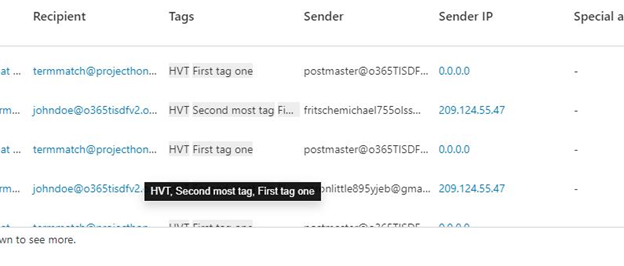
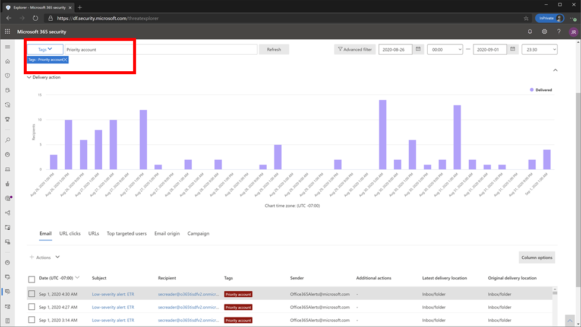

# Bedrohungs-Explorer und Echtzeiterkennungen

**Gilt für**
- [Microsoft Defender für Office 365 Plan 1 und Plan 2](defender-for-office-365.md)
- [Microsoft 365 Defender](../defender/microsoft-365-defender.md)

Wenn Ihre Organisation [über Microsoft Defender für Office 365](defender-for-office-365.md)verfügt und Sie über die erforderlichen [Berechtigungen](#required-licenses-and-permissions)verfügen, verfügen Sie entweder über **Explorer-** oder **Echtzeiterkennungen** (früher *Echtzeitberichte* – [sehen Sie sich an, was neu ist!).](#new-features-in-threat-explorer-and-real-time-detections) Wechseln Sie im Security & Compliance Center zur **Bedrohungsverwaltung,** und wählen Sie dann **Explorer-** _oder_ **Echtzeiterkennungen aus.**

 

****

|Mit Microsoft Defender für Office 365 Plan 2 sehen Sie Folgendes:|Mit Microsoft Defender für Office 365 Plan 1 sehen Sie Folgendes:|
|---|---|
|||
|

Explorer- oder Echtzeiterkennungen helfen Ihrem Sicherheitsteam, Bedrohungen effizient zu untersuchen und darauf zu reagieren. Der Bericht ähnelt der folgenden Abbildung:

Mit diesem Bericht haben Sie folgende Möglichkeiten:

- [Anzeigen von Schadsoftware, die von Microsoft 365 Sicherheitsfeatures erkannt wurde](#see-malware-detected-in-email-by-technology)
- [Phishing-URL anzeigen und auf Bewertungsdaten klicken](#view-phishing-url-and-click-verdict-data)
- [Starten eines automatisierten Untersuchungs- und Reaktionsprozesses aus einer Ansicht im Explorer](#start-automated-investigation-and-response) (nur Defender für Office 365 Plan 2)
- [Untersuchen bösartiger E-Mails und vieles mehr](#more-ways-to-use-explorer-and-real-time-detections)

## Verbesserungen bei der Bedrohungssuche

### Einführung der Warnungs-ID für Defender für Office 365 Warnungen innerhalb von Explorer-/Echtzeiterkennungen

Wenn Sie heute von einer Warnung zum Bedrohungs-Explorer navigieren, wird eine gefilterte Ansicht im Explorer geöffnet, wobei die Ansicht nach Warnungsrichtlinien-ID gefiltert ist (Richtlinien-ID ist ein eindeutiger Bezeichner für eine Warnungsrichtlinie).
Wir machen diese Integration relevanter, indem wir die Warnungs-ID (siehe beispiel für die Warnungs-ID unten) im Bedrohungs-Explorer und Echtzeiterkennungen einführen, damit Sie Nachrichten sehen, die für die jeweilige Warnung relevant sind, sowie eine Anzahl von E-Mails. Sie können auch sehen, ob eine Nachricht Teil einer Warnung war, und von dieser Nachricht zu der spezifischen Warnung navigieren.

Die Warnungs-ID ist innerhalb der URL verfügbar, wenn Sie eine einzelne Warnung anzeigen. Ein Beispiel hierfür ist `https://protection.office.com/viewalerts?id=372c9b5b-a6c3-5847-fa00-08d8abb04ef1` .

> [!div class="mx-imgBorder"]
> 

> [!div class="mx-imgBorder"]
> 

### Erweitern des Explorer-Datenaufbewahrungs- und Suchlimits für Testmandanten von 7 auf 30 Tage

Im Rahmen dieser Änderung können Sie E-Mail-Daten innerhalb von 30 Tagen (eine Erhöhung gegenüber den vorherigen 7 Tagen) in Bedrohungs-Explorer/Echtzeiterkennungen für Defender für Office P1- und P2-Testmandanten suchen und filtern.
Dies wirkt sich nicht auf Produktionsmandanten für P1- und P2/E5-Kunden aus, die bereits über die 30-tägigen Datenaufbewahrungs- und Suchfunktionen verfügen.

### Aktualisierte Grenzwerte für das Exportieren von Datensätzen für den Bedrohungs-Explorer

Im Rahmen dieser Aktualisierung wird die Anzahl der Zeilen für E-Mail-Datensätze, die aus dem Bedrohungs-Explorer exportiert werden können, von 9990 auf 200.000 Datensätze erhöht. Der Satz von Spalten, die derzeit exportiert werden können, bleibt gleich, aber die Anzahl der Zeilen nimmt ab dem aktuellen Grenzwert zu.

### Tags im Bedrohungs-Explorer

> [!NOTE]
> Das Feature "Benutzertags" befindet sich in der *Vorschau,* ist nicht für alle verfügbar und kann geändert werden. Informationen zum Veröffentlichungszeitplan finden Sie in der roadmap für Microsoft 365.

Benutzertags identifizieren bestimmte Benutzergruppen in Microsoft Defender für Office 365. Weitere Informationen zu Tags, einschließlich Lizenzierung und Konfiguration, finden Sie unter [Benutzertags.](user-tags.md)

Im Bedrohungs-Explorer können Sie Informationen zu Benutzertags in den folgenden Oberflächen anzeigen.

#### E-Mail-Rasteransicht

Die Spalte **"Tags"** im E-Mail-Raster enthält alle Tags, die auf die Postfächer von Absendern oder Empfängern angewendet wurden. Standardmäßig werden zuerst Systemtags wie Prioritätskonten angezeigt.

> [!div class="mx-imgBorder"]
> 

#### Filtern

Sie können Tags als Filter verwenden. Suchen Sie direkt über Prioritätskonten oder bestimmte Benutzertagszenarien hinweg. Sie können auch Ergebnisse mit bestimmten Tags ausschließen. Kombinieren Sie diese Funktionalität mit anderen Filtern, um den Untersuchungsbereich einzugrenzen.

> [!div class="mx-imgBorder"]
> 

#### Flyout für E-Mail-Details

Um die einzelnen Tags für Absender und Empfänger anzuzeigen, wählen Sie den Betreff aus, um das Flyout mit den Nachrichtendetails zu öffnen. Auf der Registerkarte **"Zusammenfassung"** werden die Absender- und Empfängertags separat angezeigt, wenn sie für eine E-Mail vorhanden sind.
Die Informationen zu einzelnen Tags für Absender und Empfänger erstrecken sich auch auf exportierte CSV-Daten, in denen Sie diese Details in zwei separaten Spalten sehen können.

> [!div class="mx-imgBorder"]
> 

Tags-Informationen werden auch im Flyout für URL-Klicks angezeigt. Um sie anzuzeigen, wechseln Sie zur Ansicht "Phishing" oder "Alle E-Mails" und dann zur Registerkarte **"URLs"** oder **"URL-Klicks".** Wählen Sie ein einzelnes URL-Flyout aus, um weitere Details zu Klicks für diese URL anzuzeigen, einschließlich tags, die diesem Klick zugeordnet sind.

### Aktualisierte Zeitachsenansicht

> [!div class="mx-imgBorder"]
> 
>
Erfahren Sie mehr, in dem Sie [dieses Video](https://www.youtube.com/watch?v=UoVzN0lYbfY&list=PL3ZTgFEc7LystRja2GnDeUFqk44k7-KXf&index=4) ansehen.

## Verbesserungen bei der Bedrohungssuche (anstehendes Ereignis)

### Aktualisierte Bedrohungsinformationen für E-Mails

Wir haben uns auf Die Plattform- und Datenqualitätsverbesserungen konzentriert, um die Genauigkeit und Konsistenz von E-Mail-Datensätzen zu erhöhen. Verbesserungen umfassen die Konsolidierung von Pre-Delivery- und Post-Delivery-Informationen, z. B. Aktionen, die für eine E-Mail als Teil des ZAP-Prozesses ausgeführt werden, in einem einzigen Datensatz. Weitere Details wie Spambewertung, Bedrohungen auf Entitätsebene (z. B. welche URL bösartig war) und die neuesten Übermittlungsorte sind ebenfalls enthalten.

Nach diesen Updates wird ein einzelner Eintrag für jede Nachricht angezeigt, unabhängig von den verschiedenen Ereignissen nach der Übermittlung, die sich auf die Nachricht auswirken. Zu den Aktionen gehören ZAP, manuelle Wartung (d. h. Administratoraktion), dynamische Bereitstellung usw.

Zusätzlich zum Anzeigen von Schadsoftware und Phishing-Bedrohungen sehen Sie die Spambewertung, die einer E-Mail zugeordnet ist. Sehen Sie sich in der E-Mail alle mit der E-Mail verbundenen Bedrohungen zusammen mit den entsprechenden Erkennungstechnologien an. Eine E-Mail kann null, eine oder mehrere Bedrohungen haben. Die aktuellen Bedrohungen werden im Abschnitt **"Details"** des E-Mail-Flyouts angezeigt. Bei mehreren Bedrohungen (z. B. Schadsoftware und Phishing) zeigt das **Feld "Erkennungstechnologie"** die Zuordnung zur Bedrohungserkennung an, bei der es sich um die Erkennungstechnologie handelt, die die Bedrohung identifiziert hat.

Der Satz von Erkennungstechnologien umfasst jetzt neue Erkennungsmethoden sowie Spamerkennungstechnologien. Sie können den gleichen Satz von Erkennungstechnologien verwenden, um die Ergebnisse in den verschiedenen E-Mail-Ansichten (Schadsoftware, Phishing, alle E-Mails) zu filtern.

> [!NOTE]
> Die Bewertungsanalyse ist möglicherweise nicht unbedingt an Entitäten gebunden. Als Beispiel kann eine E-Mail als Phishing oder Spam klassifiziert werden, aber es gibt keine URLs, die mit einem Phishing-/Spam-Bewertungsstempel versehen sind. Dies liegt daran, dass die Filter auch Inhalte und andere Details für eine E-Mail auswerten, bevor eine Bewertung zugewiesen wird.

#### Bedrohungen in URLs

Sie können jetzt die spezifische Bedrohung für eine  URL auf der Registerkarte Details des E-Mail-Flyouts anzeigen. Die Bedrohung kann *Schadsoftware,* *Phishing,* *Spam* oder *keine* sein.)

> [!div class="mx-imgBorder"]
> 

### Aktualisierte Zeitachsenansicht (anstehende)

> [!div class="mx-imgBorder"]
> 

Die Zeitachsenansicht identifiziert alle Übermittlungs- und Nachzustellereignisse. Sie enthält Informationen über die Bedrohung, die zu diesem Zeitpunkt für eine Teilmenge dieser Ereignisse identifiziert wurde. Die Zeitachsenansicht enthält außerdem Informationen zu allen zusätzlichen Maßnahmen (z. B. ZAP oder manuelle Korrektur) sowie das Ergebnis dieser Aktion. Zu den Informationen zur Zeitachsenansicht gehören:

- **Quelle:** Quelle des Ereignisses. Er kann Administrator/System/Benutzer sein.
- **Ereignis:** Umfasst Ereignisse der obersten Ebene wie die ursprüngliche Zustellung, manuelle Wartung, ZAP, Übermittlungen und dynamische Übermittlung.
- **Aktion:** Die spezifische Aktion, die entweder als Teil von ZAP oder als Administratoraktion (z. B. vorläufiges Löschen) ausgeführt wurde.
- **Bedrohungen:** Deckt die Bedrohungen (Schadsoftware, Phishing, Spam) ab, die zu diesem Zeitpunkt identifiziert wurden.
- **Ergebnis/Details:** Weitere Informationen über das Ergebnis der Aktion, z. B. ob sie im Rahmen der ZAP-/Administratoraktion ausgeführt wurde.

### Ursprüngliche und neueste Übermittlungsspeicherort

Derzeit wird der Übermittlungsort im E-Mail-Raster und im E-Mail-Flyout angezeigt. Das **Feld "Übermittlungsspeicherort"** wird in **_"Originalzustellort_"_*umbenannt. Und wir führen ein weiteres Feld ein, _*_Neueste Übermittlungsspeicherort_**.

**Der ursprüngliche Zustellungsort** liefert weitere Informationen darüber, wo eine E-Mail ursprünglich zugestellt wurde. **Der neueste Zustellungsort** gibt an, wo eine E-Mail nach Systemaktionen wie *ZAP* oder Administratoraktionen wie *Verschieben zu gelöschten Elementen* gelandet ist. Der neueste Übermittlungsort dient dazu, Administratoren den letzten bekannten Speicherort der Nachricht nach der Zustellung oder alle System-/Administratoraktionen mitzuteilen. Es enthält keine Endbenutzeraktionen für die E-Mail. Wenn ein Benutzer z. B. eine Nachricht gelöscht oder die Nachricht in archivieren/pst verschoben hat, wird der Speicherort für die Nachrichtenübermittlung nicht aktualisiert. Wenn jedoch eine Systemaktion den Speicherort aktualisiert (z. B. ZAP, was dazu führt, dass eine E-Mail in Quarantäne verschoben wird), wird der **neueste Übermittlungsort** als "Quarantäne" angezeigt.

> [!div class="mx-imgBorder"]
> 

> [!NOTE]
> Es gibt einige Fälle, in denen **die Übermittlungsspeicherort-** und **Übermittlungsaktion** als "unbekannt" angezeigt werden kann:
>
> - Möglicherweise wird der **Zustellungsspeicherort** als "zugestellt" und der **Zustellungsort** als "unbekannt" angezeigt, wenn die Nachricht zugestellt wurde, aber eine Posteingangsregel hat die Nachricht in einen Standardordner (z. B. Entwurf oder Archiv) anstatt in den Ordner Posteingang oder Junk-E-Mail verschoben.
>
> - **Der neueste Übermittlungsort** kann unbekannt sein, wenn eine Administrator-/Systemaktion (z. B. ZAP) versucht wurde, die Nachricht jedoch nicht gefunden wurde. In der Regel erfolgt die Aktion, nachdem der Benutzer die Nachricht verschoben oder gelöscht hat. Überprüfen Sie in solchen Fällen die Spalte **"Ergebnis/Details"** in der Zeitachsenansicht. Suchen Sie nach der Anweisung "Nachricht wurde vom Benutzer verschoben oder gelöscht".

> [!div class="mx-imgBorder"]
> 

### Zusätzliche Aktionen

*Nach* der Zustellung der E-Mail wurden weitere Aktionen angewendet. Sie können *ZAP,* *manuelle Korrektur* (von einem Administrator ausgeführte Aktion, z. B. vorläufiges Löschen), dynamische *Zustellung* und erneute *Verarbeitung* (für eine E-Mail, die unerwartet als gut erkannt wurde) umfassen.

> [!NOTE]
> Im Rahmen der ausstehenden Änderungen wird der aktuell im Filter "Übermittlungsaktion" angezeigte Wert "Von ZAP entfernt" entfernt. Sie haben eine Möglichkeit, mit dem ZAP-Versuch **durch zusätzliche Aktionen** nach allen E-Mails zu suchen.

> [!div class="mx-imgBorder"]
> 

### Systemüberschreibungen

*Mit Systemüberschreibungen* können Sie Ausnahmen vom vorgesehenen Übermittlungsort einer Nachricht machen. Sie überschreiben den vom System bereitgestellten Übermittlungsort basierend auf den Bedrohungen und anderen Vom Filterstapel identifizierten Erkennungen. Systemüberschreibungen können über eine Mandanten- oder Benutzerrichtlinie festgelegt werden, um die Nachricht wie in der Richtlinie vorgeschlagen zu übermitteln. Außerkraftsetzungen können aufgrund von Konfigurationslücken die unbeabsichtigte Zustellung bösartiger Nachrichten erkennen, z. B. eine übermäßig breite Tresor Absenderrichtlinie, die von einem Benutzer festgelegt wurde. Diese Außerkraftsetzungswerte können folgende sein:

- Zulässig durch Benutzerrichtlinien: Ein Benutzer erstellt Richtlinien auf Postfachebene, um Domänen oder Absender zuzulassen.

- Blockiert durch Benutzerrichtlinie: Ein Benutzer erstellt Richtlinien auf der E-Mail-Box-Ebene, um Domänen oder Absender zu blockieren.

- Zulässig nach Organisationsrichtlinie: Die Sicherheitsteams der Organisation legen Richtlinien fest oder Exchange Nachrichtenflussregeln (auch als Transportregeln bezeichnet), um Absender und Domänen für Benutzer in ihrer Organisation zuzulassen. Dies kann für eine Gruppe von Benutzern oder die gesamte Organisation gelten.

- Blockiert durch eine Organisationsrichtlinie: Die Sicherheitsteams der Organisation legen Richtlinien oder Nachrichtenflussregeln fest, um Absender, Domänen, Nachrichtensprachen oder Quell-IPs für Benutzer in ihrer Organisation zu blockieren. Dies kann auf eine Gruppe von Benutzern oder die gesamte Organisation angewendet werden.

- Durch eine Organisationsrichtlinie blockierte Dateierweiterung: Das Sicherheitsteam einer Organisation blockiert eine Dateinamenerweiterung über die Richtlinieneinstellungen für Antischadsoftware. Diese Werte werden nun in E-Mail-Details angezeigt, um Untersuchungen zu unterstützen. Außerdem können Teams die Rich-Filter-Funktion verwenden, um nach blockierten Dateierweiterungen zu filtern.

> [!div class="mx-imgBorder"]
> 

### Verbesserungen für die URL- und Klickerfahrung

Zu den Verbesserungen gehören:

- Zeigen Sie die vollständig angeklickte URL (einschließlich aller Abfrageparameter, die Teil der URL sind) im **Clicks-Abschnitt** des URL-Flyouts an. Derzeit werden die URL-Domäne und der Pfad in der Titelleiste angezeigt. Wir erweitern diese Informationen, um die vollständige URL anzuzeigen.

- Korrekturen über URL-Filter hinweg (*URL* im Vergleich *zu URL-Domäne* im Vergleich zu *URL-Domäne und Pfad*): Die Updates wirken sich auf die Suche nach Nachrichten aus, die eine URL-/Klickbewertung enthalten. Wir haben die Unterstützung für protokollagnostische Suchen aktiviert, sodass Sie ohne Verwendung nach einer URL suchen `http` können. Standardmäßig wird die URL-Suche http zugeordnet, es sei denn, ein anderer Wert ist explizit angegeben. Zum Beispiel:
  - Suchen Sie mit und ohne `http://` Präfix in den Filterfeldern **"URL",** **"URL-Domäne"** und **"URL-Domäne" und "Pfad".** Die Suchvorgänge sollten dieselben Ergebnisse aufweisen.
  - Suchen Sie nach dem `https://` Präfix in **der URL.** Wenn kein Wert angegeben wird, wird das `http://` Präfix verwendet.
  - `/` wird am Anfang und Ende des **URL-Pfads,** der **URL-Domäne,** der **URL-Domäne und** der Pfadfelder ignoriert. `/` am Ende des **URL-Felds** wird ignoriert.

### Phishing-Konfidenzniveau

Das Phishing-Konfidenzniveau hilft bei der Identifizierung des Grads der Konfidenz, mit dem eine E-Mail als "Phishing" kategorisiert wurde. Die beiden möglichen Werte sind *"High"* und *"Normal".* In den Anfangsphasen ist dieser Filter nur in der Phishingansicht des Bedrohungs-Explorers verfügbar.

### ZAP-URL-Signal

Das ZAP-URL-Signal wird in der Regel für ZAP-Phishing-Warnungsszenarien verwendet, in denen eine E-Mail als Phishing identifiziert und nach der Zustellung entfernt wurde. Dieses Signal verbindet die Warnung mit den entsprechenden Ergebnissen im Explorer. Dies ist einer der IOCs für die Warnung.

Um den Suchprozess zu verbessern, haben wir den Bedrohungs-Explorer und Echtzeiterkennungen aktualisiert, um die Suchumgebung konsistenter zu gestalten. Die Änderungen werden hier beschrieben:

- [Zeitzonenverbesserungen](#timezone-improvements)
- [Aktualisieren im Aktualisierungsprozess](#update-in-the-refresh-process)
- [Diagramm-Drilldown zum Hinzufügen zu Filtern](#chart-drilldown-to-add-to-filters)
- [In Produktinformationsupdates](#in-product-information-updates)

### Filtern nach Benutzertags

Sie können jetzt nach System- oder benutzerdefinierten Benutzertags sortieren und filtern, um den Umfang der Bedrohungen schnell zu erfassen. Weitere Informationen finden Sie unter [Benutzertags.](user-tags.md)

> [!IMPORTANT]
> Das Filtern und Sortieren nach Benutzertags befindet sich derzeit in der öffentlichen Vorschau. Diese Funktionalität kann vor der kommerziellen Veröffentlichung erheblich geändert werden. Microsoft übernimmt keine Garantie, weder ausdrücklich noch konkludent, in Bezug auf die bereitgestellten Informationen.

> [!div class="mx-imgBorder"]
> 

### Zeitzonenverbesserungen

Sie sehen die Zeitzone für die E-Mail-Einträge im Portal sowie für exportierte Daten. Es wird in allen Umgebungen wie E-Mail-Raster, Details-Flyout, E-Mail-Zeitachse und ähnlichen E-Mails sichtbar sein, sodass die Zeitzone für das Resultset klar ist.

> [!div class="mx-imgBorder"]
> 

### Aktualisieren im Aktualisierungsprozess

Einige Benutzer haben die Verwirrung bei der automatischen Aktualisierung (z. B. sobald Sie das Datum ändern, wird die Seite aktualisiert) und der manuellen Aktualisierung (für andere Filter) kommentiert. Ebenso führt das Entfernen von Filtern zu einer automatischen Aktualisierung. Das Ändern von Filtern beim Ändern der Abfrage kann zu inkonsistenten Suchfunktionen führen. Um diese Probleme zu beheben, wechseln wir zu einem manuellen Filtermechanismus.

Aus Sicht der Benutzererfahrung kann der Benutzer den unterschiedlichen Filterbereich (aus der Filtergruppe und dem Datum) anwenden und entfernen und die Aktualisierungsschaltfläche auswählen, um die Ergebnisse zu filtern, nachdem er die Abfrage definiert hat. Die Schaltfläche "Aktualisieren" wird jetzt auch auf dem Bildschirm hervorgehoben. Wir haben auch die zugehörigen QuickInfos und die Produktdokumentation aktualisiert.

> [!div class="mx-imgBorder"]
> 

### Diagramm-Drilldown zum Hinzufügen zu Filtern

Sie können jetzt Legendenwerte diagrammen, um sie als Filter hinzuzufügen. Wählen Sie die Schaltfläche **"Aktualisieren"** aus, um die Ergebnisse zu filtern.

> [!div class="mx-imgBorder"]
> 

### Produktinterne Informationsupdates

Weitere Details sind jetzt im Produkt verfügbar, z. B. die Gesamtzahl der Suchergebnisse innerhalb des Rasters (siehe unten). Wir haben Bezeichnungen, Fehlermeldungen und QuickInfos verbessert, um weitere Informationen zu Filtern, der Suchumgebung und dem Resultset bereitzustellen.

> [!div class="mx-imgBorder"]
> 

## Erweiterte Funktionen im Bedrohungs-Explorer

### Benutzer mit den wichtigsten Zielen

Heute machen wir die Liste der am häufigsten verwendeten Benutzer in der Schadsoftwareansicht für E-Mails im Abschnitt **"Top Malware Families"** verfügbar. Wir erweitern diese Ansicht auch in den Ansichten "Phishing" und "Alle E-Mails". Sie können die fünf wichtigsten Zielbenutzer zusammen mit der Anzahl der Versuche für jeden Benutzer für die entsprechende Ansicht sehen. For example, for Phish view, you'll see the number of Phish attempts.

Sie können die Liste der Zielbenutzer bis zu einem Grenzwert von 3.000 sowie die Anzahl der Versuche für die Offlineanalyse für jede E-Mail-Ansicht exportieren. Darüber hinaus wird durch Auswählen der Anzahl der Versuche (z. B. 13 Versuche in der abbildung unten) eine gefilterte Ansicht im Bedrohungs-Explorer geöffnet, sodass Sie weitere Details zu E-Mails und Bedrohungen für diesen Benutzer sehen können.

> [!div class="mx-imgBorder"]
> 

### Exchange-Transportregeln

Im Rahmen der Datenerweiterung können Sie alle unterschiedlichen Exchange Transportregeln (ETR) sehen, die auf eine Nachricht angewendet wurden. Diese Informationen sind in der Rasteransicht E-Mail verfügbar. Wählen Sie zum Anzeigen **spaltenoptionen** im Raster aus, und fügen Sie dann **Exchange Transportregel** aus den Spaltenoptionen hinzu. Sie wird auch im  Detail-Flyout in der E-Mail angezeigt.

Sie können sowohl die GUID als auch den Namen der Transportregeln sehen, die auf die Nachricht angewendet wurden. Sie können mithilfe des Namens der Transportregel nach den Nachrichten suchen. Dies ist eine "Enthält"-Suche, was bedeutet, dass Sie auch teilsuchen können.

> [!IMPORTANT]
> Die Verfügbarkeit von ETR-Suche und -Namen hängt von der jeweiligen Rolle ab, die Ihnen zugewiesen ist. Sie müssen über eine der folgenden Rollen/Berechtigungen verfügen, um die ETR-Namen und die Suche anzuzeigen. Wenn Ihnen keine dieser Rollen zugewiesen ist, können Sie die Namen der Transportregeln nicht sehen oder mithilfe von ETR-Namen nach Nachrichten suchen. Sie können jedoch die ETR-Bezeichnung und GUID-Informationen in den E-Mail-Details sehen. Andere Datensatzanzeigen in E-Mail-Rastern, E-Mail-Flyouts, Filtern und Export sind nicht betroffen.
>
> - Nur EXO – Verhinderung von Datenverlust: Alle
> - Nur EXO – O365SupportViewConfig: Alle
> - Microsoft Azure Active Directory oder EXO – Sicherheitsadministrator: Alle
> - AAD oder EXO – Security Reader: Alle
> - Nur EXO – Transportregeln: Alle
> - Nur EXO – View-Only-Konfiguration: Alle
>
> Innerhalb des E-Mail-Rasters, des Detail-Flyouts und der exportierten CSV-Datei wird den ETRs wie unten dargestellt ein Name/eine GUID angezeigt.
>
> > [!div class="mx-imgBorder"]
> > 

### Eingehende Connectors

Connectors sind eine Sammlung von Anweisungen, die anpassen, wie Ihre E-Mails zu und von Ihrer Microsoft 365 oder Office 365 Organisation fließen. Sie ermöglichen es Ihnen, alle Sicherheitseinschränkungen oder Steuerelemente anzuwenden. Im Bedrohungs-Explorer können Sie jetzt die Connectors anzeigen, die sich auf eine E-Mail beziehen, und mithilfe von Connectornamen nach E-Mails suchen.

Die Suche nach Connectors ist von Natur aus "enthält", was bedeutet, dass auch teilweise Schlüsselwortsuchen funktionieren sollten. In der Hauptrasteransicht, dem Detail-Flyout und der exportierten CSV-Datei werden die Connectors im Namen/GUID-Format angezeigt, wie hier gezeigt:

> [!div class="mx-imgBorder"]
> 

## Neue Features im Bedrohungs-Explorer und Echtzeiterkennungen

- [Anzeigen von Phishing-E-Mails, die an imitierte Benutzer und Domänen gesendet werden](#view-phishing-emails-sent-to-impersonated-users-and-domains)
- [Anzeigen der E-Mail-Kopfzeile und Herunterladen des E-Mail-Texts](#preview-email-header-and-download-email-body)
- [E-Mail-Zeitachse](#email-timeline)
- [Exportieren von URL-Klickdaten](#export-url-click-data)

### Anzeigen von Phishing-E-Mails, die an imitierte Benutzer und Domänen gesendet werden

Um Phishingversuche gegen Benutzer und Domänen zu identifizieren, bei denen es sich um imitierte Benutzer handelt, müssen sie der Liste der *zu schützenden Benutzer* hinzugefügt werden. Bei Domänen müssen Administratoren entweder *Organisationsdomänen* aktivieren oder Domänen einen Domänennamen *hinzufügen, um sie zu schützen.* Die zu schützenden Domänen finden Sie auf der *Seite "Antiphishingrichtlinien"* im Abschnitt *"Identitätswechsel".*

Um Phishingnachrichten zu überprüfen und nach imitierten Benutzern oder Domänen zu suchen, verwenden Sie die [Ansicht "E-Mail > Phishing"](threat-explorer-views.md) des Explorers.

In diesem Beispiel wird der Bedrohungs-Explorer verwendet.

1. Wählen Sie im [Security & Compliance Center](https://protection.office.com) https://protection.office.com) (oder Echtzeiterkennungen) die Option "Bedrohungsmanagement > Explorer" aus.

2. Wählen Sie im Menü "Ansicht" die Option "E-Mail > Phishing" aus.

   Hier können Sie **eine imitierte Domäne** oder einen **imitierten Benutzer** auswählen.

3. **Wählen** Sie entweder **"Imitierte Domäne"** aus, und geben Sie dann eine geschützte Domäne in das Textfeld ein.

   Suchen Sie beispielsweise nach geschützten Domänennamen wie *Contoso,* *contoso.com* oder *contoso.com.au.*

4. Wählen Sie den Betreff einer Nachricht auf der Registerkarte "E-Mail" > Registerkarte "Details" aus, um zusätzliche Identitätswechselinformationen wie "Impersonated Domain" oder "Detected location" anzuzeigen.

    **OR**

    Wählen Sie **"Imitierter Benutzer" aus,** und geben Sie die E-Mail-Adresse eines geschützten Benutzers in das Textfeld ein.

    > [!TIP]
    > **Um optimale Ergebnisse** zu erzielen, verwenden Sie *vollständige E-Mail-Adressen,* um geschützte Benutzer zu durchsuchen. Sie werden Ihren geschützten Benutzer schneller und erfolgreicher finden, wenn Sie nach *firstname.lastname@contoso.com* suchen, z. B. beim Untersuchen des Identitätswechsels des Benutzers. Bei der Suche nach einer geschützten Domäne wird die Stammdomäne (z. B. contoso.com) und der Domänenname (*contoso*) verwendet. Bei der Suche nach der *Stammdomäne contoso.com* werden sowohl der Identitätswechsel von *contoso.com* als auch der Domänenname *"contoso"* zurückgegeben.

5. Wählen Sie den **Betreff** einer Nachricht auf der **Registerkarte "Details" der Registerkarte "E-Mail"**  >   aus, um zusätzliche Identitätswechselinformationen über den Benutzer oder die Domäne und den *erkannten Speicherort anzuzeigen.*

    :::image type="content" source="../../media/threat-ex-views-impersonated-user-image.png" alt-text="Der Detailbereich des Bedrohungs-Explorers für einen geschützten Benutzer mit dem Erkennungsort und der erkannten Bedrohung (hier Phishing-Identitätswechsel eines Benutzers).":::

> [!NOTE]
> Wenn Sie in Schritt 3 oder 5 **erkennungstechnologie** auswählen und **Identitätswechseldomäne** bzw. **Identitätswechselbenutzer** auswählen, werden die Informationen auf der Registerkarte **"E-Mail-Registerkarte**  >  **Details"** über den Benutzer oder die Domäne und der *erkannte Speicherort* nur in den Nachrichten angezeigt, die sich auf den Benutzer oder die Domäne beziehen, die auf der Seite *"Antiphishingrichtlinie"* aufgeführt sind.

### Anzeigen der E-Mail-Kopfzeile und Herunterladen des E-Mail-Texts

Sie können jetzt eine Vorschau einer E-Mail-Kopfzeile anzeigen und den E-Mail-Textkörper im Bedrohungs-Explorer herunterladen. Administratoren können heruntergeladene Kopfzeilen/E-Mail-Nachrichten auf Bedrohungen analysieren. Da das Herunterladen von E-Mail-Nachrichten die Gefährdung von Informationen riskieren kann, wird dieser Prozess durch die rollenbasierte Zugriffssteuerung (Role-Based Access Control, RBAC) gesteuert. Eine neue Rolle, *"Vorschau",* muss einer anderen Rollengruppe (z. B. Sicherheitsvorgänge oder Sicherheitsadministrator) hinzugefügt werden, um das Herunterladen von E-Mails in der Ansicht "Alle E-Mail-Nachrichten" zu ermöglichen. Das Anzeigen des E-Mail-Headers erfordert jedoch keine zusätzliche Rolle (außer der Rolle, die zum Anzeigen von Nachrichten im Bedrohungs-Explorer erforderlich ist).

Explorer- und Echtzeiterkennungen erhalten auch neue Felder, die ein vollständigeres Bild davon liefern, wo Ihre E-Mail-Nachrichten landen. Diese Änderungen erleichtern die Suche für Sicherheitsfunktionen. Das Hauptergebnis ist jedoch, dass Sie den Speicherort der problematischen E-Mail-Nachrichten auf einen Blick kennen können.

Wie erfolgt dies? Der Übermittlungsstatus ist jetzt in zwei Spalten unterteilt:

- **Zustellungsaktion** – Status der E-Mail.
- **Übermittlungsort** – Ort, an den die E-Mail weitergeleitet wurde.

*Übermittlungsaktion* ist die Aktion, die aufgrund vorhandener Richtlinien oder Erkennungen für eine E-Mail ausgeführt wird. Hier sind die möglichen Aktionen für eine E-Mail:

 

****

|Geliefert|Junked|Gesperrt|Ersetzt|
|---|---|---|---|
|E-Mails wurden an den Posteingang oder Ordner eines Benutzers übermittelt, und der Benutzer kann darauf zugreifen.|E-Mails wurden an den Junk- oder Deleted-Ordner des Benutzers gesendet, und der Benutzer kann darauf zugreifen.|E-Mails, die isoliert sind, fehlgeschlagen sind oder verworfen wurden. Auf diese E-Mails kann der Benutzer nicht zugreifen.|E-Mails mit schädlichen Anlagen wurden durch .txt Dateien ersetzt, die angeben, dass die Anlage bösartig war.|
|

Dies ist das, was der Benutzer sehen kann und was nicht:

 

****

|Für Endbenutzer zugänglich|Für Endbenutzer nicht zugänglich|
|---|---|
|Geliefert|Gesperrt|
|Junked|Ersetzt|
|

**Der Übermittlungsort** zeigt die Ergebnisse von Richtlinien und Erkennungen an, die nach der Zustellung ausgeführt werden. Sie ist mit der **_Übermittlungsaktion_** verknüpft. Dies sind die möglichen Werte:

- *Posteingang oder Ordner:* Die E-Mail befindet sich im Posteingang oder in einem Ordner (gemäß Ihren E-Mail-Regeln).
- *Lokal oder extern:* Das Postfach ist nicht in der Cloud, sondern lokal vorhanden.
- *Junk-Ordner:* Die E-Mail befindet sich im Junk-Ordner eines Benutzers.
- *Ordner "Gelöschte Elemente":* Die E-Mail im Ordner "Gelöschte Elemente" eines Benutzers.
- *Quarantäne:* Die E-Mail befindet sich in Quarantäne und nicht im Postfach eines Benutzers.
- *Fehlgeschlagen:* Die E-Mail konnte das Postfach nicht erreichen.
- *Abgelegt:* Die E-Mail hat sich irgendwo im Nachrichtenfluss verloren.

### E-Mail-Zeitachse

Die **E-Mail-Zeitachse** ist ein neues Explorer-Feature, das die Suche für Administratoren verbessert. Dadurch wird der Zeitaufwand für die Überprüfung verschiedener Orte reduziert, um zu versuchen, das Ereignis zu verstehen. Wenn mehrere Ereignisse gleichzeitig oder in der Nähe einer E-Mail auftreten, werden diese Ereignisse in einer Zeitachsenansicht angezeigt. Einige Ereignisse, die nach der Zustellung ihrer E-Mail auftreten, werden in der Spalte **"Spezielle Aktion"** erfasst. Administratoren können Informationen aus der Zeitachse mit der speziellen Aktion kombinieren, die nach der Zustellung von E-Mails ausgeführt wurde, um Einen Einblick in die Funktionsweise ihrer Richtlinien zu erhalten, wo die E-Mail schließlich weitergeleitet wurde und in einigen Fällen, was die endgültige Bewertung war.

Weitere Informationen finden Sie unter [Untersuchen und Beheben bösartiger E-Mails, die in Office 365 zugestellt wurden.](investigate-malicious-email-that-was-delivered.md)

### Exportieren von URL-Klickdaten

Sie können jetzt Berichte für URL-Klicks exportieren, um Microsoft Excel, um deren **Netzwerknachrichten-ID** anzuzeigen und **auf "Bewertung" zu klicken.** Dies hilft zu erläutern, wo Der URL-Klickdatenverkehr aufgetreten ist. So funktioniert es: Folgen Sie in der Bedrohungsverwaltung auf der Office 365 Schnellstartleiste dieser Kette:

**Explorer** \> **Phishing anzeigen** \> **Klicks** \> **Top URLs** or **URL Top Clicks** \> select any record to open the URL flyout.

Wenn Sie eine URL in der Liste auswählen, wird im Fly-Out-Bereich eine neue Schaltfläche **"Exportieren"** angezeigt. Verwenden Sie diese Schaltfläche, um Daten zur einfacheren Berichterstellung in ein Excel-Arbeitsblatt zu verschieben.

Folgen Sie diesem Pfad, um zum gleichen Speicherort im Bericht über Echtzeiterkennungen zu gelangen:

**Explorer** \> **Echtzeiterkennungen** \> **Phishing anzeigen** \> **URLs** \> **Top URLs** or **Top Clicks** \> Select any record to open the URL flyout \> navigate to the **Clicks** tab.

> [!TIP]
> Die Netzwerknachrichten-ID ordnet den Klick zurück zu bestimmten E-Mails, wenn Sie die ID über explorer oder zugeordnete Drittanbietertools durchsuchen. Solche Suchvorgänge identifizieren die E-Mail, die einem Klickergebnis zugeordnet ist. Die korrelierte Netzwerknachrichten-ID ermöglicht eine schnellere und leistungsstärkere Analyse.

> [!div class="mx-imgBorder"]
> 

## Anzeigen von Schadsoftware, die in E-Mails nach Technologie erkannt wurde

Angenommen, Sie möchten Schadsoftware in E-Mails erkennen, sortiert nach Microsoft 365 Technologie. Verwenden Sie dazu die [E-Mail-> Schadsoftwareansicht](threat-explorer-views.md#email--malware) des Explorers (oder Echtzeiterkennungen).

1. Wählen Sie im Security & Compliance Center ( <https://protection.office.com> ) den **Bedrohungsverwaltungs-Explorer** \>  (oder **Echtzeiterkennungen)** aus. (In diesem Beispiel wird Explorer verwendet.)

2. Wählen Sie im Menü **Ansicht** **E-Mail-Schadsoftware** \> aus.

   > [!div class="mx-imgBorder"]
   > 

3. Klicken Sie auf **"Absender"** und dann auf **"Grundlegende** \> **Erkennungstechnologie".**

   Ihre Erkennungstechnologien sind jetzt als Filter für den Bericht verfügbar.

   > [!div class="mx-imgBorder"]
   > 

4. Wählen Sie eine Option aus. Wählen Sie dann die Schaltfläche **"Aktualisieren"** aus, um diesen Filter anzuwenden.

   > [!div class="mx-imgBorder"]
   > 

Der Bericht wird aktualisiert, um die Ergebnisse anzuzeigen, die Schadsoftware in E-Mails mithilfe der ausgewählten Technologieoption erkannt hat. Von hier aus können Sie weitere Analysen durchführen.

## Phishing-URL anzeigen und auf Bewertungsdaten klicken

Angenommen, Sie möchten Phishingversuche über URLs in E-Mails anzeigen, einschließlich einer Liste der ZULÄSSIGen, blockierten und überschriebenen URLs. Um URLs zu identifizieren, auf die geklickt wurde, müssen [Tresor Links](safe-links.md) konfiguriert werden. Stellen Sie sicher, dass Sie [Tresor Links-Richtlinien](set-up-safe-links-policies.md) für Denkzeitschutz und Protokollierung von Klickbewertungen durch Tresor Links einrichten.

Verwenden Sie die [ **E-Mail-Phishing-Ansicht**  > ](threat-explorer-views.md#email--phish) von Explorer- oder Echtzeiterkennungen, um Phishing-URLs in Nachrichten zu überprüfen und auf URLs in Phishingnachrichten zu klicken.

1. Wählen Sie im Security & Compliance Center ( <https://protection.office.com> ) den **Bedrohungsverwaltungs-Explorer** \>  (oder **Echtzeiterkennungen)** aus. (In diesem Beispiel wird Explorer verwendet.)

2. Wählen Sie im Menü **"Ansicht"** die Option **"E-Mail-Phishing"** \> **aus.**

   > [!div class="mx-imgBorder"]
   > 

3. Klicken Sie auf **"Absender",** und wählen Sie **"URLs** \> **Klicken Sie auf "Bewertung"** aus.

4. Wählen Sie eine oder mehrere Optionen aus, z. B. **"Blockiert"** und **"Blockieren",** und wählen Sie dann die Schaltfläche **"Aktualisieren"** in derselben Zeile wie die Optionen zum Anwenden dieses Filters aus. (Aktualisieren Sie das Browserfenster nicht.)

   > [!div class="mx-imgBorder"]
   > 

   Der Bericht wird aktualisiert, um zwei verschiedene URL-Tabellen auf der Registerkarte "URL" unter dem Bericht anzuzeigen:

   - **Die häufigsten URLs** sind die URLs in den Nachrichten, nach denen Sie gefiltert haben, und die Anzahl der E-Mail-Zustellungsaktionen für jede URL. In der Phishing-E-Mail-Ansicht enthält diese Liste in der Regel legitime URLs. Angreifer enthalten eine Mischung aus guten und schlechten URLs in ihren Nachrichten, um zu versuchen, sie zuzustellen, aber sie machen die bösartigen Links interessanter. Die Tabelle der URLs wird nach der Gesamtzahl der E-Mails sortiert, aber diese Spalte ist ausgeblendet, um die Ansicht zu vereinfachen.

   - **Die häufigsten Klicks** sind die Tresor mit Links umschlossenen URLs, auf die geklickt wurde, sortiert nach der Gesamtzahl der Klicks. Diese Spalte wird auch nicht angezeigt, um die Ansicht zu vereinfachen. Die Gesamtanzahl nach Spalte gibt die Anzahl der Tresor links click-Bewertung für jede angeklickte URL an. In der Phishing-E-Mail-Ansicht handelt es sich dabei in der Regel um verdächtige oder bösartige URLs. Die Ansicht kann jedoch URLs enthalten, die keine Bedrohungen sind, sondern sich in Phishing-Nachrichten befinden. URL-Klicks auf nicht gepackte Links werden hier nicht angezeigt.

   In den beiden URL-Tabellen werden die wichtigsten URLs in Phishing-E-Mail-Nachrichten nach Zustellungsaktion und Speicherort angezeigt. Die Tabellen zeigen URL-Klicks, die trotz einer Warnung blockiert oder besucht wurden, sodass Sie sehen können, welche potenziellen fehlerhaften Links benutzern angezeigt wurden und auf welche der Benutzer geklickt hat. Von hier aus können Sie weitere Analysen durchführen. Unterhalb des Diagramms können Sie beispielsweise die wichtigsten URLs in E-Mail-Nachrichten anzeigen, die in der Umgebung Ihrer Organisation blockiert wurden.

   > [!div class="mx-imgBorder"]
   > 

   Wählen Sie eine URL aus, um ausführlichere Informationen anzuzeigen.

   > [!NOTE]
   > Im Dialogfeld "URL-Flyout&quot; wird die Filterung nach E-Mail-Nachrichten entfernt, um die vollständige Ansicht der Url-Belichtung in Ihrer Umgebung anzuzeigen. Auf diese Weise können Sie nach E-Mail-Nachrichten filtern, über die Sie sich im Explorer Gedanken machen, nach bestimmten URLs suchen, die potenzielle Bedrohungen sind, und dann Ihr Verständnis der URL-Gefährdung in Ihrer Umgebung erweitern (über das Dialogfeld &quot;URL-Details"), ohne url-Filter zur Explorer-Ansicht selbst hinzufügen zu müssen.

### Interpretation von Klickbewertungen

In den Flyouts "E-Mail" oder "URL", "Häufigste Klicks" sowie innerhalb unserer Filterfunktionen werden unterschiedliche Klickbewertungswerte angezeigt:

- **Keine:** Das Diktat für die URL kann nicht erfasst werden. Der Benutzer hat möglicherweise durch die URL geklickt.
- **Zulässig:** Der Benutzer konnte zur URL navigieren.
- **Blockiert:** Der Benutzer wurde am Navigieren zur URL gehindert.
- **Ausstehende Bewertung:** Dem Benutzer wurde die Seite "Detonation ausstehend" angezeigt.
- **Blockiert außer Kraft gesetzt:** Der Benutzer wurde daran gehindert, direkt zur URL zu navigieren. Der Benutzer hat den Block jedoch überschrieben, um zur URL zu navigieren.
- **Ausstehendes Diktat umgangen:** Dem Benutzer wurde die Detonationsseite angezeigt. Der Benutzer hat die Nachricht jedoch überschrieben, um auf die URL zuzugreifen.
- **Fehler:** Dem Benutzer wurde die Fehlerseite angezeigt, oder beim Erfassen der Bewertung ist ein Fehler aufgetreten.
- **Fehler:** Beim Erfassen des Diktats ist eine unbekannte Ausnahme aufgetreten. Der Benutzer hat möglicherweise durch die URL geklickt.

## Von Benutzern gemeldete E-Mail-Nachrichten überprüfen

Angenommen, Sie möchten E-Mail-Nachrichten anzeigen, die Benutzer in Ihrer Organisation über das [Add-In "Nachricht](enable-the-report-message-add-in.md) melden" oder das [Add-In "Phishing melden"](enable-the-report-phish-add-in.md)als *Junk,* *nicht als Junk* oder *Phishing* gemeldet haben. Um sie anzuzeigen, verwenden Sie die [ **Ansicht "E-Mail-Übermittlungen"** des  >  **Explorers**](threat-explorer-views.md#email--submissions) (oder Echtzeiterkennungen).

1. Wählen Sie im Security & Compliance Center ( <https://protection.office.com> ) den **Bedrohungsverwaltungs-Explorer** \>  (oder **Echtzeiterkennungen)** aus. (In diesem Beispiel wird Explorer verwendet.)

2. Wählen Sie im Menü **"Ansicht"** die Option **"E-Mail-Übermittlungen"** \> **aus.**

   > [!div class="mx-imgBorder"]
   > 

3. Klicken Sie auf **"Absender",** und wählen Sie dann den Typ **"Standardbericht"** \> **aus.**

4. Wählen Sie eine Option aus, **z. B. Phishing,** und wählen Sie dann die Schaltfläche **"Aktualisieren"** aus.

   > [!div class="mx-imgBorder"]
   > 

Der Bericht wird aktualisiert, um Daten zu E-Mail-Nachrichten anzuzeigen, die Personen in Ihrer Organisation als Phishingversuch gemeldet haben. Sie können diese Informationen verwenden, um weitere Analysen durchzuführen und bei Bedarf Ihre [Antiphishingrichtlinien in Microsoft Defender für Office 365](configure-mdo-anti-phishing-policies.md)anzupassen.

## Starten der automatisierten Untersuchung und Reaktion

> [!NOTE]
> Automatisierte Untersuchungs- und Reaktionsfunktionen sind in *Microsoft Defender für Office 365 Plan 2* und *Office 365 E5* verfügbar.

[Eine automatisierte Untersuchung und Reaktion](automated-investigation-response-office.md) kann Ihrem Sicherheitsteam Zeit und Mühe bei der Untersuchung und Minderung von Cyberangriffen ersparen. Zusätzlich zum Konfigurieren von Warnungen, die ein Sicherheits-Playbook auslösen können, können Sie einen automatisierten Untersuchungs- und Reaktionsprozess aus einer Ansicht im Explorer starten. Weitere Informationen finden Sie unter [Beispiel: Ein Sicherheitsadministrator löst eine Untersuchung im Explorer aus.](automated-investigation-response-office.md#example-a-security-administrator-triggers-an-investigation-from-threat-explorer)

## Weitere Möglichkeiten zur Verwendung von Explorer- und Echtzeiterkennungen

Zusätzlich zu den in diesem Artikel beschriebenen Szenarien stehen ihnen mit Explorer (oder Echtzeiterkennungen) viele weitere Berichterstellungsoptionen zur Verfügung. Lesen Sie die folgenden Artikel:

- [Suchen und Untersuchen von bösartigen E-Mails, die zugestellt wurden](investigate-malicious-email-that-was-delivered.md)
- [Anzeigen schädlicher Dateien, die in SharePoint Online, OneDrive und Microsoft Teams erkannt wurden](./mdo-for-spo-odb-and-teams.md)
- [Abrufen einer Übersicht über die Ansichten im Bedrohungs-Explorer (und Echtzeiterkennungen)](threat-explorer-views.md)
- [Threat Protection-Statusbericht](view-email-security-reports.md#threat-protection-status-report)
- [Automatisierte Untersuchung und Reaktion in Microsoft 365 Defender](../defender/m365d-autoir.md)

## Erforderliche Lizenzen und Berechtigungen

Sie benötigen [Microsoft Defender, damit Office 365](defender-for-office-365.md) Explorer- oder Echtzeiterkennungen verwenden können.

- Explorer ist in Defender für Office 365 Plan 2 enthalten.
- Der Bericht über Echtzeiterkennungen ist in Defender für Office 365 Plan 1 enthalten.
- Planen Sie, Lizenzen für alle Benutzer zuzuweisen, die durch Defender für Office 365 geschützt werden sollen. Explorer- und Echtzeiterkennungen zeigen Erkennungsdaten für lizenzierte Benutzer an.

Um Explorer- oder Echtzeiterkennungen anzuzeigen und zu verwenden, benötigen Sie entsprechende Berechtigungen, z. B. die berechtigungen, die einem Sicherheitsadministrator oder Sicherheitsleseberechtigten erteilt wurden.

- Für das Security & Compliance Center muss Ihnen eine der folgenden Rollen zugewiesen sein:

  - Organisationsverwaltung
  - Sicherheitsadministrator (kann im Azure Active Directory Admin Center zugewiesen werden ( <https://aad.portal.azure.com> )
  - Sicherheitsleseberechtigter

- Für Exchange Online müssen Sie entweder im Exchange Admin Center ( <https://admin.protection.outlook.com/ecp/> ) oder Exchange Online [PowerShell](/powershell/exchange/exchange-online-powershell)eine der folgenden Rollen zugewiesen haben:

  - Organisationsverwaltung
  - Organisationsverwaltung – nur Leserechte
  - Schreibgeschützte Empfänger
  - Complianceverwaltung

Weitere Informationen zu Rollen und Berechtigungen finden Sie in den folgenden Ressourcen:

- [Berechtigungen im Microsoft 365 Defender-Portal](permissions-microsoft-365-security-center.md)
- [Featureberechtigungen in Exchange Online](/exchange/permissions-exo/feature-permissions)

## Unterschiede zwischen Dem Bedrohungs-Explorer und Echtzeiterkennungen

- Der Bericht über *Echtzeiterkennungen* ist in Defender für Office 365 Plan 1 verfügbar. *Der Bedrohungs-Explorer* ist in Defender für Office 365 Plan 2 verfügbar.
- Mit dem Bericht über Echtzeiterkennungen können Sie Erkennungen in Echtzeit anzeigen. Der Bedrohungs-Explorer tut dies ebenfalls, bietet aber auch zusätzliche Details für einen bestimmten Angriff.
- Eine *Ansicht "Alle E-Mails"* ist im Bedrohungs-Explorer, aber nicht im Bericht über Echtzeiterkennungen verfügbar.
- Weitere Filterfunktionen und verfügbare Aktionen sind im Bedrohungs-Explorer enthalten. Weitere Informationen finden Sie unter [Microsoft Defender für Office 365 Dienstbeschreibung: Funktionsverfügbarkeit in Defender für Office 365-Plänen.](/office365/servicedescriptions/office-365-advanced-threat-protection-service-description#feature-availability-across-advanced-threat-protection-atp-plans)

## Weitere Artikel

[Untersuchen von E-Mails mit der Seite "E-Mail-Entität"](mdo-email-entity-page.md)
