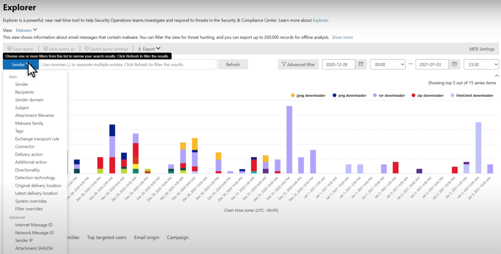

# Bedrohungssuche im Threat Explorer für Microsoft Defender für Office 365

Inhalt dieses Artikels:

- [Begeh-nen des Bedrohungs-Explorers](#threat-explorer-walk-through)
- [E-Mail-Untersuchung](#email-investigation)
- [E-Mail-Korrektur](#email-remediation)
- [Verbesserungen bei der Bedrohungssuche](#improvements-to-threat-hunting-experience)

> [!NOTE]
> Dies ist Teil einer **3-Artikel-Reihe** über Threat **Explorer (Explorer),** **E-Mail-Sicherheit** **und** Explorer- und Echtzeiterkennungsgrund grundlagen (z. B. Unterschiede zwischen den Tools und Berechtigungen, die für deren Betrieb erforderlich sind). Die anderen beiden Artikel in dieser Reihe sind [E-Mail-Sicherheit](real-time-detections.md) [mit Threat Explorer](email-security-in-microsoft-defender.md) und Threat Explorer und Grundlagen der Echtzeiterkennung.

**Gilt für**
- [Microsoft Defender für Office 365 Plan 1 und Plan 2](defender-for-office-365.md)
- [Microsoft 365 Defender](../defender/microsoft-365-defender.md)

Wenn Ihre Organisation [über Microsoft Defender für Office 365](defender-for-office-365.md)verfügt und Sie über  die Berechtigungen [verfügen,](#required-licenses-and-permissions)können Sie **Explorer-** oder Echtzeiterkennungen verwenden, um Bedrohungen zu erkennen und zu abwehren. 

Wechseln Sie im **Security & Compliance Center** zu Bedrohungsverwaltung, und wählen Sie dann **Explorer-**  oder **Echtzeiterkennungen aus.** 

 

****

|Mit Microsoft Defender für Office 365 Plan 2 sehen Sie:|Mit Microsoft Defender für Office 365 Plan 1 sehen Sie:|
|---|---|
|||
|

Mit diesen Tools können Sie folgende Aktionen ausführen:

- Siehe Schadsoftware, die von Microsoft 365 erkannt wird
- Anzeigen der Phishing-URL und Klicken auf Verdingungsdaten
- Starten eines automatisierten Untersuchungs- und Reaktionsprozesses aus einer Ansicht im Explorer
- Untersuchen bösartiger E-Mails und mehr

Weitere Informationen finden Sie unter [E-Mail-Sicherheit mit Dem Bedrohungs-Explorer](email-security-in-microsoft-defender.md). 

## Begeh-nen des Bedrohungs-Explorers

In Microsoft Defender für Office 365 gibt es zwei Abonnementpläne: Plan 1 und Plan 2. Manuell betriebene Tools zur Bedrohungssuche sind in beiden Plänen unter unterschiedlichen Namen und mit unterschiedlichen Funktionen vorhanden.

Defender for Office 365 Plan 1 verwendet Echtzeiterkennungen , die eine Teilmenge des *Bedrohungs-Explorers*(auch *Explorer* genannt) in Plan 2 ist.  In dieser Artikelreihe wurden die meisten Beispiele mit dem vollständigen Bedrohungs-Explorer erstellt. Administratoren sollten alle Schritte in Echtzeiterkennungen testen, um zu sehen, wo sie angewendet werden.

Wechseln Sie zum Öffnen des Explorer-Tools zu **Security & Compliance Center** Threat  >  **Management**  >  **Explorer** (oder **Echtzeiterkennungen**). Standardmäßig gelangen Sie auf der  Seite Schadsoftware, aber verwenden Sie die Dropdownliste Ansicht, um sich mit Ihren Optionen vertraut zu machen.  Wenn Sie nach Phish suchen oder in eine Bedrohungskampagne graben, wählen Sie diese Ansichten aus.

> [!div class="mx-imgBorder"]
> 

Sobald eine Person für Sicherheitsvorgänge (Sec Ops) die daten auswählt, die sie anzeigen möchten, ob es sich bei dem Bereich um eine schmale Ansicht wie Benutzerübermittlungen oder eine breitere Ansicht wie Alle E-Mails **handelt,** kann sie die Schaltfläche **Absender** verwenden, um weitere Filter zu erstellen. Denken Sie daran, aktualisieren auszuwählen, um die Filteraktionen zu vervollständigen.

> [!div class="mx-imgBorder"]
> 

Das Verfeinern des Fokus in Explorer oder die Echtzeiterkennung kann in Ebenen verwendet werden. Die erste ist **View**. Die zweite kann als gefilterter *Fokus bezeichnet werden.* Sie können z. B. die Schritte, die Sie bei der Suche nach einer Bedrohung unternommen haben, erneut nachverbilden, indem Sie Ihre Entscheidungen wie die folgende aufzeichnen: Um das Problem im Explorer zu finden, habe ich die Schadsoftwareansicht mit dem Filterfokus Empfänger **ausgewählt.** Dies erleichtert die Nachverarbeitung Ihrer Schritte.

> [!TIP]
> Wenn Sec Ops Tags verwendet, um Konten zu markieren, die sie als besonders geschätzte Ziele betrachten, können sie Auswahlen wie die *Phish-Ansicht* mit einem Tags-Filterfokus treffen (bei Verwendung einen Datumsbereich enthalten).  Dies zeigt ihnen alle Phishingversuche, die während eines bestimmten Zeitraums auf ihre hochwertigen Benutzerziele gerichtet sind (z. B. Datumsangaben, an denen bestimmte Phishingangriffe für ihre Branche sehr viel passieren). 

Verfeinerungen können für Datumsbereiche mithilfe der Datumsbereichssteuerelemente vorgenommen werden. Hier sehen Sie Explorer in **der Ansicht Schadsoftware** mit dem **Filterfokus Erkennungstechnologie.** Es ist jedoch die Schaltfläche **Erweitert,** mit der Sec Ops-Teams tief schweifen können. 

> [!div class="mx-imgBorder"]
> 

Wenn Sie auf den **Erweiterten** Filter klicken, wird ein Bereich angezeigt, in dem Sec Ops-Jäger Abfragen selbst erstellen können, damit sie die informationen, die sie sehen müssen, ein- oder ausschließen können. Sowohl das Diagramm als auch die Tabelle auf der Explorer-Seite spiegeln ihre Ergebnisse wider. 

> [!div class="mx-imgBorder"]
> 

Verwenden Sie **die Schaltfläche** Spaltenoptionen, um die Art von Informationen in der Tabelle zu erhalten, die am hilfreichsten wären: 

> [!div class="mx-imgBorder"]
> 

> [!div class="mx-imgBorder"]
> 

Stellen Sie in derselben Mien sicher, dass Sie die Anzeigeoptionen testen. Unterschiedliche Zielgruppen reagieren gut auf unterschiedliche Präsentationen derselben Daten. Für einige Betrachter kann die Karte **"E-Mail-Ursprünge"** zeigen,  dass eine Bedrohung weit verbreitet oder diskreter ist als die Anzeigeoption Kampagnen direkt daneben. Sec Ops können diese Displays nutzen, um punktet, die die Notwendigkeit von Sicherheit und Schutz unterstreichen, oder für einen späteren Vergleich, um die Effektivität ihrer Aktionen zu demonstrieren. 

> [!div class="mx-imgBorder"]
> 

> [!div class="mx-imgBorder"]
> 

### E-Mail-Untersuchung

Wenn eine verdächtige E-Mail angezeigt wird, klicken Sie auf den Namen, um das Flyout auf der rechten Seite zu erweitern. Hier ist das Banner verfügbar, mit dem Sec Ops die [E-Mail-Entitätsseite](mdo-email-entity-page.md) anzeigen kann.

Die Seite "E-Mail-Entität" ziehe Inhalte zusammen, die unter **Details**, **Attachments**, **Devices**, gefunden werden können, aber mehr organisierte Daten enthalten. Dazu gehören Z. B. DMARC-Ergebnisse, Nur-Text-Anzeige des E-Mail-Headers mit einer Kopieroption, Verdingungsinformationen zu Anlagen, die sicher detoniert wurden, und Dateien, die diese Detonationen verworfen haben (z. B. IP-Adressen, die kontaktiert wurden, sowie Screenshots von Seiten oder Dateien). URLs und ihre Urteile werden auch mit ähnlichen Details aufgelistet. 

Wenn Sie diese Phase erreichen, ist die E-Mail-Entitätsseite für den letzten Schritt entscheidend:*Korrektur.* 

> [!div class="mx-imgBorder"]
> 

> [!TIP]
> Weitere Informationen zur Seite mit der Rich-E-Mail-Entität (siehe unten auf der Registerkarte Analyse), einschließlich der Ergebnisse von detonierten Anlagen, Erkenntnissen für enthaltene URLs und sicherer E-Mail-Vorschau, klicken Sie [hier](mdo-email-entity-page.md). 

> [!div class="mx-imgBorder"]
> 

### E-Mail-Korrektur

Sobald eine Sec Ops-Person feststellt, dass eine E-Mail eine Bedrohung ist, geht es im nächsten Explorer- oder Echtzeiterkennungsschritt um die Bedrohung und deren Behebung. Dazu kehren Sie zum Bedrohungs-Explorer zurück, aktivieren das Kontrollkästchen für die Problem-E-Mail und verwenden die **Schaltfläche** Aktionen.

> [!div class="mx-imgBorder"]
> 

Hier kann der Analytiker Aktionen wie das Melden der E-Mails als Spam, Phishing oder Schadsoftware, das Kontaktieren von Empfängern oder weitere Untersuchungen durchführen, die das Auslösen automatisierter Untersuchungs- und Reaktionsbücher (oder AIR)-Playbooks (sofern Plan 2 enthalten) umfassen können. Oder die E-Mails können auch als "sauber" gemeldet werden.

> [!div class="mx-imgBorder"]
> 

## Verbesserungen bei der Bedrohungssuche

### Warnungs-ID

Wenn Sie von einer Warnung in  den Bedrohungs-Explorer navigieren, wird die Ansicht nach Warnungs-ID **gefiltert.** Dies gilt auch für die Echtzeiterkennung. Nachrichten, die für die jeweilige Warnung relevant sind, und eine E-Mail-Summe (eine Anzahl) werden angezeigt. Sie können sehen, ob eine Nachricht Teil einer Warnung war, und von dieser Nachricht zur zugehörigen Warnung navigieren.

Schließlich ist die Warnungs-ID in der URL enthalten, z. B.: `https://protection.office.com/viewalerts?id=372c9b5b-a6c3-5847-fa00-08d8abb04ef1`

> [!div class="mx-imgBorder"]
> 

> [!div class="mx-imgBorder"]
> 

### Erweitern der Datenaufbewahrung und des Suchgrenzwerts für Test-Mandanten durch Explorer (und Echtzeiterkennungen) 

Im Rahmen dieser Änderung können Analysten E-Mail-Daten innerhalb von 30 Tagen (erhöht von sieben Tagen) im Bedrohungs-Explorer und in Echtzeiterkennungen für Defender für Office P1- und P2-Test-Mandanten suchen und filtern. Dies wirkt sich nicht auf Produktions mandanten für P1- und P2 E5-Kunden aus, bei denen die Aufbewahrungseinstellung bereits 30 Tage beträgt.

### Exportgrenzwert aktualisiert 

Die Anzahl der E-Mail-Datensätze, die aus dem Bedrohungs-Explorer exportiert werden können, beträgt jetzt 200.000 (vor 9990). Der Satz von Spalten, die exportiert werden können, bleibt unverändert. 

### Tags im Bedrohungs-Explorer

> [!NOTE]
> Das Feature für Benutzertags befindet sich in der Vorschau und ist möglicherweise nicht für alle verfügbar. Außerdem können Vorschauen geändert werden. Informationen zum Veröffentlichungszeitplan finden Sie in der Microsoft 365 Roadmap.

Benutzertags identifizieren bestimmte Benutzergruppen in Microsoft Defender für Office 365. Weitere Informationen zu Tags, einschließlich Lizenzierung und Konfiguration, finden Sie unter [User tags](user-tags.md).

Im Bedrohungs-Explorer finden Sie Informationen zu Benutzertags in den folgenden Benutzeroberflächen.

#### E-Mail-Rasteransicht

Wenn Analysten die Spalte **Tags** im E-Mail-Raster betrachten, werden alle Tags angezeigt, die auf Absender- oder Empfängerpostfächer angewendet wurden. Standardmäßig werden Systemtags wie *Prioritätskonten* zuerst angezeigt.

> [!div class="mx-imgBorder"]
> 

#### Filtern

Tags können als Filter verwendet werden. Verwenden Sie auf diese Weise nur die Suche zwischen Prioritätskonten, oder verwenden Sie bestimmte Benutzertagsszenarien. Sie können auch Ergebnisse mit bestimmten Tags ausschließen. Kombinieren Sie Tags mit anderen Filtern und Datumsbereichen, um Den Untersuchungsbereich zu einenten. 

> [!div class="mx-imgBorder"]
> 

#### Flyout für E-Mail-Details

Um die einzelnen Tags für Absender und Empfänger anzuzeigen, wählen Sie eine E-Mail aus, um das Flyout für Nachrichtendetails zu öffnen. Auf der **Registerkarte Zusammenfassung** werden die Absender- und Empfängertags separat angezeigt. Die Informationen zu einzelnen Tags für Absender und Empfänger können als CSV-Daten exportiert werden. 

> [!div class="mx-imgBorder"]
> 

Tags-Informationen werden auch im Flyout "URL-Klicks" angezeigt. Um dies zu sehen, wechseln Sie zur Registerkarte Phish oder Alle E-Mail-> **URLs** oder **URL-Klicks.** Wählen Sie ein einzelnes URL-Flyout aus, um zusätzliche Details zu Klicks für diese URL anzuzeigen, einschließlich aller Tags, die diesem Klick zugeordnet sind.

### Aktualisierte Zeitachsenansicht

> [!div class="mx-imgBorder"]
> 
>
Erfahren Sie mehr, in dem Sie [dieses Video](https://www.youtube.com/watch?v=UoVzN0lYbfY&list=PL3ZTgFEc7LystRja2GnDeUFqk44k7-KXf&index=4) ansehen.

## Erweiterte Funktionen

### Benutzer mit den meisten Zielbenutzern

Top Malware Families shows the **top targeted users** in the Malware section. Die Top-Zielbenutzer werden auch über Phish- und Alle E-Mail-Ansichten erweitert. Analysten können die fünf zielorientierten Benutzer sowie die Anzahl der Versuche für jeden Benutzer in jeder Ansicht anzeigen. 

Sicherheitsvorgänge Personen können die Liste der Zielbenutzer exportieren, bis zu einem Grenzwert von 3.000, zusammen mit der Anzahl der durchgeführten Versuche, für die Offlineanalyse für jede E-Mail-Ansicht. Wenn Sie außerdem die Anzahl der Versuche auswählen (z. B. 13 Versuche in der abbildung unten), wird eine gefilterte Ansicht im Bedrohungs-Explorer geöffnet, damit Sie weitere Details in E-Mails und Bedrohungen für diesen Benutzer sehen können.  

> [!div class="mx-imgBorder"]
> 

### Exchange Transportregeln

Das Sicherheitsbetriebsteam kann alle Exchange Transportregeln (oder Nachrichtenflussregeln) anzeigen, die auf eine Nachricht angewendet werden, in der Ansicht E-Mail-Raster. Wählen **Sie spaltenoptionen** im Raster aus, und fügen Sie **dann Exchange Transportregel** in den Spaltenoptionen hinzu. Die Exchange Transportregeln wird auch im **Flyout Details** in der E-Mail angezeigt. 

Namen und GUIDs der Transportregeln, die auf die Nachricht angewendet werden, werden angezeigt. Analysten können mithilfe des Namens der Transportregel nach Nachrichten suchen. Dies ist eine CONTAINS-Suche, was bedeutet, dass Sie auch Teilsuchen machen können. 

> [!IMPORTANT]
> Exchange Die Suche nach Transportregel und die Verfügbarkeit von Namen hängen von der ihnen zugewiesenen rolle ab. Sie benötigen eine der folgenden Rollen oder Berechtigungen, um die Namen der Transportregel und die Suche anzeigen zu können. Auch ohne die folgenden Rollen oder Berechtigungen kann ein Analytiker jedoch die Transportregelbezeichnung und GUID-Informationen in den E-Mail-Details sehen. Andere Aufzeichnungsansichtserfahrungen in E-Mail-Rastern, E-Mail-Flyouts, Filtern und Export sind nicht betroffen.
>
> - Exchange Online Nur – Verhinderung von Datenverlust: Alle
> - Exchange Online Only - O365SupportViewConfig: All
> - Microsoft Azure Active Directory oder Exchange Online - Sicherheitsadministrator: Alle
> - Azure Active Directory oder Exchange Online - Security Reader: All
> - Exchange Online Nur - Transportregeln: Alle
> - Exchange Online Only - View-Only Configuration: All
>
> Innerhalb des E-Mail-Rasters, des Details-Flyouts und des exportierten CSV erhalten die ETRs eine Name/GUID, wie unten gezeigt.
>
> > [!div class="mx-imgBorder"]
> > 

### Eingehende Connectors

Connectors sind eine Sammlung von Anweisungen, die anpassen, wie Ihre E-Mails zu ihrer Organisation Microsoft 365 oder Office 365 werden. Sie ermöglichen ihnen das Anwenden von Sicherheitseinschränkungen oder -steuerelementen. Im Bedrohungs-Explorer können Sie die Konnektoren anzeigen, die mit einer E-Mail in Zusammenhang stehen, und mithilfe von Connectornamen nach E-Mails suchen. 

Die Suche nach Connectors ist eine CONTAINS-Abfrage, was bedeutet, dass teilbegriffssuchen funktionieren können: 

> [!div class="mx-imgBorder"]
> 

## Erforderliche Lizenzen und Berechtigungen

Sie müssen [über Microsoft Defender verfügen, Office 365](defender-for-office-365.md) Explorer oder Echtzeiterkennungen verwenden können.

- Explorer ist in Defender for Office 365 Plan 2 enthalten.
- Der Bericht "Echtzeiterkennungen" ist in Defender for Office 365 Plan 1 enthalten.
- Planen Sie die Zuweisung von Lizenzen für alle Benutzer, die von Defender für alle Benutzer geschützt Office 365. Explorer- und Echtzeiterkennungen zeigen Erkennungsdaten für lizenzierte Benutzer an.

Zum Anzeigen und Verwenden von Explorer- oder Echtzeiterkennungen müssen Sie über Folgendes verfügen:

- Für das Security & Compliance Center:

  - Organisationsverwaltung
  - Sicherheitsadministrator (dies kann im Azure Active Directory Admin Center zugewiesen werden ( <https://aad.portal.azure.com> )
  - Sicherheitsleseberechtigter

- Für Exchange Online:

  - Organisationsverwaltung
  - Organisationsverwaltung – nur Leserechte
  - Schreibgeschützte Empfänger
  - Verwaltung der Richtlinientreue

Weitere Informationen zu Rollen und Berechtigungen finden Sie in den folgenden Ressourcen:

- [Berechtigungen im Security & Compliance Center](permissions-in-the-security-and-compliance-center.md)
- [Featureberechtigungen in Exchange Online](/exchange/permissions-exo/feature-permissions)
- [Exchange Online PowerShell](/powershell/exchange/exchange-online-powershell)

## Weitere Informationen

- [Suchen und Untersuchen von bösartigen E-Mails, die zugestellt wurden](investigate-malicious-email-that-was-delivered.md) 
- [Anzeigen von schädlichen Dateien, die in SharePoint Online, OneDrive und Microsoft Teams](mdo-for-spo-odb-and-teams.md) 
- [Erhalten Sie eine Übersicht über die Ansichten im Bedrohungs-Explorer (und Echtzeiterkennungen)](threat-explorer-views.md) 
- [Threat Protection-Statusbericht](view-email-security-reports.md#threat-protection-status-report) 
- [Automatische Untersuchung und Reaktion in Microsoft Threat Protection](automated-investigation-response-office.md) 
- [Untersuchen von E-Mails mit der Seite "E-Mail-Entität"](mdo-email-entity-page.md)