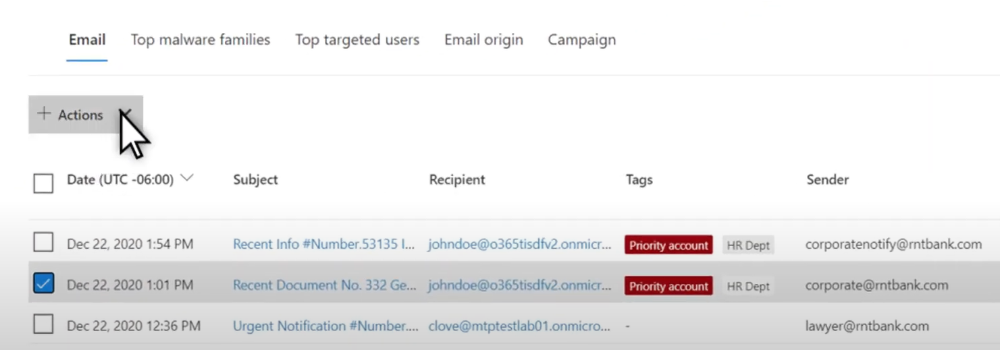

# Bedrohungssuche im Threat Explorer für Microsoft Defender für Office 365Threat hunting in Threat Explorer for Microsoft Defender for Office 365

Inhalt dieses Artikels:In this article:

- [Begeh-nen des Bedrohungs-ExplorersThreat Explorer walk-through](#threat-explorer-walk-through)
- [E-Mail-UntersuchungEmail investigation](#email-investigation)
- [E-Mail-KorrekturEmail remediation](#email-remediation)
- [Verbesserungen bei der BedrohungssucheImprovements to threat hunting experience](#improvements-to-threat-hunting-experience)

> [!NOTE]
> Dies ist Teil einer **3-Artikel-Reihe** über Threat **Explorer (Explorer),** **E-Mail-Sicherheit** **und** Explorer- und Echtzeiterkennungsgrund grundlagen (z. B. Unterschiede zwischen den Tools und Berechtigungen, die für deren Betrieb erforderlich sind).This is part of a **3-article series** on **Threat Explorer (Explorer)**, **email security**, and **Explorer and Real-time detections basics** (such as differences between the tools, and permissions needed to operate them). Die anderen beiden Artikel in dieser Reihe sind [E-Mail-Sicherheit](real-time-detections.md) [mit Threat Explorer](email-security-in-microsoft-defender.md) und Threat Explorer und Grundlagen der Echtzeiterkennung.The other two articles in this series are [Email security with Threat Explorer](email-security-in-microsoft-defender.md) and [Threat Explorer and Real-time detections basics](real-time-detections.md).

**Gilt für****Applies to**
- [Microsoft Defender für Office 365 Plan 1 und Plan 2Microsoft Defender for Office 365 plan 1 and plan 2](defender-for-office-365.md)
- [Microsoft 365 DefenderMicrosoft 365 Defender](../defender/microsoft-365-defender.md)

Wenn Ihre Organisation [über Microsoft Defender für Office 365](defender-for-office-365.md)verfügt und Sie über  die Berechtigungen [verfügen,](#required-licenses-and-permissions)können Sie **Explorer-** oder Echtzeiterkennungen verwenden, um Bedrohungen zu erkennen und zu abwehren.If your organization has [Microsoft Defender for Office 365](defender-for-office-365.md), and you have the [permissions](#required-licenses-and-permissions), you can use **Explorer** or **Real-time detections** to detect and remediate threats. 

Wechseln Sie im **Security & Compliance Center** zu Bedrohungsverwaltung, und wählen Sie dann **Explorer-**  oder **Echtzeiterkennungen aus.** In the **Security & Compliance Center**, go to **Threat management**, and then choose **Explorer** _or_ **Real-time detections**.

 

****

|Mit Microsoft Defender für Office 365 Plan 2 sehen Sie:With Microsoft Defender for Office 365 Plan 2, you see:|Mit Microsoft Defender für Office 365 Plan 1 sehen Sie:With Microsoft Defender for Office 365 Plan 1, you see:|
|---|---|
|||
|

Mit diesen Tools können Sie folgende Aktionen ausführen:With these tools, you can:

- Siehe Schadsoftware, die von Microsoft 365 erkannt wirdSee malware detected by Microsoft 365 security features
- Anzeigen der Phishing-URL und Klicken auf VerdingungsdatenView phishing URL and click verdict data
- Starten eines automatisierten Untersuchungs- und Reaktionsprozesses aus einer Ansicht im ExplorerStart an automated investigation and response process from a view in Explorer
- Untersuchen bösartiger E-Mails und mehrInvestigate malicious email, and more

Weitere Informationen finden Sie unter [E-Mail-Sicherheit mit Dem Bedrohungs-Explorer](email-security-in-microsoft-defender.md).For more information, see [Email security with Threat Explorer](email-security-in-microsoft-defender.md). 

## Begeh-nen des Bedrohungs-ExplorersThreat Explorer walk-through

In Microsoft Defender für Office 365 gibt es zwei Abonnementpläne: Plan 1 und Plan 2.In Microsoft Defender for Office 365, there are two subscription plans—Plan 1 and Plan 2. Manuell betriebene Tools zur Bedrohungssuche sind in beiden Plänen unter unterschiedlichen Namen und mit unterschiedlichen Funktionen vorhanden.Manually operated Threat hunting tools exist in both plans, under different names and with different capabilities.

Defender for Office 365 Plan 1 verwendet Echtzeiterkennungen , die eine Teilmenge des *Bedrohungs-Explorers*(auch *Explorer* genannt) in Plan 2 ist. Defender for Office 365 Plan 1 uses *Real-time detections*, which is a subset of the *Threat Explorer* (also called *Explorer*) hunting tool in Plan 2. In dieser Artikelreihe wurden die meisten Beispiele mit dem vollständigen Bedrohungs-Explorer erstellt.In this series of articles, most of the examples were created using the full Threat Explorer. Administratoren sollten alle Schritte in Echtzeiterkennungen testen, um zu sehen, wo sie angewendet werden.Admins should test any steps in Real-time detections to see where they apply.

Wechseln Sie zum Öffnen des Explorer-Tools zu **Security & Compliance Center** Threat  >  **Management**  >  **Explorer** (oder **Echtzeiterkennungen**).To open the Explorer tool, go to **Security & Compliance Center** > **Threat management** > **Explorer** (or **Real-time detections**). Standardmäßig gelangen Sie auf der  Seite Schadsoftware, aber verwenden Sie die Dropdownliste Ansicht, um sich mit Ihren Optionen vertraut zu machen. By default, you’ll arrive on the **Malware** page, but use the **View** drop down to get familiar with your options. Wenn Sie nach Phish suchen oder in eine Bedrohungskampagne graben, wählen Sie diese Ansichten aus.If you’re hunting Phish, or digging into a threat campaign, choose those views.

> [!div class="mx-imgBorder"]
> 

Sobald eine Person für Sicherheitsvorgänge (Sec Ops) die daten auswählt, die sie anzeigen möchten, ob es sich bei dem Bereich um eine schmale Ansicht wie Benutzerübermittlungen oder eine breitere Ansicht wie Alle E-Mails **handelt,** kann sie die Schaltfläche **Absender** verwenden, um weitere Filter zu erstellen.Once a security operations (Sec Ops) person selects the data they want to see, whether the scope is narrow view like user **Submissions**, or a wider view, like **All email**, they can use the **Sender** button to further filter. Denken Sie daran, aktualisieren auszuwählen, um die Filteraktionen zu vervollständigen.Remember to select Refresh to complete your filtering actions.

> [!div class="mx-imgBorder"]
> 

Das Verfeinern des Fokus in Explorer oder die Echtzeiterkennung kann in Ebenen verwendet werden.Refining focus in Explorer or Real-time detection can be thought of in layers. Die erste ist **View**.The first is **View**. Die zweite kann als gefilterter *Fokus bezeichnet werden.*The second can be thought of as a *filtered focus*. Sie können z. B. die Schritte, die Sie bei der Suche nach einer Bedrohung unternommen haben, erneut nachverbilden, indem Sie Ihre Entscheidungen wie die folgende aufzeichnen: Um das Problem im Explorer zu finden, habe ich die Schadsoftwareansicht mit dem Filterfokus Empfänger **ausgewählt.**For example, you can retrace the steps you took in finding a threat by recording your decisions like this: To find the issue in Explorer, **I chose the Malware View with a Recipient filter focus**. Dies erleichtert die Nachverarbeitung Ihrer Schritte.This makes retracing your steps easier.

> [!TIP]
> Wenn Sec Ops Tags verwendet, um Konten zu markieren, die sie als besonders geschätzte Ziele betrachten, können sie Auswahlen wie die *Phish-Ansicht* mit einem Tags-Filterfokus treffen (bei Verwendung einen Datumsbereich enthalten). If Sec Ops uses **Tags** to mark accounts they consider high valued targets, they can make selections like *Phish View with a Tags filter focus (include a date range if used)*. Dies zeigt ihnen alle Phishingversuche, die während eines bestimmten Zeitraums auf ihre hochwertigen Benutzerziele gerichtet sind (z. B. Datumsangaben, an denen bestimmte Phishingangriffe für ihre Branche sehr viel passieren).This will show them any phishing attempts directed at their high value user targets during a time-range (like dates when certain phishing attacks are happening a lot for their industry). 

Verfeinerungen können für Datumsbereiche mithilfe der Datumsbereichssteuerelemente vorgenommen werden.Refinements can be made on date ranges by using the date range controls. Hier sehen Sie Explorer in **der Ansicht Schadsoftware** mit dem **Filterfokus Erkennungstechnologie.**Here you can see Explorer in **Malware** view, with a **Detection Technology** filter focus. Es ist jedoch die Schaltfläche **Erweitert,** mit der Sec Ops-Teams tief schweifen können.But it’s the **Advanced filter** button that lets Sec Ops teams dig deep. 

> [!div class="mx-imgBorder"]
> 

Wenn Sie auf den **Erweiterten** Filter klicken, wird ein Bereich angezeigt, in dem Sec Ops-Jäger Abfragen selbst erstellen können, damit sie die informationen, die sie sehen müssen, ein- oder ausschließen können.Clicking the **Advanced filter** pops a panel that will let Sec Ops hunters build queries themselves, letting them include or exclude the information they need to see. Sowohl das Diagramm als auch die Tabelle auf der Explorer-Seite spiegeln ihre Ergebnisse wider.Both the chart and table on the Explorer page will reflect their results. 

> [!div class="mx-imgBorder"]
> 

Verwenden Sie **die Schaltfläche** Spaltenoptionen, um die Art von Informationen in der Tabelle zu erhalten, die am hilfreichsten wären:Use the **Column options** button to get the kind of information on the table that would be most helpful: 

> [!div class="mx-imgBorder"]
> 

> [!div class="mx-imgBorder"]
> 

Stellen Sie in derselben Mien sicher, dass Sie die Anzeigeoptionen testen.In the same mien, make sure to test your display options. Unterschiedliche Zielgruppen reagieren gut auf unterschiedliche Präsentationen derselben Daten.Different audiences will react well to different presentations of the same data. Für einige Betrachter kann die Karte **"E-Mail-Ursprünge"** zeigen,  dass eine Bedrohung weit verbreitet oder diskreter ist als die Anzeigeoption Kampagnen direkt daneben.For some viewers, the **Email Origins** map can show that a threat is widespread or discreet more quickly than the **Campaign display** option right next to it. Sec Ops können diese Displays nutzen, um punktet, die die Notwendigkeit von Sicherheit und Schutz unterstreichen, oder für einen späteren Vergleich, um die Effektivität ihrer Aktionen zu demonstrieren.Sec Ops can make use of these displays to best make points that underscore the need for security and protection, or for later comparison, to demonstrate the effectiveness of their actions. 

> [!div class="mx-imgBorder"]
> 

> [!div class="mx-imgBorder"]
> 

### E-Mail-UntersuchungEmail investigation

Wenn eine verdächtige E-Mail angezeigt wird, klicken Sie auf den Namen, um das Flyout auf der rechten Seite zu erweitern.When you see a suspicious email, click the name to expand the flyout on the right. Hier ist das Banner verfügbar, mit dem Sec Ops die [E-Mail-Entitätsseite](mdo-email-entity-page.md) anzeigen kann.Here, the banner that lets Sec Ops see the [email entity page](mdo-email-entity-page.md) is available.

Die Seite "E-Mail-Entität" ziehe Inhalte zusammen, die unter **Details**, **Attachments**, **Devices**, gefunden werden können, aber mehr organisierte Daten enthalten.The email entity page pulls together contents that can be found under **Details**, **Attachments**, **Devices**, but includes more organized data. Dazu gehören Z. B. DMARC-Ergebnisse, Nur-Text-Anzeige des E-Mail-Headers mit einer Kopieroption, Verdingungsinformationen zu Anlagen, die sicher detoniert wurden, und Dateien, die diese Detonationen verworfen haben (z. B. IP-Adressen, die kontaktiert wurden, sowie Screenshots von Seiten oder Dateien).This includes things like DMARC results, plain text display of the email header with a copy option, verdict information on attachments that were securely detonated, and files those detonations dropped (can include IP addresses that were contacted and screenshots of pages or files). URLs und ihre Urteile werden auch mit ähnlichen Details aufgelistet.URLs and their verdicts are also listed with similar details reported. 

Wenn Sie diese Phase erreichen, ist die E-Mail-Entitätsseite für den letzten Schritt entscheidend:*Korrektur.*When you reach this stage, the email entity page will be critical to the final step—*remediation*. 

> [!div class="mx-imgBorder"]
> 

> [!TIP]
> Weitere Informationen zur Seite mit der Rich-E-Mail-Entität (siehe unten auf der Registerkarte Analyse), einschließlich der Ergebnisse von detonierten Anlagen, Erkenntnissen für enthaltene URLs und sicherer E-Mail-Vorschau, klicken Sie [hier](mdo-email-entity-page.md). To learn more about the rich email entity page (seen below on the **Analysis** tab), including the results of detonated Attachments, findings for included URLs, and safe Email preview, click [here](mdo-email-entity-page.md).

> [!div class="mx-imgBorder"]
> 

### E-Mail-KorrekturEmail remediation

Sobald eine Sec Ops-Person feststellt, dass eine E-Mail eine Bedrohung ist, geht es im nächsten Explorer- oder Echtzeiterkennungsschritt um die Bedrohung und deren Behebung.Once a Sec Ops person determines that an email is a threat, the next Explorer or Real-time detection step is dealing with the threat and remediating it. Dazu kehren Sie zum Bedrohungs-Explorer zurück, aktivieren das Kontrollkästchen für die Problem-E-Mail und verwenden die **Schaltfläche** Aktionen.This can be done by returning to Threat Explorer, selecting the checkbox for the problem email, and using the **Actions** button.

> [!div class="mx-imgBorder"]
> 

Hier kann der Analytiker Aktionen wie das Melden der E-Mails als Spam, Phishing oder Schadsoftware, das Kontaktieren von Empfängern oder weitere Untersuchungen durchführen, die das Auslösen automatisierter Untersuchungs- und Reaktionsbücher (oder AIR)-Playbooks (sofern Plan 2 enthalten) umfassen können.Here, the analyst can take actions like reporting the mail as Spam, Phishing, or Malware, contacting recipients, or further investigations that can include triggering Automated Investigation and Response (or AIR) playbooks (if you have Plan 2). Oder die E-Mails können auch als "sauber" gemeldet werden.Or, the mail can also be reported as clean.

> [!div class="mx-imgBorder"]
> 

## Verbesserungen bei der BedrohungssucheImprovements to threat hunting experience

### Warnungs-IDAlert ID

Wenn Sie von einer Warnung in  den Bedrohungs-Explorer navigieren, wird die Ansicht nach Warnungs-ID **gefiltert.**When navigating from an alert into Threat Explorer, the **View** will be filtered by **Alert ID**. Dies gilt auch für die Echtzeiterkennung.This also applies in Real-time detection. Nachrichten, die für die jeweilige Warnung relevant sind, und eine E-Mail-Summe (eine Anzahl) werden angezeigt.Messages relevant to the specific alert, and an email total (a count) are shown. Sie können sehen, ob eine Nachricht Teil einer Warnung war, und von dieser Nachricht zur zugehörigen Warnung navigieren.You will be able to see if a message was part of an alert, as well as navigate from that message to the related alert.

Schließlich ist die Warnungs-ID in der URL enthalten, z. B.: `https://protection.office.com/viewalerts?id=372c9b5b-a6c3-5847-fa00-08d8abb04ef1`Finally, alert ID is included in the URL, for example: `https://protection.office.com/viewalerts?id=372c9b5b-a6c3-5847-fa00-08d8abb04ef1`

> [!div class="mx-imgBorder"]
> 

> [!div class="mx-imgBorder"]
> 

### Erweitern der Datenaufbewahrung und des Suchgrenzwerts für Test-Mandanten durch Explorer (und Echtzeiterkennungen)Extending Explorer (and Real-time detections) data retention and search limit for trial tenants 

Im Rahmen dieser Änderung können Analysten E-Mail-Daten innerhalb von 30 Tagen (erhöht von sieben Tagen) im Bedrohungs-Explorer und in Echtzeiterkennungen für Defender für Office P1- und P2-Test-Mandanten suchen und filtern.As part of this change, analysts will be able to search for, and filter email data across 30 days (increased from seven days) in Threat Explorer and Real-time detections for both Defender for Office P1 and P2 trial tenants. Dies wirkt sich nicht auf Produktions mandanten für P1- und P2 E5-Kunden aus, bei denen die Aufbewahrungseinstellung bereits 30 Tage beträgt.This doesn’t impact any production tenants for both P1 and P2 E5 customers, where the retention default is already 30 days.

### Exportgrenzwert aktualisiertUpdated Export limit 

Die Anzahl der E-Mail-Datensätze, die aus dem Bedrohungs-Explorer exportiert werden können, beträgt jetzt 200.000 (vor 9990).The number of Emails records that can be exported from Threat Explorer is now 200,000 (was 9990). Der Satz von Spalten, die exportiert werden können, bleibt unverändert.The set of columns that can be exported is unchanged. 

### Tags im Bedrohungs-ExplorerTags in Threat Explorer

> [!NOTE]
> Das Feature für Benutzertags befindet sich in der Vorschau und ist möglicherweise nicht für alle verfügbar.The user tags feature is in Preview and may not be available to everyone. Außerdem können Vorschauen geändert werden.Also, Previews are subject to change. Informationen zum Veröffentlichungszeitplan finden Sie in der Microsoft 365 Roadmap.For information about the release schedule, check out the Microsoft 365 roadmap.

Benutzertags identifizieren bestimmte Benutzergruppen in Microsoft Defender für Office 365.User tags identify specific groups of users in Microsoft Defender for Office 365. Weitere Informationen zu Tags, einschließlich Lizenzierung und Konfiguration, finden Sie unter [User tags](user-tags.md).For more information about tags, including licensing and configuration, see [User tags](user-tags.md).

Im Bedrohungs-Explorer finden Sie Informationen zu Benutzertags in den folgenden Benutzeroberflächen.In Threat Explorer, you can see information about user tags in the following experiences.

#### E-Mail-RasteransichtEmail grid view

Wenn Analysten die Spalte **Tags** im E-Mail-Raster betrachten, werden alle Tags angezeigt, die auf Absender- oder Empfängerpostfächer angewendet wurden.When analysts look at the **Tags** column the email grid, they are seeing all tags that have been applied to sender or recipient mailboxes. Standardmäßig werden Systemtags wie *Prioritätskonten* zuerst angezeigt.By default, system tags like *priority accounts* are shown first.

> [!div class="mx-imgBorder"]
> 

#### FilternFiltering

Tags können als Filter verwendet werden.Tags can be used as filters. Verwenden Sie auf diese Weise nur die Suche zwischen Prioritätskonten, oder verwenden Sie bestimmte Benutzertagsszenarien.Hunt among priority accounts only, or use specific user tags scenarios this way. Sie können auch Ergebnisse mit bestimmten Tags ausschließen.You can also exclude results that have certain tags. Kombinieren Sie Tags mit anderen Filtern und Datumsbereichen, um Den Untersuchungsbereich zu einenten.Combine Tags with other filters and date ranges to narrow your scope of investigation. 

> [!div class="mx-imgBorder"]
> 

#### Flyout für E-Mail-DetailsEmail detail flyout

Um die einzelnen Tags für Absender und Empfänger anzuzeigen, wählen Sie eine E-Mail aus, um das Flyout für Nachrichtendetails zu öffnen.To view the individual tags for sender and recipient, select an email to open the message details flyout. Auf der **Registerkarte Zusammenfassung** werden die Absender- und Empfängertags separat angezeigt.On the **Summary** tab, the sender and recipient tags are shown separately. Die Informationen zu einzelnen Tags für Absender und Empfänger können als CSV-Daten exportiert werden.The information about individual tags for sender and recipient can be exported as CSV data. 

> [!div class="mx-imgBorder"]
> 

Tags-Informationen werden auch im Flyout "URL-Klicks" angezeigt.Tags information is also shown in the URL clicks flyout. Um dies zu sehen, wechseln Sie zur Registerkarte Phish oder Alle E-Mail-> **URLs** oder **URL-Klicks.** Wählen Sie ein einzelnes URL-Flyout aus, um zusätzliche Details zu Klicks für diese URL anzuzeigen, einschließlich aller Tags, die diesem Klick zugeordnet sind.To see it, go to Phish or All Email view > **URLs** or **URL Clicks** tab. Select an individual URL flyout to see additional details about clicks for that URL, including any Tags associated with that click.

### Aktualisierte ZeitachsenansichtUpdated Timeline View

> [!div class="mx-imgBorder"]
> 
>
Erfahren Sie mehr, in dem Sie [dieses Video](https://www.youtube.com/watch?v=UoVzN0lYbfY&list=PL3ZTgFEc7LystRja2GnDeUFqk44k7-KXf&index=4) ansehen.Learn more by watching [this video](https://www.youtube.com/watch?v=UoVzN0lYbfY&list=PL3ZTgFEc7LystRja2GnDeUFqk44k7-KXf&index=4).

## Erweiterte FunktionenExtended capabilities

### Benutzer mit den meisten ZielbenutzernTop targeted users

Top Malware Families shows the **top targeted users** in the Malware section.Top Malware Families shows the **top targeted users** in the Malware section. Die Top-Zielbenutzer werden auch über Phish- und Alle E-Mail-Ansichten erweitert.Top targeted users will be extended through Phish and All Email views too. Analysten können die fünf zielorientierten Benutzer sowie die Anzahl der Versuche für jeden Benutzer in jeder Ansicht anzeigen.Analysts will be able to see the top-five targeted users, along with the number of attempts for each user in each view. 

Sicherheitsvorgänge Personen können die Liste der Zielbenutzer exportieren, bis zu einem Grenzwert von 3.000, zusammen mit der Anzahl der durchgeführten Versuche, für die Offlineanalyse für jede E-Mail-Ansicht.Security operations people be able to export the list of targeted users, up to a limit of 3,000, along with the number of attempts made, for offline analysis for each email view. Wenn Sie außerdem die Anzahl der Versuche auswählen (z. B. 13 Versuche in der abbildung unten), wird eine gefilterte Ansicht im Bedrohungs-Explorer geöffnet, damit Sie weitere Details in E-Mails und Bedrohungen für diesen Benutzer sehen können.Also, selecting the number of attempts (for example, 13 attempts in the image below) will open a filtered view in Threat Explorer, so you can see more details across emails, and threats for that user.  

> [!div class="mx-imgBorder"]
> 

### Exchange TransportregelnExchange transport rules

Das Sicherheitsbetriebsteam kann alle Exchange Transportregeln (oder Nachrichtenflussregeln) anzeigen, die auf eine Nachricht angewendet werden, in der Ansicht E-Mail-Raster.The security operations team will be able to see all the Exchange transport rules (or Mail flow rules) applied to a message, in the Email grid view. Wählen **Sie spaltenoptionen** im Raster aus, und fügen Sie **dann Exchange Transportregel** in den Spaltenoptionen hinzu.Select **Column options** in the grid and then **Add Exchange Transport Rule** from the column options. Die Exchange Transportregeln wird auch im **Flyout Details** in der E-Mail angezeigt.The Exchange transport rules option is also visible on the **Details** flyout in the email. 

Namen und GUIDs der Transportregeln, die auf die Nachricht angewendet werden, werden angezeigt.Names and GUIDs of the transport rules applied to the message appear. Analysten können mithilfe des Namens der Transportregel nach Nachrichten suchen.Analysts will be able to search for messages by using the name of the transport rule. Dies ist eine CONTAINS-Suche, was bedeutet, dass Sie auch Teilsuchen machen können.This is a CONTAINS search, which means you can do partial searches as well. 

> [!IMPORTANT]
> Exchange Die Suche nach Transportregel und die Verfügbarkeit von Namen hängen von der ihnen zugewiesenen rolle ab.Exchange transport rule search and name availability depend on the specific role assigned to you. Sie benötigen eine der folgenden Rollen oder Berechtigungen, um die Namen der Transportregel und die Suche anzeigen zu können.You need to have one of the following roles or permissions to view the transport rule names and search. Auch ohne die folgenden Rollen oder Berechtigungen kann ein Analytiker jedoch die Transportregelbezeichnung und GUID-Informationen in den E-Mail-Details sehen.However, even without the roles or permissions below, an analyst may see the transport rule label and GUID information in the Email Details. Andere Aufzeichnungsansichtserfahrungen in E-Mail-Rastern, E-Mail-Flyouts, Filtern und Export sind nicht betroffen.Other record-viewing experiences in Email Grids, Email flyouts, Filters, and Export are not affected.
>
> - Exchange Online Nur – Verhinderung von Datenverlust: AlleExchange Online Only - Data Loss Prevention: All
> - Exchange Online Only - O365SupportViewConfig: AllExchange Online Only - O365SupportViewConfig: All
> - Microsoft Azure Active Directory oder Exchange Online - Sicherheitsadministrator: AlleMicrosoft Azure Active Directory or Exchange Online - Security Admin: All
> - Azure Active Directory oder Exchange Online - Security Reader: AllAzure Active Directory or Exchange Online - Security Reader: All
> - Exchange Online Nur - Transportregeln: AlleExchange Online Only - Transport Rules: All
> - Exchange Online Only - View-Only Configuration: AllExchange Online Only - View-Only Configuration: All
>
> Innerhalb des E-Mail-Rasters, des Details-Flyouts und des exportierten CSV erhalten die ETRs eine Name/GUID, wie unten gezeigt.Within the email grid, Details flyout, and Exported CSV, the ETRs are presented with a Name/GUID as shown below.
>
> > [!div class="mx-imgBorder"]
> > 

### Eingehende ConnectorsInbound connectors

Connectors sind eine Sammlung von Anweisungen, die anpassen, wie Ihre E-Mails zu ihrer Organisation Microsoft 365 oder Office 365 werden.Connectors are a collection of instructions that customize how your email flows to and from your Microsoft 365 or Office 365 organization. Sie ermöglichen ihnen das Anwenden von Sicherheitseinschränkungen oder -steuerelementen.They enable you to apply any security restrictions or controls. Im Bedrohungs-Explorer können Sie die Konnektoren anzeigen, die mit einer E-Mail in Zusammenhang stehen, und mithilfe von Connectornamen nach E-Mails suchen.In Threat Explorer, you can view the connectors that are related to an email and search for emails using connector names. 

Die Suche nach Connectors ist eine CONTAINS-Abfrage, was bedeutet, dass teilbegriffssuchen funktionieren können:The search for connectors is a CONTAINS query, which means partial keyword searches can work: 

> [!div class="mx-imgBorder"]
> 

## Erforderliche Lizenzen und BerechtigungenRequired licenses and permissions

Sie müssen [über Microsoft Defender verfügen, Office 365](defender-for-office-365.md) Explorer oder Echtzeiterkennungen verwenden können.You must have [Microsoft Defender for Office 365](defender-for-office-365.md) to use Explorer or Real-time detections.

- Explorer ist in Defender for Office 365 Plan 2 enthalten.Explorer is included in Defender for Office 365 Plan 2.
- Der Bericht "Echtzeiterkennungen" ist in Defender for Office 365 Plan 1 enthalten.The Real-time detections report is included in Defender for Office 365 Plan 1.
- Planen Sie die Zuweisung von Lizenzen für alle Benutzer, die von Defender für alle Benutzer geschützt Office 365.Plan to assign licenses for all users who should be protected by Defender for Office 365. Explorer- und Echtzeiterkennungen zeigen Erkennungsdaten für lizenzierte Benutzer an.Explorer and Real-time detections show detection data for licensed users.

Zum Anzeigen und Verwenden von Explorer- oder Echtzeiterkennungen müssen Sie über Folgendes verfügen:To view and use Explorer or Real-time detections, you must have the following:

- Für das Security & Compliance Center:For the Security & Compliance Center:

  - OrganisationsverwaltungOrganization Management
  - Sicherheitsadministrator (dies kann im Azure Active Directory Admin Center zugewiesen werden ( <https://aad.portal.azure.com> )Security Administrator (this can be assigned in the Azure Active Directory admin center (<https://aad.portal.azure.com>)
  - SicherheitsleseberechtigterSecurity Reader

- Für Exchange Online:For Exchange Online:

  - OrganisationsverwaltungOrganization Management
  - Organisationsverwaltung – nur LeserechteView-Only Organization Management
  - Schreibgeschützte EmpfängerView-Only Recipients
  - Verwaltung der RichtlinientreueCompliance Management

Weitere Informationen zu Rollen und Berechtigungen finden Sie in den folgenden Ressourcen:To learn more about roles and permissions, see the following resources:

- [Berechtigungen im Security & Compliance CenterPermissions in the Security & Compliance Center](permissions-in-the-security-and-compliance-center.md)
- [Featureberechtigungen in Exchange OnlineFeature permissions in Exchange Online](/exchange/permissions-exo/feature-permissions)
- [Exchange Online PowerShellExchange Online PowerShell](/powershell/exchange/exchange-online-powershell)

## Weitere InformationenMore information

- [Suchen und Untersuchen von bösartigen E-Mails, die zugestellt wurdenFind and investigate malicious email that was delivered](investigate-malicious-email-that-was-delivered.md) 
- [Anzeigen von schädlichen Dateien, die in SharePoint Online, OneDrive und Microsoft TeamsView malicious files detected in SharePoint Online, OneDrive, and Microsoft Teams](mdo-for-spo-odb-and-teams.md) 
- [Erhalten Sie eine Übersicht über die Ansichten im Bedrohungs-Explorer (und Echtzeiterkennungen)Get an overview of the views in Threat Explorer (and Real-time detections)](threat-explorer-views.md) 
- [Threat Protection-StatusberichtThreat protection status report](view-email-security-reports.md#threat-protection-status-report) 
- [Automatische Untersuchung und Reaktion in Microsoft Threat ProtectionAutomated investigation and response in Microsoft Threat Protection](automated-investigation-response-office.md) 
- [Untersuchen von E-Mails mit der Seite "E-Mail-Entität"Investigate emails with the Email Entity Page](mdo-email-entity-page.md)