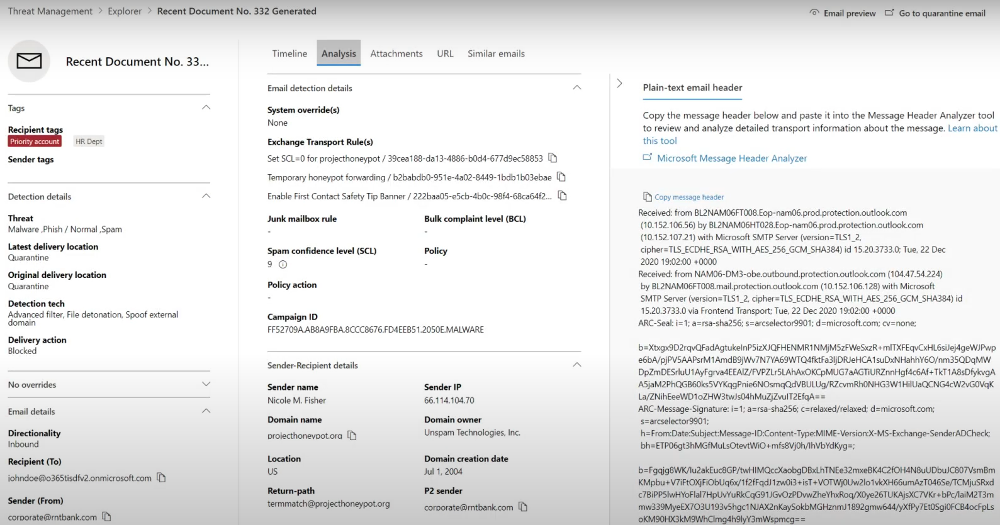

# Bedrohungssuche im Bedrohungs-Explorer für Microsoft Defender für Office 365Threat hunting in Threat Explorer for Microsoft Defender for Office 365

Inhalt dieses Artikels:In this article:

- [Exemplarische Vorgehensweise im Bedrohungs-ExplorerThreat Explorer walk-through](#threat-explorer-walk-through)
- [E-Mail-UntersuchungEmail investigation](#email-investigation)
- [E-Mail-KorrekturEmail remediation](#email-remediation)
- [Verbesserungen bei der BedrohungssucheImprovements to threat hunting experience](#improvements-to-threat-hunting-experience)

> [!NOTE]
> Dies ist Teil einer **Drei-Artikel-Reihe** zu Den Grundlagen von **Bedrohungs-Explorer (Explorer),** **E-Mail-Sicherheit** und **Explorer und Echtzeiterkennungen** (z. B. Unterschiede zwischen den Tools und berechtigungen, die zum Ausführen dieser Tools erforderlich sind).This is part of a **3-article series** on **Threat Explorer (Explorer)**, **email security**, and **Explorer and Real-time detections basics** (such as differences between the tools, and permissions needed to operate them). Die anderen beiden Artikel dieser Reihe sind [E-Mail-Sicherheit mit Dem Bedrohungs-Explorer](email-security-in-microsoft-defender.md) und [Dem Bedrohungs-Explorer und den Grundlagen der Echtzeiterkennung.](real-time-detections.md)The other two articles in this series are [Email security with Threat Explorer](email-security-in-microsoft-defender.md) and [Threat Explorer and Real-time detections basics](real-time-detections.md).

**Gilt für****Applies to**
- [Microsoft Defender für Office 365 Plan 1 und Plan 2Microsoft Defender for Office 365 plan 1 and plan 2](defender-for-office-365.md)
- [Microsoft 365 DefenderMicrosoft 365 Defender](../defender/microsoft-365-defender.md)

Wenn Ihre Organisation [über Microsoft Defender für Office 365](defender-for-office-365.md)verfügt und Sie über die [Berechtigungen](#required-licenses-and-permissions)verfügen, können Sie **Explorer-** oder **Echtzeiterkennungen** verwenden, um Bedrohungen zu erkennen und zu beheben.If your organization has [Microsoft Defender for Office 365](defender-for-office-365.md), and you have the [permissions](#required-licenses-and-permissions), you can use **Explorer** or **Real-time detections** to detect and remediate threats. 

Wechseln **Sie** im Microsoft 365 Defender Portal zu **E-Mail & Zusammenarbeit,** und wählen Sie dann **Explorer** aus.In the **Microsoft 365 Defender portal**, go to **Email & collaboration**, and then choose **Explorer**.

 

****

|Mit Microsoft Defender für Office 365 Plan 2 sehen Sie Folgendes:With Microsoft Defender for Office 365 Plan 2, you see:|Mit Microsoft Defender für Office 365 Plan 1 sehen Sie Folgendes:With Microsoft Defender for Office 365 Plan 1, you see:|
|---|---|
|||
|

Mit diesen Tools können Sie folgende Aktionen ausführen:With these tools, you can:

- Anzeigen von Schadsoftware, die von Microsoft 365 Sicherheitsfeatures erkannt wurdeSee malware detected by Microsoft 365 security features
- Phishing-URL anzeigen und auf Bewertungsdaten klickenView phishing URL and click verdict data
- Starten eines automatisierten Untersuchungs- und Antwortprozesses aus einer Ansicht im ExplorerStart an automated investigation and response process from a view in Explorer
- Untersuchen bösartiger E-Mails und vieles mehrInvestigate malicious email, and more

Weitere Informationen finden Sie unter [E-Mail-Sicherheit mit Dem Bedrohungs-Explorer.](email-security-in-microsoft-defender.md)For more information, see [Email security with Threat Explorer](email-security-in-microsoft-defender.md). 

## Exemplarische Vorgehensweise im Bedrohungs-ExplorerThreat Explorer walk-through

In Microsoft Defender für Office 365 gibt es zwei Abonnementpläne: Plan 1 und Plan 2.In Microsoft Defender for Office 365, there are two subscription plans—Plan 1 and Plan 2. Manuell betriebene Bedrohungssuche-Tools sind in beiden Plänen vorhanden, unter unterschiedlichen Namen und mit unterschiedlichen Funktionen.Manually operated Threat hunting tools exist in both plans, under different names and with different capabilities.

Defender für Office 365 Plan 1 verwendet *Echtzeiterkennungen,* bei denen es sich um eine Teilmenge des *Bedrohungs-Explorer-Suchtools* (auch *Explorer* genannt) in Plan 2 handelt.Defender for Office 365 Plan 1 uses *Real-time detections*, which is a subset of the *Threat Explorer* (also called *Explorer*) hunting tool in Plan 2. In dieser Artikelreihe wurden die meisten Beispiele mithilfe des vollständigen Bedrohungs-Explorers erstellt.In this series of articles, most of the examples were created using the full Threat Explorer. Administratoren sollten alle Schritte in Echtzeiterkennungen testen, um zu sehen, wo sie sich befinden.Admins should test any steps in Real-time detections to see where they apply.

Um das Explorer-Tool zu öffnen, wechseln Sie zu **Microsoft 365 Defender Portal**  >  **E-Mail & Zusammenarbeits-Explorer.**  >  To open the Explorer tool, go to **Microsoft 365 Defender portal** > **Email & collaboration** > **Explorer**. Standardmäßig gelangen Sie auf der Seite **"Schadsoftware",** verwenden aber die Dropdownliste **"Ansicht",** um sich mit Ihren Optionen vertraut zu machen.By default, you’ll arrive on the **Malware** page, but use the **View** drop down to get familiar with your options. Wenn Sie Phishing suchen oder sich mit einer Bedrohungskampagne befassen, wählen Sie diese Ansichten aus.If you’re hunting Phish, or digging into a threat campaign, choose those views.

> [!div class="mx-imgBorder"]
> 

Sobald eine Person für Sicherheitsvorgänge (Sec Ops) die Daten auswählt, die sie anzeigen möchten, ob der Bereich eine schmale Ansicht wie **Benutzerübermittlungen** oder eine breitere Ansicht wie **"Alle E-Mails"** ist, kann er die Schaltfläche **"Absender"** verwenden, um weiter zu filtern.Once a security operations (Sec Ops) person selects the data they want to see, whether the scope is narrow view like user **Submissions**, or a wider view, like **All email**, they can use the **Sender** button to further filter. Denken Sie daran, "Aktualisieren" auszuwählen, um ihre Filteraktionen abzuschließen.Remember to select Refresh to complete your filtering actions.

> [!div class="mx-imgBorder"]
> 

Die Verfeinerung des Fokus im Explorer oder der Echtzeiterkennung kann in Ebenen betrachtet werden.Refining focus in Explorer or Real-time detection can be thought of in layers. Die erste ist **View**.The first is **View**. Der zweite kann als *gefilterter Fokus* betrachtet werden.The second can be thought of as a *filtered focus*. Sie können beispielsweise die Schritte, die Sie bei der Suche nach einer Bedrohung ausgeführt haben, zurückziehen, indem Sie Ihre Entscheidungen wie folgt aufzeichnen: Um das Problem im Explorer zu finden, **habe ich die Schadsoftwareansicht mit einem Empfängerfilterfokus ausgewählt.**For example, you can retrace the steps you took in finding a threat by recording your decisions like this: To find the issue in Explorer, **I chose the Malware View with a Recipient filter focus**. Dies erleichtert das Zurückziehen Ihrer Schritte.This makes retracing your steps easier.

> [!TIP]
> Wenn Sec Ops **Tags** verwendet, um Konten zu markieren, die sie als hochwertige Ziele betrachten, können sie Auswahlen wie *die Phishingansicht mit einem Tags-Filterfokus treffen (bei Verwendung einen Datumsbereich einschließen).*If Sec Ops uses **Tags** to mark accounts they consider high valued targets, they can make selections like *Phish View with a Tags filter focus (include a date range if used)*. Dadurch werden alle Phishing-Versuche angezeigt, die während eines Bestimmten Zeitraums an ihre hochwertigen Benutzerziele gerichtet sind (z. B. Datumsangaben, an denen bestimmte Phishingangriffe für ihre Branche häufig ausgeführt werden).This will show them any phishing attempts directed at their high value user targets during a time-range (like dates when certain phishing attacks are happening a lot for their industry). 

Mithilfe der Datumsbereichssteuerelemente können Einschränkungen für Datumsbereiche vorgenommen werden.Refinements can be made on date ranges by using the date range controls. Hier sehen Sie den Explorer in der **Schadsoftwareansicht** mit einem Filterfokus **der Erkennungstechnologie.**Here you can see Explorer in **Malware** view, with a **Detection Technology** filter focus. Aber es ist die **Erweiterte Filterschaltfläche,** mit der Sec Ops-Teams tief graben können.But it’s the **Advanced filter** button that lets Sec Ops teams dig deep. 

> [!div class="mx-imgBorder"]
> 

Durch Klicken auf den **Erweiterten Filter** wird ein Bereich angezeigt, in dem Sec Ops-Schützer selbst Abfragen erstellen können, sodass sie die benötigten Informationen einschließen oder ausschließen können.Clicking the **Advanced filter** pops a panel that will let Sec Ops hunters build queries themselves, letting them include or exclude the information they need to see. Sowohl das Diagramm als auch die Tabelle auf der Explorer-Seite spiegeln ihre Ergebnisse wider.Both the chart and table on the Explorer page will reflect their results. 

> [!div class="mx-imgBorder"]
> 

Verwenden Sie die Schaltfläche **"Spaltenoptionen",** um die Art von Informationen in der Tabelle abzurufen, die am hilfreichsten wären:Use the **Column options** button to get the kind of information on the table that would be most helpful: 

> [!div class="mx-imgBorder"]
> 

> [!div class="mx-imgBorder"]
> 

Stellen Sie sicher, dass Sie ihre Anzeigeoptionen in derselben Miene testen.In the same mien, make sure to test your display options. Unterschiedliche Zielgruppen reagieren gut auf unterschiedliche Präsentationen derselben Daten.Different audiences will react well to different presentations of the same data. Für einige Besucher kann die **Karte "E-Mail-Ursprünge"** zeigen, dass eine Bedrohung weit verbreitet oder schneller als die **Anzeigeoption "Kampagne"** direkt daneben verbreitet ist.For some viewers, the **Email Origins** map can show that a threat is widespread or discreet more quickly than the **Campaign display** option right next to it. Sec Ops können diese Displays verwenden, um am besten Punkte zu machen, die die Notwendigkeit von Sicherheit und Schutz unterstreichen, oder für einen späteren Vergleich, um die Effektivität ihrer Aktionen zu demonstrieren.Sec Ops can make use of these displays to best make points that underscore the need for security and protection, or for later comparison, to demonstrate the effectiveness of their actions. 

> [!div class="mx-imgBorder"]
> 

> [!div class="mx-imgBorder"]
> 

### E-Mail-UntersuchungEmail investigation

Wenn eine verdächtige E-Mail angezeigt wird, klicken Sie auf den Namen, um das Flyout auf der rechten Seite zu erweitern.When you see a suspicious email, click the name to expand the flyout on the right. Hier ist das Banner verfügbar, mit dem Sec Ops die [E-Mail-Entitätsseite](mdo-email-entity-page.md) anzeigen kann.Here, the banner that lets Sec Ops see the [email entity page](mdo-email-entity-page.md) is available.

Die Seite "E-Mail-Entität" zieht Inhalte zusammen, die unter **Details,** **Anlagen,** **Geräte,** aber besser organisierten Daten zu finden sind.The email entity page pulls together contents that can be found under **Details**, **Attachments**, **Devices**, but includes more organized data. Dazu gehören Dinge wie DMARC-Ergebnisse, nur-Text-Anzeige des E-Mail-Headers mit einer Kopieroption, Bewertungsinformationen zu Anlagen, die sicher detoniert wurden, und Dateien, die verworfen wurden (einschließlich IP-Adressen, die kontaktiert wurden, und Screenshots von Seiten oder Dateien).This includes things like DMARC results, plain text display of the email header with a copy option, verdict information on attachments that were securely detonated, and files those detonations dropped (can include IP addresses that were contacted and screenshots of pages or files). URLs und ihre Bewertungen werden ebenfalls mit ähnlichen Details aufgeführt.URLs and their verdicts are also listed with similar details reported. 

Wenn Sie diese Phase erreichen, ist die Seite "E-Mail-Entität" für den letzten Schritt wichtig:*Die Behebung.*When you reach this stage, the email entity page will be critical to the final step—*remediation*. 

> [!div class="mx-imgBorder"]
> 

> [!TIP]
> Um mehr über die Rich-E-Mail-Entitätsseite (siehe unten auf der Registerkarte **&quot;Analyse")** zu erfahren, einschließlich der Ergebnisse der detonierten Anlagen, der Ergebnisse für die enthaltenen URLs und der sicheren E-Mail-Vorschau, klicken Sie [hier.](mdo-email-entity-page.md)To learn more about the rich email entity page (seen below on the **Analysis** tab), including the results of detonated Attachments, findings for included URLs, and safe Email preview, click [here](mdo-email-entity-page.md).

> [!div class="mx-imgBorder"]
> 

### E-Mail-KorrekturEmail remediation

Sobald eine Sec Ops-Person feststellt, dass eine E-Mail eine Bedrohung ist, befasst sich der nächste Explorer- oder Echtzeiterkennungsschritt mit der Bedrohung und deren Behebung.Once a Sec Ops person determines that an email is a threat, the next Explorer or Real-time detection step is dealing with the threat and remediating it. Dies kann erfolgen, indem Sie zum Bedrohungs-Explorer zurückkehren, das Kontrollkästchen für die problematische E-Mail aktivieren und die Schaltfläche **"Aktionen"** verwenden.This can be done by returning to Threat Explorer, selecting the checkbox for the problem email, and using the **Actions** button.

> [!div class="mx-imgBorder"]
> 

Hier kann der Analyst Aktionen wie das Melden der E-Mail als Spam, Phishing oder Schadsoftware, das Kontaktieren von Empfängern oder weitere Untersuchungen ausführen, die das Auslösen von Playbooks für automatische Untersuchung und Reaktion (Automated Investigation and Response, AIR) umfassen können (wenn Sie über Plan 2 verfügen).Here, the analyst can take actions like reporting the mail as Spam, Phishing, or Malware, contacting recipients, or further investigations that can include triggering Automated Investigation and Response (or AIR) playbooks (if you have Plan 2). Oder die E-Mail kann auch als sauber gemeldet werden.Or, the mail can also be reported as clean.

> [!div class="mx-imgBorder"]
> 

## Verbesserungen bei der BedrohungssucheImprovements to threat hunting experience

### Warnungs-IDAlert ID

Wenn Sie von einer Warnung zum Bedrohungs-Explorer navigieren, wird die **Ansicht** nach **Warnungs-ID** gefiltert.When navigating from an alert into Threat Explorer, the **View** will be filtered by **Alert ID**. Dies gilt auch für die Echtzeiterkennung.This also applies in Real-time detection. Nachrichten, die für die jeweilige Warnung relevant sind, und eine E-Mail-Gesamtsumme (eine Anzahl) werden angezeigt.Messages relevant to the specific alert, and an email total (a count) are shown. Sie können sehen, ob eine Nachricht Teil einer Warnung war, und von dieser Nachricht zu der zugehörigen Warnung navigieren.You will be able to see if a message was part of an alert, as well as navigate from that message to the related alert.

Schließlich ist die Warnungs-ID in der URL enthalten, z. B.: `https://https://security.microsoft.com/viewalerts`Finally, alert ID is included in the URL, for example: `https://https://security.microsoft.com/viewalerts`

> [!div class="mx-imgBorder"]
> 

> [!div class="mx-imgBorder"]
> 

### Erweitern des Explorer-Datenaufbewahrungs- und Suchlimits für Testmandanten (und Echtzeiterkennungen)Extending Explorer (and Real-time detections) data retention and search limit for trial tenants 

Im Rahmen dieser Änderung können Analysten E-Mail-Daten innerhalb von 30 Tagen (von sieben Tagen) im Bedrohungs-Explorer und in Echtzeiterkennungen für Defender für Office P1- und P2-Testmandanten suchen und filtern.As part of this change, analysts will be able to search for, and filter email data across 30 days (increased from seven days) in Threat Explorer and Real-time detections for both Defender for Office P1 and P2 trial tenants. Dies wirkt sich nicht auf Produktionsmandanten für P1- und P2 E5-Kunden aus, bei denen der Aufbewahrungsstandard bereits 30 Tage beträgt.This doesn’t impact any production tenants for both P1 and P2 E5 customers, where the retention default is already 30 days.

### Exportgrenzwert aktualisiertUpdated Export limit 

Die Anzahl der E-Mail-Einträge, die aus dem Bedrohungs-Explorer exportiert werden können, beträgt jetzt 200.000 (war 9990).The number of Emails records that can be exported from Threat Explorer is now 200,000 (was 9990). Der Satz von Spalten, die exportiert werden können, ist unverändert.The set of columns that can be exported is unchanged. 

### Tags im Bedrohungs-ExplorerTags in Threat Explorer

> [!NOTE]
> Das Feature "Benutzertags" befindet sich in der Vorschau und ist möglicherweise nicht für alle verfügbar.The user tags feature is in Preview and may not be available to everyone. Außerdem können Vorschauen geändert werden.Also, Previews are subject to change. Informationen zum Veröffentlichungszeitplan finden Sie in der roadmap für Microsoft 365.For information about the release schedule, check out the Microsoft 365 roadmap.

Benutzertags identifizieren bestimmte Benutzergruppen in Microsoft Defender für Office 365.User tags identify specific groups of users in Microsoft Defender for Office 365. Weitere Informationen zu Tags, einschließlich Lizenzierung und Konfiguration, finden Sie unter [Benutzertags.](user-tags.md)For more information about tags, including licensing and configuration, see [User tags](user-tags.md).

Im Bedrohungs-Explorer können Sie Informationen zu Benutzertags in den folgenden Oberflächen anzeigen.In Threat Explorer, you can see information about user tags in the following experiences.

#### E-Mail-RasteransichtEmail grid view

Wenn Analysten die **Tagsspalte** im E-Mail-Raster betrachten, sehen sie alle Tags, die auf Absender- oder Empfängerpostfächer angewendet wurden.When analysts look at the **Tags** column the email grid, they are seeing all tags that have been applied to sender or recipient mailboxes. Standardmäßig werden zuerst Systemtags wie *Prioritätskonten* angezeigt.By default, system tags like *priority accounts* are shown first.

> [!div class="mx-imgBorder"]
> 

#### FilternFiltering

Tags können als Filter verwendet werden.Tags can be used as filters. Suchen Sie nur zwischen Prioritätskonten, oder verwenden Sie bestimmte Benutzertagszenarien auf diese Weise.Hunt among priority accounts only, or use specific user tags scenarios this way. Sie können auch Ergebnisse mit bestimmten Tags ausschließen.You can also exclude results that have certain tags. Kombinieren Sie Tags mit anderen Filtern und Datumsbereichen, um den Untersuchungsbereich einzugrenzen.Combine Tags with other filters and date ranges to narrow your scope of investigation. 

> [!div class="mx-imgBorder"]
> 

#### Flyout für E-Mail-DetailsEmail detail flyout

Um die einzelnen Tags für Absender und Empfänger anzuzeigen, wählen Sie eine E-Mail aus, um das Flyout mit den Nachrichtendetails zu öffnen.To view the individual tags for sender and recipient, select an email to open the message details flyout. Auf der Registerkarte **"Zusammenfassung"** werden die Absender- und Empfängertags separat angezeigt.On the **Summary** tab, the sender and recipient tags are shown separately. Die Informationen zu einzelnen Tags für Absender und Empfänger können als CSV-Daten exportiert werden.The information about individual tags for sender and recipient can be exported as CSV data. 

> [!div class="mx-imgBorder"]
> 

Tags-Informationen werden auch im Flyout für URL-Klicks angezeigt.Tags information is also shown in the URL clicks flyout. To see it, go to Phish or All Email view > **URLs** or **URL Clicks** tab. Wählen Sie ein einzelnes URL-Flyout aus, um weitere Details zu Klicks für diese URL anzuzeigen, einschließlich aller Tags, die diesem Klick zugeordnet sind.To see it, go to Phish or All Email view > **URLs** or **URL Clicks** tab. Select an individual URL flyout to see additional details about clicks for that URL, including any Tags associated with that click.

### Aktualisierte ZeitachsenansichtUpdated Timeline View

> [!div class="mx-imgBorder"]
> 
>
Erfahren Sie mehr, in dem Sie [dieses Video](https://www.youtube.com/watch?v=UoVzN0lYbfY&list=PL3ZTgFEc7LystRja2GnDeUFqk44k7-KXf&index=4) ansehen.Learn more by watching [this video](https://www.youtube.com/watch?v=UoVzN0lYbfY&list=PL3ZTgFEc7LystRja2GnDeUFqk44k7-KXf&index=4).

## Erweiterte FunktionenExtended capabilities

### Benutzer mit den wichtigsten ZielenTop targeted users

Die wichtigsten Schadsoftwarefamilien zeigen die **am häufigsten verwendeten Benutzer** im Abschnitt "Schadsoftware" an.Top Malware Families shows the **top targeted users** in the Malware section. Die wichtigsten Benutzer werden auch über Phishing- und alle E-Mail-Ansichten erweitert.Top targeted users will be extended through Phish and All Email views too. Analysten können die fünf wichtigsten Zielbenutzer zusammen mit der Anzahl der Versuche für jeden Benutzer in jeder Ansicht sehen.Analysts will be able to see the top-five targeted users, along with the number of attempts for each user in each view. 

Personen mit Sicherheitsvorgängen können die Liste der Zielbenutzer bis zu einem Grenzwert von 3.000 sowie die Anzahl der versuche für die Offlineanalyse für jede E-Mail-Ansicht exportieren.Security operations people be able to export the list of targeted users, up to a limit of 3,000, along with the number of attempts made, for offline analysis for each email view. Wenn Sie außerdem die Anzahl der Versuche auswählen (z. B. 13 Versuche in der abbildung unten), wird im Bedrohungs-Explorer eine gefilterte Ansicht geöffnet, sodass Sie weitere Details zu E-Mails und Bedrohungen für diesen Benutzer sehen können.Also, selecting the number of attempts (for example, 13 attempts in the image below) will open a filtered view in Threat Explorer, so you can see more details across emails, and threats for that user.  

> [!div class="mx-imgBorder"]
> 

### Exchange-TransportregelnExchange transport rules

Das Sicherheitsteam kann alle auf eine Nachricht angewendeten Exchange Transportregeln (oder Nachrichtenflussregeln) in der E-Mail-Rasteransicht anzeigen.The security operations team will be able to see all the Exchange transport rules (or Mail flow rules) applied to a message, in the Email grid view. Wählen Sie im Raster **Spaltenoptionen** aus, und fügen Sie dann in den Spaltenoptionen **Exchange Transportregel** hinzu.Select **Column options** in the grid and then **Add Exchange Transport Rule** from the column options. Die Option Exchange Transportregeln ist auch im **Flyout "Details"** in der E-Mail sichtbar.The Exchange transport rules option is also visible on the **Details** flyout in the email. 

Namen und GUIDs der Transportregeln, die auf die Nachricht angewendet wurden, werden angezeigt.Names and GUIDs of the transport rules applied to the message appear. Analysten können mithilfe des Namens der Transportregel nach Nachrichten suchen.Analysts will be able to search for messages by using the name of the transport rule. Hierbei handelt es sich um eine CONTAINS-Suche, was bedeutet, dass Sie auch teilsuchen können.This is a CONTAINS search, which means you can do partial searches as well. 

> [!IMPORTANT]
> Exchange Verfügbarkeit von Transportregelsuch- und -namen hängt von der ihnen zugewiesenen Rolle ab.Exchange transport rule search and name availability depend on the specific role assigned to you. Sie benötigen eine der folgenden Rollen oder Berechtigungen, um die Transportregelnamen und die Suche anzuzeigen.You need to have one of the following roles or permissions to view the transport rule names and search. Auch ohne die unten aufgeführten Rollen oder Berechtigungen werden einem Analysten möglicherweise die Transportregelbezeichnung und guid-Informationen in den E-Mail-Details angezeigt.However, even without the roles or permissions below, an analyst may see the transport rule label and GUID information in the Email Details. Andere Funktionen zum Anzeigen von Datensätzen in E-Mail-Rastern, E-Mail-Flyouts, Filtern und Exporten sind nicht betroffen.Other record-viewing experiences in Email Grids, Email flyouts, Filters, and Export are not affected.
>
> - Exchange Online Nur – Verhinderung von Datenverlust: AlleExchange Online Only - Data Loss Prevention: All
> - Exchange Online Nur – O365SupportViewConfig: AlleExchange Online Only - O365SupportViewConfig: All
> - Microsoft Azure Active Directory oder Exchange Online – Sicherheitsadministrator: AlleMicrosoft Azure Active Directory or Exchange Online - Security Admin: All
> - Azure Active Directory oder Exchange Online – Sicherheitsleseberechtigter: AlleAzure Active Directory or Exchange Online - Security Reader: All
> - Exchange Online Nur – Transportregeln: AlleExchange Online Only - Transport Rules: All
> - Exchange Online Only - View-Only Configuration: AllExchange Online Only - View-Only Configuration: All
>
> Innerhalb des E-Mail-Rasters, des Detail-Flyouts und der exportierten CSV-Datei wird den ETRs wie unten dargestellt ein Name/eine GUID angezeigt.Within the email grid, Details flyout, and Exported CSV, the ETRs are presented with a Name/GUID as shown below.
>
> > [!div class="mx-imgBorder"]
> > 

### Eingehende ConnectorsInbound connectors

Connectors sind eine Sammlung von Anweisungen, die anpassen, wie Ihre E-Mails zu und von Ihrer Microsoft 365 oder Office 365 Organisation fließen.Connectors are a collection of instructions that customize how your email flows to and from your Microsoft 365 or Office 365 organization. Sie ermöglichen es Ihnen, alle Sicherheitseinschränkungen oder Steuerelemente anzuwenden.They enable you to apply any security restrictions or controls. Im Bedrohungs-Explorer können Sie die Connectors anzeigen, die sich auf eine E-Mail beziehen, und mithilfe von Connectornamen nach E-Mails suchen.In Threat Explorer, you can view the connectors that are related to an email and search for emails using connector names. 

Die Suche nach Connectors ist eine CONTAINS-Abfrage, was bedeutet, dass teilweise Schlüsselwortsuchen funktionieren können:The search for connectors is a CONTAINS query, which means partial keyword searches can work: 

> [!div class="mx-imgBorder"]
> 

## Erforderliche Lizenzen und BerechtigungenRequired licenses and permissions

Sie benötigen [Microsoft Defender,](defender-for-office-365.md) damit Office 365 Explorer- oder Echtzeiterkennungen verwenden können.You must have [Microsoft Defender for Office 365](defender-for-office-365.md) to use Explorer or Real-time detections.

- Explorer ist in Defender für Office 365 Plan 2 enthalten.Explorer is included in Defender for Office 365 Plan 2.
- Der Bericht über Echtzeiterkennungen ist in Defender für Office 365 Plan 1 enthalten.The Real-time detections report is included in Defender for Office 365 Plan 1.
- Planen Sie, Lizenzen für alle Benutzer zuzuweisen, die von Defender für Office 365 geschützt werden sollen.Plan to assign licenses for all users who should be protected by Defender for Office 365. Explorer- und Echtzeiterkennungen zeigen Erkennungsdaten für lizenzierte Benutzer an.Explorer and Real-time detections show detection data for licensed users.

Um Explorer- oder Echtzeiterkennungen anzuzeigen und zu verwenden, benötigen Sie Folgendes:To view and use Explorer or Real-time detections, you must have the following:

- Für das Microsoft 365 Defender-Portal:For the Microsoft 365 Defender portal:

  - OrganisationsverwaltungOrganization Management
  - Sicherheitsadministrator (kann im Azure Active Directory Admin Center ( ) zugewiesen werden. <https://aad.portal.azure.com>Security Administrator (this can be assigned in the Azure Active Directory admin center (<https://aad.portal.azure.com>)
  - SicherheitsleseberechtigterSecurity Reader

- Für Exchange Online:For Exchange Online:

  - OrganisationsverwaltungOrganization Management
  - Organisationsverwaltung – nur LeserechteView-Only Organization Management
  - Schreibgeschützte EmpfängerView-Only Recipients
  - ComplianceverwaltungCompliance Management

Weitere Informationen zu Rollen und Berechtigungen finden Sie in den folgenden Ressourcen:To learn more about roles and permissions, see the following resources:

- [Berechtigungen im Microsoft 365 Defender-PortalPermissions in the Microsoft 365 Defender portal](permissions-microsoft-365-security-center.md)
- [Featureberechtigungen in Exchange OnlineFeature permissions in Exchange Online](/exchange/permissions-exo/feature-permissions)
- [Exchange Online PowerShellExchange Online PowerShell](/powershell/exchange/exchange-online-powershell)

## Weitere InformationenMore information

- [Suchen und Untersuchen von bösartigen E-Mails, die zugestellt wurdenFind and investigate malicious email that was delivered](investigate-malicious-email-that-was-delivered.md) 
- [Anzeigen schädlicher Dateien, die in SharePoint Online, OneDrive und Microsoft Teams erkannt wurdenView malicious files detected in SharePoint Online, OneDrive, and Microsoft Teams](mdo-for-spo-odb-and-teams.md) 
- [Abrufen einer Übersicht über die Ansichten im Bedrohungs-Explorer (und Echtzeiterkennungen)Get an overview of the views in Threat Explorer (and Real-time detections)](threat-explorer-views.md) 
- [Threat Protection-StatusberichtThreat protection status report](view-email-security-reports.md#threat-protection-status-report) 
- [Automatische Untersuchung und Reaktion in Microsoft Threat ProtectionAutomated investigation and response in Microsoft Threat Protection](automated-investigation-response-office.md) 
- [Untersuchen von E-Mails mit der Seite "E-Mail-Entität"Investigate emails with the Email Entity Page](mdo-email-entity-page.md)