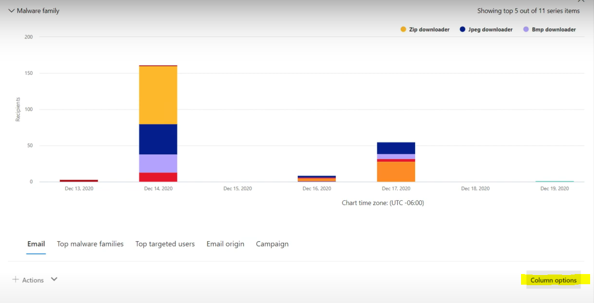

# Bedrohungssuche im Bedrohungs-Explorer für Microsoft Defender für Office 365

Inhalt dieses Artikels:

- [Exemplarische Vorgehensweise im Bedrohungs-Explorer](#threat-explorer-walk-through)
- [E-Mail-Untersuchung](#email-investigation)
- [E-Mail-Korrektur](#email-remediation)
- [Verbesserungen bei der Bedrohungssuche](#improvements-to-threat-hunting-experience)

> [!NOTE]
> Dies ist Teil einer **Drei-Artikel-Reihe** zu Den Grundlagen von **Bedrohungs-Explorer (Explorer),** **E-Mail-Sicherheit** und **Explorer und Echtzeiterkennungen** (z. B. Unterschiede zwischen den Tools und berechtigungen, die zum Ausführen dieser Tools erforderlich sind). Die anderen beiden Artikel dieser Reihe sind [E-Mail-Sicherheit mit Dem Bedrohungs-Explorer](email-security-in-microsoft-defender.md) und [Dem Bedrohungs-Explorer und den Grundlagen der Echtzeiterkennung.](real-time-detections.md)

**Gilt für**
- [Microsoft Defender für Office 365 Plan 1 und Plan 2](defender-for-office-365.md)
- [Microsoft 365 Defender](../defender/microsoft-365-defender.md)

Wenn Ihre Organisation [über Microsoft Defender für Office 365](defender-for-office-365.md)verfügt und Sie über die [Berechtigungen](#required-licenses-and-permissions)verfügen, können Sie **Explorer-** oder **Echtzeiterkennungen** verwenden, um Bedrohungen zu erkennen und zu beheben. 

Wechseln Sie im **Microsoft 365 Defender-Portal** zu **E-Mail & Zusammenarbeit,** und wählen Sie dann **Explorer** aus.

 

****

|Mit Microsoft Defender für Office 365 Plan 2 sehen Sie Folgendes:|Mit Microsoft Defender für Office 365 Plan 1 sehen Sie Folgendes:|
|---|---|
|||
|

Mit diesen Tools können Sie folgende Aktionen ausführen:

- Anzeigen von Schadsoftware, die von Microsoft 365 Sicherheitsfeatures erkannt wurde
- Phishing-URL anzeigen und auf Bewertungsdaten klicken
- Starten eines automatisierten Untersuchungs- und Antwortprozesses aus einer Ansicht im Explorer
- Untersuchen bösartiger E-Mails und vieles mehr

Weitere Informationen finden Sie unter [E-Mail-Sicherheit mit Dem Bedrohungs-Explorer.](email-security-in-microsoft-defender.md) 

## Exemplarische Vorgehensweise im Bedrohungs-Explorer

In Microsoft Defender für Office 365 gibt es zwei Abonnementpläne: Plan 1 und Plan 2. Manuell betriebene Bedrohungssuche-Tools sind in beiden Plänen vorhanden, unter unterschiedlichen Namen und mit unterschiedlichen Funktionen.

Defender für Office 365 Plan 1 verwendet *Echtzeiterkennungen,* bei denen es sich um eine Teilmenge des *Bedrohungs-Explorer-Suchtools* (auch *Explorer* genannt) in Plan 2 handelt. In dieser Artikelreihe wurden die meisten Beispiele mithilfe des vollständigen Bedrohungs-Explorers erstellt. Administratoren sollten alle Schritte in Echtzeiterkennungen testen, um zu sehen, wo sie sich befinden.

Um das Explorer-Tool zu öffnen, wechseln Sie zu **Microsoft 365 Defender-Portal**  >  **E-Mail & Zusammenarbeits-Explorer.**  >   Standardmäßig gelangen Sie auf der Seite **"Schadsoftware",** verwenden aber die Dropdownliste **"Ansicht",** um sich mit Ihren Optionen vertraut zu machen. Wenn Sie Phishing suchen oder sich mit einer Bedrohungskampagne befassen, wählen Sie diese Ansichten aus.

> [!div class="mx-imgBorder"]
> 

Sobald eine Person für Sicherheitsvorgänge (Sec Ops) die Daten auswählt, die sie anzeigen möchten, ob der Bereich eine schmale Ansicht wie **Benutzerübermittlungen** oder eine breitere Ansicht wie **"Alle E-Mails"** ist, kann er die Schaltfläche **"Absender"** verwenden, um weiter zu filtern. Denken Sie daran, "Aktualisieren" auszuwählen, um ihre Filteraktionen abzuschließen.

> [!div class="mx-imgBorder"]
> 

Die Verfeinerung des Fokus im Explorer oder der Echtzeiterkennung kann in Ebenen betrachtet werden. Die erste ist **View**. Der zweite kann als *gefilterter Fokus* betrachtet werden. Sie können beispielsweise die Schritte, die Sie bei der Suche nach einer Bedrohung ausgeführt haben, zurückziehen, indem Sie Ihre Entscheidungen wie folgt aufzeichnen: Um das Problem im Explorer zu finden, **habe ich die Schadsoftwareansicht mit einem Empfängerfilterfokus ausgewählt.** Dies erleichtert das Zurückziehen Ihrer Schritte.

> [!TIP]
> Wenn Sec Ops **Tags** verwendet, um Konten zu markieren, die sie als hochwertige Ziele betrachten, können sie Auswahlen wie *die Phishingansicht mit einem Tags-Filterfokus treffen (bei Verwendung einen Datumsbereich einschließen).* Dadurch werden alle Phishing-Versuche angezeigt, die während eines Bestimmten Zeitraums an ihre hochwertigen Benutzerziele gerichtet sind (z. B. Datumsangaben, an denen bestimmte Phishingangriffe für ihre Branche häufig ausgeführt werden). 

Mithilfe der Datumsbereichssteuerelemente können Einschränkungen für Datumsbereiche vorgenommen werden. Hier sehen Sie den Explorer in der **Schadsoftwareansicht** mit einem Filterfokus **der Erkennungstechnologie.** Aber es ist die **Erweiterte Filterschaltfläche,** mit der Sec Ops-Teams tief greifen können. 

> [!div class="mx-imgBorder"]
> 

Durch Klicken auf den **Erweiterten Filter** wird ein Bereich angezeigt, in dem Sec Ops-Schützer Selbstabfragen erstellen können, sodass sie die benötigten Informationen einschließen oder ausschließen können. Sowohl das Diagramm als auch die Tabelle auf der Explorer-Seite spiegeln ihre Ergebnisse wider. 

> [!div class="mx-imgBorder"]
> 

Verwenden Sie die Schaltfläche **"Spaltenoptionen",** um die Art von Informationen in der Tabelle abzurufen, die am hilfreichsten wären: 

> [!div class="mx-imgBorder"]
> 

> [!div class="mx-imgBorder"]
> 

Stellen Sie sicher, dass Sie ihre Anzeigeoptionen in derselben Miene testen. Unterschiedliche Zielgruppen reagieren gut auf unterschiedliche Präsentationen derselben Daten. Für einige Besucher kann die **Karte "E-Mail-Ursprünge"** zeigen, dass eine Bedrohung weit verbreitet oder schneller als die **Anzeigeoption "Kampagne"** direkt daneben verbreitet ist. Sec Ops können diese Displays verwenden, um am besten Punkte zu machen, die die Notwendigkeit von Sicherheit und Schutz unterstreichen, oder für einen späteren Vergleich, um die Effektivität ihrer Aktionen zu demonstrieren. 

> [!div class="mx-imgBorder"]
> 

> [!div class="mx-imgBorder"]
> 

### E-Mail-Untersuchung

Wenn eine verdächtige E-Mail angezeigt wird, klicken Sie auf den Namen, um das Flyout auf der rechten Seite zu erweitern. Hier ist das Banner verfügbar, mit dem Sec Ops die [E-Mail-Entitätsseite](mdo-email-entity-page.md) anzeigen kann.

Die Seite "E-Mail-Entität" zieht Inhalte zusammen, die unter **Details,** **Anlagen,** **Geräte,** aber besser organisierten Daten zu finden sind. Dazu gehören Dinge wie DMARC-Ergebnisse, nur-Text-Anzeige des E-Mail-Headers mit kopieroption, Bewertungsinformationen zu Anlagen, die sicher detoniert wurden, und Dateien, die verworfen wurden (kann IP-Adressen enthalten, die kontaktiert wurden, und Screenshots von Seiten oder Dateien). URLs und ihre Bewertungen werden ebenfalls mit ähnlichen Details aufgeführt. 

Wenn Sie diese Phase erreichen, ist die Seite "E-Mail-Entität" für den letzten Schritt wichtig:*Die Behebung.* 

> [!div class="mx-imgBorder"]
> 

> [!TIP]
> Um mehr über die Rich-E-Mail-Entitätsseite (siehe unten auf der Registerkarte **"Analyse")** zu erfahren, einschließlich der Ergebnisse der detonierten Anlagen, der Ergebnisse für die enthaltenen URLs und der sicheren E-Mail-Vorschau, klicken Sie [hier.](mdo-email-entity-page.md)

> [!div class="mx-imgBorder"]
> 

### E-Mail-Korrektur

Sobald eine Sec Ops-Person feststellt, dass eine E-Mail eine Bedrohung ist, befasst sich der nächste Explorer- oder Echtzeiterkennungsschritt mit der Bedrohung und deren Behebung. Dazu können Sie zum Bedrohungs-Explorer zurückkehren, das Kontrollkästchen für die problematische E-Mail aktivieren und die Schaltfläche **"Aktionen"** verwenden.

> [!div class="mx-imgBorder"]
> 

Hier kann der Analyst Aktionen wie das Melden der E-Mails als Spam, Phishing oder Schadsoftware, das Kontaktieren von Empfängern oder weitere Untersuchungen ausführen, die das Auslösen von Playbooks für automatische Untersuchung und Reaktion (Automated Investigation and Response, AIR) umfassen können (wenn Sie über Plan 2 verfügen). Oder die E-Mail kann auch als sauber gemeldet werden.

> [!div class="mx-imgBorder"]
> 

## Verbesserungen bei der Bedrohungssuche

### Warnungs-ID

Wenn Sie von einer Warnung in den Bedrohungs-Explorer navigieren, wird die **Ansicht** nach **Warnungs-ID** gefiltert. Dies gilt auch für die Echtzeiterkennung. Nachrichten, die für die jeweilige Warnung relevant sind, und eine E-Mail-Gesamtsumme (eine Anzahl) werden angezeigt. Sie können sehen, ob eine Nachricht Teil einer Warnung war, und von dieser Nachricht zu der zugehörigen Warnung navigieren.

Schließlich ist die Warnungs-ID in der URL enthalten, z. B.: `https://https://security.microsoft.com/viewalerts`

> [!div class="mx-imgBorder"]
> 

> [!div class="mx-imgBorder"]
> 

### Erweitern des Explorer-Datenaufbewahrungs- und Suchlimits für Testmandanten (und Echtzeiterkennungen) 

Im Rahmen dieser Änderung können Analysten E-Mail-Daten innerhalb von 30 Tagen (von sieben Tagen) im Bedrohungs-Explorer und in Echtzeiterkennungen für Defender für Office P1- und P2-Testmandanten suchen und filtern. Dies wirkt sich nicht auf Produktionsmandanten für P1- und P2 E5-Kunden aus, bei denen der Aufbewahrungsstandard bereits 30 Tage beträgt.

### Exportgrenzwert aktualisiert 

Die Anzahl der E-Mail-Einträge, die aus dem Bedrohungs-Explorer exportiert werden können, beträgt jetzt 200.000 (war 9990). Der Satz von Spalten, die exportiert werden können, ist unverändert. 

### Tags im Bedrohungs-Explorer

> [!NOTE]
> Das Feature "Benutzertags" befindet sich in der Vorschau und ist möglicherweise nicht für alle verfügbar. Außerdem können Vorschauen geändert werden. Informationen zum Veröffentlichungszeitplan finden Sie in der roadmap für Microsoft 365.

Benutzertags identifizieren bestimmte Benutzergruppen in Microsoft Defender für Office 365. Weitere Informationen zu Tags, einschließlich Lizenzierung und Konfiguration, finden Sie unter [Benutzertags.](user-tags.md)

Im Bedrohungs-Explorer können Sie Informationen zu Benutzertags in den folgenden Oberflächen anzeigen.

#### E-Mail-Rasteransicht

Wenn Analysten die **Tagsspalte** im E-Mail-Raster betrachten, sehen sie alle Tags, die auf Absender- oder Empfängerpostfächer angewendet wurden. Standardmäßig werden zuerst Systemtags wie *Prioritätskonten* angezeigt.

> [!div class="mx-imgBorder"]
> 

#### Filtern

Tags können als Filter verwendet werden. Suchen Sie nur zwischen Prioritätskonten, oder verwenden Sie bestimmte Benutzertagszenarien auf diese Weise. Sie können auch Ergebnisse mit bestimmten Tags ausschließen. Kombinieren Sie Tags mit anderen Filtern und Datumsbereichen, um den Untersuchungsbereich einzugrenzen. 

> [!div class="mx-imgBorder"]
> 

#### Flyout für E-Mail-Details

Um die einzelnen Tags für Absender und Empfänger anzuzeigen, wählen Sie eine E-Mail aus, um das Flyout mit den Nachrichtendetails zu öffnen. Auf der Registerkarte **"Zusammenfassung"** werden die Absender- und Empfängertags separat angezeigt. Die Informationen zu einzelnen Tags für Absender und Empfänger können als CSV-Daten exportiert werden. 

> [!div class="mx-imgBorder"]
> 

Tags-Informationen werden auch im Flyout für URL-Klicks angezeigt. To see it, go to Phish or All Email view > **URLs** or **URL Clicks** tab. Wählen Sie ein einzelnes URL-Flyout aus, um weitere Details zu Klicks für diese URL anzuzeigen, einschließlich aller Tags, die diesem Klick zugeordnet sind.

### Aktualisierte Zeitachsenansicht

> [!div class="mx-imgBorder"]
> 
>
Erfahren Sie mehr, in dem Sie [dieses Video](https://www.youtube.com/watch?v=UoVzN0lYbfY&list=PL3ZTgFEc7LystRja2GnDeUFqk44k7-KXf&index=4) ansehen.

## Erweiterte Funktionen

### Benutzer mit den wichtigsten Zielen

Die wichtigsten Schadsoftwarefamilien zeigen die **am häufigsten verwendeten Benutzer** im Abschnitt "Schadsoftware" an. Die wichtigsten Benutzer werden auch über Phishing- und alle E-Mail-Ansichten erweitert. Analysten können die fünf wichtigsten Zielbenutzer zusammen mit der Anzahl der Versuche für jeden Benutzer in jeder Ansicht sehen. 

Personen mit Sicherheitsvorgängen können die Liste der Zielbenutzer bis zu einem Grenzwert von 3.000 sowie die Anzahl der versuche für die Offlineanalyse für jede E-Mail-Ansicht exportieren. Wenn Sie außerdem die Anzahl der Versuche auswählen (z. B. 13 Versuche in der abbildung unten), wird im Bedrohungs-Explorer eine gefilterte Ansicht geöffnet, sodass Sie weitere Details zu E-Mails und Bedrohungen für diesen Benutzer sehen können.  

> [!div class="mx-imgBorder"]
> 

### Exchange-Transportregeln

Das Sicherheitsteam kann alle auf eine Nachricht angewendeten Exchange Transportregeln (oder Nachrichtenflussregeln) in der E-Mail-Rasteransicht anzeigen. Wählen Sie **Spaltenoptionen** im Raster aus, und fügen Sie dann **Exchange Transportregel** aus den Spaltenoptionen hinzu. Die Option Exchange Transportregeln ist auch im **Flyout "Details"** in der E-Mail sichtbar. 

Namen und GUIDs der Transportregeln, die auf die Nachricht angewendet wurden, werden angezeigt. Analysten können mithilfe des Namens der Transportregel nach Nachrichten suchen. Hierbei handelt es sich um eine CONTAINS-Suche, was bedeutet, dass Sie auch teilsuchen können. 

> [!IMPORTANT]
> Exchange Transportregelsuch- und Namensverfügbarkeit hängt von der ihnen zugewiesenen Rolle ab. Sie benötigen eine der folgenden Rollen oder Berechtigungen, um die Transportregelnamen und die Suche anzuzeigen. Auch ohne die unten aufgeführten Rollen oder Berechtigungen werden einem Analysten möglicherweise die Transportregelbezeichnung und guid-Informationen in den E-Mail-Details angezeigt. Andere Datensatzanzeigen in E-Mail-Rastern, E-Mail-Flyouts, Filtern und Export sind nicht betroffen.
>
> - Exchange Online Nur – Verhinderung von Datenverlust: Alle
> - Exchange Online Nur – O365SupportViewConfig: Alle
> - Microsoft Azure Active Directory oder Exchange Online – Sicherheitsadministrator: Alle
> - Azure Active Directory oder Exchange Online – Sicherheitsleseberechtigter: Alle
> - Exchange Online Nur – Transportregeln: Alle
> - Exchange Online Only - View-Only Configuration: All
>
> Innerhalb des E-Mail-Rasters, des Detail-Flyouts und der exportierten CSV-Datei wird den ETRs wie unten dargestellt ein Name/eine GUID angezeigt.
>
> > [!div class="mx-imgBorder"]
> > 

### Eingehende Connectors

Connectors sind eine Sammlung von Anweisungen, die anpassen, wie Ihre E-Mails zu und von Ihrer Microsoft 365 oder Office 365 Organisation fließen. Sie ermöglichen es Ihnen, alle Sicherheitseinschränkungen oder Steuerelemente anzuwenden. Im Bedrohungs-Explorer können Sie die Connectors anzeigen, die sich auf eine E-Mail beziehen, und mithilfe von Connectornamen nach E-Mails suchen. 

Die Suche nach Connectors ist eine CONTAINS-Abfrage, was bedeutet, dass teilweise Schlüsselwortsuchen funktionieren können: 

> [!div class="mx-imgBorder"]
> 

## Erforderliche Lizenzen und Berechtigungen

Sie benötigen [Microsoft Defender,](defender-for-office-365.md) damit Office 365 Explorer- oder Echtzeiterkennungen verwenden können.

- Explorer ist in Defender für Office 365 Plan 2 enthalten.
- Der Bericht über Echtzeiterkennungen ist in Defender für Office 365 Plan 1 enthalten.
- Planen Sie, Lizenzen für alle Benutzer zuzuweisen, die von Defender für Office 365 geschützt werden sollen. Explorer- und Echtzeiterkennungen zeigen Erkennungsdaten für lizenzierte Benutzer an.

Um Explorer- oder Echtzeiterkennungen anzuzeigen und zu verwenden, benötigen Sie Folgendes:

- Für das Microsoft 365 Defender-Portal:

  - Organisationsverwaltung
  - Sicherheitsadministrator (kann im Azure Active Directory Admin Center ( ) zugewiesen werden. <https://aad.portal.azure.com>
  - Sicherheitsleseberechtigter

- Für Exchange Online:

  - Organisationsverwaltung
  - Organisationsverwaltung – nur Leserechte
  - Schreibgeschützte Empfänger
  - Complianceverwaltung

Weitere Informationen zu Rollen und Berechtigungen finden Sie in den folgenden Ressourcen:

- [Berechtigungen im Microsoft 365 Defender-Portal](permissions-in-the-security-and-compliance-center.md)
- [Featureberechtigungen in Exchange Online](/exchange/permissions-exo/feature-permissions)
- [Exchange Online PowerShell](/powershell/exchange/exchange-online-powershell)

## Weitere Informationen

- [Suchen und Untersuchen von bösartigen E-Mails, die zugestellt wurden](investigate-malicious-email-that-was-delivered.md) 
- [Anzeigen schädlicher Dateien, die in SharePoint Online, OneDrive und Microsoft Teams erkannt wurden](mdo-for-spo-odb-and-teams.md) 
- [Abrufen einer Übersicht über die Ansichten im Bedrohungs-Explorer (und Echtzeiterkennungen)](threat-explorer-views.md) 
- [Threat Protection-Statusbericht](view-email-security-reports.md#threat-protection-status-report) 
- [Automatische Untersuchung und Reaktion in Microsoft Threat Protection](automated-investigation-response-office.md) 
- [Untersuchen von E-Mails mit der Seite "E-Mail-Entität"](mdo-email-entity-page.md)