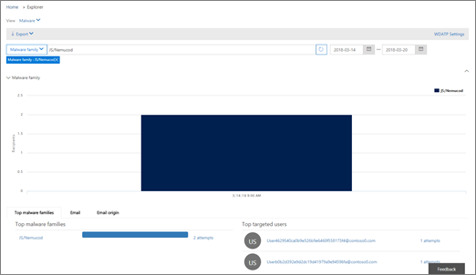

# Aufzeichnungen von Bedrohungen – neu und wichtigThreat Trackers - New and Noteworthy

[!INCLUDE [Microsoft 365 Defender rebranding](../includes/microsoft-defender-for-office.md)]

**Gilt für****Applies to**
- [Microsoft Defender für Office 365 – Plan 2Microsoft Defender for Office 365 plan 2](defender-for-office-365.md)
- [Microsoft 365 DefenderMicrosoft 365 Defender](../defender/microsoft-365-defender.md)

[Office 365 Bedrohungsuntersuchungs- und Reaktionsfunktionen](office-365-ti.md) ermöglichen es dem Sicherheitsteam Ihrer Organisation, Cybersicherheitsbedrohungen zu erkennen und Maßnahmen zu ergreifen.[Office 365 Threat Investigation and Response](office-365-ti.md) capabilities enable your organization's security team to discover and take action against cybersecurity threats. Office 365 Zu den Funktionen für die Untersuchung und Reaktion von Bedrohungen gehören Funktionen zur Bedrohungsverfolgung, einschließlich hinweiswürdiger Tracker.Office 365 Threat Investigation and Response capabilities include Threat Tracker features, including Noteworthy trackers. Lesen Sie diesen Artikel, um eine Übersicht über diese neuen Features und die nächsten Schritte zu erhalten.Read this article to get an overview of these new features and next steps.

> [!IMPORTANT]
> Office 365 Threat Intelligence ist jetzt Microsoft Defender für Office 365 Plan 2 sowie zusätzliche Funktionen zum Schutz vor Bedrohungen.Office 365 Threat Intelligence is now Microsoft Defender for Office 365 Plan 2, along with additional threat protection capabilities. Weitere Informationen finden Sie unter [Microsoft Defender for Office 365 plans and pricing](https://products.office.com/exchange/advance-threat-protection) und der Microsoft Defender for Office 365 Service [Description](/office365/servicedescriptions/office-365-advanced-threat-protection-service-description).To learn more, see [Microsoft Defender for Office 365 plans and pricing](https://products.office.com/exchange/advance-threat-protection) and the [Microsoft Defender for Office 365 Service Description](/office365/servicedescriptions/office-365-advanced-threat-protection-service-description).

## Was sind Threat Trackers?What are Threat Trackers?

Threat Trackers sind informative Widgets und Ansichten, die Ihnen Informationen zu verschiedenen Cybersicherheitsproblemen bieten, die sich auf Ihr Unternehmen auswirken können.Threat Trackers are informative widgets and views that provide you with intelligence on different cybersecurity issues that might impact your company. Beispielsweise können Sie Informationen zu trendenden Schadsoftwarekampagnen mithilfe von Threat Trackers anzeigen.For example, you can view information about trending malware campaigns using Threat Trackers.

Die meisten Nachverfolgungsseiten umfassen trendende Zahlen, die regelmäßig aktualisiert werden, Widgets, die Ihnen helfen,  zu verstehen, welche Probleme am größten sind oder am stärksten gestiegen sind, und einen Schnelllink in der Spalte Aktionen, die Sie zum Explorer führt, in dem Sie ausführlichere Informationen anzeigen können.Most tracker pages include trending numbers that are updated periodically, widgets to help you understand which issues are the biggest or have grown the most, and a quick link in the **Actions** column that takes you to Explorer, where you can view more detailed information.

Tracker sind nur einige der vielen großartigen Features, die Sie mit [Microsoft Defender für Office 365 Plan 2 erhalten.](office-365-ti.md)Trackers are just a few of the many great features you get with [Microsoft Defender for Office 365 Plan 2](office-365-ti.md). Threat Trackers umfassen [Noteworth-Tracker,](#noteworthy-trackers) [Trending-Tracker,](#trending-trackers) [Nachverfolgte](#tracked-queries)Abfragen und [Gespeicherte Abfragen.](#saved-queries)Threat Trackers include [Noteworth trackers](#noteworthy-trackers), [Trending trackers](#trending-trackers), [Tracked queries](#tracked-queries), and [Saved queries](#saved-queries).

Wenn Sie Ihre Bedrohungsverfolgungen für Ihre Organisation anzeigen und verwenden möchten, wechseln Sie zum Security & Compliance Center ( ) und wählen Sie Threat <https://protection.office.com> **Management** Threat \> **Tracker aus.**To view and use your Threat Trackers for your organization, go to the Security & Compliance Center (<https://protection.office.com>) and choose **Threat management** \> **Threat tracker**.

> [!NOTE]
> Um Threat Trackers verwenden zu können, müssen Sie ein globaler Administrator, Sicherheitsadministrator oder Sicherheitsleser sein.To use Threat Trackers, you must be a global administrator, security administrator, or security reader. Siehe [Berechtigungen im Security & Compliance Center](permissions-in-the-security-and-compliance-center.md).See [Permissions in the Security & Compliance Center](permissions-in-the-security-and-compliance-center.md).

### Beachtenswerte TrackerNoteworthy trackers

Beachtenswerte Tracker sind die Stellen, an denen Sie große und kleinere Bedrohungen und Risiken finden, über die Sie wissen sollten.Noteworthy trackers are where you'll find big and smaller threats and risks that we think you should know about. Beachtenswerte Tracker helfen Ihnen zu finden, ob diese Probleme in Ihrer Microsoft 365-Umgebung vorhanden sind, und link zu Artikeln (wie diesem), die Ihnen weitere Details zu den Vorgängen und deren Auswirkungen auf die Verwendung von Office 365.Noteworthy trackers help you find whether these issues exist in your Microsoft 365 environment, plus link to articles (like this one) that give you more details on what is happening, and how they'll impact your organization's use of Office 365. Unabhängig davon, ob es sich um eine große neue Bedrohung (z. B. Wannacry, Petya) oder um eine vorhandene Bedrohung handelt, die einige neue Herausforderungen mit sich schaffe (z. B. unser anderes veröffentlichungswürdiges Element - Nemucod), hier finden Sie wichtige neue Elemente, die Sie und Ihr Sicherheitsteam regelmäßig überprüfen und untersuchen sollten.Whether it's a big new threat (e.g. Wannacry, Petya) or an existing threat that might create some new challenges (like our other inaugural Noteworthy item - Nemucod), this is where you'll find important new items you and your security team should review and examine periodically.

In der Regel werden beachtenswerte Tracker nur für ein paar Wochen veröffentlicht, wenn wir neue Bedrohungen identifizieren und denken, dass Sie die zusätzliche Sichtbarkeit benötigen, die dieses Feature bietet.Typically Noteworthy trackers will be posted for just a couple of weeks when we identify new threats and think you might need the extra visibility that this feature provides. Sobald das größte Risiko für eine Bedrohung besteht, entfernen wir dieses beachtenswerte Element.Once the biggest risk for a threat has passed, we'll remove that Noteworthy item. Auf diese Weise können wir die Liste mit anderen relevanten neuen Elementen auf dem neuesten Stand halten.This way, we can keep the list fresh and up to date with other relevant new items.

### TrendverfolgungenTrending trackers

Trendverfolgungen (früher Kampagnen genannt) heben neue Bedrohungen auf, die in der letzten Woche in den E-Mails Ihrer Organisation empfangen wurden.Trending trackers (formerly called Campaigns) highlight new threats received in your organization's email in the past week.

Trending Trackers geben Ihnen eine Vorstellung von neuen Bedrohungen, die Sie überprüfen sollten, um sicherzustellen, dass Ihre umfassendere Unternehmensumgebung gegen Angriffe vorbereitet ist.Trending trackers give you an idea of new threats you should review to ensure your broader corporate environment is prepared against attacks.

### Nachverfolgte AbfragenTracked queries

Nachverfolgte Abfragen nutzen Ihre gespeicherten Abfragen, um die Microsoft 365 in Ihrer Organisation regelmäßig zu bewerten.Tracked queries leverage your saved queries to periodically assess Microsoft 365 activity in your organization. Dies gibt Ihnen ereignistrending, mit mehr zu kommen in den kommenden Monaten.This gives you event trending, with more to come in the coming months. Nachverfolgte Abfragen werden automatisch ausgeführt und geben Ihnen aktuelle Informationen, ohne sich daran erinnern zu müssen, Ihre Abfragen erneut ausführen zu müssen.Tracked queries run automatically, giving you up-to-date information without having to remember to re-run your queries.

### Gespeicherte AbfragenSaved queries

Gespeicherte Abfragen finden Sie auch im Abschnitt Trackers.Saved queries are also found in the Trackers section. Sie können gespeicherte Abfragen verwenden, um die allgemeinen Explorersuchen zu speichern, zu der Sie schneller und wiederholt zurückkommen möchten, ohne die Suche jedes Mal neu erstellen zu müssen.You can use Saved queries to store the common Explorer searches that you want to get back to quicker and repeatedly, without having to re-create the search every time.

Mit der Schaltfläche Abfrage speichern oben auf der Explorer-Seite  können Sie immer eine Notizverfolgungsabfrage oder eine ihrer eigenen Explorer-Abfragen speichern.You can always save a Noteworthy tracker query or any of your own Explorer queries using the **Save query** button at the top of the Explorer page. Dort gespeicherte Daten werden in der Liste Gespeicherte **Abfragen** auf der Seite Tracker angezeigt.Anything saved there will show up in the **Saved queries** list on the Tracker page.

## Tracker und ExplorerTrackers and Explorer

Unabhängig davon, ob Sie E-Mails, Inhalte oder Office (in Kürze) überprüfen, arbeiten Explorer und Tracker zusammen, um Sicherheitsrisiken und Bedrohungen zu untersuchen und nachverfolgt zu werden.Whether you're reviewing email, content, or Office activities (coming soon), Explorer and Trackers work together to help you investigate and track security risks and threats. Alle Tracker bieten Ihnen Informationen zum Schutz Ihrer Benutzer, indem sie neue, wichtige und häufig durchsuchte Probleme hervorheben und sicherstellen, dass Ihr Unternehmen besser geschützt ist, wenn es in die Cloud wechselt.All together, Trackers provide you with information to protect your users by highlighting new, notable, and frequently searched issues - ensuring your business is better protected as it moves to the cloud.

Denken Sie daran, dass Sie uns immer Feedback zu diesen oder anderen Microsoft 365-Sicherheitsfeatures geben können, indem Sie auf die Schaltfläche **Feedback** in der unteren rechten Ecke des [Overview of the Security & Compliance Center klicken.](https://support.microsoft.com/office/a5f2fd18-b029-4257-b5a8-ae83e7768c85)And remember that you can always provide us feedback on this or other Microsoft 365 security features by clicking on the **Feedback** button in the lower right corner of the [Overview of the Security & Compliance Center](https://support.microsoft.com/office/a5f2fd18-b029-4257-b5a8-ae83e7768c85).

## Tracker und Microsoft Defender für Office 365Trackers and Microsoft Defender for Office 365

Mit unserer ersten beachtenswerten Bedrohung heben wir erweiterte Schadsoftwarebedrohungen heraus, die von [sicheren Anlagen erkannt werden.](safe-attachments.md)With our inaugural Noteworthy threat, we're highlighting advanced malware threats detected by [Safe Attachments](safe-attachments.md). Wenn Sie ein Office 365 Enterprise E5-Kunde sind und [Microsoft Defender](defender-for-office-365.md)nicht für Office 365 verwenden, sollten Sie es sein – es ist in Ihrem Abonnement enthalten.If you're an Office 365 Enterprise E5 customer and you're not using [Microsoft Defender for Office 365](defender-for-office-365.md), you should be - it's included in your subscription. Defender for Office 365 bietet einen Mehrwert, auch wenn Andere Sicherheitstools den E-Mail-Fluss mit Ihren Office 365 haben.Defender for Office 365 provides value even if you have other security tools filtering email flow with your Office 365 services. Antispam- und [Safe Links-Features](safe-links.md) funktionieren jedoch am besten, wenn Ihre Hauptlösung für die E-Mail-Sicherheit über Office 365.However, anti-spam and [Safe Links](safe-links.md) features work best when your main email security solution is through Office 365.

In der heutigen bedrohungsbedrohten Welt bedeutet das Ausführen nur herkömmlicher Anschlagsscans, dass Sie nicht gut genug vor Angriffen geschützt sind.In today's threat-riddled world, running only traditional anti-malware scans means you are not protected well enough against attacks. Heutzutage verwenden anspruchsvollere Angreifer häufig verfügbare Tools, um neue, verschleierte oder verzögerte Angriffe zu erstellen, die von herkömmlichen signaturbasierten Anschlagsmodule nicht erkannt werden.Today's more sophisticated attackers use commonly available tools to create new, obfuscated, or delayed attacks that won't be recognized by traditional signature-based anti-malware engines. Das Feature "Sichere Anlagen" verwendet E-Mail-Anlagen und detoniert sie in einer virtuellen Umgebung, um zu bestimmen, ob sie sicher oder bösartig sind.The Safe Attachments feature takes email attachments and detonates them in a virtual environment to determine whether they're safe or malicious. Dieser Detonationsprozess öffnet jede Datei in einer virtuellen Computerumgebung und beobachtet dann, was nach dem Öffnen der Datei geschieht.This detonation process opens each file in a virtual computer environment, then watches what happens after the file is opened. Unabhängig davon, ob es sich um eine PDF- und komprimierte Datei oder um ein Office-Dokument, kann schadhafter Code in einer Datei ausgeblendet werden und nur aktiviert werden, wenn das Opfer es auf dem Computer öffnet.Whether it's a PDF, and compressed file, or an Office document, malicious code can be hidden in a file, activating only once the victim opens it on their computer. Durch das Detonieren und Analysieren der Datei im E-Mail-Fluss findet Defender for Office 365-Funktionen diese Bedrohungen basierend auf Verhaltensweisen, dateibasierter Reputation und einer Reihe heuristischer Regeln.By detonating and analyzing the file in the email flow, Defender for Office 365 capabilities finds these threats based on behaviors, file reputation, and a number of heuristic rules.

Der neue Filter Noteworthy threat hebt Elemente hervor, die kürzlich über sichere Anlagen erkannt wurden.The new Noteworthy threat filter highlights items that were recently detected through Safe Attachments. Diese Erkennungen stellen Elemente dar, bei der es sich um neue schädliche Dateien handelt, die von Microsoft 365 in Ihrem E-Mail-Fluss oder in der E-Mail anderer Kunden nicht gefunden wurden.These detections represent items that are new malicious files, not previously found by Microsoft 365 in either your email flow or other customers' email. Achten Sie auf die Elemente im Noteworthy Threat Tracker, sehen Sie, wer von ihnen gezielt wurde, und überprüfen Sie die Detonationsdetails auf der Registerkarte Erweiterte Analyse (gefunden durch Klicken auf den Betreff der E-Mail im Explorer).Pay attention to the items in the Noteworthy Threat Tracker, see who was targeted by them, and review the detonation details shown on the Advanced Analysis tab (found by clicking on the subject of the email in Explorer). Beachten Sie, dass Sie diese Registerkarte nur in E-Mails finden, die von der Funktion "Sichere Anlagen" erkannt wurden . Dieser Beachtenswerte Tracker enthält diesen Filter, Sie können diesen Filter jedoch auch für andere Suchen im Explorer verwenden.Note you'll only find this tab on emails detected by the Safe Attachments capability - this Noteworthy tracker includes that filter, but you can also use that filter for other searches in Explorer.

## Nächste SchritteNext steps

- Wenn Ihre Organisation noch nicht über diese Funktionen für Office 365 Bedrohungsuntersuchung und -reaktion verfügt, finden Sie weitere Informationen unter How [do Office 365 Threat Investigation and Response capabilities?](office-365-ti.md).If your organization doesn't already have these Office 365 Threat Investigation and Response capabilities, see [How do we get Office 365 Threat Investigation and Response capabilities?](office-365-ti.md).

- Stellen Sie sicher, dass Ihrem Sicherheitsteam die richtigen Rollen und Berechtigungen zugewiesen sind.Make sure that your security team has the correct roles and permissions assigned. Sie müssen ein globaler Administrator sein oder die Rolle Sicherheitsadministrator oder Such- und Bereinigungsrolle im Security & Compliance Center zugewiesen haben.You must be a global administrator, or have the Security Administrator or Search and Purge role assigned in the Security & Compliance Center. Siehe [Berechtigungen im Security & Compliance Center](permissions-in-the-security-and-compliance-center.md).See [Permissions in the Security & Compliance Center](permissions-in-the-security-and-compliance-center.md).

- Achten Sie auf die neuen Tracker, die in Ihrer Umgebung Microsoft 365 werden.Watch for the new Trackers to show up in your Microsoft 365 environment. Wenn verfügbar, finden Sie hier Ihre [Tracker.](https://protection.office.com/)When available, you'll find your Trackers [here](https://protection.office.com/). Wechseln Sie zu **Bedrohungsverwaltung** \> **Bedrohungsverfolgungen**.Go to **Threat management** \> **Threat trackers**.

- Wenn Sie dies noch nicht getan haben, erfahren Sie mehr über und konfigurieren  [Sie Microsoft Defender](defender-for-office-365.md) für Office 365 Für Ihre Organisation, einschließlich sicherer Links und [sicherer Anlagen](safe-attachments.md).If you haven't already done so, learn more about and configure [Microsoft Defender for Office 365](defender-for-office-365.md) for your organization, including [Safe links](safe-links.md) and [Safe Attachments](safe-attachments.md).
