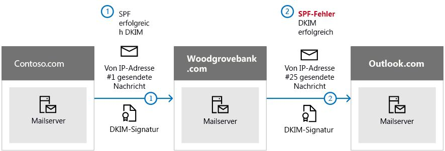

# <a name="use-dkim-to-validate-outbound-email-sent-from-your-custom-domain"></a><span data-ttu-id="bd6d9-103">Verwenden von DKIM zum Überprüfen ausgehender E-Mails, die von Ihrer benutzerdefinierten Domäne gesendet werden</span><span class="sxs-lookup"><span data-stu-id="bd6d9-103">Use DKIM to validate outbound email sent from your custom domain</span></span>

[!INCLUDE [Microsoft 365 Defender rebranding](../includes/microsoft-defender-for-office.md)]

<span data-ttu-id="bd6d9-104">**Gilt für**</span><span class="sxs-lookup"><span data-stu-id="bd6d9-104">**Applies to**</span></span>
- [<span data-ttu-id="bd6d9-105">Exchange Online Protection</span><span class="sxs-lookup"><span data-stu-id="bd6d9-105">Exchange Online Protection</span></span>](exchange-online-protection-overview.md)
- [<span data-ttu-id="bd6d9-106">Microsoft Defender für Office 365 Plan 1 und Plan 2</span><span class="sxs-lookup"><span data-stu-id="bd6d9-106">Microsoft Defender for Office 365 plan 1 and plan 2</span></span>](defender-for-office-365.md)
- [<span data-ttu-id="bd6d9-107">Microsoft 365 Defender</span><span class="sxs-lookup"><span data-stu-id="bd6d9-107">Microsoft 365 Defender</span></span>](../defender/microsoft-365-defender.md)

 <span data-ttu-id="bd6d9-108">Dieser Artikel führt die Schritte auf, um DomainKeys Identified Mail (DKIM) mit Microsoft 365 zu verwenden, um sicherzustellen, dass Ziel-E-Mail-Systeme Nachrichten vertrauen, die von Ihrer benutzerdefinierten Domäne aus gesendet werden.</span><span class="sxs-lookup"><span data-stu-id="bd6d9-108">This article lists the steps to use DomainKeys Identified Mail (DKIM) with Microsoft 365 to ensure that destination email systems trust messages sent outbound from your custom domain.</span></span>

<span data-ttu-id="bd6d9-109">Inhalt dieses Artikels:</span><span class="sxs-lookup"><span data-stu-id="bd6d9-109">In this article:</span></span>

- [<span data-ttu-id="bd6d9-110">So funktioniert DKIM besser als SPF, um Spoofing zu verhindern</span><span class="sxs-lookup"><span data-stu-id="bd6d9-110">How DKIM works better than SPF alone to prevent malicious spoofing</span></span>](#how-dkim-works-better-than-spf-alone-to-prevent-malicious-spoofing)
- [<span data-ttu-id="bd6d9-111">Schritte zum manuellen Upgrade Ihrer 1024-Bit-Schlüssel auf 2048-Bit-DKIM-Verschlüsselungsschlüssel</span><span class="sxs-lookup"><span data-stu-id="bd6d9-111">Steps to manually upgrade your 1024-bit keys to 2048-bit DKIM encryption keys</span></span>](#steps-to-manually-upgrade-your-1024-bit-keys-to-2048-bit-dkim-encryption-keys)
- [<span data-ttu-id="bd6d9-112">Schritte zum manuellen Einrichten von DKIM</span><span class="sxs-lookup"><span data-stu-id="bd6d9-112">Steps to manually set up DKIM</span></span>](#steps-to-manually-set-up-dkim)
- [<span data-ttu-id="bd6d9-113">Schritte zum Konfigurieren von DKIM für mehr als eine benutzerdefinierte Domäne</span><span class="sxs-lookup"><span data-stu-id="bd6d9-113">Steps to configure DKIM for more than one custom domain</span></span>](#to-configure-dkim-for-more-than-one-custom-domain)
- [<span data-ttu-id="bd6d9-114">Deaktivieren der DKIM-Signierungsrichtlinie für eine benutzerdefinierte Domäne</span><span class="sxs-lookup"><span data-stu-id="bd6d9-114">Disabling the DKIM signing policy for a custom domain</span></span>](#disabling-the-dkim-signing-policy-for-a-custom-domain)
- [<span data-ttu-id="bd6d9-115">Standardverhalten für DKIM und Microsoft 365</span><span class="sxs-lookup"><span data-stu-id="bd6d9-115">Default behavior for DKIM and Microsoft 365</span></span>](#default-behavior-for-dkim-and-microsoft-365)
- [<span data-ttu-id="bd6d9-116">Einrichten von DKIM, damit ein Drittanbieterdienst E-Mails im Auftrag Ihrer benutzerdefinierten Domäne senden oder fälschen kann</span><span class="sxs-lookup"><span data-stu-id="bd6d9-116">Set up DKIM so that a third-party service can send, or spoof, email on behalf of your custom domain</span></span>](#set-up-dkim-so-that-a-third-party-service-can-send-or-spoof-email-on-behalf-of-your-custom-domain)
- [<span data-ttu-id="bd6d9-117">Nächste Schritte: Nach dem Einrichten von DKIM für Microsoft 365</span><span class="sxs-lookup"><span data-stu-id="bd6d9-117">Next steps: After you set up DKIM for Microsoft 365</span></span>](#next-steps-after-you-set-up-dkim-for-microsoft-365)

> [!NOTE]
> <span data-ttu-id="bd6d9-118">Microsoft 365 richtet DKIM automatisch für die "onmicrosoft.com"-Anfangsdomänen ein.</span><span class="sxs-lookup"><span data-stu-id="bd6d9-118">Microsoft 365 automatically sets up DKIM for its initial 'onmicrosoft.com' domains.</span></span> <span data-ttu-id="bd6d9-119">Das bedeutet, dass Sie keine weiteren Aktionen durchführen müssen, um DKIM für jegliche Anfangsdomänennamen einzurichten (z. B. litware.onmicrosoft.com).</span><span class="sxs-lookup"><span data-stu-id="bd6d9-119">That means you don't need to do anything to set up DKIM for any initial domain names (for example, litware.onmicrosoft.com).</span></span> <span data-ttu-id="bd6d9-120">Weitere Informationen zu Domänen finden Sie unter [Häufig gestellte Fragen (FAQ) zu Domänen](../../admin/setup/domains-faq.yml#why-do-i-have-an--onmicrosoft-com--domain).</span><span class="sxs-lookup"><span data-stu-id="bd6d9-120">For more information about domains, see [Domains FAQ](../../admin/setup/domains-faq.yml#why-do-i-have-an--onmicrosoft-com--domain).</span></span>

<span data-ttu-id="bd6d9-121">DKIM ist eine der drei Authentifizierungsmethoden (SPF, DKIM und DMARC), die verhindern, dass Angreifer Nachrichten senden können, die aussehen, als ob sie von Ihrer Domäne stammen würden.</span><span class="sxs-lookup"><span data-stu-id="bd6d9-121">DKIM is one of the trio of Authentication methods (SPF, DKIM and DMARC) that help prevent attackers from sending messages that look like they come from your domain.</span></span>

<span data-ttu-id="bd6d9-p102">Mit DKIM können Sie für ausgehende E-Mail-Nachrichten im Nachrichtenkopf eine digitale Signatur hinzufügen. Wenn Sie DKIM konfigurieren, autorisieren Sie Ihre Domäne, ihren Namen einer E-Mail-Nachricht mithilfe einer kryptografischen Authentifizierung zuzuordnen oder die E-Mail damit zu signieren. E-Mail-Systeme, die E-Mails von Ihrer Domäne erhalten, können diese digitale Signatur verwenden, um zu überprüfen, ob eingehende E-Mails legitim sind.</span><span class="sxs-lookup"><span data-stu-id="bd6d9-p102">DKIM lets you add a digital signature to outbound email messages in the message header. When you configure DKIM, you authorize your domain to associate, or sign, its name to an email message using cryptographic authentication. Email systems that get email from your domain can use this digital signature to help verify whether incoming email is legitimate.</span></span>

<span data-ttu-id="bd6d9-125">Einfach ausgedrückt verschlüsselt ein privater Schlüssel die Kopfzeile in ausgehenden E-Mails einer Domäne.</span><span class="sxs-lookup"><span data-stu-id="bd6d9-125">In basic, a private key encrypts the header in a domain's outgoing email.</span></span> <span data-ttu-id="bd6d9-126">Der öffentliche Schlüssel wird in den DNS-Einträgen der Domäne veröffentlicht, und empfangende Server können diesen Schlüssel verwenden, um die Signatur zu entschlüsseln.</span><span class="sxs-lookup"><span data-stu-id="bd6d9-126">The public key is published in the domain's DNS records, and receiving servers can use that key to decode the signature.</span></span> <span data-ttu-id="bd6d9-127">Die DKIM-Verifizierung hilft den empfangenden Servern zu bestätigen, dass die E-Mail wirklich von Ihrer Domäne kommt und nicht von jemandem, der Ihre Domäne *spooft*.</span><span class="sxs-lookup"><span data-stu-id="bd6d9-127">DKIM verification helps the receiving servers confirm the mail is really coming from your domain and not someone *spoofing* your domain.</span></span>

> [!TIP]
><span data-ttu-id="bd6d9-p104">Sie können auch entscheiden, DKIM für Ihre benutzerdefinierte Domäne nicht zu verwenden. Wenn Sie DKIM für Ihre benutzerdefinierte Domäne nicht einrichten, erstellt Microsoft 365 ein privates und öffentliches Schlüsselpaar, aktiviert die DKIM-Signierung und konfiguriert dann die Microsoft 365-Standardrichtlinie für Ihre benutzerdefinierte Domäne.</span><span class="sxs-lookup"><span data-stu-id="bd6d9-p104">You can choose to do nothing about DKIM for your custom domain too. If you don't set up DKIM for your custom domain, Microsoft 365 creates a private and public key pair, enables DKIM signing, and then configures the Microsoft 365 default policy for your custom domain.</span></span>

 <span data-ttu-id="bd6d9-p105">Die eingebaute DKIM-Konfiguration von Microsoft 365 bietet den meisten Kunden genügend Abdeckung. Sie sollten jedoch DKIM in folgenden Fällen manuell für Ihre benutzerdefinierte Domäne konfigurieren:</span><span class="sxs-lookup"><span data-stu-id="bd6d9-p105">Microsoft-365's built-in DKIM configuration is sufficient coverage for most customers. However, you should manually configure DKIM for your custom domain in the following circumstances:</span></span>

- <span data-ttu-id="bd6d9-132">Sie haben mehr als eine benutzerdefinierte Domäne in Microsoft 365</span><span class="sxs-lookup"><span data-stu-id="bd6d9-132">You have more than one custom domain in Microsoft 365</span></span>
- <span data-ttu-id="bd6d9-133">Sie werden auch DMARC einrichten (**empfohlen**)</span><span class="sxs-lookup"><span data-stu-id="bd6d9-133">You're going to set up DMARC too (**recommended**)</span></span>
- <span data-ttu-id="bd6d9-134">Sie möchten die Kontrolle über Ihren privaten Schlüssel.</span><span class="sxs-lookup"><span data-stu-id="bd6d9-134">You want control over your private key</span></span>
- <span data-ttu-id="bd6d9-135">Sie möchten Ihre CNAME-Einträge anpassen.</span><span class="sxs-lookup"><span data-stu-id="bd6d9-135">You want to customize your CNAME records</span></span>
- <span data-ttu-id="bd6d9-136">Sie möchten DKIM-Schlüssel für E-Mails von Drittanbieterdomänen einrichten, beispielsweise bei Verwendung eines Drittanbietermassenversenders von E-Mails.</span><span class="sxs-lookup"><span data-stu-id="bd6d9-136">You want to set up DKIM keys for email originating out of a third-party domain, for example, if you use a third-party bulk mailer.</span></span>

## <a name="how-dkim-works-better-than-spf-alone-to-prevent-malicious-spoofing"></a><span data-ttu-id="bd6d9-137">So funktioniert DKIM besser als SPF, um Spoofing zu verhindern</span><span class="sxs-lookup"><span data-stu-id="bd6d9-137">How DKIM works better than SPF alone to prevent malicious spoofing</span></span>
<span data-ttu-id="bd6d9-138"><a name="HowDKIMWorks"> </a></span><span class="sxs-lookup"><span data-stu-id="bd6d9-138"><a name="HowDKIMWorks"> </a></span></span>

<span data-ttu-id="bd6d9-139">SPF fügt Informationen zu einem Nachrichtenumschlag hinzu, aber DKIM *verschlüsselt* eine Signatur im Nachrichtenkopf.</span><span class="sxs-lookup"><span data-stu-id="bd6d9-139">SPF adds information to a message envelope but DKIM *encrypts* a signature within the message header.</span></span> <span data-ttu-id="bd6d9-140">Wenn Sie eine Nachricht weiterleiten, können Teile dieses Nachrichtenumschlags vom Weiterleitungsserver entfernt werden.</span><span class="sxs-lookup"><span data-stu-id="bd6d9-140">When you forward a message, portions of that message's envelope can be stripped away by the forwarding server.</span></span> <span data-ttu-id="bd6d9-141">Da die digitale Signatur bei der E-Mail-Nachricht bleibt, da er Teil der E-Mail-Kopfzeile ist, funktioniert DKIM selbst dann, wenn eine Nachricht weitergeleitet wurde, wie im folgenden Beispiel gezeigt.</span><span class="sxs-lookup"><span data-stu-id="bd6d9-141">Since the digital signature stays with the email message because it's part of the email header, DKIM works even when a message has been forwarded as shown in the following example.</span></span>



<span data-ttu-id="bd6d9-p107">Wenn Sie in diesem Beispiel nur einen SPF TXT-Eintrag für Ihre Domäne veröffentlicht hätten, könnte der E-Mail-Server des Empfängers Ihre E-Mail als Spam markiert und ein falsch positives Ergebnis generiert haben. **Das Hinzufügen von DKIM in diesem Szenario reduziert die Meldung von *falsch positivem* Spam.** Da sich DKIM zur Authentifizierung auf die Kryptografie mit öffentlichen Schlüsseln stützt und nicht nur auf IP-Adressen, wird DKIM als deutlich stärkere Form der Authentifizierung als SPF betrachtet. Wir empfehlen, SPF und DKIM sowie auch DMARC in Ihrer Bereitstellung zu verwenden.</span><span class="sxs-lookup"><span data-stu-id="bd6d9-p107">In this example, if you had only published an SPF TXT record for your domain, the recipient's mail server could have marked your email as spam and generated a false positive result. **The addition of DKIM in this scenario reduces *false positive* spam reporting.** Because DKIM relies on public key cryptography to authenticate and not just IP addresses, DKIM is considered a much stronger form of authentication than SPF. We recommend using both SPF and DKIM, as well as DMARC in your deployment.</span></span>

> [!TIP]
> <span data-ttu-id="bd6d9-147">DKIM verwendet einen privaten Schlüssel, um eine verschlüsselte Signatur in den Nachrichtenkopf einzufügen.</span><span class="sxs-lookup"><span data-stu-id="bd6d9-147">DKIM uses a private key to insert an encrypted signature into the message headers.</span></span> <span data-ttu-id="bd6d9-148">Die signierende (ausgehende) Domäne wird als Wert des Felds **d=** in die Kopfzeile eingefügt.</span><span class="sxs-lookup"><span data-stu-id="bd6d9-148">The signing domain, or outbound domain, is inserted as the value of the **d=** field in the header.</span></span> <span data-ttu-id="bd6d9-149">Die überprüfende Domäne (Empfängerdomäne) verwendet dann das Feld **d=**, um den öffentlichen Schlüssel im DNS nachzuschlagen und die Nachricht zu authentifizieren.</span><span class="sxs-lookup"><span data-stu-id="bd6d9-149">The verifying domain, or recipient's domain, then uses the **d=** field to look up the public key from DNS, and authenticate the message.</span></span> <span data-ttu-id="bd6d9-150">Wenn die Nachricht verifiziert wird, ist die DKIM-Überprüfung erfolgreich.</span><span class="sxs-lookup"><span data-stu-id="bd6d9-150">If the message is verified, the DKIM check passes.</span></span>


## <a name="steps-to-manually-upgrade-your-1024-bit-keys-to-2048-bit-dkim-encryption-keys"></a><span data-ttu-id="bd6d9-151">Schritte zum manuellen Upgrade Ihrer 1024-Bit-Schlüssel auf 2048-Bit-DKIM-Verschlüsselungsschlüssel</span><span class="sxs-lookup"><span data-stu-id="bd6d9-151">Steps to manually upgrade your 1024-bit keys to 2048-bit DKIM encryption keys</span></span>
<span data-ttu-id="bd6d9-152"><a name="1024to2048DKIM"> </a></span><span class="sxs-lookup"><span data-stu-id="bd6d9-152"><a name="1024to2048DKIM"> </a></span></span>

> [!NOTE]
> <span data-ttu-id="bd6d9-153">Microsoft 365 richtet DKIM automatisch für die *onmicrosoft.com*-Domänen ein.</span><span class="sxs-lookup"><span data-stu-id="bd6d9-153">Microsoft 365 automatically sets up DKIM for *onmicrosoft.com* domains.</span></span> <span data-ttu-id="bd6d9-154">Es sind keine Schritte erforderlich, um DKIM für anfängliche Domänennamen zu verwenden (wie z. B. litware.*onmicrosoft.com*).</span><span class="sxs-lookup"><span data-stu-id="bd6d9-154">No steps are needed to use DKIM for any initial domain names (like litware.*onmicrosoft.com*).</span></span> <span data-ttu-id="bd6d9-155">Weitere Informationen zu Domänen finden Sie unter [Häufig gestellte Fragen (FAQ) zu Domänen](../../admin/setup/domains-faq.yml#why-do-i-have-an--onmicrosoft-com--domain).</span><span class="sxs-lookup"><span data-stu-id="bd6d9-155">For more information about domains, see [Domains FAQ](../../admin/setup/domains-faq.yml#why-do-i-have-an--onmicrosoft-com--domain).</span></span>

<span data-ttu-id="bd6d9-156">Da sowohl 1024-Bit als auch 2048-Bit für DKIM-Schlüssel unterstützt werden, erfahren Sie in diesen Anweisungen, wie Sie Ihren 1024-Bit-Schlüssel in[Exchange Online PowerShell](/powershell/exchange/connect-to-exchange-online-powershell) auf 2048 aktualisieren.</span><span class="sxs-lookup"><span data-stu-id="bd6d9-156">Since both 1024 and 2048 bitness are supported for DKIM keys, these directions will tell you how to upgrade your 1024-bit key to 2048 in [Exchange Online PowerShell](/powershell/exchange/connect-to-exchange-online-powershell).</span></span> <span data-ttu-id="bd6d9-157">Die nachstehenden Schritte werden auf zwei Anwendungsfälle angewandt. Wählen Sie bitte die Variante aus, die Ihren Anforderungen am ehesten entspricht.</span><span class="sxs-lookup"><span data-stu-id="bd6d9-157">The steps below are for two use-cases, please choose the one that best fits your configuration.</span></span>

- <span data-ttu-id="bd6d9-158">Wenn Sie **DKIM bereits konfiguriert haben**, ändern Sie die Biteinstellung, indem Sie den folgenden Befehl ausführen:</span><span class="sxs-lookup"><span data-stu-id="bd6d9-158">When you **already have DKIM configured**, you rotate bitness by running the following command:</span></span>

  ```powershell
  Rotate-DkimSigningConfig -KeySize 2048 -Identity {Guid of the existing Signing Config}
  ```

  <span data-ttu-id="bd6d9-159">**oder**</span><span class="sxs-lookup"><span data-stu-id="bd6d9-159">**or**</span></span>

- <span data-ttu-id="bd6d9-160">Führen Sie den folgenden Befehl aus, um eine **neue Implementierung von DKIM** zu erstellen:</span><span class="sxs-lookup"><span data-stu-id="bd6d9-160">For a **new implementation of DKIM**, run the following command:</span></span>

  ```powershell
  New-DkimSigningConfig -DomainName <Domain for which config is to be created> -KeySize 2048 -Enabled $true
  ```

<span data-ttu-id="bd6d9-161">Bleiben Sie mit Exchange Online PowerShell verbunden, um *zu überprüfen, ob die* Konfiguration durch Ausführung des folgenden Befehls ausgeführt werden konnte:</span><span class="sxs-lookup"><span data-stu-id="bd6d9-161">Stay connected to Exchange Online PowerShell to *verify* the configuration by running the following command:</span></span>

```powershell
Get-DkimSigningConfig -Identity <Domain for which the configuration was set> | Format-List
```

> [!TIP]
> <span data-ttu-id="bd6d9-162">Dieser neue 2048-Bit-Schlüssel wird zum RotateOnDate wirksam und sendet E-Mails in der Zwischenzeit mit dem 1024-Bit-Schlüssel.</span><span class="sxs-lookup"><span data-stu-id="bd6d9-162">This new 2048-bit key takes effect on the RotateOnDate, and will send emails with the 1024-bit key in the interim.</span></span> <span data-ttu-id="bd6d9-163">Nach vier Tagen können Sie einen erneuten Test mit dem 2048-Bit-Schlüssel ausführen (also, wenn der Wechsel auf den zweiten Selektor angewendet wird).</span><span class="sxs-lookup"><span data-stu-id="bd6d9-163">After four days, you can test again with the 2048-bit key (that is, once the rotation takes effect to the second selector).</span></span>

<span data-ttu-id="bd6d9-164">Wenn Sie zum zweiten Selektor wechseln möchten, haben Sie folgende Möglichkeiten: a) Sie lassen den Wechseln des Selektors durch den Microsoft 365-Dienst durchführen und aktualisieren auf 2048-Bit innerhalb der nächsten 6 Monate, oder b) nach 4 Tagen, und wechseln den zweiten Selektorschlüssel manuell unter Verwendung des entsprechenden, oben aufgeführten Cmdlets, nachdem Sie zuvor sichergestellt haben, dass 2048-Bit-Schlüssel verwendet werden.</span><span class="sxs-lookup"><span data-stu-id="bd6d9-164">If you want to rotate to the second selector, your options are a) let the Microsoft 365 service rotate the selector and upgrade to 2048-bitness within the next 6 months, or b) after 4 days and confirming that 2048-bitness is in use, manually rotate the second selector key by using the appropriate cmdlet listed above.</span></span>

<span data-ttu-id="bd6d9-165">Ausführliche Informationen zur Syntax und zu Parametern finden Sie in den folgenden Artikeln: [Rotate-DkimSigningConfig](/powershell/module/exchange/rotate-dkimsigningconfig), [New-DkimSigningConfig](/powershell/module/exchange/new-dkimsigningconfig)und [Get-DkimSigningConfig](/powershell/module/exchange/get-dkimsigningconfig).</span><span class="sxs-lookup"><span data-stu-id="bd6d9-165">For detailed syntax and parameter information, see the following articles: [Rotate-DkimSigningConfig](/powershell/module/exchange/rotate-dkimsigningconfig), [New-DkimSigningConfig](/powershell/module/exchange/new-dkimsigningconfig), and [Get-DkimSigningConfig](/powershell/module/exchange/get-dkimsigningconfig).</span></span>

## <a name="steps-to-manually-set-up-dkim"></a><span data-ttu-id="bd6d9-166">Schritte zum manuellen Einrichten von DKIM</span><span class="sxs-lookup"><span data-stu-id="bd6d9-166">Steps to manually set up DKIM</span></span>
<span data-ttu-id="bd6d9-167"><a name="SetUpDKIMO365"> </a></span><span class="sxs-lookup"><span data-stu-id="bd6d9-167"><a name="SetUpDKIMO365"> </a></span></span>

<span data-ttu-id="bd6d9-168">Um DKIM zu konfigurieren, müssen Sie diese Schritte ausführen:</span><span class="sxs-lookup"><span data-stu-id="bd6d9-168">To configure DKIM, you will complete these steps:</span></span>

- [<span data-ttu-id="bd6d9-169">Veröffentlichen von zwei CNAME-Einträgen für Ihre benutzerdefinierte Domäne in DNS</span><span class="sxs-lookup"><span data-stu-id="bd6d9-169">Publish two CNAME records for your custom domain in DNS</span></span>](use-dkim-to-validate-outbound-email.md#Publish2CNAME)
- [<span data-ttu-id="bd6d9-170">Aktivieren der DKIM-Signierung für Ihre benutzerdefinierte Domäne</span><span class="sxs-lookup"><span data-stu-id="bd6d9-170">Enable DKIM signing for your custom domain</span></span>](use-dkim-to-validate-outbound-email.md#EnableDKIMinO365)

### <a name="publish-two-cname-records-for-your-custom-domain-in-dns"></a><span data-ttu-id="bd6d9-171">Veröffentlichen von zwei CNAME-Einträgen für Ihre benutzerdefinierte Domäne in DNS</span><span class="sxs-lookup"><span data-stu-id="bd6d9-171">Publish two CNAME records for your custom domain in DNS</span></span>
<span data-ttu-id="bd6d9-172"><a name="Publish2CNAME"> </a></span><span class="sxs-lookup"><span data-stu-id="bd6d9-172"><a name="Publish2CNAME"> </a></span></span>

<span data-ttu-id="bd6d9-173">Für jede Domäne, für die Sie eine DKIM-Signatur in DNS hinzufügen möchten, müssen Sie zwei CNAME-Einträge veröffentlichen.</span><span class="sxs-lookup"><span data-stu-id="bd6d9-173">For each domain for which you want to add a DKIM signature in DNS, you need to publish two CNAME records.</span></span>

> [!NOTE]
> <span data-ttu-id="bd6d9-174">Wenn Sie nicht den gesamten Artikel gelesen haben, haben Sie möglicherweise diese zeitsparenden Informationen zur PowerShell-Verbindung verpasst: [Herstellen einer Verbindung zu Exchange Online PowerShell](/powershell/exchange/connect-to-exchange-online-powershell).</span><span class="sxs-lookup"><span data-stu-id="bd6d9-174">If you haven't read the full article, you may have missed this time-saving PowerShell connection information: [Connect to Exchange Online PowerShell](/powershell/exchange/connect-to-exchange-online-powershell).</span></span>

<span data-ttu-id="bd6d9-175">Führen Sie in Exchange Online PowerShell die folgenden Befehle aus, um die Selektoreinträge zu erstellen:</span><span class="sxs-lookup"><span data-stu-id="bd6d9-175">Run the following commands in Exchange Online PowerShell to create the selector records:</span></span>

```powershell
New-DkimSigningConfig -DomainName <domain> -Enabled $false
Get-DkimSigningConfig -Identity <domain> | Format-List Selector1CNAME, Selector2CNAME
```

<span data-ttu-id="bd6d9-p112">Wenn Sie neben der anfänglichen Domäne zusätzliche benutzerdefinierte Domänen in Microsoft 365 bereitgestellt haben, müssen Sie zwei CNAME-Einträge für jede zusätzliche Domäne veröffentlichen. Wenn Sie also zwei Domänen haben, müssen Sie vier zusätzliche CNAME-Einträge veröffentlichen usw.</span><span class="sxs-lookup"><span data-stu-id="bd6d9-p112">If you have provisioned custom domains in addition to the initial domain in Microsoft 365, you must publish two CNAME records for each additional domain. So, if you have two domains, you must publish two additional CNAME records, and so on.</span></span>

<span data-ttu-id="bd6d9-178">Verwenden Sie für CNAME-Einträge das folgende Format.</span><span class="sxs-lookup"><span data-stu-id="bd6d9-178">Use the following format for the CNAME records.</span></span>

> [!IMPORTANT]
> <span data-ttu-id="bd6d9-179">Wenn Sie zu unseren GCC High-Kunden gehören, berechnen wir _domainGuid_ anders!</span><span class="sxs-lookup"><span data-stu-id="bd6d9-179">If you are one of our GCC High customers, we calculate _domainGuid_ differently!</span></span> <span data-ttu-id="bd6d9-180">Anstatt den MX-Eintrag für Ihre _initialDomain_ zur Berechnung von _domainGuid_ zu suchen, wird diese direkt aus der angepassten Domäne heraus berechnet.</span><span class="sxs-lookup"><span data-stu-id="bd6d9-180">Instead of looking up the MX record for your _initialDomain_ to calculate _domainGuid_, instead we calculate it directly from the customized domain.</span></span> <span data-ttu-id="bd6d9-181">Wenn Ihre benutzerdefinierte Domäne z. B. "contoso.com" lautet, wird Ihre "domainGuid" zu "contoso-com", wobei alle Punkte durch Bindestriche ersetzt werden.</span><span class="sxs-lookup"><span data-stu-id="bd6d9-181">For example, if your customized domain is "contoso.com" your domainGuid becomes "contoso-com", any periods are replaced with a dash.</span></span> <span data-ttu-id="bd6d9-182">Unabhängig von dem MX-Eintrag, auf den Ihre „initialDomain“ verweist, verwenden Sie also immer die oben genannte Methode, um die in den CNAME-Einträgen verwendete „domainGuid“ zu berechnen.</span><span class="sxs-lookup"><span data-stu-id="bd6d9-182">So, regardless of what MX record your initialDomain points to, you'll always use the above method to calculate the domainGuid to use in your CNAME records.</span></span>

```console
Host name:            selector1._domainkey
Points to address or value:    selector1-<domainGUID>._domainkey.<initialDomain>
TTL:                3600

Host name:            selector2._domainkey
Points to address or value:    selector2-<domainGUID>._domainkey.<initialDomain>
TTL:                3600
```

<span data-ttu-id="bd6d9-183">Dabei gilt:</span><span class="sxs-lookup"><span data-stu-id="bd6d9-183">Where:</span></span>

- <span data-ttu-id="bd6d9-184">Für Microsoft 365 sind die Selektoren immer „selector1“ oder „selector2“.</span><span class="sxs-lookup"><span data-stu-id="bd6d9-184">For Microsoft 365, the selectors will always be "selector1" or "selector2".</span></span>
- <span data-ttu-id="bd6d9-p114">_domainGUID_ ist identisch mit _domainGUID_ im angepassten MX-Eintrag für Ihre benutzerdefinierte Domäne, welche vor mail.protection.outlook.com angezeigt wird. Beispiel: Im folgenden MX-Eintrag für die Domäne contoso.com ist die _domainGUID_ contoso-com:</span><span class="sxs-lookup"><span data-stu-id="bd6d9-p114">_domainGUID_ is the same as the _domainGUID_ in the customized MX record for your custom domain that appears before mail.protection.outlook.com. For example, in the following MX record for the domain contoso.com, the _domainGUID_ is contoso-com:</span></span>

  > <span data-ttu-id="bd6d9-p115">contoso.com.  3600  IN  MX   5 contoso-com.mail.protection.outlook.com</span><span class="sxs-lookup"><span data-stu-id="bd6d9-p115">contoso.com.  3600  IN  MX   5 contoso-com.mail.protection.outlook.com</span></span>

- <span data-ttu-id="bd6d9-189">_initialDomain_ ist die Domäne, die Sie bei der Anmeldung für Microsoft 365 verwendet haben.</span><span class="sxs-lookup"><span data-stu-id="bd6d9-189">_initialDomain_ is the domain that you used when you signed up for Microsoft 365.</span></span> <span data-ttu-id="bd6d9-190">Anfangsdomänen enden immer auf "onmicrosoft.com".</span><span class="sxs-lookup"><span data-stu-id="bd6d9-190">Initial domains always end in onmicrosoft.com.</span></span> <span data-ttu-id="bd6d9-191">Informationen zum Ermitteln Ihrer ersten Domäne finden Sie unter [Häufig gestellte Fragen zu Domänen](../../admin/setup/domains-faq.yml#why-do-i-have-an--onmicrosoft-com--domain).</span><span class="sxs-lookup"><span data-stu-id="bd6d9-191">For information about determining your initial domain, see [Domains FAQ](../../admin/setup/domains-faq.yml#why-do-i-have-an--onmicrosoft-com--domain).</span></span>

<span data-ttu-id="bd6d9-192">Wenn Sie beispielsweise als erste Domäne „cohovineyardandwinery.onmicrosoft.com“ und zwei benutzerdefinierte Domänen „cohovineyard.com“ und „cohowinery.com“ haben, müssten Sie zwei CNAME-Einträge für jede zusätzliche Domäne einrichten, also insgesamt vier CNAME-Einträge.</span><span class="sxs-lookup"><span data-stu-id="bd6d9-192">For example, if you have an initial domain of cohovineyardandwinery.onmicrosoft.com, and two custom domains cohovineyard.com and cohowinery.com, you would need to set up two CNAME records for each additional domain, for a total of four CNAME records.</span></span>

```console
Host name:            selector1._domainkey
Points to address or value:    selector1-cohovineyard-com._domainkey.cohovineyardandwinery.onmicrosoft.com
TTL:                3600

Host name:            selector2._domainkey
Points to address or value:    selector2-cohovineyard-com._domainkey.cohovineyardandwinery.onmicrosoft.com
TTL:                3600

Host name:            selector1._domainkey
Points to address or value:    selector1-cohowinery-com._domainkey.cohovineyardandwinery.onmicrosoft.com
TTL:                3600

Host name:            selector2._domainkey
Points to address or value:    selector2-cohowinery-com._domainkey.cohovineyardandwinery.onmicrosoft.com
TTL:                3600
```

> [!NOTE]
> <span data-ttu-id="bd6d9-193">Es ist wichtig, den zweiten Eintrag zu erstellen, aber zum Zeitpunkt der Erstellung wird möglicherweise nur einer der Selektoren verfügbar sein.</span><span class="sxs-lookup"><span data-stu-id="bd6d9-193">It's important to create the second record, but only one of the selectors may be available at the time of creation.</span></span> <span data-ttu-id="bd6d9-194">Im Wesentlichen verweist der zweite Selektor möglicherweise auf eine noch nicht erstellte Adresse.</span><span class="sxs-lookup"><span data-stu-id="bd6d9-194">In essence, the second selector might point to an address that hasn't been created yet.</span></span> <span data-ttu-id="bd6d9-195">Es empfiehlt sich trotzdem, den zweiten CNAME-Eintrag zu erstellen, da Ihre Schlüsselrotation dann nahtlos ausgeführt wird.</span><span class="sxs-lookup"><span data-stu-id="bd6d9-195">We still recommended that you create the second CNAME record, because your key rotation will be seamless.</span></span>

### <a name="steps-to-enable-dkim-signing-for-your-custom-domain"></a><span data-ttu-id="bd6d9-196">Schritte zum Aktivieren der DKIM-Signatur für Ihre benutzerdefinierte Domäne</span><span class="sxs-lookup"><span data-stu-id="bd6d9-196">Steps to enable DKIM signing for your custom domain</span></span>
<span data-ttu-id="bd6d9-197"><a name="EnableDKIMinO365"> </a></span><span class="sxs-lookup"><span data-stu-id="bd6d9-197"><a name="EnableDKIMinO365"> </a></span></span>

<span data-ttu-id="bd6d9-p118">Nachdem Sie die CNAME-Einträge im DNS veröffentlicht haben, können Sie die DKIM-Signierung über Microsoft 365 aktivieren. Sie können dies über das Microsoft 365 Admin Center oder mithilfe von PowerShell durchführen.</span><span class="sxs-lookup"><span data-stu-id="bd6d9-p118">Once you have published the CNAME records in DNS, you are ready to enable DKIM signing through Microsoft 365. You can do this either through the Microsoft 365 admin center or by using PowerShell.</span></span>

#### <a name="to-enable-dkim-signing-for-your-custom-domain-in-the-microsoft-365-defender-portal"></a><span data-ttu-id="bd6d9-200">So aktivieren Sie die DKIM-Signatur für Ihre benutzerdefinierte Domäne im Microsoft 365 Defender-Portal</span><span class="sxs-lookup"><span data-stu-id="bd6d9-200">To enable DKIM signing for your custom domain in the Microsoft 365 Defender portal</span></span>

1. <span data-ttu-id="bd6d9-201">Öffnen Sie das Microsoft 365 Defender-Portal [mit Ihrem Geschäfts-, Schul- oder Unikonto](https://support.microsoft.com/office/e9eb7d51-5430-4929-91ab-6157c5a050b4).</span><span class="sxs-lookup"><span data-stu-id="bd6d9-201">Open the Microsoft 365 Defender portal [using your work or school account](https://support.microsoft.com/office/e9eb7d51-5430-4929-91ab-6157c5a050b4).</span></span>

2. <span data-ttu-id="bd6d9-202">Navigieren Sie zu **E-Mail und Zusammenarbeit** \> **Richtlinien und Regeln** \> **Bedrohungsrichtlinien** Seite \> **Regeln** Abschnitt \> **DKIM**.</span><span class="sxs-lookup"><span data-stu-id="bd6d9-202">Go to **Email & Collaboration** \> **Policies & Rules** \> **Threat policies** page \> **Rules** section \> **DKIM**.</span></span> <span data-ttu-id="bd6d9-203">Oder verwenden Sie <https://security.microsoft.com/dkimv2>, um direkt zur DKIM-Seite zu wechseln.</span><span class="sxs-lookup"><span data-stu-id="bd6d9-203">Or, to go directly to the DKIM page, use <https://security.microsoft.com/dkimv2>.</span></span>

3. <span data-ttu-id="bd6d9-204">Wählen Sie auf der Seite **DKIM** die Domäne aus, indem Sie auf den Namen klicken.</span><span class="sxs-lookup"><span data-stu-id="bd6d9-204">On the **DKIM** page, select the domain by clicking on the name.</span></span>

4. <span data-ttu-id="bd6d9-205">Ändern Sie im eingeblendeten Flyout mit den Details die Einstellung **Nachrichten für diese Domain mit DKIM-Signaturen signieren** auf **Aktiviert** ()</span><span class="sxs-lookup"><span data-stu-id="bd6d9-205">In the details flyout that appears, chang the **Sign messages for this domain with DKIM signatures** setting to **Enabled** ()</span></span>

   <span data-ttu-id="bd6d9-206">Klicken Sie nach Abschluss des Vorgangs auf **DKIM-Schlüssel rotieren**.</span><span class="sxs-lookup"><span data-stu-id="bd6d9-206">When you're finished, click **Rotate DKIM keys**.</span></span>

5. <span data-ttu-id="bd6d9-207">Wiederholen Sie diesen Schritt für jede benutzerdefinierte Domäne.</span><span class="sxs-lookup"><span data-stu-id="bd6d9-207">Repeat these step for each custom domain.</span></span>

#### <a name="to-enable-dkim-signing-for-your-custom-domain-by-using-powershell"></a><span data-ttu-id="bd6d9-208">So aktivieren Sie die DKIM-Signierung für Ihre benutzerdefinierte Domäne mit PowerShell</span><span class="sxs-lookup"><span data-stu-id="bd6d9-208">To enable DKIM signing for your custom domain by using PowerShell</span></span>

> [!IMPORTANT]
> :::image type="content" source="../../media/dkim.png" alt-text="Der Fehler „Für diese Domäne werden keine DKIM-Schlüssel gespeichert“.":::
> <span data-ttu-id="bd6d9-210">Wenn Sie DKIM zum ersten Mal konfigurieren und die Fehlermeldung „Für diese Domäne werden keine DKIM-Schlüssel gespeichert“ angezeigt wird, führen Sie den Befehl in Schritt 2 unten aus (z. B. `Set-DkimSigningConfig -Identity contoso.com -Enabled $true`), um den Schlüssel anzuzeigen.</span><span class="sxs-lookup"><span data-stu-id="bd6d9-210">If you are configuring DKIM for the first time and see the error 'No DKIM keys saved for this domain' complete the command in step 2 below (for example, `Set-DkimSigningConfig -Identity contoso.com -Enabled $true`) to see the key.</span></span>

1. <span data-ttu-id="bd6d9-211">[Stellen Sie eine Verbindung mit Exchange Online PowerShell her](/powershell/exchange/connect-to-exchange-online-powershell).</span><span class="sxs-lookup"><span data-stu-id="bd6d9-211">[Connect to Exchange Online PowerShell](/powershell/exchange/connect-to-exchange-online-powershell).</span></span>

2. <span data-ttu-id="bd6d9-212">Verwenden Sie die folgende Syntax:</span><span class="sxs-lookup"><span data-stu-id="bd6d9-212">Use the following syntax:</span></span>

   ```powershell
   Set-DkimSigningConfig -Identity <Domain> -Enabled $true
   ```

   <span data-ttu-id="bd6d9-213">\<Domain\> ist der Name der benutzerdefinierten Domäne, für die Sie die DKIM-Signierung aktivieren möchten.</span><span class="sxs-lookup"><span data-stu-id="bd6d9-213">\<Domain\> is the name of the custom domain that you want to enable DKIM signing for.</span></span>

   <span data-ttu-id="bd6d9-214">In diesem Beispiel wird die DKIM-Signierung für die Domäne „contoso.com“ aktiviert:</span><span class="sxs-lookup"><span data-stu-id="bd6d9-214">This example enables DKIM signing for the domain contoso.com:</span></span>

   ```powershell
   Set-DkimSigningConfig -Identity contoso.com -Enabled $true
   ```

#### <a name="to-confirm-dkim-signing-is-configured-properly-for-microsoft-365"></a><span data-ttu-id="bd6d9-215">So bestätigen Sie, dass die DKIM-Signierung ordnungsgemäß für Microsoft 365 konfiguriert ist</span><span class="sxs-lookup"><span data-stu-id="bd6d9-215">To Confirm DKIM signing is configured properly for Microsoft 365</span></span>

<span data-ttu-id="bd6d9-p120">Warten Sie einige Minuten, bevor Sie diese Schritte ausführen, um zu bestätigen, dass Sie DKIM ordnungsgemäß konfiguriert haben. Dadurch ist genug Zeit vorhanden, um die DKIM-Informationen zur Domäne im gesamten Netzwerk zu verteilen.</span><span class="sxs-lookup"><span data-stu-id="bd6d9-p120">Wait a few minutes before you follow these steps to confirm that you have properly configured DKIM. This allows time for the DKIM information about the domain to be spread throughout the network.</span></span>

- <span data-ttu-id="bd6d9-218">Senden Sie eine Nachricht von einem Konto in Ihrer Microsoft 365-Domäne mit aktiviertem DKIM an ein anderes E-Mail-Konto wie „outlook.com“ oder „Hotmail.com“.</span><span class="sxs-lookup"><span data-stu-id="bd6d9-218">Send a message from an account within your Microsoft 365 DKIM-enabled domain to another email account such as outlook.com or Hotmail.com.</span></span>
- <span data-ttu-id="bd6d9-p121">Verwenden Sie zu Testzwecken kein „aol.com“-Konto. AOL überspringt möglicherweise die DKIM-Überprüfung, wenn die SPF-Prüfung erfolgreich ist. Dadurch hat der Test keine Relevanz.</span><span class="sxs-lookup"><span data-stu-id="bd6d9-p121">Do not use an aol.com account for testing purposes. AOL may skip the DKIM check if the SPF check passes. This will nullify your test.</span></span>
- <span data-ttu-id="bd6d9-p122">Öffnen Sie die Nachricht, und sehen Sie sich die Überschrift an. Anweisungen zum Anzeigen der Kopfzeile der Nachricht variieren je nach Messagingclient. Anweisungen zum Anzeigen der Kopfzeilen von Nachrichten in Outlook finden Sie unter [Anzeigen der Kopfzeilen von Internetnachrichten in Outlook](https://support.microsoft.com/office/cd039382-dc6e-4264-ac74-c048563d212c).</span><span class="sxs-lookup"><span data-stu-id="bd6d9-p122">Open the message and look at the header. Instructions for viewing the header for the message will vary depending on your messaging client. For instructions on viewing message headers in Outlook, see [View internet message headers in Outlook](https://support.microsoft.com/office/cd039382-dc6e-4264-ac74-c048563d212c).</span></span>

  <span data-ttu-id="bd6d9-p123">Die mit DKIM signierte Nachricht enthält den Hostnamen und die Domäne, die Sie definiert haben, wenn Sie die CNAME-Einträge veröffentlicht haben. Die Nachricht sieht in etwa wie im folgenden Beispiel aus:</span><span class="sxs-lookup"><span data-stu-id="bd6d9-p123">The DKIM-signed message will contain the host name and domain you defined when you published the CNAME entries. The message will look something like this example:</span></span>

  ```console
    From: Example User <example@contoso.com>
    DKIM-Signature: v=1; a=rsa-sha256; q=dns/txt; c=relaxed/relaxed;
        s=selector1; d=contoso.com; t=1429912795;
        h=From:To:Message-ID:Subject:MIME-Version:Content-Type;
        bh=<body hash>;
        b=<signed field>;
  ```

- <span data-ttu-id="bd6d9-p124">Suchen Sie nach der „Authentication-Results“-Kopfzeile. Obwohl jeder empfangende Dienst ein geringfügig anderes Format verwendet, um die eingehenden E-Mail-Nachrichten mit Zeitstempeln zu versehen, sollte das Ergebnis immer etwas wie **DKIM=pass** oder **DKIM=OK** enthalten.</span><span class="sxs-lookup"><span data-stu-id="bd6d9-p124">Look for the Authentication-Results header. While each receiving service uses a slightly different format to stamp the incoming mail, the result should include something like **DKIM=pass** or **DKIM=OK**.</span></span>

## <a name="to-configure-dkim-for-more-than-one-custom-domain"></a><span data-ttu-id="bd6d9-229">Konfigurieren von DKIM für mehrere benutzerdefinierte Domänen</span><span class="sxs-lookup"><span data-stu-id="bd6d9-229">To configure DKIM for more than one custom domain</span></span>
<span data-ttu-id="bd6d9-230"><a name="DKIMMultiDomain"> </a></span><span class="sxs-lookup"><span data-stu-id="bd6d9-230"><a name="DKIMMultiDomain"> </a></span></span>

<span data-ttu-id="bd6d9-231">Wenn Sie zu einem bestimmten Zeitpunkt in der Zukunft eine weitere benutzerdefinierte Domäne hinzufügen und DKIM für die neue Domäne aktivieren möchten, müssen Sie die Schritte in diesem Artikel für jede Domäne ausführen.</span><span class="sxs-lookup"><span data-stu-id="bd6d9-231">If at some point in the future you decide to add another custom domain and you want to enable DKIM for the new domain, you must complete the steps in this article for each domain.</span></span> <span data-ttu-id="bd6d9-232">Schließen Sie insbesondere alle Schritte in [Schritte zum manuellen Einrichten von DKIM](use-dkim-to-validate-outbound-email.md#SetUpDKIMO365) ab.</span><span class="sxs-lookup"><span data-stu-id="bd6d9-232">Specifically, complete all steps in [What you need to do to manually set up DKIM](use-dkim-to-validate-outbound-email.md#SetUpDKIMO365).</span></span>

## <a name="disabling-the-dkim-signing-policy-for-a-custom-domain"></a><span data-ttu-id="bd6d9-233">Deaktivieren der DKIM-Signierungsrichtlinie für eine benutzerdefinierte Domäne</span><span class="sxs-lookup"><span data-stu-id="bd6d9-233">Disabling the DKIM signing policy for a custom domain</span></span>
<span data-ttu-id="bd6d9-234"><a name="DisableDKIMSigningPolicy"> </a></span><span class="sxs-lookup"><span data-stu-id="bd6d9-234"><a name="DisableDKIMSigningPolicy"> </a></span></span>

<span data-ttu-id="bd6d9-235">Durch das Deaktivieren der Signierungsrichtlinie wird DKIM nicht vollständig deaktiviert.</span><span class="sxs-lookup"><span data-stu-id="bd6d9-235">Disabling the signing policy does not completely disable DKIM.</span></span> <span data-ttu-id="bd6d9-236">Nach einer bestimmten Zeitspanne übernimmt Microsoft 365 automatisch die Standardrichtlinie für Ihre Domäne.</span><span class="sxs-lookup"><span data-stu-id="bd6d9-236">After a period of time, Microsoft 365 will automatically apply the default policy for your domain.</span></span> <span data-ttu-id="bd6d9-237">Weitere Informationen finden Sie unter [Standardverhalten für DKIM und Microsoft 365](use-dkim-to-validate-outbound-email.md#DefaultDKIMbehavior).</span><span class="sxs-lookup"><span data-stu-id="bd6d9-237">For more information, see [Default behavior for DKIM and Microsoft 365](use-dkim-to-validate-outbound-email.md#DefaultDKIMbehavior).</span></span>

### <a name="to-disable-the-dkim-signing-policy-by-using-windows-powershell"></a><span data-ttu-id="bd6d9-238">So deaktivieren Sie die DKIM-Signierungsrichtlinie mithilfe von Windows PowerShell</span><span class="sxs-lookup"><span data-stu-id="bd6d9-238">To disable the DKIM signing policy by using Windows PowerShell</span></span>

1. <span data-ttu-id="bd6d9-239">[Stellen Sie eine Verbindung mit Exchange Online PowerShell her](/powershell/exchange/connect-to-exchange-online-powershell).</span><span class="sxs-lookup"><span data-stu-id="bd6d9-239">[Connect to Exchange Online PowerShell](/powershell/exchange/connect-to-exchange-online-powershell).</span></span>

2. <span data-ttu-id="bd6d9-240">Führen Sie einen der folgenden Befehle für jede Domäne aus, für die Sie die DKIM-Signierung deaktivieren möchten.</span><span class="sxs-lookup"><span data-stu-id="bd6d9-240">Run one of the following commands for each domain for which you want to disable DKIM signing.</span></span>

   ```powershell
   $p = Get-DkimSigningConfig -Identity <Domain>
   $p[0] | Set-DkimSigningConfig -Enabled $false
   ```

   <span data-ttu-id="bd6d9-241">Beispiel:</span><span class="sxs-lookup"><span data-stu-id="bd6d9-241">For example:</span></span>

   ```powershell
   $p = Get-DkimSigningConfig -Identity contoso.com
   $p[0] | Set-DkimSigningConfig -Enabled $false
   ```

   <span data-ttu-id="bd6d9-242">Oder</span><span class="sxs-lookup"><span data-stu-id="bd6d9-242">Or</span></span>

   ```powershell
   Set-DkimSigningConfig -Identity $p[<number>].Identity -Enabled $false
   ```

   <span data-ttu-id="bd6d9-p127">Wobei _number_ der Index der Richtlinie ist. Beispiel:</span><span class="sxs-lookup"><span data-stu-id="bd6d9-p127">Where _number_ is the index of the policy. For example:</span></span>

   ```powershell
   Set-DkimSigningConfig -Identity $p[0].Identity -Enabled $false
   ```

## <a name="default-behavior-for-dkim-and-microsoft-365"></a><span data-ttu-id="bd6d9-245">Standardverhalten für DKIM und Microsoft 365</span><span class="sxs-lookup"><span data-stu-id="bd6d9-245">Default behavior for DKIM and Microsoft 365</span></span>
<span data-ttu-id="bd6d9-246"><a name="DefaultDKIMbehavior"> </a></span><span class="sxs-lookup"><span data-stu-id="bd6d9-246"><a name="DefaultDKIMbehavior"> </a></span></span>

<span data-ttu-id="bd6d9-p128">Wenn Sie DKIM nicht aktivieren, erstellt Microsoft 365 automatisch einen öffentlichen 1024-Bit-DKIM-Schlüssel für Ihre Domäne und den zugehörigen privaten Schlüssel, der intern in unserem Rechenzentrum gespeichert wird. Standardmäßig verwendet Microsoft 365 eine standardmäßige Signierkonfiguration für Domänen, die keine Richtlinie eingerichtet haben. Dies bedeutet, dass, wenn Sie DKIM nicht selbst einrichten, Microsoft 365 seine Standardrichtlinie und Standardschlüssel verwendet, die erstellt wurden, um DKIM für Ihre Domäne zu aktivieren.</span><span class="sxs-lookup"><span data-stu-id="bd6d9-p128">If you do not enable DKIM, Microsoft 365 automatically creates a 1024-bit DKIM public key for your default domain and the associated private key which we store internally in our datacenter. By default, Microsoft 365 uses a default signing configuration for domains that do not have a policy in place. This means that if you do not set up DKIM yourself, Microsoft 365 will use its default policy and keys it creates to enable DKIM for your domain.</span></span>

<span data-ttu-id="bd6d9-250">Wenn Sie die DKIM-Signatur nach der Aktivierung nach einer bestimmten Zeit wieder deaktivieren, wendet Microsoft 365 automatisch die Standardrichtlinie für Ihre Domäne an.</span><span class="sxs-lookup"><span data-stu-id="bd6d9-250">Also, if you disable DKIM signing after enabling it, after a period of time, Microsoft 365 will automatically apply the default policy for your domain.</span></span>

<span data-ttu-id="bd6d9-p129">Im folgenden Beispiel wird angenommen, dass DKIM für fabrikam.com durch Microsoft 365 und nicht durch den Administrator der Domäne aktiviert wurde. Das bedeutet, dass die erforderlichen CNAME-Einträge nicht im DNS vorhanden sind. DKIM-Signaturen für E-Mail-Nachrichten aus dieser Domäne sehen in etwa wie folgt aus:</span><span class="sxs-lookup"><span data-stu-id="bd6d9-p129">In the following example, suppose that DKIM for fabrikam.com was enabled by Microsoft 365, not by the administrator of the domain. This means that the required CNAMEs do not exist in DNS. DKIM signatures for email from this domain will look something like this:</span></span>

```console
From: Second Example <second.example@fabrikam.com>
DKIM-Signature: v=1; a=rsa-sha256; q=dns/txt; c=relaxed/relaxed;
    s=selector1-fabrikam-com; d=contoso.onmicrosoft.com; t=1429912795;
    h=From:To:Message-ID:Subject:MIME-Version:Content-Type;
    bh=<body hash>;
    b=<signed field>;
```

<span data-ttu-id="bd6d9-254">In diesem Beispiel enthalten der Hostname und die Domäne die Werte, auf die der CNAME-Eintrag verweisen würden, wenn die DKIM-Signierung für „fabrikam.com“ vom Domänenadministrator aktiviert worden wäre.</span><span class="sxs-lookup"><span data-stu-id="bd6d9-254">In this example, the host name and domain contain the values to which the CNAME would point if DKIM-signing for fabrikam.com had been enabled by the domain administrator.</span></span> <span data-ttu-id="bd6d9-255">Schließlich wird jede einzelne Nachricht, die von Microsoft 365 gesendet wird, mit DKIM signiert.</span><span class="sxs-lookup"><span data-stu-id="bd6d9-255">Eventually, every single message sent from Microsoft 365 will be DKIM-signed.</span></span> <span data-ttu-id="bd6d9-256">Wenn Sie DKIM selbst aktivieren, ist die Domäne identisch mit der Domäne in der „From:“-Adresse, in diesem Fall „fabrikam.com“.</span><span class="sxs-lookup"><span data-stu-id="bd6d9-256">If you enable DKIM yourself, the domain will be the same as the domain in the From: address, in this case fabrikam.com.</span></span> <span data-ttu-id="bd6d9-257">Andernfalls erfolgt keine Ausrichtung. Stattdessen wird die erste Domäne Ihrer Organisation verwendet.</span><span class="sxs-lookup"><span data-stu-id="bd6d9-257">If you don't, it will not align and instead will use your organization's initial domain.</span></span> <span data-ttu-id="bd6d9-258">Informationen zum Ermitteln Ihrer ersten Domäne finden Sie unter [Häufig gestellte Fragen zu Domänen](../../admin/setup/domains-faq.yml#why-do-i-have-an--onmicrosoft-com--domain).</span><span class="sxs-lookup"><span data-stu-id="bd6d9-258">For information about determining your initial domain, see [Domains FAQ](../../admin/setup/domains-faq.yml#why-do-i-have-an--onmicrosoft-com--domain).</span></span>

## <a name="set-up-dkim-so-that-a-third-party-service-can-send-or-spoof-email-on-behalf-of-your-custom-domain"></a><span data-ttu-id="bd6d9-259">Einrichten von DKIM, damit ein Drittanbieterdienst E-Mails im Auftrag Ihrer benutzerdefinierten Domäne senden oder fälschen kann</span><span class="sxs-lookup"><span data-stu-id="bd6d9-259">Set up DKIM so that a third-party service can send, or spoof, email on behalf of your custom domain</span></span>
<span data-ttu-id="bd6d9-260"><a name="SetUp3rdPartyspoof"> </a></span><span class="sxs-lookup"><span data-stu-id="bd6d9-260"><a name="SetUp3rdPartyspoof"> </a></span></span>

<span data-ttu-id="bd6d9-p131">Bei einigen Massen-E-Mail-Dienstanbietern oder Software-as-a-Service-Anbietern können Sie DKIM-Schlüssel für E-Mails einrichten, die von diesem Dienst stammen. Dies erfordert eine Koordination zwischen Ihnen und dem Drittanbieter, damit die erforderlichen DNS-Einträge eingerichtet werden können. Einige Drittanbieter verfügen möglicherweise über eigene CNAME-Einträge mit anderen Selektoren. Keine zwei Organisationen führen dies auf die gleiche Weise durch. Der Prozess hängt vollständig von der Organisation ab.</span><span class="sxs-lookup"><span data-stu-id="bd6d9-p131">Some bulk email service providers, or software-as-a-service providers, let you set up DKIM keys for email that originates from their service. This requires coordination between yourself and the third-party in order to set up the necessary DNS records. Some third-party servers can have their own CNAME records with different selectors. No two organizations do it exactly the same way. Instead, the process depends entirely on the organization.</span></span>

<span data-ttu-id="bd6d9-266">Eine Beispielnachricht mit einer ordnungsgemäßen DKIM-Konfiguration für contoso.com und bulkemailprovider.com kann wie folgt aussehen:</span><span class="sxs-lookup"><span data-stu-id="bd6d9-266">An example message showing a properly configured DKIM for contoso.com and bulkemailprovider.com might look like this:</span></span>

```console
Return-Path: <communication@bulkemailprovider.com>
 From: <sender@contoso.com>
 DKIM-Signature: s=s1024; d=contoso.com
 Subject: Here is a message from Bulk Email Provider's infrastructure, but with a DKIM signature authorized by contoso.com
```

<span data-ttu-id="bd6d9-267">In diesem Beispiel sind zu diesem Zweck die folgenden Schritte erforderlich:</span><span class="sxs-lookup"><span data-stu-id="bd6d9-267">In this example, in order to achieve this result:</span></span>

1. <span data-ttu-id="bd6d9-268">Der Massen-E-Mail-Anbieter hat einen öffentlichen DKIM-Schlüssel für Contoso bereitgestellt.</span><span class="sxs-lookup"><span data-stu-id="bd6d9-268">Bulk Email Provider gave Contoso a public DKIM key.</span></span>

2. <span data-ttu-id="bd6d9-269">Contoso hat den DKIM-Schlüssel für den DNS-Eintrag veröffentlicht.</span><span class="sxs-lookup"><span data-stu-id="bd6d9-269">Contoso published the DKIM key to its DNS record.</span></span>

3. <span data-ttu-id="bd6d9-p132">Beim Senden der E-Mail signiert der Massen-E-Mail-Anbieter den Schlüssel mit dem entsprechenden privaten Schlüssel. So hat der Massen-E-Mail-Anbieter die DKIM-Signatur an die Kopfzeile der Nachricht angefügt.</span><span class="sxs-lookup"><span data-stu-id="bd6d9-p132">When sending email, Bulk Email Provider signs the key with the corresponding private key. By doing so, Bulk Email Provider attached the DKIM signature to the message header.</span></span>

4. <span data-ttu-id="bd6d9-272">Beim Empfangen von E-Mails führen Systeme eine DKIM-Überprüfung durch, indem der d=\<domain\>-Wert der DKIM-Signatur mit der Domäne im Feld „Von: (5322.From)" der Nachricht verglichen wird.</span><span class="sxs-lookup"><span data-stu-id="bd6d9-272">Receiving email systems perform a DKIM check by authenticating the DKIM-Signature d=\<domain\> value against the domain in the From: (5322.From) address of the message.</span></span> <span data-ttu-id="bd6d9-273">In diesem Beispiel entsprechen die Werte den folgenden:</span><span class="sxs-lookup"><span data-stu-id="bd6d9-273">In this example, the values match:</span></span>

   > <span data-ttu-id="bd6d9-274">sender@**contoso.com**</span><span class="sxs-lookup"><span data-stu-id="bd6d9-274">sender@**contoso.com**</span></span>

   > <span data-ttu-id="bd6d9-275">d=**contoso.com**</span><span class="sxs-lookup"><span data-stu-id="bd6d9-275">d=**contoso.com**</span></span>

## <a name="identify-domains-that-do-not-send-email"></a><span data-ttu-id="bd6d9-276">Domänen identifizieren, die keine E-Mails senden</span><span class="sxs-lookup"><span data-stu-id="bd6d9-276">Identify domains that do not send email</span></span>

<span data-ttu-id="bd6d9-277">Organisationen sollten explizit angeben, ob eine Domäne keine E-Mails sendet, indem sie `v=DKIM1; p=` im DKIM-Eintrag für diese Domänen angeben.</span><span class="sxs-lookup"><span data-stu-id="bd6d9-277">Organizations should explicitly state if a domain does not send email by specifying `v=DKIM1; p=` in the DKIM record for those domains.</span></span> <span data-ttu-id="bd6d9-278">Dies weist empfangende E-Mail-Server darauf hin, dass es keine gültigen öffentlichen Schlüssel für die Domäne gibt. Jede E-Mail, die vorgibt, von dieser Domäne zu stammen, sollte abgelehnt werden.</span><span class="sxs-lookup"><span data-stu-id="bd6d9-278">This advises receiving email servers that there are no valid public keys for the domain, and any email claiming to be from that domain should be rejected.</span></span> <span data-ttu-id="bd6d9-279">Sie sollten dies für jede Domäne und Subdomäne mit einem Wildcard-DKIM tun.</span><span class="sxs-lookup"><span data-stu-id="bd6d9-279">You should do this for each domain and subdomain using a wildcard DKIM.</span></span>

<span data-ttu-id="bd6d9-280">Der DKIM-Eintrag sieht beispielsweise wie folgt aus:</span><span class="sxs-lookup"><span data-stu-id="bd6d9-280">For example, the DKIM record would look like this:</span></span>

```console
*._domainkey.SubDomainThatShouldntSendMail.contoso.com. TXT "v=DKIM1; p="
```

## <a name="next-steps-after-you-set-up-dkim-for-microsoft-365"></a><span data-ttu-id="bd6d9-281">Nächste Schritte: Nach dem Einrichten von DKIM für Microsoft 365</span><span class="sxs-lookup"><span data-stu-id="bd6d9-281">Next steps: After you set up DKIM for Microsoft 365</span></span>
<span data-ttu-id="bd6d9-282"><a name="DKIMNextSteps"> </a></span><span class="sxs-lookup"><span data-stu-id="bd6d9-282"><a name="DKIMNextSteps"> </a></span></span>

<span data-ttu-id="bd6d9-283">Obwohl DKIM Spoofing verhindern soll, funktioniert DKIM besser mit SPF und DMARC.</span><span class="sxs-lookup"><span data-stu-id="bd6d9-283">Although DKIM is designed to help prevent spoofing, DKIM works better with SPF and DMARC.</span></span> <span data-ttu-id="bd6d9-284">Sobald Sie DKIM eingerichtet haben, sollten Sie auch SPF einrichten, falls noch nicht geschehen.</span><span class="sxs-lookup"><span data-stu-id="bd6d9-284">Once you have set up DKIM, if you have not already set up SPF you should do so.</span></span> <span data-ttu-id="bd6d9-285">Eine kurze Einführung in SPF und seine schnelle Konfiguration finden Sie unter [Einrichten von SPF in Microsoft 365 zur Verhinderung von Spoofing](set-up-spf-in-office-365-to-help-prevent-spoofing.md).</span><span class="sxs-lookup"><span data-stu-id="bd6d9-285">For a quick introduction to SPF and to get it configured quickly, see [Set up SPF in Microsoft 365 to help prevent spoofing](set-up-spf-in-office-365-to-help-prevent-spoofing.md).</span></span> <span data-ttu-id="bd6d9-286">Ausführlichere Informationen zur Verwendung von SPF durch Microsoft 365 oder zur Problembehandlung oder zu nicht standardmäßigen Bereitstellungen, z. B. Hybridbereitstellungen, finden Sie unter [How Microsoft 365 uses Sender Policy Framework (SPF) to prevent spoofing](how-office-365-uses-spf-to-prevent-spoofing.md).</span><span class="sxs-lookup"><span data-stu-id="bd6d9-286">For a more in-depth understanding of how Microsoft 365 uses SPF, or for troubleshooting or non-standard deployments such as hybrid deployments, start with [How Microsoft 365 uses Sender Policy Framework (SPF) to prevent spoofing](how-office-365-uses-spf-to-prevent-spoofing.md).</span></span> <span data-ttu-id="bd6d9-287">Lesen Sie danach [Verwenden von DMARC zur Überprüfung von E-Mails](use-dmarc-to-validate-email.md).</span><span class="sxs-lookup"><span data-stu-id="bd6d9-287">Next, see [Use DMARC to validate email](use-dmarc-to-validate-email.md).</span></span> <span data-ttu-id="bd6d9-288">[Antispam-Nachrichtenkopfzeilen](anti-spam-message-headers.md) umfassen die Syntax- und Kopfzeilenfelder, die von Microsoft 365 für DKIM-Überprüfungen verwendet werden.</span><span class="sxs-lookup"><span data-stu-id="bd6d9-288">[Anti-spam message headers](anti-spam-message-headers.md) includes the syntax and header fields used by Microsoft 365 for DKIM checks.</span></span>

## <a name="more-information"></a><span data-ttu-id="bd6d9-289">Weitere Informationen</span><span class="sxs-lookup"><span data-stu-id="bd6d9-289">More information</span></span>

<span data-ttu-id="bd6d9-290">Schlüsselrotation über PowerShell [Rotate-DkimSigningConfig](/powershell/module/exchange/rotate-dkimsigningconfig)</span><span class="sxs-lookup"><span data-stu-id="bd6d9-290">Key rotation via PowerShell [Rotate-DkimSigningConfig](/powershell/module/exchange/rotate-dkimsigningconfig)</span></span>
