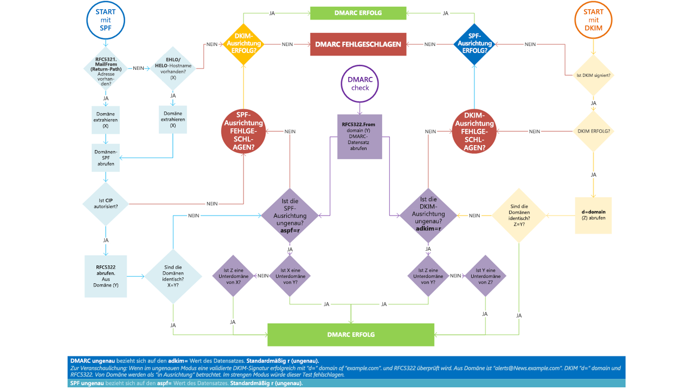

# <a name="use-dmarc-to-validate-email"></a>Verwenden von DMARC zum Überprüfen von E-Mails

[!INCLUDE [Microsoft 365 Defender rebranding](../includes/microsoft-defender-for-office.md)]


[DMARC](https://dmarc.org) (Domain-based Message Authentication, Reporting, and Conformance) verwendet SPF (Sender Policy Framework) und DKIM (DomainKeys Identified Mail) zum Authentifizieren von E-Mail-Absendern, und um sicherzustellen, dass Ziel-E-Mail-Systeme die von Ihrer Domäne gesendeten E-Mail-Nachrichten als vertrauenswürdig einstufen. Die Implementierung von DMARC zusammen mit SPF und DKIM bietet zusätzlichen Schutz vor Spoofing- und Phishing-E-Mails. DMARC unterstützt die E-Mail-Systeme der Empfänger bei der Behandlung von Nachrichten, die von Ihrer Domäne gesendet wurden, jedoch die SPF- oder DKIM-Prüfungen nicht bestanden haben.

> [!TIP]
> Besuchen Sie den [Microsoft Intelligent Security Association (MISA)](https://www.microsoft.com/misapartnercatalog)-Katalog, um zu sehen, welche Drittanbieter DMARC-Berichterstellung für Microsoft 365 bieten.

## <a name="how-do-spf-and-dmarc-work-together-to-protect-email-in-microsoft-365"></a>Wie arbeiten SPF und DMARC zusammen, um E-Mails in Microsoft 365 zu schützen?

 Eine E-Mail-Nachricht kann mehrere Ersteller- oder Absenderadressen enthalten. Diese Adressen können für verschiedene Zwecke verwendet werden. Sehen Sie sich beispielsweise die folgenden Adressen an:

- Die **„Mail From“-Adresse** identifiziert den Absender und gibt an, wohin Hinweise zurückgesendet werden sollen, wenn Probleme bei der Übermittlung der Nachricht auftreten, z. B. Unzustellbarkeitsberichte. Sie erscheint im Umschlagbereich einer E-Mail-Nachricht und wird von der E-Mail-Anwendung in der Regel nicht angezeigt. Diese Adresse wird manchmal als „5321.MailFrom“- oder „reverse-path“-Adresse bezeichnet.

- **„Von"-Adresse**: die Adresse, die von der E-Mail-Anwendung als Absenderadresse angezeigt wird. Diese Adresse identifiziert den Autor der E-Mail. Das heißt, das Postfach der Person oder des Systems, das sich für das Schreiben der Nachricht verantwortlich zeichnet. Dies wird manchmal auch als 5322.From-Adresse bezeichnet.

SPF verwendet einen DNS-TXT-Eintrag, um eine Liste der autorisierten sendenden IP-Adressen für eine bestimmte Domäne bereitzustellen. In der Regel werden SPF-Prüfungen nur für die „5321.MailFrom"-Adresse durchgeführt. Dies bedeutet, dass die „5322.From"-Adresse nicht authentifiziert wird, wenn Sie nur SPF verwenden. Aufgrund dessen kann es dazu kommen, dass ein Benutzer eine Nachricht erhält, die die SPF-Prüfung besteht, jedoch eine Spoof-5322.From-Absenderadresse aufweist. Betrachten Sie beispielsweise das folgende SMTP-Transkript:

```console
S: Helo woodgrovebank.com
S: Mail from: phish@phishing.contoso.com
S: Rcpt to: astobes@tailspintoys.com
S: data
S: To: "Andrew Stobes" <astobes@tailspintoys.com>
S: From: "Woodgrove Bank Security" <security@woodgrovebank.com>
S: Subject: Woodgrove Bank - Action required
S:
S: Greetings User,
S:
S: We need to verify your banking details.
S: Please click the following link to verify that we have the right information for your account.
S:
S: https://short.url/woodgrovebank/updateaccount/12-121.aspx
S:
S: Thank you,
S: Woodgrove Bank
S: .
```

In diesem Transkript lauten die Absenderadressen wie folgt:

- „E-Mail von“-Adresse (5321.MailFrom): phish@phishing.contoso.com

- „Von“-Adresse (5322.From): security@woodgrovebank.com

Wenn Sie SPF konfiguriert haben, führt der empfangende Server eine Prüfung der Absenderadresse „phish@phishing.contoso.com“ durch. Wenn die Nachricht aus einer gültigen Quelle der Domäne „phishing.contoso.com“ stammt, besteht sie die SPF-Prüfung. Da der E-Mail-Client nur die Absenderadresse anzeigt, sieht der Benutzer, dass diese Nachricht von „security@woodgrovebank.com“ stammt. Wenn nur SPF verwendet wird, wird die Gültigkeit von „woodgrovebank.com“ nicht authentifiziert.

Wenn Sie DMARC verwenden, führt der empfangende Server auch eine Prüfung der Absenderadresse durch. Wenn im obigen Beispiel ein DMARC-TXT-Eintrag für „woodgrovebank.com“ vorhanden ist, besteht die Absenderadresse die Prüfung nicht.

## <a name="what-is-a-dmarc-txt-record"></a>Was ist ein DMARC-TXT-Eintrag?

Wie die DNS-Einträge für SPF ist der Eintrag für DMARC ein DNS-Texteintrag (TXT), der vor Spoofing- und Phishing-E-Mails schützt. Sie veröffentlichen DMARC-TXT-Einträge in DNS. DMARC-TXT-Einträge prüfen den Ursprung von E-Mail-Nachrichten, indem sie die IP-Adresse des Absenders mit dem vorgeblichen Besitzer der Absenderdomäne vergleichen. Durch den DMARC-TXT-Eintrag werden autorisierte Server für ausgehende E-Mails gekennzeichnet. Die Ziel-E-Mail-Systeme können dann überprüfen, ob die empfangenen Nachrichten von autorisierten Servern für ausgehende E-Mails stammen.

Der DMARC-TXT-Eintrag von Microsoft sieht in etwa wie folgt aus:

```console
_dmarc.microsoft.com.   3600    IN      TXT     "v=DMARC1; p=none; pct=100; rua=mailto:d@rua.agari.com; ruf=mailto:d@ruf.agari.com; fo=1"
```

Microsoft sendet seine DMARC-Berichte an [Agari](https://agari.com), einen Drittanbieter. Agari erfasst und analysiert DMARC-Berichte. Besuchen Sie den [MISA-Katalog](https://www.microsoft.com/misapartnercatalog), um zu sehen, welche weiteren Drittanbieter DMARC-Berichterstellung für Microsoft 365 bieten.

## <a name="implement-dmarc-for-inbound-mail"></a>Implementieren von DMARC für eingehende E-Mail-Nachrichten

Sie müssen nichts weiter tun, um DMARC für E-Mails einzurichten, die Sie in Microsoft 365 erhalten. Dies haben wir bereits für Sie erledigt. Wenn Sie mehr darüber erfahren möchten, was mit E-Mail-Nachrichten geschieht, die unsere DMARC-Prüfungen nicht bestehen, finden Sie weitere Informationen unter [So behandelt Microsoft 365 eingehende E-Mail-Nachrichten, die DMARC-Prüfungen nicht bestehen](#how-microsoft-365-handles-inbound-email-that-fails-dmarc).

## <a name="implement-dmarc-for-outbound-mail-from-microsoft-365"></a>Implementieren von DMARC für von Microsoft 365 ausgehende Nachrichten

Wenn Sie Microsoft 365 jedoch keine benutzerdefinierte Domäne verwenden, d. h. wenn Sie die Domäne „onmicrosoft.com" verwenden, müssen Sie keine weiteren Schritte zum Konfigurieren oder Implementieren von DMARC für Ihre Organisation durchführen. SPF ist bereits eingerichtet, und Microsoft 365 generiert automatisch eine DKIM-Signatur für Ihre ausgehenden E-Mails. Weitere Informationen zu dieser Signatur finden Sie unter [Standardverhalten für DKIM und Microsoft 365](use-dkim-to-validate-outbound-email.md#DefaultDKIMbehavior).

 Wenn Sie eine benutzerdefinierte Domäne haben oder zusätzlich zu Microsoft 365 lokale Exchange-Server verwenden, müssen Sie DMARC für Ihre ausgehenden E-Mail-Nachrichten manuell implementieren. Das Implementieren von DMARC für Ihre benutzerdefinierte Domäne umfasst die folgenden Schritte:

- [Schritt 1: Identifizieren gültiger E-Mail-Nachrichtenquellen für Ihre Domäne](#step-1-identify-valid-sources-of-mail-for-your-domain)

- [Schritt 2: Einrichten von SPF für Ihre Domäne](#step-2-set-up-spf-for-your-domain)

- [Schritt 3: Einrichten von DKIM für Ihre benutzerdefinierte Domäne](#step-3-set-up-dkim-for-your-custom-domain)

- [Schritt 4: Erstellen des DMARC-TXT-Eintrags für Ihre Domäne](#step-4-form-the-dmarc-txt-record-for-your-domain)

### <a name="step-1-identify-valid-sources-of-mail-for-your-domain"></a>Schritt 1: Identifizieren gültiger E-Mail-Nachrichtenquellen für Ihre Domäne

Wenn Sie SPF bereits eingerichtet haben, ist dieser Schritt für Sie bereits erledigt. Für DMARC müssen Sie jedoch noch andere Punkte berücksichtigen. Beim Ermitteln von E-Mail-Nachrichtenquellen für Ihre Domäne müssen Sie die folgenden beiden Fragen beantworten:

- Welche IP-Adressen senden Nachrichten aus meiner Domäne?

- Was E-Mail-Nachrichten betrifft, die von Drittanbietern in meinem Auftrag gesendet werden: Stimmen die Domänen für „5321.MailFrom“ und „5322.From“ überein?

### <a name="step-2-set-up-spf-for-your-domain"></a>Schritt 2: Einrichten von SPF für Ihre Domäne

Sie haben nun eine Liste aller gültigen Absender erstellt und können die Schritte unter [Einrichten von SPF zum Verhindern von Spoofing](set-up-spf-in-office-365-to-help-prevent-spoofing.md) befolgen.

Beispiel: Angenommen, „contoso.com" sendet E-Mail-Nachrichten von Exchange Online, einem lokalen Exchange-Server mit der IP-Adresse 192.168.0.1 und einer Webanwendung mit der IP-Adresse 192.168.100.100, dann sieht der SPF-TXT-Eintrag wie folgt aus:

```console
contoso.com  IN  TXT  " v=spf1 ip4:192.168.0.1 ip4:192.168.100.100 include:spf.protection.outlook.com -all"
```

Es ist eine bewährte Methode sicherzustellen, dass Ihr SPF-TXT-Eintrag auch Absenderadressen von Drittanbietern berücksichtigt.

### <a name="step-3-set-up-dkim-for-your-custom-domain"></a>Schritt 3: Einrichten von DKIM für Ihre benutzerdefinierte Domäne

Nachdem Sie SPF eingerichtet haben, müssen Sie DKIM einrichten. Mit DKIM können Sie E-Mail-Nachrichten in der Kopfzeile der Nachricht eine digitale Signatur hinzufügen. Wenn Sie DKIM nicht einrichten und stattdessen Microsoft 365 ermöglichen, die DKIM-Standardkonfiguration für Ihre Domäne zu verwenden, funktioniert DMARC möglicherweise nicht. Dies kommt daher, dass die DKIM-Standardkonfiguration die anfängliche Domäne „onmicrosoft.com" als „5322.From"-Adresse verwendet und nicht Ihre benutzerdefinierte Domäne. Dies erzwingt einen Konflikt zwischen den „5321.MailFrom"- und „5322.From"-Adressen in allen E-Mail-Nachrichten, die über Ihre Domäne gesendet werden.

Wenn Drittanbieter in Ihrem Auftrag E-Mail-Nachrichten senden und die „5321.MailFrom"- und „5322.From"-Adressen einer von diesen Anbietern gesendeten E-Mail-Nachricht nicht übereinstimmen, dann besteht diese E-Mail-Nachricht die DMARC-Prüfung nicht. Um dies zu vermeiden, müssen Sie DKIM für Ihre Domäne speziell mit diesen Drittanbietern als Absendern einrichten. Dadurch kann Microsoft 365 E-Mail-Nachrichten dieses Drittanbieterdiensts authentifizieren. Allerdings können auch andere, wie beispielsweise Yahoo, Google Mail und Comcast, E-Mail-Nachrichten, die von Ihrem Drittanbieter an sie gesendet wurden, als von Ihnen gesendet authentifizieren. Dies ist nützlich, da es Ihren Kunden ermöglicht, eine Vertrauensstellung mit Ihrer Domäne unabhängig davon zu erstellen, wo sich das Postfach befindet. Gleichzeitig markiert Microsoft 365 eine Nachricht aufgrund von Spoofing nicht als Spam, da sie die Authentifizierungsprüfungen für Ihre Domäne besteht.

Anleitungen zum Einrichten von DKIM für Ihre Domäne, einschließlich der Einrichtung von DKIM für Drittanbieter als Absender, die Ihre Domäne verwenden, finden Sie unter [Verwenden von DKIM zum Überprüfen ausgehender E-Mails, die von Ihrer benutzerdefinierten Domäne gesendet werden](use-dkim-to-validate-outbound-email.md).

### <a name="step-4-form-the-dmarc-txt-record-for-your-domain"></a>Schritt 4: Erstellen des DMARC-TXT-Eintrags für Ihre Domäne

Obwohl es auch andere Syntaxoptionen gibt, die hier nicht genannt werden, sind dies die am häufigsten für Microsoft 365 verwendeten. Erstellen Sie den DMARC-TXT-Eintrag für Ihre Domäne im folgenden Format:

```console
_dmarc.domain  TTL  IN  TXT  "v=DMARC1; p=policy; pct=100"
```

Dabei gilt:

- *domain* ist die Domäne, die Sie schützen möchten. Standardmäßig schützt der Eintrag E-Mail-Nachrichten von dieser Domäne und allen Unterdomänen. Beispiel: Wenn Sie \_dmarc.contoso.com angeben, schützt DMARC E-Mail-Nachrichten der Domäne und aller Unterdomänen, wie z. B. „housewares.contoso.com“ oder „plumbing.contoso.com“.

- *TTL* (Gültigkeitsdauer) muss immer einer Stunde entsprechen. Die für „TTL“ verwendete Einheit, entweder Stunden (1 Stunde), Minuten (60 Minuten) oder Sekunden (3600 Sekunden), unterscheidet sich je nach Registrierungsstelle Ihrer Domäne.

- *pct=100* gibt an, dass diese Regel für alle E-Mail-Nachrichten (100 %) verwendet werden soll.

- *policy* gibt an, welche Richtlinien der empfangende Server befolgen soll, wenn die DMARC-Prüfung nicht bestanden wird. Sie können für die Richtlinie „none“ (keine), „quarantine“ (Quarantäne) oder „reject“ (ablehnen) festlegen.

Um mehr darüber zu erfahren, welche Optionen Sie verwenden sollten, machen Sie sich mit den Konzepten unter [Bewährte Methoden zum Implementieren von DMARC in Microsoft 365](#best-practices-for-implementing-dmarc-in-microsoft-365) vertraut.

Beispiele:

- Richtlinie auf „none“ festgelegt

    ```console
    _dmarc.contoso.com 3600 IN  TXT  "v=DMARC1; p=none"
    ```

- Richtlinien auf „quarantine“ festgelegt

    ```console
    _dmarc.contoso.com 3600 IN  TXT  "v=DMARC1; p=quarantine"
    ```

- Richtlinie auf „reject“ festgelegt

    ```console
    _dmarc.contoso.com  3600 IN  TXT  "v=DMARC1; p=reject"
    ```

Nachdem Sie den Eintrag erstellt haben, müssen Sie den Eintrag bei Ihrer Domänenregistrierungsstelle aktualisieren. Anleitungen zum Hinzufügen des DMARC-TXT-Eintrags zu Ihren DNS-Einträgen für Microsoft 365 finden Sie unter [Erstellen von DNS-Einträgen für Microsoft 365, wenn Sie Ihre DNS-Einträge verwalten](https://docs.microsoft.com/microsoft-365/admin/get-help-with-domains/create-dns-records-at-any-dns-hosting-provider).

## <a name="best-practices-for-implementing-dmarc-in-microsoft-365"></a>Bewährte Methoden zum Implementieren von DMARC in Microsoft 365

Sie können DMARC allmählich implementieren, ohne den übrigen E-Mail-Nachrichtenfluss zu beeinträchtigen. Erstellen und implementieren Sie einen Rolloutplan, der den hier beschriebenen Schritten folgt. Führen Sie die einzelnen Schritte zunächst für eine Unterdomäne, dann weitere Unterdomänen und schließlich für die Domäne der obersten Ebene in Ihrer Organisation aus, bevor Sie mit dem nächsten Schritt fortfahren.

1. Überwachen der Auswirkungen, die die Implementierung von DMARC hat

    Beginnen Sie mit einem einfachen Überwachungsmoduseintrag für eine Unterdomäne oder eine Domäne, der erfordert, dass DMARC-Empfänger Ihnen Statistiken zu Nachrichten schicken, die sie bei der Verwendung der Domäne sehen. Ein Überwachungsmoduseintrag ist ein DMARC-TXT-Eintrag, für den als Richtlinie „none" (keine) festgelegt wurde (p=none). Viele Unternehmen veröffentlichen einen DMARC-TXT-Eintrag mit „p=none", da sie sich nicht sicher sind, wie viele E-Mail-Nachrichten möglicherweise verloren gehen, wenn sie eine restriktivere DMARC-Richtlinie anwenden.

    Sie können dies sogar durchführen, bevor Sie in Ihrer Messaginginfrastruktur SPF oder DKIM implementiert haben. Sie können E-Mail-Nachrichten jedoch erst dann effektiv mit DMARC in Quarantäne verschieben oder ablehnen, wenn Sie SPF und DKIM implementiert haben. Bei der Einführung von SPF und DKIM stellen die von DMARC generierten Berichte die Anzahl und Quellen der Nachrichten bereit, die diese Prüfungen bestehen und nicht bestehen. So können Sie problemlos erkennen, wie viel des autorisierten Nachrichtenverkehrs abgedeckt wird, und Sie können auftretende Probleme beheben. Außerdem sehen Sie allmählich, wie viele betrügerische Nachrichten gesendet werden und von wo aus.

2. Anfordern, dass externe E-Mail-Systeme Nachrichten isolieren, die die DMARC-Prüfung nicht bestehen

    Wenn Sie denken, dass der gesamte oder der meiste autorisierte Nachrichtenverkehr durch SPF und DKIM geschützt ist und Ihnen die Auswirkungen der Implementierung von DMARC bewusst sind, können Sie eine Quarantänerichtlinie implementieren. Eine Quarantänerichtlinie ist ein DMARC-TXT-Eintrag, dessen Richtlinie auf „quarantine" festgelegt ist (p=quarantine). Hierdurch fordern Sie DMARC-Empfänger dazu auf, Nachrichten von Ihrer Domäne, die die DMARC-Prüfung nicht bestehen, in die lokale Entsprechung eines Spamordners zu verschieben, anstatt in den Posteingang der Empfänger.

3. Anfordern, dass externe E-Mail-Systeme keine Nachrichten akzeptieren, die die DMARC-Prüfung nicht bestehen

    Der letzte Schritt ist das Implementieren einer Ablehnungsrichtlinie. Eine Ablehnungsrichtlinie ist ein DMARC-TXT-Eintrag, dessen Richtlinie auf „reject" festgelegt ist (p=reject). Wenn Sie dies festlegen, fordern Sie DMARC-Empfänger auf, keine Nachrichten zu akzeptieren, die die DMARC-Prüfungen nicht bestehen.
    
4. Wie richte ich DMARC für Subdomain ein?

DMARC wird durch die Veröffentlichung einer Richtlinie als TXT-Eintrag im DNS implementiert und ist hierarchisch aufgebaut (z. B. gilt eine für contoso.com veröffentlichte Richtlinie für sub.domain.contonos.com, sofern nicht ausdrücklich eine andere Richtlinie für die Subdomain definiert wird). Dies ist nützlich, da Organisationen eine kleinere Anzahl von DMARC-Einträgen auf hoher Ebene für eine breitere Abdeckung angeben können. Achten Sie darauf, explizite DMARC-Einträge für Subdomänen zu konfigurieren, wenn Sie nicht möchten, dass die Subdomänen den DMARC-Eintrag der Top-Level-Domäne erben.

Sie können auch eine Wildcard-Typ-Richtlinie für DMARC hinzufügen, wenn Subdomains keine E-Mails senden sollten, indem Sie den Wert `sp=reject` hinzufügen. Zum Beispiel:

```console
_dmarc.contoso.com. TXT "v=DMARC1; p=reject; sp=reject; ruf=mailto:authfail@contoso.com; rua=mailto:aggrep@contoso.com"
```

## <a name="how-microsoft-365-handles-outbound-email-that-fails-dmarc"></a>So behandelt Microsoft 365 ausgehende E-Mail-Nachrichten, die DMARC-Prüfungen nicht bestehen

Wenn eine Nachricht von Microsoft 365 gesendet wird (ausgehende Nachricht), die DMARC-Prüfung nicht besteht und Sie die Richtlinie „p=quarantine" oder „p=reject“ festgelegt haben, wird die Nachricht über den [Pool für besonders riskante Zustellungen für ausgehende Nachrichten](high-risk-delivery-pool-for-outbound-messages.md) weitergeleitet. Für ausgehende E-Mail-Nachrichten erfolgt keine Außerkraftsetzung.

Wenn Sie eine DMARC-Ablehnungsrichtlinie veröffentlichen (p=reject), kann kein anderer Kunde in Microsoft 365 Ihre Domäne an Ihrer Stelle verwenden, da Nachrichten die SPF- und DKIM-Prüfungen für Ihre Domäne nicht bestehen, wenn eine ausgehende Nachricht über den Dienst weitergeleitet wird. Wenn Sie jedoch eine DMARC-Ablehnungsrichtlinie veröffentlichen und nicht die gesamte E-Mail-Authentifizierung über Microsoft 365 abgewickelt wird, wird ein Teil der eingehenden Nachrichten (wie zuvor beschrieben) als Spam gekennzeichnet, oder Nachrichten werden abgelehnt, wenn Sie SPF nicht veröffentlichen und versuchen, sie über den Dienst als ausgehend weiterzuleiten. Diese geschieht zum Beispiel dann, wenn Sie beim Erstellen des DMARC-TXT-Eintrags vergessen, einige IP-Adressen für Server und Apps einzubeziehen, die E-Mail-Nachrichten im Auftrag Ihrer Domäne senden.

## <a name="how-microsoft-365-handles-inbound-email-that-fails-dmarc"></a>So behandelt Microsoft 365 eingehende E-Mail-Nachrichten, die DMARC-Prüfungen nicht bestehen

Wenn die DMARC-Richtlinie des sendenden Servers `p=reject`ist, markiert [Exchange Online Protection](exchange-online-protection-overview.md) (EOP) die Nachricht als Spoofing, anstatt Sie abzulehnen. Mit anderen Worten, Microsoft 365 behandelt im Hinblick auf eingehende E-Mails `p=reject` und `p=quarantine` auf die gleiche Weise. Administratoren können die Aktion definieren, die auf Nachrichten, die in der [Anti-Phishing-Richtlinie](set-up-anti-phishing-policies.md) als Spoof klassifiziert werden, angewendet werden soll.

Microsoft 365 ist so konfiguriert, da einige autorisierte E-Mail-Nachrichten die DMARC-Prüfung möglicherweise nicht bestehen. Eine Nachricht besteht die DMARC-Prüfung zum Beispiel möglicherweise nicht, wenn sie an eine Mailingliste gesendet wird, die die Nachricht an alle Teilnehmer auf der Liste weiterleitet. Wenn Microsoft 365 diese Nachrichten ablehnen würde, könnten autorisierte E-Mail-Nachrichten für Benutzer verloren gehen, ohne dass die Benutzer sie auf andere Weise abrufen können. Diese Nachrichten bestehen die DMARC-Prüfung daher weiterhin nicht, werden jedoch als Spam gekennzeichnet und nicht abgelehnt. Falls gewünscht, können Benutzer diese Nachrichten immer noch anhand einer der folgenden Methoden in ihrem Posteingang erhalten:

- Die Benutzer fügen mithilfe des E-Mail-Clients sichere Absender einzeln hinzu.

- Administratoren können die [Spoofing Intelligence](learn-about-spoof-intelligence.md)-Berichterstellung so aktualisieren, dass Spoofing zulässig ist.

- Administratoren erstellen eine Exchange-E-Mail-Flussregel (auch bekannt als Transportregel) für alle Benutzer, die Nachrichten dieser bestimmten Absender zulassen.

Weitere Informationen finden Sie unter [Erstellen von Listen sicherer Absender](create-safe-sender-lists-in-office-365.md).

## <a name="how-microsoft-365-utilizes-authenticated-received-chain-arc"></a>So verwendet Microsoft 365 ARC (Authenticated Received Chain)

Alle gehosteten Postfächer in Microsoft 365 profitieren nun von ARC mit besserer Zustellbarkeit von Nachrichten und verbessertem Antispoofingschutz. ARC bewahrt die Ergebnisse der E-Mail-Authentifizierung aller teilnehmenden Mittler bzw. Hops, wenn eine E-Mail vom ursprünglichen Server an das Empfängerpostfach geleitet wird. Von Mittlern im E-Mail-Routing vorgenommene Änderungen, z. B. Weiterleitungsregeln oder automatische Signaturen, konnten vor der Verwendung von ARC zu DMARC-Fehlern führen, wenn die E-Mail das Empfängerpostfach erreichte. Mit ARC kann Microsoft 365 anhand der kryptografischen Aufbewahrung der Authentifizierungsergebnisse die Authentizität eines E-Mail-Absenders überprüfen.

Microsoft 365 verwendet ARC zurzeit zur Überprüfung der Authentifizierungsergebnissen, wenn Microsoft der ARC-Sealer ist, aber Sie sollten künftig Unterstützung für ARC-Sealer von Drittanbietern vorsehen.

## <a name="troubleshooting-your-dmarc-implementation"></a>Problembehandlung bei der DMARC-Implementierung

Wenn Sie die MX-Einträge Ihrer Domäne so konfiguriert haben, dass EOP nicht der erste Eintrag ist, werden für Ihre Domäne keine DMARC-Fehler erzwungen.

Wenn Sie Kunde sind und der primäre MX-Eintrag Ihrer Domäne nicht auf EOP verweist, können Sie die Vorteile von DMARC nicht nutzen. DMARC funktioniert beispielsweise nicht, wenn Sie den MX-Eintrag auf Ihren lokalen E-Mail-Server verweisen und anschließend E-Mail-Nachrichten mithilfe eines Connectors an EOP weiterleiten. In diesem Szenario ist die Empfängerdomäne eine der akzeptierten Domänen, EOP ist jedoch nicht der primäre MX-Eintrag. Nehmen Sie zum Beispiel einmal an, dass „contoso.com“ seinen MX auf sich selbst verweist und EOP als sekundären MX-Eintrag verwendet. Der MX-Eintrag von „contoso.com“ sieht dann wie folgt aus:

```console
contoso.com     3600   IN  MX  0  mail.contoso.com
contoso.com     3600   IN  MX  10 contoso-com.mail.protection.outlook.com
```

Alle bzw. die meisten E-Mail-Nachrichten werden zuerst an „mail.contoso.com“ weitergeleitet, da dies der primäre MX-Eintrag ist. Anschließend werden die E-Mail-Nachrichten an EOP weitergeleitet. In einigen Fällen führen Sie EOP möglicherweise gar nicht als MX-Eintrag auf, sondern verbinden einfach Connectors zum Weiterleiten von E-Mail-Nachrichten. EOP muss nicht der erste Eintrag sein, damit die DMARC-Validierung durchgeführt werden kann. Es stellt lediglich die Validierung sicher, da wir nicht sicher sein können, dass alle lokalen bzw. Nicht-O365-Server alle DMARC-Prüfungen durchführen.  DMARC kann beim Einrichten des DMARC-TXT-Eintrags für die Domäne eines Kunden (nicht den Server) erzwungen werden, aber der empfangende Server muss die Erzwingung tatsächlich ausführen.  Wenn Sie EOP als Empfangsserver einrichten, führt EOP die DMARC-Erzwingung durch.



## <a name="for-more-information"></a>Weitere Informationen

Sie möchten mehr über DMARC erfahren? Die folgenden Ressourcen können nützlich sein.

- [Antispam-Nachrichtenkopfzeilen](anti-spam-message-headers.md) umfassen die Syntax- und Kopfzeilenfelder, die von Microsoft 365 für DMARC-Überprüfungen verwendet werden.

- Sehen Sie sich die [DMARC Training Series](https://www.m3aawg.org/activities/training/dmarc-training-series) von M <sup>3</sup>AAWG (Messaging, Malware, Mobile Anti-Abuse Working Group) an.

- Verwenden Sie die Checkliste von [dmarcian](https://space.dmarcian.com/deployment/).

- Schauen Sie direkt an der Quelle nach: [DMARC.org](https://dmarc.org).

## <a name="see-also"></a>Siehe auch

[Verwenden des Sender Policy Framework (SPF) durch Microsoft 365 zum Verhindern von Spoofing](how-office-365-uses-spf-to-prevent-spoofing.md)

[Einrichten von SPF in Microsoft 365 zur Verhinderung von Spoofing](set-up-spf-in-office-365-to-help-prevent-spoofing.md)

[Verwenden von DKIM zum Überprüfen ausgehender E-Mails, die von Ihrer benutzerdefinierten Domäne in Microsoft 365 gesendet werden](use-dkim-to-validate-outbound-email.md)
