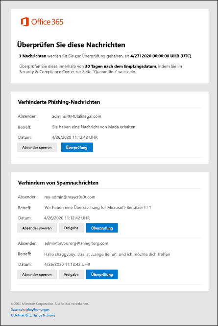

# Verwenden von Spambenachrichtigungen für Benutzer zum Freigeben und melden von Nachrichten in QuarantäneUse user spam notifications to release and report quarantined messages

In Microsoft 365-Organisationen mit Postfächern in Exchange Online oder in eigenständigen Exchange Online Protection (EOP)-Organisationen ohne Exchange Online-Postfächer, enthält die Quarantäne potenziell gefährliche oder unerwünschte Nachrichten.In Microsoft 365 organizations with mailboxes in Exchange Online or standalone Exchange Online Protection (EOP) organizations without Exchange Online mailboxes, quarantine holds potentially dangerous or unwanted messages. Weitere Informationen finden Sie unter [Quarantined Messages in EoP](quarantine-email-messages.md).For more information, see [Quarantined messages in EOP](quarantine-email-messages.md).

Standardmäßig sind Spambenachrichtigungen für Endbenutzer in Anti-Spam-Richtlinien deaktiviert.By default, end-user spam notifications are disabled in anti-spam policies. Wenn ein Administrator [Spambenachrichtigungen für Endbenutzer aktiviert](configure-your-spam-filter-policies.md#configure-end-user-spam-notifications), erhalten die Empfänger (einschließlich freigegebener Postfächer mit aktivierter Automapping) regelmäßig Benachrichtigungen über Ihre Nachrichten, die als Spam, Massen-e-Mails oder (ab April 2020) als Phishing-Nachricht isoliert wurden.When an admin [enables end-user spam notifications](configure-your-spam-filter-policies.md#configure-end-user-spam-notifications), recipients (including shared mailboxes with automapping enabled) will receive periodic notifications about their messages that were quarantined as spam, bulk email, or (as of April 2020) phishing.

> [!NOTE]
> Nachrichten, die als vertrauenswürdiges Phishing, Schadsoftware oder Nachrichtenfluss Regeln (auch bekannt als Transportregeln) unter Quarantäne gestellt wurden, stehen nur Administratoren zur Verfügung.Messages that were quarantined as high confidence phishing, malware, or by mail flow rules (also known as transport rules) are only available to admins. Weitere Informationen finden Sie unter [Verwalten von isolierten Nachrichten und Dateien als Administrator in EOP](manage-quarantined-messages-and-files.md).For more information, see [Manage quarantined messages and files as an admin in EOP](manage-quarantined-messages-and-files.md).

Eine spambenachrichtigung für Endbenutzer enthält für jede isolierte Nachricht die folgenden Informationen:An end-user spam notification contains the following information for each quarantined message:

- **Sender**: der Absender Name und die e-Mail-Adresse der isolierten Nachricht.**Sender**: The send name and email address of the quarantined message.

- **Betreff**: der Text der Betreffzeile der isolierten Nachricht.**Subject**: The subject line text of the quarantined message.

- **Date**: das Datum und die Uhrzeit (in UTC), in denen die Nachricht isoliert wurde.**Date**: The date and time (in UTC) that the message was quarantined.

- **Absender blockieren**: Klicken Sie auf diesen Link, um den Absender der Liste blockierter Absender hinzuzufügen.**Block Sender**: Click this link to add the sender to your Blocked Senders list. Weitere Informationen finden Sie unter [Blockieren eines e-Mail-Absenders](https://support.microsoft.com/office/b29fd867-cac9-40d8-aed1-659e06a706e4).For more information, see [Block a mail sender](https://support.microsoft.com/office/b29fd867-cac9-40d8-aed1-659e06a706e4).

- **Release**: für Spamnachrichten (nicht für Phishing) können Sie die Nachricht hier freigeben, ohne das Sicherheits & Compliance Center zu isolieren.**Release**: For spam (not phish) messages, you can release the message here without going to Quarantine the Security & Compliance Center.

- **Überprüfung**: Klicken Sie auf diesen Link, um im Security & Compliance Center auf Quarantäne zu wechseln, wo Sie Ihre isolierten Nachrichten freigeben, löschen oder melden können.**Review**: Click this link to go to Quarantine in the Security & Compliance Center, where you can release, delete or report your quarantined messages. Weitere Informationen finden Sie unter [Suchen und Freigeben von Nachrichten in Quarantäne als Benutzer in EoP](find-and-release-quarantined-messages-as-a-user.md).For more information, see [Find and release quarantined messages as a user in EOP](find-and-release-quarantined-messages-as-a-user.md).

