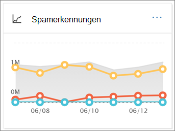
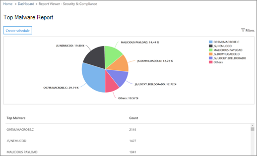

# Anzeigen von E-Mail-Sicherheitsberichten im Security & Compliance CenterView email security reports in the Security & Compliance Center

Im [Security & Compliance Center](https://protection.office.com) stehen eine Vielzahl von Berichten zur Verfügung, um zu sehen, wie e-Mail-Sicherheitsfunktionen wie Antispam-, Antischadsoftware-und Verschlüsselungsfeatures in Microsoft 365 Ihre Organisation schützen.A variety of reports are available in the [Security & Compliance Center](https://protection.office.com) to help you see how email security features, such as anti-spam, anti-malware, and encryption features in Microsoft 365 are protecting your organization. Wenn Sie über die [erforderlichen Berechtigungen](#what-permissions-are-needed-to-view-these-reports)verfügen, können Sie diese Berichte im Security & Compliance Center anzeigen, indem Sie **Reports** zum \> **Dashboard**Berichte wechseln.If you have the [necessary permissions](#what-permissions-are-needed-to-view-these-reports), you can view these reports in the Security & Compliance Center by going to **Reports** \> **Dashboard**. Wenn Sie direkt zum Dashboard Berichte wechseln möchten, öffnen Sie <https://protection.office.com/insightdashboard> .To go directly to the reports dashboard, open <https://protection.office.com/insightdashboard>.

## Bericht über kompromittierte BenutzerCompromised users report

Der Bericht " **kompromittierte Benutzer** " zeigt die Anzahl der Benutzerkonten an, die in den letzten 7 Tagen als **verdächtig** oder **eingeschränkt** gekennzeichnet wurden.The **Compromised users** report shows shows the number of user accounts that were marked as **Suspicious** or **Restricted** within the last 7 days. Konten in einem dieser Zustände sind problematisch oder sogar gefährdet.Accounts in either of these states are problematic or even compromised. Bei häufiger Verwendung können Sie mit dem Bericht Spitzen und sogar Trends in verdächtigen oder eingeschränkten Konten erkennen.With frequent use, you can use the report to spot spikes, and even trends, in suspicious or restricted accounts. Weitere Informationen zu kompromittierten Benutzern finden Sie unter [reagieren auf ein kompromittiertes e-Mail-Konto](responding-to-a-compromised-email-account.md).For more information about compromised users, see [Responding to a compromised email account](responding-to-a-compromised-email-account.md).

In der Ansicht "aggregiert" werden Daten für die letzten 90 Tage angezeigt, und in der Detailansicht werden Daten für die letzten 30 Tage angezeigt.The aggregate view shows data for the last 90 days and the detail view shows data for the last 30 days.

Öffnen Sie zum Anzeigen des Berichts das [Security & Compliance Center](https://protection.office.com), wechseln Sie **Reports** zum \> **Dashboard** Berichte, und wählen Sie **kompromittierte Benutzer**aus.To view the report, open the [Security & Compliance Center](https://protection.office.com), go to **Reports** \> **Dashboard** and select **Compromised users**. Wenn Sie direkt zum Bericht wechseln möchten, öffnen Sie <https://protection.office.com/reportv2?id=CompromisedUsers> .To go directly to the report, open <https://protection.office.com/reportv2?id=CompromisedUsers>.

Sie können die Tabelle Diagramm und Details filtern, indem Sie auf **Filter** klicken und mindestens einen der folgenden Werte auswählen:You can filter both the chart and the details table by clicking **Filters** and selecting one or more of the following values:

- **Start Datum** und **Enddatum****Start date** and **End date**

- **Verdächtig**: das Benutzerkonto hat verdächtige e-Mails gesendet, und es besteht das Risiko, dass das Senden von e-Mails eingeschränkt wird.**Suspicious**: The user account has sent suspicious email and is at risk of being restricted from sending email.

- **Eingeschränkt**: das Benutzerkonto wurde aufgrund strenger verdächtiger Muster vom Senden von e-Mails eingeschränkt.**Restricted**: The user account has been restricted from sending email due to highly suspicious patterns.

Wenn Sie auf **Detailtabelle anzeigen**klicken, werden die folgenden Details angezeigt:If you click **View details table**, you can see the following details:

- **Erstellungszeit****Creation time**
- **Benutzer-ID****User ID**
- **Action****Action**

Klicken Sie auf **Bericht anzeigen**, um zur Berichtsansicht zurückzukehren.To go back to the report view, click **View report**.

## Verschlüsselungs BerichtEncryption report

Der **Verschlüsselungs Bericht** steht in EoP (Abonnements mit Postfächern in Exchange Online oder eigenständigen EoP ohne Exchange Online Postfächer) zur Verfügung.The **Encryption report** is available in EOP (subscriptions with mailboxes in Exchange Online or standalone EOP without Exchange Online mailboxes). Das Sicherheitsteam Ihrer Organisation kann Informationen in diesem Bericht verwenden, um Muster zu identifizieren und Richtlinien für vertrauliche e-Mail-Nachrichten proaktiv anzuwenden oder anzupassen.Your organization's security team can use information in this report to identify patterns and proactively apply or adjust policies for sensitive email messages. Zum Beispiel:For example:

- Wenn eine große Anzahl von von Benutzern verschlüsselten e-Mail-Nachrichten angezeigt wird, möchten Sie möglicherweise eine Verschlüsselungsrichtlinie zum Automatisieren der Verschlüsselung für bestimmte Anwendungsfälle hinzufügen.If you see a high number of email messages encrypted by users, you might want to add an encryption policy to automate encryption for certain use cases. Weitere Informationen finden Sie unter [Definieren von Nachrichtenfluss Regeln zum Verschlüsseln von e-Mail-Nachrichten in Microsoft 365](../../compliance/define-mail-flow-rules-to-encrypt-email.md).For more information, see [Define mail flow rules to encrypt email messages in Microsoft 365](../../compliance/define-mail-flow-rules-to-encrypt-email.md).

- Wenn Sie über eine Reihe von Verschlüsselungs Vorlagen verfügen, die von niemandem verwendet werden, können Sie untersuchen, ob Benutzer eine Funktions Schulung benötigen.If you have a number of encryption templates available but no one is using them, you might explore whether users need feature training.

Die Aggregatansicht ermöglicht das Filtern für die letzten 90 Tage, während die Detailansicht 10 Tage lang gefiltert werden kann.The aggregate view allows filtering for the last 90 days, while the detail view allows filtering for 10 days.

Öffnen Sie zum Anzeigen des Berichts das [Security & Compliance Center](https://protection.office.com), wechseln Sie **Reports** zum \> **Dashboard** Berichte, und wählen Sie **Verschlüsselungs Bericht**aus.To view the report, open the [Security & Compliance Center](https://protection.office.com), go to **Reports** \> **Dashboard** and select **Encryption report**. Wenn Sie direkt zum Bericht wechseln möchten, öffnen Sie <https://protection.office.com/reportv2?id=EncryptionReport> .To go directly to the report, open <https://protection.office.com/reportv2?id=EncryptionReport>.

Weitere Informationen zur Verschlüsselung finden Sie unter [e-Mail-Verschlüsselung in Microsoft 365](../../compliance/email-encryption.md).To learn more about encryption, see [Email encryption in Microsoft 365](../../compliance/email-encryption.md).

### Berichtsansicht für den Verschlüsselungs BerichtReport view for the Encryption report

Sie können die folgenden Filter für das Diagramm verwenden:You can use the following filters on the chart:

- **Anzeigen von Daten nach: Nachrichten Verschlüsselungs Bericht** und **Aufschlüsselung nach: Verschlüsselungsmethode**: die folgenden Verschlüsselungsmethoden sind verfügbar:**View data by: Message Encryption Report** and **Break down by: Encryption method**: The following encryption methods are available:

  - **Verschlüsselung nach Benutzer****Encryption by user**
  - **Verschlüsselung nach Richtlinie****Encryption by policy**

  Wenn Sie auf **Filter**klicken, können Sie das Diagramm mit den folgenden Filtern ändern:If you click **Filters**, you can modify the chart with the following filters:

  - **Start Datum** und **Enddatum****Start date** and **End date**
  - Verschlüsselungsmethode.Encryption method.
  - Verschlüsselungs Vorlage.Encryption template.

- **Anzeigen von Daten nach: Nachrichten Verschlüsselungs Bericht** und **Aufschlüsselung nach: Verschlüsselungs Vorlage**: die folgenden Verschlüsselungsmethoden sind verfügbar:**View data by: Message Encryption Report** and **Break down by: Encryption template**: The following encryption methods are available:

  - **Nicht weiterleiten****Do not forward**
  - **Nur verschlüsseln****Encrypt only**
  - **Vorheriges OM****OME previous**
  - **Custom****Custom**

  Wenn Sie auf **Filter**klicken, können Sie das Diagramm mit den folgenden Filtern ändern:If you click **Filters**, you can modify the chart with the following filters:

  - **Start Datum** und **Enddatum****Start date** and **End date**
  - VerschlüsselungsmethodeEncryption method
  - Verschlüsselungs VorlageEncryption template

- **Daten nach: Top 5 Recipient Domains**: in dieser Ansicht wird ein Kreisdiagramm mit gesendeten Nachrichten Zählern für die Top 5-Empfängerdomänen angezeigt.**View data by: Top 5 recipient domains**: This view shows a pie chart with sent message counts for the top 5 recipient domains.

  Wenn Sie auf **Filter**klicken, können Sie ein **Start** -und **Enddatum**auswählen.If you click **Filters**, you can select a **Start date** and **End date**.

### Detailtabellen Ansicht für den Verschlüsselungs BerichtDetails table view for the Encryption report

Wenn Sie auf **Detailtabelle anzeigen**klicken, hängt die Anzeige der angezeigten Informationen von dem Diagramm ab, das Sie gesucht haben:If you click **View details table**, the information that's shown depends on the chart you were looking at:

- **Aufschlüsseln nach: Verschlüsselungsmethode** oder **Aufschlüsselung durch: Verschlüsselungs Vorlage**: die folgenden Informationen werden angezeigt:**Break down by: Encryption method** or **Break down by: Encryption template**: The following information is shown:

  - **Date****Date**
  - **Absenderadresse****Sender address**
  - **Verschlüsselungs Vorlage****Encryption template**
  - **Verschlüsselungsmethode****Encryption method**
  - **Empfängeradresse****Recipient address**
  - **Betreff****Subject**

- **Anzeigen von Daten nach: Top 5 Recipient Domains**:**View data by: Top 5 recipient domains**:

  - **Date****Date**
  - **Empfängerdomäne****Recipient domain**
  - **Nachrichtenanzahl****Message count**
  
Wenn Sie in einer Detailtabellen Ansicht auf **Filter** klicken, können Sie die Ergebnisse mit den folgenden Filtern ändern:If you click **Filters** in a details table view, you can modify the results with the following filters:

- **Start Datum** und **Enddatum****Start date** and **End date**
- VerschlüsselungsmethodeEncryption method
- Verschlüsselungs VorlageEncryption template

Klicken Sie auf **Bericht anzeigen**, um zur Berichtsansicht zurückzukehren.To go back to the report view, click **View report**.

## Nachrichtenfluss-StatusberichtMailflow status report

Der e-Mail- **Fluss Statusbericht** enthält Informationen zu Schadsoftware, Spam, Phishing und blockierten Edge-Nachrichten.The **Mailflow status report** contains information about malware, spam, phishing and edge blocked messages. Weitere Informationen finden Sie unter [Nachrichtenfluss-Statusbericht](view-mail-flow-reports.md#mailflow-status-report).For more details, see [Mailflow status report](view-mail-flow-reports.md#mailflow-status-report).

## Erkennung von Schadsoftware im e-Mail-BerichtMalware detection in email report

Der Bericht " **Malwareerkennungen in e-Mail** " zeigt Informationen zu Malwareerkennungen in eingehenden und ausgehenden e-Mail-Nachrichten (Schadsoftware, die durch Exchange Online Schutz oder EoP erkannt wurde).The **Malware detections in email** report shows information about malware detections in incoming and outgoing email messages (malware detected by Exchange Online Protection or EOP). Weitere Informationen zum Schutz vor Schadsoftware in EoP finden Sie unter [Anti-Malware Protection in EoP](anti-malware-protection.md).For more information about malware protection in EOP, see [Anti-malware protection in EOP](anti-malware-protection.md).

 Der Filter "Aggregierte Ansicht" ermöglicht 90 Tage, während der Filter "Details" nur 10 Tage zulässt.The aggregate view filter allows for 90 days, while the details table filter only allows for 10 days.

Wenn Sie den Bericht anzeigen möchten, öffnen Sie das [Security & Compliance Center](https://protection.office.com), wechseln Sie zu **Berichte** \> - **Dashboard** , und wählen Sie in e-Mail die Option " **Malware Erkennungen" aus**.To view the report, open the [Security & Compliance Center](https://protection.office.com), go to **Reports** \> **Dashboard** and select **Malware detections in email**. Wenn Sie direkt zum Bericht wechseln möchten, öffnen Sie <https://protection.office.com/reportv2?id=MalwareDetections> .To go directly to the report, open <https://protection.office.com/reportv2?id=MalwareDetections>.

Sie können sowohl das Diagramm als auch die Tabelle Details filtern, indem Sie auf **Filter** klicken und folgende Optionen auswählen:You can filter both the chart and the details table by clicking **Filters** and selecting:

- **Start Datum** und **Enddatum****Start date** and **End date**
- **Eingehende****Inbound**
- **Ausgehende****Outbound**

Wenn Sie auf **Detailtabelle anzeigen**klicken, werden die folgenden Details angezeigt:If you click **View details table**, you can see the following details:

- **Date****Date**
- **Absenderadresse****Sender address**
- **Empfängeradresse****Recipient address**
- **Nachrichten-ID****Message ID**
- **Betreff****Subject**
- **Filename****Filename**
- **Name der Schadsoftware****Malware name**

Klicken Sie auf **Bericht anzeigen**, um zur Berichtsansicht zurückzukehren.To go back to the report view, click **View report**.

## Gesendete und empfangene e-Mail-BerichteSent and received email report

Der Bericht **gesendete und empfangene e-Mails** enthält Informationen zu Schadsoftware, Spam, Nachrichtenfluss Regeln (auch bekannt als Transportregeln) und erweiterte Schadsoftware-Erkennungen, nachdem e-Mail-Dienste in den Dienst eingegangen sind.The **Sent and received email** report contains information about malware, spam, mail flow rules (also known as transport rules), and advanced malware detections after email enters the service. Weitere Informationen finden Sie unter [gesendete und empfangene e-Mail-Berichte](view-mail-flow-reports.md#sent-and-received-email-report).For more information, see [Sent and received email report](view-mail-flow-reports.md#sent-and-received-email-report).

## SpamerkennungsberichtSpam detections report

Der **Spam Erkennungs** Bericht zeigt Spam-e-Mails an, die von EoP blockiert wurden.The **Spam detections** report shows spam email messages that were blocked by EOP. Nachrichten werden einzeln und nicht pro Empfänger gezählt.Messages are counted individually, not per recipient. Wenn beispielsweise die gleiche Spamnachricht an 100 Empfänger in Ihrer Organisation gesendet wurde, zählt sie als eine Nachricht.For example, if the same spam message was sent to 100 recipients in your organization, it counts as one message.

Die aggregierte Ansicht ermöglicht eine Filterung von 90 Tagen, während die Detailtabelle 10 Tage Filterung zulässt.The aggregate view allows for 90 days filtering, while the details table allows for 10 days filtering.

Öffnen Sie zum Anzeigen des Berichts das [Security & Compliance Center](https://protection.office.com), wechseln Sie **Reports** zum \> **Dashboard** Berichte, und wählen Sie **Spam Erkennung**aus.To view the report, open the [Security & Compliance Center](https://protection.office.com), go to **Reports** \> **Dashboard** and select **Spam detections**. Wenn Sie direkt zum Bericht wechseln möchten, öffnen Sie <https://protection.office.com/reportv2?id=SpamDetections> .To go directly to the report, open <https://protection.office.com/reportv2?id=SpamDetections>.

Weitere Informationen zum Antispamschutz finden Sie unter [Anti-Spam Protection in EoP](anti-spam-protection.md).For more information about anti-spam protection, see [Anti-spam protection in EOP](anti-spam-protection.md).

### Berichtsansicht für den Spam Erkennungs BerichtReport view for the Spam detections report

Die folgenden Diagramme stehen in der Berichtsansicht zur Verfügung:The following charts are available in the report view:

- **Aufschlüsseln nach: Action**: die folgenden Ereignistypen werden angezeigt:**Break down by: Action**: The following event types are shown:

  - **Gefilterter Spam Inhalt****Spam content filtered**
  - **Spam-IP-Block****Spam IP block**
  - **Spam Umschlag Block****Spam envelope block**
  - **Spam-Blockierung-Filter**: verzeichnisbasierte Edge-Blockierung (Blockierung)**Spam DBEB filter**: Directory based edge blocking (DBEB)

  Wenn Sie auf einen Tag (Datenpunkt) im Diagramm zeigen, können Sie sehen, wie viele Elemente an diesem Tag blockiert wurden, und wie diese Elemente kategorisiert werden.When you hover over a day (data point) in the chart, you can see how many items were blocked that day, as well as how those items are categorized.

  

- **Aufschlüsseln nach: Direction**: die folgenden Anweisungen werden angezeigt:**Break down by:Direction**: The following directions are shown:

  - **Eingehende****Inbound**
  - **Ausgehende****Outbound**

Wenn Sie in einer Berichtsansicht auf **Filter** klicken, können Sie die Ergebnisse mit den folgenden Filtern ändern:If you click **Filters** in a report view, you can modify the results with the following filters:

- **Start Datum** und **Enddatum****Start date** and **End date**
- RichtungswerteDirection values
- Werte des EreignistypsEvent type values

### Detailtabellen Ansicht für den Spam Erkennungs BerichtDetails table view for the Spam detections report

Wenn Sie in einer Berichtsansicht auf **Detailtabelle anzeigen** klicken, werden die folgenden Informationen angezeigt:If you click **View details table** in any report view, the following information is shown:

- **Date****Date**
- **Absenderadresse****Sender address**
- **Empfängeradresse****Recipient address**
- **Ereignistyp****Event type**
- **Action****Action**
- **Betreff****Subject**

Wenn Sie in einer Detailtabelle auf **Filter** klicken, können Sie die Ergebnisse mit den folgenden Filtern ändern:If you click **Filters** in a details table, you can modify the results with the following filters:

- **Start Datum** und **Enddatum****Start date** and **End date**
- RichtungswerteDirection values
- Werte des EreignistypsEvent type values

Klicken Sie auf **Bericht anzeigen**, um zur Berichtsansicht zurückzukehren.To go back to the report view, click **View report**.

## Spoofing-Erkennungs BerichtSpoof detections report

Der Bericht **Spoof-Erkennungen** zeigt, wie viele gefälschte e-Mail-Nachrichten erkannt wurden und von denen, die als "gut" eingestuft wurden (Spoof-e-Mails wurden aus legitimen geschäftlichen Gründen ausgeführt).The **Spoof detections** report shows how many spoof mail messages were detected, and of those, which ones were considered "good" (spoof mail done for legitimate business reasons). Weitere Informationen zur Spoofing finden Sie unter [Anti-Spoofing Protection in EoP](anti-spoofing-protection.md).For more information about spoofing, see [Anti-spoofing protection in EOP](anti-spoofing-protection.md).

Die aggregierte Ansicht des Berichts ermöglicht eine Filterung von 90 Tagen, während die Detailansicht nur zehn Tage nach der Filterung zulässt.The aggregate view of the report allows for 90 days of filtering, while the detail view only allows for ten days of filtering.

Öffnen Sie zum Anzeigen des Berichts das [Security & Compliance Center](https://protection.office.com), wechseln Sie **Reports** zum \> **Dashboard** Berichte, und wählen Sie **Spoof-Erkennungen**aus.To view the report, open the [Security & Compliance Center](https://protection.office.com), go to **Reports** \> **Dashboard** and select **Spoof detections**. Wenn Sie direkt zum Bericht wechseln möchten, öffnen Sie <https://protection.office.com/reportv2?id=SpoofMailReport> .To go directly to the report, open <https://protection.office.com/reportv2?id=SpoofMailReport>.

Wenn Sie auf einen Tag (Datenpunkt) im Diagramm zeigen, können Sie sehen, wie viele Spoofing-e-Mail-Nachrichten durchlaufen haben.When you hover over a day (data point) in the chart, you can see how many spoof mail messages came through.

Sie können die Tabelle Diagramm und Details filtern, indem Sie auf **Filter** klicken und mindestens einen der folgenden Werte auswählen:You can filter both the chart and the details table by clicking **Filters** and selecting one or more of the following values:

- **Start Datum** und **Enddatum****Start date** and **End date**

- **Gute e-Mail****Good mail**

- **Als Spam erfasst****Caught as spam**

Wenn Sie auf **Detailtabelle anzeigen**klicken, werden die folgenden Details angezeigt:If you click **View details table**, you can see the following details:

- **Date****Date**
- **Gefälschter Absender****Spoofed sender**
- **Echter Absender****True sender**
- **Sender-IP****Sender IP**
- **Action****Action**
- **Nachrichtenanzahl****Message count**

Klicken Sie auf **Bericht anzeigen**, um zur Berichtsansicht zurückzukehren.To go back to the report view, click **View report**.

## Statusbericht über den BedrohungsschutzThreat protection status report

Der **Statusbericht zum Bedrohungsschutz** ist sowohl in EoP als auch in Office 365 ATP verfügbar; die Berichte enthalten jedoch unterschiedliche Daten.The **Threat protection status** report is available in both EOP and Office 365 ATP; however, the reports contain different data. EoP-Kunden können beispielsweise Informationen über in e-Mails erkannte Schadsoftware anzeigen, aber keine Informationen zu [schädlichen Dateien, die in SharePoint Online, OneDrive oder Microsoft Teams erkannt](atp-for-spo-odb-and-teams.md)wurden.For example, EOP customers can view information about malware detected in email, but not information about [malicious files detected in SharePoint Online, OneDrive, or Microsoft Teams](atp-for-spo-odb-and-teams.md). Weitere Informationen zu Office 365 ATP-Berichten finden Sie unter [Anzeigen von Berichten für Office 365 Advanced Threat Protection](view-reports-for-atp.md).For more information about Office 365 ATP reports, see [View reports for Office 365 Advanced Threat Protection](view-reports-for-atp.md).

Hierbei handelt es sich um einen intelligenten Bericht mit bösartigen e-Mails, die erkannt und blockiert wurden, und ermöglicht es Sicherheitsadministratoren, Trends zu identifizieren oder zu bestimmen, ob Organisationsrichtlinien angepasst werden müssen.This is a smart report that shows malicious email that was detected and blocked, and it enables security admins to identify trends or determine whether organization policies need adjustment.

Öffnen Sie zum Anzeigen des Berichts das [Security & Compliance Center](https://protection.office.com), wechseln Sie **Reports** zum \> **Dashboard** Berichte, und wählen Sie **Threat Protection Status**aus.To view the report, open the [Security & Compliance Center](https://protection.office.com), go to **Reports** \> **Dashboard** and select **Threat protection status**. Wenn Sie direkt zum Bericht wechseln möchten, öffnen Sie <https://protection.office.com/reportv2?id=ATPV2AggregateReport> .To go directly to the report, open <https://protection.office.com/reportv2?id=ATPV2AggregateReport>.

Standardmäßig zeigt das Diagrammdaten für die letzten 7 Tage an.By default, the chart shows data for the past 7 days. Wenn Sie auf **Filter**klicken, können Sie einen Datumsbereich von 90 Tag auswählen (Testabonnements sind möglicherweise auf 30 Tage eingeschränkt).If you click **Filters**, you can select a 90 day date range (trial subscriptions might be limited to 30 days). Die Tabellenansicht Details ermöglicht das Filtern für 30 Tage.The details table view allows filtering for 30 days.

### Berichtsansicht für den Statusbericht über den BedrohungsschutzReport view for the Threat protection status report

Die folgenden Ansichten sind verfügbar:The following views are available:

- **Anzeigen von Daten nach: Übersicht**: die folgenden Erkennungsinformationen werden angezeigt:**View data by: Overview**: The following detection information is shown:

  - **E-Mail-Schadsoftware****Email malware**
  - **Phishing per e-Mail****Email phish**
  - **Inhalts-Schadsoftware****Content malware**

- **Anzeigen von Daten nach: Inhalt \> Schadsoftware**: die folgenden Informationen werden angezeigt:**View data by: Content \> Malware**: The following information is shown:

  - **Anti-Malware-Modul****Anti-malware engine**
  - **Datei Explosion****File detonation**

- **Aufschlüsseln nach: Erkennungstechnologie** und **Anzeigen von Daten nach: e-Mail \> Phishing**: die folgenden Informationen werden angezeigt:**Break down by: Detection technology** and **View data by: Email \> Phish**: The following information is shown:

  - **Von ATP generierte URL-Reputation**\***ATP-generated URL reputation**\*
  - **Erweiterter Phish-Filter**\***Advanced phish filter**\*
  - **Fälschungsschutz: DMARC-Fehler****Anti-spoof: DMARC failure**
  - **Anti-Spoofing: Intra-org****Anti-spoof: Intra-org**
  - **Anti-Spoofing: externe Domäne****Anti-spoof: external domain**
  - **Marken Identitätswechsel**\***Brand impersonation**\*
  - **Domänen Identitätswechsel**\***Domain impersonation**\*
  - **EoP-URL-Reputation****EOP URL reputation**
  - **Allgemeiner Phish-Filter****General phish filter**
  - **Sonstige****Others**
  - **Phishing-zap**\*\***Phish ZAP**\*\*
  - **URL-Detonation**\*\***URL detonation**\*\*
  - **Benutzeridentitätswechsel**\***User Impersonation**\*

- **Aufschlüsseln nach: Erkennungstechnologie** und **Anzeigen von Daten nach: e-Mail- \> Schadsoftware**: die folgenden Informationen werden angezeigt:**Break down by: Detection technology** and **View data by: Email \> Malware**: The following information is shown:

  - **Von der ATP generierte dateireputation**\*\***ATP-generated file reputation**\*\*
  - **Anti-Malware-Modul****Anti-malware engine**
  - **Anti-Malware-Richtlinien Dateityp-Block****Anti-malware policy file type block**
  - **Datei Explosion**\*\***File detonation**\*\*
  - **Böswillige dateireputation****Malicious file reputation**
  - \* \* Malware zap \* \* \* \*\*\*\*\*Malware ZAP\*\*\*\*\*\*
  - **Sonstige****Others**

- **Aufschlüsseln nach: Richtlinientyp** und **Anzeigen von Daten nach: e-Mail- \> Phishing** oder **Anzeigen von Daten nach: e-Mail- \> Schadsoftware**: die folgenden Informationen werden angezeigt:**Break down by: Policy type** and **View data by: Email \> Phish** or **View data by: Email \> Malware**: The following information is shown:

  - **Anti-Malware**\*\***Anti-malware**\*\*
  - **Sichere Anlage**\*\***Safe Attachment**\*\*
  - **Anti-Phishing****Anti-phish**
  - **Antispam****Anti-spam**
  - **Nachrichtenfluss Regel** (auch als Transportregel bezeichnet)**Mail flow rule** (also known as a transport rule)
  - **Sonstige****Others**

- **Aufschlüsseln nach: Zustellungsstatus** und **Anzeigen von Daten nach: e-Mail \> Phishing** oder **Daten anzeigen nach: e-Mail- \> Schadsoftware**: die folgenden Informationen werden angezeigt:**Break down by: Delivery status** and **View data by: Email \> Phish** or **View data by: Email \> Malware**: The following information is shown:

  - **Zustellung fehlgeschlagen****Delivery failed**
  - **Gelöscht****Dropped**
  - **Weitergeleitet****Forwarded**
  - **Gehostetes Postfach: benutzerdefinierter Ordner****Hosted mailbox: Custom folder**
  - **Gehostetes Postfach: Gelöschte Elemente****Hosted mailbox: Deleted items**
  - **Gehostetes Postfach: Posteingang****Hosted mailbox: Inbox**
  - **Gehostetes Postfach: Junk****Hosted mailbox: Junk**
  - **Lokaler Server: zugestellt****On-premises server: Delivered**
  - **Quarantäne****Quarantine**

\*Nur Office 365 ATP\* Office 365 ATP only

\*\*Die automatische Bereinigung ohne Stunden (zap) ist in eigenständigen EoP nicht verfügbar (Sie funktioniert nur in Exchange Online Postfächern).\*\*Zero-hour auto purge (ZAP) isn't available in standalone EOP (it only works in Exchange Online mailboxes).

Wenn Sie auf **Filter**klicken, können Sie den Bericht mit den folgenden Filtern ändern:If you click **Filters**, you can modify the report with the following filters:

- **Start Datum** und **Enddatum****Start date** and **End date**
- ErkennungswertDetection value
- **Geschützt durch** (nur Office 365 ATP): **ATP** oder **EoP**.**Protected by** (Office 365 ATP only): **ATP** or **EOP**. Beachten Sie, dass diese filterbare Eigenschaft in **View Data by: Content \> Schadsoftware**nicht verfügbar ist.Note that this filterable property isn't available in **View data by: Content \> Malware**.

### Detailtabellen Ansicht für den Threat Protection-StatusberichtDetails table view for the Threat protection status report

Wenn Sie auf **Detailtabelle anzeigen**klicken, hängt die Anzeige der angezeigten Informationen von dem Diagramm ab, das Sie gesucht haben:If you click **View details table**, the information that's shown depends on the chart you were looking at:

- **Anzeigen von Daten nach: Inhalt \> Schadsoftware**:**View data by: Content \> Malware**:

- **Date****Date**
- **Ort****Location**
- **Regie****Directed by**
- **Name der Schadsoftware****Malware name**

- **Daten anzeigen nach: Übersicht**: keine **Detailtabellen** -Schaltfläche anzeigen verfügbar.**View data by: Overview**: No **View details table** button is available.

- Alle anderen Diagramme:All other charts:

  - **Date****Date**
  - **Betreff****Subject**
  - **Sender****Sender**
  - **Recipients****Recipients**
  - **Regie****Directed by**
  - **Zustellungsstatus****Delivery status**
  - **Kompromiss Quelle****Source of compromise**

Wenn Sie auf **Filter**klicken, können Sie den Bericht mit den folgenden Filtern ändern:If you click **Filters**, you can modify the report with the following filters:

- **Start Datum** und **Enddatum****Start date** and **End date**
- ErkennungswertDetection value
- **Geschützt durch** (nur Office 365 ATP): **ATP** oder **EoP**.**Protected by** (Office 365 ATP only): **ATP** or **EOP**. Beachten Sie, dass diese filterbare Eigenschaft in **View Data by: Content \> Schadsoftware**nicht verfügbar ist.Note that this filterable property isn't available in **View data by: Content \> Malware**.

## Höchst schädlicher BerichtTop malware report

Der **oberste Schadsoftware** -Bericht zeigt die verschiedenen Arten von Schadsoftware, die von [EoP](eop-features.md)erkannt wurde.The **Top Malware** report shows the various kinds of malware that was detected by [EOP](eop-features.md).

Um den Bericht anzuzeigen, öffnen Sie das [Security & Compliance Center](https://protection.office.com), wechseln Sie zu **Berichte** \> - **Dashboard** , und wählen Sie **oben Malware**aus.To view the report, open the [Security & Compliance Center](https://protection.office.com), go to **Reports** \> **Dashboard** and select **Top malware**. Wenn Sie direkt zum Bericht wechseln möchten, öffnen Sie <https://protection.office.com/reportv2?id=TopMalwaret> .To go directly to the report, open <https://protection.office.com/reportv2?id=TopMalwaret>.

Wenn Sie mit dem Mauszeiger auf einen Keil im Kreisdiagramm zeigen, sehen Sie den Namen einer Art von Schadsoftware und wie viele Nachrichten mit dieser Schadsoftware erkannt wurden.When you hover over a wedge in the pie chart, you can see the name of a kind of malware and how many messages were detected as having that malware.

Klicken (oder tippen) Sie auf den Bericht, um ihn in einem neuen Browserfenster zu öffnen, in dem Sie eine detailliertere Ansicht des Berichts erhalten können.Click (or tap) the report to open it in a new browser window, where you can get a more detailed view of the report.

Unter dem Diagramm sehen Sie eine Liste der erkannten Schadsoftware und wie viele Nachrichten mit dieser Schadsoftware erkannt wurden.Below the chart, you'll see a list of detected malware and how many messages were detected as having that malware. Beachten Sie, dass die Aggregatansicht nur eine Filterung von 90 Tagen zulässt.Note that the aggregate view only allows for 90 days filtering.

## URL-Bedrohungsschutz BerichtURL threat protection report

Das Widget für diesen Bericht wird im Dashboard "Berichte" als **URL-Schutzbericht** bezeichnet und ist nur in Office 365 Advanced Threat Protection (ATP) verfügbar.The widget for this report is named **URL protection report** on the reports dashboard, and is only available in Office 365 Advanced Threat Protection (ATP). Insbesondere gilt:Specifically:

- Ein Microsoft 365 E5-Abonnement.A Microsoft 365 E5 subscription.
- Ein Advanced Threat Protection-Add-on (Plan 1 *oder* Plan 2) für jedes andere Abonnement, das Exchange Online Protection (EoP) enthält.An Advanced Threat Protection add-on (Plan 1 *or* Plan 2) to any other subscription that includes Exchange Online Protection (EOP).

Wenn Sie direkt zum **URL Threat Protection** -Bericht wechseln möchten, öffnen Sie <https://protection.office.com/reportv2?id=URLProtectionActionReport> .To go directly to the **URL threat protection** report, open <https://protection.office.com/reportv2?id=URLProtectionActionReport>.

> [!NOTE]
> In diesem Bericht werden keine klickdaten von Benutzern angezeigt, bei denen die Richtlinie für sichere Links angewendet die Option **Benutzerklicks nicht nachverfolgen** aktiviert hat.This report will not have click data from users where the Safe Links policy applied has the **Do not track user clicks** option selected.

### Berichtsansicht für den URL-Bedrohungsschutz BerichtReport view for the URL threat protection report

Der **URL Threat Protection** -Bericht enthält zwei aggregierte Ansichten, die einmal alle vier Stunden aktualisiert werden, sodass Daten für die letzten 90 Tage angezeigt werden:The **URL threat protection** report has two aggregated views that are refreshed once every four hours that shows data for the last 90 days:

- **Aktion zum Schutz vor URLs**: zeigt die Anzahl der URL-Klicks von Benutzern in der Organisation und die Ergebnisse des Klick Vorgangs an:**URL click protection action**: Shows the number of URL clicks by users in the organization and the results of the click:

  - **Gesperrt****Blocked**
  - **Blockiert und durchgeklickt****Blocked and clicked through**
  - **Durch Klicken während der Überprüfung****Clicked through during scan**

  Ein Klick gibt an, dass der Benutzer auf die Seite blockieren zur böswilligen Website geklickt hat (Administratoren können durch Klicken auf Richtlinien für sichere Links deaktivieren).A click indicates that the user has clicked through the block page to the malicious website (admins can disable click through in Safe Links policies).

  Wenn Sie auf **Filter**klicken, können Sie den Bericht mit den folgenden Filtern ändern:If you click **Filters**, you can modify the report with the following filters:

  - **Start Datum** und **Enddatum****Start date** and **End date**
  - Die verfügbaren Klick Schutzaktionen sowie den Wert, der zum Anzeigen von Informationen für alle URL-Klicks (nicht nur für blockierte Klicks) **zulässig** ist.The available click protection actions, plus  the value **Allowed** to see information for all URL clicks (not just blocked clicks).

- **URL-Klick nach Anwendung**: zeigt die Anzahl der URL-Klicks von Anwendungen an, die Office 365 ATP-sichere Links unterstützen:**URL click by application**: Shows the number of URL clicks by applications that support Office 365 ATP Safe Links:

  - **E-Mail-Client****Email client**
  - **PowerPoint****PowerPoint**
  - **Word****Word**
  - **Excel****Excel**
  - **OneNote****OneNote**
  - **Visio****Visio**
  - **Microsoft Teams****Teams**
  - **Other****Other**

  Wenn Sie auf **Filter**klicken, können Sie den Bericht mit den folgenden Filtern ändern:If you click **Filters**, you can modify the report with the following filters:

  - **Start Datum** und **Enddatum****Start date** and **End date**
  - Die verfügbaren Anwendungen.The available applications.

### Detailtabellen Ansicht für den Threat Protection-BerichtDetails table view for the threat protection report

Wenn Sie auf **Details-Tabelle anzeigen**klicken, bietet der Bericht eine nahezu Echtzeitansicht aller Klicks, die innerhalb der Organisation für die letzten 7 Tage mit den folgenden Details geschehen:If you click **View details table**, the report provides a near-real-time view of all clicks that happen within the organization for the last 7 days with the following details:

- **Klicken Sie auf Zeit****Click time**
- **Benutzer****User**
- **URL****URL**
- **Action****Action**
- **App****App**

Wenn Sie in der Detailtabellen Ansicht auf **Filter** klicken, können Sie nach denselben Kriterien wie in der Berichtsansicht filtern, auch nach **Domänen** oder **Empfängern** , die durch Kommas getrennt sind.If you click **Filters** in the details table view, you can filter by the same criteria as in the report view, and also by **Domains** or **Recipients** separated by commas.

Klicken Sie auf **Bericht anzeigen**, um wieder zur Berichtsansicht zu gelangen.To get back to the reports view, click **View report**.

## Bericht über vom Benutzer gemeldete NachrichtenUser-reported messages report

Der Bericht "vom **Benutzer gemeldete Nachrichten** " zeigt Informationen über e-Mail-Nachrichten an, die von Benutzern mithilfe des [Berichtsnachrichten-Add-ins](https://docs.microsoft.com/microsoft-365/security/office-365-security/enable-the-report-message-add-in)als Junk-oder Phishing-Versuche oder als gute e-Mail gemeldet wurden.The **User-reported messages** report shows information about email messages that users have reported as junk, phishing attempts, or good mail by using the [Report Message add-in](https://docs.microsoft.com/microsoft-365/security/office-365-security/enable-the-report-message-add-in).

Für jede Nachricht stehen Details zur Verfügung, einschließlich des Zustellungs Grundes, einer solchen Spam Richtlinienausnahme oder Nachrichtenfluss Regel, die für Ihre Organisation konfiguriert ist.Details are available for each message, including the delivery reason, such a spam policy exception or mail flow rule configured for your organization. Um Details anzuzeigen, wählen Sie ein Element in der Liste Benutzer Berichte aus, und zeigen Sie dann die Informationen auf den Registerkarten **Zusammenfassung** und **Details** an.To view details, select an item in the user-reports list, and then view the information on the **Summary** and **Details** tabs.

Führen Sie einen der folgenden Schritte aus, um diesen Bericht im [Security & Compliance Center](https://protection.office.com)anzuzeigen:To view this report, in the [Security & Compliance Center](https://protection.office.com), do one of the following:

- Wechseln Sie zu **Threat Management** \> **Dashboard** von \> **Benutzern gemeldete Nachrichten**.Go to **Threat management** \> **Dashboard** \> **User-reported messages**.

- Wechseln Sie zu **Threat Management** \> **überprüfen** von \> **Benutzern gemeldeten Nachrichten**.Go to **Threat management** \> **Review** \> **User-reported messages**.

> [!IMPORTANT]
> Damit der Bericht über vom Benutzer gemeldete Nachrichten ordnungsgemäß funktioniert, **muss die Überwachungsprotokollierung** für Ihre Office 365 Umgebung aktiviert sein.In order for the User-reported messages report to work correctly, **audit logging must be turned on** for your Office 365 environment. Dies erfolgt in der Regel durch eine Person, der die Rolle "Überwachungsprotokolle" in Exchange Online zugewiesen ist.This is typically done by someone who has the Audit Logs role assigned in Exchange Online. Weitere Informationen finden Sie unter [Aktivieren oder Deaktivieren der Microsoft 365-Überwachungsprotokoll Suche](https://docs.microsoft.com/microsoft-365/compliance/turn-audit-log-search-on-or-off).For more information, see [Turn Microsoft 365 audit log search on or off](https://docs.microsoft.com/microsoft-365/compliance/turn-audit-log-search-on-or-off).

## Welche Berechtigungen sind zum Anzeigen dieser Berichte erforderlich?What permissions are needed to view these reports?

Zum Anzeigen und Verwenden der Berichte müssen Sie Mitglied der angegebenen Rollengruppe im Security & Compliance Center **und** in Exchange Online sein.To view and use the reports, you need to be a member of the specified role group in the Security & Compliance Center **and** in Exchange Online.

- Im Security & Compliance Center müssen Sie Mitglied einer der folgenden Rollengruppen sein:In the Security & Compliance Center, you need to be a member of one of the following role groups:

  -Organisationsverwaltung-Sicherheits Administrator (Dies können Sie auch im [Azure Active Directory Admin Center](https://aad.portal.azure.com) – Sicherheits Leser-Organization Management -Security Administrator (you can also do this in the [Azure Active Directory admin center](https://aad.portal.azure.com) -Security Reader

  Weitere Informationen finden Sie unter [Berechtigungen im Security & Compliance Center](https://docs.microsoft.com/microsoft-365/security/office-365-security/permissions-in-the-security-and-compliance-center).For more information, see [Permissions in the Security & Compliance Center](https://docs.microsoft.com/microsoft-365/security/office-365-security/permissions-in-the-security-and-compliance-center).

- In Exchange Online müssen Sie Mitglied einer der folgenden Rollengruppen sein:In Exchange Online, you need to be a member of one of the following role groups:

  -Organisationsverwaltung-nur Ansichts Organisationsverwaltung-nur Empfänger – Compliance-Management-Organization Management -View-only Organization Management -View-Only Recipients -Compliance Management

Weitere Informationen finden Sie unter [Berechtigungen in Exchange Online](https://docs.microsoft.com/Exchange/permissions-exo/permissions-exo) und [Verwalten von Rollengruppen in Exchange Online](https://docs.microsoft.com/Exchange/permissions-exo/role-groups).For more information, see [Permissions in Exchange Online](https://docs.microsoft.com/Exchange/permissions-exo/permissions-exo) and [Manage role groups in Exchange Online](https://docs.microsoft.com/Exchange/permissions-exo/role-groups).

## Was geschieht, wenn die Berichte keine Daten anzeigen?What if the reports aren't showing data?

Wenn Sie keine Daten in ihren Berichten sehen, überprüfen Sie, ob Ihre Richtlinien ordnungsgemäß eingerichtet sind.If you are not seeing data in your reports, double-check that your policies are set up correctly. Weitere Informationen finden Sie unter [Protect Against Threats](protect-against-threats.md).To learn more, see [Protect against threats](protect-against-threats.md).

## Verwandte ThemenRelated topics

[Anti-Spam-und Antischadsoftware-Schutz in EoPAnti-spam and anti-malware protection in EOP](anti-spam-and-anti-malware-protection.md)

[Intelligente Berichte und Einblicke im Security & Compliance CenterSmart reports and insights in the Security & Compliance Center](reports-and-insights-in-security-and-compliance.md)
