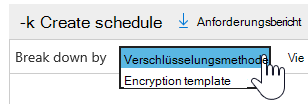
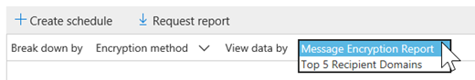
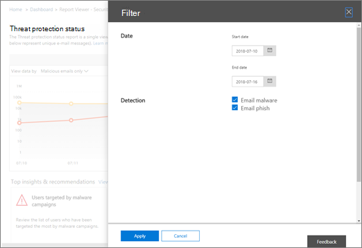
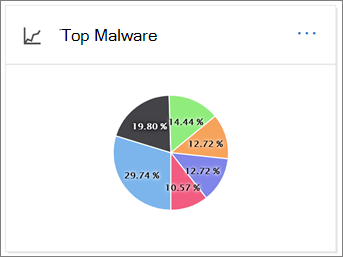
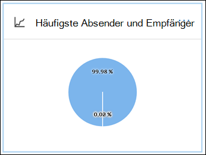
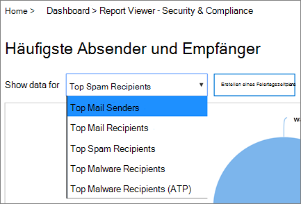
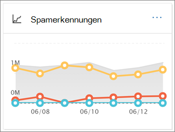
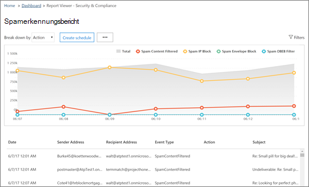
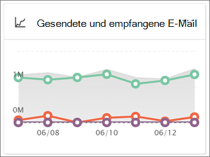
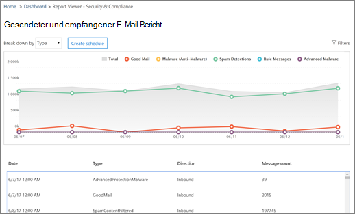

# Anzeigen von E-Mail-Sicherheitsberichten im Security & Compliance CenterView email security reports in the Security & Compliance Center

Im [Security & Compliance Center](https://protection.office.com) stehen eine Vielzahl von Berichten zur Verfügung, um zu sehen, wie e-Mail-Sicherheitsfunktionen wie Antispam-, Antischadsoftware-und Verschlüsselungsfeatures in Microsoft 365 Ihre Organisation schützen.A variety of reports are available in the [Security & Compliance Center](https://protection.office.com) to help you see how email security features, such as anti-spam, anti-malware, and encryption features in Microsoft 365 are protecting your organization. Wenn Sie über die [erforderlichen Berechtigungen](#what-permissions-are-needed-to-view-these-reports)verfügen, können Sie diese Berichte im Security & Compliance Center anzeigen, indem Sie **Reports** zum \> **Dashboard**Berichte wechseln.If you have the [necessary permissions](#what-permissions-are-needed-to-view-these-reports), you can view these reports in the Security & Compliance Center by going to **Reports** \> **Dashboard**.

Ihre e-Mail-Sicherheitsberichte umfassen Folgendes:Your email security reports include the following:

- [URL Threat Protection-Bericht](#url-threat-protection-report-new) (**neu!**)[URL Threat Protection report](#url-threat-protection-report-new) (**NEW!**)
- [Bericht über kompromittierte BenutzerCompromised Users report](#compromised-users-report)
- [Verschlüsselungs BerichtEncryption report](#encryption-report)
- [Threat Protection-StatusberichtThreat Protection Status report](#threat-protection-status-report)
- [Bericht über Schadsoftware-ErkennungenMalware Detections report](#malware-detections-report)
- [Höchst schädlicher BerichtTop Malware report](#top-malware-report)
- [Bericht über die häufigsten Absender und EmpfängerTop Senders and Recipients report](#top-senders-and-recipients-report)
- [Spoofing-Erkennungs BerichtSpoof Detections report](#spoof-detections-report)
- [Spam Erkennungs BerichtSpam Detections report](#spam-detections-report)
- [Gesendete und empfangene e-Mail-BerichteSent and received email report](#sent-and-received-email-report)
- [Bericht über vom Benutzer gemeldete NachrichtenUser-reported messages report](#user-reported-messages-report)

## URL Threat Protection-Bericht (**neu!**)URL Threat Protection report (**NEW!**)

Der Bericht über den URL-Bedrohungsschutz steht für alle Benutzer zur Verfügung:The URL Threat Protection report is available to anyone with:

- Add-on für Exchange Online Protection *und* Advanced Threat Protection (Plan 1 *oder* Plan 2)An Exchange Online Protection, *and* Advanced Threat Protection add-on (Plan 1 *or* Plan 2)
- Ein Microsoft 365 E5-AbonnementA Microsoft 365 E5 subscription

Hierbei handelt es sich um einen "Click-centric"-Bericht mit zwei aggregierten Ansichten.This is a 'click-centric' report that has two aggregated views.

1. Die erste Ansicht ist eine *URL-Klick Schutz Aktion*, die darauf ausgerichtet ist, die Anzahl der URL-Klicks von Benutzern innerhalb des Mandanten und das Ergebnis des Klick Vorgangs anzuzeigen.The first view is by *URL click-protection action*, which is focused on showing the number of URL clicks by users within the tenant, and the result of the click. Ein Klick hier gibt an, dass der Benutzer auf die Seite blockieren zur böswilligen Website geklickt hat (Dies kann vom Administrator in einer Richtlinie für sichere Links deaktiviert werden).A click here indicates that the user has clicked through the block page to the malicious website (this can be disabled by the administrator within a Safe Links policy).

2. Die zweite Ansicht ist *URL-Klick von Anwendungen*, die die Anzahl von URLs anzeigt klicken Sie in verschiedenen Anwendungen, die sichere Links heute unterstützen, beispielsweise in einem e-Mail-Client oder in Microsoft Word.The second view is *URL click by applications*, which shows the number of URLs click in different applications that support Safe Links today, such as in an email client or in Microsoft Word. Daten in beiden aggregierten Ansichten werden alle vier Stunden aktualisiert.Data in both aggregated views are refreshed once every 4 hours.

Die Tabelle "Details" des URL Threat Protection-Berichts bietet eine nahezu Echtzeitansicht aller Klicks, die innerhalb des Mandanten stattfinden, und enthält Ermittlungsinformationen wie *Benutzername*, *URL*, die *Netzwerknachrichten-ID* (wenn die URL aus einer e-Mail geklickt wurde) und andere wertvolle Informationen, die für Untersuchungen und Analysen nützlich sind.The details table of the URL Threat Protection report provides a near-real-time view of all clicks that happen within the tenant, and it includes investigative information such as *username*, *URL*, the *network message ID* (if the URL was clicked from an email), and other valuable pieces of information useful for investigations and analyses.

Standardmäßig zeigt der Bericht nur die Daten von Klicks von URLs an, die durch sichere Links blockiert wurden, aber es ist auch möglich, Informationen für alle URL-Klicks anzuzeigen, indem Sie in den Filtern die Option *zugelassene URLs* markieren aktivieren.By default, the report only shows data on clicks from URLs that were blocked by Safe Links, but it is also possible to see information for all URL clicks through selecting *Allowed URLs* checkbox in the filters.

Dieser Bericht enthält keine Daten von Klicks von Benutzern, bei denen die Richtlinie für sichere Links angewendet wird, wenn die Option *Benutzerklicks nicht nachverfolgen* aktiviert ist.This report will not have data of clicks from users where the Safe Links policy applied has the *Do not track user clicks* option selected.

## Bericht über kompromittierte BenutzerCompromised Users report

Dieser Bericht, der für alle Personen mit Exchange Online Schutz verfügbar ist, zeigt die Anzahl der Benutzerkonten, die als verdächtige oder eingeschränkte Benutzer gekennzeichnet sind, Daten, die besonders nützlich sind, wenn Konten in einen der Zustände eingeben, die darauf hindeuten, dass das Benutzerkonto problematisch sein kann oder sogar gefährdet ist.This report, available to anyone with Exchange Online Protection, shows the number of user accounts marked as Suspicious or Restricted users, data particularly useful as accounts enter either of the states that indicate the user account may be problematic, or even compromised. Bei häufiger Verwendung kann der kompromittierte Benutzerbericht Spitzen und sogar Trends in Konten erkennen, die in verdächtigen oder eingeschränkten Zuständen markiert sind, was Hinweise gibt, dass ein Problem mit Sicherheit und dem Wohlbefinden Ihres Mandanten auftreten kann.With frequent use, the Compromised User report can spot spikes, and even trends, in accounts marked in suspicious or restricted states, giving evidence there could be an issue with security and the wellness of your tenant.

## Verschlüsselungs BerichtEncryption report

Im **Verschlüsselungs Bericht** werden Informationen über e-Mail-Nachrichten angezeigt, die entweder über die Richtlinien Ihrer Organisation oder durch Endbenutzer Steuerelemente verschlüsselt wurden.The **Encryption report** shows information about email messages that were encrypted, either through your organization's policies, or through end-user controls. Das Sicherheitsteam Ihrer Organisation kann Informationen in diesem Bericht verwenden, um Muster zu identifizieren und Richtlinien für vertrauliche e-Mail-Nachrichten proaktiv anzuwenden oder anzupassen.Your organization's security team can use information in this report to identify patterns and proactively apply or adjust policies for sensitive email messages.

Um diesen Bericht anzuzeigen, wechseln Sie im Security & Compliance Center zu **Berichte** - \> **Dashboard** - \> **Verschlüsselungs Bericht**.To view this report, in the Security & Compliance Center, go to **Reports** \> **Dashboard** \> **Encryption report**.

Wenn der Bericht zuerst geöffnet wird, werden Daten zu Verschlüsselungsmethoden angezeigt, die für e-Mail-Nachrichten in den letzten sieben (7) Tagen verwendet wurden.When the report first opens, you'll see data about encryption methods used on email messages for the past seven (7) days. Sie können den Datumsbereich und die Details ändern, die im Bericht angezeigt werden, indem Sie in der oberen rechten Ecke des Bildschirms auf **Filter** klicken.You can change the date range and the details that are displayed in the report by clicking **Filters** in the upper right corner of the screen.

Sie können auch das Menü **aufschlüsseln** nach verwenden, um Daten nach Verschlüsselungs Vorlage (oder Methode) anzuzeigen.You can also use the **Break down by** menu to view data by encryption template (or method).

Mit dem Menü **Daten anzeigen nach** können Sie die Ansicht so ändern, dass die Anzahl der verschlüsselten Nachrichten in den obersten fünf Empfängerdomänen angezeigt wird.And, you can use the **View data by** menu to change the view to see counts of encrypted messages to the top five recipient domains.

Durch die Flexibilität des neuen Verschlüsselungs Berichts können Sie Trends anzeigen und entsprechende Aktionen durchführen.With the flexibility of the new Encryption report, you can view trends and take appropriate actions. Wenn beispielsweise eine hohe Anzahl von von Benutzern verschlüsselten e-Mail-Nachrichten angezeigt wird, möchten Sie möglicherweise eine Verschlüsselungsrichtlinie zum Automatisieren der Verschlüsselung für bestimmte Anwendungsfälle hinzufügen.For example, if you see a high number of email messages encrypted by users, you might want to add an encryption policy to automate encryption for certain use cases. (Weitere Informationen dazu finden Sie unter [Definieren von Nachrichtenfluss Regeln zum Verschlüsseln von e-Mail-Nachrichten in Microsoft 365](../../compliance/define-mail-flow-rules-to-encrypt-email.md).) Wenn Sie beispielsweise eine Reihe von Verschlüsselungs Vorlagen verfügbar haben, die von keiner verwendet werden, können Sie untersuchen, ob Benutzer eine Schulung für diese Funktion benötigen.(To get help with that, see [Define mail flow rules to encrypt email messages in Microsoft 365](../../compliance/define-mail-flow-rules-to-encrypt-email.md).) As another example, if you have a number of encryption templates available but no one is using them, you might explore whether users need training for that feature.

Mithilfe dieses Berichts kann das Sicherheits-und Compliance-Team Ihrer Organisation überwachen, wie die Nachrichtenverschlüsselung verwendet wird und ob weitere Aktionen erforderlich sind.Use this report enables your organization's security and compliance team to monitor how message encryption is being used, and whether further actions are needed. Weitere Informationen zur Verschlüsselung finden Sie unter [e-Mail-Verschlüsselung in Microsoft 365](../../compliance/email-encryption.md).To learn more about encryption, see [Email encryption in Microsoft 365](../../compliance/email-encryption.md).

## Threat Protection-StatusberichtThreat Protection Status report

Der **Status Bericht zum Bedrohungsschutz** ist ein intelligenter Bericht, in dem böswillige e-Mails angezeigt werden, die durch Exchange Online Schutz erkannt und blockiert wurden.The **Threat Protection Status** report is a smart report that shows malicious email that was detected and blocked by Exchange Online Protection. Dieser Bericht ist hilfreich, um e-Mails anzuzeigen, die als Schadsoftware oder als Phishing-Versuch im Laufe der Zeit identifiziert wurden (bis zu 90 Tage), und es ermöglicht Sicherheitsadministratoren, Trends zu identifizieren oder zu bestimmen, ob Richtlinien angepasst werden müssen.This report is useful for viewing email identified as malware or a phishing attempt over time (up to 90 days), and it enables security administrators to identify trends or determine whether policies need adjustments.

> [!NOTE]
> Ein Status Bericht über den Bedrohungsschutz steht Kunden zur Verfügung, die entweder [Office 365 ATP](https://docs.microsoft.com/microsoft-365/security/office-365-security/office-365-atp) oder [Exchange Online Protection](exchange-online-protection-overview.md) (EoP) haben; die Informationen, die im Threat Protection-Status Bericht für ATP-Kunden angezeigt werden, enthalten jedoch wahrscheinlich unterschiedliche Daten, als EoP-Kunden möglicherweise sehen.A Threat Protection Status report is available to customers who have either [Office 365 ATP](https://docs.microsoft.com/microsoft-365/security/office-365-security/office-365-atp) or [Exchange Online Protection](exchange-online-protection-overview.md) (EOP); however, the information that is displayed in the Threat Protection Status report for ATP customers will likely contain different data than what EOP customers might see. EoP-Kunden können beispielsweise Informationen über in e-Mails erkannte Schadsoftware anzeigen, aber keine Informationen zu [schädlichen Dateien, die in SharePoint Online, OneDrive oder Microsoft Teams erkannt](https://docs.microsoft.com/microsoft-365/security/office-365-security/atp-for-spo-odb-and-teams)wurden, eine ATP-spezifische Funktion.For example, EOP customers can view information about malware detected in email, but not information about [malicious files detected in SharePoint Online, OneDrive, or Microsoft Teams](https://docs.microsoft.com/microsoft-365/security/office-365-security/atp-for-spo-odb-and-teams), an ATP-specific capability. ([Weitere Informationen zu ATP-Berichten](https://docs.microsoft.com/microsoft-365/security/office-365-security/view-reports-for-atp).)([Learn more about ATP reports](https://docs.microsoft.com/microsoft-365/security/office-365-security/view-reports-for-atp).)

Um diesen Bericht anzuzeigen, wechseln Sie im [Security & Compliance Center](https://protection.office.com)zu **Reports** \> **Dashboard** \> **Threat Protection Status**.To view this report, in the [Security & Compliance Center](https://protection.office.com), go to **Reports** \> **Dashboard** \> **Threat Protection Status**.

Wenn Sie den Threat Protection-Status Bericht zum ersten Mal öffnen, zeigt der Bericht standardmäßig Daten für die letzten sieben Tage an. Sie können jedoch auf **Filter** klicken und den Datumsbereich für bis zu 90 Tage mit Details ändern.When you first open the Threat Protection Status report, the report shows data for the past seven days by default; however, you can click **Filters** and change the date range for up to 90 days of detail. (Wenn Sie ein Testabonnement verwenden, sind die Daten möglicherweise auf 30 Tage eingeschränkt.)(If you are using a trial subscription, you might be limited to 30 days' of data.)

Dieser Bericht ist hilfreich, um die Effektivität und Auswirkungen der [Exchange Online Schutzfunktionen](https://docs.microsoft.com/microsoft-365/security/office-365-security/eop-features)Ihrer Organisation und die längerfristige Trendentwicklung anzuzeigen.This report is useful for viewing the effectiveness and impact of your organization's [Exchange Online Protection features](https://docs.microsoft.com/microsoft-365/security/office-365-security/eop-features), and for longer-term trending.

Sie können auch auswählen, ob Daten für als bösartig identifizierte e-Mails, als Phishing-Versuche identifizierte e-Mails oder als Schadsoftware identifizierte e-Mails angezeigt werden sollen.You can also choose whether to view data for email identified as malicious, email identified as a phishing attempts, or email identified as containing malware.

## Bericht über Schadsoftware-ErkennungenMalware Detections report

Der Bericht über **Malwareerkennungen** zeigt, wie viele eingehende und ausgehende Nachrichten als Schadsoftware für Ihre Organisation erkannt wurden.The **Malware Detections** report shows how many incoming and outgoing messages were detected as containing malware for your organization.

Um diesen Bericht anzuzeigen, wechseln Sie im [Security & Compliance Center](https://protection.office.com)zu **Reports** \> **Dashboard** \> **Malware Detections**.To view this report, in the [Security & Compliance Center](https://protection.office.com), go to **Reports** \> **Dashboard** \> **Malware Detections**.

Ähnlich wie bei anderen Berichten, wie dem [Threat Protection-Status Bericht](#threat-protection-status-report), zeigt der Bericht standardmäßig Daten für die letzten sieben Tage an.Similar to other reports, like the [Threat Protection Status report](#threat-protection-status-report), the report displays data for the past seven days by default. Sie können jedoch **Filter** auswählen, um den Datumsbereich zu ändern.However, you can choose **Filters** to change the date range.

## Höchst schädlicher BerichtTop Malware report

Der **oberste Schadsoftware** -Bericht zeigt die verschiedenen Arten von Schadsoftware, die von [Exchange Online](https://docs.microsoft.com/microsoft-365/security/office-365-security/eop-features)erkannt wurde.The **Top Malware** report shows the various kinds of malware that was detected by [Exchange Online](https://docs.microsoft.com/microsoft-365/security/office-365-security/eop-features).

Um diesen Bericht anzuzeigen, wechseln Sie im [Security & Compliance Center](https://protection.office.com)zu **Reports** \> **Dashboard** \> **Top Malware**.To view this report, in the [Security & Compliance Center](https://protection.office.com), go to **Reports** \> **Dashboard** \> **Top Malware**.

Wenn Sie mit dem Mauszeiger auf einen Keil im Kreisdiagramm zeigen, sehen Sie den Namen einer Art von Schadsoftware und wie viele Nachrichten mit dieser Schadsoftware erkannt wurden.When you hover over a wedge in the pie chart, you can see the name of a kind of malware and how many messages were detected as having that malware.

Klicken (oder tippen) Sie auf den Bericht, um ihn in einem neuen Browserfenster zu öffnen, in dem Sie eine detailliertere Ansicht des Berichts erhalten können.Click (or tap) the report to open it in a new browser window, where you can get a more detailed view of the report.

Unter dem Diagramm sehen Sie eine Liste der erkannten Schadsoftware und wie viele Nachrichten mit dieser Schadsoftware erkannt wurden.Below the chart, you'll see a list of detected malware and how many messages were detected as having that malware.

## Bericht über die häufigsten Absender und EmpfängerTop Senders and Recipients report

Der Bericht " **Top Senders and recipients** " ist ein Kreisdiagramm mit Ihren oberen e-Mail-Absendern.The **Top Senders and Recipients** report is a pie chart showing your top email senders.

Um diesen Bericht anzuzeigen, wechseln Sie im [Security & Compliance Center](https://protection.office.com)zu **Reports** \> **Dashboard** \> **Top Senders and recipients**.To view this report, in the [Security & Compliance Center](https://protection.office.com), go to **Reports** \> **Dashboard** \> **Top Senders and Recipients**.

Wenn Sie mit dem Mauszeiger auf einen Keil im Kreisdiagramm zeigen, wird die Anzahl der gesendeten oder empfangenen Nachrichten angezeigt.When you hover over a wedge in the pie chart, you can see a count of messages sent or received.

Klicken (oder tippen) Sie auf den Bericht, um ihn in einem neuen Browserfenster zu öffnen, in dem Sie eine detailliertere Ansicht des Berichts erhalten können.Click (or tap) the report to open it in a new browser window, where you can get a more detailed view of the report.

Verwenden Sie die Liste **Daten für anzeigen** , um festzustellen, ob Daten für die wichtigsten Absender, Empfänger, Spamempfänger und Schadsoftware-Empfänger angezeigt werden sollen.Use the **Show data for** list to choose whether to view data for top senders, receivers, spam recipients, and malware recipients. Sie können auch sehen, wer die Malware empfangen hat, die von [Exchange Online Protection](exchange-online-protection-overview.md)erkannt wurde.You can also see who received malware that was detected by [Exchange Online Protection](exchange-online-protection-overview.md).

Unter dem Diagramm sehen Sie, wer die häufigsten e-Mail-Absender oder Empfänger waren, zusammen mit der Anzahl der Nachrichten, die für den angegebenen Zeitraum gesendet oder empfangen wurden.Below the chart, you'll see who the top email senders or recipients were, along with a count of messages sent or received for the given time period.

## Spoofing-Erkennungs BerichtSpoof Detections report

Der Bericht **Spoof-Erkennungen** zeigt, wie viele gefälschte e-Mail-Nachrichten erkannt wurden und von denen, die als "gut" eingestuft wurden (Spoof-e-Mails wurden aus legitimen geschäftlichen Gründen ausgeführt).The **Spoof Detections** report shows how many spoof mail messages were detected, and of those, which ones were considered "good" (spoof mail done for legitimate business reasons).

Um diesen Bericht anzuzeigen, wechseln Sie im [Security & Compliance Center](https://protection.office.com)zu **Berichte** \> **Dashboard** \> **-Spoofing-e-Mail-** Benachrichtigungen.To view this report, in the [Security & Compliance Center](https://protection.office.com), go to **Reports** \> **Dashboard** \> **Spoof Mail**.

Wenn Sie den Mauszeiger über einen Tag im Diagramm bewegen, können Sie sehen, wie viele Spoof-e-Mail-Nachrichten eingingen.When you hover over a day in the chart, you can see how many spoof mail messages came through.

Klicken (oder tippen) Sie auf den Bericht, um ihn in einem neuen Browserfenster zu öffnen, in dem Sie eine detailliertere Ansicht des Berichts erhalten können.Click (or tap) the report to open it in a new browser window, where you can get a more detailed view of the report. Weitere Informationen zum Schutz vor Spoofing finden Sie unter [Anti-Spoofing Protection in Microsoft 365](anti-spoofing-protection.md).To learn more about anti-spoof protection, see [Anti-spoofing protection in Microsoft 365](anti-spoofing-protection.md).

## Spam Erkennungs BerichtSpam Detections report

Der **Spam Erkennungs** Bericht zeigt alle von Exchange Online blockierten Spam Inhalte an.The **Spam Detections** report shows all the spam content blocked by Exchange Online. Nachrichten werden pro Nachricht und nicht pro Empfänger gezählt.Messages are counted per message, and not per recipient. Wenn beispielsweise eine e-Mail-Nachricht an 100-Empfänger in Ihrer Organisation gesendet wurde, wird Sie als eine Nachricht gezählt.For example, if an email message was sent to 100 recipients in your organization, it is counted as one message.

Um diesen Bericht anzuzeigen, wechseln Sie im [Security & Compliance Center](https://protection.office.com)zu **Reports** \> **Dashboard** - \> **Spam Erkennungen**.To view this report, in the [Security & Compliance Center](https://protection.office.com), go to **Reports** \> **Dashboard** \> **Spam Detections**.

Wenn Sie den Mauszeiger über einen Tag im Diagramm bewegen, können Sie sehen, wie viele Elemente an diesem Tag blockiert wurden, und wie diese Elemente kategorisiert werden.When you hover over a day in the chart, you can see how many items were blocked that day, as well as how those items are categorized. Beispielsweise können Sie sehen, wie viele Spamnachrichten gefiltert wurden und wie viele Elemente von einer blockierten Internetprotokoll (IP) Adresse stammen.For example, you can see how many spam messages were filtered, and how many items came from a blocked Internet Protocol (IP) address.

Klicken (oder tippen) Sie auf den Bericht, um ihn in einem neuen Browserfenster zu öffnen, in dem Sie eine detailliertere Ansicht des Berichts erhalten können.Click (or tap) the report to open it in a new browser window, where you can get a more detailed view of the report.

Unter dem Diagramm sehen Sie eine Liste mit Spam Elementen, die erkannt wurden.Below the chart, you'll see a list of spam items that were detected. Wählen Sie ein Element aus, um zusätzliche Informationen anzuzeigen, beispielsweise, ob das Spam Element eingehend oder ausgehend war, seine Nachrichten ID und seinen Empfänger.Select an item to view additional information, such as whether the spam item was inbound or outbound, its message ID, and its recipient. Weitere Informationen zum Antispamschutz finden Sie unter [Office 365 Email Anti-Spam Protection](https://docs.microsoft.com/microsoft-365/security/office-365-security/anti-spam-and-anti-malware-protection).To learn more about anti-spam protection, see [Office 365 email anti-spam protection](https://docs.microsoft.com/microsoft-365/security/office-365-security/anti-spam-and-anti-malware-protection).

## Gesendete und empfangene e-Mail-BerichteSent and received email report

Der Bericht **gesendeten und empfangenen e-Mail-Nachrichten** ist ein intelligenter Bericht, in dem Informationen zu eingehenden und ausgehenden e-Mails angezeigt werden, einschließlich Spamerkennungen, Schadsoftware und als "gut" identifizierte e-Mails.The **Sent and received email** report is a smart report that shows information about incoming and outgoing email, including spam detections, malware, and email identified as "good."

Um diesen Bericht anzuzeigen, wechseln Sie im [Security & Compliance Center](https://protection.office.com)zu **Berichte** \> **Dashboard** \> **-Dashboard gesendete und empfangene e-Mails**.To view this report, in the [Security & Compliance Center](https://protection.office.com), go to **Reports** \> **Dashboard** \> **Sent and received email**.

Wenn Sie den Mauszeiger über einen Tag im Diagramm bewegen, können Sie sehen, wie viele Nachrichten eingingen und wie diese Nachrichten kategorisiert werden.When you hover over a day in the chart, you can see how many messages came in, and how those messages are categorized. Beispielsweise können Sie sehen, wie viele Nachrichten erkannt wurden, die Malware enthalten und wie viele als Spam identifiziert wurden.For example, you can see how many messages were detected as containing malware, and how many were identified as spam.

Klicken (oder tippen) Sie auf den Bericht, um ihn in einem neuen Browserfenster zu öffnen, in dem Sie eine detailliertere Ansicht des Berichts erhalten können.Click (or tap) the report to open it in a new browser window, where you can get a more detailed view of the report.

Sie können die **aufschlüsseln** nach Liste verwenden, um Informationen nach Typ oder Richtung anzuzeigen (ein-und ausgehende).You can use the **Break down by** list to view information by type or by direction (incoming and outgoing).

Unter dem Diagramm sehen Sie eine Liste mit e-Mail-Kategorien wie **GoodMail**, **SpamContentFiltered**usw.Below the chart, you'll see a list of email categories, such as **GoodMail**, **SpamContentFiltered**, and so on. Wählen Sie eine Kategorie aus, um zusätzliche Informationen anzuzeigen, wie beispielsweise Aktionen, die für Schadsoftware ergriffen wurden, und ob e-Mails eingehende oder ausgehende e-Mail waren.Select a category to view additional information, such as actions that were taken for malware, and whether email was incoming or outgoing.

Weitere Informationen zu e-Mail-Informationen finden Sie unter [Nachrichtenfluss-Intelligence in Microsoft 365](https://docs.microsoft.com/microsoft-365/security/office-365-security/mail-flow-intelligence-in-office-365).To learn more about email intelligence, see [Mail flow intelligence in Microsoft 365](https://docs.microsoft.com/microsoft-365/security/office-365-security/mail-flow-intelligence-in-office-365).

## Bericht über vom Benutzer gemeldete NachrichtenUser-reported messages report

Der Bericht "vom **Benutzer gemeldete Nachrichten** " zeigt Informationen über e-Mail-Nachrichten an, die von Benutzern mithilfe des [Berichtsnachrichten-Add-ins](https://docs.microsoft.com/microsoft-365/security/office-365-security/enable-the-report-message-add-in)als Junk-oder Phishing-Versuche oder als gute e-Mail gemeldet wurden.The **User-reported messages** report shows information about email messages that users have reported as junk, phishing attempts, or good mail by using the [Report Message add-in](https://docs.microsoft.com/microsoft-365/security/office-365-security/enable-the-report-message-add-in).

Für jede Nachricht stehen Details zur Verfügung, einschließlich des Zustellungs Grundes, einer solchen Spam Richtlinienausnahme oder Nachrichtenfluss Regel, die für Ihre Organisation konfiguriert ist.Details are available for each message, including the delivery reason, such a spam policy exception or mail flow rule configured for your organization. Um Details anzuzeigen, wählen Sie ein Element in der Liste Benutzer Berichte aus, und zeigen Sie dann die Informationen auf den Registerkarten **Zusammenfassung** und **Details** an.To view details, select an item in the user-reports list, and then view the information on the **Summary** and **Details** tabs.

Führen Sie einen der folgenden Schritte aus, um diesen Bericht im [Security & Compliance Center](https://protection.office.com)anzuzeigen:To view this report, in the [Security & Compliance Center](https://protection.office.com), do one of the following:

- Wechseln Sie zu **Threat Management** \> **Dashboard** von \> **Benutzern gemeldete Nachrichten**.Go to **Threat management** \> **Dashboard** \> **User-reported messages**.

- Wechseln Sie zu **Threat Management** \> **überprüfen** von \> **Benutzern gemeldeten Nachrichten**.Go to **Threat management** \> **Review** \> **User-reported messages**.

> [!IMPORTANT]
> Damit der Bericht über vom Benutzer gemeldete Nachrichten ordnungsgemäß funktioniert, **muss die Überwachungsprotokollierung** für Ihre Office 365 Umgebung aktiviert sein.In order for the User-reported messages report to work correctly, **audit logging must be turned on** for your Office 365 environment. Dies erfolgt in der Regel durch eine Person, der die Rolle "Überwachungsprotokolle" in Exchange Online zugewiesen ist.This is typically done by someone who has the Audit Logs role assigned in Exchange Online. Weitere Informationen finden Sie unter [Aktivieren oder Deaktivieren der Microsoft 365-Überwachungsprotokoll Suche](https://docs.microsoft.com/microsoft-365/compliance/turn-audit-log-search-on-or-off).For more information, see [Turn Microsoft 365 audit log search on or off](https://docs.microsoft.com/microsoft-365/compliance/turn-audit-log-search-on-or-off).

## Welche Berechtigungen sind zum Anzeigen dieser Berichte erforderlich?What permissions are needed to view these reports?

Damit Sie die in diesem Artikel beschriebenen Berichte anzeigen und verwenden können, **muss Ihnen eine entsprechende Rolle sowohl für das Security & Compliance Center als auch für das Exchange Admin Center zugewiesen sein**.In order to view and use the reports described in this article, **you must have an appropriate role assigned for both the Security & Compliance Center and the Exchange admin center**.

- Für das Security & Compliance Center muss eine der folgenden Rollen zugewiesen sein:For the Security & Compliance Center, you must have one of the following roles assigned:

  -Organisationsverwaltung-Sicherheits Administrator (Dies kann im Azure Active Directory Admin Center zugewiesen werden ( [https://aad.portal.azure.com](https://aad.portal.azure.com) )-Sicherheits Leser-Organization Management -Security Administrator (this can be assigned in the Azure Active Directory admin center ([https://aad.portal.azure.com](https://aad.portal.azure.com)) -Security Reader

- Für Exchange Online müssen Sie eine der folgenden Rollen entweder in der Exchange-Verwaltungskonsole ( [https://outlook.office365.com/ecp](https://outlook.office365.com/ecp) ) oder mit PowerShell-Cmdlets zugewiesen haben (siehe [Exchange Online PowerShell](https://docs.microsoft.com/powershell/exchange/exchange-online/exchange-online-powershell?view=exchange-ps)):For Exchange Online, you must have one of the following roles assigned in either the Exchange admin center ([https://outlook.office365.com/ecp](https://outlook.office365.com/ecp)) or with PowerShell cmdlets (See [Exchange Online PowerShell](https://docs.microsoft.com/powershell/exchange/exchange-online/exchange-online-powershell?view=exchange-ps)):

  -Organisationsverwaltung-nur Ansichts Organisationsverwaltung-ansichtsbasierte Empfänger Rolle – Compliance-Management-Organization Management -View-only Organization Management -View-Only Recipients role -Compliance Management

Weitere Informationen hierzu finden Sie in den folgenden Ressourcen:To learn more, see the following resources:

- [Berechtigungen im Security & Compliance CenterPermissions in the Security & Compliance Center](https://docs.microsoft.com/microsoft-365/security/office-365-security/permissions-in-the-security-and-compliance-center)
 
- [Featureberechtigungen in Exchange OnlineFeature permissions in Exchange Online](https://docs.microsoft.com/exchange/permissions-exo/feature-permissions)

## Was geschieht, wenn die Berichte keine Daten anzeigen?What if the reports aren't showing data?

Wenn Sie keine Daten in ihren Berichten sehen, überprüfen Sie, ob Ihre Richtlinien ordnungsgemäß eingerichtet sind.If you are not seeing data in your reports, double-check that your policies are set up correctly. Weitere Informationen finden Sie unter [Protect Against Threats in Microsoft 365](https://docs.microsoft.com/microsoft-365/security/office-365-security/protect-against-threats).To learn more, see [Protect against threats in Microsoft 365](https://docs.microsoft.com/microsoft-365/security/office-365-security/protect-against-threats).

## Verwandte ThemenRelated topics

[Microsoft 365 e-Mail-Antispam-SchutzMicrosoft 365 Email Anti-Spam Protection](https://docs.microsoft.com/microsoft-365/security/office-365-security/anti-spam-and-anti-malware-protection)

[Berichte und Einblicke im Security & Compliance CenterReports and insights in the Security & Compliance Center](https://docs.microsoft.com/microsoft-365/security/office-365-security/reports-and-insights-in-security-and-compliance)
