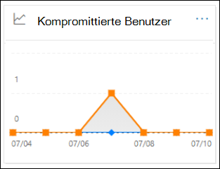
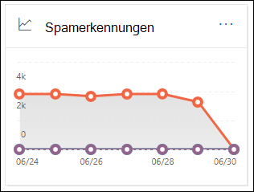
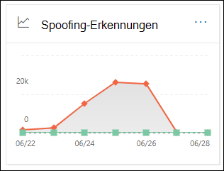
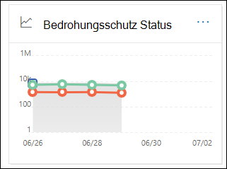
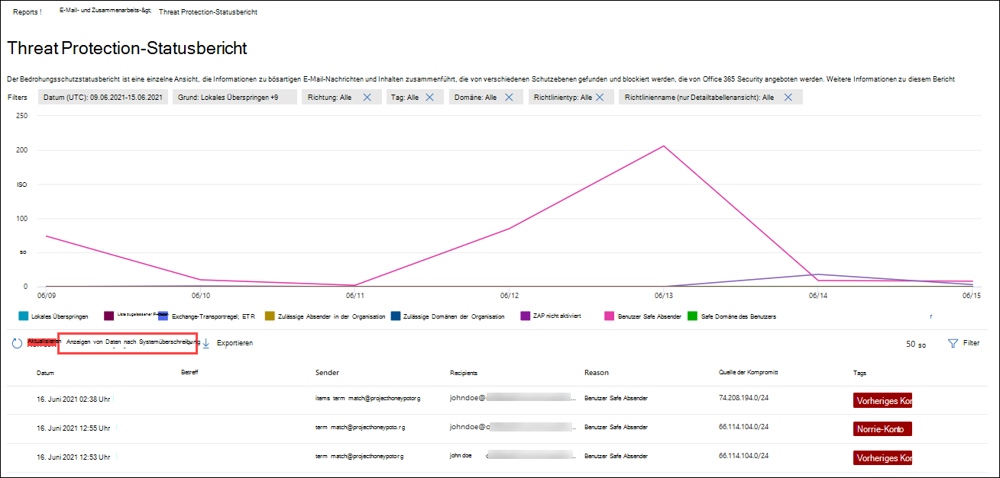
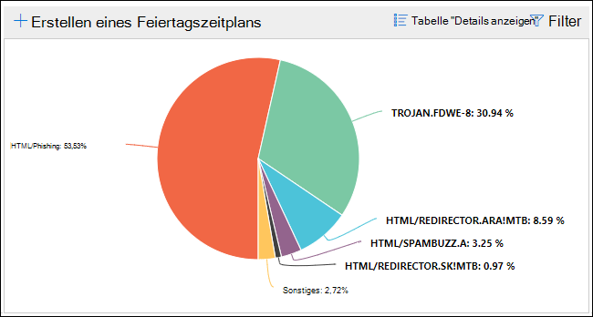
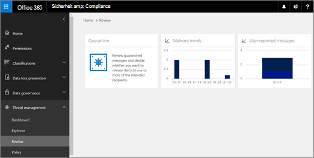

# Anzeigen von E-Mail-Sicherheitsberichten im Security & Compliance Center

[!INCLUDE [Microsoft 365 Defender rebranding](../includes/microsoft-defender-for-office.md)]

**Gilt für**
- [Exchange Online Protection](exchange-online-protection-overview.md)
- [Microsoft Defender für Office 365 Plan 1 und Plan 2](office-365-atp.md)
- [Microsoft 365 Defender](../mtp/microsoft-threat-protection.md)

Im Security & Compliance [Center](https://protection.office.com) stehen verschiedene Berichte zur Verfügung, mit deren Hilfe Sie sehen können, wie E-Mail-Sicherheitsfeatures wie Antispam-, Ansoftware- und Verschlüsselungsfeatures in Microsoft 365 Ihre Organisation schützen. Wenn Sie über die erforderlichen [Berechtigungen verfügen,](#what-permissions-are-needed-to-view-these-reports)können Sie diese Berichte im Security & Compliance Center anzeigen, indem Sie zum Dashboard **"Berichte"** \> **gehen.** Um direkt zum Dashboard "Berichte" zu wechseln, öffnen Sie <https://protection.office.com/insightdashboard> .

## Bericht "Gefährdete Benutzer"

> [!NOTE]
> Dieser Bericht ist in Microsoft 365-Organisationen mit Exchange Online-Postfächern verfügbar. Es ist in eigenständigen Exchange Online Protection (EOP)-Organisationen nicht verfügbar.

Der **Bericht "Gefährdete Benutzer"** zeigt die Anzahl  der  Benutzerkonten an, die innerhalb der letzten 7 Tage als verdächtig oder eingeschränkt gekennzeichnet wurden. Konten in einem dieser Zustände sind problematisch oder sogar gefährdet. Bei häufiger Verwendung können Sie den Bericht verwenden, um Spitzen und sogar Trends bei verdächtigen oder eingeschränkten Konten zu erkennen. Weitere Informationen zu gefährdeten Benutzern finden Sie unter ["Reagieren auf ein gefährdetes E-Mail-Konto".](responding-to-a-compromised-email-account.md)

In der Aggregatansicht werden Daten für die letzten 90 Tage angezeigt, und in der Detailansicht werden Daten für die letzten 30 Tage angezeigt.

Öffnen Sie zum Anzeigen des Berichts das [Security & Compliance Center,](https://protection.office.com)wechseln Sie zum Dashboard "Berichte", und wählen Sie  \>  **"Gefährdete Benutzer" aus.** Um direkt zum Bericht zu wechseln, öffnen Sie <https://protection.office.com/reportv2?id=CompromisedUsers> .

Sie können sowohl das Diagramm als auch die Detailtabelle filtern, indem Sie auf **"Filter"** klicken und einen oder mehrere der folgenden Werte auswählen:

- **Startdatum** und **Enddatum**

- **Verdächtig:** Das Benutzerkonto hat verdächtige E-Mails gesendet und riskiert, dass das Senden von E-Mails eingeschränkt wird.

- **Eingeschränkt:** Das Benutzerkonto wurde aufgrund hochgradig verdächtiger Muster am Senden von E-Mails eingeschränkt.

Wenn Sie auf **"Details anzeigen" klicken,** werden die folgenden Details angezeigt:

- **Erstellungszeit**
- **Benutzer-ID**
- **Aktion**

Klicken Sie auf "Bericht anzeigen", um zur **Berichtsansicht zurück zu wechseln.**

## Verschlüsselungsbericht

Der **Verschlüsselungsbericht ist** in EOP verfügbar (Abonnements mit Postfächern in Exchange Online oder eigenständiges EOP ohne Exchange Online-Postfächer). Das Sicherheitsteam Ihrer Organisation kann die Informationen in diesem Bericht verwenden, um Muster zu identifizieren und Richtlinien für vertrauliche E-Mail-Nachrichten proaktiv anzuwenden oder anzupassen. Zum Beispiel:

- Wenn eine hohe Anzahl von von Benutzern verschlüsselten E-Mail-Nachrichten angezeigt wird, sollten Sie eine Verschlüsselungsrichtlinie hinzufügen, um die Verschlüsselung für bestimmte Verwendungsfälle zu automatisieren. Weitere Informationen finden Sie unter [Definieren von Nachrichtenflussregeln zum Verschlüsseln von E-Mail-Nachrichten in Microsoft 365.](../../compliance/define-mail-flow-rules-to-encrypt-email.md)

- Wenn Eine Reihe von Verschlüsselungsvorlagen verfügbar sind, aber von niemanden verwendet werden, können Sie untersuchen, ob Benutzer Featureschulungen benötigen.

Die Aggregatansicht ermöglicht das Filtern für die letzten 90 Tage, während die Detailansicht das Filtern für 10 Tage zulässt.

Öffnen Sie zum Anzeigen des Berichts das [Security & Compliance Center,](https://protection.office.com)wechseln Sie zum **Berichtsdashboard,** und wählen Sie \>  den **Verschlüsselungsbericht aus.** Um direkt zum Bericht zu wechseln, öffnen Sie <https://protection.office.com/reportv2?id=EncryptionReport> .

Weitere Informationen zur Verschlüsselung finden Sie unter ["E-Mail-Verschlüsselung in Microsoft 365".](../../compliance/email-encryption.md)

### Berichtsansicht für den Verschlüsselungsbericht

Sie können die folgenden Filter für das Diagramm verwenden:

- **Daten nach: Nachrichtenverschlüsselungsbericht anzeigen** und **aufschlüsseln nach: Verschlüsselungsmethode:** Die folgenden Verschlüsselungsmethoden sind verfügbar:

  - **Verschlüsselung nach Benutzer**
  - **Verschlüsselung nach Richtlinie**

  Wenn Sie auf **"Filter"** klicken, können Sie das Diagramm mit den folgenden Filtern ändern:

  - **Startdatum** und **Enddatum**
  - Verschlüsselungsmethode.
  - Verschlüsselungsvorlage.

- **Daten nach: Nachrichtenverschlüsselungsbericht anzeigen und** **aufschlüsseln nach:** Verschlüsselungsvorlage: Die folgenden Verschlüsselungsmethoden sind verfügbar:

  - **Nicht weiterleiten**
  - **Nur verschlüsseln**
  - **OME previous**
  - **Custom**

  Wenn Sie auf **"Filter"** klicken, können Sie das Diagramm mit den folgenden Filtern ändern:

  - **Startdatum** und **Enddatum**
  - Verschlüsselungsmethode
  - Verschlüsselungsvorlage

- **Daten nach: Top 5 Empfängerdomänen anzeigen:** In dieser Ansicht wird ein Kreisdiagramm mit der Anzahl der gesendeten Nachrichten für die 5 am besten 5 Empfängerdomänen angezeigt.

  Wenn Sie auf **"Filter"** klicken, können Sie ein **Start- und** **ein Enddatum auswählen.**

### Detailtabelle für den Verschlüsselungsbericht

Wenn Sie auf **"Details anzeigen" klicken,** hängen die angezeigten Informationen vom Diagramm ab, das Sie betrachtet haben:

- **Aufschlüsseln nach: Verschlüsselungsmethode** oder **Aufschlüsselung nach:** Verschlüsselungsvorlage: Die folgenden Informationen werden angezeigt:

  - **Date**
  - **Absenderadresse**
  - **Verschlüsselungsvorlage**
  - **Verschlüsselungsmethode**
  - **Empfängeradresse**
  - **Betreff**

- **Anzeigen von Daten nach: Top 5 Empfängerdomänen:**

  - **Date**
  - **Empfängerdomäne**
  - **Anzahl der Nachrichten**

Wenn Sie in einer **Detailtabelle** auf "Filter" klicken, können Sie die Ergebnisse mit den folgenden Filtern ändern:

- **Startdatum** und **Enddatum**
- Verschlüsselungsmethode
- Verschlüsselungsvorlage

Klicken Sie auf "Bericht anzeigen", um zur **Berichtsansicht zurück zu wechseln.**

## Statusbericht über den Nachrichtenfluss

Der **Statusbericht "E-Mail-Nachrichtenfluss"** enthält Informationen zu Schadsoftware, Spam, Phishing und blockierten Edge-Nachrichten. Weitere Informationen finden Sie im [Statusbericht über den Nachrichtenfluss.](view-mail-flow-reports.md#mailflow-status-report)

## Schadsoftwareerkennungen im E-Mail-Bericht

Der **Bericht über Schadsoftwareerkennungen im** E-Mail-Bericht enthält Informationen zu Schadsoftwareerkennungen in eingehenden und ausgehenden E-Mail-Nachrichten (Schadsoftware, die von Exchange Online Protection oder EOP erkannt wurde). Weitere Informationen zum Schutz vor Schadsoftware in EOP finden Sie unter [An malware protection in EOP](anti-malware-protection.md).

 Der Aggregatansichtsfilter lässt 90 Tage zu, während der Detailtabellefilter nur 10 Tage zulässt.

Öffnen Sie zum Anzeigen des Berichts das [Security & Compliance Center,](https://protection.office.com)wechseln Sie zum Berichtsdashboard, und wählen Sie  \>  **Schadsoftwareerkennungen in E-Mail aus.** Um direkt zum Bericht zu wechseln, öffnen Sie <https://protection.office.com/reportv2?id=MalwareDetections> .

Sie können sowohl das Diagramm als auch die Detailtabelle filtern, indem Sie auf **"Filter"** klicken und folgende Optionen auswählen:

- **Startdatum** und **Enddatum**
- **Eingehende Nachrichten**
- **Ausgehend**

Wenn Sie auf **"Details anzeigen" klicken,** werden die folgenden Details angezeigt:

- **Date**
- **Absenderadresse**
- **Empfängeradresse**
- **Nachrichten-ID:** Im **Nachrichten-ID-Kopfzeilenfeld** im Nachrichtenkopf verfügbar und sollte eindeutig sein. Ein Beispielwert ist `<08f1e0f6806a47b4ac103961109ae6ef@server.domain>` (beachten Sie die spitzen Klammern).
- **Betreff**
- **Filename**
- **Name der Schadsoftware**

Klicken Sie auf "Bericht anzeigen", um zur **Berichtsansicht zurück zu wechseln.**

## E-Mail-Wartezeitbericht

Der **Bericht über E-Mail-Latenz** enthält Informationen zur E-Mail-Zustellungs- und Detonationslatenz, die in Ihrer Organisation auftreten. Weitere Informationen finden Sie im [Bericht über E-Mail-Latenz.](view-reports-for-atp.md#mail-latency-report)

## Gesendeter und empfangener E-Mail-Bericht

Der **Bericht über gesendete** und empfangene E-Mails enthält Informationen zu Schadsoftware, Spam, Nachrichtenflussregeln (auch als Transportregeln bezeichnet) und erweiterten Schadsoftwareerkennungen, nachdem E-Mails in den Dienst eingegangen sind. Weitere Informationen finden Sie im Bericht [über gesendete und empfangene E-Mails.](view-mail-flow-reports.md#sent-and-received-email-report)

## Spamerkennungsbericht

Der **Bericht über Spamerkennungen** enthält Spam-E-Mail-Nachrichten, die von EOP blockiert wurden. Nachrichten werden einzeln gezählt, nicht pro Empfänger. Wenn beispielsweise dieselbe Spamnachricht an 100 Empfänger in Ihrer Organisation gesendet wurde, zählt sie als eine Nachricht.

Die Aggregatansicht ermöglicht das Filtern von 90 Tagen, während die Detailtabelle eine Filterung von 10 Tagen zulässt.

Öffnen Sie zum Anzeigen des Berichts das [Security & Compliance Center,](https://protection.office.com)wechseln Sie **zum** Berichtsdashboard, und wählen Sie \>  **Spamerkennungen aus.** Um direkt zum Bericht zu wechseln, öffnen Sie <https://protection.office.com/reportv2?id=SpamDetections> .

Weitere Informationen zum Antispamschutz finden Sie unter [Antispamschutz in EOP.](anti-spam-protection.md)

### Berichtsansicht für den Bericht über Spamerkennungen

Die folgenden Diagramme sind in der Berichtsansicht verfügbar:

- **Aufbrechen nach: Aktion:** Die folgenden Ereignistypen werden angezeigt:

  - **Gefilterter Spaminhalt**
  - **Spam-IP-Block**
  - **Spam-Umschlag-Block**
  - **Spam-DBEB-Filter:** Verzeichnisbasierte Edgeblockierung (DBEB)

  Wenn Sie mit der Maus auf einen Tag (Datenpunkt) im Diagramm zeigen, können Sie sehen, wie viele Elemente an diesem Tag blockiert wurden und wie diese Elemente kategorisiert werden.

  

- **Aufbrechen nach: Richtung:** Die folgenden Wegbeschreibungen werden angezeigt:

  - **Eingehende Nachrichten**
  - **Ausgehend**

  

Wenn Sie **in** einer Berichtsansicht auf "Filter" klicken, können Sie die Ergebnisse mit den folgenden Filtern ändern:

- **Startdatum** und **Enddatum**
- Richtungswerte
- Ereignistypwerte

### Detailtabelle für den Bericht "Spamerkennungen"

Wenn Sie in einer **Berichtsansicht auf "Details anzeigen"** klicken, werden die folgenden Informationen angezeigt:

- **Date**
- **Absenderadresse**
- **Empfängeradresse**
- **Ereignistyp**
- **Aktion**
- **Betreff**

Wenn Sie in **einer Detailtabelle** auf "Filter" klicken, können Sie die Ergebnisse mit den folgenden Filtern ändern:

- **Startdatum** und **Enddatum**
- Richtungswerte
- Ereignistypwerte

Klicken Sie auf "Bericht anzeigen", um zur **Berichtsansicht zurück zu wechseln.**

## Bericht über Spooferkennungen

Der **Bericht über Spoofingerkennungen** zeigt, wie viele Spoof-E-Mail-Nachrichten erkannt wurden und welche als "gut" betrachtet wurden (Spoof-E-Mails, die aus legitimen geschäftlichen Gründen durchgeführt wurden). Weitere Informationen zum Spoofing finden Sie unter [Antis spoofing protection in EOP](anti-spoofing-protection.md).

Die Aggregatansicht des Berichts ermöglicht eine Filterung von 90 Tagen, während die Detailansicht nur 10 Tage Filterung zulässt.

Öffnen Sie zum Anzeigen des Berichts das [Security & Compliance Center,](https://protection.office.com)wechseln Sie zum **Berichtsdashboard,** und wählen Sie \>  **Spooferkennungen aus.** Um direkt zum Bericht zu wechseln, öffnen Sie <https://protection.office.com/reportv2?id=SpoofMailReport> .

Wenn Sie mit der Maus auf einen Tag (Datenpunkt) im Diagramm zeigen, können Sie sehen, wie viele Spoof-E-Mail-Nachrichten durchgestellt wurden.

Sie können sowohl das Diagramm als auch die Detailtabelle filtern, indem Sie auf **"Filter"** klicken und einen oder mehrere der folgenden Werte auswählen:

- **Startdatum** und **Enddatum**

- **Gute E-Mail**

- **Als Spam erfasst**

Wenn Sie auf **"Details anzeigen" klicken,** werden die folgenden Details angezeigt:

- **Date**
- **Gefälschter Absender**
- **Wahrer Absender**
- **Sender-IP**
- **Aktion**
- **Anzahl der Nachrichten**

Klicken Sie auf "Bericht anzeigen", um zur **Berichtsansicht zurück zu wechseln.**

## Threat Protection-Statusbericht

Der **Statusbericht zum Bedrohungsschutz** ist sowohl in EOP als auch in Microsoft Defender für Office 365 verfügbar. Die Berichte enthalten jedoch unterschiedliche Daten. Beispielsweise können #A0 Informationen zu Schadsoftware anzeigen, die in E-Mails erkannt wurde, jedoch keine Informationen zu schädlichen Dateien, die von sicheren Anlagen für [SharePoint, OneDrive](atp-for-spo-odb-and-teams.md)und Microsoft Teams erkannt wurden.

Der Bericht enthält die Anzahl von E-Mail-Nachrichten mit schädlichem Inhalt, z. B. Dateien oder Websiteadressen (URLs), die vom Ansoftwaremodul, zap  [(Zero-Hour Auto Purge)](zero-hour-auto-purge.md)und Defender für Office 365-Features wie sichere [Links,](atp-safe-links.md)sichere Anlagen und [Antiphishing](set-up-anti-phishing-policies.md)blockiert wurden. Sie können diese Informationen verwenden, um Trends zu identifizieren oder festzustellen, ob die Organisationsrichtlinien anpassungen erforderlich sind.

**Hinweis:** Es ist wichtig zu wissen, dass eine Nachricht, wenn sie an fünf Empfänger gesendet wird, als fünf verschiedene Nachrichten und nicht als eine Nachricht gezählt wird.

Öffnen Sie zum Anzeigen des Berichts das [Security & Compliance Center,](https://protection.office.com)wechseln Sie zum Berichtsdashboard, und wählen Sie den  \>  **Bedrohungsschutzstatus aus.** Öffnen Sie eine der folgenden URLs, um direkt zum Bericht zu wechseln:

- Microsoft Defender für Office 365: <https://protection.office.com/reportv2?id=TPSAggregateReportATP>
- EOP: <https://protection.office.com/reportv2?id=TPSAggregateReport>

Standardmäßig werden im Diagramm Daten für die letzten 7 Tage angezeigt. Wenn Sie auf **"Filter"** klicken, können Sie einen Datumsbereich von 90 Tagen auswählen (Testabonnements sind möglicherweise auf 30 Tage beschränkt). Die Detailtabelle ermöglicht das Filtern für 30 Tage.

### Berichtsansicht für den Statusbericht zum Bedrohungsschutz

Die folgenden Ansichten sind verfügbar:

- **Anzeigen von Daten nach: Übersicht**: Die folgenden Erkennungsinformationen werden angezeigt:

  - **E-Mail-Schadsoftware**
  - **E-Mail-Phishing**
  - **Schadsoftware für Inhalte**

  

- **Anzeigen von Daten nach: Inhalt \> Schadsoftware**1:Die folgenden Informationen werden für Microsoft Defender für Office 365-Organisationen angezeigt:

  - **An malware engine:** Malicious files detected in Sharepoint, OneDrive, and Microsoft Teams by the [built-in virus detection in Microsoft 365](virus-detection-in-spo.md).
  - **Dateidetonation:** Bösartige Dateien, die von sicheren Anlagen für [SharePoint, OneDrive und Microsoft Teams erkannt wurden.](atp-for-spo-odb-and-teams.md)

  

- **Daten anzeigen nach: Nachrichtenüberschreibung:** Die folgenden Informationen zum Grund für die Außerkraftsetzung werden angezeigt:

  - **Lokales Überspringen**
  - **IP Allow**
  - **Nachrichtenflussregel**
  - **Absender zulassen**
  - **Domänen zulassen**
  - **ZAP nicht aktiviert**
  - **Junk-E-Mail-Ordner nicht aktiviert**
  - **Sicherer Absender des Benutzers**
  - **Benutzersichere Domäne**

  

- **Aufbrechen nach: Erkennungstechnologie** und **Anzeigen von Daten nach: E-Mail-Phishing: \>** Die folgenden Informationen werden angezeigt:

  - **ATP-generierte URL-Reputation**1:Schädliche URL-Reputation, die von Defender für Office 365-Detonationen in anderen Microsoft 365-Kunden generiert wurde.
  - **Erweiterter Phishingfilter:** Phishingsignale, die auf maschinellem Lernen basieren.
  - **Antis spoofing - DMARC failure**: DMARC authentication failure on messages.
  - **Antis spoofing - intra-org:** Sender is trying to spoof the recipient domain.
  - **Antis spoofing - externe Domäne:** Der Absender versucht, eine andere Domäne zu spoofen.
  - **Markenwechsel: Identitätswechsel** bekannter Marken basierend auf Absendern.
  - **Domänenwechsel**1:Identitätswechsel von Domänen, die der Kunde besitzt oder definiert.
  - **EOP-URL-Reputation:** Schädliche URL-Reputation.
  - **Allgemeiner Phishingfilter:** Phishingsignale, die auf Analystenregeln basieren.
  - **Sonstige**
  - **Phish ZAP**2:Automatisches Löschen von Phishingnachrichten zur Nullstunde.
  - **URL-Detonation**1
  - **Benutzerwechsel**1:Identitätswechsel von Benutzern, die vom Administrator definiert oder über Die Postfachintelligenz gelernt wurden.

  

- **Unterlegen nach: Erkennungstechnologie und** **Anzeigen von Daten nach: E-Mail-Schadsoftware: \>** Die folgenden Informationen werden angezeigt:

  - **ATP-generierte Dateire**reputation 1:Alle von Defender für Office 365-Detonationen generierte Reputation bösartiger Dateien.
  - **An malware engine**1:Detection from anti-malware engines.
  - **Dateitypblock für Ansoftwarerichtlinien:** Dabei handelt es sich um E-Mail-Nachrichten, die aufgrund des in der Nachricht identifizierten Typs der schädlichen Datei herausgefiltert wurden.
  - **Dateidetonation**1:Erkennung durch sichere Anlagen.
  - **Ruf von schädlichen Dateien**
  - **Schadsoftware ZAP**2
  - **Sonstige**

  

- **Aufbrechen nach: Richtlinientyp** und Daten anzeigen **nach: E-Mail-Phishing \>** oder Daten anzeigen nach: E-Mail-Schadsoftware: Die folgenden Informationen werden angezeigt: **\>**

  - **Ansoftware**
  - **Sichere Anlagen**1
  - **Anti phish**
  - **Antispam**
  - **Nachrichtenflussregel** (auch als Transportregel bekannt)
  - **Sonstige**

  

- **Aufbrechen nach: Zustellungsstatus** und Anzeigen von Daten **nach: E-Mail-Phishing \>** oder Anzeigen von Daten nach: E-Mail-Schadsoftware: Die folgenden Informationen werden angezeigt: **\>**

  - **Zustellung fehlgeschlagen**
  - **Dropped**
  - **Weitergeleitet**
  - **Gehostetes Postfach: Benutzerdefinierter Ordner**
  - **Gehostetes Postfach: Gelöschte Elemente**
  - **Gehostetes Postfach: Posteingang**
  - **Gehostetes Postfach: Junk**
  - **Lokale Server: Zugestellt**
  - **Quarantäne**

  

Nur 1 Defender für Office 365

2 Automatische Bereinigung zur Nullstunde (ZAP) ist in eigenständigem EOP nicht verfügbar (es funktioniert nur in Exchange Online-Postfächern).

Wenn Sie auf **"Filter"** klicken, hängen die verfügbaren Filter vom Diagramm ab, das Sie betrachtet haben:

- For **View data by: Content \> Malware**, you can modify the report by **Start date** and End **date**, and the **Detection** value.

- For **View data by: Message Override**, you can modify the report with the following filters:

  - **Startdatum** und **Enddatum**
  - **Grund für die Außerkraftsetzung**
  - **Tag**: Filtert die Ergebnisse nach Benutzern oder Gruppen, auf die das angegebene Benutzertag angewendet wurde (einschließlich Prioritätskonten). Weitere Informationen zu Benutzertags finden Sie unter [Benutzertags.](user-tags.md)
  - **Domäne**

- Für alle anderen Ansichten können Sie den Bericht mit den folgenden Filtern ändern:

  - **Startdatum** und **Enddatum**
  - **Erkennung**
  - **Geschützt durch:** **ATP** oder **EOP**
  - **Tag**: Filtert die Ergebnisse nach Benutzern oder Gruppen, auf die das angegebene Benutzertag angewendet wurde (einschließlich Prioritätskonten). Weitere Informationen zu Benutzertags finden Sie unter [Benutzertags.](user-tags.md)
  - **Domäne**

### Detailtabelle für den Statusbericht zu Bedrohungsschutz

Wenn Sie auf **"Details anzeigen" klicken,** hängen die angezeigten Informationen vom Diagramm ab, das Sie betrachtet haben:

- **Daten anzeigen nach: Übersicht**: Es ist keine Schaltfläche **"Details anzeigen"** verfügbar.

- **Anzeigen von Daten nach: Inhalt \> Schadsoftware:**

  - **Date**
  - **Standort**
  - **Geleitet von**
  - **Name der Schadsoftware**

  Wenn Sie **in** dieser Ansicht auf "Filter" klicken, können Sie den Bericht nach **Startdatum,** **Enddatum** und **Erkennungswert** ändern.

- **Daten anzeigen nach: Nachrichtenüberschreibung**:

  - **Date**
  - **Betreff**
  - **Sender**
  - **Recipients**
  - **Erkannt von**
  - **Grund für die Außerkraftsetzung**
  - **Quelle der Kompromisse**
  - **Tags**

  Wenn Sie in dieser **Ansicht** auf "Filter" klicken, können Sie den Bericht mit den folgenden Filtern ändern:

  - **Startdatum** und **Enddatum**
  - **Grund für die Außerkraftsetzung**
  - **Tag**: Filtert die Ergebnisse nach Benutzern oder Gruppen, auf die das angegebene Benutzertag angewendet wurde (einschließlich Prioritätskonten). Weitere Informationen zu Benutzertags finden Sie unter [Benutzertags.](user-tags.md)
  - **Domäne**
  - **Empfänger** (Beachten Sie, dass diese filterbare Eigenschaft nur in der Detailtabelle verfügbar ist)

- Alle anderen Diagramme:

  - **Date**
  - **Betreff**
  - **Sender**
  - **Recipients**
  - **Erkannt von**
  - **Zustellungsstatus**
  - **Quelle der Kompromisse**
  - **Tags**

  Wenn Sie auf **"Filter"** klicken, können Sie den Bericht mit den folgenden Filtern ändern:

  - **Startdatum** und **Enddatum**
  - **Erkennung**
  - **Geschützt durch**: **Defender für Office 365** oder **EOP**
  - **Tag**: Filtert die Ergebnisse nach Benutzern oder Gruppen, auf die das angegebene Benutzertag angewendet wurde (einschließlich Prioritätskonten). Weitere Informationen zu Benutzertags finden Sie unter [Benutzertags.](user-tags.md)
  - **Domäne**
  - **Empfänger** (Beachten Sie, dass diese filterbare Eigenschaft nur in der Detailtabelle verfügbar ist)

## Am besten als Schadsoftwarebericht

Der **Bericht über die am** meisten schadsoftware enthaltene Schadsoftware zeigt die verschiedenen Arten von Schadsoftware, die vom [Ansoftwareschutz in EOP erkannt wurde.](anti-malware-protection.md)

Öffnen Sie zum Anzeigen des Berichts das [Security & Compliance Center,](https://protection.office.com)wechseln Sie zum **Berichtsdashboard,** und wählen Sie "Am besten \>  **schadsoftware" aus.** Um direkt zum Bericht zu wechseln, öffnen Sie <https://protection.office.com/reportv2?id=TopMalware> .

Wenn Sie mit der Maus auf einen Kreis im Kreisdiagramm zeigen, sehen Sie den Namen einer Art von Schadsoftware und die Anzahl der Nachrichten, die als schadsoftwarebefreit erkannt wurden.

Wenn Sie auf **"Details anzeigen" klicken,** werden die folgenden Details angezeigt:

- **Am besten schadsoftware**
- **Count**

Wenn Sie **in** der Berichtsansicht oder detailtabelle auf Filter klicken, können Sie einen Datumsbereich mit **Startdatum** und **Enddatum angeben.**

## Bericht zum Schutz vor URL-Bedrohungen

Der **Bericht zum Schutz vor URL-Bedrohungen** ist in Microsoft Defender für Office 365 verfügbar. Weitere Informationen finden Sie im [Bericht zum Schutz vor URL-Bedrohungen.](view-reports-for-atp.md#url-threat-protection-report)

## Bericht über von Benutzern gemeldete Nachrichten

Der Bericht über von Benutzern gemeldete Nachrichten enthält Informationen zu [E-Mail-Nachrichten,](enable-the-report-message-add-in.md) die Benutzer mithilfe des Add-Ins "Nachricht melden" oder "Phishing melden" als **Junk-E-Mail,** Phishingversuche oder gute E-Mails gemeldet [haben.](enable-the-report-phish-add-in.md)

Details sind für jede Nachricht verfügbar, einschließlich des Zustellungsgrunds, z. B. einer Spamrichtlinienausnahme oder einer nachrichtenflussregel, die für Ihre Organisation konfiguriert ist. Um Details anzuzeigen, wählen Sie ein Element in der Benutzerberichtsliste aus, und zeigen Sie dann die Informationen auf den Registerkarten "Zusammenfassung" **und** **"Details"** an.

Gehen Sie zum Anzeigen dieses Berichts im [Security & Compliance Center](https://protection.office.com)wie folgt vor:

- Wechseln  Sie zu Vom \> **Benutzer gemeldeten Nachrichten** \> **des Dashboards für die Bedrohungsverwaltung.**

- Wechseln Sie zu **"Bedrohungsverwaltung** \> **Überprüfen** \> **von vom Benutzer gemeldeten Nachrichten".**

> [!IMPORTANT]
> Damit der Bericht über vom Benutzer gemeldete Nachrichten ordnungsgemäß **funktioniert,** muss die Überwachungsprotokollierung für Ihre Office 365-Umgebung aktiviert sein. Dies wird in der Regel von einer Person durchgeführt, der die Rolle "Überwachungsprotokolle" in Exchange Online zugewiesen ist. Weitere Informationen finden Sie unter Aktivieren oder Deaktivieren der [Microsoft 365-Überwachungsprotokollsuche.](../../compliance/turn-audit-log-search-on-or-off.md)

## Welche Berechtigungen sind erforderlich, um diese Berichte anzeigen zu können?

Um die in diesem Artikel beschriebenen Berichte anzeigen und verwenden zu können, müssen Sie Mitglied einer der folgenden Rollengruppen im Security & Compliance Center sein:

- **Organisationsverwaltung**
- **Sicherheitsadministrator**
- **Sicherheitsleseprogramm**
- **Globaler Leser**

Weitere Informationen finden Sie unter [Berechtigungen im Security & Compliance Center](permissions-in-the-security-and-compliance-center.md).

**Hinweis:** Durch das Hinzufügen von Benutzern zur entsprechenden Azure Active Directory-Rolle im Microsoft 365 Admin Center erhalten Benutzer die erforderlichen Berechtigungen im Security & Compliance _Center_ sowie Berechtigungen für andere Features in Microsoft 365. Weitere Informationen finden Sie unter [Informationen zu Administratorrollen](../../admin/add-users/about-admin-roles.md).

## Was passiert, wenn in den Berichten keine Daten angezeigt werden?

Wenn in Ihren Berichten keine Daten angezeigt werden, überprüfen Sie, ob ihre Richtlinien ordnungsgemäß eingerichtet sind. Weitere Informationen finden Sie unter ["Schutz vor Bedrohungen".](protect-against-threats.md)

## Verwandte Themen

[Antispam- und Ansoftwareschutz in EOP](anti-spam-and-anti-malware-protection.md)

[Intelligente Berichte und Einblicke im Security & Compliance Center](reports-and-insights-in-security-and-compliance.md)

[Anzeigen von Nachrichtenflussberichten im Security & Compliance Center](view-mail-flow-reports.md)

[Anzeigen von Berichten für Defender für Office 365](view-reports-for-atp.md)
