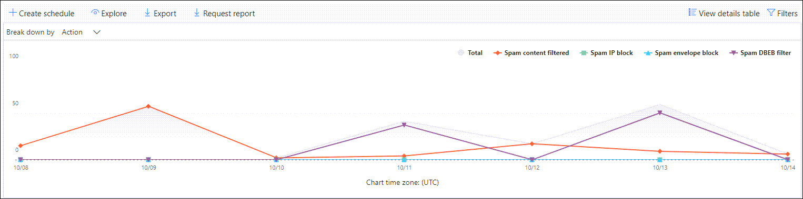

# Anzeigen von E-Mail-Sicherheitsberichten im Security & Compliance Center

[!INCLUDE [Microsoft 365 Defender rebranding](../includes/microsoft-defender-for-office.md)]

**Gilt für**
- [Exchange Online Protection](exchange-online-protection-overview.md)
- [Microsoft Defender für Office 365 Plan 1 und Plan 2](defender-for-office-365.md)
- [Microsoft 365 Defender](../defender/microsoft-365-defender.md)

Im Security & Compliance [Center](https://protection.office.com) stehen verschiedene Berichte zur Verfügung, mit deren Hilfe Sie sehen können, wie E-Mail-Sicherheitsfeatures wie Antispam-, Anschmierungs- und Verschlüsselungsfunktionen in Microsoft 365 Ihre Organisation schützen. Wenn Sie über die [erforderlichen Berechtigungen verfügen,](#what-permissions-are-needed-to-view-these-reports)können Sie diese Berichte im Security & Compliance Center anzeigen, indem Sie zu **Reports** \> **Dashboard gehen.** Öffnen Sie , um direkt zum Dashboard Berichte zu <https://protection.office.com/insightdashboard> wechseln.

## Bericht "Gefährdete Benutzer"

> [!NOTE]
> Dieser Bericht ist in Microsoft 365 organisationen mit Exchange Online verfügbar. Sie ist in eigenständigen Organisationen Exchange Online Protection (EOP) nicht verfügbar.

Der **Bericht "Gefährdete** Benutzer" zeigt die Anzahl  der  Benutzerkonten an, die innerhalb der letzten 7 Tage als verdächtig oder eingeschränkt gekennzeichnet wurden. Konten in einem dieser Zustände sind problematisch oder sogar gefährdet. Bei häufiger Verwendung können Sie den Bericht verwenden, um Spitzen und sogar Trends in verdächtigen oder eingeschränkten Konten zu erkennen. Weitere Informationen zu gefährdeten Benutzern finden Sie unter [Antworten auf ein gefährdetes E-Mail-Konto](responding-to-a-compromised-email-account.md).

Die Aggregatansicht zeigt Daten für die letzten 90 Tage an, und die Detailansicht zeigt Daten für die letzten 30 Tage an.

Öffnen Sie zum Anzeigen des Berichts das [Security & Compliance Center,](https://protection.office.com)wechseln Sie **zu** Berichtsdashboard, und wählen \>  Sie **Gefährdete Benutzer aus.** Öffnen Sie , um direkt zum Bericht zu <https://protection.office.com/reportv2?id=CompromisedUsers> wechseln.

Sie können sowohl das Diagramm als auch die Detailtabelle filtern, indem Sie auf **Filter klicken** und einen oder mehrere der folgenden Werte auswählen:

- **Startdatum** und **Enddatum**

- **Verdächtig:** Das Benutzerkonto hat verdächtige E-Mails gesendet und riskiert, dass das Senden von E-Mails eingeschränkt wird.

- **Eingeschränkt:** Das Benutzerkonto wurde aufgrund hochgradig verdächtiger Muster vom Senden von E-Mails eingeschränkt.

Wenn Sie auf **Detailtabelle anzeigen klicken,** sehen Sie die folgenden Details:

- **Erstellungszeit**
- **Benutzer-ID**
- **Action**

Klicken Sie auf Bericht anzeigen, um zur Berichtsansicht **zurück zu wechseln.**

## Verschlüsselungsbericht

Der **Verschlüsselungsbericht ist** in EOP verfügbar (Abonnements mit Postfächern in Exchange Online oder eigenständigem EOP ohne Exchange Online Postfächer). Das Sicherheitsteam Ihrer Organisation kann informationen in diesem Bericht verwenden, um Muster zu identifizieren und Richtlinien proaktiv für vertrauliche E-Mail-Nachrichten anzuwenden oder anzupassen. Beispiel:

- Wenn eine hohe Anzahl von von Benutzern verschlüsselten E-Mail-Nachrichten angezeigt wird, sollten Sie eine Verschlüsselungsrichtlinie hinzufügen, um die Verschlüsselung für bestimmte Verwendungsfälle zu automatisieren. Weitere Informationen finden Sie unter [Define mail flow rules to encrypt email messages in Microsoft 365](../../compliance/define-mail-flow-rules-to-encrypt-email.md).

- Wenn Eine Reihe von Verschlüsselungsvorlagen verfügbar ist, aber niemand sie verwendet, können Sie untersuchen, ob Benutzer Featureschulungen benötigen.

Die Aggregatansicht ermöglicht das Filtern für die letzten 90 Tage, während die Detailansicht das Filtern für 10 Tage zulässt.

Öffnen Sie zum Anzeigen des Berichts das [Security & Compliance Center,](https://protection.office.com)wechseln **Sie** zu Berichtsdashboard, und wählen \>  Sie **Verschlüsselungsbericht aus.** Öffnen Sie , um direkt zum Bericht zu <https://protection.office.com/reportv2?id=EncryptionReport> wechseln.

Weitere Informationen zur Verschlüsselung finden Sie unter [E-Mail-Verschlüsselung in Microsoft 365](../../compliance/email-encryption.md).

### Berichtsansicht für den Verschlüsselungsbericht

Sie können die folgenden Filter im Diagramm verwenden:

- **Daten nach anzeigen: Nachrichtenverschlüsselungsbericht** und **Aufschlüsseln nach: Verschlüsselungsmethode**: Die folgenden Verschlüsselungsmethoden sind verfügbar:

  - **Verschlüsselung nach Benutzer**
  - **Verschlüsselung nach Richtlinie**

  Wenn Sie auf **Filter** klicken, können Sie das Diagramm mit den folgenden Filtern ändern:

  - **Startdatum** und **Enddatum**
  - Verschlüsselungsmethode.
  - Verschlüsselungsvorlage.

- **Daten nach anzeigen: Nachrichtenverschlüsselungsbericht** und **Aufschlüsseln nach: Verschlüsselungsvorlage**: Die folgenden Verschlüsselungsmethoden sind verfügbar:

  - **Nicht weiterleiten**
  - **Nur verschlüsseln**
  - **OME previous**
  - **Custom**

  Wenn Sie auf **Filter** klicken, können Sie das Diagramm mit den folgenden Filtern ändern:

  - **Startdatum** und **Enddatum**
  - Verschlüsselungsmethode
  - Verschlüsselungsvorlage

- **Daten anzeigen nach: Top 5 recipient domains**: This view shows a pie chart with sent message counts for the top 5 recipient domains.

  Wenn Sie auf **Filter** klicken, können Sie ein **Startdatum und** **ein Enddatum auswählen.**

### Detailtabelle für den Verschlüsselungsbericht

Wenn Sie auf **Detailtabelle anzeigen klicken,** hängen die angezeigten Informationen von dem Diagramm ab, das Sie sich angeschaut haben:

- **Aufschlüsseln nach: Verschlüsselungsmethode oder** **Aufschlüsseln nach: Verschlüsselungsvorlage**: Die folgenden Informationen werden angezeigt:

  - **Date**
  - **Absenderadresse**
  - **Verschlüsselungsvorlage**
  - **Verschlüsselungsmethode**
  - **Empfängeradresse**
  - **Betreff**

- **Daten anzeigen nach: Top 5 recipient domains**:

  - **Date**
  - **Empfängerdomäne**
  - **Anzahl der Nachrichten**

Wenn Sie in **einer** Detailtabelle auf Filter klicken, können Sie die Ergebnisse mit den folgenden Filtern ändern:

- **Startdatum** und **Enddatum**
- Verschlüsselungsmethode
- Verschlüsselungsvorlage

Klicken Sie auf Bericht anzeigen, um zur Berichtsansicht **zurück zu wechseln.**

## E-Mailflow-Statusbericht

Der **Mailflow-Statusbericht** enthält Informationen zu Schadsoftware, Spam, Phishing und blockierten Edgenachrichten. Weitere Informationen finden Sie unter [Mailflow-Statusbericht](view-mail-flow-reports.md#mailflow-status-report).

## Schadsoftwareerkennungen im E-Mail-Bericht

Die **Schadsoftwareerkennungen im** E-Mail-Bericht zeigen Informationen zu Schadsoftwareerkennungen in eingehenden und ausgehenden E-Mail-Nachrichten (Schadsoftware, die von Exchange Online Protection oder EOP erkannt wird). Weitere Informationen zum Schutz vor Schadsoftware in EOP finden Sie unter [An malware protection in EOP](anti-malware-protection.md).

 Der Aggregatansichtsfilter lässt 90 Tage zu, während der Detailtabelle-Filter nur 10 Tage zulässt.

Öffnen Sie zum Anzeigen des Berichts das [Security & Compliance Center,](https://protection.office.com)wechseln Sie **zu** Berichtsdashboard, und wählen Sie \>  **Schadsoftwareerkennungen in E-Mail aus.** Öffnen Sie , um direkt zum Bericht zu <https://protection.office.com/reportv2?id=MalwareDetections> wechseln.

Sie können sowohl das Diagramm als auch die Detailtabelle filtern, indem Sie auf **Filter klicken** und folgende Optionen auswählen:

- **Startdatum** und **Enddatum**
- **Eingehendes**
- **Ausgehend**

Wenn Sie auf **Detailtabelle anzeigen klicken,** sehen Sie die folgenden Details:

- **Date**
- **Absenderadresse**
- **Empfängeradresse**
- **Nachrichten-ID**: Im **Kopfzeilenfeld Message-ID** im Nachrichtenkopf verfügbar und sollte eindeutig sein. Ein Beispielwert ist `<08f1e0f6806a47b4ac103961109ae6ef@server.domain>` (beachten Sie die eckigen Klammern).
- **Betreff**
- **Filename**
- **Schadsoftwarename**

Klicken Sie auf Bericht anzeigen, um zur Berichtsansicht **zurück zu wechseln.**

## Bericht über die E-Mail-Latenz

Der **Bericht über die E-Mail-Latenz** enthält Informationen zur E-Mail-Zustellung und Detonationslatenz in Ihrer Organisation. Weitere Informationen finden Sie unter [E-Mail-Latenzbericht](view-reports-for-mdo.md#mail-latency-report).

## Gesendeter und empfangener E-Mail-Bericht

Der **Bericht Gesendete und** empfangene E-Mail enthält Informationen zu Schadsoftware, Spam, Nachrichtenflussregeln (auch als Transportregeln bezeichnet) und erweiterten Schadsoftwareerkennungen, nachdem E-Mails in den Dienst eingeflossen sind. Weitere Informationen finden Sie unter [Gesendeter und empfangener E-Mail-Bericht](view-mail-flow-reports.md#sent-and-received-email-report).

## Spamerkennungsbericht

Der **Bericht "Spamerkennungen"** zeigt Spam-E-Mail-Nachrichten an, die von EOP blockiert wurden. Nachrichten werden einzeln gezählt, nicht pro Empfänger. Wenn beispielsweise dieselbe Spamnachricht an 100 Empfänger in Ihrer Organisation gesendet wurde, zählt sie als eine Nachricht.

Die Aggregatansicht ermöglicht eine Filterung von 90 Tagen, während die Detailtabelle eine Filterung von 10 Tagen zulässt.

Öffnen Sie zum Anzeigen des Berichts das [Security & Compliance Center,](https://protection.office.com)wechseln Sie **zu** Berichtsdashboard, und wählen \>  Sie **Spamerkennungen aus.** Öffnen Sie , um direkt zum Bericht zu <https://protection.office.com/reportv2?id=SpamDetections> wechseln.

Weitere Informationen zum Antispamschutz finden Sie unter [Antispamschutz in EOP](anti-spam-protection.md).

### Berichtsansicht für den Bericht "Spamerkennungen"

Die folgenden Diagramme sind in der Berichtsansicht verfügbar:

- **Aufbrechen nach: Aktion**: Die folgenden Ereignistypen werden angezeigt:

  - **Gefilterte Spaminhalte**
  - **Spam-IP-Block**
  - **Spam-Umschlagblock**
  - **Spam-DBEB-Filter:** Verzeichnisbasierte Edgeblockierung (DBEB)

  Wenn Sie den Mauszeiger auf einen Tag (Datenpunkt) im Diagramm zeigen, können Sie sehen, wie viele Elemente an diesem Tag blockiert wurden und wie diese Elemente kategorisiert sind.

  

- **Aufbrechen nach: Richtung**: Die folgenden Wegbeschreibungen werden angezeigt:

  - **Eingehendes**
  - **Ausgehend**

  

Wenn Sie **in** einer Berichtsansicht auf Filter klicken, können Sie die Ergebnisse mit den folgenden Filtern ändern:

- **Startdatum** und **Enddatum**
- Richtungswerte
- Ereignistypwerte

### Detailtabelle für den Bericht "Spamerkennungen"

Wenn Sie in einer Berichtsansicht auf **Detailtabelle anzeigen** klicken, werden die folgenden Informationen angezeigt:

- **Date**
- **Absenderadresse**
- **Empfängeradresse**
- **Ereignistyp**
- **Action**
- **Betreff**

Wenn Sie in **einer** Detailtabelle auf Filter klicken, können Sie die Ergebnisse mit den folgenden Filtern ändern:

- **Startdatum** und **Enddatum**
- Richtungswerte
- Ereignistypwerte

Klicken Sie auf Bericht anzeigen, um zur Berichtsansicht **zurück zu wechseln.**

## Bericht über Spooferkennungen

Der **Bericht über Spooferkennungen** zeigt, wie viele Spoof-E-Mail-Nachrichten erkannt wurden und welche als "gut" angesehen wurden (Spoof-E-Mails, die aus legitimen geschäftlichen Gründen durchgeführt wurden). Weitere Informationen zum Spoofing finden Sie unter [Anti-Spoofing Protection in EOP](anti-spoofing-protection.md).

Die aggregierte Ansicht des Berichts ermöglicht eine Filterung von 90 Tagen, während die Detailansicht nur zehn Tage Filterung zulässt.

Öffnen Sie zum Anzeigen des Berichts das [Security & Compliance Center,](https://protection.office.com)wechseln Sie **zu** Berichtsdashboard, und wählen Sie \>  **Spooferkennungen aus.** Öffnen Sie , um direkt zum Bericht zu <https://protection.office.com/reportv2?id=SpoofMailReport> wechseln.

Wenn Sie den Mauszeiger auf einen Tag (Datenpunkt) im Diagramm zeigen, können Sie sehen, wie viele Spoof-E-Mail-Nachrichten durch das Diagramm gesendet wurden.

Sie können sowohl das Diagramm als auch die Detailtabelle filtern, indem Sie auf **Filter klicken** und einen oder mehrere der folgenden Werte auswählen:

- **Startdatum** und **Enddatum**

- **Gute E-Mail**

- **Als Spam erfasst**

Wenn Sie auf **Detailtabelle anzeigen klicken,** sehen Sie die folgenden Details:

- **Date**
- **Spoofed sender**
- **Wahrer Absender**
- **Sender-IP**
- **Action**
- **Anzahl der Nachrichten**

Klicken Sie auf Bericht anzeigen, um zur Berichtsansicht **zurück zu wechseln.**

## Threat Protection-Statusbericht

Der **Statusbericht zum** Bedrohungsschutz ist sowohl in EOP als auch in Microsoft Defender für Office 365; Die Berichte enthalten jedoch unterschiedliche Daten. Beispielsweise können EOP-Kunden Informationen zu Schadsoftware anzeigen, die in E-Mails erkannt wurden, aber keine Informationen zu schädlichen Dateien, die von sicheren Anlagen für [SharePoint, OneDrive](mdo-for-spo-odb-and-teams.md)und Microsoft Teams.

Der Bericht enthält die Anzahl von E-Mail-Nachrichten mit schädlichem Inhalt, z. B. Dateien oder Websiteadressen (URLs), die vom Antiksoftwaremodul blockiert wurden, zap [(Zero-Hour Auto Purge)](zero-hour-auto-purge.md)und Defender für Office 365-Features wie sichere [Links,](safe-links.md)sichere [Anlagen](safe-attachments.md)und [Antiphishing.](set-up-anti-phishing-policies.md) Sie können diese Informationen verwenden, um Trends zu identifizieren oder zu bestimmen, ob Organisationsrichtlinien anpassungen erforderlich sind.

**Hinweis:** Es ist wichtig zu wissen, dass eine Nachricht, wenn sie an fünf Empfänger gesendet wird, als fünf verschiedene Nachrichten und nicht als eine Nachricht gezählt wird.

Öffnen Sie zum Anzeigen des Berichts das [Security & Compliance Center,](https://protection.office.com)wechseln Sie **zu** \> **Berichtsdashboard,** und wählen Sie **Bedrohungsschutzstatus aus.** Öffnen Sie eine der folgenden URLs, um direkt zum Bericht zu wechseln:

- Microsoft Defender für Office 365:<https://protection.office.com/reportv2?id=TPSAggregateReportATP>
- EOP: <https://protection.office.com/reportv2?id=TPSAggregateReport>

Standardmäßig zeigt das Diagramm Daten für die letzten 7 Tage an. Wenn Sie auf **Filter** klicken, können Sie einen Datumsbereich von 90 Tagen auswählen (Testabonnements können auf 30 Tage beschränkt sein). Die Detailtabelle ermöglicht das Filtern für 30 Tage.

### Berichtsansicht für den Statusbericht zum Bedrohungsschutz

Die folgenden Ansichten sind verfügbar:

- **Daten anzeigen nach: Übersicht**: Die folgenden Erkennungsinformationen werden angezeigt:

  - **E-Mail-Schadsoftware**
  - **E-Mail-Phish**
  - **Schadsoftware für Inhalte**

  

- **Anzeigen von Daten nach: Content \> Schadsoftware**1: Die folgenden Informationen werden für Microsoft Defender für Office 365 angezeigt:

  - **An malware engine:** Malicious files detected in Sharepoint, OneDrive, and Microsoft Teams by the [built-in virus detection in Microsoft 365](virus-detection-in-spo.md).
  - **Dateidetonation:** Schädliche Dateien, die von sicheren Anlagen für SharePoint, OneDrive [und Microsoft Teams.](mdo-for-spo-odb-and-teams.md)

  

- **Daten anzeigen nach: Message Override**: Die folgenden Informationen zum Außerkraftsetzungsgrund werden angezeigt:

  - **Lokales Überspringen**
  - **IP Allow**
  - **Nachrichtenflussregel**
  - **Absender zulassen**
  - **Domänen zulassen**
  - **ZAP nicht aktiviert**
  - **Junk-E-Mail-Ordner nicht aktiviert**
  - **Sicherer Absender des Benutzers**
  - **Benutzersichere Domäne**

  

- **Unterlegen nach: Erkennungstechnologie und** **Daten anzeigen nach: E-Mail-Phish \>**: Die folgenden Informationen werden angezeigt:

  - **ATP-generierte URL-Reputation**1:Schadsoftware-URL-Reputation, die von Defender für Office 365 detonationen in anderen Microsoft 365 generiert wird.
  - **Erweiterter Phishfilter:** Phishingsignale basierend auf maschinellem Lernen.
  - **Antis spoof – DMARC-Fehler:** Fehler bei der DMARC-Authentifizierung für Nachrichten.
  - **Antis spoof - organisationsintern:** Der Absender versucht, die Empfängerdomäne zu spoofen.
  - **Antis spoof - externe Domäne:** Der Absender versucht, eine andere Domäne zu spoofen.
  - **Markenwechsel: Identitätswechsel** bekannter Marken basierend auf Absendern.
  - **Domänenwechsel**1:Identitätswechsel von Domänen, die der Kunde besitzt oder definiert.
  - **EOP-URL-Reputation:** Bösartige URL-Reputation.
  - **Allgemeiner Phishingfilter:** Phishingsignale basierend auf Analystenregeln.
  - **Sonstige**
  - **Phish ZAP**2:Automatisches Löschen von Phishingnachrichten in null Stunden.
  - **URL-Detonation**1
  - **Benutzerwechsel**1:Identitätswechsel von Benutzern, die vom Administrator definiert oder über Postfachintelligenz gelernt wurden.

  

- **Unterlegen nach: Erkennungstechnologie und** **Daten anzeigen nach: E-Mail-Schadsoftware \>**: Die folgenden Informationen werden angezeigt:

  - **ATP-generierte Dateire** reputation 1:Alle von Defender generierte Schaddateire reputation für Office 365 Detonationen.
  - **An malware engine**1: Detection from anti-malware engines.
  - **Dateitypblock für** An malware-Richtlinien: Dies sind E-Mail-Nachrichten, die aufgrund der in der Nachricht identifizierten Bösartigen Datei herausgefiltert werden.
  - **Dateidetonation**1:Erkennung durch sichere Anlagen.
  - **Schädliche Datei reputation**
  - **Schadsoftware ZAP**2
  - **Sonstige**

  

- **Aufbrechen nach: Richtlinientyp und** Daten **anzeigen nach: E-Mail-Phish \>** oder Daten anzeigen **nach: E-Mail-Schadsoftware \>**: Die folgenden Informationen werden angezeigt:

  - **An malware**
  - **Sichere Anlagen**1
  - **Antiphish**
  - **Antispam**
  - **Nachrichtenflussregel** (auch als Transportregel bekannt)
  - **Sonstige**

  

- **Unterlegen Nach: Zustellungsstatus und** Daten anzeigen **nach: E-Mail-Phish \>** oder Daten anzeigen **nach: E-Mail-Schadsoftware \>**: Die folgenden Informationen werden angezeigt:

  - **Zustellung fehlgeschlagen**
  - **Dropped**
  - **Weitergeleitet**
  - **Gehostetes Postfach: Benutzerdefinierter Ordner**
  - **Gehostetes Postfach: Gelöschte Elemente**
  - **Gehostetes Postfach: Posteingang**
  - **Gehostetes Postfach: Junk**
  - **On-premises server: Delivered**
  - **Quarantäne**

  

1 Defender für Office 365

2 Zap (Zero-Hour Auto Purge) ist in eigenständigem EOP nicht verfügbar (funktioniert nur in Exchange Online Postfächern).

Wenn Sie auf **Filter klicken,** hängen die verfügbaren Filter vom Diagramm ab, das Sie sich angeschaut haben:

- Für **Daten anzeigen nach: Content \> Malware** können Sie den Bericht nach **Start-** und **Enddatum** und **Erkennungswert** ändern.

- Für **View data by: Message Override** können Sie den Bericht mit den folgenden Filtern ändern:

  - **Startdatum** und **Enddatum**
  - **Override Reason**
  - **Tag**: Filtern Sie die Ergebnisse nach Benutzern oder Gruppen, auf die das angegebene Benutzertag angewendet wurde (einschließlich Prioritätskonten). Weitere Informationen zu Benutzertags finden Sie unter [User tags](user-tags.md).
  - **Domäne**

- Für alle anderen Ansichten können Sie den Bericht mit den folgenden Filtern ändern:

  - **Startdatum** und **Enddatum**
  - **Erkennung**
  - **Geschützt durch**: **ATP** oder **EOP**
  - **Tag**: Filtern Sie die Ergebnisse nach Benutzern oder Gruppen, auf die das angegebene Benutzertag angewendet wurde (einschließlich Prioritätskonten). Weitere Informationen zu Benutzertags finden Sie unter [User tags](user-tags.md).
  - **Domäne**

### Detailtabelle für den Statusbericht zum Bedrohungsschutz

Wenn Sie auf **Detailtabelle anzeigen klicken,** hängen die angezeigten Informationen von dem Diagramm ab, das Sie sich angeschaut haben:

- **Daten anzeigen nach: Übersicht**: Es ist keine **Schaltfläche Details anzeigen der Tabelle** verfügbar.

- **Anzeigen von Daten nach: Content \> Schadsoftware**:

  - **Date**
  - **Ort**
  - **Geleitet von**
  - **Schadsoftwarename**

  Wenn Sie **in** dieser Ansicht auf Filter klicken, können Sie den Bericht nach **Startdatum,** **Enddatum** und **Erkennungswert** ändern.

- **Daten anzeigen nach: Message Override**:

  - **Date**
  - **Betreff**
  - **Sender**
  - **Recipients**
  - **Erkannt von**
  - **Override Reason**
  - **Quelle des Kompromisses**
  - **Tags**

  Wenn Sie **in** dieser Ansicht auf Filter klicken, können Sie den Bericht mit den folgenden Filtern ändern:

  - **Startdatum** und **Enddatum**
  - **Override Reason**
  - **Tag**: Filtern Sie die Ergebnisse nach Benutzern oder Gruppen, auf die das angegebene Benutzertag angewendet wurde (einschließlich Prioritätskonten). Weitere Informationen zu Benutzertags finden Sie unter [User tags](user-tags.md).
  - **Domäne**
  - **Empfänger (Beachten** Sie, dass diese filterbare Eigenschaft nur in der Detailtabelle verfügbar ist)

- Alle anderen Diagramme:

  - **Date**
  - **Betreff**
  - **Sender**
  - **Recipients**
  - **Erkannt von**
  - **Zustellungsstatus**
  - **Quelle des Kompromisses**
  - **Tags**

  Wenn Sie auf **Filter** klicken, können Sie den Bericht mit den folgenden Filtern ändern:

  - **Startdatum** und **Enddatum**
  - **Erkennung**
  - **Geschützt durch**: **Defender for Office 365** or **EOP**
  - **Tag**: Filtern Sie die Ergebnisse nach Benutzern oder Gruppen, auf die das angegebene Benutzertag angewendet wurde (einschließlich Prioritätskonten). Weitere Informationen zu Benutzertags finden Sie unter [User tags](user-tags.md).
  - **Domäne**
  - **Empfänger (Beachten** Sie, dass diese filterbare Eigenschaft nur in der Detailtabelle verfügbar ist)

## Bericht über die beste Schadsoftware

Der **Bericht "Top Malware"** zeigt die verschiedenen Arten von Schadsoftware, die vom Schutz vor Schadsoftware [in EOP erkannt wurden.](anti-malware-protection.md)

Öffnen Sie zum Anzeigen des Berichts das [Security & Compliance Center,](https://protection.office.com)wechseln Sie **zu** Berichtsdashboard, \>  und wählen Sie Top **malware aus.** Öffnen Sie , um direkt zum Bericht zu <https://protection.office.com/reportv2?id=TopMalware> wechseln.

Wenn Sie auf einen Keil im Kreisdiagramm zeigen, sehen Sie den Namen einer Art Schadsoftware und die Anzahl der Nachrichten, die als Schadsoftware erkannt wurden.

Wenn Sie auf **Detailtabelle anzeigen klicken,** sehen Sie die folgenden Details:

- **Am besten schadsoftware**
- **Count**

Wenn Sie **in** der Berichtsansicht oder Detailtabelle auf Filter klicken, können Sie einen Datumsbereich mit **Startdatum** und **Enddatum angeben.**

## BERICHT zum Schutz vor URL-Bedrohungen

Der **Bericht zum Schutz vor URL-Bedrohungen** ist in Microsoft Defender für Office 365. Weitere Informationen finden Sie unter [URL Threat Protection Report](view-reports-for-mdo.md#url-threat-protection-report).

## Bericht über von Benutzern gemeldete Nachrichten

Der **Bericht** "Von Benutzern gemeldete Nachrichten" enthält Informationen zu E-Mail-Nachrichten, die Benutzer mithilfe des [Add-Ins](enable-the-report-message-add-in.md) "Nachricht melden" oder "Phishing-Add-In melden" als Junk- oder Phishingversuche oder gute [E-Mails gemeldet haben.](enable-the-report-phish-add-in.md)

Details sind für jede Nachricht verfügbar, einschließlich des Zustellungsgrunds, einer solchen Spamrichtlinienausnahme oder nachrichtenflussregel, die für Ihre Organisation konfiguriert ist. Um Details anzuzeigen, wählen Sie ein Element in der Liste Benutzerberichte aus, und zeigen Sie die Informationen dann auf den Registerkarten **Zusammenfassung** und **Details** an.

Gehen Sie zum Anzeigen dieses Berichts im [Security & Compliance Center](https://protection.office.com)wie folgt vor:

- Wechseln Sie zu **Bedrohungsverwaltungsdashboard** \>  \> **Von Benutzern gemeldete Nachrichten**.

- Wechseln Sie zu **Bedrohungsverwaltung** \> **Überprüfen** \> **von Vom Benutzer gemeldeten Nachrichten**.

> [!IMPORTANT]
> Damit der Bericht über vom Benutzer gemeldete Nachrichten ordnungsgemäß **funktioniert,** muss die Überwachungsprotokollierung für Ihre Umgebung Office 365 werden. Dies wird in der Regel von einer Person durchgeführt, der die Rolle Überwachungsprotokolle in der Exchange Online. Weitere Informationen finden Sie unter [Turn Microsoft 365 audit log search on or off](../../compliance/turn-audit-log-search-on-or-off.md).

## Welche Berechtigungen sind zum Anzeigen dieser Berichte erforderlich?

Um die in diesem Artikel beschriebenen Berichte anzeigen und verwenden zu können, müssen Sie Mitglied einer der folgenden Rollengruppen im Security & Compliance Center sein:

- **Organisationsverwaltung**
- **Sicherheitsadministrator**
- **Security Reader**
- **Globaler Leser**

Weitere Informationen finden Sie unter [Berechtigungen im Security & Compliance Center](permissions-in-the-security-and-compliance-center.md).

**Hinweis**: Das Hinzufügen von Benutzern zur entsprechenden Azure Active Directory-Rolle im Microsoft 365 Admin Center bietet Benutzern die erforderlichen Berechtigungen im Security & Compliance _Center_ und Berechtigungen für andere Features in Microsoft 365. Weitere Informationen finden Sie unter [Informationen zu Administratorrollen](../../admin/add-users/about-admin-roles.md).

## Was passiert, wenn in den Berichten keine Daten angezeigt werden?

Wenn in Ihren Berichten keine Daten angezeigt werden, überprüfen Sie, ob Ihre Richtlinien ordnungsgemäß eingerichtet sind. Weitere Informationen finden Sie unter [Protect against threats](protect-against-threats.md).

## Verwandte Themen

[Antispam- und Schutz vor Schadsoftware in EOP](anti-spam-and-anti-malware-protection.md)

[Intelligente Berichte und Einblicke im Security & Compliance Center](reports-and-insights-in-security-and-compliance.md)

[Anzeigen von Nachrichtenflussberichten im Security & Compliance Center](view-mail-flow-reports.md)

[Anzeigen von Berichten für Defender for Office 365](view-reports-for-mdo.md)
