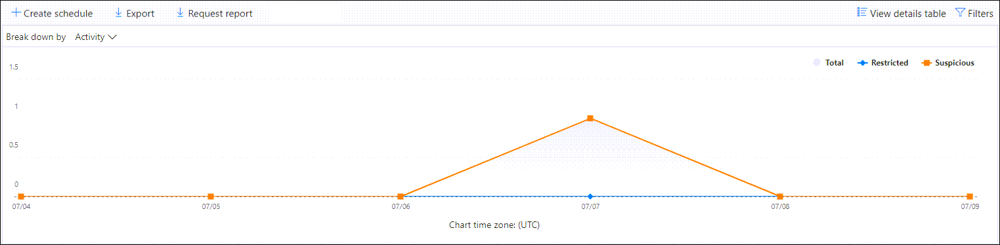
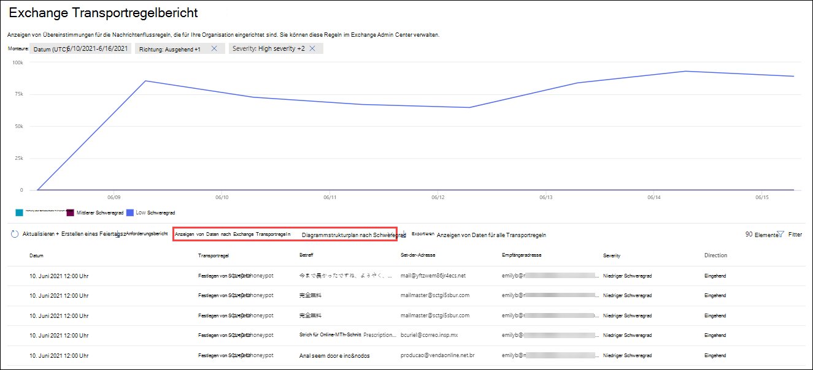
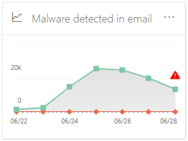
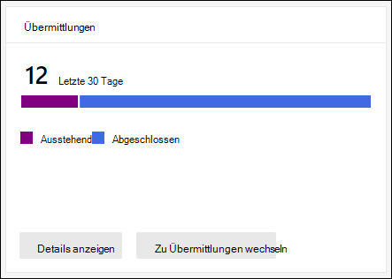
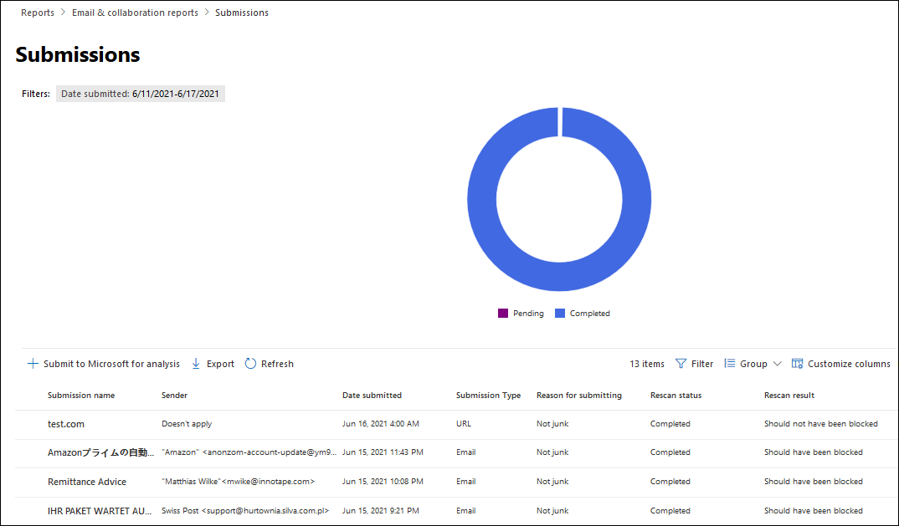
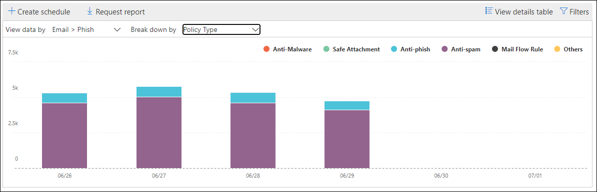
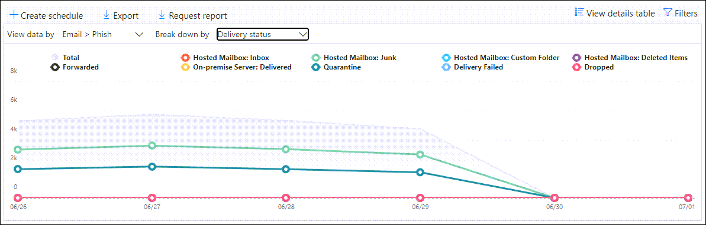
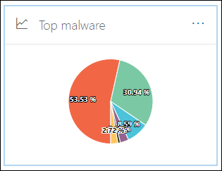

# Anzeigen von E-Mail-Sicherheitsberichten im Microsoft 365 Defender Portal

[!INCLUDE [Microsoft 365 Defender rebranding](../includes/microsoft-defender-for-office.md)]

**Gilt für**
- [Exchange Online Protection](exchange-online-protection-overview.md)
- [Microsoft Defender für Office 365 Plan 1 und Plan 2](defender-for-office-365.md)
- [Microsoft 365 Defender](../defender/microsoft-365-defender.md)

Eine Vielzahl von Berichten finden Sie im Microsoft 365 Defender Portal <https://security.microsoft.com> unter, um zu sehen, wie E-Mail-Sicherheitsfeatures wie Antispam, Antischadsoftware und Verschlüsselungsfunktionen in Microsoft 365 Ihre Organisation schützen. Wenn Sie über die [erforderlichen Berechtigungen](#what-permissions-are-needed-to-view-these-reports)verfügen, können Sie diese Berichte im Microsoft 365 Defender Portal anzeigen, indem Sie zu  \> **E-Mail-Berichte &** \> **Zusammenarbeit E-Mail & Zusammenarbeitsberichte wechseln.** To go directly to the **Email & collaboration reports** page, open <https://security.microsoft.com/emailandcollabreport> .

> [!NOTE]
>
> Einige der Berichte auf der Seite **"E-Mail & Zusammenarbeitsberichte"** erfordern Microsoft Defender für Office 365. Informationen zu diesen Berichten finden Sie unter Anzeigen von [Defender für Office 365 Berichte im Microsoft 365 Defender Portal.](view-reports-for-mdo.md)
>
> Berichte, die sich auf den Nachrichtenfluss beziehen, befinden sich jetzt im Exchange Admin Center (EAC). Weitere Informationen zu diesen Berichten finden Sie unter [Nachrichtenflussberichte im neuen Exchange Admin Center.](/exchange/monitoring/mail-flow-reports/mail-flow-reports)

## Bericht "Kompromittierte Benutzer"

> [!NOTE]
> Dieser Bericht ist in Microsoft 365 Organisationen mit Exchange Online Postfächern verfügbar. Es ist in eigenständigen Exchange Online Protection (EOP)-Organisationen nicht verfügbar.

Der Bericht **"Kompromittierte Benutzer"** zeigt die Anzahl der Benutzerkonten an, die innerhalb der letzten 7 Tage als **verdächtig** oder **eingeschränkt** markiert wurden. Konten in einem dieser Zustände sind problematisch oder sogar kompromittiert. Bei häufiger Verwendung können Sie den Bericht verwenden, um Spitzen und sogar Trends in verdächtigen oder eingeschränkten Konten zu erkennen. Weitere Informationen zu kompromittierten Benutzern finden Sie unter [Antworten auf ein kompromittiertes E-Mail-Konto.](responding-to-a-compromised-email-account.md)

In der Aggregatansicht werden Daten für die letzten 90 Tage und in der Detailansicht Daten für die letzten 30 Tage angezeigt.

To view the report in the Microsoft 365 Defender portal, go to **Reports** \> **Email & collaboration** Email & collaboration \> **reports**. Suchen Sie auf der Seite **"E-Mail & Zusammenarbeitsberichte"** **kompromittierte Benutzer,** und klicken Sie dann auf **"Details anzeigen".** Um direkt zum Bericht zu wechseln, öffnen Sie <https://security.microsoft.com/reports/CompromisedUsers> .

Auf der Seite **"Kompromittierte Benutzer"** können Sie sowohl das Diagramm als auch die Detailtabelle filtern, indem Sie auf **"Filtern"** klicken und einen oder mehrere der folgenden Werte im angezeigten Flyout auswählen:

- **Datum (UTC):** **Startdatum** und **Enddatum.**
- **Aktivität:**
  - **Verdächtig:** Das Benutzerkonto hat verdächtige E-Mails gesendet und besteht das Risiko, dass das Senden von E-Mails eingeschränkt wird.
  - **Eingeschränkt:** Das Benutzerkonto wurde aufgrund von hochgradig verdächtigen Mustern am Senden von E-Mails gehindert.

Wenn Sie die Konfiguration der Filter abgeschlossen haben, klicken Sie auf **"Anwenden",** **"Abbrechen"** oder **"Filter löschen".**

In der Detailtabelle unterhalb des Diagramms sehen Sie die folgenden Details:

- **Erstellungszeitpunkt**
- **Benutzer-ID**
- **Action**

## Exchange-Transportregelbericht

Der **Bericht Exchange Transportregel** zeigt die Auswirkungen von Nachrichtenflussregeln (auch als Transportregeln bezeichnet) auf ein- und ausgehende Nachrichten in Ihrer Organisation an.

To view the report in the Microsoft 365 Defender portal, go to **Reports** \> **Email & collaboration** Email & collaboration \> **reports**. Suchen Sie auf der Seite **"E-Mail & Zusammenarbeitsberichte"** **nach Exchange Transportregel,** und klicken Sie dann auf **Details anzeigen.** Um direkt zum Bericht zu wechseln, öffnen Sie <https://security.microsoft.com/reports/ETRRuleReport> .

Auf der Seite **Exchange Transportregelbericht** werden die verfügbaren Diagramme und Daten in den folgenden Abschnitten beschrieben.

### Diagrammstrukturplan nach Richtung

Wenn Sie **die Diagrammstrukturstruktur nach Richtung** auswählen, sind die folgenden Diagramme verfügbar:

- **Anzeigen von Daten nach Exchange Transportregeln:** Die Anzahl der **eingehenden** und **ausgehenden** Nachrichten, die von Nachrichtenflussregeln betroffen waren.
- **Anzeigen von Daten nach DLP Exchange Transportregeln:** Die Anzahl der **eingehenden** und **ausgehenden** Nachrichten, die von DLP-Nachrichtenflussregeln (Data Loss Prevention, Verhinderung von Datenverlust) betroffen waren.

Die folgenden Informationen werden in der Detailtabelle unterhalb des Diagramms angezeigt:

- **Date**
- **DLP-Richtlinie** (**Daten nur von DLP Exchange Transportregeln anzeigen)**
- **Transportregel**
- **Betreff**
- **Absenderadresse**
- **Empfängeradresse**
- **Schweregrad**
- **Richtung**

Sie können sowohl das Diagramm als auch die Detailtabelle filtern, indem Sie auf **"Filtern"** klicken und einen oder mehrere der folgenden Werte im angezeigten Flyout auswählen:

- **Datum (UTC)** **Startdatum** und **Enddatum**
- **Richtung:** **Ausgehend** und **Eingehend**
- **Schweregrad:** **Hoher,** **mittlerer und** niedriger **Schweregrad**

Wenn Sie die Konfiguration der Filter abgeschlossen haben, klicken Sie auf **"Anwenden",** **"Abbrechen"** oder **"Filter löschen".**

### Diagrammstrukturplan nach Schweregrad

Wenn Sie **die Diagrammstrukturstruktur nach Schweregrad** auswählen, sind die folgenden Diagramme verfügbar:

- **Anzeigen von Daten nach Exchange Transportregeln:** Die Anzahl der Nachrichten mit **hohem,** **mittlerem und** **mittlerem Schweregrad.** Sie legen den Schweregrad als Aktion in der Regel fest (**Überwachen Sie diese Regel mit Schweregrad** oder _SetAuditSeverity_). Weitere Informationen finden Sie unter [Nachrichtenflussregelaktionen in Exchange Online](/Exchange/security-and-compliance/mail-flow-rules/mail-flow-rule-actions).

- **Anzeigen von Daten nach DLP Exchange Transportregeln:** Die Anzahl der Nachrichten mit **hohem,** **mittlerem und** **mittlerem** Schweregrad, die von DLP-Nachrichtenflussregeln betroffen waren.

Die folgenden Informationen werden in der Detailtabelle unterhalb des Diagramms angezeigt:

- **Date**
- **DLP-Richtlinie** (**Daten nur von DLP Exchange Transportregeln anzeigen)**
- **Transportregel**
- **Betreff**
- **Absenderadresse**
- **Empfängeradresse**
- **Schweregrad**
- **Richtung**

Sie können sowohl das Diagramm als auch die Detailtabelle filtern, indem Sie auf **"Filtern"** klicken und einen oder mehrere der folgenden Werte im angezeigten Flyout auswählen:

- **Datum (UTC)** **Startdatum** und **Enddatum**
- **Richtung:** **Ausgehend** und **Eingehend**
- **Schweregrad:** **Hoher,** **mittlerer und** niedriger **Schweregrad**

Wenn Sie die Konfiguration der Filter abgeschlossen haben, klicken Sie auf **"Anwenden",** **"Abbrechen"** oder **"Filter löschen".**

## Weiterleitungsbericht

> [!NOTE]
> Der **Weiterleitungsbericht** ist jetzt im EAC verfügbar. Weitere Informationen finden Sie unter [Bericht über automatisch weitergeleitete Nachrichten im neuen EAC.](/exchange/monitoring/mail-flow-reports/mfr-auto-forwarded-messages-report)

## E-Mailflow-Statusbericht

Der **E-Mailflow-Statusbericht** ist ein intelligenter Bericht, der Informationen zu eingehenden und ausgehenden E-Mails, Spamerkennungen, Schadsoftware, als "gut" identifizierten E-Mails und Informationen zu E-Mails anzeigt, die am Edge zugelassen oder blockiert werden. Dies ist der einzige Bericht, der Edge-Schutzinformationen enthält, und zeigt an, wie viele E-Mails blockiert werden, bevor sie zur Auswertung durch Exchange Online Protection (EOP) in den Dienst zugelassen werden. Es ist wichtig zu verstehen, dass eine Nachricht, die an fünf Empfänger gesendet wird, als fünf verschiedene Nachrichten und nicht als eine Nachricht gezählt wird.

To view the report in the Microsoft 365 Defender portal, go to **Reports** \> **Email & collaboration** Email & collaboration \> **reports**. Suchen Sie auf der Seite **"E-Mail & Zusammenarbeitsberichte"** die Zusammenfassung des **E-Mail-Flussstatus,** und klicken Sie dann auf **"Details anzeigen".** Um direkt zum Bericht zu wechseln, öffnen Sie <https://security.microsoft.com/reports/mailflowStatusReport> .

### Typansicht für den Mailflow-Statusbericht

Auf der Seite **E-Mailflow-Statusbericht** ist die Registerkarte Typ standardmäßig ausgewählt.  Standardmäßig enthält diese Ansicht ein Diagramm und eine Detailtabelle, die mit den folgenden Filtern konfiguriert ist:

- **Datum (UTC)** Die letzten 7 Tage.
- **E-Mail-Richtung:**
  - **Eingehende**
  - **Ausgehend**
  - **Organisationsinternes:** Diese Anzahl gilt für Nachrichten innerhalb eines Mandanten, d. h. absender abc@domain.com sendet an empfänger xyz@domain.com (getrennt von **ein-** und **ausgehend** gezählt)
- **Typ:**
  - **Gute E-Mails**
  - **Schadsoftware**
  - **Spam**
  - **Edgeschutz**
  - **Regelnachrichten**
  - **Phishing-E-Mail**
- **Domäne:** **Alle**

Das Diagramm ist nach den **Type-Werten** organisiert.

Sie können diese Filter ändern, indem Sie auf **"Filter"** klicken.

Die folgenden Informationen werden in der Detailtabelle unterhalb des Diagramms angezeigt:

- **Richtung**
- **Typ**
- **24 Stunden**
- **3 Tage**
- **7 Tage**
- **15 Tage**
- **30 Tage**

Wenn Sie auf **"Kategorie auswählen"** klicken, um weitere Details zu erhalten, können Sie aus den folgenden Werten auswählen:

- **Phishing-E-Mail:** Diese Auswahl führt Sie zum Statusbericht zum [Bedrohungsschutz.](view-email-security-reports.md#threat-protection-status-report)
- **Schadsoftware in E-Mails:** Diese Auswahl führt Sie zum [Bedrohungsschutzstatusbericht.](view-email-security-reports.md#threat-protection-status-report)
- **Spamerkennungen:** Diese Auswahl führt Sie zum [Spamerkennungsbericht.](view-email-security-reports.md#spam-detections-report)
- **Edge blockierter Spam:** Diese Auswahl führt Sie zum [Spamerkennungsbericht.](view-email-security-reports.md#spam-detections-report)

#### Exportieren aus der Typansicht

Für die Detailansicht können Sie nur Daten für einen Tag exportieren. Wenn Sie Also Daten für 7 Tage exportieren möchten, müssen Sie 7 verschiedene Exportaktionen ausführen.

Jede exportierte .csv Datei ist auf 150.000 Zeilen beschränkt. Wenn die Daten für diesen Tag mehr als 150.000 Zeilen enthalten, werden mehrere .csv Dateien erstellt.

### Richtungsansicht für den Mailflow-Statusbericht

Wenn Sie auf die Registerkarte **"Richtung"** klicken, werden die gleichen Standardfilter aus der **Typansicht** verwendet.

Das Diagramm ist nach **Richtungswerten** organisiert.

Sie können diese Filter ändern, indem Sie auf **"Filter"** klicken. Es werden dieselben Filter aus der **Typansicht** verwendet.

Die Detailtabelle enthält dieselben Informationen aus der **Typansicht.**

The **Choose a category for more details** available selections and behavior are the same as the **Type** view.

#### Exportieren aus der Richtungsansicht

Für die Detailansicht können Sie nur Daten für einen Tag exportieren. Wenn Sie Also Daten für 7 Tage exportieren möchten, müssen Sie 7 verschiedene Exportaktionen ausführen.

Jede exportierte .csv Datei ist auf 150.000 Zeilen beschränkt. Wenn die Daten für diesen Tag mehr als 150.000 Zeilen enthalten, werden mehrere .csv Dateien erstellt.

### Trichteransicht für den Mailflow-Statusbericht

Die **Trichteransicht** zeigt Ihnen, wie die E-Mail-Bedrohungsschutzfeatures von Microsoft eingehende und ausgehende E-Mails in Ihrer Organisation filtern. Es enthält Details zur Gesamtzahl der E-Mails und dazu, wie sich die konfigurierten Bedrohungsschutzfeatures, einschließlich Edgeschutz, Antischadsoftware, Antiphishing, Antispam und Antispoofing, auf diese Anzahl auswirken.

Wenn Sie auf die Registerkarte **"Trichter"** klicken, enthält diese Ansicht standardmäßig ein Diagramm und eine Detailtabelle, die mit den folgenden Filtern konfiguriert ist:

- **Datum:** Die letzten 7 Tage.

- **Richtung:**
  - **Eingehende**
  - **Ausgehend**
  - **Organisationsintern:** Diese Anzahl gilt für Nachrichten, die innerhalb eines Mandanten gesendet werden; d. h. Absender abc@domain.com sendet an Empfänger xyz@domain.com (separat von Ein- und Ausgehend gezählt).

Die Aggregatansicht und die Detailtabellenansicht ermöglichen eine Filterung von 90 Tagen.

Sie können diese Filter ändern, indem Sie auf **"Filter"** klicken. Es werden dieselben Filter aus der **Typansicht** verwendet.

Dieses Diagramm zeigt die E-Mail-Anzahl nach:

- **E-Mail-Gesamtanzahl**
- **E-Mail nach Edgeschutz**
- **E-Mail nach Transportregel** (Nachrichtenflussregel)
- **E-Mail nach Antischadsoftware, Dateireputation, Dateitypblockierung**
- **E-Mail nach Antiphishing, URL-Reputation, Markenidentitätswechsel, Antispoofing**
- **E-Mails nach Antispam, Massenfilterung von E-Mails**
- **E-Mail nach Benutzer- und Domänenidentitätswechsel**\*
- **E-Mail nach Datei- und URL-Detonation**\*
- **E-Mails, die nach der Zustellung als gutartig erkannt wurden (URL-Click-Time-Schutz)**

\*Nur Defender für Office 365

Um die von EOP oder Defender gefilterte E-Mail für Office 365 separat anzuzeigen, klicken Sie auf den Wert in der Diagrammlegende.

Die Detailtabelle enthält die folgenden Informationen, die in absteigender Datumsreihenfolge angezeigt werden:

- **Date**
- **E-Mail-Gesamtanzahl**
- **Edgeschutz**
- **Antischadsoftware, Dateireputation, Dateitypblock:**
  - **Dateizuruf:** Nachrichten, die aufgrund der Identifizierung einer angefügten Datei von anderen Microsoft-Kunden gefiltert wurden.
  - **Dateitypblock:** Nachrichten, die aufgrund des typs der in der Nachricht identifizierten schädlichen Datei gefiltert wurden.
- **Antiphishing, URL-Zuverlässigkeit, Markenidentitätswechsel, Antispoofing:**
  - **URL-Zuverlässigkeit:** Nachrichten, die aufgrund der Identifizierung der URL von anderen Microsoft-Kunden gefiltert wurden.
  - **Markenidentitätswechsel:** Nachrichten, die aufgrund der Nachricht gefiltert wurden, die von bekannten Absendern als Absender imitiert wurde.
  - **Antispoofing:** Nachrichten, die aufgrund der Nachricht gefiltert wurden, die versucht, eine Domäne zu spoofen, zu der der Empfänger gehört, oder einer Domäne, die der Absender der Nachricht nicht besitzt.
- **Antispam, Massen-E-Mail-Filterung:**
  - **Massen-E-Mail-Filterung:** Nachrichten, die basierend auf dem BCL-Schwellenwert (Bulk Complain Level) in einer Antispamrichtlinie gefiltert werden.
- **Benutzer- und Domänenidentitätswechsel (Defender für Office 365):**
  - **Benutzeridentitätswechsel:** Nachrichten, die aufgrund eines Versuchs gefiltert wurden, einen Benutzer (Nachrichtensender) zu imitieren, der in den Identitätswechselschutzeinstellungen einer Antiphishingrichtlinie definiert ist.
  - **Domänenidentitätswechsel:** Nachrichten, die aufgrund eines Versuchs gefiltert wurden, eine Domäne zu imitieren, die in den Identitätswechselschutzeinstellungen einer Antiphishingrichtlinie definiert ist.
- **Datei- und URL-Detonation (Defender für Office 365):**
  - **Dateidetonation:** Nachrichten, die nach einer Tresor Anlagenrichtlinie gefiltert sind.
  - **URL-Detonation:** Nachricht, gefiltert nach einer Tresor-Verknüpfungsrichtlinie.
- **Schutz nach der Zustellung und ZAP (ATP) oder ZAP (EOP):** Automatische Nullstunde-Bereinigung (ZAP) für Schadsoftware, Spam und Phishing.

Wenn Sie eine Zeile in der Detailtabelle auswählen, wird im Flyout eine weitere Aufschlüsselung der E-Mail-Anzahl angezeigt.

#### Exportieren aus der Trichteransicht

Nachdem Sie unter **"Optionen"** auf **"Exportieren"** geklickt haben, können Sie einen der folgenden Werte auswählen:

- **Zusammenfassung (mit Daten für die letzten 90 Tage)**
- **Details (mit Daten für die letzten 30 Tage)**

Wählen Sie unter **Datum** einen Bereich aus, und klicken Sie dann auf **Übernehmen .** Daten für die aktuellen Filter werden in eine .csv Datei exportiert.

Jede exportierte .csv Datei ist auf 150.000 Zeilen beschränkt. Wenn die Daten mehr als 150.000 Zeilen enthalten, werden mehrere .csv Dateien erstellt.

### Tech-Ansicht für den Mailflow-Statusbericht

Die **Tech-Ansicht** ähnelt der **Trichteransicht** und bietet detailliertere Details für die konfigurierten Funktionen zum Schutz vor Bedrohungen. Im Diagramm können Sie sehen, wie Nachrichten in den verschiedenen Phasen des Bedrohungsschutzes kategorisiert werden.

Wenn Sie standardmäßig auf die Registerkarte **"Tech-Ansicht"** klicken, enthält diese Ansicht ein Diagramm und eine Detailtabelle, die mit den folgenden Filtern konfiguriert sind:

- **Datum:** Die letzten 7 Tage.

- **Richtung:**
  - **Eingehende**
  - **Ausgehend**
  - **Organisationsinternes:** Diese Anzahl gilt für Nachrichten innerhalb eines Mandanten, d. h. absender abc@domain.com sendet an empfänger xyz@domain.com (getrennt von eingehenden und ausgehenden Zählungen)

Die Aggregatansicht und die Detailtabellenansicht ermöglichen eine Filterung von 90 Tagen.

Sie können diese Filter ändern, indem Sie auf **"Filter"** klicken. Es werden dieselben Filter aus der **Typansicht** verwendet.

Dieses Diagramm zeigt Nachrichten, die in die folgenden Kategorien unterteilt sind:

- **E-Mail-Gesamtanzahl**
- **Edge zulassen** und **Edge gefiltert**
- **Transportregel zulassen** und **Transportregel gefiltert** (Nachrichtenflussregeln)
- **Keine Schadsoftware,** **Tresor Erkennung von Anlagen** und Erkennung von \* **Antischadsoftwaremodulen**
- **Keine Phishing-,** **DMARC-Fehler,** **Identitätswechselerkennung,** \* **Spooferkennung** und **Phishing-Erkennung**
- **Keine Erkennung mit URL-Detonation** und **URL-Detonationserkennung**\*
- **Keine Spam-** und  **Spamnachrichten**
- **Nicht böswillige E-Mails,** **Tresor-Links-Erkennung** \* und **ZAP**

\*Defender für Office 365

Wenn Sie mit dem Mauszeiger auf eine Kategorie im Diagramm zeigen, können Sie die Anzahl der Nachrichten in dieser Kategorie anzeigen.

Die Detailtabelle enthält die folgenden Informationen, die in absteigender Datumsreihenfolge angezeigt werden:

- **Datum (UTC)**
- **E-Mail-Gesamtanzahl**
- **Edge gefiltert**
- **Regelnachrichten:** Nachrichten, die aufgrund von Nachrichtenflussregeln gefiltert wurden (auch als Transportregeln bezeichnet).
- **Antischadsoftwaremodul**, **Tresor** \* Anlagen:
- **DMARC, Identitätswechsel,** \* **Spoofing**, **Phishing gefiltert:**
  - **DMARC:** Nachrichten, die aufgrund eines Fehlers bei der DMARC-Authentifizierungsprüfung gefiltert wurden.
- **ERKENNUNG DER URL-Detonation**\*
- **Antispam gefiltert**
- **ZAP entfernt**
- **Erkennung durch Tresor Links**\*

\*Defender für Office 365

Wenn Sie eine Zeile in der Detailtabelle auswählen, wird im Flyout eine weitere Aufschlüsselung der E-Mail-Anzahl angezeigt.

#### Exportieren aus der Tech-Ansicht

Wenn Sie auf **"Exportieren"** klicken, können Sie unter **"Optionen"** einen der folgenden Werte auswählen:

- **Zusammenfassung (mit Daten für die letzten 90 Tage)**
- **Details (mit Daten für die letzten 30 Tage)**

Wählen Sie unter **Datum** einen Bereich aus, und klicken Sie dann auf **Übernehmen .** Daten für die aktuellen Filter werden in eine .csv Datei exportiert.

Jede exportierte .csv Datei ist auf 150.000 Zeilen beschränkt. Wenn die Daten mehr als 150.000 Zeilen enthalten, werden mehrere .csv Dateien erstellt.

## Bericht über Schadsoftwareerkennungen

Der Bericht über **Schadsoftwareerkennungen** enthält Informationen zu Schadsoftwareerkennungen in eingehenden und ausgehenden E-Mail-Nachrichten (von Exchange Online Protection oder EOP erkannte Schadsoftware). Weitere Informationen zum Schutz vor Schadsoftware in EOP finden Sie unter [Antischadsoftwareschutz in EOP.](anti-malware-protection.md)

Der Aggregatansichtsfilter lässt 90 Tage zu, während der Detailtabellenfilter nur 10 Tage zulässt.

To view the report in the Microsoft 365 Defender portal, go to **Reports** \> **Email & collaboration** Email & collaboration \> **reports**. Suchen Sie auf der Seite **"E-Mail & Zusammenarbeitsberichte"** nach Schadsoftware, die **in E-Mails erkannt wurde,** und klicken Sie dann auf **Details anzeigen.** Um direkt zum Bericht zu wechseln, öffnen Sie <https://security.microsoft.com/reports/MalwareDetections> .

Auf der Berichtsseite **für Schadsoftwareerkennungen** können Sie sowohl das Diagramm als auch die Detailtabelle filtern, indem Sie auf **"Filtern"** klicken und einen der folgenden Werte auswählen:

- **Datum (UTC)** **Startdatum** und **Enddatum**
- **Richtung:** **Ein-** und **Ausgehend**

In der Detailtabelle unterhalb des Diagramms sehen Sie die folgenden Details:

- **Date**
- **Absenderadresse**
- **Empfängeradresse**
- **Nachrichten-ID:** Verfügbar im **Nachrichten-ID-Kopfzeilenfeld** im Nachrichtenkopf und sollte eindeutig sein. Ein Beispielwert ist `<08f1e0f6806a47b4ac103961109ae6ef@server.domain>` (beachten Sie die spitzen Klammern).
- **Betreff**
- **Filename**
- **Name der Schadsoftware**

## E-Mail-Latenzbericht

Der **E-Mail-Latenzbericht** in Defender für Office 365 enthält Informationen zur E-Mail-Zustellungs- und Detonationslatenz in Ihrer Organisation. Weitere Informationen finden Sie im [E-Mail-Latenzbericht.](view-reports-for-mdo.md#mail-latency-report)

## Spamerkennungsbericht

> [!NOTE]
> Der **Spamerkennungsbericht** wird schließlich entfernt. Die gleichen Informationen sind im [Bedrohungsschutzstatusbericht](#threat-protection-status-report)verfügbar.

## Bericht über Spooferkennungen

> [!NOTE]
> Der verbesserte Bericht über Spooferkennungen, wie in diesem Artikel beschrieben, befindet sich in der Vorschau, kann geändert werden und ist nicht in allen Organisationen verfügbar. Die ältere Version des Berichts zeigt nur **gute E-Mails** und **"Als Spam abgefangen"** an.

Der Bericht **"Spooferkennungen"** enthält Informationen zu Nachrichten, die aufgrund von Spoofing blockiert oder zugelassen wurden. Weitere Informationen zum Spoofing finden Sie unter [Antispoofingschutz in EOP.](anti-spoofing-protection.md)

Die Aggregatansicht des Berichts lässt 45 Tage Filterung \* zu, während die Detailansicht nur zehn Tage Filterung zulässt.

\* Schließlich können Sie die Filterung bis zu 90 Tage verwenden.

To view the report in the Microsoft 365 Defender portal, go to **Reports** \> **Email & collaboration** Email & collaboration \> **reports**. Suchen Sie auf der Seite **"E-Mail & Zusammenarbeitsberichte"** **nach Spooferkennungen,** und klicken Sie dann auf **"Details anzeigen".** Um direkt zum Bericht zu wechseln, öffnen Sie <https://security.microsoft.com/reports/SpoofMailReportV2> .

Das Diagramm zeigt die folgenden Informationen:

- **bestehen**
- **Fehler**
- **SoftPass**
- **Keine**
- **Other**

Wenn Sie den Mauszeiger über einen Tag (Datenpunkt) im Diagramm bewegen, können Sie sehen, wie viele gefälschte Nachrichten erkannt wurden und warum.

Auf der Seite **"Spoof-E-Mail-Bericht"** können Sie sowohl das Diagramm als auch die Detailtabelle filtern, indem Sie auf **"Filtern"** klicken und einen oder mehrere der folgenden Werte auswählen:

- **Datum (UTC)** **Startdatum** und **Enddatum**
- **Ergebnis:**
  - **bestehen**
  - **Fehler**
  - **SoftPass**
  - **Keine**
  - **Other**
- **Spooftyp:** **Intern** und **extern**

In der Detailtabelle unterhalb des Diagramms sehen Sie die folgenden Details:

- **Date**
- **Gefälschter Benutzer**
- **Senden der Infrastruktur**
- **Spooftyp**
- **Ergebnis**
- **Ergebniscode**
- **SPF**
- **DKIM**
- **DMARC**
- **Nachrichtenanzahl**

Weitere Informationen zu Ergebniscodes für die zusammengesetzte Authentifizierung finden Sie unter [Antispam-Nachrichtenkopfzeilen in Microsoft 365.](anti-spam-message-headers.md)

## Übermittlungsbericht

Der **Bericht "Übermittlungen"** enthält Informationen zu Elementen, die Administratoren microsoft zur Analyse gemeldet haben. Weitere Informationen finden Sie unter ["Verwenden der Administratorübermittlung" zum Übermitteln von verdächtigem Spam, Phishing, URLs und Dateien an Microsoft.](admin-submission.md)

To view the report in the Microsoft 365 Defender portal, go to **Reports** \> **Email & collaboration** Email & collaboration \> **reports**. Suchen Sie auf der Seite **"E-Mail & Zusammenarbeitsberichte"** **nach Übermittlungen,** und klicken Sie dann auf **"Details anzeigen".** Um direkt zum Bericht zu wechseln, öffnen Sie <https://security.microsoft.com/adminSubmissionReport> . Wenn Sie im Microsoft 365 Defender Portal zu [Administratorübermittlungen](admin-submission.md)wechseln möchten, klicken Sie auf **"Zu Übermittlungen wechseln".**

Das Diagramm zeigt die folgenden Informationen:

- **Ausstehend**
- **Abgeschlossen**

Auf der Seite **"Übermittlungen"** können Sie sowohl das Diagramm als auch die Detailtabelle filtern, indem Sie auf **"Filtern"** klicken und einen oder mehrere der folgenden Werte auswählen:

- **Gemeldetes Datum**: **Startzeit** und **Endzeit**
- **Übermittlungstyp:**
  - **E-Mail**
  - **URL**
  - **Datei**
- **Übermittlungs-ID**
- **Netzwerknachrichten-ID**
- **Sender**
- **Name**
- **Übermittelt von**
- **Grund für die Übermittlung:**
  - **Kein Junk**
  - **Phishing**
  - **Schadsoftware**
  - **Spam**
- **Status des erneuten Scannens:**
  - **Ausstehend**
  - **Abgeschlossen**

Die Detailtabelle unterhalb des Diagramms zeigt die gleichen Informationen und verfügt über die gleichen **Gruppen-** oder **Anpassungsspaltenoptionen** wie auf der Registerkarte **"Für Analyse übermittelt"** unter **"E-Mail &** \> **Übermittlungen für die** Zusammenarbeit". Weitere Informationen finden Sie unter [Anzeigen von Administratorübermittlungen an Microsoft.](admin-submission.md#view-admin-submissions-to-microsoft)

## Threat Protection-Statusbericht

Der **Bedrohungsschutzstatusbericht** ist sowohl in EOP als auch in Defender für Office 365 verfügbar. Die Berichte enthalten jedoch unterschiedliche Daten. Beispielsweise können EOP-Kunden Informationen zu Schadsoftware anzeigen, die in E-Mails erkannt wurde, aber keine Informationen zu schädlichen Dateien, die von [Tresor Anlagen für SharePoint, OneDrive und Microsoft Teams](mdo-for-spo-odb-and-teams.md)erkannt wurden.

Der Bericht enthält die Anzahl der E-Mail-Nachrichten mit schädlichen Inhalten, z. B. Dateien oder Websiteadressen (URLs), die vom Antischadsoftwaremodul blockiert wurden, ZAP [(Zero-Hour Auto Purge)](zero-hour-auto-purge.md)und Defender für Office 365 Features wie [Tresor Links,](safe-links.md)Tresor Anlagen und [Identitätswechselschutzfeatures in Antiphishingrichtlinien.](set-up-anti-phishing-policies.md#exclusive-settings-in-anti-phishing-policies-in-microsoft-defender-for-office-365)  Anhand dieser Informationen können Sie Trends erkennen oder ermitteln, ob Die Unternehmensrichtlinien angepasst werden müssen.

**Hinweis:** Es ist wichtig zu wissen, dass eine Nachricht, die an fünf Empfänger gesendet wird, als fünf verschiedene Nachrichten und nicht als eine Nachricht gezählt wird.

To view the report in the Microsoft 365 Defender portal, go to **Reports** \> **Email & collaboration** Email & collaboration \> **reports**. Suchen Sie auf der Seite **"E-Mail & Zusammenarbeitsberichte"** den **Status des Bedrohungsschutzes,** und klicken Sie dann auf **"Details anzeigen".** Um direkt zum Bericht zu wechseln, öffnen Sie eine der folgenden URLs:

- Defender für Office 365:<https://security.microsoft.com/reports/TPSAggregateReportATP>
- Eop: <https://security.microsoft.com/reports/TPSAggregateReport>

Standardmäßig werden im Diagramm Daten für die letzten 7 Tage angezeigt. Wenn Sie auf der Seite **"Bedrohungsschutzstatusbericht"** auf **"Filtern"** klicken, können Sie einen Zeitraum von 90 Tagen auswählen (Testabonnements sind möglicherweise auf 30 Tage begrenzt). Die Detailtabelle ermöglicht das Filtern für 30 Tage.

Die verfügbaren Ansichten werden in den folgenden Abschnitten beschrieben.

### Anzeigen von Daten nach Übersicht

In der Ansicht **"Ansichtsdaten nach Übersicht"** werden die folgenden Erkennungsinformationen im Diagramm angezeigt:

- **E-Mail-Schadsoftware**
- **E-Mail-Phishing**
- **Inhalts-Schadsoftware**

Unterhalb des Diagramms ist keine Detailtabelle verfügbar.

Wenn Sie auf **"Filter"** klicken, sind die folgenden Filter verfügbar:

- **Datum (UTC)** **Startdatum** und **Enddatum**
- **Erkennung:** **E-Mail-Schadsoftware,** **E-Mail-Phishing** oder **Inhalts-Schadsoftware**
- **Geschützt durch:** **MDO** (Defender für Office 365) oder **EOP**
- **Tag:** Filtert die Ergebnisse nach Benutzern oder Gruppen, auf die das angegebene Benutzertag angewendet wurde (einschließlich Prioritätskonten). Weitere Informationen zu Benutzertags finden Sie unter [Benutzertags.](user-tags.md)
- **Richtung**
- **Domäne**
- **Richtlinientyp**

Wenn Sie die Konfiguration der Filter abgeschlossen haben, klicken Sie auf **"Anwenden",** **"Abbrechen"** oder **"Filter löschen".**

### Anzeigen von Daten nach E-Mail-Phishing \> und Diagrammstrukturplan nach Erkennungstechnologie

In the **View data by Email \> Phish** and **Chart breakdown by Detection Technology** view, the following information is shown in the chart:

- **URL-Böswillige Reputation:** \* Bösartige URL-Reputation, die von Defender für Office 365 Detonationen in anderen Microsoft 365 Kunden generiert wurde.
- **Erweiterter Filter:** Phishingsignale basierend auf maschinellem Lernen.
- **Allgemeiner Filter:** Phishingsignale basierend auf Analystenregeln.
- **Organisationsinternes Spoofing:** Der Absender versucht, die Empfängerdomäne zu spoofen.
- **Spoofing externer Domäne:** Der Absender versucht, eine andere Domäne zu spoofen.
- **Spoofing von DMARC:** DMARC-Authentifizierungsfehler bei Nachrichten.
- **Identitätswechselmarke:** Identitätswechsel bekannter Marken basierend auf Absendern.
- **Erkennung durch gemischte Analysen**
- **Datei-Reputation**
- **Fingerabdruckübereinstimmung**
- **Zuverlässigkeit der URL-Detonation**\*
- **URL-Detonation**\*
- **Identitätswechselbenutzer**\*
- **Identitätswechseldomäne:** \* Identitätswechsel von Domänen, die der Kunde besitzt oder definiert.
- **Identitätswechsel bei der Postfachintelligenz:** \* Identitätswechsel von Benutzern, die vom Administrator definiert oder durch die Postfachintelligenz gelernt wurden.
- **Dateidetonation**\*
- **Kampagne**\*

In der Detailtabelle unterhalb des Diagramms sind die folgenden Informationen verfügbar:

- **Date**
- **Betreff**
- **Sender**
- **Recipients**
- **Erkannt von**
- **Übermittlungsstatus**
- **Quelle der Kompromitt**
- **Tags**

Wenn Sie auf **"Filter"** klicken, sind die folgenden Filter verfügbar:

- **Datum (UTC)** **Startdatum** und **Enddatum**
- **Erkennung**
- **Geschützt durch:** **MDO** (Defender für Office 365) oder **EOP**
- **Richtung**
- **Tag:** Filtert die Ergebnisse nach Benutzern oder Gruppen, auf die das angegebene Benutzertag angewendet wurde (einschließlich Prioritätskonten). Weitere Informationen zu Benutzertags finden Sie unter [Benutzertags.](user-tags.md)
- **Domäne**
- **Richtlinientyp**
- **Richtlinienname** (nur Detailtabelle)
- **Empfänger**

Wenn Sie die Konfiguration der Filter abgeschlossen haben, klicken Sie auf **"Anwenden",** **"Abbrechen"** oder **"Filter löschen".**

### Anzeigen von Daten nach \> E-Mail-Schadsoftware und Diagrammstrukturplan nach Erkennungstechnologie

In der **Ansicht Ansichtsdaten nach E-Mail-Schadsoftware \>** und **Diagrammstrukturplan nach Erkennungstechnologie** werden die folgenden Informationen im Diagramm angezeigt:

- **Dateidetonation:** \* Erkennung durch Tresor Anlagen.
- **Zuverlässigkeit der Dateidetonation:** \* Alle bösartigen Dateireputationen, die von Defender für Office 365 Detonationen generiert wurden.
- **Datei-Reputation**
- **Antischadsoftwaremodul:** \* Erkennung von Antischadsoftwaremodulen.
- Dateitypblock für **Antischadsoftwarerichtlinie:** Hierbei handelt es sich um E-Mail-Nachrichten, die aufgrund des in der Nachricht identifizierten Typs bösartiger Dateien herausgefiltert werden.
- **URL-Reputation als schädlich eingestuft**
- **URL-Detonation**
- **Reputation der URL-Detonation**
- **Kampagnen**

In der Detailtabelle unterhalb des Diagramms sind die folgenden Informationen verfügbar:

- **Date**
- **Betreff**
- **Sender**
- **Recipients**
- **Erkannt von**
- **Übermittlungsstatus**
- **Quelle der Kompromitt**
- **Tags**

Wenn Sie auf **"Filter"** klicken, sind die folgenden Filter verfügbar:

- **Datum (UTC)** **Startdatum** und **Enddatum**
- **Erkennung**
- **Geschützt durch:** **MDO** (Defender für Office 365) oder **EOP**
- **Richtung**
- **Tag:** Filtert die Ergebnisse nach Benutzern oder Gruppen, auf die das angegebene Benutzertag angewendet wurde (einschließlich Prioritätskonten). Weitere Informationen zu Benutzertags finden Sie unter [Benutzertags.](user-tags.md)
- **Domäne**
- **Richtlinientyp**
- **Richtlinienname** (nur Detailtabelle)
- **Empfänger**

Wenn Sie die Konfiguration der Filter abgeschlossen haben, klicken Sie auf **"Anwenden",** **"Abbrechen"** oder **"Filter löschen".**

### Diagrammaufschlüsselung nach Richtlinientyp und Anzeigen von Daten nach E-Mail-Phishing \> oder Anzeigen von Daten durch E-Mail-Schadsoftware \>

In der **Diagrammaufschlüsselung nach Richtlinientyp** und **Anzeigen von Daten nach E-Mail-Phishing \>** oder **Anzeigen von Daten nach E-Mail-Schadsoftwareansichten \>** werden die folgenden Informationen in den Diagrammen angezeigt:

- **Antischadsoftware**
- **Tresor Anlagen**\*
- **Antiphishing**
- **Antispam**
- **Nachrichtenflussregel** (auch als Transportregel bezeichnet)
- **Sonstige**

In der Detailtabelle unterhalb des Diagramms sind die folgenden Informationen verfügbar:

- **Date**
- **Betreff**
- **Sender**
- **Recipients**
- **Erkannt von**
- **Übermittlungsstatus**
- **Quelle der Kompromitt**
- **Tags**

Wenn Sie auf **"Filter"** klicken, sind die folgenden Filter verfügbar:

- **Datum (UTC)** **Startdatum** und **Enddatum**
- **Erkennung**
- **Geschützt durch:** **MDO** (Defender für Office 365) oder **EOP**
- **Richtung**
- **Tag:** Filtert die Ergebnisse nach Benutzern oder Gruppen, auf die das angegebene Benutzertag angewendet wurde (einschließlich Prioritätskonten). Weitere Informationen zu Benutzertags finden Sie unter [Benutzertags.](user-tags.md)
- **Domäne**
- **Richtlinientyp**
- **Richtlinienname** (nur Detailtabelle)
- **Empfänger**

Wenn Sie die Konfiguration der Filter abgeschlossen haben, klicken Sie auf **"Anwenden",** **"Abbrechen"** oder **"Filter löschen".**

### Diagrammaufschlüsselung nach Zustellungsstatus und Anzeigen von Daten nach E-Mail-Phishing \> oder Anzeigen von Daten durch E-Mail-Schadsoftware \>

In der **Diagrammaufschlüsselung nach Übermittlungsstatus** und **Anzeigen von Daten nach E-Mail-Phishing \>** oder **Anzeigen von Daten nach E-Mail-Schadsoftwareansichten \>** werden die folgenden Informationen in den Diagrammen angezeigt:

- **Gehostetes Postfach: Posteingang**
- **Gehostetes Postfach: Junk**
- **Gehostetes Postfach: Benutzerdefinierter Ordner**
- **Gehostetes Postfach: Gelöschte Elemente**
- **Weitergeleitet**
- **Lokaler Server: Bereitgestellt**
- **Quarantäne**
- **Übermittlung fehlgeschlagen**
- **Gelöscht**

In der Detailtabelle unterhalb des Diagramms sind die folgenden Informationen verfügbar:

- **Date**
- **Betreff**
- **Sender**
- **Recipients**
- **Erkannt von**
- **Übermittlungsstatus**
- **Quelle der Kompromitt**
- **Tags**

Wenn Sie auf **"Filter"** klicken, sind die folgenden Filter verfügbar:

- **Datum (UTC)** **Startdatum** und **Enddatum**
- **Erkennung**
- **Geschützt durch:** **MDO** (Defender für Office 365) oder **EOP**
- **Richtung**
- **Tag:** Filtert die Ergebnisse nach Benutzern oder Gruppen, auf die das angegebene Benutzertag angewendet wurde (einschließlich Prioritätskonten). Weitere Informationen zu Benutzertags finden Sie unter [Benutzertags.](user-tags.md)
- **Domäne**
- **Richtlinientyp**
- **Richtlinienname** (nur Detailtabelle)
- **Empfänger**

Wenn Sie die Konfiguration der Filter abgeschlossen haben, klicken Sie auf **"Anwenden",** **"Abbrechen"** oder **"Filter löschen".**

### Anzeigen von Daten nach \> Schadsoftware

In der Ansicht **"Daten nach \> Inhalts-Schadsoftware** anzeigen" werden die folgenden Informationen im Diagramm für Microsoft Defender für Office 365 Organisationen angezeigt:

- **Antischadsoftwaremodul:** Schädliche Dateien, die in SharePoint, OneDrive und Microsoft Teams von der [integrierten Virenerkennung in Microsoft 365](virus-detection-in-spo.md)erkannt werden.
- **Dateidetonation:** Schädliche Dateien, die von [Tresor Anlagen für SharePoint, OneDrive und Microsoft Teams](mdo-for-spo-odb-and-teams.md)erkannt werden.

In der Detailtabelle unterhalb des Diagramms sind die folgenden Informationen verfügbar:

- **Datum (UTC)** **Startdatum** und **Enddatum**
- **Standort**
- **Erkannt von**
- **Name der Schadsoftware**

Wenn Sie auf **"Filter"** klicken, sind die folgenden Filter verfügbar:

- **Datum (UTC)** **Startdatum** und **Enddatum**
- **Erkennung:** **Antischadsoftwaremodul** oder **Dateidetonation**

Wenn Sie die Konfiguration der Filter abgeschlossen haben, klicken Sie auf **"Anwenden",** **"Abbrechen"** oder **"Filter löschen".**

### Anzeigen von Daten nach Systemüberschreibung

In der Ansicht **"Ansichtsdaten nach Systemüberschreibung"** werden die folgenden Informationen zum Außerkraftsetzungsgrund im Diagramm angezeigt:

- **Lokales Überspringen**
- **IP zulassen**
- **Exchange E-Mail-Transportregel** (Nachrichtenflussregel)
- **Zulässige Absender in der Organisation**
- **Zulässige Domänen der Organisation**
- **ZAP nicht aktiviert**
- **Junk-E-Mail-Ordner nicht aktiviert**
- **Benutzer Tresor Absender**
- **Domäne des Benutzers Tresor**

In der Detailtabelle unterhalb des Diagramms sind die folgenden Informationen verfügbar:

- **Date**
- **Betreff**
- **Sender**
- **Recipients**
- **Erkannt von**
- **Übermittlungsstatus**
- **Quelle der Kompromitt**
- **Tags**

Wenn Sie auf **"Filter"** klicken, sind die folgenden Filter verfügbar:

- **Datum (UTC)** **Startdatum** und **Enddatum**
- **Erkennung**
- **Geschützt durch:** **MDO** (Defender für Office 365) oder **EOP**
- **Richtung**
- **Tag:** Filtert die Ergebnisse nach Benutzern oder Gruppen, auf die das angegebene Benutzertag angewendet wurde (einschließlich Prioritätskonten). Weitere Informationen zu Benutzertags finden Sie unter [Benutzertags.](user-tags.md)
- **Domäne**
- **Richtlinientyp**
- **Richtlinienname** (nur Detailtabelle)
- **Empfänger**

Wenn Sie die Konfiguration der Filter abgeschlossen haben, klicken Sie auf **"Anwenden",** **"Abbrechen"** oder **"Filter löschen".**

\*Nur Defender für Office 365

## Bericht über häufigste Schadsoftware

Der **Bericht "Häufigste Schadsoftware"** zeigt die verschiedenen Arten von Schadsoftware, die vom [Schutz vor Schadsoftware in EOP](anti-malware-protection.md)erkannt wurden.

To view the report in the Microsoft 365 Defender portal, go to **Reports** \> **Email & collaboration** Email & collaboration \> **reports**. Suchen Sie auf der Seite **"E-Mail & Zusammenarbeitsberichte"** nach **der top-Schadsoftware,** und klicken Sie dann auf **"Details anzeigen".** Um direkt zum Bericht zu wechseln, öffnen Sie <https://security.microsoft.com/reports/TopMalware> .

Wenn Sie den Mauszeiger über einen Wedge im Kreisdiagramm bewegen, sehen Sie den Namen einer Art von Schadsoftware und wie viele Nachrichten als Schadsoftware erkannt wurden.

Auf der Seite **"Häufigste Schadsoftwarebericht"** wird eine größere Version des Kreisdiagramms auf der Berichtsseite angezeigt. Die Detailtabelle unterhalb des Diagramms enthält die folgenden Informationen:

- **Häufigste Schadsoftware**
- **Count**

Wenn Sie auf **Filter** klicken, können Sie einen Datumsbereich mit **Startdatum** und **Enddatum** angeben.

## URL-Bedrohungsschutzbericht

Der **URL-Bedrohungsschutzbericht** ist nur in Microsoft Defender für Office 365 verfügbar. Weitere Informationen finden Sie unter [URL Threat Protection Report](view-reports-for-mdo.md#url-threat-protection-report).

## Bericht über vom Benutzer gemeldete Nachrichten

> [!IMPORTANT]
> Damit der Bericht über **vom Benutzer gemeldete Nachrichten** ordnungsgemäß funktioniert, muss die **Überwachungsprotokollierung** für Ihre Microsoft 365 Umgebung aktiviert sein. Dies geschieht in der Regel von einer Person, der die Rolle "Überwachungsprotokolle" in Exchange Online zugewiesen ist. Weitere Informationen finden Sie unter [Aktivieren oder Deaktivieren Microsoft 365 Überwachungsprotokollsuche.](../../compliance/turn-audit-log-search-on-or-off.md)

Der Bericht **"Vom Benutzer gemeldete Nachrichten"** enthält Informationen zu E-Mail-Nachrichten, die Benutzer mithilfe des [Add-Ins "Nachricht melden"](enable-the-report-message-add-in.md) oder des [Add-Ins "Phishing melden"](enable-the-report-phish-add-in.md)als Junk, Phishingversuche oder gute E-Mails gemeldet haben.

To view the report in the Microsoft 365 Defender portal, go to **Reports** \> **Email & collaboration** Email & collaboration \> **reports**. Suchen Sie auf der Seite **"E-Mail & Zusammenarbeitsberichte"** **nach von Benutzern gemeldeten Nachrichten,** und klicken Sie dann auf **"Details anzeigen".** Um direkt zum Bericht zu wechseln, öffnen Sie <https://security.microsoft.com/reports/userSubmissionReport> . Wenn Sie im Microsoft 365 Defender Portal zu [Administratorübermittlungen](admin-submission.md)wechseln möchten, klicken Sie auf **"Zu Übermittlungen wechseln".**

Auf der Seite **"Vom Benutzer gemeldete Nachrichten"** können Sie sowohl das Diagramm als auch die Detailtabelle filtern, indem Sie auf **"Filtern"** klicken und einen oder mehrere der folgenden Werte im angezeigten Flyout auswählen:

- **Gemeldetes Datum**: **Startzeit** und **Endzeit**
- **Berichtet von**
- **E-Mail-Betreff**
- **Gemeldete ID der Nachricht**
- **Netzwerknachrichten-ID**
- **Sender**
- **Gemeldeter Grund**
  - **Kein Junk**
  - **Phishing**
  - **Spam**
- **Phishing-Simulation:** **Ja** oder **Nein**

Wenn Sie die Konfiguration der Filter abgeschlossen haben, klicken Sie auf **"Anwenden",** **"Abbrechen"** oder **"Filter löschen".**

Klicken Sie zum Gruppieren der Einträge auf **"Gruppieren",** und wählen Sie einen der folgenden Werte aus der Dropdownliste aus:

- **Keine**
- **Grund**
- **Sender**
- **Berichtet von**
- **Erneutes Scanergebnis**
- **Phishing-Simulation**

In der Detailtabelle unterhalb des Diagramms sehen Sie die folgenden Details:

- **E-Mail-Betreff**
- **Berichtet von**
- **Gemeldetes Datum**
- **Sender**
- **Gemeldeter Grund**
- **Erneutes Scanergebnis**
- **Tags**

Um eine Nachricht zur Analyse an Microsoft zu übermitteln, wählen Sie den Nachrichteneintrag aus der Tabelle aus, klicken Sie auf **"Zur Analyse an Microsoft übermitteln",** und wählen Sie dann einen der folgenden Werte aus der Dropdownliste aus:

- **Bericht sauber**
- **Melden von Phishing**
- **Melden von Schadsoftware**
- **Spam melden**'
- **Untersuchung auslösen** (Defender für Office 365)

## Welche Berechtigungen sind zum Anzeigen dieser Berichte erforderlich?

Um die in diesem Artikel beschriebenen Berichte anzuzeigen und zu verwenden, müssen Sie Mitglied einer der folgenden Rollengruppen im Microsoft 365 Defender Portal sein:

- **Organisationsverwaltung**
- **Sicherheitsadministrator**
- **Sicherheitsleseberechtigter**
- **Globaler Leser**

Weitere Informationen finden Sie unter [Berechtigungen im Microsoft 365 Defender-Portal](permissions-microsoft-365-security-center.md).

**Hinweis:** Das Hinzufügen von Benutzern zur entsprechenden Azure Active Directory Rolle im Microsoft 365 Admin Center bietet Benutzern die erforderlichen Berechtigungen im Microsoft 365 Defender-Portal _und_ Berechtigungen für andere Features in Microsoft 365. Weitere Informationen finden Sie unter [Informationen zu Administratorrollen](../../admin/add-users/about-admin-roles.md).

## Was geschieht, wenn in den Berichten keine Daten angezeigt werden?

Wenn in Ihren Berichten keine Daten angezeigt werden, überprüfen Sie, ob Ihre Richtlinien ordnungsgemäß eingerichtet sind. Weitere Informationen finden Sie unter ["Schutz vor Bedrohungen".](protect-against-threats.md)

## Ähnliche Themen

[Antispam- und Antischadsoftwareschutz in EOP](anti-spam-and-anti-malware-protection.md)

[Intelligente Berichte und Einblicke im Microsoft 365 Defender-Portal](reports-and-insights-in-security-and-compliance.md)

[Anzeigen von Nachrichtenflussberichten im Microsoft 365 Defender Portal](view-mail-flow-reports.md)

[Anzeigen von Berichten für Defender für Office 365](view-reports-for-mdo.md)
