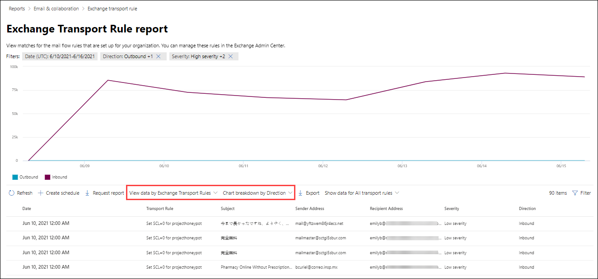

# Anzeigen von E-Mail-Sicherheitsberichten im Microsoft 365 Defender PortalView email security reports in the Microsoft 365 Defender portal

[!INCLUDE [Microsoft 365 Defender rebranding](../includes/microsoft-defender-for-office.md)]

**Gilt für****Applies to**
- [Exchange Online ProtectionExchange Online Protection](exchange-online-protection-overview.md)
- [Microsoft Defender für Office 365 Plan 1 und Plan 2Microsoft Defender for Office 365 plan 1 and plan 2](defender-for-office-365.md)
- [Microsoft 365 DefenderMicrosoft 365 Defender](../defender/microsoft-365-defender.md)

Eine Vielzahl von Berichten finden Sie im Microsoft 365 Defender Portal <https://security.microsoft.com> unter, um zu sehen, wie E-Mail-Sicherheitsfeatures wie Antispam, Antischadsoftware und Verschlüsselungsfunktionen in Microsoft 365 Ihre Organisation schützen.A variety of reports are available in the Microsoft 365 Defender portal at <https://security.microsoft.com> to help you see how email security features, such as anti-spam, anti-malware, and encryption features in Microsoft 365 are protecting your organization. Wenn Sie über die [erforderlichen Berechtigungen](#what-permissions-are-needed-to-view-these-reports)verfügen, können Sie diese Berichte im Microsoft 365 Defender Portal anzeigen, indem Sie zu  \> **E-Mail-Berichte &** \> **Zusammenarbeit E-Mail & Zusammenarbeitsberichte wechseln.**If you have the [necessary permissions](#what-permissions-are-needed-to-view-these-reports), you can view these reports in the Microsoft 365 Defender portal by going to **Reports** \> **Email & collaboration** \> **Email & collaboration reports**. To go directly to the **Email & collaboration reports** page, open <https://security.microsoft.com/emailandcollabreport> .To go directly to the **Email & collaboration reports** page, open <https://security.microsoft.com/emailandcollabreport>.

> [!NOTE]
>
> Einige der Berichte auf der Seite **"E-Mail & Zusammenarbeitsberichte"** erfordern Microsoft Defender für Office 365.Some of the reports on the **Email & collaboration reports** page require Microsoft Defender for Office 365. Informationen zu diesen Berichten finden Sie unter Anzeigen von [Defender für Office 365 Berichte im Microsoft 365 Defender Portal.](view-reports-for-mdo.md)For information about these reports, see [View Defender for Office 365 reports in the Microsoft 365 Defender portal](view-reports-for-mdo.md).
>
> Berichte, die sich auf den Nachrichtenfluss beziehen, befinden sich jetzt im Exchange Admin Center (EAC).Reports that are related to mail flow are now in the Exchange admin center (EAC). Weitere Informationen zu diesen Berichten finden Sie unter [Nachrichtenflussberichte im neuen Exchange Admin Center.](/exchange/monitoring/mail-flow-reports/mail-flow-reports)For more information about these reports, see [Mail flow reports in the new Exchange admin center](/exchange/monitoring/mail-flow-reports/mail-flow-reports).

## Bericht "Kompromittierte Benutzer"Compromised users report

> [!NOTE]
> Dieser Bericht ist in Microsoft 365 Organisationen mit Exchange Online Postfächern verfügbar.This report is available in Microsoft 365 organizations with Exchange Online mailboxes. Es ist in eigenständigen Exchange Online Protection (EOP)-Organisationen nicht verfügbar.It's not available in standalone Exchange Online Protection (EOP) organizations.

Der Bericht **"Kompromittierte Benutzer"** zeigt die Anzahl der Benutzerkonten an, die innerhalb der letzten 7 Tage als **verdächtig** oder **eingeschränkt** markiert wurden.The **Compromised users** report shows shows the number of user accounts that were marked as **Suspicious** or **Restricted** within the last 7 days. Konten in einem dieser Zustände sind problematisch oder sogar kompromittiert.Accounts in either of these states are problematic or even compromised. Bei häufiger Verwendung können Sie den Bericht verwenden, um Spitzen und sogar Trends in verdächtigen oder eingeschränkten Konten zu erkennen.With frequent use, you can use the report to spot spikes, and even trends, in suspicious or restricted accounts. Weitere Informationen zu kompromittierten Benutzern finden Sie unter [Antworten auf ein kompromittiertes E-Mail-Konto.](responding-to-a-compromised-email-account.md)For more information about compromised users, see [Responding to a compromised email account](responding-to-a-compromised-email-account.md).

In der Aggregatansicht werden Daten für die letzten 90 Tage und in der Detailansicht Daten für die letzten 30 Tage angezeigt.The aggregate view shows data for the last 90 days and the detail view shows data for the last 30 days.

To view the report in the Microsoft 365 Defender portal, go to **Reports** \> **Email & collaboration** Email & collaboration \> **reports**.To view the report in the Microsoft 365 Defender portal, go to **Reports** \> **Email & collaboration** \> **Email & collaboration reports**. Suchen Sie auf der Seite **"E-Mail & Zusammenarbeitsberichte"** **kompromittierte Benutzer,** und klicken Sie dann auf **"Details anzeigen".**On the **Email & collaboration reports** page, find **Compromised users** and then click **View details**. Um direkt zum Bericht zu wechseln, öffnen Sie <https://security.microsoft.com/reports/CompromisedUsers> .To go directly to the report, open <https://security.microsoft.com/reports/CompromisedUsers>.

Auf der Seite **"Kompromittierte Benutzer"** können Sie sowohl das Diagramm als auch die Detailtabelle filtern, indem Sie auf **"Filtern"** klicken und einen oder mehrere der folgenden Werte im angezeigten Flyout auswählen:On the **Compromised users** page, you can filter both the chart and the details table by clicking **Filter** and selecting one or more of the following values in the flyout that appears:

- **Datum (UTC):** **Startdatum** und **Enddatum.****Date (UTC)**: **Start date** and **End date**.
- **Aktivität:****Activity**:
  - **Verdächtig:** Das Benutzerkonto hat verdächtige E-Mails gesendet und besteht das Risiko, dass das Senden von E-Mails eingeschränkt wird.**Suspicious**: The user account has sent suspicious email and is at risk of being restricted from sending email.
  - **Eingeschränkt:** Das Benutzerkonto wurde aufgrund von hochgradig verdächtigen Mustern am Senden von E-Mails gehindert.**Restricted**: The user account has been restricted from sending email due to highly suspicious patterns.

Wenn Sie die Konfiguration der Filter abgeschlossen haben, klicken Sie auf **"Anwenden",** **"Abbrechen"** oder **"Filter löschen".**When you're finished configuring the filters, click **Apply**, **Cancel**, or **Clear filters**.

In der Detailtabelle unterhalb des Diagramms sehen Sie die folgenden Details:In the details table below the graph, you can see the following details:

- **Erstellungszeitpunkt****Creation time**
- **Benutzer-ID****User ID**
- **Action****Action**

## Exchange-TransportregelberichtExchange transport rule report

Der **Bericht Exchange Transportregel** zeigt die Auswirkungen von Nachrichtenflussregeln (auch als Transportregeln bezeichnet) auf ein- und ausgehende Nachrichten in Ihrer Organisation an.The **Exchange transport rule** report shows the effect of mail flow rules (also known as transport rules) on incoming and outgoing messages in your organization.

To view the report in the Microsoft 365 Defender portal, go to **Reports** \> **Email & collaboration** Email & collaboration \> **reports**.To view the report in the Microsoft 365 Defender portal, go to **Reports** \> **Email & collaboration** \> **Email & collaboration reports**. Suchen Sie auf der Seite **"E-Mail & Zusammenarbeitsberichte"** **nach Exchange Transportregel,** und klicken Sie dann auf **Details anzeigen.**On the **Email & collaboration reports** page, find **Exchange transport rule** and then click **View details**. Um direkt zum Bericht zu wechseln, öffnen Sie <https://security.microsoft.com/reports/ETRRuleReport> .To go directly to the report, open <https://security.microsoft.com/reports/ETRRuleReport>.

Auf der Seite **Exchange Transportregelbericht** werden die verfügbaren Diagramme und Daten in den folgenden Abschnitten beschrieben.On the **Exchange transport rule report** page, the available charts and data are described in the following sections.

### Diagrammstrukturplan nach RichtungChart breakdown by Direction

Wenn Sie **die Diagrammstrukturstruktur nach Richtung** auswählen, sind die folgenden Diagramme verfügbar:If you select **Chart breakdown by Direction**, the follow charts are available:

- **Anzeigen von Daten nach Exchange Transportregeln:** Die Anzahl der **eingehenden** und **ausgehenden** Nachrichten, die von Nachrichtenflussregeln betroffen waren.**View data by Exchange transport rules**: The number of **Inbound** and **Outbound** messages that were affected by mail flow rules.
- **Anzeigen von Daten nach DLP Exchange Transportregeln:** Die Anzahl der **eingehenden** und **ausgehenden** Nachrichten, die von DLP-Nachrichtenflussregeln (Data Loss Prevention, Verhinderung von Datenverlust) betroffen waren.**View data by DLP Exchange transport rules**: The number of **Inbound** and **Outbound** messages that were affected by data loss prevention (DLP) mail flow rules.

Die folgenden Informationen werden in der Detailtabelle unterhalb des Diagramms angezeigt:The following information is shown in the details table below the graph:

- **Date****Date**
- **DLP-Richtlinie** (**Daten nur von DLP Exchange Transportregeln anzeigen)****DLP policy** (**View data by DLP Exchange transport rules** only)
- **Transportregel****Transport rule**
- **Betreff****Subject**
- **Absenderadresse****Sender address**
- **Empfängeradresse****Recipient address**
- **Schweregrad****Severity**
- **Richtung****Direction**

Sie können sowohl das Diagramm als auch die Detailtabelle filtern, indem Sie auf **"Filtern"** klicken und einen oder mehrere der folgenden Werte im angezeigten Flyout auswählen:You can filter both the chart and the details table by clicking **Filter** and selecting one or more of the following values in the flyout that appears:

- **Datum (UTC)** **Startdatum** und **Enddatum****Date (UTC)** **Start date** and **End date**
- **Richtung:** **Ausgehend** und **Eingehend****Direction**: **Outbound** and **Inbound**
- **Schweregrad:** **Hoher,** **mittlerer und** niedriger **Schweregrad****Severity**: **High severity**, **Medium severity**, and **Low severity**

Wenn Sie die Konfiguration der Filter abgeschlossen haben, klicken Sie auf **"Anwenden",** **"Abbrechen"** oder **"Filter löschen".**When you're finished configuring the filters, click **Apply**, **Cancel**, or **Clear filters**.

### Diagrammstrukturplan nach SchweregradChart breakdown by Severity

Wenn Sie **die Diagrammstrukturstruktur nach Schweregrad** auswählen, sind die folgenden Diagramme verfügbar:If you select **Chart breakdown by Severity**, the follow charts are available:

- **Anzeigen von Daten nach Exchange Transportregeln:** Die Anzahl der Nachrichten mit **hohem,** **mittlerem und** **mittlerem Schweregrad.****View data by Exchange transport rules**: The number of **High severity**, **Medium severity**, and **Low severity** messages. Sie legen den Schweregrad als Aktion in der Regel fest (**Überwachen Sie diese Regel mit Schweregrad** oder _SetAuditSeverity_).You set the severity level as an action in the rule (**Audit this rule with severity level** or _SetAuditSeverity_). Weitere Informationen finden Sie unter [Nachrichtenflussregelaktionen in Exchange Online](/Exchange/security-and-compliance/mail-flow-rules/mail-flow-rule-actions).For more information, see [Mail flow rule actions in Exchange Online](/Exchange/security-and-compliance/mail-flow-rules/mail-flow-rule-actions).

- **Anzeigen von Daten nach DLP Exchange Transportregeln:** Die Anzahl der Nachrichten mit **hohem,** **mittlerem und** **mittlerem** Schweregrad, die von DLP-Nachrichtenflussregeln betroffen waren.**View data by DLP Exchange transport rules**: The number of **High severity**, **Medium severity**, and **Low severity** messages that were affected by DLP mail flow rules.

Die folgenden Informationen werden in der Detailtabelle unterhalb des Diagramms angezeigt:The following information is shown in the details table below the graph:

- **Date****Date**
- **DLP-Richtlinie** (**Daten nur von DLP Exchange Transportregeln anzeigen)****DLP policy** (**View data by DLP Exchange transport rules** only)
- **Transportregel****Transport rule**
- **Betreff****Subject**
- **Absenderadresse****Sender address**
- **Empfängeradresse****Recipient address**
- **Schweregrad****Severity**
- **Richtung****Direction**

Sie können sowohl das Diagramm als auch die Detailtabelle filtern, indem Sie auf **"Filtern"** klicken und einen oder mehrere der folgenden Werte im angezeigten Flyout auswählen:You can filter both the chart and the details table by clicking **Filter** and selecting one or more of the following values in the flyout that appears:

- **Datum (UTC)** **Startdatum** und **Enddatum****Date (UTC)** **Start date** and **End date**
- **Richtung:** **Ausgehend** und **Eingehend****Direction**: **Outbound** and **Inbound**
- **Schweregrad:** **Hoher,** **mittlerer und** niedriger **Schweregrad****Severity**: **High severity**, **Medium severity**, and **Low severity**

Wenn Sie die Konfiguration der Filter abgeschlossen haben, klicken Sie auf **"Anwenden",** **"Abbrechen"** oder **"Filter löschen".**When you're finished configuring the filters, click **Apply**, **Cancel**, or **Clear filters**.

## WeiterleitungsberichtForwarding report

> [!NOTE]
> Der **Weiterleitungsbericht** ist jetzt im EAC verfügbar.The **Forwarding report** is now available in the EAC. Weitere Informationen finden Sie unter [Bericht über automatisch weitergeleitete Nachrichten im neuen EAC.](/exchange/monitoring/mail-flow-reports/mfr-auto-forwarded-messages-report)For more information, see [Auto forwarded messages report in the new EAC](/exchange/monitoring/mail-flow-reports/mfr-auto-forwarded-messages-report).

## E-Mailflow-StatusberichtMailflow status report

Der **E-Mailflow-Statusbericht** ist ein intelligenter Bericht, der Informationen zu eingehenden und ausgehenden E-Mails, Spamerkennungen, Schadsoftware, als "gut" identifizierten E-Mails und Informationen zu E-Mails anzeigt, die am Edge zugelassen oder blockiert werden.The **Mailflow status report** is a smart report that shows information about incoming and outgoing email, spam detections, malware, email identified as "good", and information about email allowed or blocked on the edge. Dies ist der einzige Bericht, der Edge-Schutzinformationen enthält, und zeigt an, wie viele E-Mails blockiert werden, bevor sie zur Auswertung durch Exchange Online Protection (EOP) in den Dienst zugelassen werden.This is the only report that contains edge protection information, and shows just how much email is blocked before being allowed into the service for evaluation by Exchange Online Protection (EOP). Es ist wichtig zu verstehen, dass eine Nachricht, die an fünf Empfänger gesendet wird, als fünf verschiedene Nachrichten und nicht als eine Nachricht gezählt wird.It's important to understand that if a message is sent to five recipients we count it as five different messages and not one message.

To view the report in the Microsoft 365 Defender portal, go to **Reports** \> **Email & collaboration** Email & collaboration \> **reports**.To view the report in the Microsoft 365 Defender portal, go to **Reports** \> **Email & collaboration** \> **Email & collaboration reports**. Suchen Sie auf der Seite **"E-Mail & Zusammenarbeitsberichte"** die Zusammenfassung des **E-Mail-Flussstatus,** und klicken Sie dann auf **"Details anzeigen".**On the **Email & collaboration reports** page, find **Mailflow status summary** and then click **View details**. Um direkt zum Bericht zu wechseln, öffnen Sie <https://security.microsoft.com/reports/mailflowStatusReport> .To go directly to the report, open <https://security.microsoft.com/reports/mailflowStatusReport>.

### Typansicht für den Mailflow-StatusberichtType view for the Mailflow status report

Auf der Seite **E-Mailflow-Statusbericht** ist die Registerkarte Typ standardmäßig ausgewählt. On the **Mailflow status report** page, the **Type** tab is selected by default. Standardmäßig enthält diese Ansicht ein Diagramm und eine Detailtabelle, die mit den folgenden Filtern konfiguriert ist:By default, this view contains a chart and a details table that's configured with the following filters:

- **Datum (UTC)** Die letzten 7 Tage.**Date (UTC)** The last 7 days.
- **E-Mail-Richtung:****Mail direction**:
  - **Eingehende****Inbound**
  - **Ausgehend****Outbound**
  - **Organisationsinternes:** Diese Anzahl gilt für Nachrichten innerhalb eines Mandanten, d. h.**Intra-org**: this count is for messages within a tenant i.e absender abc@domain.com sendet an empfänger xyz@domain.com (getrennt von **ein-** und **ausgehend** gezählt)sender abc@domain.com sends to recipient xyz@domain.com  (counted separately from **Inbound** and **Outbound**)
- **Typ:****Type**:
  - **Gute E-Mails****Good mail**
  - **Schadsoftware****Malware**
  - **Spam****Spam**
  - **Edgeschutz****Edge protection**
  - **Regelnachrichten****Rule messages**
  - **Phishing-E-Mail****Phishing email**
- **Domäne:** **Alle****Domain**: **All**

Das Diagramm ist nach den **Type-Werten** organisiert.The chart is organized by the **Type** values.

Sie können diese Filter ändern, indem Sie auf **"Filter"** klicken.You can change these filters by clicking **Filter**.

Die folgenden Informationen werden in der Detailtabelle unterhalb des Diagramms angezeigt:The following information is shown in the details table below the graph:

- **Richtung****Direction**
- **Typ****Type**
- **24 Stunden****24 hours**
- **3 Tage****3 days**
- **7 Tage****7 days**
- **15 Tage****15 days**
- **30 Tage****30 days**

Wenn Sie auf **"Kategorie auswählen"** klicken, um weitere Details zu erhalten, können Sie aus den folgenden Werten auswählen:If you click **Choose a category for more details**, you can select from the following values:

- **Phishing-E-Mail:** Diese Auswahl führt Sie zum Statusbericht zum [Bedrohungsschutz.](view-email-security-reports.md#threat-protection-status-report)**Phishing email**: This selection takes you to the [Threat protection status report](view-email-security-reports.md#threat-protection-status-report).
- **Schadsoftware in E-Mails:** Diese Auswahl führt Sie zum [Bedrohungsschutzstatusbericht.](view-email-security-reports.md#threat-protection-status-report)**Malware in email**: This selection takes you to the [Threat protection status report](view-email-security-reports.md#threat-protection-status-report).
- **Spamerkennungen:** Diese Auswahl führt Sie zum [Spamerkennungsbericht.](view-email-security-reports.md#spam-detections-report)**Spam detections**: This selection takes you to the [Spam Detections report](view-email-security-reports.md#spam-detections-report).
- **Edge blockierter Spam:** Diese Auswahl führt Sie zum [Spamerkennungsbericht.](view-email-security-reports.md#spam-detections-report)**Edge blocked spam**: This selection takes you to the [Spam Detections report](view-email-security-reports.md#spam-detections-report).

#### Exportieren aus der TypansichtExport from Type view

Für die Detailansicht können Sie nur Daten für einen Tag exportieren.For the detail view, you can only export data for one day. Wenn Sie Also Daten für 7 Tage exportieren möchten, müssen Sie 7 verschiedene Exportaktionen ausführen.So, if you want to export data for 7 days, you need to do 7 different export actions.

Jede exportierte .csv Datei ist auf 150.000 Zeilen beschränkt.Each exported .csv file is limited to 150,000 rows. Wenn die Daten für diesen Tag mehr als 150.000 Zeilen enthalten, werden mehrere .csv Dateien erstellt.If the data for that day contains more than 150,000 rows, then multiple .csv files will be created.

### Richtungsansicht für den Mailflow-StatusberichtDirection view for the Mailflow status report

Wenn Sie auf die Registerkarte **"Richtung"** klicken, werden die gleichen Standardfilter aus der **Typansicht** verwendet.If you click the **Direction** tab, the same default filters from the **Type** view are used.

Das Diagramm ist nach **Richtungswerten** organisiert.The chart is organized by **Direction** values.

Sie können diese Filter ändern, indem Sie auf **"Filter"** klicken.You can change these filters by clicking **Filter**. Es werden dieselben Filter aus der **Typansicht** verwendet.The same filters from the **Type** view are used.

Die Detailtabelle enthält dieselben Informationen aus der **Typansicht.**The details table contains same information from the **Type** view.

The **Choose a category for more details** available selections and behavior are the same as the **Type** view.The **Choose a category for more details** available selections and behavior are the same as the **Type** view.

#### Exportieren aus der RichtungsansichtExport from Direction view

Für die Detailansicht können Sie nur Daten für einen Tag exportieren.For the detail view, you can only export data for one day. Wenn Sie Also Daten für 7 Tage exportieren möchten, müssen Sie 7 verschiedene Exportaktionen ausführen.So, if you want to export data for 7 days, you need to do 7 different export actions.

Jede exportierte .csv Datei ist auf 150.000 Zeilen beschränkt.Each exported .csv file is limited to 150,000 rows. Wenn die Daten für diesen Tag mehr als 150.000 Zeilen enthalten, werden mehrere .csv Dateien erstellt.If the data for that day contains more than 150,000 rows, then multiple .csv files will be created.

### Trichteransicht für den Mailflow-StatusberichtFunnel view for the Mailflow status report

Die **Trichteransicht** zeigt Ihnen, wie die E-Mail-Bedrohungsschutzfeatures von Microsoft eingehende und ausgehende E-Mails in Ihrer Organisation filtern.The **Funnel** view shows you how Microsoft's email threat protection features filter incoming and outgoing email in your organization. Es enthält Details zur Gesamtzahl der E-Mails und dazu, wie sich die konfigurierten Bedrohungsschutzfeatures, einschließlich Edgeschutz, Antischadsoftware, Antiphishing, Antispam und Antispoofing, auf diese Anzahl auswirken.It provides details on the total email count, and how the configured threat protection features, including edge protection, anti-malware, anti-phishing, anti-spam, and anti-spoofing affect this count.

Wenn Sie auf die Registerkarte **"Trichter"** klicken, enthält diese Ansicht standardmäßig ein Diagramm und eine Detailtabelle, die mit den folgenden Filtern konfiguriert ist:If you click the **Funnel** tab, by default, this view contains a chart and a details table that's configured with the following filters:

- **Datum:** Die letzten 7 Tage.**Date**: The last 7 days.

- **Richtung:****Direction**:
  - **Eingehende****Inbound**
  - **Ausgehend****Outbound**
  - **Organisationsintern:** Diese Anzahl gilt für Nachrichten, die innerhalb eines Mandanten gesendet werden; d. h. Absender abc@domain.com sendet an Empfänger xyz@domain.com (separat von Ein- und Ausgehend gezählt).**Intra-org**: This count is for messages sent within a tenant; i.e, sender abc@domain.com sends to recipient xyz@domain.com (counted separately from Inbound and Outbound).

Die Aggregatansicht und die Detailtabellenansicht ermöglichen eine Filterung von 90 Tagen.The aggregate view and details table view allow for 90 days of filtering.

Sie können diese Filter ändern, indem Sie auf **"Filter"** klicken.You can change these filters by clicking **Filter**. Es werden dieselben Filter aus der **Typansicht** verwendet.The same filters from the **Type** view are used.

Dieses Diagramm zeigt die E-Mail-Anzahl nach:This chart shows the email count organized by:

- **E-Mail-Gesamtanzahl****Total email**
- **E-Mail nach Edgeschutz****Email after edge protection**
- **E-Mail nach Transportregel** (Nachrichtenflussregel)**Email after transport rule** (mail flow rule)
- **E-Mail nach Antischadsoftware, Dateireputation, Dateitypblockierung****Email after anti-malware, file reputation, file type block**
- **E-Mail nach Antiphishing, URL-Reputation, Markenidentitätswechsel, Antispoofing****Email after anti-phish, URL reputation, brand impersonation, anti-spoof**
- **E-Mails nach Antispam, Massenfilterung von E-Mails****Email after anti-spam, bulk mail filtering**
- **E-Mail nach Benutzer- und Domänenidentitätswechsel**\***Email after user and domain impersonation**\*
- **E-Mail nach Datei- und URL-Detonation**\***Email after file and URL detonation**\*
- **E-Mails, die nach der Zustellung als gutartig erkannt wurden (URL-Click-Time-Schutz)****Email detected as benign after post-delivery protection (URL click time protection)**

\*Nur Defender für Office 365\* Defender for Office 365 only

Um die von EOP oder Defender gefilterte E-Mail für Office 365 separat anzuzeigen, klicken Sie auf den Wert in der Diagrammlegende.To view the email filtered by EOP or Defender for Office 365 separately, click on the value in the chart legend.

Die Detailtabelle enthält die folgenden Informationen, die in absteigender Datumsreihenfolge angezeigt werden:The details table contains the following information, shown in descending date order:

- **Date****Date**
- **E-Mail-Gesamtanzahl****Total email**
- **Edgeschutz****Edge protection**
- **Antischadsoftware, Dateireputation, Dateitypblock:****Anti-malware, file reputation, file type block**:
  - **Dateizuruf:** Nachrichten, die aufgrund der Identifizierung einer angefügten Datei von anderen Microsoft-Kunden gefiltert wurden.**File reputation**: Messages filtered due to identification of an attached file by other Microsoft customers.
  - **Dateitypblock:** Nachrichten, die aufgrund des typs der in der Nachricht identifizierten schädlichen Datei gefiltert wurden.**File type block**: Messages filtered due to the type of malicious file identified in the message.
- **Antiphishing, URL-Zuverlässigkeit, Markenidentitätswechsel, Antispoofing:****Anti-phish, URL reputation, Brand impersonation, anti-spoof**:
  - **URL-Zuverlässigkeit:** Nachrichten, die aufgrund der Identifizierung der URL von anderen Microsoft-Kunden gefiltert wurden.**URL reputation**: Messages filtered due to the identification of the URL by other Microsoft customers.
  - **Markenidentitätswechsel:** Nachrichten, die aufgrund der Nachricht gefiltert wurden, die von bekannten Absendern als Absender imitiert wurde.**Brand impersonation**: Messages filtered due to the message coming from well-known brand impersonating senders.
  - **Antispoofing:** Nachrichten, die aufgrund der Nachricht gefiltert wurden, die versucht, eine Domäne zu spoofen, zu der der Empfänger gehört, oder einer Domäne, die der Absender der Nachricht nicht besitzt.**Anti-spoof**: Messages filtered due to the message attempting to spoof a domain that the recipient belongs to, or a domain that the message sender doesn't own.
- **Antispam, Massen-E-Mail-Filterung:****Anti-spam, bulk mail filtering**:
  - **Massen-E-Mail-Filterung:** Nachrichten, die basierend auf dem BCL-Schwellenwert (Bulk Complain Level) in einer Antispamrichtlinie gefiltert werden.**Bulk mail filtering**: Messages filtered based on the bulk complain level (BCL) threshold in an anti-spam policy.
- **Benutzer- und Domänenidentitätswechsel (Defender für Office 365):****User and domain impersonation (Defender for Office 365)**:
  - **Benutzeridentitätswechsel:** Nachrichten, die aufgrund eines Versuchs gefiltert wurden, einen Benutzer (Nachrichtensender) zu imitieren, der in den Identitätswechselschutzeinstellungen einer Antiphishingrichtlinie definiert ist.**User impersonation**: Messages filtered due to an attempt to impersonate a user (message sender) that's defined in the impersonation protection settings of an anti-phishing policy.
  - **Domänenidentitätswechsel:** Nachrichten, die aufgrund eines Versuchs gefiltert wurden, eine Domäne zu imitieren, die in den Identitätswechselschutzeinstellungen einer Antiphishingrichtlinie definiert ist.**Domain impersonation**: Messages filtered due to an attempt to impersonate a domain that's defined in the impersonation protection settings of an anti-phishing policy.
- **Datei- und URL-Detonation (Defender für Office 365):****File and URL detonation (Defender for Office 365)**:
  - **Dateidetonation:** Nachrichten, die nach einer Tresor Anlagenrichtlinie gefiltert sind.**File detonation**: Messages filtered by a Safe Attachments policy.
  - **URL-Detonation:** Nachricht, gefiltert nach einer Tresor-Verknüpfungsrichtlinie.**URL detonation**: Message filtered by a Safe Links policy.
- **Schutz nach der Zustellung und ZAP (ATP) oder ZAP (EOP):** Automatische Nullstunde-Bereinigung (ZAP) für Schadsoftware, Spam und Phishing.**Post-delivery protection and ZAP (ATP), or ZAP (EOP)**: Zero-hour auto purge (ZAP) for malware, spam, and phishing.

Wenn Sie eine Zeile in der Detailtabelle auswählen, wird im Flyout eine weitere Aufschlüsselung der E-Mail-Anzahl angezeigt.If you select a row in the details table, a further breakdown of the email counts are shown in the flyout.

#### Exportieren aus der TrichteransichtExport from Funnel view

Nachdem Sie unter **"Optionen"** auf **"Exportieren"** geklickt haben, können Sie einen der folgenden Werte auswählen:After you click **Export** under **Options**, you can select one of the following values:

- **Zusammenfassung (mit Daten für die letzten 90 Tage)****Summary (with data for last 90 days at most)**
- **Details (mit Daten für die letzten 30 Tage)****Details (with data for last 30 days at most)**

Wählen Sie unter **Datum** einen Bereich aus, und klicken Sie dann auf **Übernehmen .**Under **Date**, choose a range, and then click **Apply**. Daten für die aktuellen Filter werden in eine .csv Datei exportiert.Data for the current filters will be exported to a .csv file.

Jede exportierte .csv Datei ist auf 150.000 Zeilen beschränkt.Each exported .csv file is limited to 150,000 rows. Wenn die Daten mehr als 150.000 Zeilen enthalten, werden mehrere .csv Dateien erstellt.If the data contains more than 150,000 rows, then multiple .csv files will be created.

### Tech-Ansicht für den Mailflow-StatusberichtTech view for the Mailflow status report

Die **Tech-Ansicht** ähnelt der **Trichteransicht** und bietet detailliertere Details für die konfigurierten Funktionen zum Schutz vor Bedrohungen.The **Tech view** is similar to the **Funnel** view, providing more granular details for the configured threat protections features. Im Diagramm können Sie sehen, wie Nachrichten in den verschiedenen Phasen des Bedrohungsschutzes kategorisiert werden.From the chart, you can see how messages are categorized at the different stages of threat protection.

Wenn Sie standardmäßig auf die Registerkarte **"Tech-Ansicht"** klicken, enthält diese Ansicht ein Diagramm und eine Detailtabelle, die mit den folgenden Filtern konfiguriert sind:If you click the **Tech view** tab, by default, this view contains a chart and a details table that's configured with the following filters:

- **Datum:** Die letzten 7 Tage.**Date**: The last 7 days.

- **Richtung:****Direction**:
  - **Eingehende****Inbound**
  - **Ausgehend****Outbound**
  - **Organisationsinternes:** Diese Anzahl gilt für Nachrichten innerhalb eines Mandanten, d. h.**Intra-org**: this count is for messages within a tenant i.e absender abc@domain.com sendet an empfänger xyz@domain.com (getrennt von eingehenden und ausgehenden Zählungen)sender abc@domain.com sends to recipient xyz@domain.com (counted separately from Inbound and Outbound)

Die Aggregatansicht und die Detailtabellenansicht ermöglichen eine Filterung von 90 Tagen.The aggregate view and details table view allow for 90 days of filtering.

Sie können diese Filter ändern, indem Sie auf **"Filter"** klicken.You can change these filters by clicking **Filter**. Es werden dieselben Filter aus der **Typansicht** verwendet.The same filters from the **Type** view are used.

Dieses Diagramm zeigt Nachrichten, die in die folgenden Kategorien unterteilt sind:This chart shows messages organized into the following categories:

- **E-Mail-Gesamtanzahl****Total email**
- **Edge zulassen** und **Edge gefiltert****Edge allow** and **Edge filtered**
- **Transportregel zulassen** und **Transportregel gefiltert** (Nachrichtenflussregeln)**Transport rule allow** and **Transport rule filtered** (mail flow rules)
- **Keine Schadsoftware,** **Tresor Erkennung von Anlagen** und Erkennung von \* **Antischadsoftwaremodulen****Not malware**, **Safe Attachments detection**\*, and **Anti-malware engine detection**
- **Keine Phishing-,** **DMARC-Fehler,** **Identitätswechselerkennung,** \* **Spooferkennung** und **Phishing-Erkennung****Not phish**, **DMARC failure**, **Impersonation detection**\*, **Spoof detection**, and **Phish detection**
- **Keine Erkennung mit URL-Detonation** und **URL-Detonationserkennung**\***No detection with URL detonation** and **URL detonation detection**\*
- **Keine Spam-** und  **Spamnachrichten****Not spam** and  **Spam**
- **Nicht böswillige E-Mails,** **Tresor-Links-Erkennung** \* und **ZAP****Non-malicious email**, **Safe Links detection**\*, and **ZAP**

\*Defender für Office 365\* Defender for Office 365

Wenn Sie mit dem Mauszeiger auf eine Kategorie im Diagramm zeigen, können Sie die Anzahl der Nachrichten in dieser Kategorie anzeigen.When you hover over a category in the chart, you can see the number of messages in that category.

Die Detailtabelle enthält die folgenden Informationen, die in absteigender Datumsreihenfolge angezeigt werden:The details table contains the following information, shown in descending date order:

- **Datum (UTC)****Date (UTC)**
- **E-Mail-Gesamtanzahl****Total email**
- **Edge gefiltert****Edge filtered**
- **Regelnachrichten:** Nachrichten, die aufgrund von Nachrichtenflussregeln gefiltert wurden (auch als Transportregeln bezeichnet).**Rule messages**: Messages filtered due to  mail flow rules (also known as transport rules).
- **Antischadsoftwaremodul**, **Tresor** \* Anlagen:**Anti-malware engine**, **Safe Attachments**\*:
- **DMARC, Identitätswechsel,** \* **Spoofing**, **Phishing gefiltert:****DMARC, impersonation**\*, **spoof**, **phish filtered**:
  - **DMARC:** Nachrichten, die aufgrund eines Fehlers bei der DMARC-Authentifizierungsprüfung gefiltert wurden.**DMARC**: Messages filtered due to the message failing its DMARC authentication check.
- **ERKENNUNG DER URL-Detonation**\***URL detonation detection**\*
- **Antispam gefiltert****Anti-spam filtered**
- **ZAP entfernt****ZAP removed**
- **Erkennung durch Tresor Links**\***Detection by Safe Links**\*

\*Defender für Office 365\* Defender for Office 365

Wenn Sie eine Zeile in der Detailtabelle auswählen, wird im Flyout eine weitere Aufschlüsselung der E-Mail-Anzahl angezeigt.If you select a row in the details table, a further breakdown of the email counts are shown in the flyout.

#### Exportieren aus der Tech-AnsichtExport from Tech view

Wenn Sie auf **"Exportieren"** klicken, können Sie unter **"Optionen"** einen der folgenden Werte auswählen:On clicking **Export**, under **Options** you can select one of the following values:

- **Zusammenfassung (mit Daten für die letzten 90 Tage)****Summary (with data for last 90 days at most)**
- **Details (mit Daten für die letzten 30 Tage)****Details (with data for last 30 days at most)**

Wählen Sie unter **Datum** einen Bereich aus, und klicken Sie dann auf **Übernehmen .**Under **Date**, choose a range, and then click **Apply**. Daten für die aktuellen Filter werden in eine .csv Datei exportiert.Data for the current filters will be exported to a .csv file.

Jede exportierte .csv Datei ist auf 150.000 Zeilen beschränkt.Each exported .csv file is limited to 150,000 rows. Wenn die Daten mehr als 150.000 Zeilen enthalten, werden mehrere .csv Dateien erstellt.If the data contains more than 150,000 rows, then multiple .csv files will be created.

## Bericht über SchadsoftwareerkennungenMalware detections report

Der Bericht über **Schadsoftwareerkennungen** enthält Informationen zu Schadsoftwareerkennungen in eingehenden und ausgehenden E-Mail-Nachrichten (von Exchange Online Protection oder EOP erkannte Schadsoftware).The **Malware detections report** report shows information about malware detections in incoming and outgoing email messages (malware detected by Exchange Online Protection or EOP). Weitere Informationen zum Schutz vor Schadsoftware in EOP finden Sie unter [Antischadsoftwareschutz in EOP.](anti-malware-protection.md)For more information about malware protection in EOP, see [Anti-malware protection in EOP](anti-malware-protection.md).

Der Aggregatansichtsfilter lässt 90 Tage zu, während der Detailtabellenfilter nur 10 Tage zulässt.The aggregate view filter allows for 90 days, while the details table filter only allows for 10 days.

To view the report in the Microsoft 365 Defender portal, go to **Reports** \> **Email & collaboration** Email & collaboration \> **reports**.To view the report in the Microsoft 365 Defender portal, go to **Reports** \> **Email & collaboration** \> **Email & collaboration reports**. Suchen Sie auf der Seite **"E-Mail & Zusammenarbeitsberichte"** nach Schadsoftware, die **in E-Mails erkannt wurde,** und klicken Sie dann auf **Details anzeigen.**On the **Email & collaboration reports** page, find **Malware detected in email** and then click **View details**. Um direkt zum Bericht zu wechseln, öffnen Sie <https://security.microsoft.com/reports/MalwareDetections> .To go directly to the report, open <https://security.microsoft.com/reports/MalwareDetections>.

Auf der Berichtsseite **für Schadsoftwareerkennungen** können Sie sowohl das Diagramm als auch die Detailtabelle filtern, indem Sie auf **"Filtern"** klicken und einen der folgenden Werte auswählen:On the **Malware detections report** page, you can filter both the chart and the details table by clicking **Filter** and selecting one of the following values:

- **Datum (UTC)** **Startdatum** und **Enddatum****Date (UTC)** **Start date** and **End date**
- **Richtung:** **Ein-** und **Ausgehend****Direction**: **Inbound** and **Outbound**

In der Detailtabelle unterhalb des Diagramms sehen Sie die folgenden Details:In the details table below the graph, you can see the following details:

- **Date****Date**
- **Absenderadresse****Sender address**
- **Empfängeradresse****Recipient address**
- **Nachrichten-ID:** Verfügbar im **Nachrichten-ID-Kopfzeilenfeld** im Nachrichtenkopf und sollte eindeutig sein.**Message ID**: Available in the **Message-ID** header field in the message header and should be unique. Ein Beispielwert ist `<08f1e0f6806a47b4ac103961109ae6ef@server.domain>` (beachten Sie die spitzen Klammern).An example value is `<08f1e0f6806a47b4ac103961109ae6ef@server.domain>` (note the angle brackets).
- **Betreff****Subject**
- **Filename****Filename**
- **Name der Schadsoftware****Malware name**

## E-Mail-LatenzberichtMail latency report

Der **E-Mail-Latenzbericht** in Defender für Office 365 enthält Informationen zur E-Mail-Zustellungs- und Detonationslatenz in Ihrer Organisation.The **Mail latency report** in Defender for Office 365 contains information on the mail delivery and detonation latency experienced within your organization. Weitere Informationen finden Sie im [E-Mail-Latenzbericht.](view-reports-for-mdo.md#mail-latency-report)For more information, see [Mail latency report](view-reports-for-mdo.md#mail-latency-report).

## SpamerkennungsberichtSpam detections report

> [!NOTE]
> Der **Spamerkennungsbericht** wird schließlich entfernt.The **Spam detections report** will eventually go away. Die gleichen Informationen sind im [Bedrohungsschutzstatusbericht](#threat-protection-status-report)verfügbar.The same information is available in the [Threat protection status report](#threat-protection-status-report).

## Bericht über SpooferkennungenSpoof detections report

> [!NOTE]
> Der verbesserte Bericht über Spooferkennungen, wie in diesem Artikel beschrieben, befindet sich in der Vorschau, kann geändert werden und ist nicht in allen Organisationen verfügbar.The improved Spoof detections report as described in this article is in Preview, is subject to change, and is not available in all organizations. Die ältere Version des Berichts zeigt nur **gute E-Mails** und **"Als Spam abgefangen"** an.The older version of the report shows only **Good mail** and **Caught as spam**.

Der Bericht **"Spooferkennungen"** enthält Informationen zu Nachrichten, die aufgrund von Spoofing blockiert oder zugelassen wurden.The **Spoof detections** report shows information about messages that were blocked or allowed due to spoofing. Weitere Informationen zum Spoofing finden Sie unter [Antispoofingschutz in EOP.](anti-spoofing-protection.md)For more information about spoofing, see [Anti-spoofing protection in EOP](anti-spoofing-protection.md).

Die Aggregatansicht des Berichts lässt 45 Tage Filterung \* zu, während die Detailansicht nur zehn Tage Filterung zulässt.The aggregate view of the report allows for 45 days of filtering\*, while the detail view only allows for ten days of filtering.

\* Schließlich können Sie die Filterung bis zu 90 Tage verwenden.\* Eventually, you'll be able to use up to 90 days of filtering.

To view the report in the Microsoft 365 Defender portal, go to **Reports** \> **Email & collaboration** Email & collaboration \> **reports**.To view the report in the Microsoft 365 Defender portal, go to **Reports** \> **Email & collaboration** \> **Email & collaboration reports**. Suchen Sie auf der Seite **"E-Mail & Zusammenarbeitsberichte"** **nach Spooferkennungen,** und klicken Sie dann auf **"Details anzeigen".**On the **Email & collaboration reports** page, find **Spoof detections** and then click **View details**. Um direkt zum Bericht zu wechseln, öffnen Sie <https://security.microsoft.com/reports/SpoofMailReportV2> .To go directly to the report, open <https://security.microsoft.com/reports/SpoofMailReportV2>.

Das Diagramm zeigt die folgenden Informationen:The chart shows the following information:

- **bestehen****Pass**
- **Fehler****Fail**
- **SoftPass****SoftPass**
- **Keine****None**
- **Other****Other**

Wenn Sie den Mauszeiger über einen Tag (Datenpunkt) im Diagramm bewegen, können Sie sehen, wie viele gefälschte Nachrichten erkannt wurden und warum.When you hover over a day (data point) in the chart, you can see how many spoofed messages were detected and why.

Auf der Seite **"Spoof-E-Mail-Bericht"** können Sie sowohl das Diagramm als auch die Detailtabelle filtern, indem Sie auf **"Filtern"** klicken und einen oder mehrere der folgenden Werte auswählen:On the **Spoof mail report** page, you can filter both the chart and the details table by clicking **Filter** and selecting one or more of the following values:

- **Datum (UTC)** **Startdatum** und **Enddatum****Date (UTC)** **Start date** and **End date**
- **Ergebnis:****Result**:
  - **bestehen****Pass**
  - **Fehler****Fail**
  - **SoftPass****SoftPass**
  - **Keine****None**
  - **Other****Other**
- **Spooftyp:** **Intern** und **extern****Spoof type**: **Internal** and **External**

In der Detailtabelle unterhalb des Diagramms sehen Sie die folgenden Details:In the details table below the graph, you can see the following details:

- **Date****Date**
- **Gefälschter Benutzer****Spoofed user**
- **Senden der Infrastruktur****Sending infrastructure**
- **Spooftyp****Spoof type**
- **Ergebnis****Result**
- **Ergebniscode****Result code**
- **SPF****SPF**
- **DKIM****DKIM**
- **DMARC****DMARC**
- **Nachrichtenanzahl****Message count**

Weitere Informationen zu Ergebniscodes für die zusammengesetzte Authentifizierung finden Sie unter [Antispam-Nachrichtenkopfzeilen in Microsoft 365.](anti-spam-message-headers.md)For more information about composite authentication result codes, see [Anti-spam message headers in Microsoft 365](anti-spam-message-headers.md).

## ÜbermittlungsberichtSubmissions report

Der **Bericht "Übermittlungen"** enthält Informationen zu Elementen, die Administratoren microsoft zur Analyse gemeldet haben.The **Submissions** report shows information about items that admins have reported to Microsoft for analysis. Weitere Informationen finden Sie unter ["Verwenden der Administratorübermittlung" zum Übermitteln von verdächtigem Spam, Phishing, URLs und Dateien an Microsoft.](admin-submission.md)For more information, see [Use Admin Submission to submit suspected spam, phish, URLs, and files to Microsoft](admin-submission.md).

To view the report in the Microsoft 365 Defender portal, go to **Reports** \> **Email & collaboration** Email & collaboration \> **reports**.To view the report in the Microsoft 365 Defender portal, go to **Reports** \> **Email & collaboration** \> **Email & collaboration reports**. Suchen Sie auf der Seite **"E-Mail & Zusammenarbeitsberichte"** **nach Übermittlungen,** und klicken Sie dann auf **"Details anzeigen".**On the **Email & collaboration reports** page, find **Submissions** and then click **View details**. Um direkt zum Bericht zu wechseln, öffnen Sie <https://security.microsoft.com/adminSubmissionReport> .To go directly to the report, open <https://security.microsoft.com/adminSubmissionReport>. Wenn Sie im Microsoft 365 Defender Portal zu [Administratorübermittlungen](admin-submission.md)wechseln möchten, klicken Sie auf **"Zu Übermittlungen wechseln".**To go to [admin submissions in the Microsoft 365 Defender portal](admin-submission.md), click **Go to Submissions**.

Das Diagramm zeigt die folgenden Informationen:The chart shows the following information:

- **Ausstehend****Pending**
- **Abgeschlossen****Completed**

Auf der Seite **"Übermittlungen"** können Sie sowohl das Diagramm als auch die Detailtabelle filtern, indem Sie auf **"Filtern"** klicken und einen oder mehrere der folgenden Werte auswählen:On the **Submissions** page, you can filter both the chart and the details table by clicking **Filter** and selecting one or more of the following values:

- **Gemeldetes Datum**: **Startzeit** und **Endzeit****Date reported**: **Start time** and **End time**
- **Übermittlungstyp:****Submission type**:
  - **E-Mail****Email**
  - **URL****URL**
  - **Datei****File**
- **Übermittlungs-ID****Submission ID**
- **Netzwerknachrichten-ID****Network Message ID**
- **Sender****Sender**
- **Name****Name**
- **Übermittelt von****Submitted by**
- **Grund für die Übermittlung:****Reason for submitting**:
  - **Kein Junk****Not junk**
  - **Phishing****Phish**
  - **Schadsoftware****Malware**
  - **Spam****Spam**
- **Status des erneuten Scannens:****Rescan status**:
  - **Ausstehend****Pending**
  - **Abgeschlossen****Completed**

Die Detailtabelle unterhalb des Diagramms zeigt die gleichen Informationen und verfügt über die gleichen **Gruppen-** oder **Anpassungsspaltenoptionen** wie auf der Registerkarte **"Für Analyse übermittelt"** unter **"E-Mail &** \> **Übermittlungen für die** Zusammenarbeit".The details table below the graph shows the same information and has the same **Group** or **Customize columns** options as on the **Submitted for analysis** tab at **Email & collaboration** \> **Submissions**. Weitere Informationen finden Sie unter [Anzeigen von Administratorübermittlungen an Microsoft.](admin-submission.md#view-admin-submissions-to-microsoft)For more information, see [View admin submissions to Microsoft](admin-submission.md#view-admin-submissions-to-microsoft).

## Threat Protection-StatusberichtThreat protection status report

Der **Bedrohungsschutzstatusbericht** ist sowohl in EOP als auch in Defender für Office 365 verfügbar. Die Berichte enthalten jedoch unterschiedliche Daten.The **Threat protection status** report is available in both EOP and Defender for Office 365; however, the reports contain different data. Beispielsweise können EOP-Kunden Informationen zu Schadsoftware anzeigen, die in E-Mails erkannt wurde, aber keine Informationen zu schädlichen Dateien, die von [Tresor Anlagen für SharePoint, OneDrive und Microsoft Teams](mdo-for-spo-odb-and-teams.md)erkannt wurden.For example, EOP customers can view information about malware detected in email, but not information about malicious files detected by [Safe Attachments for SharePoint, OneDrive, and Microsoft Teams](mdo-for-spo-odb-and-teams.md).

Der Bericht enthält die Anzahl der E-Mail-Nachrichten mit schädlichen Inhalten, z. B. Dateien oder Websiteadressen (URLs), die vom Antischadsoftwaremodul blockiert wurden, ZAP [(Zero-Hour Auto Purge)](zero-hour-auto-purge.md)und Defender für Office 365 Features wie [Tresor Links,](safe-links.md)Tresor Anlagen und [Identitätswechselschutzfeatures in Antiphishingrichtlinien.](set-up-anti-phishing-policies.md#exclusive-settings-in-anti-phishing-policies-in-microsoft-defender-for-office-365) The report provides the count of email messages with malicious content, such as files or website addresses (URLs) that were blocked by the anti-malware engine, [zero-hour auto purge (ZAP)](zero-hour-auto-purge.md), and Defender for Office 365 features like [Safe Links](safe-links.md), [Safe Attachments](safe-attachments.md), and [impersonation protection features in anti-phishing policies](set-up-anti-phishing-policies.md#exclusive-settings-in-anti-phishing-policies-in-microsoft-defender-for-office-365). Anhand dieser Informationen können Sie Trends erkennen oder ermitteln, ob Die Unternehmensrichtlinien angepasst werden müssen.You can use this information to identify trends or determine whether organization policies need adjustment.

**Hinweis:** Es ist wichtig zu wissen, dass eine Nachricht, die an fünf Empfänger gesendet wird, als fünf verschiedene Nachrichten und nicht als eine Nachricht gezählt wird.**Note**: It's important to understand that if a message is sent to five recipients we count it as five different messages and not one message.

To view the report in the Microsoft 365 Defender portal, go to **Reports** \> **Email & collaboration** Email & collaboration \> **reports**.To view the report in the Microsoft 365 Defender portal, go to **Reports** \> **Email & collaboration** \> **Email & collaboration reports**. Suchen Sie auf der Seite **"E-Mail & Zusammenarbeitsberichte"** den **Status des Bedrohungsschutzes,** und klicken Sie dann auf **"Details anzeigen".**On the **Email & collaboration reports** page, find **Threat protection status** and then click **View details**. Um direkt zum Bericht zu wechseln, öffnen Sie eine der folgenden URLs:To go directly to the report, open one of the following URLs:

- Defender für Office 365:<https://security.microsoft.com/reports/TPSAggregateReportATP>Defender for Office 365: <https://security.microsoft.com/reports/TPSAggregateReportATP>
- Eop: <https://security.microsoft.com/reports/TPSAggregateReport>EOP: <https://security.microsoft.com/reports/TPSAggregateReport>

Standardmäßig werden im Diagramm Daten für die letzten 7 Tage angezeigt.By default, the chart shows data for the past 7 days. Wenn Sie auf der Seite **"Bedrohungsschutzstatusbericht"** auf **"Filtern"** klicken, können Sie einen Zeitraum von 90 Tagen auswählen (Testabonnements sind möglicherweise auf 30 Tage begrenzt).If you click **Filter** on the **Threat protection status report** page, you can select a 90 day date range (trial subscriptions might be limited to 30 days). Die Detailtabelle ermöglicht das Filtern für 30 Tage.The details table allows filtering for 30 days.

Die verfügbaren Ansichten werden in den folgenden Abschnitten beschrieben.The available views are described in the following sections.

### Anzeigen von Daten nach ÜbersichtView data by Overview

In der Ansicht **"Ansichtsdaten nach Übersicht"** werden die folgenden Erkennungsinformationen im Diagramm angezeigt:In the **View data by Overview** view, the following detection information is shown in the chart:

- **E-Mail-Schadsoftware****Email malware**
- **E-Mail-Phishing****Email phish**
- **Inhalts-Schadsoftware****Content malware**

Unterhalb des Diagramms ist keine Detailtabelle verfügbar.No details table is available below the chart.

Wenn Sie auf **"Filter"** klicken, sind die folgenden Filter verfügbar:If you click **Filter**, the following filters are available:

- **Datum (UTC)** **Startdatum** und **Enddatum****Date (UTC)** **Start date** and **End date**
- **Erkennung:** **E-Mail-Schadsoftware,** **E-Mail-Phishing** oder **Inhalts-Schadsoftware****Detection**: **Email malware**, **Email phish**, or **Content malware**
- **Geschützt durch:** **MDO** (Defender für Office 365) oder **EOP****Protected by**: **MDO** (Defender for Office 365) or **EOP**
- **Tag:** Filtert die Ergebnisse nach Benutzern oder Gruppen, auf die das angegebene Benutzertag angewendet wurde (einschließlich Prioritätskonten).**Tag**: Filter the results by users or groups that have had the specified user tag applied (including priority accounts). Weitere Informationen zu Benutzertags finden Sie unter [Benutzertags.](user-tags.md)For more information about user tags, see [User tags](user-tags.md).
- **Richtung****Direction**
- **Domäne****Domain**
- **Richtlinientyp****Policy type**

Wenn Sie die Konfiguration der Filter abgeschlossen haben, klicken Sie auf **"Anwenden",** **"Abbrechen"** oder **"Filter löschen".**When you're finished configuring the filters, click **Apply**, **Cancel**, or **Clear filters**.

### Anzeigen von Daten nach E-Mail-Phishing \> und Diagrammstrukturplan nach ErkennungstechnologieView data by Email \> Phish and Chart breakdown by Detection Technology

In the **View data by Email \> Phish** and **Chart breakdown by Detection Technology** view, the following information is shown in the chart:In the **View data by Email \> Phish** and **Chart breakdown by Detection Technology** view, the following information is shown in the chart:

- **URL-Böswillige Reputation:** \* Bösartige URL-Reputation, die von Defender für Office 365 Detonationen in anderen Microsoft 365 Kunden generiert wurde.**URL malicious reputation**\*: Malicious URL reputation generated from Defender for Office 365 detonations in other Microsoft 365 customers.
- **Erweiterter Filter:** Phishingsignale basierend auf maschinellem Lernen.**Advanced filter**: Phishing signals based on machine learning.
- **Allgemeiner Filter:** Phishingsignale basierend auf Analystenregeln.**General filter**: Phishing signals based on analyst rules.
- **Organisationsinternes Spoofing:** Der Absender versucht, die Empfängerdomäne zu spoofen.**Spoof intra-org**: Sender is trying to spoof the recipient domain.
- **Spoofing externer Domäne:** Der Absender versucht, eine andere Domäne zu spoofen.**Spoof external domain**: Sender is trying to spoof some other domain.
- **Spoofing von DMARC:** DMARC-Authentifizierungsfehler bei Nachrichten.**Spoof DMARC**: DMARC authentication failure on messages.
- **Identitätswechselmarke:** Identitätswechsel bekannter Marken basierend auf Absendern.**Impersonation brand**: Impersonation of well-known brands based on senders.
- **Erkennung durch gemischte Analysen****Mixed analysis detection**
- **Datei-Reputation****File reputation**
- **Fingerabdruckübereinstimmung****Fingerprint matching**
- **Zuverlässigkeit der URL-Detonation**\***URL detonation reputation**\*
- **URL-Detonation**\***URL detonation**\*
- **Identitätswechselbenutzer**\***Impersonation user**\*
- **Identitätswechseldomäne:** \* Identitätswechsel von Domänen, die der Kunde besitzt oder definiert.**Impersonation domain**\*: Impersonation of domains that the customer owns or defines.
- **Identitätswechsel bei der Postfachintelligenz:** \* Identitätswechsel von Benutzern, die vom Administrator definiert oder durch die Postfachintelligenz gelernt wurden.**Mailbox intelligence impersonation**\*: Impersonation of users defined by admin or learned through mailbox intelligence.
- **Dateidetonation**\***File detonation**\*
- **Kampagne**\***Campaign**\*

In der Detailtabelle unterhalb des Diagramms sind die folgenden Informationen verfügbar:In the details table below the chart, the following information is available:

- **Date****Date**
- **Betreff****Subject**
- **Sender****Sender**
- **Recipients****Recipients**
- **Erkannt von****Detected by**
- **Übermittlungsstatus****Delivery Status**
- **Quelle der Kompromitt****Source of Compromise**
- **Tags****Tags**

Wenn Sie auf **"Filter"** klicken, sind die folgenden Filter verfügbar:If you click **Filter**, the following filters are available:

- **Datum (UTC)** **Startdatum** und **Enddatum****Date (UTC)** **Start date** and **End date**
- **Erkennung****Detection**
- **Geschützt durch:** **MDO** (Defender für Office 365) oder **EOP****Protected by**: **MDO** (Defender for Office 365) or **EOP**
- **Richtung****Direction**
- **Tag:** Filtert die Ergebnisse nach Benutzern oder Gruppen, auf die das angegebene Benutzertag angewendet wurde (einschließlich Prioritätskonten).**Tag**: Filter the results by users or groups that have had the specified user tag applied (including priority accounts). Weitere Informationen zu Benutzertags finden Sie unter [Benutzertags.](user-tags.md)For more information about user tags, see [User tags](user-tags.md).
- **Domäne****Domain**
- **Richtlinientyp****Policy type**
- **Richtlinienname** (nur Detailtabelle)**Policy name** (details table only)
- **Empfänger****Recipients**

Wenn Sie die Konfiguration der Filter abgeschlossen haben, klicken Sie auf **"Anwenden",** **"Abbrechen"** oder **"Filter löschen".**When you're finished configuring the filters, click **Apply**, **Cancel**, or **Clear filters**.

### Anzeigen von Daten nach \> E-Mail-Schadsoftware und Diagrammstrukturplan nach ErkennungstechnologieView data by Email \> Malware and Chart breakdown by Detection Technology

In der **Ansicht Ansichtsdaten nach E-Mail-Schadsoftware \>** und **Diagrammstrukturplan nach Erkennungstechnologie** werden die folgenden Informationen im Diagramm angezeigt:In the **View data by Email \> Malware** and **Chart breakdown by Detection Technology** view, the following information is shown in the chart:

- **Dateidetonation:** \* Erkennung durch Tresor Anlagen.**File detonation**\*: Detection by Safe Attachments.
- **Zuverlässigkeit der Dateidetonation:** \* Alle bösartigen Dateireputationen, die von Defender für Office 365 Detonationen generiert wurden.**File detonation reputation**\*: All malicious file reputation generated by Defender for Office 365 detonations.
- **Datei-Reputation****File reputation**
- **Antischadsoftwaremodul:** \* Erkennung von Antischadsoftwaremodulen.**Anti-malware engine**\*: Detection from anti-malware engines.
- Dateitypblock für **Antischadsoftwarerichtlinie:** Hierbei handelt es sich um E-Mail-Nachrichten, die aufgrund des in der Nachricht identifizierten Typs bösartiger Dateien herausgefiltert werden.**Anti-malware policy file type block**: These are email messages filtered out due to the type of malicious file identified in the message.
- **URL-Reputation als schädlich eingestuft****URL malicious reputation**
- **URL-Detonation****URL detonation**
- **Reputation der URL-Detonation****URL detonation reputation**
- **Kampagnen****Campaign**

In der Detailtabelle unterhalb des Diagramms sind die folgenden Informationen verfügbar:In the details table below the chart, the following information is available:

- **Date****Date**
- **Betreff****Subject**
- **Sender****Sender**
- **Recipients****Recipients**
- **Erkannt von****Detected by**
- **Übermittlungsstatus****Delivery Status**
- **Quelle der Kompromitt****Source of Compromise**
- **Tags****Tags**

Wenn Sie auf **"Filter"** klicken, sind die folgenden Filter verfügbar:If you click **Filter**, the following filters are available:

- **Datum (UTC)** **Startdatum** und **Enddatum****Date (UTC)** **Start date** and **End date**
- **Erkennung****Detection**
- **Geschützt durch:** **MDO** (Defender für Office 365) oder **EOP****Protected by**: **MDO** (Defender for Office 365) or **EOP**
- **Richtung****Direction**
- **Tag:** Filtert die Ergebnisse nach Benutzern oder Gruppen, auf die das angegebene Benutzertag angewendet wurde (einschließlich Prioritätskonten).**Tag**: Filter the results by users or groups that have had the specified user tag applied (including priority accounts). Weitere Informationen zu Benutzertags finden Sie unter [Benutzertags.](user-tags.md)For more information about user tags, see [User tags](user-tags.md).
- **Domäne****Domain**
- **Richtlinientyp****Policy type**
- **Richtlinienname** (nur Detailtabelle)**Policy name** (details table only)
- **Empfänger****Recipients**

Wenn Sie die Konfiguration der Filter abgeschlossen haben, klicken Sie auf **"Anwenden",** **"Abbrechen"** oder **"Filter löschen".**When you're finished configuring the filters, click **Apply**, **Cancel**, or **Clear filters**.

### Diagrammaufschlüsselung nach Richtlinientyp und Anzeigen von Daten nach E-Mail-Phishing \> oder Anzeigen von Daten durch E-Mail-Schadsoftware \>Chart breakdown by Policy type and View data by Email \> Phish or View data by Email \> Malware

In der **Diagrammaufschlüsselung nach Richtlinientyp** und **Anzeigen von Daten nach E-Mail-Phishing \>** oder **Anzeigen von Daten nach E-Mail-Schadsoftwareansichten \>** werden die folgenden Informationen in den Diagrammen angezeigt:In the **Chart breakdown by Policy type** and **View data by Email \> Phish** or **View data by Email \> Malware** views, the following information is shown in the charts:

- **Antischadsoftware****Anti-malware**
- **Tresor Anlagen**\***Safe Attachments**\*
- **Antiphishing****Anti-phish**
- **Antispam****Anti-spam**
- **Nachrichtenflussregel** (auch als Transportregel bezeichnet)**Mail flow rule** (also known as a transport rule)
- **Sonstige****Others**

In der Detailtabelle unterhalb des Diagramms sind die folgenden Informationen verfügbar:In the details table below the chart, the following information is available:

- **Date****Date**
- **Betreff****Subject**
- **Sender****Sender**
- **Recipients****Recipients**
- **Erkannt von****Detected by**
- **Übermittlungsstatus****Delivery Status**
- **Quelle der Kompromitt****Source of Compromise**
- **Tags****Tags**

Wenn Sie auf **"Filter"** klicken, sind die folgenden Filter verfügbar:If you click **Filter**, the following filters are available:

- **Datum (UTC)** **Startdatum** und **Enddatum****Date (UTC)** **Start date** and **End date**
- **Erkennung****Detection**
- **Geschützt durch:** **MDO** (Defender für Office 365) oder **EOP****Protected by**: **MDO** (Defender for Office 365) or **EOP**
- **Richtung****Direction**
- **Tag:** Filtert die Ergebnisse nach Benutzern oder Gruppen, auf die das angegebene Benutzertag angewendet wurde (einschließlich Prioritätskonten).**Tag**: Filter the results by users or groups that have had the specified user tag applied (including priority accounts). Weitere Informationen zu Benutzertags finden Sie unter [Benutzertags.](user-tags.md)For more information about user tags, see [User tags](user-tags.md).
- **Domäne****Domain**
- **Richtlinientyp****Policy type**
- **Richtlinienname** (nur Detailtabelle)**Policy name** (details table only)
- **Empfänger****Recipients**

Wenn Sie die Konfiguration der Filter abgeschlossen haben, klicken Sie auf **"Anwenden",** **"Abbrechen"** oder **"Filter löschen".**When you're finished configuring the filters, click **Apply**, **Cancel**, or **Clear filters**.

### Diagrammaufschlüsselung nach Zustellungsstatus und Anzeigen von Daten nach E-Mail-Phishing \> oder Anzeigen von Daten durch E-Mail-Schadsoftware \>Chart breakdown by Delivery status and View data by Email \> Phish or View data by Email \> Malware

In der **Diagrammaufschlüsselung nach Übermittlungsstatus** und **Anzeigen von Daten nach E-Mail-Phishing \>** oder **Anzeigen von Daten nach E-Mail-Schadsoftwareansichten \>** werden die folgenden Informationen in den Diagrammen angezeigt:In the **Chart breakdown by Delivery status** and **View data by Email \> Phish** or **View data by Email \> Malware** views, the following information is shown in the charts:

- **Gehostetes Postfach: Posteingang****Hosted mailbox: Inbox**
- **Gehostetes Postfach: Junk****Hosted mailbox: Junk**
- **Gehostetes Postfach: Benutzerdefinierter Ordner****Hosted mailbox: Custom folder**
- **Gehostetes Postfach: Gelöschte Elemente****Hosted mailbox: Deleted items**
- **Weitergeleitet****Forwarded**
- **Lokaler Server: Bereitgestellt****On-premises server: Delivered**
- **Quarantäne****Quarantine**
- **Übermittlung fehlgeschlagen****Delivery failed**
- **Gelöscht****Dropped**

In der Detailtabelle unterhalb des Diagramms sind die folgenden Informationen verfügbar:In the details table below the chart, the following information is available:

- **Date****Date**
- **Betreff****Subject**
- **Sender****Sender**
- **Recipients****Recipients**
- **Erkannt von****Detected by**
- **Übermittlungsstatus****Delivery Status**
- **Quelle der Kompromitt****Source of Compromise**
- **Tags****Tags**

Wenn Sie auf **"Filter"** klicken, sind die folgenden Filter verfügbar:If you click **Filter**, the following filters are available:

- **Datum (UTC)** **Startdatum** und **Enddatum****Date (UTC)** **Start date** and **End date**
- **Erkennung****Detection**
- **Geschützt durch:** **MDO** (Defender für Office 365) oder **EOP****Protected by**: **MDO** (Defender for Office 365) or **EOP**
- **Richtung****Direction**
- **Tag:** Filtert die Ergebnisse nach Benutzern oder Gruppen, auf die das angegebene Benutzertag angewendet wurde (einschließlich Prioritätskonten).**Tag**: Filter the results by users or groups that have had the specified user tag applied (including priority accounts). Weitere Informationen zu Benutzertags finden Sie unter [Benutzertags.](user-tags.md)For more information about user tags, see [User tags](user-tags.md).
- **Domäne****Domain**
- **Richtlinientyp****Policy type**
- **Richtlinienname** (nur Detailtabelle)**Policy name** (details table only)
- **Empfänger****Recipients**

Wenn Sie die Konfiguration der Filter abgeschlossen haben, klicken Sie auf **"Anwenden",** **"Abbrechen"** oder **"Filter löschen".**When you're finished configuring the filters, click **Apply**, **Cancel**, or **Clear filters**.

### Anzeigen von Daten nach \> SchadsoftwareView data by Content \> Malware

In der Ansicht **"Daten nach \> Inhalts-Schadsoftware** anzeigen" werden die folgenden Informationen im Diagramm für Microsoft Defender für Office 365 Organisationen angezeigt:In the **View data by Content \> Malware** view, the following information is shown in the chart for Microsoft Defender for Office 365 organizations:

- **Antischadsoftwaremodul:** Schädliche Dateien, die in SharePoint, OneDrive und Microsoft Teams von der [integrierten Virenerkennung in Microsoft 365](virus-detection-in-spo.md)erkannt werden.**Anti-malware engine**: Malicious files detected in Sharepoint, OneDrive, and Microsoft Teams by the [built-in virus detection in Microsoft 365](virus-detection-in-spo.md).
- **Dateidetonation:** Schädliche Dateien, die von [Tresor Anlagen für SharePoint, OneDrive und Microsoft Teams](mdo-for-spo-odb-and-teams.md)erkannt werden.**File detonation**: Malicious files detected by [Safe Attachments for SharePoint, OneDrive, and Microsoft Teams](mdo-for-spo-odb-and-teams.md).

In der Detailtabelle unterhalb des Diagramms sind die folgenden Informationen verfügbar:In the details table below the chart, the following information is available:

- **Datum (UTC)** **Startdatum** und **Enddatum****Date (UTC)** **Start date** and **End date**
- **Standort****Location**
- **Erkannt von****Detected by**
- **Name der Schadsoftware****Malware name**

Wenn Sie auf **"Filter"** klicken, sind die folgenden Filter verfügbar:If you click **Filter**, the following filters are available:

- **Datum (UTC)** **Startdatum** und **Enddatum****Date (UTC)** **Start date** and **End date**
- **Erkennung:** **Antischadsoftwaremodul** oder **Dateidetonation****Detection**: **Anti-malware engine** or **File detonation**

Wenn Sie die Konfiguration der Filter abgeschlossen haben, klicken Sie auf **"Anwenden",** **"Abbrechen"** oder **"Filter löschen".**When you're finished configuring the filters, click **Apply**, **Cancel**, or **Clear filters**.

### Anzeigen von Daten nach SystemüberschreibungView data by System override

In der Ansicht **"Ansichtsdaten nach Systemüberschreibung"** werden die folgenden Informationen zum Außerkraftsetzungsgrund im Diagramm angezeigt:In the **View data by System override** view, the following override reason information is shown in the chart:

- **Lokales Überspringen****On-premises skip**
- **IP zulassen****IP allow**
- **Exchange E-Mail-Transportregel** (Nachrichtenflussregel)**Exchange mail transport rule** (mail flow rule)
- **Zulässige Absender in der Organisation****Organization allowed senders**
- **Zulässige Domänen der Organisation****Organization allowed domains**
- **ZAP nicht aktiviert****ZAP not enabled**
- **Junk-E-Mail-Ordner nicht aktiviert****Junk Mail folder not enabled**
- **Benutzer Tresor Absender****User Safe Sender**
- **Domäne des Benutzers Tresor****User Safe Domain**

In der Detailtabelle unterhalb des Diagramms sind die folgenden Informationen verfügbar:In the details table below the chart, the following information is available:

- **Date****Date**
- **Betreff****Subject**
- **Sender****Sender**
- **Recipients****Recipients**
- **Erkannt von****Detected by**
- **Übermittlungsstatus****Delivery Status**
- **Quelle der Kompromitt****Source of Compromise**
- **Tags****Tags**

Wenn Sie auf **"Filter"** klicken, sind die folgenden Filter verfügbar:If you click **Filter**, the following filters are available:

- **Datum (UTC)** **Startdatum** und **Enddatum****Date (UTC)** **Start date** and **End date**
- **Erkennung****Detection**
- **Geschützt durch:** **MDO** (Defender für Office 365) oder **EOP****Protected by**: **MDO** (Defender for Office 365) or **EOP**
- **Richtung****Direction**
- **Tag:** Filtert die Ergebnisse nach Benutzern oder Gruppen, auf die das angegebene Benutzertag angewendet wurde (einschließlich Prioritätskonten).**Tag**: Filter the results by users or groups that have had the specified user tag applied (including priority accounts). Weitere Informationen zu Benutzertags finden Sie unter [Benutzertags.](user-tags.md)For more information about user tags, see [User tags](user-tags.md).
- **Domäne****Domain**
- **Richtlinientyp****Policy type**
- **Richtlinienname** (nur Detailtabelle)**Policy name** (details table only)
- **Empfänger****Recipients**

Wenn Sie die Konfiguration der Filter abgeschlossen haben, klicken Sie auf **"Anwenden",** **"Abbrechen"** oder **"Filter löschen".**When you're finished configuring the filters, click **Apply**, **Cancel**, or **Clear filters**.

\*Nur Defender für Office 365\* Defender for Office 365 only

## Bericht über häufigste SchadsoftwareTop malware report

Der **Bericht "Häufigste Schadsoftware"** zeigt die verschiedenen Arten von Schadsoftware, die vom [Schutz vor Schadsoftware in EOP](anti-malware-protection.md)erkannt wurden.The **Top malware** report shows the various kinds of malware that was detected by [anti-malware protection in EOP](anti-malware-protection.md).

To view the report in the Microsoft 365 Defender portal, go to **Reports** \> **Email & collaboration** Email & collaboration \> **reports**.To view the report in the Microsoft 365 Defender portal, go to **Reports** \> **Email & collaboration** \> **Email & collaboration reports**. Suchen Sie auf der Seite **"E-Mail & Zusammenarbeitsberichte"** nach **der top-Schadsoftware,** und klicken Sie dann auf **"Details anzeigen".**On the **Email & collaboration reports** page, find **Top malware** and then click **View details**. Um direkt zum Bericht zu wechseln, öffnen Sie <https://security.microsoft.com/reports/TopMalware> .To go directly to the report, open <https://security.microsoft.com/reports/TopMalware>.

Wenn Sie den Mauszeiger über einen Wedge im Kreisdiagramm bewegen, sehen Sie den Namen einer Art von Schadsoftware und wie viele Nachrichten als Schadsoftware erkannt wurden.When you hover over a wedge in the pie chart, you can see the name of a kind of malware and how many messages were detected as having that malware.

Auf der Seite **"Häufigste Schadsoftwarebericht"** wird eine größere Version des Kreisdiagramms auf der Berichtsseite angezeigt. Die Detailtabelle unterhalb des Diagramms enthält die folgenden Informationen:On the **Top malware report** page, a larger version of the pie chart is displayed on the report page.The details table below the chart shows the following information:

- **Häufigste Schadsoftware****Top malware**
- **Count****Count**

Wenn Sie auf **Filter** klicken, können Sie einen Datumsbereich mit **Startdatum** und **Enddatum** angeben.If you click **Filter**, you can specify a date range with **Start date** and **End date**.

## URL-BedrohungsschutzberichtURL threat protection report

Der **URL-Bedrohungsschutzbericht** ist nur in Microsoft Defender für Office 365 verfügbar.The **URL threat protection report** is available only in Microsoft Defender for Office 365. Weitere Informationen finden Sie unter [URL Threat Protection Report](view-reports-for-mdo.md#url-threat-protection-report).For more information, see [URL threat protection report](view-reports-for-mdo.md#url-threat-protection-report).

## Bericht über vom Benutzer gemeldete NachrichtenUser reported messages report

> [!IMPORTANT]
> Damit der Bericht über **vom Benutzer gemeldete Nachrichten** ordnungsgemäß funktioniert, muss die **Überwachungsprotokollierung** für Ihre Microsoft 365 Umgebung aktiviert sein.In order for the **User reported messages** report to work correctly, **audit logging must be turned on** for your Microsoft 365 environment. Dies geschieht in der Regel von einer Person, der die Rolle "Überwachungsprotokolle" in Exchange Online zugewiesen ist.This is typically done by someone who has the Audit Logs role assigned in Exchange Online. Weitere Informationen finden Sie unter [Aktivieren oder Deaktivieren Microsoft 365 Überwachungsprotokollsuche.](../../compliance/turn-audit-log-search-on-or-off.md)For more information, see [Turn Microsoft 365 audit log search on or off](../../compliance/turn-audit-log-search-on-or-off.md).

Der Bericht **"Vom Benutzer gemeldete Nachrichten"** enthält Informationen zu E-Mail-Nachrichten, die Benutzer mithilfe des [Add-Ins "Nachricht melden"](enable-the-report-message-add-in.md) oder des [Add-Ins "Phishing melden"](enable-the-report-phish-add-in.md)als Junk, Phishingversuche oder gute E-Mails gemeldet haben.The **User reported messages** report shows information about email messages that users have reported as junk, phishing attempts, or good mail by using the [Report Message add-in](enable-the-report-message-add-in.md) or the [Report Phishing add-in](enable-the-report-phish-add-in.md).

To view the report in the Microsoft 365 Defender portal, go to **Reports** \> **Email & collaboration** Email & collaboration \> **reports**.To view the report in the Microsoft 365 Defender portal, go to **Reports** \> **Email & collaboration** \> **Email & collaboration reports**. Suchen Sie auf der Seite **"E-Mail & Zusammenarbeitsberichte"** **nach von Benutzern gemeldeten Nachrichten,** und klicken Sie dann auf **"Details anzeigen".**On the **Email & collaboration reports** page, find **User reported messages** and then click **View details**. Um direkt zum Bericht zu wechseln, öffnen Sie <https://security.microsoft.com/reports/userSubmissionReport> .To go directly to the report, open <https://security.microsoft.com/reports/userSubmissionReport>. Wenn Sie im Microsoft 365 Defender Portal zu [Administratorübermittlungen](admin-submission.md)wechseln möchten, klicken Sie auf **"Zu Übermittlungen wechseln".**To go to [admin submissions in the Microsoft 365 Defender portal](admin-submission.md), click **Go to Submissions**.

Auf der Seite **"Vom Benutzer gemeldete Nachrichten"** können Sie sowohl das Diagramm als auch die Detailtabelle filtern, indem Sie auf **"Filtern"** klicken und einen oder mehrere der folgenden Werte im angezeigten Flyout auswählen:On the **User reported messages** page, you can filter both the chart and the details table by clicking **Filter** and selecting one or more of the following values in the flyout that appears:

- **Gemeldetes Datum**: **Startzeit** und **Endzeit****Date reported**: **Start time** and **End time**
- **Berichtet von****Reported by**
- **E-Mail-Betreff****Email subject**
- **Gemeldete ID der Nachricht****Message reported ID**
- **Netzwerknachrichten-ID****Network Message ID**
- **Sender****Sender**
- **Gemeldeter Grund****Reported reason**
  - **Kein Junk****Not junk**
  - **Phishing****Phish**
  - **Spam****Spam**
- **Phishing-Simulation:** **Ja** oder **Nein****Phish simulation**: **Yes** or **No**

Wenn Sie die Konfiguration der Filter abgeschlossen haben, klicken Sie auf **"Anwenden",** **"Abbrechen"** oder **"Filter löschen".**When you're finished configuring the filters, click **Apply**, **Cancel**, or **Clear filters**.

Klicken Sie zum Gruppieren der Einträge auf **"Gruppieren",** und wählen Sie einen der folgenden Werte aus der Dropdownliste aus:To group the entries, click **Group** and select one of the following values from the drop down list:

- **Keine****None**
- **Grund****Reason**
- **Sender****Sender**
- **Berichtet von****Reported by**
- **Erneutes Scanergebnis****Rescan result**
- **Phishing-Simulation****Phish simulation**

In der Detailtabelle unterhalb des Diagramms sehen Sie die folgenden Details:In the details table below the graph, you can see the following details:

- **E-Mail-Betreff****Email subject**
- **Berichtet von****Reported by**
- **Gemeldetes Datum****Date reported**
- **Sender****Sender**
- **Gemeldeter Grund****Reported reason**
- **Erneutes Scanergebnis****Rescan result**
- **Tags****Tags**

Um eine Nachricht zur Analyse an Microsoft zu übermitteln, wählen Sie den Nachrichteneintrag aus der Tabelle aus, klicken Sie auf **"Zur Analyse an Microsoft übermitteln",** und wählen Sie dann einen der folgenden Werte aus der Dropdownliste aus:To submit a message to Microsoft for analysis, select the message entry from the table, click **Submit to Microsoft for analysis** and then select one of the following values from the drop down list:

- **Bericht sauber****Report clean**
- **Melden von Phishing****Report phishing**
- **Melden von Schadsoftware****Report malware**
- **Spam melden**'**Report spam**'
- **Untersuchung auslösen** (Defender für Office 365)**Trigger investigation** (Defender for Office 365)

## Welche Berechtigungen sind zum Anzeigen dieser Berichte erforderlich?What permissions are needed to view these reports?

Um die in diesem Artikel beschriebenen Berichte anzuzeigen und zu verwenden, müssen Sie Mitglied einer der folgenden Rollengruppen im Microsoft 365 Defender Portal sein:In order to view and use the reports described in this article, you need to be a member of one of the following role groups in the Microsoft 365 Defender portal:

- **Organisationsverwaltung****Organization Management**
- **Sicherheitsadministrator****Security Administrator**
- **Sicherheitsleseberechtigter****Security Reader**
- **Globaler Leser****Global Reader**

Weitere Informationen finden Sie unter [Berechtigungen im Microsoft 365 Defender-Portal](permissions-microsoft-365-security-center.md).For more information, see [Permissions in the Microsoft 365 Defender portal](permissions-microsoft-365-security-center.md).

**Hinweis:** Das Hinzufügen von Benutzern zur entsprechenden Azure Active Directory Rolle im Microsoft 365 Admin Center bietet Benutzern die erforderlichen Berechtigungen im Microsoft 365 Defender-Portal _und_ Berechtigungen für andere Features in Microsoft 365.**Note**: Adding users to the corresponding Azure Active Directory role in the Microsoft 365 admin center gives users the required permissions in the Microsoft 365 Defender portal _and_ permissions for other features in Microsoft 365. Weitere Informationen finden Sie unter [Informationen zu Administratorrollen](../../admin/add-users/about-admin-roles.md).For more information, see [About admin roles](../../admin/add-users/about-admin-roles.md).

## Was geschieht, wenn in den Berichten keine Daten angezeigt werden?What if the reports aren't showing data?

Wenn in Ihren Berichten keine Daten angezeigt werden, überprüfen Sie, ob Ihre Richtlinien ordnungsgemäß eingerichtet sind.If you are not seeing data in your reports, double-check that your policies are set up correctly. Weitere Informationen finden Sie unter ["Schutz vor Bedrohungen".](protect-against-threats.md)To learn more, see [Protect against threats](protect-against-threats.md).

## Ähnliche ThemenRelated topics

[Antispam- und Antischadsoftwareschutz in EOPAnti-spam and anti-malware protection in EOP](anti-spam-and-anti-malware-protection.md)

[Intelligente Berichte und Einblicke im Microsoft 365 Defender-PortalSmart reports and insights in the Microsoft 365 Defender portal](reports-and-insights-in-security-and-compliance.md)

[Anzeigen von Nachrichtenflussberichten im Microsoft 365 Defender PortalView mail flow reports in the Microsoft 365 Defender portal](view-mail-flow-reports.md)

[Anzeigen von Berichten für Defender für Office 365View reports for Defender for Office 365](view-reports-for-mdo.md)
