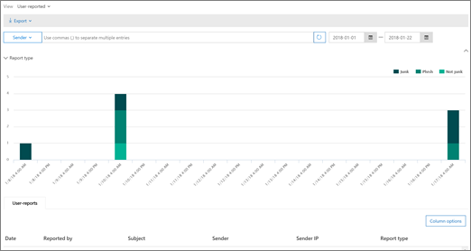

# Anzeigen von E-Mail-Sicherheitsberichten im Security & Compliance CenterView email security reports in the Security & Compliance Center

[!INCLUDE [Microsoft 365 Defender rebranding](../includes/microsoft-defender-for-office.md)]

Im [Security & Compliance Center](https://protection.office.com) stehen eine Vielzahl von Berichten zur Verfügung, um zu sehen, wie e-Mail-Sicherheitsfunktionen wie Antispam-, Antischadsoftware-und Verschlüsselungsfeatures in Microsoft 365 Ihre Organisation schützen.A variety of reports are available in the [Security & Compliance Center](https://protection.office.com) to help you see how email security features, such as anti-spam, anti-malware, and encryption features in Microsoft 365 are protecting your organization. Wenn Sie über die [erforderlichen Berechtigungen](#what-permissions-are-needed-to-view-these-reports)verfügen, können Sie diese Berichte im Security & Compliance Center anzeigen, indem Sie **Reports** zum \> **Dashboard** Berichte wechseln.If you have the [necessary permissions](#what-permissions-are-needed-to-view-these-reports), you can view these reports in the Security & Compliance Center by going to **Reports** \> **Dashboard**. Wenn Sie direkt zum Dashboard Berichte wechseln möchten, öffnen Sie <https://protection.office.com/insightdashboard> .To go directly to the Reports dashboard, open <https://protection.office.com/insightdashboard>.

## Bericht über kompromittierte BenutzerCompromised users report

> [!NOTE]
> Dieser Bericht ist in Microsoft 365-Organisationen mit Exchange Online-Postfächern verfügbar.This report is available in Microsoft 365 organizations with Exchange Online mailboxes. Es ist nicht in eigenständigen Exchange Online Schutzorganisationen (EoP) verfügbar.It's not available in standalone Exchange Online Protection (EOP) organizations.

Der Bericht " **kompromittierte Benutzer** " zeigt die Anzahl der Benutzerkonten an, die in den letzten 7 Tagen als **verdächtig** oder **eingeschränkt** gekennzeichnet wurden.The **Compromised users** report shows shows the number of user accounts that were marked as **Suspicious** or **Restricted** within the last 7 days. Konten in einem dieser Zustände sind problematisch oder sogar gefährdet.Accounts in either of these states are problematic or even compromised. Bei häufiger Verwendung können Sie mit dem Bericht Spitzen und sogar Trends in verdächtigen oder eingeschränkten Konten erkennen.With frequent use, you can use the report to spot spikes, and even trends, in suspicious or restricted accounts. Weitere Informationen zu kompromittierten Benutzern finden Sie unter [reagieren auf ein kompromittiertes e-Mail-Konto](responding-to-a-compromised-email-account.md).For more information about compromised users, see [Responding to a compromised email account](responding-to-a-compromised-email-account.md).

In der Ansicht "aggregiert" werden Daten für die letzten 90 Tage angezeigt, und in der Detailansicht werden Daten für die letzten 30 Tage angezeigt.The aggregate view shows data for the last 90 days and the detail view shows data for the last 30 days.

Öffnen Sie zum Anzeigen des Berichts das [Security & Compliance Center](https://protection.office.com), wechseln Sie **Reports** zum \> **Dashboard** Berichte, und wählen Sie **kompromittierte Benutzer** aus.To view the report, open the [Security & Compliance Center](https://protection.office.com), go to **Reports** \> **Dashboard** and select **Compromised users**. Wenn Sie direkt zum Bericht wechseln möchten, öffnen Sie <https://protection.office.com/reportv2?id=CompromisedUsers> .To go directly to the report, open <https://protection.office.com/reportv2?id=CompromisedUsers>.

Sie können die Tabelle Diagramm und Details filtern, indem Sie auf **Filter** klicken und mindestens einen der folgenden Werte auswählen:You can filter both the chart and the details table by clicking **Filters** and selecting one or more of the following values:

- **Start Datum** und **Enddatum****Start date** and **End date**

- **Verdächtig**: das Benutzerkonto hat verdächtige e-Mails gesendet, und es besteht das Risiko, dass das Senden von e-Mails eingeschränkt wird.**Suspicious**: The user account has sent suspicious email and is at risk of being restricted from sending email.

- **Eingeschränkt**: das Benutzerkonto wurde aufgrund strenger verdächtiger Muster vom Senden von e-Mails eingeschränkt.**Restricted**: The user account has been restricted from sending email due to highly suspicious patterns.

Wenn Sie auf **Detailtabelle anzeigen** klicken, werden die folgenden Details angezeigt:If you click **View details table**, you can see the following details:

- **Erstellungszeit****Creation time**
- **Benutzer-ID****User ID**
- **Aktion****Action**

Klicken Sie auf **Bericht anzeigen**, um zur Berichtsansicht zurückzukehren.To go back to the report view, click **View report**.

## Verschlüsselungs BerichtEncryption report

Der **Verschlüsselungs Bericht** steht in EoP (Abonnements mit Postfächern in Exchange Online oder eigenständigen EoP ohne Exchange Online Postfächer) zur Verfügung.The **Encryption report** is available in EOP (subscriptions with mailboxes in Exchange Online or standalone EOP without Exchange Online mailboxes). Das Sicherheitsteam Ihrer Organisation kann Informationen in diesem Bericht verwenden, um Muster zu identifizieren und Richtlinien für vertrauliche e-Mail-Nachrichten proaktiv anzuwenden oder anzupassen.Your organization's security team can use information in this report to identify patterns and proactively apply or adjust policies for sensitive email messages. Zum Beispiel:For example:

- Wenn eine große Anzahl von von Benutzern verschlüsselten e-Mail-Nachrichten angezeigt wird, möchten Sie möglicherweise eine Verschlüsselungsrichtlinie zum Automatisieren der Verschlüsselung für bestimmte Anwendungsfälle hinzufügen.If you see a high number of email messages encrypted by users, you might want to add an encryption policy to automate encryption for certain use cases. Weitere Informationen finden Sie unter [Definieren von Nachrichtenfluss Regeln zum Verschlüsseln von e-Mail-Nachrichten in Microsoft 365](../../compliance/define-mail-flow-rules-to-encrypt-email.md).For more information, see [Define mail flow rules to encrypt email messages in Microsoft 365](../../compliance/define-mail-flow-rules-to-encrypt-email.md).

- Wenn Sie über eine Reihe von Verschlüsselungs Vorlagen verfügen, die von niemandem verwendet werden, können Sie untersuchen, ob Benutzer eine Funktions Schulung benötigen.If you have a number of encryption templates available but no one is using them, you might explore whether users need feature training.

Die Aggregatansicht ermöglicht das Filtern für die letzten 90 Tage, während die Detailansicht 10 Tage lang gefiltert werden kann.The aggregate view allows filtering for the last 90 days, while the detail view allows filtering for 10 days.

Öffnen Sie zum Anzeigen des Berichts das [Security & Compliance Center](https://protection.office.com), wechseln Sie **Reports** zum \> **Dashboard** Berichte, und wählen Sie **Verschlüsselungs Bericht** aus.To view the report, open the [Security & Compliance Center](https://protection.office.com), go to **Reports** \> **Dashboard** and select **Encryption report**. Wenn Sie direkt zum Bericht wechseln möchten, öffnen Sie <https://protection.office.com/reportv2?id=EncryptionReport> .To go directly to the report, open <https://protection.office.com/reportv2?id=EncryptionReport>.

Weitere Informationen zur Verschlüsselung finden Sie unter [e-Mail-Verschlüsselung in Microsoft 365](../../compliance/email-encryption.md).To learn more about encryption, see [Email encryption in Microsoft 365](../../compliance/email-encryption.md).

### Berichtsansicht für den Verschlüsselungs BerichtReport view for the Encryption report

Sie können die folgenden Filter für das Diagramm verwenden:You can use the following filters on the chart:

- **Anzeigen von Daten nach: Nachrichten Verschlüsselungs Bericht** und **Aufschlüsselung nach: Verschlüsselungsmethode**: die folgenden Verschlüsselungsmethoden sind verfügbar:**View data by: Message Encryption Report** and **Break down by: Encryption method**: The following encryption methods are available:

  - **Verschlüsselung nach Benutzer****Encryption by user**
  - **Verschlüsselung nach Richtlinie****Encryption by policy**

  Wenn Sie auf **Filter** klicken, können Sie das Diagramm mit den folgenden Filtern ändern:If you click **Filters**, you can modify the chart with the following filters:

  - **Start Datum** und **Enddatum****Start date** and **End date**
  - Verschlüsselungsmethode.Encryption method.
  - Verschlüsselungs Vorlage.Encryption template.

- **Anzeigen von Daten nach: Nachrichten Verschlüsselungs Bericht** und **Aufschlüsselung nach: Verschlüsselungs Vorlage**: die folgenden Verschlüsselungsmethoden sind verfügbar:**View data by: Message Encryption Report** and **Break down by: Encryption template**: The following encryption methods are available:

  - **Nicht weiterleiten****Do not forward**
  - **Nur verschlüsseln****Encrypt only**
  - **Vorheriges OM****OME previous**
  - **Custom****Custom**

  Wenn Sie auf **Filter** klicken, können Sie das Diagramm mit den folgenden Filtern ändern:If you click **Filters**, you can modify the chart with the following filters:

  - **Start Datum** und **Enddatum****Start date** and **End date**
  - VerschlüsselungsmethodeEncryption method
  - Verschlüsselungs VorlageEncryption template

- **Daten nach: Top 5 Recipient Domains**: in dieser Ansicht wird ein Kreisdiagramm mit gesendeten Nachrichten Zählern für die Top 5-Empfängerdomänen angezeigt.**View data by: Top 5 recipient domains**: This view shows a pie chart with sent message counts for the top 5 recipient domains.

  Wenn Sie auf **Filter** klicken, können Sie ein **Start** -und **Enddatum** auswählen.If you click **Filters**, you can select a **Start date** and **End date**.

### Detailtabellen Ansicht für den Verschlüsselungs BerichtDetails table view for the Encryption report

Wenn Sie auf **Detailtabelle anzeigen** klicken, hängt die Anzeige der angezeigten Informationen von dem Diagramm ab, das Sie gesucht haben:If you click **View details table**, the information that's shown depends on the chart you were looking at:

- **Aufschlüsseln nach: Verschlüsselungsmethode** oder **Aufschlüsselung durch: Verschlüsselungs Vorlage**: die folgenden Informationen werden angezeigt:**Break down by: Encryption method** or **Break down by: Encryption template**: The following information is shown:

  - **Date****Date**
  - **Absenderadresse****Sender address**
  - **Verschlüsselungs Vorlage****Encryption template**
  - **Verschlüsselungsmethode****Encryption method**
  - **Empfängeradresse****Recipient address**
  - **Betreff****Subject**

- **Anzeigen von Daten nach: Top 5 Recipient Domains**:**View data by: Top 5 recipient domains**:

  - **Date****Date**
  - **Empfängerdomäne****Recipient domain**
  - **Nachrichtenanzahl****Message count**

Wenn Sie in einer Detailtabellen Ansicht auf **Filter** klicken, können Sie die Ergebnisse mit den folgenden Filtern ändern:If you click **Filters** in a details table view, you can modify the results with the following filters:

- **Start Datum** und **Enddatum****Start date** and **End date**
- VerschlüsselungsmethodeEncryption method
- Verschlüsselungs VorlageEncryption template

Klicken Sie auf **Bericht anzeigen**, um zur Berichtsansicht zurückzukehren.To go back to the report view, click **View report**.

## Nachrichtenfluss-StatusberichtMailflow status report

Der e-Mail- **Fluss Statusbericht** enthält Informationen zu Schadsoftware, Spam, Phishing und blockierten Edge-Nachrichten.The **Mailflow status report** contains information about malware, spam, phishing and edge blocked messages. Weitere Informationen finden Sie unter [Nachrichtenfluss-Statusbericht](view-mail-flow-reports.md#mailflow-status-report).For more details, see [Mailflow status report](view-mail-flow-reports.md#mailflow-status-report).

## Malware Erkennungen im e-Mail-BerichtMalware detections in email report

Der Bericht " **Malwareerkennungen in e-Mail** " zeigt Informationen zu Malwareerkennungen in eingehenden und ausgehenden e-Mail-Nachrichten (Schadsoftware, die durch Exchange Online Schutz oder EoP erkannt wurde).The **Malware detections in email** report shows information about malware detections in incoming and outgoing email messages (malware detected by Exchange Online Protection or EOP). Weitere Informationen zum Schutz vor Schadsoftware in EoP finden Sie unter [Anti-Malware Protection in EoP](anti-malware-protection.md).For more information about malware protection in EOP, see [Anti-malware protection in EOP](anti-malware-protection.md).

 Der Filter "Aggregierte Ansicht" ermöglicht 90 Tage, während der Filter "Details" nur 10 Tage zulässt.The aggregate view filter allows for 90 days, while the details table filter only allows for 10 days.

Wenn Sie den Bericht anzeigen möchten, öffnen Sie das [Security & Compliance Center](https://protection.office.com), wechseln Sie zu **Berichte** \> - **Dashboard** , und wählen Sie in e-Mail die Option " **Malware Erkennungen" aus**.To view the report, open the [Security & Compliance Center](https://protection.office.com), go to **Reports** \> **Dashboard** and select **Malware detections in email**. Wenn Sie direkt zum Bericht wechseln möchten, öffnen Sie <https://protection.office.com/reportv2?id=MalwareDetections> .To go directly to the report, open <https://protection.office.com/reportv2?id=MalwareDetections>.

Sie können sowohl das Diagramm als auch die Tabelle Details filtern, indem Sie auf **Filter** klicken und folgende Optionen auswählen:You can filter both the chart and the details table by clicking **Filters** and selecting:

- **Start Datum** und **Enddatum****Start date** and **End date**
- **Eingehende****Inbound**
- **Ausgehende****Outbound**

Wenn Sie auf **Detailtabelle anzeigen** klicken, werden die folgenden Details angezeigt:If you click **View details table**, you can see the following details:

- **Date****Date**
- **Absenderadresse****Sender address**
- **Empfängeradresse****Recipient address**
- **Nachrichten-ID**: verfügbar im Kopfzeilenfeld nach **richten-ID** im Nachrichtenkopf und sollte eindeutig sein.**Message ID**: Available in the **Message-ID** header field in the message header and should be unique. Ein Beispielwert ist `<08f1e0f6806a47b4ac103961109ae6ef@server.domain>` (Beachten Sie die spitzen Klammern).An example value is `<08f1e0f6806a47b4ac103961109ae6ef@server.domain>` (note the angle brackets).
- **Betreff****Subject**
- **Filename****Filename**
- **Name der Schadsoftware****Malware name**

Klicken Sie auf **Bericht anzeigen**, um zur Berichtsansicht zurückzukehren.To go back to the report view, click **View report**.

## Bericht über die e-Mail-WartezeitMail latency report

Der **Bericht über die e-Mail-Wartezeit** enthält Informationen zur e-Mail-Zustellung und zur detonations Wartezeit in Ihrer Organisation.The **Mail latency report** contains information on the mail delivery and detonation latency experienced within your organization. Weitere Informationen finden Sie unter [Mail Latency Report](view-reports-for-atp.md#mail-latency-report).For more information, see [Mail latency report](view-reports-for-atp.md#mail-latency-report).

## Gesendete und empfangene e-Mail-BerichteSent and received email report

Der Bericht **gesendete und empfangene e-Mails** enthält Informationen zu Schadsoftware, Spam, Nachrichtenfluss Regeln (auch bekannt als Transportregeln) und erweiterte Schadsoftware-Erkennungen, nachdem e-Mail-Dienste in den Dienst eingegangen sind.The **Sent and received email** report contains information about malware, spam, mail flow rules (also known as transport rules), and advanced malware detections after email enters the service. Weitere Informationen finden Sie unter [gesendete und empfangene e-Mail-Berichte](view-mail-flow-reports.md#sent-and-received-email-report).For more information, see [Sent and received email report](view-mail-flow-reports.md#sent-and-received-email-report).

## SpamerkennungsberichtSpam detections report

Der **Spam Erkennungs** Bericht zeigt Spam-e-Mails an, die von EoP blockiert wurden.The **Spam detections** report shows spam email messages that were blocked by EOP. Nachrichten werden einzeln und nicht pro Empfänger gezählt.Messages are counted individually, not per recipient. Wenn beispielsweise die gleiche Spamnachricht an 100 Empfänger in Ihrer Organisation gesendet wurde, zählt sie als eine Nachricht.For example, if the same spam message was sent to 100 recipients in your organization, it counts as one message.

Die aggregierte Ansicht ermöglicht eine Filterung von 90 Tagen, während die Detailtabelle 10 Tage Filterung zulässt.The aggregate view allows for 90 days filtering, while the details table allows for 10 days filtering.

Öffnen Sie zum Anzeigen des Berichts das [Security & Compliance Center](https://protection.office.com), wechseln Sie **Reports** zum \> **Dashboard** Berichte, und wählen Sie **Spam Erkennung** aus.To view the report, open the [Security & Compliance Center](https://protection.office.com), go to **Reports** \> **Dashboard** and select **Spam detections**. Wenn Sie direkt zum Bericht wechseln möchten, öffnen Sie <https://protection.office.com/reportv2?id=SpamDetections> .To go directly to the report, open <https://protection.office.com/reportv2?id=SpamDetections>.

Weitere Informationen zum Antispamschutz finden Sie unter [Anti-Spam Protection in EoP](anti-spam-protection.md).For more information about anti-spam protection, see [Anti-spam protection in EOP](anti-spam-protection.md).

### Berichtsansicht für den Spam Erkennungs BerichtReport view for the Spam detections report

Die folgenden Diagramme stehen in der Berichtsansicht zur Verfügung:The following charts are available in the report view:

- **Aufschlüsseln nach: Action**: die folgenden Ereignistypen werden angezeigt:**Break down by: Action**: The following event types are shown:

  - **Gefilterter Spam Inhalt****Spam content filtered**
  - **Spam-IP-Block****Spam IP block**
  - **Spam Umschlag Block****Spam envelope block**
  - **Spam-Blockierung-Filter**: verzeichnisbasierte Edge-Blockierung (Blockierung)**Spam DBEB filter**: Directory based edge blocking (DBEB)

  Wenn Sie auf einen Tag (Datenpunkt) im Diagramm zeigen, können Sie sehen, wie viele Elemente an diesem Tag blockiert wurden, und wie diese Elemente kategorisiert werden.When you hover over a day (data point) in the chart, you can see how many items were blocked that day, as well as how those items are categorized.

  

- **Aufschlüsseln nach: Direction**: die folgenden Anweisungen werden angezeigt:**Break down by: Direction**: The following directions are shown:

  - **Eingehende****Inbound**
  - **Ausgehende****Outbound**

  

Wenn Sie in einer Berichtsansicht auf **Filter** klicken, können Sie die Ergebnisse mit den folgenden Filtern ändern:If you click **Filters** in a report view, you can modify the results with the following filters:

- **Start Datum** und **Enddatum****Start date** and **End date**
- RichtungswerteDirection values
- Werte des EreignistypsEvent type values

### Detailtabellen Ansicht für den Spam Erkennungs BerichtDetails table view for the Spam detections report

Wenn Sie in einer Berichtsansicht auf **Detailtabelle anzeigen** klicken, werden die folgenden Informationen angezeigt:If you click **View details table** in any report view, the following information is shown:

- **Date****Date**
- **Absenderadresse****Sender address**
- **Empfängeradresse****Recipient address**
- **Ereignistyp****Event type**
- **Aktion****Action**
- **Betreff****Subject**

Wenn Sie in einer Detailtabelle auf **Filter** klicken, können Sie die Ergebnisse mit den folgenden Filtern ändern:If you click **Filters** in a details table, you can modify the results with the following filters:

- **Start Datum** und **Enddatum****Start date** and **End date**
- RichtungswerteDirection values
- Werte des EreignistypsEvent type values

Klicken Sie auf **Bericht anzeigen**, um zur Berichtsansicht zurückzukehren.To go back to the report view, click **View report**.

## Spoofing-Erkennungs BerichtSpoof detections report

Der Bericht **Spoof-Erkennungen** zeigt, wie viele gefälschte e-Mail-Nachrichten erkannt wurden und von denen, die als "gut" eingestuft wurden (Spoof-e-Mails wurden aus legitimen geschäftlichen Gründen ausgeführt).The **Spoof detections** report shows how many spoof mail messages were detected, and of those, which ones were considered "good" (spoof mail done for legitimate business reasons). Weitere Informationen zur Spoofing finden Sie unter [Anti-Spoofing Protection in EoP](anti-spoofing-protection.md).For more information about spoofing, see [Anti-spoofing protection in EOP](anti-spoofing-protection.md).

Die aggregierte Ansicht des Berichts ermöglicht eine Filterung von 90 Tagen, während die Detailansicht nur zehn Tage nach der Filterung zulässt.The aggregate view of the report allows for 90 days of filtering, while the detail view only allows for ten days of filtering.

Öffnen Sie zum Anzeigen des Berichts das [Security & Compliance Center](https://protection.office.com), wechseln Sie **Reports** zum \> **Dashboard** Berichte, und wählen Sie **Spoof-Erkennungen** aus.To view the report, open the [Security & Compliance Center](https://protection.office.com), go to **Reports** \> **Dashboard** and select **Spoof detections**. Wenn Sie direkt zum Bericht wechseln möchten, öffnen Sie <https://protection.office.com/reportv2?id=SpoofMailReport> .To go directly to the report, open <https://protection.office.com/reportv2?id=SpoofMailReport>.

Wenn Sie auf einen Tag (Datenpunkt) im Diagramm zeigen, können Sie sehen, wie viele Spoofing-e-Mail-Nachrichten durchlaufen haben.When you hover over a day (data point) in the chart, you can see how many spoof mail messages came through.

Sie können die Tabelle Diagramm und Details filtern, indem Sie auf **Filter** klicken und mindestens einen der folgenden Werte auswählen:You can filter both the chart and the details table by clicking **Filters** and selecting one or more of the following values:

- **Start Datum** und **Enddatum****Start date** and **End date**

- **Gute e-Mail****Good mail**

- **Als Spam erfasst****Caught as spam**

Wenn Sie auf **Detailtabelle anzeigen** klicken, werden die folgenden Details angezeigt:If you click **View details table**, you can see the following details:

- **Date****Date**
- **Gefälschter Absender****Spoofed sender**
- **Echter Absender****True sender**
- **Sender-IP****Sender IP**
- **Aktion****Action**
- **Nachrichtenanzahl****Message count**

Klicken Sie auf **Bericht anzeigen**, um zur Berichtsansicht zurückzukehren.To go back to the report view, click **View report**.

## Threat Protection-StatusberichtThreat protection status report

Der **Statusbericht zum Bedrohungsschutz** ist sowohl in EoP als auch in Microsoft Defender für Office 365 verfügbar. die Berichte enthalten jedoch unterschiedliche Daten.The **Threat protection status** report is available in both EOP and Microsoft Defender for Office 365; however, the reports contain different data. EoP-Kunden können beispielsweise Informationen über in e-Mails erkannte Schadsoftware anzeigen, aber keine Informationen zu bösartigen Dateien, die von [ATP für SharePoint, OneDrive oder Microsoft Teams](atp-for-spo-odb-and-teams.md)erkannt wurden.For example, EOP customers can view information about malware detected in email, but not information about malicious files detected by [ATP for SharePoint, OneDrive, or Microsoft Teams](atp-for-spo-odb-and-teams.md).

Der Bericht enthält die Anzahl von e-Mail-Nachrichten mit bösartigen Inhalten wie Dateien oder Websiteadressen (URLs), die von der Antischadsoftware-Engine, der [automatischen Säuberungsaktion (Zero-Hour Purge)](zero-hour-auto-purge.md)und dem Verteidiger für Office 365 Features wie [sichere Links](atp-safe-links.md), [sichere Anlagen](atp-safe-attachments.md)und [Anti-Phishing](set-up-anti-phishing-policies.md)blockiert wurden.The report provides the count of email messages with malicious content, such as files or website addresses (URLs) that were blocked by the anti-malware engine, [zero-hour auto purge (ZAP)](zero-hour-auto-purge.md), and Defender for Office 365 features like [Safe Links](atp-safe-links.md), [Safe Attachments](atp-safe-attachments.md), and [Anti-phishing](set-up-anti-phishing-policies.md). Sie können diese Informationen verwenden, um Trends zu identifizieren oder zu bestimmen, ob Organisationsrichtlinien angepasst werden müssen.You can use this information to identify trends or determine whether organization policies need adjustment.

**Hinweis**: Es ist wichtig zu verstehen, dass eine Nachricht, die an fünf Empfänger gesendet wird, als fünf verschiedene Nachrichten gezählt wird und nicht eine Nachricht.**Note**: It's important to understand that if a message is sent to five recipients we count it as five different messages and not one message.

Öffnen Sie zum Anzeigen des Berichts das [Security & Compliance Center](https://protection.office.com), wechseln Sie **Reports** zum \> **Dashboard** Berichte, und wählen Sie **Threat Protection Status** aus.To view the report, open the [Security & Compliance Center](https://protection.office.com), go to **Reports** \> **Dashboard** and select **Threat protection status**. Wenn Sie direkt zum Bericht wechseln möchten, öffnen Sie eine der folgenden URLs:To go directly to the report, open one of the following URLs:

- Microsoft Defender für Office 365: <https://protection.office.com/reportv2?id=TPSAggregateReportATP>Microsoft Defender for Office 365: <https://protection.office.com/reportv2?id=TPSAggregateReportATP>
- EoP <https://protection.office.com/reportv2?id=TPSAggregateReport>EOP: <https://protection.office.com/reportv2?id=TPSAggregateReport>

Standardmäßig zeigt das Diagrammdaten für die letzten 7 Tage an.By default, the chart shows data for the past 7 days. Wenn Sie auf **Filter** klicken, können Sie einen Datumsbereich von 90 Tag auswählen (Testabonnements sind möglicherweise auf 30 Tage eingeschränkt).If you click **Filters**, you can select a 90 day date range (trial subscriptions might be limited to 30 days). Die Tabellenansicht Details ermöglicht das Filtern für 30 Tage.The details table view allows filtering for 30 days.

### Berichtsansicht für den Statusbericht über den BedrohungsschutzReport view for the Threat protection status report

Die folgenden Ansichten sind verfügbar:The following views are available:

- **Anzeigen von Daten nach: Übersicht**: die folgenden Erkennungsinformationen werden angezeigt:**View data by: Overview**: The following detection information is shown:

  - **E-Mail-Schadsoftware****Email malware**
  - **Phishing per e-Mail****Email phish**
  - **Inhalts-Schadsoftware****Content malware**

  

- **Anzeigen von Daten nach: Inhalt \> Schadsoftware**1: die folgenden Informationen werden für Microsoft Defender für Office 365 Organisationen angezeigt:**View data by: Content \> Malware**1: The following information is shown for Microsoft Defender for Office 365 organizations:

  - **Anti-Malware Engine**: Schadsoftware, die in SharePoint, OneDrive und Microsoft Teams durch die [integrierte Virenerkennung in Microsoft 365](virus-detection-in-spo.md)erkannt wurde.**Anti-malware engine**: Malicious files detected in Sharepoint, OneDrive, and Microsoft Teams by the [built-in virus detection in Microsoft 365](virus-detection-in-spo.md).
  - **Datei Explosion**: von [ATP für SharePoint, OneDrive und Microsoft Teams](atp-for-spo-odb-and-teams.md)erkannte bösartige Dateien.**File detonation**: Malicious files detected by [ATP for Sharepoint, OneDrive, and Microsoft Teams](atp-for-spo-odb-and-teams.md).

  

- **Anzeigen von Daten nach: Nachrichten Überschreibung**: die folgenden Außerkraftsetzungs Grundinformationen werden angezeigt:**View data by: Message Override**: The following override reason information is shown:

  - **On-premises Skip****On-premises skip**
  - **IP-Adresse zulassen****IP Allow**
  - **Nachrichtenfluss Regel****Mail flow rule**
  - **Absender zulassen****Sender allow**
  - **Domäne zulassen****Domain allow**
  - **Zap nicht aktiviert****ZAP not enabled**
  - **Junk-e-Mail-Ordner nicht aktiviert****Junk Mail folder not enabled**
  - **Sicherer Absender des Benutzers****User Safe Sender**
  - **Benutzer sichere Domäne****User Safe Domain**

  

- **Aufschlüsseln nach: Erkennungstechnologie** und **Anzeigen von Daten nach: e-Mail \> Phishing**: die folgenden Informationen werden angezeigt:**Break down by: Detection technology** and **View data by: Email \> Phish**: The following information is shown:

  - **ATP-generierte URL-Reputation**1: Reputation des böswilligen URLs, die von Defender für Office 365 Explosionen in anderen Microsoft 365-Kunden generiert wurde.**ATP-generated URL reputation**1: Malicious URL reputation generated from Defender for Office 365 detonations in other Microsoft 365 customers.
  - **Erweiterter Phishing-Filter**: Phishing-Signale basierend auf dem maschinellen lernen.**Advanced phish filter**: Phishing signals based on machine learning.
  - **Anti-Spoof-DMARC-Fehler**: DMARC-Authentifizierungsfehler bei Nachrichten.**Anti-spoof - DMARC failure**: DMARC authentication failure on messages.
  - **Anti-Spoof-Intra-org**: Absender versucht, die Empfängerdomäne vorzutäuschen.**Anti-spoof - intra-org**: Sender is trying to spoof the recipient domain.
  - **Anti-Spoof-externe Domäne**: Absender versucht, eine andere Domäne zu spoofen.**Anti-spoof - external domain**: Sender is trying to spoof some other domain.
  - **Marken Identitätswechsel**: Identitätswechsel von bekannten Marken, die auf Absendern basieren.**Brand impersonation**: Impersonation of well-known brands based on senders.
  - **Domänen Identitätswechsel**1: Identitätswechsel von Domänen, die der Kunde besitzt oder definiert.**Domain impersonation**1: Impersonation of domains that the customer owns or defines.
  - **EoP-URL-Reputation**: böswillige URL-Reputation.**EOP URL reputation**: Malicious URL reputation.
  - **Allgemeiner Phishing-Filter**: Phishing-Signale basierend auf Analysten Regeln.**General phish filter**: Phishing signals based on analyst rules.
  - **Sonstige****Others**
  - **Phishing-zap**2: Nullstunde automatische Bereinigung von Phishing-Nachrichten.**Phish ZAP**2: Zero hour auto purge of phishing messages.
  - **URL Detonation**1**URL detonation**1
  - **Benutzeridentitätswechsel**1: Identitätswechsel von Benutzern, die vom Administrator definiert oder über die Post Fach Intelligenz erlernt wurden.**User impersonation**1: Impersonation of users defined by admin or learned through mailbox intelligence.

  

- **Aufschlüsseln nach: Erkennungstechnologie** und **Anzeigen von Daten nach: e-Mail- \> Schadsoftware**: die folgenden Informationen werden angezeigt:**Break down by: Detection technology** and **View data by: Email \> Malware**: The following information is shown:

  - **ATP-generierte dateireputation**1: die gesamte von Defender generierte böswillige dateireputation für Office 365 Explosionen.**ATP-generated file reputation**1: All malicious file reputation generated by Defender for Office 365 detonations.
  - **Anti-Malware Engine**1: Erkennung von Antischadsoftware-Engines.**Anti-malware engine**1: Detection from anti-malware engines.
  - **Anti-Malware Policy-Dateityp Block**: Dies sind e-Mail-Nachrichten, die aufgrund der Art der in der Nachricht identifizierten bösartigen Datei herausgefiltert wurden.**Anti-malware policy file type block**: These are email messages filtered out due to the type of malicious file identified in the message.
  - **Datei Detonation**1: Erkennung durch sichere Anlagen.**File detonation**1: Detection by Safe Attachments.
  - **Böswillige dateireputation****Malicious file reputation**
  - **Malware zap**2**Malware ZAP**2
  - **Sonstige****Others**

  

- **Aufschlüsseln nach: Richtlinientyp** und **Anzeigen von Daten nach: e-Mail- \> Phishing** oder **Anzeigen von Daten nach: e-Mail- \> Schadsoftware**: die folgenden Informationen werden angezeigt:**Break down by: Policy type** and **View data by: Email \> Phish** or **View data by: Email \> Malware**: The following information is shown:

  - **Anti-Malware****Anti-malware**
  - **Sichere Anlagen**1**Safe Attachments**1
  - **Anti-Phishing****Anti-phish**
  - **Anti-Spam****Anti-spam**
  - **Nachrichtenfluss Regel** (auch als Transportregel bezeichnet)**Mail flow rule** (also known as a transport rule)
  - **Sonstige****Others**

  

- **Aufschlüsseln nach: Zustellungsstatus** und **Anzeigen von Daten nach: e-Mail \> Phishing** oder **Daten anzeigen nach: e-Mail- \> Schadsoftware**: die folgenden Informationen werden angezeigt:**Break down by: Delivery status** and **View data by: Email \> Phish** or **View data by: Email \> Malware**: The following information is shown:

  - **Zustellung fehlgeschlagen****Delivery failed**
  - **Gelöscht****Dropped**
  - **Weitergeleitet****Forwarded**
  - **Gehostetes Postfach: benutzerdefinierter Ordner****Hosted mailbox: Custom folder**
  - **Gehostetes Postfach: Gelöschte Elemente****Hosted mailbox: Deleted items**
  - **Gehostetes Postfach: Posteingang****Hosted mailbox: Inbox**
  - **Gehostetes Postfach: Junk****Hosted mailbox: Junk**
  - **Lokaler Server: zugestellt****On-premises server: Delivered**
  - **Quarantäne****Quarantine**

  

1 Verteidiger nur für Office 3651 Defender for Office 365 only

2 Zero-Hour Auto Purge (zap) ist nicht in eigenständigen EoP verfügbar (funktioniert nur in Exchange Online Postfächern).2 Zero-hour auto purge (ZAP) isn't available in standalone EOP (it only works in Exchange Online mailboxes).

Wenn Sie auf **Filter** klicken, sind die verfügbaren Filter abhängig vom Diagramm, das Sie untersucht haben:If you click **Filters**, the filters available depends on the chart you were looking at:

- Wenn **Sie Daten nach: Inhalts \> -Schadsoftware anzeigen** möchten, können Sie den Bericht nach **Start Datum** und **Enddatum** und dem **Erkennungs** Wert ändern.For **View data by: Content \> Malware**, you can modify the report by **Start date** and **End date**, and the **Detection** value.

- Zum **Anzeigen von Daten nach: Nachrichten Außerkraftsetzung** können Sie den Bericht mit den folgenden Filtern ändern:For **View data by: Message Override**, you can modify the report with the following filters:

  - **Start Datum** und **Enddatum****Start date** and **End date**
  - **Außerkraftsetzungs Grund****Override Reason**
  - **Tag**: filtert die Ergebnisse nach Benutzern oder Gruppen, für die das angegebene Benutzertag angewendet wurde (einschließlich Prioritäts Konten).**Tag**: Filter the results by users or groups that have had the specified user tag applied (including priority accounts). Weitere Informationen zu Benutzer Tags finden Sie unter [User Tags](user-tags.md).For more information about user tags, see [User tags](user-tags.md).
  - **Domäne****Domain**

- Für alle anderen Ansichten können Sie den Bericht mit den folgenden Filtern ändern:For all other views, you can modify the report with the following filters:

  - **Start Datum** und **Enddatum****Start date** and **End date**
  - **Erkennung****Detection**
  - **Geschützt von**: **ATP** oder **EoP****Protected by**: **ATP** or **EOP**
  - **Tag**: filtert die Ergebnisse nach Benutzern oder Gruppen, für die das angegebene Benutzertag angewendet wurde (einschließlich Prioritäts Konten).**Tag**: Filter the results by users or groups that have had the specified user tag applied (including priority accounts). Weitere Informationen zu Benutzer Tags finden Sie unter [User Tags](user-tags.md).For more information about user tags, see [User tags](user-tags.md).
  - **Domäne****Domain**

### Detailtabellen Ansicht für den Threat Protection-StatusberichtDetails table view for the Threat protection status report

Wenn Sie auf **Detailtabelle anzeigen** klicken, hängt die Anzeige der angezeigten Informationen von dem Diagramm ab, das Sie gesucht haben:If you click **View details table**, the information that's shown depends on the chart you were looking at:

- **Daten anzeigen nach: Übersicht**: keine **Detailtabellen** -Schaltfläche anzeigen verfügbar.**View data by: Overview**: No **View details table** button is available.

- **Anzeigen von Daten nach: Inhalt \> Schadsoftware**:**View data by: Content \> Malware**:

  - **Date****Date**
  - **Ort****Location**
  - **Regie****Directed by**
  - **Name der Schadsoftware****Malware name**

  Wenn Sie in dieser Ansicht auf **Filter** klicken, können Sie den Bericht nach **Start Datum** und **Enddatum** und dem **Erkennungs** Wert ändern.If you click **Filters** in this view, you can modify the report by **Start date** and **End date**, and the **Detection** value.

- **Anzeigen von Daten nach: Nachrichten Außerkraftsetzung**:**View data by: Message Override**:

  - **Date****Date**
  - **Betreff****Subject**
  - **Sender****Sender**
  - **Recipients****Recipients**
  - **Erkannt von****Detected by**
  - **Außerkraftsetzungs Grund****Override Reason**
  - **Kompromiss Quelle****Source of Compromise**
  - **Tags****Tags**

  Wenn Sie in dieser Ansicht auf **Filter** klicken, können Sie den Bericht mit den folgenden Filtern ändern:If you click **Filters** in this view, you can modify the report with the following filters:

  - **Start Datum** und **Enddatum****Start date** and **End date**
  - **Außerkraftsetzungs Grund****Override Reason**
  - **Tag**: filtert die Ergebnisse nach Benutzern oder Gruppen, für die das angegebene Benutzertag angewendet wurde (einschließlich Prioritäts Konten).**Tag**: Filter the results by users or groups that have had the specified user tag applied (including priority accounts). Weitere Informationen zu Benutzer Tags finden Sie unter [User Tags](user-tags.md).For more information about user tags, see [User tags](user-tags.md).
  - **Domäne****Domain**
  - **Empfänger** (Beachten Sie, dass diese filterbare Eigenschaft nur in der Detailtabellen Ansicht verfügbar ist)**Recipients** (Note that this filterable property is only available in the details table view)

- Alle anderen Diagramme:All other charts:

  - **Date****Date**
  - **Betreff****Subject**
  - **Sender****Sender**
  - **Recipients****Recipients**
  - **Erkannt von****Detected by**
  - **Zustellungs Status****Delivery Status**
  - **Kompromiss Quelle****Source of Compromise**
  - **Tags****Tags**

  Wenn Sie auf **Filter** klicken, können Sie den Bericht mit den folgenden Filtern ändern:If you click **Filters**, you can modify the report with the following filters:

  - **Start Datum** und **Enddatum****Start date** and **End date**
  - **Erkennung****Detection**
  - **Geschützt von**: **Defender für Office 365** oder **EoP****Protected by**: **Defender for Office 365** or **EOP**
  - **Tag**: filtert die Ergebnisse nach Benutzern oder Gruppen, für die das angegebene Benutzertag angewendet wurde (einschließlich Prioritäts Konten).**Tag**: Filter the results by users or groups that have had the specified user tag applied (including priority accounts). Weitere Informationen zu Benutzer Tags finden Sie unter [User Tags](user-tags.md).For more information about user tags, see [User tags](user-tags.md).
  - **Domäne****Domain**
  - **Empfänger** (Beachten Sie, dass diese filterbare Eigenschaft nur in der Detailtabellen Ansicht verfügbar ist)**Recipients** (Note that this filterable property is only available in the details table view)

## Höchst schädlicher BerichtTop malware report

Der **oberste Schadsoftware** -Bericht zeigt die verschiedenen Arten von Schadsoftware, die durch den [Schutz vor Schadsoftware in EoP](anti-malware-protection.md)erkannt wurden.The **Top malware** report shows the various kinds of malware that was detected by [anti-malware protection in EOP](anti-malware-protection.md).

Um den Bericht anzuzeigen, öffnen Sie das [Security & Compliance Center](https://protection.office.com), wechseln Sie zu **Berichte** \> - **Dashboard** , und wählen Sie **oben Malware** aus.To view the report, open the [Security & Compliance Center](https://protection.office.com), go to **Reports** \> **Dashboard** and select **Top malware**. Wenn Sie direkt zum Bericht wechseln möchten, öffnen Sie <https://protection.office.com/reportv2?id=TopMalware> .To go directly to the report, open <https://protection.office.com/reportv2?id=TopMalware>.

Wenn Sie mit dem Mauszeiger auf einen Keil im Kreisdiagramm zeigen, sehen Sie den Namen einer Art von Schadsoftware und wie viele Nachrichten mit dieser Schadsoftware erkannt wurden.When you hover over a wedge in the pie chart, you can see the name of a kind of malware and how many messages were detected as having that malware.

Wenn Sie auf **Detailtabelle anzeigen** klicken, werden die folgenden Details angezeigt:If you click **View details table**, you can see the following details:

- **Top-Schadsoftware****Top malware**
- **Count****Count**

Wenn Sie in der Ansicht Berichtsansicht oder Detailtabelle auf **Filter** klicken, können Sie einen Datumsbereich mit **anfangs** -und **Enddatum** angeben.If you click **Filters** in the report view or details table view, you can specify a date range with **Start date** and **End date**.

## URL-Bedrohungsschutz BerichtURL threat protection report

Der **Bericht über den URL-Bedrohungsschutz** steht in Microsoft Defender für Office 365 zur Verfügung.The **URL threat protection report** is available in Microsoft Defender for Office 365. Weitere Informationen finden Sie unter [URL Threat Protection-Bericht](view-reports-for-atp.md#url-threat-protection-report).For more information, see [URL threat protection report](view-reports-for-atp.md#url-threat-protection-report).

## Bericht über vom Benutzer gemeldete NachrichtenUser-reported messages report

Der Bericht "vom **Benutzer gemeldete Nachrichten** " zeigt Informationen über e-Mail-Nachrichten an, die von Benutzern mithilfe des [Berichtsnachrichten-Add-ins](enable-the-report-message-add-in.md)als Junk-oder Phishing-Versuche oder als gute e-Mail gemeldet wurden.The **User-reported messages** report shows information about email messages that users have reported as junk, phishing attempts, or good mail by using the [Report Message add-in](enable-the-report-message-add-in.md).

Für jede Nachricht stehen Details zur Verfügung, einschließlich des Zustellungs Grundes, einer solchen Spam Richtlinienausnahme oder Nachrichtenfluss Regel, die für Ihre Organisation konfiguriert ist.Details are available for each message, including the delivery reason, such a spam policy exception or mail flow rule configured for your organization. Um Details anzuzeigen, wählen Sie ein Element in der Liste Benutzer Berichte aus, und zeigen Sie dann die Informationen auf den Registerkarten **Zusammenfassung** und **Details** an.To view details, select an item in the user-reports list, and then view the information on the **Summary** and **Details** tabs.

Führen Sie einen der folgenden Schritte aus, um diesen Bericht im [Security & Compliance Center](https://protection.office.com)anzuzeigen:To view this report, in the [Security & Compliance Center](https://protection.office.com), do one of the following:

- Wechseln Sie zu **Threat Management** \> **Dashboard** von \> **Benutzern gemeldete Nachrichten**.Go to **Threat management** \> **Dashboard** \> **User-reported messages**.

- Wechseln Sie zu **Threat Management** \> **überprüfen** von \> **Benutzern gemeldeten Nachrichten**.Go to **Threat management** \> **Review** \> **User-reported messages**.

> [!IMPORTANT]
> Damit der Bericht über vom Benutzer gemeldete Nachrichten ordnungsgemäß funktioniert, **muss die Überwachungsprotokollierung** für Ihre Office 365 Umgebung aktiviert sein.In order for the User-reported messages report to work correctly, **audit logging must be turned on** for your Office 365 environment. Dies erfolgt in der Regel durch eine Person, der die Rolle "Überwachungsprotokolle" in Exchange Online zugewiesen ist.This is typically done by someone who has the Audit Logs role assigned in Exchange Online. Weitere Informationen finden Sie unter [Aktivieren oder Deaktivieren der Microsoft 365-Überwachungsprotokoll Suche](https://docs.microsoft.com/microsoft-365/compliance/turn-audit-log-search-on-or-off).For more information, see [Turn Microsoft 365 audit log search on or off](https://docs.microsoft.com/microsoft-365/compliance/turn-audit-log-search-on-or-off).

## Welche Berechtigungen sind zum Anzeigen dieser Berichte erforderlich?What permissions are needed to view these reports?

Damit Sie die in diesem Thema beschriebenen Berichte anzeigen und verwenden können, müssen Sie Mitglied einer der folgenden Rollengruppen im Security & Compliance Center sein:In order to view and use the reports described in this topic, you need to be a member of one of the following role groups in the Security & Compliance Center:

- **Organisationsverwaltung****Organization Management**
- **Sicherheits Administrator****Security Administrator**
- **Sicherheits Leser****Security Reader**
- **Globaler Leser****Global Reader**

Weitere Informationen finden Sie unter [Berechtigungen im Security & Compliance Center](permissions-in-the-security-and-compliance-center.md).For more information, see [Permissions in the Security & Compliance Center](permissions-in-the-security-and-compliance-center.md).

**Hinweis**: beim Hinzufügen von Benutzern zur entsprechenden Azure Active Directory-Rolle im Microsoft 365 Admin Center erhalten Benutzer die erforderlichen Berechtigungen im Security & Compliance Center _und_ Berechtigungen für andere Features in Microsoft 365.**Note**: Adding users to the corresponding Azure Active Directory role in the Microsoft 365 admin center gives users the required permissions in the Security & Compliance Center _and_ permissions for other features in Microsoft 365. Weitere Informationen finden Sie unter [Informationen zu Administratorrollen](https://docs.microsoft.com/microsoft-365/admin/add-users/about-admin-roles).For more information, see [About admin roles](https://docs.microsoft.com/microsoft-365/admin/add-users/about-admin-roles).

## Was geschieht, wenn die Berichte keine Daten anzeigen?What if the reports aren't showing data?

Wenn Sie keine Daten in ihren Berichten sehen, überprüfen Sie, ob Ihre Richtlinien ordnungsgemäß eingerichtet sind.If you are not seeing data in your reports, double-check that your policies are set up correctly. Weitere Informationen finden Sie unter [Protect Against Threats](protect-against-threats.md).To learn more, see [Protect against threats](protect-against-threats.md).

## Verwandte ThemenRelated topics

[Anti-Spam-und Antischadsoftware-Schutz in EoPAnti-spam and anti-malware protection in EOP](anti-spam-and-anti-malware-protection.md)

[Intelligente Berichte und Einblicke im Security & Compliance CenterSmart reports and insights in the Security & Compliance Center](reports-and-insights-in-security-and-compliance.md)

[Anzeigen von Nachrichtenfluss Berichten im Security & Compliance CenterView mail flow reports in the Security & Compliance Center](view-mail-flow-reports.md)

[Anzeigen von Berichten für Defender für Office 365View reports for Defender for Office 365](view-reports-for-atp.md)
