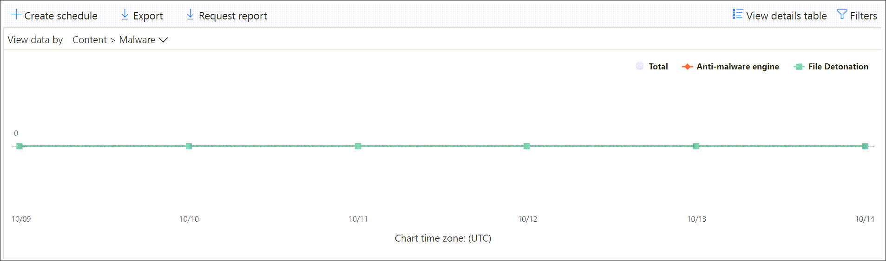

# Anzeigen von E-Mail-Sicherheitsberichten im Security & Compliance CenterView email security reports in the Security & Compliance Center

[!INCLUDE [Microsoft 365 Defender rebranding](../includes/microsoft-defender-for-office.md)]

**Gilt für****Applies to**
- [Exchange Online ProtectionExchange Online Protection](exchange-online-protection-overview.md)
- [Microsoft Defender für Office 365 Plan 1 und Plan 2Microsoft Defender for Office 365 plan 1 and plan 2](office-365-atp.md)
- [Microsoft 365 DefenderMicrosoft 365 Defender](../mtp/microsoft-threat-protection.md)

Im Security & Compliance [Center](https://protection.office.com) stehen verschiedene Berichte zur Verfügung, mit deren Hilfe Sie sehen können, wie E-Mail-Sicherheitsfeatures wie Antispam-, Ansoftware- und Verschlüsselungsfeatures in Microsoft 365 Ihre Organisation schützen.A variety of reports are available in the [Security & Compliance Center](https://protection.office.com) to help you see how email security features, such as anti-spam, anti-malware, and encryption features in Microsoft 365 are protecting your organization. Wenn Sie über die erforderlichen [Berechtigungen verfügen,](#what-permissions-are-needed-to-view-these-reports)können Sie diese Berichte im Security & Compliance Center anzeigen, indem Sie zum Dashboard **"Berichte"** \> **gehen.**If you have the [necessary permissions](#what-permissions-are-needed-to-view-these-reports), you can view these reports in the Security & Compliance Center by going to **Reports** \> **Dashboard**. Um direkt zum Dashboard "Berichte" zu wechseln, öffnen Sie <https://protection.office.com/insightdashboard> .To go directly to the Reports dashboard, open <https://protection.office.com/insightdashboard>.

## Bericht "Gefährdete Benutzer"Compromised users report

> [!NOTE]
> Dieser Bericht ist in Microsoft 365-Organisationen mit Exchange Online-Postfächern verfügbar.This report is available in Microsoft 365 organizations with Exchange Online mailboxes. Es ist in eigenständigen Exchange Online Protection (EOP)-Organisationen nicht verfügbar.It's not available in standalone Exchange Online Protection (EOP) organizations.

Der **Bericht "Gefährdete Benutzer"** zeigt die Anzahl  der  Benutzerkonten an, die innerhalb der letzten 7 Tage als verdächtig oder eingeschränkt gekennzeichnet wurden.The **Compromised users** report shows shows the number of user accounts that were marked as **Suspicious** or **Restricted** within the last 7 days. Konten in einem dieser Zustände sind problematisch oder sogar gefährdet.Accounts in either of these states are problematic or even compromised. Bei häufiger Verwendung können Sie den Bericht verwenden, um Spitzen und sogar Trends bei verdächtigen oder eingeschränkten Konten zu erkennen.With frequent use, you can use the report to spot spikes, and even trends, in suspicious or restricted accounts. Weitere Informationen zu gefährdeten Benutzern finden Sie unter ["Reagieren auf ein gefährdetes E-Mail-Konto".](responding-to-a-compromised-email-account.md)For more information about compromised users, see [Responding to a compromised email account](responding-to-a-compromised-email-account.md).

In der Aggregatansicht werden Daten für die letzten 90 Tage angezeigt, und in der Detailansicht werden Daten für die letzten 30 Tage angezeigt.The aggregate view shows data for the last 90 days and the detail view shows data for the last 30 days.

Öffnen Sie zum Anzeigen des Berichts das [Security & Compliance Center,](https://protection.office.com)wechseln Sie zum Dashboard "Berichte", und wählen Sie  \>  **"Gefährdete Benutzer" aus.**To view the report, open the [Security & Compliance Center](https://protection.office.com), go to **Reports** \> **Dashboard** and select **Compromised users**. Um direkt zum Bericht zu wechseln, öffnen Sie <https://protection.office.com/reportv2?id=CompromisedUsers> .To go directly to the report, open <https://protection.office.com/reportv2?id=CompromisedUsers>.

Sie können sowohl das Diagramm als auch die Detailtabelle filtern, indem Sie auf **"Filter"** klicken und einen oder mehrere der folgenden Werte auswählen:You can filter both the chart and the details table by clicking **Filters** and selecting one or more of the following values:

- **Startdatum** und **Enddatum****Start date** and **End date**

- **Verdächtig:** Das Benutzerkonto hat verdächtige E-Mails gesendet und riskiert, dass das Senden von E-Mails eingeschränkt wird.**Suspicious**: The user account has sent suspicious email and is at risk of being restricted from sending email.

- **Eingeschränkt:** Das Benutzerkonto wurde aufgrund hochgradig verdächtiger Muster am Senden von E-Mails eingeschränkt.**Restricted**: The user account has been restricted from sending email due to highly suspicious patterns.

Wenn Sie auf **"Details anzeigen" klicken,** werden die folgenden Details angezeigt:If you click **View details table**, you can see the following details:

- **Erstellungszeit****Creation time**
- **Benutzer-ID****User ID**
- **Aktion****Action**

Klicken Sie auf "Bericht anzeigen", um zur **Berichtsansicht zurück zu wechseln.**To go back to the report view, click **View report**.

## VerschlüsselungsberichtEncryption report

Der **Verschlüsselungsbericht ist** in EOP verfügbar (Abonnements mit Postfächern in Exchange Online oder eigenständiges EOP ohne Exchange Online-Postfächer).The **Encryption report** is available in EOP (subscriptions with mailboxes in Exchange Online or standalone EOP without Exchange Online mailboxes). Das Sicherheitsteam Ihrer Organisation kann die Informationen in diesem Bericht verwenden, um Muster zu identifizieren und Richtlinien für vertrauliche E-Mail-Nachrichten proaktiv anzuwenden oder anzupassen.Your organization's security team can use information in this report to identify patterns and proactively apply or adjust policies for sensitive email messages. Zum Beispiel:For example:

- Wenn eine hohe Anzahl von von Benutzern verschlüsselten E-Mail-Nachrichten angezeigt wird, sollten Sie eine Verschlüsselungsrichtlinie hinzufügen, um die Verschlüsselung für bestimmte Verwendungsfälle zu automatisieren.If you see a high number of email messages encrypted by users, you might want to add an encryption policy to automate encryption for certain use cases. Weitere Informationen finden Sie unter [Definieren von Nachrichtenflussregeln zum Verschlüsseln von E-Mail-Nachrichten in Microsoft 365.](../../compliance/define-mail-flow-rules-to-encrypt-email.md)For more information, see [Define mail flow rules to encrypt email messages in Microsoft 365](../../compliance/define-mail-flow-rules-to-encrypt-email.md).

- Wenn Eine Reihe von Verschlüsselungsvorlagen verfügbar sind, aber von niemanden verwendet werden, können Sie untersuchen, ob Benutzer Featureschulungen benötigen.If you have a number of encryption templates available but no one is using them, you might explore whether users need feature training.

Die Aggregatansicht ermöglicht das Filtern für die letzten 90 Tage, während die Detailansicht das Filtern für 10 Tage zulässt.The aggregate view allows filtering for the last 90 days, while the detail view allows filtering for 10 days.

Öffnen Sie zum Anzeigen des Berichts das [Security & Compliance Center,](https://protection.office.com)wechseln Sie zum **Berichtsdashboard,** und wählen Sie \>  den **Verschlüsselungsbericht aus.**To view the report, open the [Security & Compliance Center](https://protection.office.com), go to **Reports** \> **Dashboard** and select **Encryption report**. Um direkt zum Bericht zu wechseln, öffnen Sie <https://protection.office.com/reportv2?id=EncryptionReport> .To go directly to the report, open <https://protection.office.com/reportv2?id=EncryptionReport>.

Weitere Informationen zur Verschlüsselung finden Sie unter ["E-Mail-Verschlüsselung in Microsoft 365".](../../compliance/email-encryption.md)To learn more about encryption, see [Email encryption in Microsoft 365](../../compliance/email-encryption.md).

### Berichtsansicht für den VerschlüsselungsberichtReport view for the Encryption report

Sie können die folgenden Filter für das Diagramm verwenden:You can use the following filters on the chart:

- **Daten nach: Nachrichtenverschlüsselungsbericht anzeigen** und **aufschlüsseln nach: Verschlüsselungsmethode:** Die folgenden Verschlüsselungsmethoden sind verfügbar:**View data by: Message Encryption Report** and **Break down by: Encryption method**: The following encryption methods are available:

  - **Verschlüsselung nach Benutzer****Encryption by user**
  - **Verschlüsselung nach Richtlinie****Encryption by policy**

  Wenn Sie auf **"Filter"** klicken, können Sie das Diagramm mit den folgenden Filtern ändern:If you click **Filters**, you can modify the chart with the following filters:

  - **Startdatum** und **Enddatum****Start date** and **End date**
  - Verschlüsselungsmethode.Encryption method.
  - Verschlüsselungsvorlage.Encryption template.

- **Daten nach: Nachrichtenverschlüsselungsbericht anzeigen und** **aufschlüsseln nach:** Verschlüsselungsvorlage: Die folgenden Verschlüsselungsmethoden sind verfügbar:**View data by: Message Encryption Report** and **Break down by: Encryption template**: The following encryption methods are available:

  - **Nicht weiterleiten****Do not forward**
  - **Nur verschlüsseln****Encrypt only**
  - **OME previous****OME previous**
  - **Custom****Custom**

  Wenn Sie auf **"Filter"** klicken, können Sie das Diagramm mit den folgenden Filtern ändern:If you click **Filters**, you can modify the chart with the following filters:

  - **Startdatum** und **Enddatum****Start date** and **End date**
  - VerschlüsselungsmethodeEncryption method
  - VerschlüsselungsvorlageEncryption template

- **Daten nach: Top 5 Empfängerdomänen anzeigen:** In dieser Ansicht wird ein Kreisdiagramm mit der Anzahl der gesendeten Nachrichten für die 5 am besten 5 Empfängerdomänen angezeigt.**View data by: Top 5 recipient domains**: This view shows a pie chart with sent message counts for the top 5 recipient domains.

  Wenn Sie auf **"Filter"** klicken, können Sie ein **Start- und** **ein Enddatum auswählen.**If you click **Filters**, you can select a **Start date** and **End date**.

### Detailtabelle für den VerschlüsselungsberichtDetails table view for the Encryption report

Wenn Sie auf **"Details anzeigen" klicken,** hängen die angezeigten Informationen vom Diagramm ab, das Sie betrachtet haben:If you click **View details table**, the information that's shown depends on the chart you were looking at:

- **Aufschlüsseln nach: Verschlüsselungsmethode** oder **Aufschlüsselung nach:** Verschlüsselungsvorlage: Die folgenden Informationen werden angezeigt:**Break down by: Encryption method** or **Break down by: Encryption template**: The following information is shown:

  - **Date****Date**
  - **Absenderadresse****Sender address**
  - **Verschlüsselungsvorlage****Encryption template**
  - **Verschlüsselungsmethode****Encryption method**
  - **Empfängeradresse****Recipient address**
  - **Betreff****Subject**

- **Anzeigen von Daten nach: Top 5 Empfängerdomänen:****View data by: Top 5 recipient domains**:

  - **Date****Date**
  - **Empfängerdomäne****Recipient domain**
  - **Anzahl der Nachrichten****Message count**

Wenn Sie in einer **Detailtabelle** auf "Filter" klicken, können Sie die Ergebnisse mit den folgenden Filtern ändern:If you click **Filters** in a details table view, you can modify the results with the following filters:

- **Startdatum** und **Enddatum****Start date** and **End date**
- VerschlüsselungsmethodeEncryption method
- VerschlüsselungsvorlageEncryption template

Klicken Sie auf "Bericht anzeigen", um zur **Berichtsansicht zurück zu wechseln.**To go back to the report view, click **View report**.

## Statusbericht über den NachrichtenflussMailflow status report

Der **Statusbericht "E-Mail-Nachrichtenfluss"** enthält Informationen zu Schadsoftware, Spam, Phishing und blockierten Edge-Nachrichten.The **Mailflow status report** contains information about malware, spam, phishing and edge blocked messages. Weitere Informationen finden Sie im [Statusbericht über den Nachrichtenfluss.](view-mail-flow-reports.md#mailflow-status-report)For more details, see [Mailflow status report](view-mail-flow-reports.md#mailflow-status-report).

## Schadsoftwareerkennungen im E-Mail-BerichtMalware detections in email report

Der **Bericht über Schadsoftwareerkennungen im** E-Mail-Bericht enthält Informationen zu Schadsoftwareerkennungen in eingehenden und ausgehenden E-Mail-Nachrichten (Schadsoftware, die von Exchange Online Protection oder EOP erkannt wurde).The **Malware detections in email** report shows information about malware detections in incoming and outgoing email messages (malware detected by Exchange Online Protection or EOP). Weitere Informationen zum Schutz vor Schadsoftware in EOP finden Sie unter [An malware protection in EOP](anti-malware-protection.md).For more information about malware protection in EOP, see [Anti-malware protection in EOP](anti-malware-protection.md).

 Der Aggregatansichtsfilter lässt 90 Tage zu, während der Detailtabellefilter nur 10 Tage zulässt.The aggregate view filter allows for 90 days, while the details table filter only allows for 10 days.

Öffnen Sie zum Anzeigen des Berichts das [Security & Compliance Center,](https://protection.office.com)wechseln Sie zum Berichtsdashboard, und wählen Sie  \>  **Schadsoftwareerkennungen in E-Mail aus.**To view the report, open the [Security & Compliance Center](https://protection.office.com), go to **Reports** \> **Dashboard** and select **Malware detections in email**. Um direkt zum Bericht zu wechseln, öffnen Sie <https://protection.office.com/reportv2?id=MalwareDetections> .To go directly to the report, open <https://protection.office.com/reportv2?id=MalwareDetections>.

Sie können sowohl das Diagramm als auch die Detailtabelle filtern, indem Sie auf **"Filter"** klicken und folgende Optionen auswählen:You can filter both the chart and the details table by clicking **Filters** and selecting:

- **Startdatum** und **Enddatum****Start date** and **End date**
- **Eingehende Nachrichten****Inbound**
- **Ausgehend****Outbound**

Wenn Sie auf **"Details anzeigen" klicken,** werden die folgenden Details angezeigt:If you click **View details table**, you can see the following details:

- **Date****Date**
- **Absenderadresse****Sender address**
- **Empfängeradresse****Recipient address**
- **Nachrichten-ID:** Im **Nachrichten-ID-Kopfzeilenfeld** im Nachrichtenkopf verfügbar und sollte eindeutig sein.**Message ID**: Available in the **Message-ID** header field in the message header and should be unique. Ein Beispielwert ist `<08f1e0f6806a47b4ac103961109ae6ef@server.domain>` (beachten Sie die spitzen Klammern).An example value is `<08f1e0f6806a47b4ac103961109ae6ef@server.domain>` (note the angle brackets).
- **Betreff****Subject**
- **Filename****Filename**
- **Name der Schadsoftware****Malware name**

Klicken Sie auf "Bericht anzeigen", um zur **Berichtsansicht zurück zu wechseln.**To go back to the report view, click **View report**.

## E-Mail-WartezeitberichtMail latency report

Der **Bericht über E-Mail-Latenz** enthält Informationen zur E-Mail-Zustellungs- und Detonationslatenz, die in Ihrer Organisation auftreten.The **Mail latency report** contains information on the mail delivery and detonation latency experienced within your organization. Weitere Informationen finden Sie im [Bericht über E-Mail-Latenz.](view-reports-for-atp.md#mail-latency-report)For more information, see [Mail latency report](view-reports-for-atp.md#mail-latency-report).

## Gesendeter und empfangener E-Mail-BerichtSent and received email report

Der **Bericht über gesendete** und empfangene E-Mails enthält Informationen zu Schadsoftware, Spam, Nachrichtenflussregeln (auch als Transportregeln bezeichnet) und erweiterten Schadsoftwareerkennungen, nachdem E-Mails in den Dienst eingegangen sind.The **Sent and received email** report contains information about malware, spam, mail flow rules (also known as transport rules), and advanced malware detections after email enters the service. Weitere Informationen finden Sie im Bericht [über gesendete und empfangene E-Mails.](view-mail-flow-reports.md#sent-and-received-email-report)For more information, see [Sent and received email report](view-mail-flow-reports.md#sent-and-received-email-report).

## SpamerkennungsberichtSpam detections report

Der **Bericht über Spamerkennungen** enthält Spam-E-Mail-Nachrichten, die von EOP blockiert wurden.The **Spam detections** report shows spam email messages that were blocked by EOP. Nachrichten werden einzeln gezählt, nicht pro Empfänger.Messages are counted individually, not per recipient. Wenn beispielsweise dieselbe Spamnachricht an 100 Empfänger in Ihrer Organisation gesendet wurde, zählt sie als eine Nachricht.For example, if the same spam message was sent to 100 recipients in your organization, it counts as one message.

Die Aggregatansicht ermöglicht das Filtern von 90 Tagen, während die Detailtabelle eine Filterung von 10 Tagen zulässt.The aggregate view allows for 90 days filtering, while the details table allows for 10 days filtering.

Öffnen Sie zum Anzeigen des Berichts das [Security & Compliance Center,](https://protection.office.com)wechseln Sie **zum** Berichtsdashboard, und wählen Sie \>  **Spamerkennungen aus.**To view the report, open the [Security & Compliance Center](https://protection.office.com), go to **Reports** \> **Dashboard** and select **Spam detections**. Um direkt zum Bericht zu wechseln, öffnen Sie <https://protection.office.com/reportv2?id=SpamDetections> .To go directly to the report, open <https://protection.office.com/reportv2?id=SpamDetections>.

Weitere Informationen zum Antispamschutz finden Sie unter [Antispamschutz in EOP.](anti-spam-protection.md)For more information about anti-spam protection, see [Anti-spam protection in EOP](anti-spam-protection.md).

### Berichtsansicht für den Bericht über SpamerkennungenReport view for the Spam detections report

Die folgenden Diagramme sind in der Berichtsansicht verfügbar:The following charts are available in the report view:

- **Aufbrechen nach: Aktion:** Die folgenden Ereignistypen werden angezeigt:**Break down by: Action**: The following event types are shown:

  - **Gefilterter Spaminhalt****Spam content filtered**
  - **Spam-IP-Block****Spam IP block**
  - **Spam-Umschlag-Block****Spam envelope block**
  - **Spam-DBEB-Filter:** Verzeichnisbasierte Edgeblockierung (DBEB)**Spam DBEB filter**: Directory based edge blocking (DBEB)

  Wenn Sie mit der Maus auf einen Tag (Datenpunkt) im Diagramm zeigen, können Sie sehen, wie viele Elemente an diesem Tag blockiert wurden und wie diese Elemente kategorisiert werden.When you hover over a day (data point) in the chart, you can see how many items were blocked that day, as well as how those items are categorized.

  

- **Aufbrechen nach: Richtung:** Die folgenden Wegbeschreibungen werden angezeigt:**Break down by: Direction**: The following directions are shown:

  - **Eingehende Nachrichten****Inbound**
  - **Ausgehend****Outbound**

  

Wenn Sie **in** einer Berichtsansicht auf "Filter" klicken, können Sie die Ergebnisse mit den folgenden Filtern ändern:If you click **Filters** in a report view, you can modify the results with the following filters:

- **Startdatum** und **Enddatum****Start date** and **End date**
- RichtungswerteDirection values
- EreignistypwerteEvent type values

### Detailtabelle für den Bericht "Spamerkennungen"Details table view for the Spam detections report

Wenn Sie in einer **Berichtsansicht auf "Details anzeigen"** klicken, werden die folgenden Informationen angezeigt:If you click **View details table** in any report view, the following information is shown:

- **Date****Date**
- **Absenderadresse****Sender address**
- **Empfängeradresse****Recipient address**
- **Ereignistyp****Event type**
- **Aktion****Action**
- **Betreff****Subject**

Wenn Sie in **einer Detailtabelle** auf "Filter" klicken, können Sie die Ergebnisse mit den folgenden Filtern ändern:If you click **Filters** in a details table, you can modify the results with the following filters:

- **Startdatum** und **Enddatum****Start date** and **End date**
- RichtungswerteDirection values
- EreignistypwerteEvent type values

Klicken Sie auf "Bericht anzeigen", um zur **Berichtsansicht zurück zu wechseln.**To go back to the report view, click **View report**.

## Bericht über SpooferkennungenSpoof detections report

Der **Bericht über Spoofingerkennungen** zeigt, wie viele Spoof-E-Mail-Nachrichten erkannt wurden und welche als "gut" betrachtet wurden (Spoof-E-Mails, die aus legitimen geschäftlichen Gründen durchgeführt wurden).The **Spoof detections** report shows how many spoof mail messages were detected, and of those, which ones were considered "good" (spoof mail done for legitimate business reasons). Weitere Informationen zum Spoofing finden Sie unter [Antis spoofing protection in EOP](anti-spoofing-protection.md).For more information about spoofing, see [Anti-spoofing protection in EOP](anti-spoofing-protection.md).

Die Aggregatansicht des Berichts ermöglicht eine Filterung von 90 Tagen, während die Detailansicht nur 10 Tage Filterung zulässt.The aggregate view of the report allows for 90 days of filtering, while the detail view only allows for ten days of filtering.

Öffnen Sie zum Anzeigen des Berichts das [Security & Compliance Center,](https://protection.office.com)wechseln Sie zum **Berichtsdashboard,** und wählen Sie \>  **Spooferkennungen aus.**To view the report, open the [Security & Compliance Center](https://protection.office.com), go to **Reports** \> **Dashboard** and select **Spoof detections**. Um direkt zum Bericht zu wechseln, öffnen Sie <https://protection.office.com/reportv2?id=SpoofMailReport> .To go directly to the report, open <https://protection.office.com/reportv2?id=SpoofMailReport>.

Wenn Sie mit der Maus auf einen Tag (Datenpunkt) im Diagramm zeigen, können Sie sehen, wie viele Spoof-E-Mail-Nachrichten durchgestellt wurden.When you hover over a day (data point) in the chart, you can see how many spoof mail messages came through.

Sie können sowohl das Diagramm als auch die Detailtabelle filtern, indem Sie auf **"Filter"** klicken und einen oder mehrere der folgenden Werte auswählen:You can filter both the chart and the details table by clicking **Filters** and selecting one or more of the following values:

- **Startdatum** und **Enddatum****Start date** and **End date**

- **Gute E-Mail****Good mail**

- **Als Spam erfasst****Caught as spam**

Wenn Sie auf **"Details anzeigen" klicken,** werden die folgenden Details angezeigt:If you click **View details table**, you can see the following details:

- **Date****Date**
- **Gefälschter Absender****Spoofed sender**
- **Wahrer Absender****True sender**
- **Sender-IP****Sender IP**
- **Aktion****Action**
- **Anzahl der Nachrichten****Message count**

Klicken Sie auf "Bericht anzeigen", um zur **Berichtsansicht zurück zu wechseln.**To go back to the report view, click **View report**.

## Threat Protection-StatusberichtThreat protection status report

Der **Statusbericht zum Bedrohungsschutz** ist sowohl in EOP als auch in Microsoft Defender für Office 365 verfügbar. Die Berichte enthalten jedoch unterschiedliche Daten.The **Threat protection status** report is available in both EOP and Microsoft Defender for Office 365; however, the reports contain different data. Beispielsweise können #A0 Informationen zu Schadsoftware anzeigen, die in E-Mails erkannt wurde, jedoch keine Informationen zu schädlichen Dateien, die von sicheren Anlagen für [SharePoint, OneDrive](atp-for-spo-odb-and-teams.md)und Microsoft Teams erkannt wurden.For example, EOP customers can view information about malware detected in email, but not information about malicious files detected by [Safe Attachments for SharePoint, OneDrive, and Microsoft Teams](atp-for-spo-odb-and-teams.md).

Der Bericht enthält die Anzahl von E-Mail-Nachrichten mit schädlichem Inhalt, z. B. Dateien oder Websiteadressen (URLs), die vom Ansoftwaremodul, zap  [(Zero-Hour Auto Purge)](zero-hour-auto-purge.md)und Defender für Office 365-Features wie sichere [Links,](atp-safe-links.md)sichere Anlagen und [Antiphishing](set-up-anti-phishing-policies.md)blockiert wurden.The report provides the count of email messages with malicious content, such as files or website addresses (URLs) that were blocked by the anti-malware engine, [zero-hour auto purge (ZAP)](zero-hour-auto-purge.md), and Defender for Office 365 features like [Safe Links](atp-safe-links.md), [Safe Attachments](atp-safe-attachments.md), and [Anti-phishing](set-up-anti-phishing-policies.md). Sie können diese Informationen verwenden, um Trends zu identifizieren oder festzustellen, ob die Organisationsrichtlinien anpassungen erforderlich sind.You can use this information to identify trends or determine whether organization policies need adjustment.

**Hinweis:** Es ist wichtig zu wissen, dass eine Nachricht, wenn sie an fünf Empfänger gesendet wird, als fünf verschiedene Nachrichten und nicht als eine Nachricht gezählt wird.**Note**: It's important to understand that if a message is sent to five recipients we count it as five different messages and not one message.

Öffnen Sie zum Anzeigen des Berichts das [Security & Compliance Center,](https://protection.office.com)wechseln Sie zum Berichtsdashboard, und wählen Sie den  \>  **Bedrohungsschutzstatus aus.**To view the report, open the [Security & Compliance Center](https://protection.office.com), go to **Reports** \> **Dashboard** and select **Threat protection status**. Öffnen Sie eine der folgenden URLs, um direkt zum Bericht zu wechseln:To go directly to the report, open one of the following URLs:

- Microsoft Defender für Office 365: <https://protection.office.com/reportv2?id=TPSAggregateReportATP>Microsoft Defender for Office 365: <https://protection.office.com/reportv2?id=TPSAggregateReportATP>
- EOP: <https://protection.office.com/reportv2?id=TPSAggregateReport>EOP: <https://protection.office.com/reportv2?id=TPSAggregateReport>

Standardmäßig werden im Diagramm Daten für die letzten 7 Tage angezeigt.By default, the chart shows data for the past 7 days. Wenn Sie auf **"Filter"** klicken, können Sie einen Datumsbereich von 90 Tagen auswählen (Testabonnements sind möglicherweise auf 30 Tage beschränkt).If you click **Filters**, you can select a 90 day date range (trial subscriptions might be limited to 30 days). Die Detailtabelle ermöglicht das Filtern für 30 Tage.The details table view allows filtering for 30 days.

### Berichtsansicht für den Statusbericht zum BedrohungsschutzReport view for the Threat protection status report

Die folgenden Ansichten sind verfügbar:The following views are available:

- **Anzeigen von Daten nach: Übersicht**: Die folgenden Erkennungsinformationen werden angezeigt:**View data by: Overview**: The following detection information is shown:

  - **E-Mail-Schadsoftware****Email malware**
  - **E-Mail-Phishing****Email phish**
  - **Schadsoftware für Inhalte****Content malware**

  

- **Anzeigen von Daten nach: Inhalt \> Schadsoftware**1:Die folgenden Informationen werden für Microsoft Defender für Office 365-Organisationen angezeigt:**View data by: Content \> Malware**1: The following information is shown for Microsoft Defender for Office 365 organizations:

  - **An malware engine:** Malicious files detected in Sharepoint, OneDrive, and Microsoft Teams by the [built-in virus detection in Microsoft 365](virus-detection-in-spo.md).**Anti-malware engine**: Malicious files detected in Sharepoint, OneDrive, and Microsoft Teams by the [built-in virus detection in Microsoft 365](virus-detection-in-spo.md).
  - **Dateidetonation:** Bösartige Dateien, die von sicheren Anlagen für [SharePoint, OneDrive und Microsoft Teams erkannt wurden.](atp-for-spo-odb-and-teams.md)**File detonation**: Malicious files detected by [Safe Attachments for SharePoint, OneDrive, and Microsoft Teams](atp-for-spo-odb-and-teams.md).

  

- **Daten anzeigen nach: Nachrichtenüberschreibung:** Die folgenden Informationen zum Grund für die Außerkraftsetzung werden angezeigt:**View data by: Message Override**: The following override reason information is shown:

  - **Lokales Überspringen****On-premises skip**
  - **IP Allow****IP Allow**
  - **Nachrichtenflussregel****Mail flow rule**
  - **Absender zulassen****Sender allow**
  - **Domänen zulassen****Domain allow**
  - **ZAP nicht aktiviert****ZAP not enabled**
  - **Junk-E-Mail-Ordner nicht aktiviert****Junk Mail folder not enabled**
  - **Sicherer Absender des Benutzers****User Safe Sender**
  - **Benutzersichere Domäne****User Safe Domain**

  

- **Aufbrechen nach: Erkennungstechnologie** und **Anzeigen von Daten nach: E-Mail-Phishing: \>** Die folgenden Informationen werden angezeigt:**Break down by: Detection technology** and **View data by: Email \> Phish**: The following information is shown:

  - **ATP-generierte URL-Reputation**1:Schädliche URL-Reputation, die von Defender für Office 365-Detonationen in anderen Microsoft 365-Kunden generiert wurde.**ATP-generated URL reputation**1: Malicious URL reputation generated from Defender for Office 365 detonations in other Microsoft 365 customers.
  - **Erweiterter Phishingfilter:** Phishingsignale, die auf maschinellem Lernen basieren.**Advanced phish filter**: Phishing signals based on machine learning.
  - **Antis spoofing - DMARC failure**: DMARC authentication failure on messages.**Anti-spoof - DMARC failure**: DMARC authentication failure on messages.
  - **Antis spoofing - intra-org:** Sender is trying to spoof the recipient domain.**Anti-spoof - intra-org**: Sender is trying to spoof the recipient domain.
  - **Antis spoofing - externe Domäne:** Der Absender versucht, eine andere Domäne zu spoofen.**Anti-spoof - external domain**: Sender is trying to spoof some other domain.
  - **Markenwechsel: Identitätswechsel** bekannter Marken basierend auf Absendern.**Brand impersonation**: Impersonation of well-known brands based on senders.
  - **Domänenwechsel**1:Identitätswechsel von Domänen, die der Kunde besitzt oder definiert.**Domain impersonation**1: Impersonation of domains that the customer owns or defines.
  - **EOP-URL-Reputation:** Schädliche URL-Reputation.**EOP URL reputation**: Malicious URL reputation.
  - **Allgemeiner Phishingfilter:** Phishingsignale, die auf Analystenregeln basieren.**General phish filter**: Phishing signals based on analyst rules.
  - **Sonstige****Others**
  - **Phish ZAP**2:Automatisches Löschen von Phishingnachrichten zur Nullstunde.**Phish ZAP**2: Zero hour auto purge of phishing messages.
  - **URL-Detonation**1**URL detonation**1
  - **Benutzerwechsel**1:Identitätswechsel von Benutzern, die vom Administrator definiert oder über Die Postfachintelligenz gelernt wurden.**User impersonation**1: Impersonation of users defined by admin or learned through mailbox intelligence.

  

- **Unterlegen nach: Erkennungstechnologie und** **Anzeigen von Daten nach: E-Mail-Schadsoftware: \>** Die folgenden Informationen werden angezeigt:**Break down by: Detection technology** and **View data by: Email \> Malware**: The following information is shown:

  - **ATP-generierte Dateire**reputation 1:Alle von Defender für Office 365-Detonationen generierte Reputation bösartiger Dateien.**ATP-generated file reputation**1: All malicious file reputation generated by Defender for Office 365 detonations.
  - **An malware engine**1:Detection from anti-malware engines.**Anti-malware engine**1: Detection from anti-malware engines.
  - **Dateitypblock für Ansoftwarerichtlinien:** Dabei handelt es sich um E-Mail-Nachrichten, die aufgrund des in der Nachricht identifizierten Typs der schädlichen Datei herausgefiltert wurden.**Anti-malware policy file type block**: These are email messages filtered out due to the type of malicious file identified in the message.
  - **Dateidetonation**1:Erkennung durch sichere Anlagen.**File detonation**1: Detection by Safe Attachments.
  - **Ruf von schädlichen Dateien****Malicious file reputation**
  - **Schadsoftware ZAP**2**Malware ZAP**2
  - **Sonstige****Others**

  

- **Aufbrechen nach: Richtlinientyp** und Daten anzeigen **nach: E-Mail-Phishing \>** oder Daten anzeigen nach: E-Mail-Schadsoftware: Die folgenden Informationen werden angezeigt: **\>****Break down by: Policy type** and **View data by: Email \> Phish** or **View data by: Email \> Malware**: The following information is shown:

  - **Ansoftware****Anti-malware**
  - **Sichere Anlagen**1**Safe Attachments**1
  - **Anti phish****Anti-phish**
  - **Antispam****Anti-spam**
  - **Nachrichtenflussregel** (auch als Transportregel bekannt)**Mail flow rule** (also known as a transport rule)
  - **Sonstige****Others**

  

- **Aufbrechen nach: Zustellungsstatus** und Anzeigen von Daten **nach: E-Mail-Phishing \>** oder Anzeigen von Daten nach: E-Mail-Schadsoftware: Die folgenden Informationen werden angezeigt: **\>****Break down by: Delivery status** and **View data by: Email \> Phish** or **View data by: Email \> Malware**: The following information is shown:

  - **Zustellung fehlgeschlagen****Delivery failed**
  - **Dropped****Dropped**
  - **Weitergeleitet****Forwarded**
  - **Gehostetes Postfach: Benutzerdefinierter Ordner****Hosted mailbox: Custom folder**
  - **Gehostetes Postfach: Gelöschte Elemente****Hosted mailbox: Deleted items**
  - **Gehostetes Postfach: Posteingang****Hosted mailbox: Inbox**
  - **Gehostetes Postfach: Junk****Hosted mailbox: Junk**
  - **Lokale Server: Zugestellt****On-premises server: Delivered**
  - **Quarantäne****Quarantine**

  

Nur 1 Defender für Office 3651 Defender for Office 365 only

2 Automatische Bereinigung zur Nullstunde (ZAP) ist in eigenständigem EOP nicht verfügbar (es funktioniert nur in Exchange Online-Postfächern).2 Zero-hour auto purge (ZAP) isn't available in standalone EOP (it only works in Exchange Online mailboxes).

Wenn Sie auf **"Filter"** klicken, hängen die verfügbaren Filter vom Diagramm ab, das Sie betrachtet haben:If you click **Filters**, the filters available depends on the chart you were looking at:

- For **View data by: Content \> Malware**, you can modify the report by **Start date** and End **date**, and the **Detection** value.For **View data by: Content \> Malware**, you can modify the report by **Start date** and **End date**, and the **Detection** value.

- For **View data by: Message Override**, you can modify the report with the following filters:For **View data by: Message Override**, you can modify the report with the following filters:

  - **Startdatum** und **Enddatum****Start date** and **End date**
  - **Grund für die Außerkraftsetzung****Override Reason**
  - **Tag**: Filtert die Ergebnisse nach Benutzern oder Gruppen, auf die das angegebene Benutzertag angewendet wurde (einschließlich Prioritätskonten).**Tag**: Filter the results by users or groups that have had the specified user tag applied (including priority accounts). Weitere Informationen zu Benutzertags finden Sie unter [Benutzertags.](user-tags.md)For more information about user tags, see [User tags](user-tags.md).
  - **Domäne****Domain**

- Für alle anderen Ansichten können Sie den Bericht mit den folgenden Filtern ändern:For all other views, you can modify the report with the following filters:

  - **Startdatum** und **Enddatum****Start date** and **End date**
  - **Erkennung****Detection**
  - **Geschützt durch:** **ATP** oder **EOP****Protected by**: **ATP** or **EOP**
  - **Tag**: Filtert die Ergebnisse nach Benutzern oder Gruppen, auf die das angegebene Benutzertag angewendet wurde (einschließlich Prioritätskonten).**Tag**: Filter the results by users or groups that have had the specified user tag applied (including priority accounts). Weitere Informationen zu Benutzertags finden Sie unter [Benutzertags.](user-tags.md)For more information about user tags, see [User tags](user-tags.md).
  - **Domäne****Domain**

### Detailtabelle für den Statusbericht zu BedrohungsschutzDetails table view for the Threat protection status report

Wenn Sie auf **"Details anzeigen" klicken,** hängen die angezeigten Informationen vom Diagramm ab, das Sie betrachtet haben:If you click **View details table**, the information that's shown depends on the chart you were looking at:

- **Daten anzeigen nach: Übersicht**: Es ist keine Schaltfläche **"Details anzeigen"** verfügbar.**View data by: Overview**: No **View details table** button is available.

- **Anzeigen von Daten nach: Inhalt \> Schadsoftware:****View data by: Content \> Malware**:

  - **Date****Date**
  - **Standort****Location**
  - **Geleitet von****Directed by**
  - **Name der Schadsoftware****Malware name**

  Wenn Sie **in** dieser Ansicht auf "Filter" klicken, können Sie den Bericht nach **Startdatum,** **Enddatum** und **Erkennungswert** ändern.If you click **Filters** in this view, you can modify the report by **Start date** and **End date**, and the **Detection** value.

- **Daten anzeigen nach: Nachrichtenüberschreibung**:**View data by: Message Override**:

  - **Date****Date**
  - **Betreff****Subject**
  - **Sender****Sender**
  - **Recipients****Recipients**
  - **Erkannt von****Detected by**
  - **Grund für die Außerkraftsetzung****Override Reason**
  - **Quelle der Kompromisse****Source of Compromise**
  - **Tags****Tags**

  Wenn Sie in dieser **Ansicht** auf "Filter" klicken, können Sie den Bericht mit den folgenden Filtern ändern:If you click **Filters** in this view, you can modify the report with the following filters:

  - **Startdatum** und **Enddatum****Start date** and **End date**
  - **Grund für die Außerkraftsetzung****Override Reason**
  - **Tag**: Filtert die Ergebnisse nach Benutzern oder Gruppen, auf die das angegebene Benutzertag angewendet wurde (einschließlich Prioritätskonten).**Tag**: Filter the results by users or groups that have had the specified user tag applied (including priority accounts). Weitere Informationen zu Benutzertags finden Sie unter [Benutzertags.](user-tags.md)For more information about user tags, see [User tags](user-tags.md).
  - **Domäne****Domain**
  - **Empfänger** (Beachten Sie, dass diese filterbare Eigenschaft nur in der Detailtabelle verfügbar ist)**Recipients** (Note that this filterable property is only available in the details table view)

- Alle anderen Diagramme:All other charts:

  - **Date****Date**
  - **Betreff****Subject**
  - **Sender****Sender**
  - **Recipients****Recipients**
  - **Erkannt von****Detected by**
  - **Zustellungsstatus****Delivery Status**
  - **Quelle der Kompromisse****Source of Compromise**
  - **Tags****Tags**

  Wenn Sie auf **"Filter"** klicken, können Sie den Bericht mit den folgenden Filtern ändern:If you click **Filters**, you can modify the report with the following filters:

  - **Startdatum** und **Enddatum****Start date** and **End date**
  - **Erkennung****Detection**
  - **Geschützt durch**: **Defender für Office 365** oder **EOP****Protected by**: **Defender for Office 365** or **EOP**
  - **Tag**: Filtert die Ergebnisse nach Benutzern oder Gruppen, auf die das angegebene Benutzertag angewendet wurde (einschließlich Prioritätskonten).**Tag**: Filter the results by users or groups that have had the specified user tag applied (including priority accounts). Weitere Informationen zu Benutzertags finden Sie unter [Benutzertags.](user-tags.md)For more information about user tags, see [User tags](user-tags.md).
  - **Domäne****Domain**
  - **Empfänger** (Beachten Sie, dass diese filterbare Eigenschaft nur in der Detailtabelle verfügbar ist)**Recipients** (Note that this filterable property is only available in the details table view)

## Am besten als SchadsoftwareberichtTop malware report

Der **Bericht über die am** meisten schadsoftware enthaltene Schadsoftware zeigt die verschiedenen Arten von Schadsoftware, die vom [Ansoftwareschutz in EOP erkannt wurde.](anti-malware-protection.md)The **Top malware** report shows the various kinds of malware that was detected by [anti-malware protection in EOP](anti-malware-protection.md).

Öffnen Sie zum Anzeigen des Berichts das [Security & Compliance Center,](https://protection.office.com)wechseln Sie zum **Berichtsdashboard,** und wählen Sie "Am besten \>  **schadsoftware" aus.**To view the report, open the [Security & Compliance Center](https://protection.office.com), go to **Reports** \> **Dashboard** and select **Top malware**. Um direkt zum Bericht zu wechseln, öffnen Sie <https://protection.office.com/reportv2?id=TopMalware> .To go directly to the report, open <https://protection.office.com/reportv2?id=TopMalware>.

Wenn Sie mit der Maus auf einen Kreis im Kreisdiagramm zeigen, sehen Sie den Namen einer Art von Schadsoftware und die Anzahl der Nachrichten, die als schadsoftwarebefreit erkannt wurden.When you hover over a wedge in the pie chart, you can see the name of a kind of malware and how many messages were detected as having that malware.

Wenn Sie auf **"Details anzeigen" klicken,** werden die folgenden Details angezeigt:If you click **View details table**, you can see the following details:

- **Am besten schadsoftware****Top malware**
- **Count****Count**

Wenn Sie **in** der Berichtsansicht oder detailtabelle auf Filter klicken, können Sie einen Datumsbereich mit **Startdatum** und **Enddatum angeben.**If you click **Filters** in the report view or details table view, you can specify a date range with **Start date** and **End date**.

## Bericht zum Schutz vor URL-BedrohungenURL threat protection report

Der **Bericht zum Schutz vor URL-Bedrohungen** ist in Microsoft Defender für Office 365 verfügbar.The **URL threat protection report** is available in Microsoft Defender for Office 365. Weitere Informationen finden Sie im [Bericht zum Schutz vor URL-Bedrohungen.](view-reports-for-atp.md#url-threat-protection-report)For more information, see [URL threat protection report](view-reports-for-atp.md#url-threat-protection-report).

## Bericht über von Benutzern gemeldete NachrichtenUser-reported messages report

Der Bericht über von Benutzern gemeldete Nachrichten enthält Informationen zu [E-Mail-Nachrichten,](enable-the-report-message-add-in.md) die Benutzer mithilfe des Add-Ins "Nachricht melden" oder "Phishing melden" als **Junk-E-Mail,** Phishingversuche oder gute E-Mails gemeldet [haben.](enable-the-report-phish-add-in.md)The **User-reported messages** report shows information about email messages that users have reported as junk, phishing attempts, or good mail by using the [Report Message add-in](enable-the-report-message-add-in.md) or [The Report Phishing add-in](enable-the-report-phish-add-in.md).

Details sind für jede Nachricht verfügbar, einschließlich des Zustellungsgrunds, z. B. einer Spamrichtlinienausnahme oder einer nachrichtenflussregel, die für Ihre Organisation konfiguriert ist.Details are available for each message, including the delivery reason, such a spam policy exception or mail flow rule configured for your organization. Um Details anzuzeigen, wählen Sie ein Element in der Benutzerberichtsliste aus, und zeigen Sie dann die Informationen auf den Registerkarten "Zusammenfassung" **und** **"Details"** an.To view details, select an item in the user-reports list, and then view the information on the **Summary** and **Details** tabs.

Gehen Sie zum Anzeigen dieses Berichts im [Security & Compliance Center](https://protection.office.com)wie folgt vor:To view this report, in the [Security & Compliance Center](https://protection.office.com), do one of the following:

- Wechseln  Sie zu Vom \> **Benutzer gemeldeten Nachrichten** \> **des Dashboards für die Bedrohungsverwaltung.**Go to **Threat management** \> **Dashboard** \> **User-reported messages**.

- Wechseln Sie zu **"Bedrohungsverwaltung** \> **Überprüfen** \> **von vom Benutzer gemeldeten Nachrichten".**Go to **Threat management** \> **Review** \> **User-reported messages**.

> [!IMPORTANT]
> Damit der Bericht über vom Benutzer gemeldete Nachrichten ordnungsgemäß **funktioniert,** muss die Überwachungsprotokollierung für Ihre Office 365-Umgebung aktiviert sein.In order for the User-reported messages report to work correctly, **audit logging must be turned on** for your Office 365 environment. Dies wird in der Regel von einer Person durchgeführt, der die Rolle "Überwachungsprotokolle" in Exchange Online zugewiesen ist.This is typically done by someone who has the Audit Logs role assigned in Exchange Online. Weitere Informationen finden Sie unter Aktivieren oder Deaktivieren der [Microsoft 365-Überwachungsprotokollsuche.](../../compliance/turn-audit-log-search-on-or-off.md)For more information, see [Turn Microsoft 365 audit log search on or off](../../compliance/turn-audit-log-search-on-or-off.md).

## Welche Berechtigungen sind erforderlich, um diese Berichte anzeigen zu können?What permissions are needed to view these reports?

Um die in diesem Artikel beschriebenen Berichte anzeigen und verwenden zu können, müssen Sie Mitglied einer der folgenden Rollengruppen im Security & Compliance Center sein:In order to view and use the reports described in this article, you need to be a member of one of the following role groups in the Security & Compliance Center:

- **Organisationsverwaltung****Organization Management**
- **Sicherheitsadministrator****Security Administrator**
- **Sicherheitsleseprogramm****Security Reader**
- **Globaler Leser****Global Reader**

Weitere Informationen finden Sie unter [Berechtigungen im Security & Compliance Center](permissions-in-the-security-and-compliance-center.md).For more information, see [Permissions in the Security & Compliance Center](permissions-in-the-security-and-compliance-center.md).

**Hinweis:** Durch das Hinzufügen von Benutzern zur entsprechenden Azure Active Directory-Rolle im Microsoft 365 Admin Center erhalten Benutzer die erforderlichen Berechtigungen im Security & Compliance _Center_ sowie Berechtigungen für andere Features in Microsoft 365.**Note**: Adding users to the corresponding Azure Active Directory role in the Microsoft 365 admin center gives users the required permissions in the Security & Compliance Center _and_ permissions for other features in Microsoft 365. Weitere Informationen finden Sie unter [Informationen zu Administratorrollen](../../admin/add-users/about-admin-roles.md).For more information, see [About admin roles](../../admin/add-users/about-admin-roles.md).

## Was passiert, wenn in den Berichten keine Daten angezeigt werden?What if the reports aren't showing data?

Wenn in Ihren Berichten keine Daten angezeigt werden, überprüfen Sie, ob ihre Richtlinien ordnungsgemäß eingerichtet sind.If you are not seeing data in your reports, double-check that your policies are set up correctly. Weitere Informationen finden Sie unter ["Schutz vor Bedrohungen".](protect-against-threats.md)To learn more, see [Protect against threats](protect-against-threats.md).

## Verwandte ThemenRelated topics

[Antispam- und Ansoftwareschutz in EOPAnti-spam and anti-malware protection in EOP](anti-spam-and-anti-malware-protection.md)

[Intelligente Berichte und Einblicke im Security & Compliance CenterSmart reports and insights in the Security & Compliance Center](reports-and-insights-in-security-and-compliance.md)

[Anzeigen von Nachrichtenflussberichten im Security & Compliance CenterView mail flow reports in the Security & Compliance Center](view-mail-flow-reports.md)

[Anzeigen von Berichten für Defender für Office 365View reports for Defender for Office 365](view-reports-for-atp.md)
