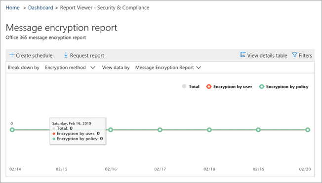
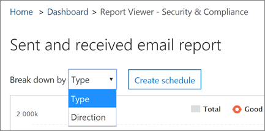

# Anzeigen von E-Mail-Sicherheitsberichten im Security & Compliance Center

Im [Security & Compliance Center](https://protection.office.com) stehen eine Vielzahl von Berichten zur Verfügung, um zu sehen, wie e-Mail-Sicherheitsfunktionen wie Antispam-, Antischadsoftware-und Verschlüsselungsfeatures in Microsoft 365 Ihre Organisation schützen. Wenn Sie über die [erforderlichen Berechtigungen](#what-permissions-are-needed-to-view-these-reports)verfügen, können Sie diese Berichte im Security & Compliance Center anzeigen, indem Sie **Reports** zum \> **Dashboard**Berichte wechseln.

Ihre e-Mail-Sicherheitsberichte umfassen Folgendes:

- [URL Threat Protection-Bericht](#url-threat-protection-report-new) (**neu!**)
- [Bericht über kompromittierte Benutzer](#compromised-users-report)
- [Verschlüsselungs Bericht](#encryption-report)
- [Threat Protection-Statusbericht](#threat-protection-status-report)
- [Bericht über Schadsoftware-Erkennungen](#malware-detections-report)
- [Höchst schädlicher Bericht](#top-malware-report)
- [Bericht über die häufigsten Absender und Empfänger](#top-senders-and-recipients-report)
- [Spoofing-Erkennungs Bericht](#spoof-detections-report)
- [Spam Erkennungs Bericht](#spam-detections-report)
- [Gesendete und empfangene e-Mail-Berichte](#sent-and-received-email-report)
- [Bericht über vom Benutzer gemeldete Nachrichten](#user-reported-messages-report)

## URL Threat Protection-Bericht (**neu!**)

Der Bericht über den URL-Bedrohungsschutz steht für alle Benutzer zur Verfügung:

- Add-on für Exchange Online Protection *und* Advanced Threat Protection (Plan 1 *oder* Plan 2)
- Ein Microsoft 365 E5-Abonnement

Hierbei handelt es sich um einen "Click-centric"-Bericht mit zwei aggregierten Ansichten.

1. Die erste Ansicht ist eine *URL-Klick Schutz Aktion*, die darauf ausgerichtet ist, die Anzahl der URL-Klicks von Benutzern innerhalb des Mandanten und das Ergebnis des Klick Vorgangs anzuzeigen. Ein Klick hier gibt an, dass der Benutzer auf die Seite blockieren zur böswilligen Website geklickt hat (Dies kann vom Administrator in einer Richtlinie für sichere Links deaktiviert werden).

2. Die zweite Ansicht ist *URL-Klick von Anwendungen*, die die Anzahl von URLs anzeigt klicken Sie in verschiedenen Anwendungen, die sichere Links heute unterstützen, beispielsweise in einem e-Mail-Client oder in Microsoft Word. Daten in beiden aggregierten Ansichten werden alle vier Stunden aktualisiert.

Die Tabelle "Details" des URL Threat Protection-Berichts bietet eine nahezu Echtzeitansicht aller Klicks, die innerhalb des Mandanten stattfinden, und enthält Ermittlungsinformationen wie *Benutzername*, *URL*, die *Netzwerknachrichten-ID* (wenn die URL aus einer e-Mail geklickt wurde) und andere wertvolle Informationen, die für Untersuchungen und Analysen nützlich sind.

Standardmäßig zeigt der Bericht nur die Daten von Klicks von URLs an, die durch sichere Links blockiert wurden, aber es ist auch möglich, Informationen für alle URL-Klicks anzuzeigen, indem Sie in den Filtern die Option *zugelassene URLs* markieren aktivieren.

Dieser Bericht enthält keine Daten von Klicks von Benutzern, bei denen die Richtlinie für sichere Links angewendet wird, wenn die Option *Benutzerklicks nicht nachverfolgen* aktiviert ist.

## Bericht über kompromittierte Benutzer

Dieser Bericht, der für alle Personen mit Exchange Online Schutz verfügbar ist, zeigt die Anzahl der Benutzerkonten, die als verdächtige oder eingeschränkte Benutzer gekennzeichnet sind, Daten, die besonders nützlich sind, wenn Konten in einen der Zustände eingeben, die darauf hindeuten, dass das Benutzerkonto problematisch sein kann oder sogar gefährdet ist. Bei häufiger Verwendung kann der kompromittierte Benutzerbericht Spitzen und sogar Trends in Konten erkennen, die in verdächtigen oder eingeschränkten Zuständen markiert sind, was Hinweise gibt, dass ein Problem mit Sicherheit und dem Wohlbefinden Ihres Mandanten auftreten kann.

## Verschlüsselungs Bericht

Im **Verschlüsselungs Bericht** werden Informationen über e-Mail-Nachrichten angezeigt, die entweder über die Richtlinien Ihrer Organisation oder durch Endbenutzer Steuerelemente verschlüsselt wurden. Das Sicherheitsteam Ihrer Organisation kann Informationen in diesem Bericht verwenden, um Muster zu identifizieren und Richtlinien für vertrauliche e-Mail-Nachrichten proaktiv anzuwenden oder anzupassen.

Um diesen Bericht anzuzeigen, wechseln Sie im Security & Compliance Center zu **Berichte** - \> **Dashboard** - \> **Verschlüsselungs Bericht**.

Wenn der Bericht zuerst geöffnet wird, werden Daten zu Verschlüsselungsmethoden angezeigt, die für e-Mail-Nachrichten in den letzten sieben (7) Tagen verwendet wurden. Sie können den Datumsbereich und die Details ändern, die im Bericht angezeigt werden, indem Sie in der oberen rechten Ecke des Bildschirms auf **Filter** klicken.

Sie können auch das Menü **aufschlüsseln** nach verwenden, um Daten nach Verschlüsselungs Vorlage (oder Methode) anzuzeigen.

Mit dem Menü **Daten anzeigen nach** können Sie die Ansicht so ändern, dass die Anzahl der verschlüsselten Nachrichten in den obersten fünf Empfängerdomänen angezeigt wird.

Durch die Flexibilität des neuen Verschlüsselungs Berichts können Sie Trends anzeigen und entsprechende Aktionen durchführen. Wenn beispielsweise eine hohe Anzahl von von Benutzern verschlüsselten e-Mail-Nachrichten angezeigt wird, möchten Sie möglicherweise eine Verschlüsselungsrichtlinie zum Automatisieren der Verschlüsselung für bestimmte Anwendungsfälle hinzufügen. (Weitere Informationen dazu finden Sie unter [Definieren von Nachrichtenfluss Regeln zum Verschlüsseln von e-Mail-Nachrichten in Microsoft 365](../../compliance/define-mail-flow-rules-to-encrypt-email.md).) Wenn Sie beispielsweise eine Reihe von Verschlüsselungs Vorlagen verfügbar haben, die von keiner verwendet werden, können Sie untersuchen, ob Benutzer eine Schulung für diese Funktion benötigen.

Mithilfe dieses Berichts kann das Sicherheits-und Compliance-Team Ihrer Organisation überwachen, wie die Nachrichtenverschlüsselung verwendet wird und ob weitere Aktionen erforderlich sind. Weitere Informationen zur Verschlüsselung finden Sie unter [e-Mail-Verschlüsselung in Microsoft 365](../../compliance/email-encryption.md).

## Threat Protection-Statusbericht

Der **Status Bericht zum Bedrohungsschutz** ist ein intelligenter Bericht, in dem böswillige e-Mails angezeigt werden, die durch Exchange Online Schutz erkannt und blockiert wurden. Dieser Bericht ist hilfreich, um e-Mails anzuzeigen, die als Schadsoftware oder als Phishing-Versuch im Laufe der Zeit identifiziert wurden (bis zu 90 Tage), und es ermöglicht Sicherheitsadministratoren, Trends zu identifizieren oder zu bestimmen, ob Richtlinien angepasst werden müssen.

> [!NOTE]
> Ein Status Bericht über den Bedrohungsschutz steht Kunden zur Verfügung, die entweder [Office 365 ATP](https://docs.microsoft.com/microsoft-365/security/office-365-security/office-365-atp) oder [Exchange Online Protection](exchange-online-protection-overview.md) (EoP) haben; die Informationen, die im Threat Protection-Status Bericht für ATP-Kunden angezeigt werden, enthalten jedoch wahrscheinlich unterschiedliche Daten, als EoP-Kunden möglicherweise sehen. EoP-Kunden können beispielsweise Informationen über in e-Mails erkannte Schadsoftware anzeigen, aber keine Informationen zu [schädlichen Dateien, die in SharePoint Online, OneDrive oder Microsoft Teams erkannt](https://docs.microsoft.com/microsoft-365/security/office-365-security/atp-for-spo-odb-and-teams)wurden, eine ATP-spezifische Funktion. ([Weitere Informationen zu ATP-Berichten](https://docs.microsoft.com/microsoft-365/security/office-365-security/view-reports-for-atp).)

Um diesen Bericht anzuzeigen, wechseln Sie im [Security & Compliance Center](https://protection.office.com)zu **Reports** \> **Dashboard** \> **Threat Protection Status**.

Wenn Sie den Threat Protection-Status Bericht zum ersten Mal öffnen, zeigt der Bericht standardmäßig Daten für die letzten sieben Tage an. Sie können jedoch auf **Filter** klicken und den Datumsbereich für bis zu 90 Tage mit Details ändern. (Wenn Sie ein Testabonnement verwenden, sind die Daten möglicherweise auf 30 Tage eingeschränkt.)

Dieser Bericht ist hilfreich, um die Effektivität und Auswirkungen der [Exchange Online Schutzfunktionen](https://docs.microsoft.com/microsoft-365/security/office-365-security/eop-features)Ihrer Organisation und die längerfristige Trendentwicklung anzuzeigen.

Sie können auch auswählen, ob Daten für als bösartig identifizierte e-Mails, als Phishing-Versuche identifizierte e-Mails oder als Schadsoftware identifizierte e-Mails angezeigt werden sollen.

## Bericht über Schadsoftware-Erkennungen

Der Bericht über **Malwareerkennungen** zeigt, wie viele eingehende und ausgehende Nachrichten als Schadsoftware für Ihre Organisation erkannt wurden.

Um diesen Bericht anzuzeigen, wechseln Sie im [Security & Compliance Center](https://protection.office.com)zu **Reports** \> **Dashboard** \> **Malware Detections**.

Ähnlich wie bei anderen Berichten, wie dem [Threat Protection-Status Bericht](#threat-protection-status-report), zeigt der Bericht standardmäßig Daten für die letzten sieben Tage an. Sie können jedoch **Filter** auswählen, um den Datumsbereich zu ändern.

## Höchst schädlicher Bericht

Der **oberste Schadsoftware** -Bericht zeigt die verschiedenen Arten von Schadsoftware, die von [Exchange Online](https://docs.microsoft.com/microsoft-365/security/office-365-security/eop-features)erkannt wurde.

Um diesen Bericht anzuzeigen, wechseln Sie im [Security & Compliance Center](https://protection.office.com)zu **Reports** \> **Dashboard** \> **Top Malware**.

Wenn Sie mit dem Mauszeiger auf einen Keil im Kreisdiagramm zeigen, sehen Sie den Namen einer Art von Schadsoftware und wie viele Nachrichten mit dieser Schadsoftware erkannt wurden.

Klicken (oder tippen) Sie auf den Bericht, um ihn in einem neuen Browserfenster zu öffnen, in dem Sie eine detailliertere Ansicht des Berichts erhalten können.

Unter dem Diagramm sehen Sie eine Liste der erkannten Schadsoftware und wie viele Nachrichten mit dieser Schadsoftware erkannt wurden.

## Bericht über die häufigsten Absender und Empfänger

Der Bericht " **Top Senders and recipients** " ist ein Kreisdiagramm mit Ihren oberen e-Mail-Absendern.

Um diesen Bericht anzuzeigen, wechseln Sie im [Security & Compliance Center](https://protection.office.com)zu **Reports** \> **Dashboard** \> **Top Senders and recipients**.

Wenn Sie mit dem Mauszeiger auf einen Keil im Kreisdiagramm zeigen, wird die Anzahl der gesendeten oder empfangenen Nachrichten angezeigt.

Klicken (oder tippen) Sie auf den Bericht, um ihn in einem neuen Browserfenster zu öffnen, in dem Sie eine detailliertere Ansicht des Berichts erhalten können.

Verwenden Sie die Liste **Daten für anzeigen** , um festzustellen, ob Daten für die wichtigsten Absender, Empfänger, Spamempfänger und Schadsoftware-Empfänger angezeigt werden sollen. Sie können auch sehen, wer die Malware empfangen hat, die von [Exchange Online Protection](exchange-online-protection-overview.md)erkannt wurde.

Unter dem Diagramm sehen Sie, wer die häufigsten e-Mail-Absender oder Empfänger waren, zusammen mit der Anzahl der Nachrichten, die für den angegebenen Zeitraum gesendet oder empfangen wurden.

## Spoofing-Erkennungs Bericht

Der Bericht **Spoof-Erkennungen** zeigt, wie viele gefälschte e-Mail-Nachrichten erkannt wurden und von denen, die als "gut" eingestuft wurden (Spoof-e-Mails wurden aus legitimen geschäftlichen Gründen ausgeführt).

Um diesen Bericht anzuzeigen, wechseln Sie im [Security & Compliance Center](https://protection.office.com)zu **Berichte** \> **Dashboard** \> **-Spoofing-e-Mail-** Benachrichtigungen.

Wenn Sie den Mauszeiger über einen Tag im Diagramm bewegen, können Sie sehen, wie viele Spoof-e-Mail-Nachrichten eingingen.

Klicken (oder tippen) Sie auf den Bericht, um ihn in einem neuen Browserfenster zu öffnen, in dem Sie eine detailliertere Ansicht des Berichts erhalten können. Weitere Informationen zum Schutz vor Spoofing finden Sie unter [Anti-Spoofing Protection in Microsoft 365](anti-spoofing-protection.md).

## Spam Erkennungs Bericht

Der **Spam Erkennungs** Bericht zeigt alle von Exchange Online blockierten Spam Inhalte an. Nachrichten werden pro Nachricht und nicht pro Empfänger gezählt. Wenn beispielsweise eine e-Mail-Nachricht an 100-Empfänger in Ihrer Organisation gesendet wurde, wird Sie als eine Nachricht gezählt.

Um diesen Bericht anzuzeigen, wechseln Sie im [Security & Compliance Center](https://protection.office.com)zu **Reports** \> **Dashboard** - \> **Spam Erkennungen**.

Wenn Sie den Mauszeiger über einen Tag im Diagramm bewegen, können Sie sehen, wie viele Elemente an diesem Tag blockiert wurden, und wie diese Elemente kategorisiert werden. Beispielsweise können Sie sehen, wie viele Spamnachrichten gefiltert wurden und wie viele Elemente von einer blockierten Internetprotokoll (IP) Adresse stammen.

Klicken (oder tippen) Sie auf den Bericht, um ihn in einem neuen Browserfenster zu öffnen, in dem Sie eine detailliertere Ansicht des Berichts erhalten können.

Unter dem Diagramm sehen Sie eine Liste mit Spam Elementen, die erkannt wurden. Wählen Sie ein Element aus, um zusätzliche Informationen anzuzeigen, beispielsweise, ob das Spam Element eingehend oder ausgehend war, seine Nachrichten ID und seinen Empfänger. Weitere Informationen zum Antispamschutz finden Sie unter [Office 365 Email Anti-Spam Protection](https://docs.microsoft.com/microsoft-365/security/office-365-security/anti-spam-and-anti-malware-protection).

## Gesendete und empfangene e-Mail-Berichte

Der Bericht **gesendeten und empfangenen e-Mail-Nachrichten** ist ein intelligenter Bericht, in dem Informationen zu eingehenden und ausgehenden e-Mails angezeigt werden, einschließlich Spamerkennungen, Schadsoftware und als "gut" identifizierte e-Mails.

Um diesen Bericht anzuzeigen, wechseln Sie im [Security & Compliance Center](https://protection.office.com)zu **Berichte** \> **Dashboard** \> **-Dashboard gesendete und empfangene e-Mails**.

Wenn Sie den Mauszeiger über einen Tag im Diagramm bewegen, können Sie sehen, wie viele Nachrichten eingingen und wie diese Nachrichten kategorisiert werden. Beispielsweise können Sie sehen, wie viele Nachrichten erkannt wurden, die Malware enthalten und wie viele als Spam identifiziert wurden.

Klicken (oder tippen) Sie auf den Bericht, um ihn in einem neuen Browserfenster zu öffnen, in dem Sie eine detailliertere Ansicht des Berichts erhalten können.

Sie können die **aufschlüsseln** nach Liste verwenden, um Informationen nach Typ oder Richtung anzuzeigen (ein-und ausgehende).

Unter dem Diagramm sehen Sie eine Liste mit e-Mail-Kategorien wie **GoodMail**, **SpamContentFiltered**usw. Wählen Sie eine Kategorie aus, um zusätzliche Informationen anzuzeigen, wie beispielsweise Aktionen, die für Schadsoftware ergriffen wurden, und ob e-Mails eingehende oder ausgehende e-Mail waren.

Weitere Informationen zu e-Mail-Informationen finden Sie unter [Nachrichtenfluss-Intelligence in Microsoft 365](https://docs.microsoft.com/microsoft-365/security/office-365-security/mail-flow-intelligence-in-office-365).

## Bericht über vom Benutzer gemeldete Nachrichten

Der Bericht "vom **Benutzer gemeldete Nachrichten** " zeigt Informationen über e-Mail-Nachrichten an, die von Benutzern mithilfe des [Berichtsnachrichten-Add-ins](https://docs.microsoft.com/microsoft-365/security/office-365-security/enable-the-report-message-add-in)als Junk-oder Phishing-Versuche oder als gute e-Mail gemeldet wurden.

Für jede Nachricht stehen Details zur Verfügung, einschließlich des Zustellungs Grundes, einer solchen Spam Richtlinienausnahme oder Nachrichtenfluss Regel, die für Ihre Organisation konfiguriert ist. Um Details anzuzeigen, wählen Sie ein Element in der Liste Benutzer Berichte aus, und zeigen Sie dann die Informationen auf den Registerkarten **Zusammenfassung** und **Details** an.

Führen Sie einen der folgenden Schritte aus, um diesen Bericht im [Security & Compliance Center](https://protection.office.com)anzuzeigen:

- Wechseln Sie zu **Threat Management** \> **Dashboard** von \> **Benutzern gemeldete Nachrichten**.

- Wechseln Sie zu **Threat Management** \> **überprüfen** von \> **Benutzern gemeldeten Nachrichten**.

> [!IMPORTANT]
> Damit der Bericht über vom Benutzer gemeldete Nachrichten ordnungsgemäß funktioniert, **muss die Überwachungsprotokollierung** für Ihre Office 365 Umgebung aktiviert sein. Dies erfolgt in der Regel durch eine Person, der die Rolle "Überwachungsprotokolle" in Exchange Online zugewiesen ist. Weitere Informationen finden Sie unter [Aktivieren oder Deaktivieren der Microsoft 365-Überwachungsprotokoll Suche](https://docs.microsoft.com/microsoft-365/compliance/turn-audit-log-search-on-or-off).

## Welche Berechtigungen sind zum Anzeigen dieser Berichte erforderlich?

Damit Sie die in diesem Artikel beschriebenen Berichte anzeigen und verwenden können, **muss Ihnen eine entsprechende Rolle sowohl für das Security & Compliance Center als auch für das Exchange Admin Center zugewiesen sein**.

- Für das Security & Compliance Center muss eine der folgenden Rollen zugewiesen sein:

  -Organisationsverwaltung-Sicherheits Administrator (Dies kann im Azure Active Directory Admin Center zugewiesen werden ( [https://aad.portal.azure.com](https://aad.portal.azure.com) )-Sicherheits Leser

- Für Exchange Online müssen Sie eine der folgenden Rollen entweder in der Exchange-Verwaltungskonsole ( [https://outlook.office365.com/ecp](https://outlook.office365.com/ecp) ) oder mit PowerShell-Cmdlets zugewiesen haben (siehe [Exchange Online PowerShell](https://docs.microsoft.com/powershell/exchange/exchange-online-powershell)):

  -Organisationsverwaltung-nur Ansichts Organisationsverwaltung-ansichtsbasierte Empfänger Rolle – Compliance-Management

Weitere Informationen hierzu finden Sie in den folgenden Ressourcen:

- [Berechtigungen im Security & Compliance Center](https://docs.microsoft.com/microsoft-365/security/office-365-security/permissions-in-the-security-and-compliance-center)
 
- [Featureberechtigungen in Exchange Online](https://docs.microsoft.com/exchange/permissions-exo/feature-permissions)

## Was geschieht, wenn die Berichte keine Daten anzeigen?

Wenn Sie keine Daten in ihren Berichten sehen, überprüfen Sie, ob Ihre Richtlinien ordnungsgemäß eingerichtet sind. Weitere Informationen finden Sie unter [Protect Against Threats in Microsoft 365](https://docs.microsoft.com/microsoft-365/security/office-365-security/protect-against-threats).

## Verwandte Themen

[Microsoft 365 e-Mail-Antispam-Schutz](https://docs.microsoft.com/microsoft-365/security/office-365-security/anti-spam-and-anti-malware-protection)

[Berichte und Einblicke im Security & Compliance Center](https://docs.microsoft.com/microsoft-365/security/office-365-security/reports-and-insights-in-security-and-compliance)
