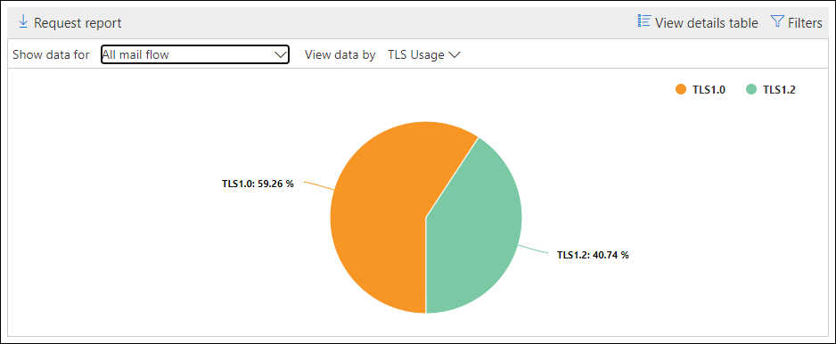
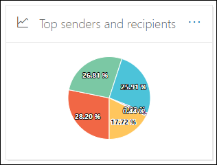

# Anzeigen von Nachrichtenflussberichten im Dashboard "Berichte" im Security & Compliance CenterView mail flow reports in the Reports dashboard in Security & Compliance Center

[!INCLUDE [Microsoft 365 Defender rebranding](../includes/microsoft-defender-for-office.md)]

**Gilt für****Applies to**
- [Exchange Online ProtectionExchange Online Protection](exchange-online-protection-overview.md)
- [Microsoft Defender für Office 365 Plan 1 und Plan 2Microsoft Defender for Office 365 plan 1 and plan 2](defender-for-office-365.md)
- [Microsoft 365 DefenderMicrosoft 365 Defender](../defender/microsoft-365-defender.md)

Zusätzlich zu den Nachrichtenflussberichten, die im [Nachrichtenflussdashboard](mail-flow-insights-v2.md) im Security & Compliance Center verfügbar sind, stehen im Berichtsdashboard eine Vielzahl zusätzlicher Nachrichtenflussberichte zur Verfügung, die Ihnen bei der Überwachung Ihrer Microsoft 365-Organisation helfen.In addition to the mail flow reports that are available in the [Mail flow dashboard](mail-flow-insights-v2.md) in the Security & Compliance Center, a variety of additional mail flow reports are available in the Reports dashboard to help you monitor your Microsoft 365 organization.

Wenn Sie über die [erforderlichen Berechtigungen](#what-permissions-are-needed-to-view-these-reports)verfügen, können Sie diese Berichte im Security & [Compliance Center](https://protection.office.com) anzeigen, indem Sie zum **Berichtsdashboard** \> wechseln.If you have the [necessary permissions](#what-permissions-are-needed-to-view-these-reports), you can view these reports in the [Security & Compliance Center](https://protection.office.com) by going to **Reports** \> **Dashboard**. Um direkt zum Berichtsdashboard zu wechseln, öffnen Sie <https://protection.office.com/insightdashboard> .To go directly to the Reports dashboard, open <https://protection.office.com/insightdashboard>.

## ConnectorberichtConnector report

Der **Connectorbericht** zeigt Nachrichtenflussaktivitäten auf den [eingehenden und ausgehenden Connectors](/Exchange/mail-flow-best-practices/use-connectors-to-configure-mail-flow/use-connectors-to-configure-mail-flow) an, die für Ihre Organisation konfiguriert sind.The **Connector report** shows mail flow activity on the [inbound and outbound connectors](/Exchange/mail-flow-best-practices/use-connectors-to-configure-mail-flow/use-connectors-to-configure-mail-flow) that are configured for your organization.

Öffnen Sie zum Anzeigen des Berichts das [Security & Compliance Center,](https://protection.office.com)wechseln Sie zum **Berichtsdashboard,** \>  und wählen Sie **"Connectorbericht"** aus.To view the report, open the [Security & Compliance Center](https://protection.office.com), go to **Reports** \> **Dashboard** and select **Connector report**. Um direkt zum Bericht zu wechseln, öffnen Sie <https://protection.office.com/reportv2?id=ConnectorReport> .To go directly to the report, open <https://protection.office.com/reportv2?id=ConnectorReport>.

### Berichtsansicht für den ConnectorberichtReport view for the Connector report

Die folgenden Diagramme sind in der Berichtsansicht verfügbar:The following charts are available in report view:

- **Anzeigen von Daten nach: Nachrichtenfluss:** Dieses Diagramm zeigt die Anzahl der eingehenden und ausgehenden Nachrichten an, nach:**View data by: Mail flow**: This chart shows the number of inbound and outbound messages organized by:

  - **Total****Total**
  - **Aus dem Internet ohne Connector****From the internet without a connector**
  - **Ins Internet ohne Connector****To the internet without a connector**
  - Ein bestimmter Connector, den Sie konfiguriert haben.A specific connector that you've configured.

  Um die Daten im Diagramm zu isolieren, verwenden Sie die **Show-Daten für** das Steuerelement, um eine dieser Optionen oder **den gesamten Nachrichtenfluss** auszuwählen.To isolate the data in the chart, use the **Show data for** control to select one of these options or **All mail flow**.

  

- **Anzeigen von Daten nach: TLS-Verwendung:** Dieses Diagramm zeigt den Prozentsatz der TLS-Versionsnutzung (Transport Layer Security) für den Nachrichtenfluss.**View data by: TLS usage**: This chart shows the percentage of Transport Layer Security (TLS) version usage for mail flow.

  Um die Daten im Diagramm zu isolieren, verwenden Sie die **Show-Daten für** das Steuerelement, um eine der folgenden Optionen auszuwählen:To isolate the data in the chart, use the **Show data for** control to select one of the following options:

  - **Alle Nachrichtenübermittlungen****All mail flow**
  - **Aus dem Internet ohne Connector****From the internet without a connector**
  - **Ins Internet ohne Connector****To the internet without a connector**
  - Ein bestimmter Connector, den Sie konfiguriert haben.A specific connector that you've configured.

  

Wenn Sie in einer Berichtsansicht auf **Filter** klicken, können Sie einen Datumsbereich mit **Startdatum** und **Enddatum** angeben.If you click **Filters** in a report view, you can specify a date range with **Start date** and **End date**.

### Detailtabellenansicht für den ConnectorberichtDetails table view for the Connector report

Wenn Sie in einer Berichtsansicht auf **"Detailtabelle anzeigen"** klicken, werden die folgenden Informationen angezeigt:If you click **View details table** in a report view, the following information is shown:

- **Date****Date**
- **Verbindungsrichtung und -name****Connector direction and name**
- **Connectortyp****Connector type**
- **Tls erzwungen?**: Der Wert **True** oder **False**.**Forced TLS?**: The value **True** or **False**.
- **Kein TLS** (Prozentsatz)**No TLS** (percentage)
- **TLS 1.0** (Prozentsatz)**TLS 1.0** (percentage)
- **TLS 1.1** (Prozentsatz)**TLS 1.1** (percentage)
- **TLS 1.2** (Prozentsatz)**TLS 1.2** (percentage)
- **Volume:** Die Anzahl der Nachrichten.**Volume**: The number of messages.

Wenn Sie in einer **Detailtabellenansicht** auf Filter klicken, können Sie einen Datumsbereich mit **Startdatum** und **Enddatum** angeben.If you click **Filters** in a details table view, you can specify a date range with **Start date** and **End date**.

Klicken Sie auf Bericht **anzeigen,** um zur Berichtsansicht zurückzukehren.To go back to the report view, click **View report**.

## Exchange-TransportregelberichtExchange transport rule report

Der **Exchange-Transportregelbericht** zeigt die Auswirkungen von Nachrichtenflussregeln (auch als Transportregeln bezeichnet) auf ein- und ausgehende Nachrichten in Ihrer Organisation.The **Exchange transport rule report** shows the effect of mail flow rules (also known as transport rules) on incoming and outgoing messages in your organization.

Öffnen Sie zum Anzeigen des Berichts das [Security & Compliance Center,](https://protection.office.com)wechseln Sie zum **Berichtsdashboard,** \>  und wählen Sie **Exchange-Transportregel** aus.To view the report, open the [Security & Compliance Center](https://protection.office.com), go to **Reports** \> **Dashboard** and select **Exchange Transport rule**. Um direkt zum Bericht zu wechseln, öffnen Sie <https://protection.office.com/reportv2?id=ETRRuleReport> .To go directly to the report, open <https://protection.office.com/reportv2?id=ETRRuleReport>.

### Berichtsansicht für den Exchange-TransportregelberichtReport view for the Exchange transport rule report

Die folgenden Diagramme sind in der Berichtsansicht verfügbar:The following charts are available in report view:

- **Anzeigen von Daten nach: Exchange-Transportregeln** \> **Unterschlüsselung nach: Richtung:** Dieses Diagramm zeigt die Anzahl der **eingehenden** und **ausgehenden** Nachrichten, die von Transportregeln betroffen waren.**View data by: Exchange transport rules** \> **Break down by: Direction**: This chart shows the number of **Inbound** and **Outbound** messages that were affected by transport rules.

- **Anzeigen von Daten nach: Exchange-Transportregeln** \> **Unterschlüsselung nach: Schweregrad:** Dieses Diagramm zeigt die Anzahl der Meldungen mit **hohem und** **mittlerem Schweregrad** sowie Meldungen mit **dem niedrigen Schweregrad.****View data by: Exchange transport rules** \> **Break down by: Severity**: This chart shows the number of **High severity** and **Medium severity**, and **Low severity** messages. Sie legen den Schweregrad als Aktion in der Regel fest (**Überwachen Sie diese Regel mit Schweregrad** oder _SetAuditSeverity_).You set the severity level as an action in the rule (**Audit this rule with severity level** or _SetAuditSeverity_). Weitere Informationen finden Sie unter [Nachrichtenflussregelaktionen in Exchange Online.](//Exchange/security-and-compliance/mail-flow-rules/mail-flow-rule-actions)For more information, see [Mail flow rule actions in Exchange Online](//Exchange/security-and-compliance/mail-flow-rules/mail-flow-rule-actions).

- **Anzeigen von Daten nach: DLP-Exchange-Transportregeln** \> **Unterschlüsselung nach: Richtung:** Dieses Diagramm zeigt die Anzahl der **eingehenden** und **ausgehenden** Nachrichten, die von DLP-Transportregeln (Data Loss Prevention, Verhinderung von Datenverlust) betroffen waren.**View data by: DLP Exchange transport rules** \> **Break down by: Direction**: This chart shows the number of **Inbound** and **Outbound** messages that were affected by data loss prevention (DLP) transport rules. Sie können das Diagramm weiter verfeinern, indem Sie die folgenden Optionen auswählen:You can further refine the chart by selecting on of the following options:

  - **Anzeigen von Daten für: Alle DLP-Transportregeln****Show data for: All DLP transport rules**
  - **Anzeigen von Daten für: Kompromittierte Benutzer****Show data for: Compromised users**
  - **Show data for: Low volume of content detected U.S. Mof Act****Show data for: Low volume of content detected U.S. Patriot Act**

- **Anzeigen von Daten nach: DLP-Exchange-Transportregeln** \> **Unterschlüsselung nach: Richtung:** Diese Ansicht zeigt die Anzahl der Nachrichten mit **hohem und** **mittlerem Schweregrad** sowie Nachrichten mit **dem niedrigen Schweregrad,** die von DLP-Transportregeln betroffen waren.**View data by: DLP Exchange transport rules** \> **Break down by: Direction**: This view shows the number of **High severity** and **Medium severity**, and **Low severity** messages that were affected by DLP transport rules. Sie können das Diagramm weiter verfeinern, indem Sie die folgenden Optionen auswählen:You can further refine the chart by selecting on of the following options:

  - **Anzeigen von Daten für: Alle DLP-Transportregeln****Show data for: All DLP transport rules**
  - **Anzeigen von Daten für: Kompromittierte Benutzer****Show data for: Compromised users**
  - **Show data for: Low volume of content detected U.S. Mof Act****Show data for: Low volume of content detected U.S. Patriot Act**

Wenn Sie in einer Berichtsansicht auf **Filter** klicken, können Sie die Ergebnisse mit den folgenden Filtern ändern:If you click **Filters** in a report view, you can modify the results with the following filters::

- **Startdatum** und **Enddatum****Start date** and **End date**
- RichtungswerteDirection values
- SchweregradwerteSeverity values

### Detailtabellenansicht für den Exchange-TransportregelberichtDetails table view for the Exchange transport rule report

Wenn Sie auf **"Detailtabelle anzeigen"** klicken, hängen die angezeigten Informationen von dem Diagramm ab, das Sie sich ansehen:If you click **View details table**, the information that's shown depends on the chart you were looking at:

- **Anzeigen von Daten nach: Exchange-Transportregeln:****View data by: Exchange Transport rules**:

  - **Date****Date**
  - **Transportregel****Transport rule**
  - **Betreff****Subject**
  - **Absenderadresse****Sender address**
  - **Empfängeradresse****Recipient address**
  - **Schweregrad****Severity**
  - **Richtung****Direction**

- **Anzeigen von Daten nach: DLP Exchange-Transportregeln:****View data by: DLP Exchange transport rules**:

  - **Date****Date**
  - **DLP-Richtlinie****DLP policy**
  - **Transportregel****Transport rule**
  - **Betreff****Subject**
  - **Absenderadresse****Sender address**
  - **Empfängeradresse****Recipient address**
  - **Schweregrad****Severity**
  - **Richtung****Direction**

Wenn Sie in einer Detailtabellenansicht auf **Filter** klicken, können Sie die Ergebnisse mit den folgenden Filtern ändern:If you click **Filters** in a details table view, you can modify the results with the following filters:

- **Startdatum** und **Enddatum****Start date** and **End date**
- RichtungswerteDirection values
- SchweregradwerteSeverity values

Klicken Sie auf Bericht **anzeigen,** um zur Berichtsansicht zurückzukehren.To go back to the report view, click **View report**.

## WeiterleitungsberichtForwarding report

Der **Weiterleitungsbericht** zeigt die automatisch weitergeleiteten Nachrichten Ihrer Organisation aus Exchange Online-Postfächern an externe Domänen an.The **Forwarding report** shows your organization's automatically forwarded messages to external domains from Exchange Online mailboxes. Weitergeleitete Nachrichten können ein Sicherheits- oder Compliancerisiko darstellen und auf ein kompromittiertes Konto hinweisen.Forwarded messages can pose a security or compliance risk, and might indicate a compromised account.

Öffnen Sie zum Anzeigen des Berichts das [Security & Compliance Center,](https://protection.office.com)wechseln Sie zum **Berichtsdashboard,** \>  und wählen Sie **"Weiterleitungsbericht"** aus.To view the report, open the [Security & Compliance Center](https://protection.office.com), go to **Reports** \> **Dashboard** and select **Forwarding report**. Um direkt zum Bericht zu wechseln, öffnen Sie <https://protection.office.com/reportv2?id=MailFlowForwarding> .To go directly to the report, open <https://protection.office.com/reportv2?id=MailFlowForwarding>.

### Berichtsansicht für den WeiterleitungsberichtReport view for the Forwarding report

Die folgenden Diagramme sind in der Berichtsansicht verfügbar:The following charts are available in the report view:

- **Anzeigen von Daten für: Weiterleitungsmethoden:** Die folgenden Methoden werden angezeigt:**Show data for: Forwarding methods**: The following methods are shown:

  - **Transportregel**: Wird auch als [Nachrichtenflussregeln bezeichnet.](/Exchange/security-and-compliance/mail-flow-rules/mail-flow-rules)**Transport rule**: Also known as [mail flow rules](/Exchange/security-and-compliance/mail-flow-rules/mail-flow-rules).
  - **Postfachregel**: Wird auch als [Posteingangsregeln bezeichnet.](https://support.microsoft.com/office/c24f5dea-9465-4df4-ad17-a50704d66c59)**Mailbox rule**: Also known as [Inbox rules](https://support.microsoft.com/office/c24f5dea-9465-4df4-ad17-a50704d66c59).

  

- **Anzeigen von Daten für: Weiterleitungsdomänen:** In dieser Ansicht werden die Empfängerdomänen angezeigt, die die Ziele für die Weiterleitung sind.**Show data for: Forwarding domains**: This view shows the recipient domains that are the destinations for forwarding.

  

- **Show data for: forwarders**: The following forwarders are shown:**Show data for: Forwarders**: The following forwarders are shown:

  - **Transportregel****Transport rule**
  - Das Postfach, das die Posteingangsregel für die Weiterleitung enthält.The mailbox that contains the forwarding Inbox rule.

  

Wenn Sie in einer Berichtsansicht auf **Filter** klicken, können Sie einen Datumsbereich mit **Startdatum** und **Enddatum** angeben.If you click **Filters** in a report view, you can specify a date range with **Start date** and **End date**.

### Detailtabellenansicht für den WeiterleitungsberichtDetails table view for the Forwarding report

Wenn Sie in einer Berichtsansicht auf **"Detailtabelle anzeigen"** klicken, werden die folgenden Informationen angezeigt:If you click **View details table** in a report view, the following information is shown:

- **Weiterleitungen:** Der Wert **"Transportregel"** oder das Postfach, das die Posteingangsregel für die Weiterleitung enthält.**Forwarders**: The value **Transport rule** or the mailbox that contains the forwarding Inbox rule.
- **Weiterleitungstyp:** Der Wert **Postfachregel** oder **Transportregel**.**Forwarding type**: The value **Mailbox rule** or **Transport rule**.
- **Empfängername****Recipient name**
- **Empfängerdomäne****Recipient domain**
- **Details:** Dies ist der GUID-Wert der Nachrichtenflussregel oder der RuleIdentity-Wert der Posteingangsregel.**Details**: This is the GUID value of the mail flow rule, or the RuleIdentity value of the Inbox rule.
- **Count****Count**
- **Erstes Weiterleitungsdatum****First forward date**

Wenn Sie in einer **Detailtabellenansicht** auf Filter klicken, können Sie einen Datumsbereich mit **Startdatum** und **Enddatum** angeben.If you click **Filters** in a details table view, you can specify a date range with **Start date** and **End date**.

Klicken Sie auf Bericht **anzeigen,** um zur Berichtsansicht zurückzukehren.To go back to the reports view, click **View report**.

## E-Mailflow-StatusberichtMailflow status report

Der **E-Mailflow-Statusbericht** ähnelt dem [Bericht "Gesendete und empfangene E-Mails"](#sent-and-received-email-report)mit zusätzlichen Informationen zu E-Mails, die am Edge zugelassen oder blockiert werden.The **Mailflow status report** is similar to the [Sent and received email report](#sent-and-received-email-report), with additional information about email allowed or blocked on the edge. Dies ist der einzige Bericht, der Edgeschutzinformationen enthält, und zeigt an, wie viele E-Mails blockiert werden, bevor sie zur Auswertung durch Exchange Online Protection (EOP) in den Dienst zugelassen werden.This is the only report that contains edge protection information, and shows just how much email is blocked before being allowed into the service for evaluation by Exchange Online Protection (EOP). Es ist wichtig zu verstehen, dass eine Nachricht, die an fünf Empfänger gesendet wird, als fünf verschiedene Nachrichten und nicht als eine Nachricht gezählt wird.It's important to understand that if a message is sent to five recipients we count it as five different messages and not one message.
Öffnen Sie zum Anzeigen des Berichts das [Security & Compliance Center,](https://protection.office.com)wechseln Sie zum **Berichtsdashboard,** \>  und wählen Sie **Den E-Mail-Flussstatusbericht** aus.To view the report, open the [Security & Compliance Center](https://protection.office.com), go to **Reports** \> **Dashboard** and select **Mailflow status report**. To go directly to the **Mail flow status report**, open <https://protection.office.com/mailflowStatusReport> .To go directly to the **Mail flow status report**, open <https://protection.office.com/mailflowStatusReport>.

### Typansicht für den Mailflow-StatusberichtType view for the Mailflow status report

Wenn Sie den Bericht  öffnen, ist standardmäßig die Registerkarte Typ ausgewählt.When you open the report, the **Type** tab is selected by default. Standardmäßig enthält diese Ansicht ein Diagramm und eine Datentabelle, die mit den folgenden Filtern konfiguriert ist:By default, this view contains a chart and a data table that's configured with the following filters:

- **Datum:** Die letzten 7 Tage.**Date**: The last 7 days.
- **Richtung:****Direction**:

  - **Eingehende****Inbound**
  - **Ausgehende****Outbound**
  - **Organisationsinternes:** Diese Anzahl gilt für Nachrichten innerhalb eines Mandanten, d. h.**Intra-org**: this count is for messages within a tenant i.e absender abc@domain.com sendet an empfänger xyz@domain.com (getrennt von **ein-** und **ausgehend** gezählt)sender abc@domain.com sends to recipient xyz@domain.com  (counted separately from **Inbound** and **Outbound**)

- **Typ:****Type**:

  - **Gute E-Mails****Good mail**
  - **Schadsoftware****Malware**
  - **Spam****Spam**
  - **Edgeschutz****Edge protection**
  - **Regelnachrichten****Rule messages**
  - **Phishing-E-Mail****Phishing email**

Das Diagramm ist nach den **Type-Werten** organisiert.The chart is organized by the **Type** values.

Sie können diese Filter ändern, indem Sie auf **"Filter"** oder auf einen Wert in der Diagrammlegende klicken.You can change these filters by clicking **Filter** or by clicking a value in the chart legend.

Die Datentabelle enthält die folgenden Informationen:The data table contains the following information:

- **Richtung****Direction**
- **Typ****Type**
- **24 Stunden****24 hours**
- **3 Tage****3 days**
- **7 Tage****7 days**
- **15 Tage****15 days**
- **30 Tage****30 days**

Wenn Sie auf **"Kategorie auswählen"** klicken, um weitere Details zu erhalten, können Sie aus den folgenden Werten auswählen:If you click **Choose a category for more details**, you can select from the following values:

- **Phishing-E-Mail:** Diese Auswahl führt Sie zum Statusbericht zum [Bedrohungsschutz.](view-email-security-reports.md#threat-protection-status-report)**Phishing email**: This selection takes you to the [Threat protection status report](view-email-security-reports.md#threat-protection-status-report).
- **Schadsoftware in E-Mails:** Diese Auswahl führt Sie zum [Bedrohungsschutzstatusbericht.](view-email-security-reports.md#threat-protection-status-report)**Malware in email**: This selection takes you to the [Threat protection status report](view-email-security-reports.md#threat-protection-status-report).
- **Spamerkennungen:** Diese Auswahl führt Sie zum [Spamerkennungsbericht.](view-email-security-reports.md#spam-detections-report)**Spam detections**: This selection takes you to the [Spam Detections report](view-email-security-reports.md#spam-detections-report).
- **Edge blockierter Spam:** Diese Auswahl führt Sie zum [Spamerkennungsbericht.](view-email-security-reports.md#spam-detections-report)**Edge blocked spam**: This selection takes you to the [Spam Detections report](view-email-security-reports.md#spam-detections-report).

**Exportieren**:**Export**:

Für die Detailansicht können Sie nur Daten für einen Tag exportieren.For the detail view, you can only export data for one day. Wenn Sie Also Daten für 7 Tage exportieren möchten, müssen Sie 7 verschiedene Exportaktionen ausführen.So, if you want to export data for 7 days, you need to do 7 different export actions.

Jede exportierte .csv Datei ist auf 150.000 Zeilen beschränkt.Each exported .csv file is limited to 150,000 rows. Wenn die Daten für diesen Tag mehr als 150.000 Zeilen enthalten, werden mehrere .csv Dateien erstellt.If the data for that day contains more than 150,000 rows, then multiple .csv files will be created.

### Richtungsansicht für den Mailflow-StatusberichtDirection view for the Mailflow status report

Wenn Sie auf die Registerkarte **"Richtung"** klicken, werden die gleichen Standardfilter aus der **Typansicht** verwendet.If you click the **Direction** tab, the same default filters from the **Type** view are used.

Das Diagramm ist nach **Richtungswerten** organisiert.The chart is organized by **Direction** values.

Sie können diese Filter ändern, indem Sie auf **"Filter"** oder auf einen Wert in der Diagrammlegende klicken.You can change these filters by clicking **Filter** or by clicking a value in the chart legend. Es werden dieselben Filter aus der **Typansicht** verwendet.The same filters from the **Type** view are used.

Die Datentabelle enthält dieselben Informationen aus der **Typansicht.**The data table contains same information from the **Type** view.

The **Choose a category for more details** available selections and behavior are the same as the **Type** view.The **Choose a category for more details** available selections and behavior are the same as the **Type** view.

**Exportieren**:**Export**:

Für die Detailansicht können Sie nur Daten für einen Tag exportieren.For the detail view, you can only export data for one day. Wenn Sie Also Daten für 7 Tage exportieren möchten, müssen Sie 7 verschiedene Exportaktionen ausführen.So, if you want to export data for 7 days, you need to do 7 different export actions.

Jede exportierte .csv Datei ist auf 150.000 Zeilen beschränkt.Each exported .csv file is limited to 150,000 rows. Wenn die Daten für diesen Tag mehr als 150.000 Zeilen enthalten, werden mehrere .csv Dateien erstellt.If the data for that day contains more than 150,000 rows, then multiple .csv files will be created.

### Trichteransicht für den Mailflow-StatusberichtFunnel view for the Mailflow status report

Die **Trichteransicht** zeigt Ihnen, wie die E-Mail-Bedrohungsschutzfeatures von Microsoft eingehende und ausgehende E-Mails in Ihrer Organisation filtern.The **Funnel** view shows you how Microsoft's email threat protection features filter incoming and outgoing email in your organization. Es enthält Details zur Gesamtzahl der E-Mails und dazu, wie sich die konfigurierten Bedrohungsschutzfeatures, einschließlich Edgeschutz, Antischadsoftware, Antiphishing, Antispam und Antispoofing, auf diese Anzahl auswirken.It provides details on the total email count, and how the configured threat protection features, including edge protection, anti-malware, anti-phishing, anti-spam, and anti-spoofing affect this count.

Wenn Sie auf die Registerkarte **"Trichter"** klicken, enthält diese Ansicht standardmäßig ein Diagramm und eine Datentabelle, die mit den folgenden Filtern konfiguriert sind:If you click the **Funnel** tab, by default, this view contains a chart and a data table that's configured with the following filters:

- **Datum:** Die letzten 7 Tage.**Date**: The last 7 days.

- **Richtung:****Direction**:

  - **Eingehende****Inbound**
  - **Ausgehende****Outbound**
  - **Organisationsintern:** Diese Anzahl gilt für Nachrichten, die innerhalb eines Mandanten gesendet werden; d. h. absender abc@domain.com sendet an empfänger xyz@domain.com (getrennt von Ein- und Ausgehend gezählt).**Intra-org**: This count is for messages sent within a tenant; i.e, sender abc@domain.com sends to recipient xyz@domain.com (counted separately from Inbound and Outbound).

Die Aggregatansicht und die Datentabellenansicht ermöglichen eine Filterung von 90 Tagen.The aggregate view and data table view allow for 90 days of filtering.

Wenn Sie auf **"Filtern"** klicken, können Sie sowohl das Diagramm als auch die Datentabelle filtern.If you click **Filter**, you can filter both the chart and the data table.

Dieses Diagramm zeigt die E-Mail-Anzahl nach:This chart shows the email count organized by:

- **E-Mail-Gesamtanzahl****Total email**
- **E-Mail nach Edgeschutz****Email after edge protection**
- **E-Mail nach Antischadsoftware, Dateireputation, Dateitypblockierung****Email after anti-malware, file reputation, file type block**
- **E-Mail nach Antiphishing, URL-Reputation, Markenidentitätswechsel, Antispoofing****Email after anti-phish, URL reputation, brand impersonation, anti-spoof**
- **E-Mails nach Antispam, Massenfilterung von E-Mails****Email after anti-spam, bulk mail filtering**
- **E-Mail nach Benutzer- und Domänenidentitätswechsel**1**Email after user and domain impersonation**1
- **E-Mail nach Datei- und URL-Detonation**1**Email after file and URL detonation**1
- **E-Mails, die nach der Zustellung als gutartig erkannt wurden (URL-Click-Time-Schutz)****Email detected as benign after post-delivery protection (URL click time protection)**

1 Nur Defender für Office 3651 Defender for Office 365 only

Um die von EOP oder Defender gefilterte E-Mail für Office 365 separat anzuzeigen, klicken Sie auf den Wert in der Diagrammlegende.To view the email filtered by EOP or Defender for Office 365 separately, click on the value in the chart legend.

Die Datentabelle enthält die folgenden Informationen, die in absteigender Datumsreihenfolge angezeigt werden:The data table contains the following information, shown in descending date order:

- **Date****Date**
- **E-Mail-Gesamtanzahl****Total email**
- **Edgeschutz****Edge protection**
- **Antischadsoftware, Dateireputation, Dateitypblock:****Anti-malware, file reputation, file type block**:
  - **Dateizuruf:** Nachrichten, die aufgrund der Identifizierung einer angefügten Datei von anderen Microsoft-Kunden gefiltert wurden.**File reputation**: Messages filtered due to identification of an attached file by other Microsoft customers.
  - **Dateitypblock:** Nachrichten, die aufgrund des typs der in der Nachricht identifizierten schädlichen Datei gefiltert wurden.**File type block**: Messages filtered due to the type of malicious file identified in the message.
- **Antiphishing, URL-Zuverlässigkeit, Markenidentitätswechsel, Antispoofing:****Anti-phish, URL reputation, Brand impersonation, anti-spoof**:
  - **URL-Zuverlässigkeit:** Nachrichten, die aufgrund der Identifizierung der URL von anderen Microsoft-Kunden gefiltert wurden.**URL reputation**: Messages filtered due to the identification of the URL by other Microsoft customers.
  - **Markenidentitätswechsel:** Nachrichten, die aufgrund der Nachricht gefiltert wurden, die von bekannten Absendern als Absender imitiert wurde.**Brand impersonation**: Messages filtered due to the message coming from well-known brand impersonating senders.
  - **Antispoofing:** Nachrichten, die aufgrund der Nachricht gefiltert wurden, die versucht, eine Domäne zu spoofen, zu der der Empfänger gehört, oder einer Domäne, die der Absender der Nachricht nicht besitzt.**Anti-spoof**: Messages filtered due to the message attempting to spoof a domain that the recipient belongs to, or a domain that the message sender doesn't own.
- **Antispam, Massen-E-Mail-Filterung:****Anti-spam, bulk mail filtering**:
  - **Massen-E-Mail-Filterung:** Nachrichten, die aufgrund eines Versuchs gefiltert wurden, Massen-E-Mails an die Empfänger zu übermitteln.**Bulk mail filtering**: Messages filtered due to an attempt to deliver bulk mail to its recipients.
- **Benutzer- und Domänenidentitätswechsel (Defender für Office 365):****User and domain impersonation (Defender for Office 365)**:
  - **Benutzeridentitätswechsel:** Nachrichten, die aufgrund eines Versuchs gefiltert wurden, einen Benutzer (Nachrichtensender) zu imitieren, der in den Identitätswechselschutzeinstellungen einer Antiphishingrichtlinie definiert ist.**User impersonation**: Messages filtered due to an attempt to impersonate a user (message sender) that's defined in the impersonation protection settings of an anti-phishing policy.
  - **Domänenidentitätswechsel:** Nachrichten, die aufgrund eines Versuchs gefiltert wurden, eine Domäne zu imitieren, die in den Identitätswechselschutzeinstellungen einer Antiphishingrichtlinie definiert ist.**Domain impersonation**: Messages filtered due to an attempt to impersonate a domain that's defined in the impersonation protection settings of an anti-phishing policy.
- **Datei- und URL-Detonation (Defender für Office 365):****File and URL detonation (Defender for Office 365)**:
  - **Dateidetonation:** Nachrichten, die nach einer Safe Anlagenrichtlinie gefiltert sind.**File detonation**: Messages filtered by a Safe Attachments policy.
  - **URL-Detonation:** Nachricht, gefiltert nach einer Safe Links-Richtlinie.**URL detonation**: Message filtered by a Safe Links policy.
- **Schutz nach der Zustellung und ZAP (ATP) oder ZAP (EOP):** ZAP gibt die automatische Bereinigung zur Nullstunde an.**Post-delivery protection and ZAP (ATP), or ZAP (EOP)**: ZAP indicates zero hour auto-purge.

Wenn Sie eine Zeile in der Datentabelle auswählen, wird im Flyout eine weitere Aufschlüsselung der E-Mail-Anzahl angezeigt.If you select a row in the data table, a further breakdown of the email counts are shown in the flyout.

**Exportieren**:**Export**:

Nachdem Sie unter **"Optionen"** auf **"Exportieren"** geklickt haben, können Sie einen der folgenden Werte auswählen:After you click **Export** under **Options**, you can select one of the following values:

- **Zusammenfassung (mit Daten für die letzten 90 Tage)****Summary (with data for last 90 days at most)**
- **Details (mit Daten für die letzten 30 Tage)****Details (with data for last 30 days at most)**

Wählen Sie unter **Datum** einen Bereich aus, und klicken Sie dann auf **Übernehmen .**Under **Date**, choose a range, and then click **Apply**. Daten für die aktuellen Filter werden in eine .csv Datei exportiert.Data for the current filters will be exported to a .csv file.

Jede exportierte .csv Datei ist auf 150.000 Zeilen beschränkt.Each exported .csv file is limited to 150,000 rows. Wenn die Daten mehr als 150.000 Zeilen enthalten, werden mehrere .csv Dateien erstellt.If the data contains more than 150,000 rows, then multiple .csv files will be created.

 

### Tech-Ansicht für den Mailflow-StatusberichtTech view for the Mailflow status report

Die **Tech-Ansicht** ähnelt der **Trichteransicht** und bietet detailliertere Details für die konfigurierten Funktionen zum Schutz vor Bedrohungen.The **Tech view** is similar to the **Funnel** view, providing more granular details for the configured threat protections features. Im Diagramm können Sie sehen, wie Nachrichten in den verschiedenen Phasen des Bedrohungsschutzes kategorisiert werden.From the chart, you can see how messages are categorized at the different stages of threat protection.

Wenn Sie standardmäßig auf die Registerkarte **"Tech-Ansicht"** klicken, enthält diese Ansicht ein Diagramm und eine Datentabelle, die mit den folgenden Filtern konfiguriert sind:If you click the **Tech view** tab, by default, this view contains a chart and a data table that's configured with the following filters:

- **Datum:** Die letzten 7 Tage.**Date**: The last 7 days.

- **Richtung:****Direction**:

  - **Eingehende****Inbound**
  - **Ausgehende****Outbound**
  - **Organisationsinternes:** Diese Anzahl gilt für Nachrichten innerhalb eines Mandanten, d. h.**Intra-org**: this count is for messages within a tenant i.e absender abc@domain.com sendet an empfänger xyz@domain.com (getrennt von eingehenden und ausgehenden Zählungen)sender abc@domain.com sends to recipient xyz@domain.com (counted separately from Inbound and Outbound)

Die Aggregatansicht und die Datentabellenansicht ermöglichen eine Filterung von 90 Tagen.The aggregate view and data table view allow for 90 days of filtering.

Wenn Sie auf **"Filtern"** klicken, können Sie sowohl das Diagramm als auch die Datentabelle filtern.If you click **Filter**, you can filter both the chart and the data table.

Dieses Diagramm zeigt Nachrichten, die in die folgenden Kategorien unterteilt sind:This chart shows messages organized into the following categories:

- **E-Mail-Gesamtanzahl****Total email**
- **Edge zulassen** und **Edge gefiltert****Edge allow** and **Edge filtered**
- **Keine Schadsoftware**, **Safe Erkennung von Anlagen,** \* Erkennung von **Antischadsoftwaremodulen** und **Regelmeldungen****Not malware**, **Safe Attachments detection**\*, **Anti-malware engine detection**, and **Rule messages**
- **Keine Phishing-,** **DMARC-Fehler,** **Identitätswechselerkennung,** **Spooferkennung** und **Phishing-Erkennung****Not phish**, **DMARC failure**, **Impersonation detection**, **Spoof detection**, and **Phish detection**
- **Keine Erkennung mit URL-Detonation** und **URL-Detonationserkennung**\***No detection with URL detonation** and **URL detonation detection**\*
- **Keine Spam-** und  **Spamnachrichten****Not spam** and  **Spam**
- **Nicht böswillige E-Mails,** **Safe-Links-Erkennung** \* und **ZAP****Non-malicious email**, **Safe Links detection**\*, and **ZAP**

\*Defender für Office 365\* Defender for Office 365

Wenn Sie mit dem Mauszeiger auf eine Kategorie im Diagramm zeigen, können Sie die Anzahl der Nachrichten in dieser Kategorie anzeigen.When you hover over a category in the chart, you can see the number of messages in that category.

Die Datentabelle enthält die folgenden Informationen, die in absteigender Datumsreihenfolge angezeigt werden:The data table contains the following information, shown in descending date order:

- **Date****Date**
- **E-Mail-Gesamtanzahl****Total email**
- **Edge gefiltert****Edge filtered**
- **Antischadsoftwaremodul, Safe Anlagen, Regel gefiltert:****Anti-malware engine, Safe Attachments, rule filtered**:
  - **Regel gefiltert:** Nachrichten, die aufgrund von Nachrichtenflussregeln gefiltert werden (auch als Transportregeln bezeichnet).**Rule filtered**: Messages filtered due to  mail flow rules (also known as transport rules).
- **DMARC, Identitätswechsel, Spoofing, Phishing gefiltert:****DMARC, impersonation, spoof, phish filtered**:
  - **DMARC:** Nachrichten, die aufgrund eines Fehlers bei der DMARC-Authentifizierungsprüfung gefiltert wurden.**DMARC**: Messages filtered due to the message failing its DMARC authentication check.
- **ERKENNUNG DER URL-Detonation****URL detonation detection**
- **Antispam gefiltert****Anti-spam filtered**
- **ZAP entfernt****ZAP removed**
- **Erkennung durch Safe Links****Detection by Safe Links**

Wenn Sie eine Zeile in der Datentabelle auswählen, wird im Flyout eine weitere Aufschlüsselung der E-Mail-Anzahl angezeigt.If you select a row in the data table, a further breakdown of the email counts are shown in the flyout.

**Exportieren**:**Export**:

Wenn Sie auf **"Exportieren"** klicken, können Sie unter **"Optionen"** einen der folgenden Werte auswählen:On clicking **Export**, under **Options** you can select one of the following values:

- **Zusammenfassung (mit Daten für die letzten 90 Tage)****Summary (with data for last 90 days at most)**
- **Details (mit Daten für die letzten 30 Tage)****Details (with data for last 30 days at most)**

Wählen Sie unter **Datum** einen Bereich aus, und klicken Sie dann auf **Übernehmen .**Under **Date**, choose a range, and then click **Apply**. Daten für die aktuellen Filter werden in eine .csv Datei exportiert.Data for the current filters will be exported to a .csv file.

Jede exportierte .csv Datei ist auf 150.000 Zeilen beschränkt.Each exported .csv file is limited to 150,000 rows. Wenn die Daten mehr als 150.000 Zeilen enthalten, werden mehrere .csv Dateien erstellt.If the data contains more than 150,000 rows, then multiple .csv files will be created.

 

## Gesendeter und empfangener E-Mail-BerichtSent and received email report

Der Bericht **"Gesendete und empfangene E-Mails"** ist ein intelligenter Bericht, der Informationen zu eingehenden und ausgehenden E-Mails anzeigt, einschließlich Spamerkennungen, Schadsoftware und E-Mails, die als "gut" gekennzeichnet sind.The **Sent and received email** report is a smart report that shows information about incoming and outgoing email, including spam detections, malware, and email identified as "good." Der Unterschied zwischen diesem Bericht und dem [E-Mailflow-Statusbericht](#mailflow-status-report) besteht darin, dass dieser Bericht keine Daten zu Nachrichten enthält, die durch den Edgeschutz blockiert wurden. Es ist wichtig zu verstehen, dass eine Nachricht als eine Nachricht zählt, wenn sie an fünf Empfänger gesendet wird.The difference between this report and the [Mailflow status report](#mailflow-status-report) is: this report doesn't include data about messages blocked by edge protection.It's important to understand that if a message is sent to five recipients we count it as one message.

Die Aggregatansicht und die Detailansicht des Berichts ermöglichen eine Filterung von 90 Tagen.The aggregate view and the detail view of the report allow for 90 days of filtering.

Öffnen Sie zum Anzeigen des Berichts das [Security & Compliance Center,](https://protection.office.com)wechseln Sie zum **Berichtsdashboard,** \>  und wählen Sie **"Gesendete und empfangene E-Mails"** aus.To view the report, open the [Security & Compliance Center](https://protection.office.com), go to **Reports** \> **Dashboard** and select **Sent and received email**. Um direkt zum Bericht zu wechseln, öffnen Sie <https://protection.office.com/reportv2?id=SentAndReceivedMailATP> .To go directly to the report, open <https://protection.office.com/reportv2?id=SentAndReceivedMailATP>.

### Berichtsansicht für den Bericht "Gesendete und empfangene E-Mails"Report view for the Sent and received email report

Die folgenden Diagramme sind in der Berichtsansicht verfügbar:The following charts are available in the report view:

- **Unterteilen nach: Typ:** Das Diagramm zeigt alle verfügbaren Kategorien an:**Break down by: Type**: The chart shows all available categories:

  - **Total****Total**
  - **Gute E-Mails****Good mail**
  - **Schadsoftware (Antischadsoftware)** (EOP)**Malware (anti-malware)** (EOP)
  - **Spamerkennungen****Spam detections**
  - **Regelnachrichten****Rule messages**
  - **Erweiterte Schadsoftware** (Microsoft Defender für Office 365)**Advanced malware** (Microsoft Defender for Office 365)

  Wenn Sie den Mauszeiger über einen Tag (Datenpunkt) im Diagramm bewegen, sehen Sie Details für diesen Tag.When you hover over a day (data point) in the chart, you can see details for that day.

  

- **Aufschlüsselung nach: Richtung:** Das Diagramm zeigt Daten vom Typ **"Total",** **"Inbound"** und **"Outbound"** an.**Break down by: Direction**: The chart shows **Total**, **Inbound**, and **Outbound** data. Wenn Sie den Mauszeiger über einen Tag (Datenpunkt) im Diagramm bewegen, sehen Sie Details für diesen Tag.When you hover over a day (data point) in the chart, you can see details for that day.

  

- **Drilldown nach** \> **Schadsoftware (Antischadsoftware):** Diese Auswahl führt Sie zum Bericht über [Schadsoftwareerkennungen.](view-email-security-reports.md#malware-detections-report)**Drill down by** \> **Malware (anti-malware)**: This selection takes you to the [Malware detections report](view-email-security-reports.md#malware-detections-report).

- **Drilldown nach** \> **Spamerkennungen)**: Diese Auswahl führt Sie zum [Spamerkennungsbericht.](view-email-security-reports.md#spam-detections-report)**Drill down by** \> **Spam detections)**: This selection takes you to the [Spam Detections report](view-email-security-reports.md#spam-detections-report).

Wenn Sie in einer Berichtsansicht auf **Filter** klicken, können Sie die Ergebnisse mit den folgenden Filtern ändern:If you click **Filters** in a report view, you can modify the results with the following filters:

- **Startdatum** und **Enddatum****Start date** and **End date**
- RichtungswerteDirection values
- TypwerteType values

Klicken Sie auf Bericht **anzeigen,** um zur Berichtsansicht zurückzukehren.To go back to the report view, click **View report**.

### Detailtabellenansicht für den Bericht "Gesendete und empfangene E-Mails"Details table view for the Sent and received email report

Wenn Sie in der Ansicht **Nach-Unten:Richtung** **auf** Detailtabelle anzeigen klicken, werden die folgenden Informationen angezeigt: If you click **View details table** in the **Break down by: Direction** or **Break down by: Direction** view, the following information is shown:

- **Datum (UTC)****Date (UTC)**
- **Typ****Type**
- **Richtung****Direction**
- **Nachrichtenanzahl****Message count**

Wenn Sie in einer Detailtabellenansicht auf **Filter** klicken, können Sie die Ergebnisse mit den folgenden Filtern ändern:If you click **Filters** in a details table view, you can modify the results with the following filters:

- **Startdatum** und **Enddatum****Start date** and **End date**
- RichtungswerteDirection values
- TypwerteType values

Klicken Sie auf Bericht **anzeigen,** um zur Berichtsansicht zurückzukehren.To go back to the report view, click **View report**.

## Bericht zu den wichtigsten Absendern und EmpfängernTop senders and recipients report

Der Bericht **"Häufigste Absender und Empfänger"** ist ein Kreisdiagramm, in dem Ihre wichtigsten E-Mail-Absender und -Empfänger angezeigt werden.The **Top senders and recipients** report is a pie chart showing your top email senders and recipients.

Um den Bericht anzuzeigen, öffnen Sie das [Security & Compliance Center,](https://protection.office.com)wechseln Sie zum **Berichtsdashboard,** \>  und wählen Sie die wichtigsten Absender **und Empfänger** aus.To view the report, open the [Security & Compliance Center](https://protection.office.com), go to **Reports** \> **Dashboard** and select **Top senders and recipients**. Um direkt zum Bericht zu wechseln, öffnen Sie <https://protection.office.com/reportv2?id=TopSenderRecipientsATP> .To go directly to the report, open <https://protection.office.com/reportv2?id=TopSenderRecipientsATP>.

### Berichtsansicht für den Bericht "Häufigste Absender" und "Empfänger"Report view for the Top senders and recipient report

Die folgenden Diagramme sind in der Berichtsansicht verfügbar:The following charts are available in the report view:

- **Anzeigen von Daten für \> die wichtigsten E-Mail-Absender****Show data for \> Top mail senders**
- **Anzeigen von Daten für \> die wichtigsten E-Mail-Empfänger****Show data for \> Top mail recipients**
- **Anzeigen von Daten für \> die häufigsten Spamempfänger****Show data for \> Top spam recipients**
- **Anzeigen von Daten für \> Empfänger von Schadsoftware** (Top Malware Recipients, EOP)**Show data for \> Top malware recipients** (EOP)
- **Anzeigen von Daten für \> die häufigsten Empfänger von Schadsoftware (Defender für Office 365)****Show data for \> Top malware recipients (Defender for Office 365)**

Die Zusammensetzung des Kreisdiagramms wird basierend auf diesen Auswahlen geändert.The composition of the pie chart changes based on these selections.

Wenn Sie mit dem Mauszeiger auf einen Wedge im Kreisdiagramm zeigen, können Sie die Anzahl der gesendeten oder empfangenen Nachrichten anzeigen.When you hover over a wedge in the pie chart, you can see a count of messages sent or received.

Wenn Sie in einer Berichtsansicht auf **Filter** klicken, können Sie einen Datumsbereich mit **Startdatum** und **Enddatum** angeben.If you click **Filters** in a report view, you can specify a date range with **Start date** and **End date**.

### Detailtabellenansicht für den Bericht "Top senders" und "recipient"Details table view for the Top senders and recipient report

Wenn Sie auf **"Detailtabelle anzeigen"** klicken, hängen die angezeigten Informationen von dem Diagramm ab, das Sie sich ansehen:If you click **View details table**, the information that's shown depends on the chart you were looking at:

- **Anzeigen von Daten für \> die wichtigsten E-Mail-Absender****Show data for \> Top mail senders**

  - **Die häufigsten E-Mail-Absender****Top mail senders**
  - **Count****Count**

- **Anzeigen von Daten für \> die wichtigsten E-Mail-Empfänger****Show data for \> Top mail recipients**

  - **Top-E-Mail-Empfänger****Top mail recipients**
  - **Count****Count**

- **Anzeigen von Daten für \> die häufigsten Spamempfänger****Show data for \> Top spam recipients**

  - **Häufigste Spamempfänger****Top spam recipients**
  - **Count****Count**

- **Anzeigen von Daten für \> Empfänger von Schadsoftware** (Top Malware Recipients, EOP)**Show data for \> Top malware recipients** (EOP)

  - **Die häufigsten Empfänger von Schadsoftware****Top malware recipients**
  - **Count****Count**

- **Anzeigen von Daten für \> die häufigsten Empfänger von Schadsoftware (Defender für Office 365)****Show data for \> Top malware recipients (Defender for Office 365)**

  - **Die häufigsten Empfänger von Schadsoftware (Defender für Office 365)****Top malware recipients (Defender for Office 365)**
  - **Count****Count**

Wenn Sie in einer **Detailtabellenansicht** auf Filter klicken, können Sie einen Datumsbereich mit **Startdatum** und **Enddatum** angeben.If you click **Filters** in a details table view, you can specify a date range with **Start date** and **End date**.

Klicken Sie auf Bericht **anzeigen,** um zur Berichtsansicht zurückzukehren.To go back to the report view, click **View report**.

## Welche Berechtigungen sind zum Anzeigen dieser Berichte erforderlich?What permissions are needed to view these reports?

Um die in diesem Artikel beschriebenen Berichte anzuzeigen und zu verwenden, müssen Sie Mitglied einer der folgenden Rollengruppen im Security & Compliance Center sein:In order to view and use the reports described in this article, you need to be a member of one of the following role groups in the Security & Compliance Center:

- **Organisationsverwaltung****Organization Management**
- **Sicherheitsadministrator****Security Administrator**
- **Sicherheitsleseberechtigter****Security Reader**
- **Globaler Leser****Global Reader**

Weitere Informationen finden Sie unter [Berechtigungen im Security & Compliance Center](permissions-in-the-security-and-compliance-center.md).For more information, see [Permissions in the Security & Compliance Center](permissions-in-the-security-and-compliance-center.md).

> [!NOTE]
> Durch das Hinzufügen von Benutzern zur entsprechenden Azure Active Directory-Rolle im Microsoft 365 Admin Center erhalten Benutzer die erforderlichen Berechtigungen im Security & Compliance Center _und_ Berechtigungen für andere Features in Microsoft 365.Adding users to the corresponding Azure Active Directory role in the Microsoft 365 admin center gives users the required permissions in the Security & Compliance Center _and_ permissions for other features in Microsoft 365. Weitere Informationen finden Sie unter [Informationen zu Administratorrollen](../../admin/add-users/about-admin-roles.md).For more information, see [About admin roles](../../admin/add-users/about-admin-roles.md).

## Verwandte ThemenRelated topics

[Intelligente Berichte und Einblicke im Security & Compliance CenterSmart reports and insights in the Security & Compliance Center](reports-and-insights-in-security-and-compliance.md)

[Nachrichtenübermittlung und Einblicke im Security & Compliance CenterMail flow insights in the Security & Compliance Center](mail-flow-insights-v2.md)

[Anzeigen von E-Mail-Sicherheitsberichten im Security & Compliance CenterView email security reports in the Security & Compliance Center](view-email-security-reports.md)

[Anzeigen von Berichten für Microsoft Defender für Office 365View reports for Microsoft Defender for Office 365](view-reports-for-mdo.md)
