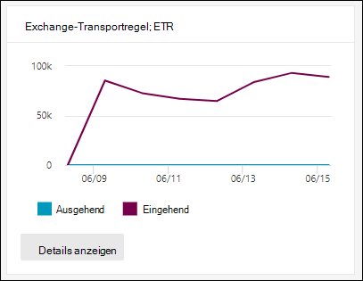
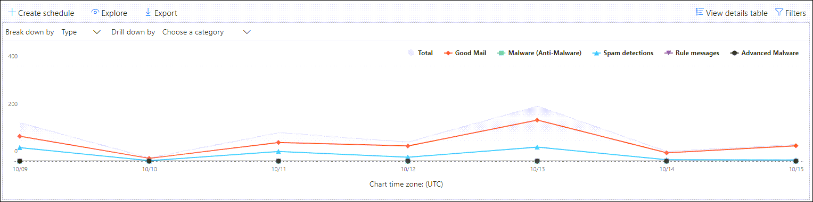

# Anzeigen von Nachrichtenflussberichten im Berichtedashboard im Security & Compliance CenterView mail flow reports in the Reports dashboard in Security & Compliance Center

[!INCLUDE [Microsoft 365 Defender rebranding](../includes/microsoft-defender-for-office.md)]

**Gilt für****Applies to**
- [Exchange Online ProtectionExchange Online Protection](exchange-online-protection-overview.md)
- [Microsoft Defender für Office 365 Plan 1 und Plan 2Microsoft Defender for Office 365 plan 1 and plan 2](defender-for-office-365.md)
- [Microsoft 365 DefenderMicrosoft 365 Defender](../defender/microsoft-365-defender.md)

Zusätzlich zu den Nachrichtenflussberichten,  die im Nachrichtenflussdashboard im Security & Compliance Center verfügbar sind, stehen im Dashboard Berichte eine Vielzahl zusätzlicher Nachrichtenflussberichte zur Verfügung, mit deren Hilfe Sie Ihre Organisation Microsoft 365 können.In addition to the mail flow reports that are available in the [Mail flow dashboard](mail-flow-insights-v2.md) in the Security & Compliance Center, a variety of additional mail flow reports are available in the Reports dashboard to help you monitor your Microsoft 365 organization.

Wenn Sie über die [erforderlichen Berechtigungen verfügen,](#what-permissions-are-needed-to-view-these-reports)können Sie diese Berichte im [Security & Compliance Center](https://protection.office.com) anzeigen, indem Sie zu **Reports** \> **Dashboard gehen.**If you have the [necessary permissions](#what-permissions-are-needed-to-view-these-reports), you can view these reports in the [Security & Compliance Center](https://protection.office.com) by going to **Reports** \> **Dashboard**. Öffnen Sie , um direkt zum Dashboard Berichte zu <https://protection.office.com/insightdashboard> wechseln.To go directly to the Reports dashboard, open <https://protection.office.com/insightdashboard>.

## ConnectorberichtConnector report

Der **Connectorbericht zeigt** nachrichtenflussaktivität auf den ein- und ausgehenden [Connectors,](/Exchange/mail-flow-best-practices/use-connectors-to-configure-mail-flow/use-connectors-to-configure-mail-flow) die für Ihre Organisation konfiguriert sind.The **Connector report** shows mail flow activity on the [inbound and outbound connectors](/Exchange/mail-flow-best-practices/use-connectors-to-configure-mail-flow/use-connectors-to-configure-mail-flow) that are configured for your organization.

Öffnen Sie zum Anzeigen des Berichts das [Security & Compliance Center,](https://protection.office.com)wechseln **Sie** zu Berichtsdashboard, und wählen \>  Sie **Connectorbericht aus.**To view the report, open the [Security & Compliance Center](https://protection.office.com), go to **Reports** \> **Dashboard** and select **Connector report**. Öffnen Sie , um direkt zum Bericht zu <https://protection.office.com/reportv2?id=ConnectorReport> wechseln.To go directly to the report, open <https://protection.office.com/reportv2?id=ConnectorReport>.

### Berichtsansicht für den ConnectorberichtReport view for the Connector report

Die folgenden Diagramme sind in der Berichtsansicht verfügbar:The following charts are available in report view:

- **Daten anzeigen nach: Nachrichtenfluss**: Dieses Diagramm zeigt die Anzahl der eingehenden und ausgehenden Nachrichten an, die nach folgendem Geordneten organisiert sind:**View data by: Mail flow**: This chart shows the number of inbound and outbound messages organized by:

  - **Total****Total**
  - **Aus dem Internet ohne Connector****From the internet without a connector**
  - **Ins Internet ohne Connector****To the internet without a connector**
  - Ein bestimmter Connector, den Sie konfiguriert haben.A specific connector that you've configured.

  Um die Daten im Diagramm  zu isolieren, verwenden Sie das Steuerelement Daten für Steuerelement anzeigen, um eine dieser Optionen oder **Den ganzen Nachrichtenfluss auszuwählen.**To isolate the data in the chart, use the **Show data for** control to select one of these options or **All mail flow**.

  

- **Daten nach: TLS-Nutzung** anzeigen: Dieses Diagramm zeigt den Prozentsatz der Verwendung der Transport Layer Security (TLS)-Version für den Nachrichtenfluss.**View data by: TLS usage**: This chart shows the percentage of Transport Layer Security (TLS) version usage for mail flow.

  Verwenden Sie zum Isolieren  der Daten im Diagramm die Option Daten für Steuerelement anzeigen, um eine der folgenden Optionen auszuwählen:To isolate the data in the chart, use the **Show data for** control to select one of the following options:

  - **Der ganze E-Mail-Fluss****All mail flow**
  - **Aus dem Internet ohne Connector****From the internet without a connector**
  - **Ins Internet ohne Connector****To the internet without a connector**
  - Ein bestimmter Connector, den Sie konfiguriert haben.A specific connector that you've configured.

  

Wenn Sie **in** einer Berichtsansicht auf Filter klicken, können Sie einen Datumsbereich mit **Startdatum** und **Enddatum angeben.**If you click **Filters** in a report view, you can specify a date range with **Start date** and **End date**.

### Detailtabelle für den ConnectorberichtDetails table view for the Connector report

Wenn Sie in einer Berichtsansicht auf **Detailtabelle anzeigen** klicken, werden die folgenden Informationen angezeigt:If you click **View details table** in a report view, the following information is shown:

- **Date****Date**
- **Richtung und Name des Connectors****Connector direction and name**
- **Connectortyp****Connector type**
- **Erzwungener TLS-Wert?**: Der **Wert True** oder **False**.**Forced TLS?**: The value **True** or **False**.
- **Kein TLS** (Prozentsatz)**No TLS** (percentage)
- **TLS 1.0** (Prozentsatz)**TLS 1.0** (percentage)
- **TLS 1.1** (Prozentsatz)**TLS 1.1** (percentage)
- **TLS 1.2** (Prozentsatz)**TLS 1.2** (percentage)
- **Volume**: Die Anzahl der Nachrichten.**Volume**: The number of messages.

Wenn Sie in einer **Detailtabelle** auf Filter klicken, können Sie einen Datumsbereich mit **Startdatum** und **Enddatum angeben.**If you click **Filters** in a details table view, you can specify a date range with **Start date** and **End date**.

Klicken Sie auf Bericht anzeigen, um zur Berichtsansicht **zurück zu wechseln.**To go back to the report view, click **View report**.

## Exchange TransportregelberichtExchange transport rule report

Der **Exchange-Transportregelbericht** zeigt die Auswirkungen von Nachrichtenflussregeln (auch als Transportregeln bezeichnet) auf ein- und ausgehende Nachrichten in Ihrer Organisation.The **Exchange transport rule report** shows the effect of mail flow rules (also known as transport rules) on incoming and outgoing messages in your organization.

Öffnen Sie zum Anzeigen des Berichts das Security  [& Compliance Center,](https://protection.office.com)wechseln Sie zu Berichtsdashboard, und wählen Sie \>  **Exchange Transportregel aus.**To view the report, open the [Security & Compliance Center](https://protection.office.com), go to **Reports** \> **Dashboard** and select **Exchange Transport rule**. Öffnen Sie , um direkt zum Bericht zu <https://protection.office.com/reportv2?id=ETRRuleReport> wechseln.To go directly to the report, open <https://protection.office.com/reportv2?id=ETRRuleReport>.

### Berichtsansicht für den Exchange TransportregelberichtReport view for the Exchange transport rule report

Die folgenden Diagramme sind in der Berichtsansicht verfügbar:The following charts are available in report view:

- **Anzeigen von Daten nach: Exchange Transportregeln** \> **Nach: Richtung aufbrechen:** Dieses  Diagramm zeigt  die Anzahl der eingehenden und ausgehenden Nachrichten, die von Transportregeln betroffen waren.**View data by: Exchange transport rules** \> **Break down by: Direction**: This chart shows the number of **Inbound** and **Outbound** messages that were affected by transport rules.

- **Anzeigen von Daten nach: Exchange Transportregeln** \> **Aufbrechen nach: Schweregrad**: Dieses  Diagramm zeigt die Anzahl der Nachrichten mit hohem Schweregrad und mittlerem Schweregrad und niedriger **Schweregrad.****View data by: Exchange transport rules** \> **Break down by: Severity**: This chart shows the number of **High severity** and **Medium severity**, and **Low severity** messages. Sie legen den Schweregrad als Aktion in der Regel (**Diese** Regel mit schweregrad oder _SetAuditSeverity überwachen) festgelegt._You set the severity level as an action in the rule (**Audit this rule with severity level** or _SetAuditSeverity_). Weitere Informationen finden Sie unter [Nachrichtenflussregelaktionen in Exchange Online](//Exchange/security-and-compliance/mail-flow-rules/mail-flow-rule-actions).For more information, see [Mail flow rule actions in Exchange Online](//Exchange/security-and-compliance/mail-flow-rules/mail-flow-rule-actions).

- **Anzeigen von Daten nach: DLP Exchange Transportregeln** \> **Nach: Richtung** aufbrechen: Dieses  Diagramm zeigt  die Anzahl der eingehenden und ausgehenden Nachrichten, die von DLP-Transportregeln (Data Loss Prevention, Verhinderung von Datenverlust) betroffen waren.**View data by: DLP Exchange transport rules** \> **Break down by: Direction**: This chart shows the number of **Inbound** and **Outbound** messages that were affected by data loss prevention (DLP) transport rules. Sie können das Diagramm weiter verfeinern, indem Sie die folgenden Optionen auswählen:You can further refine the chart by selecting on of the following options:

  - **Anzeigen von Daten für: Alle DLP-Transportregeln****Show data for: All DLP transport rules**
  - **Anzeigen von Daten für: gefährdete Benutzer****Show data for: Compromised users**
  - **Anzeigen von Daten für: Geringes Inhaltsvolumen, das vom U.S. Patriot Act erkannt wurde****Show data for: Low volume of content detected U.S. Patriot Act**

- **Anzeigen von Daten nach: DLP Exchange Transportregeln** \> **Nach: Richtung** aufbrechen: Diese  Ansicht zeigt die Anzahl der  Nachrichten mit hohem schweregrad und mittlerem Schweregrad und niedriger Schweregrad, die von DLP-Transportregeln betroffen waren. **View data by: DLP Exchange transport rules** \> **Break down by: Direction**: This view shows the number of **High severity** and **Medium severity**, and **Low severity** messages that were affected by DLP transport rules. Sie können das Diagramm weiter verfeinern, indem Sie die folgenden Optionen auswählen:You can further refine the chart by selecting on of the following options:

  - **Anzeigen von Daten für: Alle DLP-Transportregeln****Show data for: All DLP transport rules**
  - **Anzeigen von Daten für: gefährdete Benutzer****Show data for: Compromised users**
  - **Anzeigen von Daten für: Geringes Inhaltsvolumen, das vom U.S. Patriot Act erkannt wurde****Show data for: Low volume of content detected U.S. Patriot Act**

Wenn Sie **in** einer Berichtsansicht auf Filter klicken, können Sie die Ergebnisse mit den folgenden Filtern ändern:If you click **Filters** in a report view, you can modify the results with the following filters::

- **Startdatum** und **Enddatum****Start date** and **End date**
- RichtungswerteDirection values
- SchweregradwerteSeverity values

### Detailtabelle für den bericht Exchange TransportregelDetails table view for the Exchange transport rule report

Wenn Sie auf **Detailtabelle anzeigen klicken,** hängen die angezeigten Informationen von dem Diagramm ab, das Sie sich angeschaut haben:If you click **View details table**, the information that's shown depends on the chart you were looking at:

- **Daten anzeigen nach: Exchange Transportregeln**:**View data by: Exchange Transport rules**:

  - **Date****Date**
  - **Transportregel****Transport rule**
  - **Betreff****Subject**
  - **Absenderadresse****Sender address**
  - **Empfängeradresse****Recipient address**
  - **Schweregrad****Severity**
  - **Richtung****Direction**

- **Anzeigen von Daten nach: DLP Exchange Transportregeln**:**View data by: DLP Exchange transport rules**:

  - **Date****Date**
  - **DLP-Richtlinie****DLP policy**
  - **Transportregel****Transport rule**
  - **Betreff****Subject**
  - **Absenderadresse****Sender address**
  - **Empfängeradresse****Recipient address**
  - **Schweregrad****Severity**
  - **Richtung****Direction**

Wenn Sie in **einer** Detailtabelle auf Filter klicken, können Sie die Ergebnisse mit den folgenden Filtern ändern:If you click **Filters** in a details table view, you can modify the results with the following filters:

- **Startdatum** und **Enddatum****Start date** and **End date**
- RichtungswerteDirection values
- SchweregradwerteSeverity values

Klicken Sie auf Bericht anzeigen, um zur Berichtsansicht **zurück zu wechseln.**To go back to the report view, click **View report**.

## WeiterleitungsberichtForwarding report

Der **Weiterleitungsbericht zeigt** die automatisch weitergeleiteten Nachrichten Ihrer Organisation an externe Domänen aus Exchange Online Postfächern an.The **Forwarding report** shows your organization's automatically forwarded messages to external domains from Exchange Online mailboxes. Weitergeleitete Nachrichten können ein Sicherheits- oder Compliancerisiko darstellen und möglicherweise auf ein gefährdetes Konto hinweisen.Forwarded messages can pose a security or compliance risk, and might indicate a compromised account.

Öffnen Sie zum Anzeigen des Berichts das [Security & Compliance Center,](https://protection.office.com)wechseln Sie **zu** Berichtsdashboard, und wählen \>  Sie **Weiterleitungsbericht aus.**To view the report, open the [Security & Compliance Center](https://protection.office.com), go to **Reports** \> **Dashboard** and select **Forwarding report**. Öffnen Sie , um direkt zum Bericht zu <https://protection.office.com/reportv2?id=MailFlowForwarding> wechseln.To go directly to the report, open <https://protection.office.com/reportv2?id=MailFlowForwarding>.

### Berichtsansicht für den WeiterleitungsberichtReport view for the Forwarding report

Die folgenden Diagramme sind in der Berichtsansicht verfügbar:The following charts are available in the report view:

- **Daten anzeigen für: Weiterleitungsmethoden**: Die folgenden Methoden werden angezeigt:**Show data for: Forwarding methods**: The following methods are shown:

  - **Transportregel**: Wird auch als [Nachrichtenflussregeln bezeichnet.](/Exchange/security-and-compliance/mail-flow-rules/mail-flow-rules)**Transport rule**: Also known as [mail flow rules](/Exchange/security-and-compliance/mail-flow-rules/mail-flow-rules).
  - **Postfachregel**: Wird auch als [Posteingangsregeln bezeichnet.](https://support.microsoft.com/office/c24f5dea-9465-4df4-ad17-a50704d66c59)**Mailbox rule**: Also known as [Inbox rules](https://support.microsoft.com/office/c24f5dea-9465-4df4-ad17-a50704d66c59).

  

- **Daten anzeigen für: Weiterleitungsdomänen**: Diese Ansicht zeigt die Empfängerdomänen an, die die Ziele für die Weiterleitung sind.**Show data for: Forwarding domains**: This view shows the recipient domains that are the destinations for forwarding.

  

- **Daten anzeigen für: Forwarders**: Die folgenden Weiterleitungen werden angezeigt:**Show data for: Forwarders**: The following forwarders are shown:

  - **Transportregel****Transport rule**
  - Das Postfach, das die Posteingangsregel für die Weiterleitung enthält.The mailbox that contains the forwarding Inbox rule.

  

Wenn Sie **in** einer Berichtsansicht auf Filter klicken, können Sie einen Datumsbereich mit **Startdatum** und **Enddatum angeben.**If you click **Filters** in a report view, you can specify a date range with **Start date** and **End date**.

### Detailtabelle für den WeiterleitungsberichtDetails table view for the Forwarding report

Wenn Sie in einer Berichtsansicht auf **Detailtabelle anzeigen** klicken, werden die folgenden Informationen angezeigt:If you click **View details table** in a report view, the following information is shown:

- **Forwarders**: Der Wert **Transportregel** oder das Postfach, das die Posteingangsregel für die Weiterleitung enthält.**Forwarders**: The value **Transport rule** or the mailbox that contains the forwarding Inbox rule.
- **Weiterleitungstyp**: Der Wert **Postfachregel oder** **Transportregel**.**Forwarding type**: The value **Mailbox rule** or **Transport rule**.
- **Empfängername****Recipient name**
- **Empfängerdomäne****Recipient domain**
- **Details**: Dies ist der GUID-Wert der Nachrichtenflussregel oder der RuleIdentity-Wert der Posteingangsregel.**Details**: This is the GUID value of the mail flow rule, or the RuleIdentity value of the Inbox rule.
- **Count****Count**
- **Erstes Weiterleitungsdatum****First forward date**

Wenn Sie in einer **Detailtabelle** auf Filter klicken, können Sie einen Datumsbereich mit **Startdatum** und **Enddatum angeben.**If you click **Filters** in a details table view, you can specify a date range with **Start date** and **End date**.

Klicken Sie auf Bericht anzeigen, um zur Berichtsansicht **zurück zu wechseln.**To go back to the reports view, click **View report**.

## E-Mailflow-StatusberichtMailflow status report

Der **E-Mailflow-Statusbericht** ähnelt dem Bericht "Gesendete und empfangene E-Mail", mit zusätzlichen Informationen zu E-Mails, die am Edge zulässig oder blockiert sind.The **Mailflow status report** is similar to the [Sent and received email report](#sent-and-received-email-report), with additional information about email allowed or blocked on the edge. Dies ist der einzige Bericht, der Edgeschutzinformationen enthält und zeigt, wie viele E-Mails blockiert werden, bevor sie zur Auswertung durch EOP (EOP) in den Dienst zugelassen Exchange Online Protection werden.This is the only report that contains edge protection information, and shows just how much email is blocked before being allowed into the service for evaluation by Exchange Online Protection (EOP). Es ist wichtig zu wissen, dass eine Nachricht, wenn sie an fünf Empfänger gesendet wird, als fünf verschiedene Nachrichten und nicht als eine Nachricht gezählt wird.It's important to understand that if a message is sent to five recipients we count it as five different messages and not one message.
Öffnen Sie zum Anzeigen des Berichts das [Security & Compliance Center,](https://protection.office.com)wechseln Sie **zu** Berichtsdashboard, und wählen Sie \>  **E-Mailflow-Statusbericht aus.**To view the report, open the [Security & Compliance Center](https://protection.office.com), go to **Reports** \> **Dashboard** and select **Mailflow status report**. Öffnen Sie , um direkt zum **Nachrichtenflussstatusbericht zu** <https://protection.office.com/mailflowStatusReport> wechseln.To go directly to the **Mail flow status report**, open <https://protection.office.com/mailflowStatusReport>.

### Typansicht für den Mailflow-StatusberichtType view for the Mailflow status report

Wenn Sie den Bericht öffnen, **wird** standardmäßig die Registerkarte Typ ausgewählt.When you open the report, the **Type** tab is selected by default. Standardmäßig enthält diese Ansicht ein Diagramm und eine Datentabelle, die mit den folgenden Filtern konfiguriert ist:By default, this view contains a chart and a data table that's configured with the following filters:

- **Datum**: Die letzten 7 Tage.**Date**: The last 7 days.
- **Richtung**:**Direction**:

  - **Eingehendes****Inbound**
  - **Ausgehend****Outbound**
  - **Innerhalb der Organisation:** Diese Anzahl gilt für Nachrichten innerhalb eines Mandanten, d. h.**Intra-org**: this count is for messages within a tenant i.e Absender abc@domain.com an Empfänger gesendet xyz@domain.com (getrennt von **ein-** und ausgehend **gezählt)**sender abc@domain.com sends to recipient xyz@domain.com  (counted separately from **Inbound** and **Outbound**)

- **Typ**:**Type**:

  - **Gute E-Mail****Good mail**
  - **Schadsoftware****Malware**
  - **Spam****Spam**
  - **Edgeschutz****Edge protection**
  - **Regelmeldungen****Rule messages**
  - **Phishing-E-Mail****Phishing email**

Das Diagramm wird nach den **Type-Werten** organisiert.The chart is organized by the **Type** values.

Sie können diese Filter ändern, indem Sie auf **Filter** klicken oder auf einen Wert in der Diagrammlegende klicken.You can change these filters by clicking **Filter** or by clicking a value in the chart legend.

Die Datentabelle enthält die folgenden Informationen:The data table contains the following information:

- **Richtung****Direction**
- **Type****Type**
- **24 Stunden****24 hours**
- **3 Tage****3 days**
- **7 Tage****7 days**
- **15 Tage****15 days**
- **30 Tage****30 days**

Wenn Sie auf **Kategorie auswählen klicken,** können Sie aus den folgenden Werten auswählen:If you click **Choose a category for more details**, you can select from the following values:

- **Phishing-E-Mail:** Diese Auswahl führt Sie zum [Statusbericht zum Bedrohungsschutz.](view-email-security-reports.md#threat-protection-status-report)**Phishing email**: This selection takes you to the [Threat protection status report](view-email-security-reports.md#threat-protection-status-report).
- **Schadsoftware in** E-Mail: Diese Auswahl führt Sie zum Statusbericht zum [Bedrohungsschutz.](view-email-security-reports.md#threat-protection-status-report)**Malware in email**: This selection takes you to the [Threat protection status report](view-email-security-reports.md#threat-protection-status-report).
- **Spamerkennungen:** Diese Auswahl führt Sie zum [Bericht "Spamerkennungen".](view-email-security-reports.md#spam-detections-report)**Spam detections**: This selection takes you to the [Spam Detections report](view-email-security-reports.md#spam-detections-report).
- **Edge-blockierter Spam:** Diese Auswahl führt Sie zum [Bericht "Spamerkennungen".](view-email-security-reports.md#spam-detections-report)**Edge blocked spam**: This selection takes you to the [Spam Detections report](view-email-security-reports.md#spam-detections-report).

**Export**:**Export**:

Für die Detailansicht können Sie Daten nur für einen Tag exportieren.For the detail view, you can only export data for one day. Wenn Sie Also Daten für 7 Tage exportieren möchten, müssen Sie 7 verschiedene Exportaktionen ausführen.So, if you want to export data for 7 days, you need to do 7 different export actions.

Jede exportierte .csv ist auf 150.000 Zeilen beschränkt.Each exported .csv file is limited to 150,000 rows. Wenn die Daten für den Tag mehr als 150.000 Zeilen enthalten, werden mehrere .csv erstellt.If the data for that day contains more than 150,000 rows, then multiple .csv files will be created.

### Richtungsansicht für den Mailflow-StatusberichtDirection view for the Mailflow status report

Wenn Sie auf die **Registerkarte Richtung** klicken, werden dieselben Standardfilter aus der **Typansicht** verwendet.If you click the **Direction** tab, the same default filters from the **Type** view are used.

Das Diagramm wird nach **Richtungswerten** organisiert.The chart is organized by **Direction** values.

Sie können diese Filter ändern, indem Sie auf **Filter** klicken oder auf einen Wert in der Diagrammlegende klicken.You can change these filters by clicking **Filter** or by clicking a value in the chart legend. Es werden dieselben Filter aus der **Typansicht** verwendet.The same filters from the **Type** view are used.

Die Datentabelle enthält dieselben Informationen aus der **Type-Ansicht.**The data table contains same information from the **Type** view.

Die **Option Kategorie auswählen für weitere Details,** die auswahl- und verhalten verfügbar sind, sind mit der **Typansicht** identisch.The **Choose a category for more details** available selections and behavior are the same as the **Type** view.

**Export**:**Export**:

Für die Detailansicht können Sie Daten nur für einen Tag exportieren.For the detail view, you can only export data for one day. Wenn Sie Also Daten für 7 Tage exportieren möchten, müssen Sie 7 verschiedene Exportaktionen ausführen.So, if you want to export data for 7 days, you need to do 7 different export actions.

Jede exportierte .csv ist auf 150.000 Zeilen beschränkt.Each exported .csv file is limited to 150,000 rows. Wenn die Daten für den Tag mehr als 150.000 Zeilen enthalten, werden mehrere .csv erstellt.If the data for that day contains more than 150,000 rows, then multiple .csv files will be created.

### Trichteransicht für den Mailflow-StatusberichtFunnel view for the Mailflow status report

Die **Trichteransicht** zeigt, wie die E-Mail-Bedrohungsschutzfeatures von Microsoft eingehende und ausgehende E-Mails in Ihrer Organisation filtern.The **Funnel** view shows you how Microsoft's email threat protection features filter incoming and outgoing email in your organization. Sie enthält Details zur Gesamtzahl der E-Mails und dazu, wie sich die konfigurierten Funktionen zum Schutz vor Bedrohungen, einschließlich Edgeschutz, Anschmierung von Schadsoftware, Antiphishing, Antispam und Antis spoofing auf diese Anzahl auswirken.It provides details on the total email count, and how the configured threat protection features, including edge protection, anti-malware, anti-phishing, anti-spam, and anti-spoofing affect this count.

Wenn Sie auf die Registerkarte **Trichter** klicken, enthält diese Ansicht standardmäßig ein Diagramm und eine Datentabelle, die mit den folgenden Filtern konfiguriert ist:If you click the **Funnel** tab, by default, this view contains a chart and a data table that's configured with the following filters:

- **Datum**: Die letzten 7 Tage.**Date**: The last 7 days.

- **Richtung**:**Direction**:

  - **Eingehendes****Inbound**
  - **Ausgehend****Outbound**
  - **Innerhalb der Organisation:** Diese Anzahl gilt für Nachrichten, die innerhalb eines Mandanten gesendet werden. d. h. Absender abc@domain.com an Empfänger gesendet xyz@domain.com (getrennt von ein- und ausgehend gezählt).**Intra-org**: This count is for messages sent within a tenant; i.e, sender abc@domain.com sends to recipient xyz@domain.com (counted separately from Inbound and Outbound).

Die Aggregatansicht und die Datentabelle ermöglichen eine Filterung von 90 Tagen.The aggregate view and data table view allow for 90 days of filtering.

Wenn Sie auf **Filtern** klicken, können Sie sowohl das Diagramm als auch die Datentabelle filtern.If you click **Filter**, you can filter both the chart and the data table.

Dieses Diagramm zeigt die E-Mail-Anzahl, die nach folgendem Geordneten organisiert ist:This chart shows the email count organized by:

- **E-Mail insgesamt****Total email**
- **E-Mail nach Edgeschutz****Email after edge protection**
- **E-Mail nach Anschmierung von Schadsoftware, Datei reputation, Dateitypblock****Email after anti-malware, file reputation, file type block**
- **E-Mail nach Antiphish, URL-Reputation, Markenwechsel, Antis spoof****Email after anti-phish, URL reputation, brand impersonation, anti-spoof**
- **E-Mail nach Antispam, Massen-E-Mail-Filterung****Email after anti-spam, bulk mail filtering**
- **E-Mail nach Benutzer- und Domänenwechsel**1**Email after user and domain impersonation**1
- **E-Mail nach Datei- und URL-Detonation**1**Email after file and URL detonation**1
- **E-Mails, die nach der Zustellung als gutartig erkannt wurden (URL-Klickzeitschutz)****Email detected as benign after post-delivery protection (URL click time protection)**

1 Defender für Office 3651 Defender for Office 365 only

Klicken Sie auf den Wert in der Diagrammlegende, um die von EOP oder Defender für Office 365 gefilterte E-Mail-Nachricht separat anzeigen zu können.To view the email filtered by EOP or Defender for Office 365 separately, click on the value in the chart legend.

Die Datentabelle enthält die folgenden Informationen in absteigender Datumsreihenfolge:The data table contains the following information, shown in descending date order:

- **Date****Date**
- **E-Mail insgesamt****Total email**
- **Edgeschutz****Edge protection**
- **An malware, file reputation, file type block**:**Anti-malware, file reputation, file type block**:
  - **Datei-Reputation:** Nachrichten, die aufgrund der Identifizierung einer angefügten Datei durch andere Microsoft-Kunden gefiltert wurden.**File reputation**: Messages filtered due to identification of an attached file by other Microsoft customers.
  - **Dateitypblock:** Nachrichten, die aufgrund des Typs der in der Nachricht identifizierten schädlichen Datei gefiltert wurden.**File type block**: Messages filtered due to the type of malicious file identified in the message.
- **Antiphish, URL-Reputation, Markenwechsel, Antis spoof**:**Anti-phish, URL reputation, Brand impersonation, anti-spoof**:
  - **URL-Reputation:** Nachrichten, die aufgrund der Identifizierung der URL durch andere Microsoft-Kunden gefiltert wurden.**URL reputation**: Messages filtered due to the identification of the URL by other Microsoft customers.
  - **Markenwechsel:** Nachrichten, die aufgrund der Nachricht gefiltert wurden, die von bekannten Markensendern als Identitätswechsel gesendet wurde.**Brand impersonation**: Messages filtered due to the message coming from well-known brand impersonating senders.
  - **Antis spoof**: Nachrichten, die aufgrund der Nachricht gefiltert wurden, die versucht, eine Domäne zu spoofen, zu der der Empfänger gehört, oder eine Domäne, die der Nachrichtensender nicht besitzt.**Anti-spoof**: Messages filtered due to the message attempting to spoof a domain that the recipient belongs to, or a domain that the message sender doesn't own.
- **Antispam, Massen-E-Mail-Filterung**:**Anti-spam, bulk mail filtering**:
  - Massen-E-Mail-Filterung: Nachrichten, die aufgrund eines Versuches gefiltert wurden, Massen-E-Mails an die Empfänger zu senden.**Bulk mail filtering**: Messages filtered due to an attempt to deliver bulk mail to its recipients.
- Identitätswechsel von Benutzern und Domänen **(Defender for Office 365)**:**User and domain impersonation (Defender for Office 365)**:
  - **Benutzerwechsel:** Nachrichten, die aufgrund eines Versuches gefiltert wurden, einen Benutzer (Nachrichtensender) zu imitieren, der in den Identitätswechselschutzeinstellungen einer Antiphishingrichtlinie definiert ist.**User impersonation**: Messages filtered due to an attempt to impersonate a user (message sender) that's defined in the impersonation protection settings of an anti-phishing policy.
  - **Domänenwechsel:** Nachrichten, die aufgrund eines Versuches gefiltert wurden, eine Domäne zu imitieren, die in den Identitätswechselschutzeinstellungen einer Antiphishingrichtlinie definiert ist.**Domain impersonation**: Messages filtered due to an attempt to impersonate a domain that's defined in the impersonation protection settings of an anti-phishing policy.
- **Datei- und URL-Detonation (Defender for Office 365)**:**File and URL detonation (Defender for Office 365)**:
  - **Dateidetonation:** Nachrichten, die nach einer Richtlinie für sichere Anlagen gefiltert werden.**File detonation**: Messages filtered by a Safe Attachments policy.
  - **URL-Detonation:** Nachricht, die nach einer Richtlinie für sichere Links gefiltert wurde.**URL detonation**: Message filtered by a Safe Links policy.
- **Post-Delivery Protection und ZAP (ATP) oder ZAP (EOP):** ZAP gibt null Stunden automatisches Löschen an.**Post-delivery protection and ZAP (ATP), or ZAP (EOP)**: ZAP indicates zero hour auto-purge.

Wenn Sie eine Zeile in der Datentabelle auswählen, wird eine weitere Aufschlüsselung der E-Mail-Anzahl im Flyout angezeigt.If you select a row in the data table, a further breakdown of the email counts are shown in the flyout.

**Export**:**Export**:

Nachdem Sie unter **Optionen** auf **Exportieren** geklickt haben, können Sie einen der folgenden Werte auswählen:After you click **Export** under **Options**, you can select one of the following values:

- **Zusammenfassung (mit Daten für die letzten 90 Tage)****Summary (with data for last 90 days at most)**
- **Details (mit Daten für die letzten 30 Tage)****Details (with data for last 30 days at most)**

Wählen Sie unter **Datum** einen Bereich aus, und klicken Sie dann auf **Übernehmen**.Under **Date**, choose a range, and then click **Apply**. Daten für die aktuellen Filter werden in eine datei .csv exportiert.Data for the current filters will be exported to a .csv file.

Jede exportierte .csv ist auf 150.000 Zeilen beschränkt.Each exported .csv file is limited to 150,000 rows. Wenn die Daten mehr als 150.000 Zeilen enthalten, werden mehrere .csv erstellt.If the data contains more than 150,000 rows, then multiple .csv files will be created.

 

### Tech-Ansicht für den Mailflow-StatusberichtTech view for the Mailflow status report

Die **Tech-Ansicht** ähnelt der **Trichteransicht** und bietet detailliertere Details für die konfigurierten Features zum Schutz vor Bedrohungen.The **Tech view** is similar to the **Funnel** view, providing more granular details for the configured threat protections features. Anhand des Diagramms können Sie sehen, wie Nachrichten in den verschiedenen Phasen des Bedrohungsschutzes kategorisiert werden.From the chart, you can see how messages are categorized at the different stages of threat protection.

Wenn Sie auf die Registerkarte **Tech-Ansicht** klicken, enthält diese Ansicht standardmäßig ein Diagramm und eine Datentabelle, die mit den folgenden Filtern konfiguriert ist:If you click the **Tech view** tab, by default, this view contains a chart and a data table that's configured with the following filters:

- **Datum**: Die letzten 7 Tage.**Date**: The last 7 days.

- **Richtung**:**Direction**:

  - **Eingehendes****Inbound**
  - **Ausgehend****Outbound**
  - **Innerhalb der Organisation:** Diese Anzahl gilt für Nachrichten innerhalb eines Mandanten, d. h.**Intra-org**: this count is for messages within a tenant i.e Absender abc@domain.com an Empfänger gesendet xyz@domain.com (getrennt von ein- und ausgehend gezählt)sender abc@domain.com sends to recipient xyz@domain.com (counted separately from Inbound and Outbound)

Die Aggregatansicht und die Datentabelle ermöglichen eine Filterung von 90 Tagen.The aggregate view and data table view allow for 90 days of filtering.

Wenn Sie auf **Filtern** klicken, können Sie sowohl das Diagramm als auch die Datentabelle filtern.If you click **Filter**, you can filter both the chart and the data table.

Dieses Diagramm zeigt Nachrichten, die in die folgenden Kategorien unterteilt sind:This chart shows messages organized into the following categories:

- **E-Mail insgesamt****Total email**
- **Edge zulassen** und **Edge gefiltert****Edge allow** and **Edge filtered**
- **Keine Schadsoftware,** **Erkennung sicherer Anlagen,** \* Erkennung von An **malwaremodulen** und **Regelmeldungen****Not malware**, **Safe Attachments detection**\*, **Anti-malware engine detection**, and **Rule messages**
- **Kein Phish,** **DMARC-Fehler,** **Identitätswechselerkennung,** **Spooferkennung** und **Phishingerkennung****Not phish**, **DMARC failure**, **Impersonation detection**, **Spoof detection**, and **Phish detection**
- **Keine Erkennung mit URL-Detonation** und **URL-Detonation**\***No detection with URL detonation** and **URL detonation detection**\*
- **Keine Spam-** und  **Spamnachrichten****Not spam** and  **Spam**
- **Nicht schädliche E-Mails,** **Erkennung sicherer** \* Links und **ZAP****Non-malicious email**, **Safe Links detection**\*, and **ZAP**

\*Defender für Office 365\* Defender for Office 365

Wenn Sie den Mauszeiger auf eine Kategorie im Diagramm zeigen, wird die Anzahl der Nachrichten in dieser Kategorie angezeigt.When you hover over a category in the chart, you can see the number of messages in that category.

Die Datentabelle enthält die folgenden Informationen in absteigender Datumsreihenfolge:The data table contains the following information, shown in descending date order:

- **Date****Date**
- **E-Mail insgesamt****Total email**
- **Edge gefiltert****Edge filtered**
- **An malware engine, Safe Attachments, rule filtered**:**Anti-malware engine, Safe Attachments, rule filtered**:
  - **Regel gefiltert:** Nachrichten, die aufgrund von Nachrichtenflussregeln gefiltert wurden (auch als Transportregeln bekannt).**Rule filtered**: Messages filtered due to  mail flow rules (also known as transport rules).
- **DMARC, Identitätswechsel, Spoof, Phish gefiltert**:**DMARC, impersonation, spoof, phish filtered**:
  - **DMARC**: Nachrichten, die gefiltert wurden, weil die DMARC-Authentifizierungsüberprüfung der Nachricht fehlt.**DMARC**: Messages filtered due to the message failing its DMARC authentication check.
- **Erkennung der URL-Detonation****URL detonation detection**
- **Antispam gefiltert****Anti-spam filtered**
- **ZAP entfernt****ZAP removed**
- **Erkennung durch sichere Links****Detection by Safe Links**

Wenn Sie eine Zeile in der Datentabelle auswählen, wird eine weitere Aufschlüsselung der E-Mail-Anzahl im Flyout angezeigt.If you select a row in the data table, a further breakdown of the email counts are shown in the flyout.

**Export**:**Export**:

Wenn Sie auf **Exportieren** klicken, können Sie unter **Optionen** einen der folgenden Werte auswählen:On clicking **Export**, under **Options** you can select one of the following values:

- **Zusammenfassung (mit Daten für die letzten 90 Tage)****Summary (with data for last 90 days at most)**
- **Details (mit Daten für die letzten 30 Tage)****Details (with data for last 30 days at most)**

Wählen Sie unter **Datum** einen Bereich aus, und klicken Sie dann auf **Übernehmen**.Under **Date**, choose a range, and then click **Apply**. Daten für die aktuellen Filter werden in eine datei .csv exportiert.Data for the current filters will be exported to a .csv file.

Jede exportierte .csv ist auf 150.000 Zeilen beschränkt.Each exported .csv file is limited to 150,000 rows. Wenn die Daten mehr als 150.000 Zeilen enthalten, werden mehrere .csv erstellt.If the data contains more than 150,000 rows, then multiple .csv files will be created.

 

## Gesendeter und empfangener E-Mail-BerichtSent and received email report

Der **Bericht "Gesendete** und empfangene E-Mail" ist ein smarter Bericht, der Informationen zu eingehenden und ausgehenden E-Mails enthält, einschließlich Spamerkennungen, Schadsoftware und E-Mails, die als "gut" identifiziert werden.The **Sent and received email** report is a smart report that shows information about incoming and outgoing email, including spam detections, malware, and email identified as "good." Der Unterschied zwischen diesem Bericht und dem [E-Mailflow-Statusbericht](#mailflow-status-report) ist: Dieser Bericht enthält keine Daten zu Nachrichten, die durch den Edgeschutz blockiert wurden. Es ist wichtig zu wissen, dass eine Nachricht, wenn sie an fünf Empfänger gesendet wird, als eine Nachricht gezählt wird.The difference between this report and the [Mailflow status report](#mailflow-status-report) is: this report doesn't include data about messages blocked by edge protection.It's important to understand that if a message is sent to five recipients we count it as one message.

Die Aggregatansicht und die Detailansicht des Berichts ermöglichen eine Filterung von 90 Tagen.The aggregate view and the detail view of the report allow for 90 days of filtering.

Öffnen Sie zum Anzeigen des Berichts das [Security & Compliance Center,](https://protection.office.com)wechseln Sie **zu** Berichtsdashboard, und wählen Sie \>  **Gesendete und empfangene E-Mails aus.**To view the report, open the [Security & Compliance Center](https://protection.office.com), go to **Reports** \> **Dashboard** and select **Sent and received email**. Öffnen Sie , um direkt zum Bericht zu <https://protection.office.com/reportv2?id=SentAndReceivedMailATP> wechseln.To go directly to the report, open <https://protection.office.com/reportv2?id=SentAndReceivedMailATP>.

### Berichtsansicht für den Gesendeten und empfangenen E-Mail-BerichtReport view for the Sent and received email report

Die folgenden Diagramme sind in der Berichtsansicht verfügbar:The following charts are available in the report view:

- **Aufteilen nach: Typ**: Das Diagramm zeigt alle verfügbaren Kategorien an:**Break down by: Type**: The chart shows all available categories:

  - **Total****Total**
  - **Gute E-Mail****Good mail**
  - **Schadsoftware (Anti-Malware)** (EOP)**Malware (anti-malware)** (EOP)
  - **Spamerkennungen****Spam detections**
  - **Regelmeldungen****Rule messages**
  - **Erweiterte Schadsoftware** (Microsoft Defender for Office 365)**Advanced malware** (Microsoft Defender for Office 365)

  Wenn Sie den Mauszeiger auf einen Tag (Datenpunkt) im Diagramm zeigen, werden Details für den Tag angezeigt.When you hover over a day (data point) in the chart, you can see details for that day.

  

- **Aufbrechen nach: Richtung**: Das Diagramm zeigt **Gesamt-,** **Eingehende** und **ausgehende** Daten an.**Break down by: Direction**: The chart shows **Total**, **Inbound**, and **Outbound** data. Wenn Sie den Mauszeiger auf einen Tag (Datenpunkt) im Diagramm zeigen, werden Details für den Tag angezeigt.When you hover over a day (data point) in the chart, you can see details for that day.

  

- **Drilldown von** \> **Schadsoftware (Ansoftware):** Diese Auswahl führt Sie zu den [Schadsoftwareerkennungen im E-Mail-Bericht.](view-email-security-reports.md#malware-detections-in-email-report)**Drill down by** \> **Malware (anti-malware)**: This selection takes you to the [Malware detections in email report](view-email-security-reports.md#malware-detections-in-email-report).

- **Drilldown von** \> **Spamerkennungen)**: Diese Auswahl führt Sie zum [Bericht "Spamerkennungen".](view-email-security-reports.md#spam-detections-report)**Drill down by** \> **Spam detections)**: This selection takes you to the [Spam Detections report](view-email-security-reports.md#spam-detections-report).

Wenn Sie **in** einer Berichtsansicht auf Filter klicken, können Sie die Ergebnisse mit den folgenden Filtern ändern:If you click **Filters** in a report view, you can modify the results with the following filters:

- **Startdatum** und **Enddatum****Start date** and **End date**
- RichtungswerteDirection values
- TypwerteType values

Klicken Sie auf Bericht anzeigen, um zur Berichtsansicht **zurück zu wechseln.**To go back to the report view, click **View report**.

### Detailtabelle für den Gesendeten und empfangenen E-Mail-BerichtDetails table view for the Sent and received email report

Wenn Sie **in der Ansicht Nach:** Richtung oder Nach unten **nach:** Richtungsansicht auf Detailtabelle anzeigen klicken, werden die folgenden Informationen angezeigt: If you click **View details table** in the **Break down by: Direction** or **Break down by: Direction** view, the following information is shown:

- **Datum (UTC)****Date (UTC)**
- **Type****Type**
- **Richtung****Direction**
- **Anzahl der Nachrichten****Message count**

Wenn Sie in **einer** Detailtabelle auf Filter klicken, können Sie die Ergebnisse mit den folgenden Filtern ändern:If you click **Filters** in a details table view, you can modify the results with the following filters:

- **Startdatum** und **Enddatum****Start date** and **End date**
- RichtungswerteDirection values
- TypwerteType values

Klicken Sie auf Bericht anzeigen, um zur Berichtsansicht **zurück zu wechseln.**To go back to the report view, click **View report**.

## Bericht über die besten Absender und EmpfängerTop senders and recipients report

Der **Bericht "Absender und Empfänger am** oberen Rand" ist ein Kreisdiagramm, in dem Ihre absender und empfänger am besten angezeigt werden.The **Top senders and recipients** report is a pie chart showing your top email senders and recipients.

Öffnen Sie zum Anzeigen des Berichts das [Security & Compliance Center,](https://protection.office.com)wechseln Sie **zu** Berichtsdashboard, und wählen Sie \>  **Top senders and recipients aus.**To view the report, open the [Security & Compliance Center](https://protection.office.com), go to **Reports** \> **Dashboard** and select **Top senders and recipients**. Öffnen Sie , um direkt zum Bericht zu <https://protection.office.com/reportv2?id=TopSenderRecipientsATP> wechseln.To go directly to the report, open <https://protection.office.com/reportv2?id=TopSenderRecipientsATP>.

### Berichtsansicht für den Bericht mit den besten Absendern und EmpfängernReport view for the Top senders and recipient report

Die folgenden Diagramme sind in der Berichtsansicht verfügbar:The following charts are available in the report view:

- **Anzeigen von Daten für \> Die obersten E-Mail-Absender****Show data for \> Top mail senders**
- **Anzeigen von Daten für \> Die obersten E-Mail-Empfänger****Show data for \> Top mail recipients**
- **Anzeigen von Daten für \> Die besten Spamempfänger****Show data for \> Top spam recipients**
- **Anzeigen von Daten für \> EOP (Top Malware Recipients)****Show data for \> Top malware recipients** (EOP)
- **Anzeigen von Daten für \> Top Malware Recipients (Defender for Office 365)****Show data for \> Top malware recipients (Defender for Office 365)**

Die Zusammensetzung des Kreisdiagramms ändert sich basierend auf diesen Auswahlen.The composition of the pie chart changes based on these selections.

Wenn Sie auf einen Keil im Kreisdiagramm zeigen, wird eine Anzahl der gesendeten oder empfangenen Nachrichten angezeigt.When you hover over a wedge in the pie chart, you can see a count of messages sent or received.

Wenn Sie **in** einer Berichtsansicht auf Filter klicken, können Sie einen Datumsbereich mit **Startdatum** und **Enddatum angeben.**If you click **Filters** in a report view, you can specify a date range with **Start date** and **End date**.

### Detailtabelle für den Bericht "Absender und Empfänger am oberen Rand"Details table view for the Top senders and recipient report

Wenn Sie auf **Detailtabelle anzeigen klicken,** hängen die angezeigten Informationen von dem Diagramm ab, das Sie sich angeschaut haben:If you click **View details table**, the information that's shown depends on the chart you were looking at:

- **Anzeigen von Daten für \> Die obersten E-Mail-Absender****Show data for \> Top mail senders**

  - **Die besten E-Mail-Absender****Top mail senders**
  - **Count****Count**

- **Anzeigen von Daten für \> Die obersten E-Mail-Empfänger****Show data for \> Top mail recipients**

  - **Die besten E-Mail-Empfänger****Top mail recipients**
  - **Count****Count**

- **Anzeigen von Daten für \> Die besten Spamempfänger****Show data for \> Top spam recipients**

  - **Die besten Spamempfänger****Top spam recipients**
  - **Count****Count**

- **Anzeigen von Daten für \> EOP (Top Malware Recipients)****Show data for \> Top malware recipients** (EOP)

  - **Empfänger der besten Schadsoftware****Top malware recipients**
  - **Count****Count**

- **Anzeigen von Daten für \> Top Malware Recipients (Defender for Office 365)****Show data for \> Top malware recipients (Defender for Office 365)**

  - **Top malware recipients (Defender for Office 365)****Top malware recipients (Defender for Office 365)**
  - **Count****Count**

Wenn Sie in einer **Detailtabelle** auf Filter klicken, können Sie einen Datumsbereich mit **Startdatum** und **Enddatum angeben.**If you click **Filters** in a details table view, you can specify a date range with **Start date** and **End date**.

Klicken Sie auf Bericht anzeigen, um zur Berichtsansicht **zurück zu wechseln.**To go back to the report view, click **View report**.

## Welche Berechtigungen sind zum Anzeigen dieser Berichte erforderlich?What permissions are needed to view these reports?

Um die in diesem Artikel beschriebenen Berichte anzeigen und verwenden zu können, müssen Sie Mitglied einer der folgenden Rollengruppen im Security & Compliance Center sein:In order to view and use the reports described in this article, you need to be a member of one of the following role groups in the Security & Compliance Center:

- **Organisationsverwaltung****Organization Management**
- **Sicherheitsadministrator****Security Administrator**
- **Security Reader****Security Reader**
- **Globaler Leser****Global Reader**

Weitere Informationen finden Sie unter [Berechtigungen im Security & Compliance Center](permissions-in-the-security-and-compliance-center.md).For more information, see [Permissions in the Security & Compliance Center](permissions-in-the-security-and-compliance-center.md).

> [!NOTE]
> Durch das Hinzufügen von Benutzern zur entsprechenden Azure Active Directory-Rolle im Microsoft 365 Admin Center erhalten Benutzer die erforderlichen Berechtigungen im Security & Compliance Center _und_ Berechtigungen für andere Features in Microsoft 365.Adding users to the corresponding Azure Active Directory role in the Microsoft 365 admin center gives users the required permissions in the Security & Compliance Center _and_ permissions for other features in Microsoft 365. Weitere Informationen finden Sie unter [Informationen zu Administratorrollen](../../admin/add-users/about-admin-roles.md).For more information, see [About admin roles](../../admin/add-users/about-admin-roles.md).

## Verwandte ThemenRelated topics

[Intelligente Berichte und Einblicke im Security & Compliance CenterSmart reports and insights in the Security & Compliance Center](reports-and-insights-in-security-and-compliance.md)

[Nachrichtenübermittlung und Einblicke im Security & Compliance CenterMail flow insights in the Security & Compliance Center](mail-flow-insights-v2.md)

[Anzeigen von E-Mail-Sicherheitsberichten im Security & Compliance CenterView email security reports in the Security & Compliance Center](view-email-security-reports.md)

[Anzeigen von Berichten für Microsoft Defender für Office 365View reports for Microsoft Defender for Office 365](view-reports-for-mdo.md)
