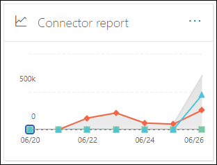
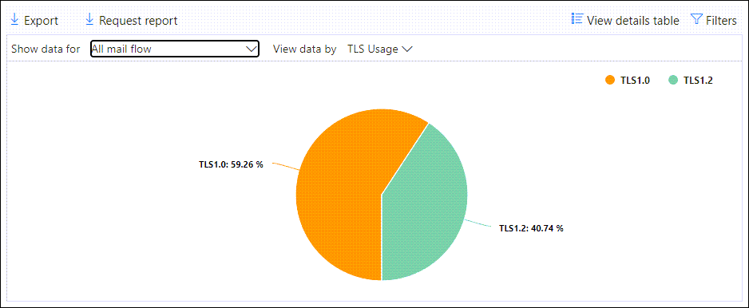
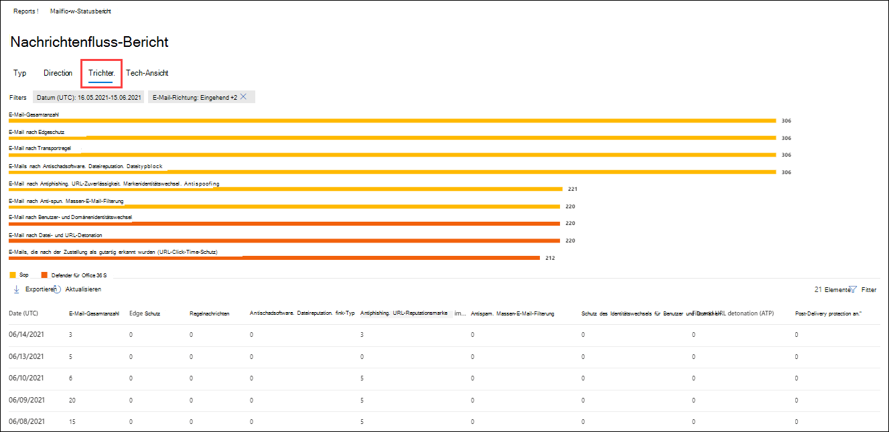

# Anzeigen von Nachrichtenfluss Berichten im Dashboard "Berichte" im Security & Compliance Center

[!INCLUDE [Microsoft 365 Defender rebranding](../includes/microsoft-defender-for-office.md)]

Zusätzlich zu den Nachrichtenfluss Berichten, die im [Nachrichtenfluss-Dashboard](mail-flow-insights-v2.md) im Security & Compliance Center zur Verfügung stehen, stehen im Dashboard Berichte eine Vielzahl zusätzlicher Nachrichtenübermittlungs Berichte zur Verfügung, mit denen Sie Ihre Microsoft 365-Organisation überwachen können.

Wenn Sie über die [erforderlichen Berechtigungen](#what-permissions-are-needed-to-view-these-reports)verfügen, können Sie diese Berichte im [Security & Compliance Center](https://office.protection.com) anzeigen, indem Sie zum **Reports** \> **Dashboard**Berichte wechseln. Wenn Sie direkt zum Dashboard Berichte wechseln möchten, öffnen Sie <https://protection.office.com/insightdashboard> .

## Connector-Bericht

Der **Bericht Connector** zeigt die Nachrichtenfluss Aktivität für die [eingehenden und ausgehenden Connectors](https://docs.microsoft.com/Exchange/mail-flow-best-practices/use-connectors-to-configure-mail-flow/use-connectors-to-configure-mail-flow) an, die für Ihre Organisation konfiguriert sind.

Öffnen Sie zum Anzeigen des Berichts das [Security & Compliance Center](https://protection.office.com), wechseln Sie **Reports** zum \> **Dashboard** Berichte, und wählen Sie **connectorbericht**aus. Wenn Sie direkt zum Bericht wechseln möchten, öffnen Sie <https://protection.office.com/reportv2?id=ConnectorReport> .

### Berichtsansicht für den connectorbericht

Die folgenden Diagramme stehen in der Berichtsansicht zur Verfügung:

- **Anzeigen von Daten nach: Nachrichtenfluss**: Dieses Diagramm zeigt die Anzahl der eingehenden und ausgehenden Nachrichten, die von organisiert werden:

  - **Total**
  - **Aus dem Internet ohne Connector**
  - **An das Internet ohne Connector**
  - Einen bestimmten Connector, den Sie konfiguriert haben.

  Um die Daten im Diagramm zu isolieren, verwenden Sie die Option **Daten für** SteuerelementAnzeigen, um eine dieser Optionen oder den **gesamten Nachrichtenfluss**auszuwählen.

  

- **Daten nach: TLS Usage**: in diesem Diagramm wird der prozentuale Anteil der TLS-Version (Transport Layer Security) für den Nachrichtenfluss angezeigt.

  Um die Daten im Diagramm zu isolieren, wählen Sie mithilfe des Steuerelements **Daten anzeigen für** eine der folgenden Optionen aus:

  - **Gesamter Nachrichtenfluss**
  - **Aus dem Internet ohne Connector**
  - **An das Internet ohne Connector**
  - Einen bestimmten Connector, den Sie konfiguriert haben.

  

Wenn Sie in einer Berichtsansicht auf **Filter** klicken, können Sie einen Datumsbereich mit **anfangs** -und **Enddatum**angeben.

### Detailtabellen Ansicht für den connectorbericht

Wenn Sie in einer Berichtsansicht auf **Detailtabelle anzeigen** klicken, werden die folgenden Informationen angezeigt:

- **Date**
- **Verbindungsrichtung und-Name**
- **Connectortyp**
- **Forced TLS?**: der Wert **true** oder **false**.
- **Kein TLS** (Prozentsatz)
- **TLS 1,0** (Prozentsatz)
- **TLS 1,1** (Prozentsatz)
- **TLS 1,2** (Prozentsatz)
- **Volume**: die Anzahl der Nachrichten.

Wenn Sie in einer Detailtabellen Ansicht auf **Filter** klicken, können Sie einen Datumsbereich mit **anfangs** -und **Enddatum**angeben.

Klicken Sie auf **Bericht anzeigen**, um zur Berichtsansicht zurückzukehren.

## Exchange-Transportregel Bericht

Der **Exchange-Transportregel Bericht** zeigt die Auswirkungen von Nachrichtenfluss Regeln (auch als Transportregeln bezeichnet) auf ein-und ausgehende Nachrichten in Ihrer Organisation.

Öffnen Sie zum Anzeigen des Berichts das [Security & Compliance Center](https://protection.office.com), wechseln Sie **Reports** zum \> **Dashboard** Berichte, und wählen Sie **Exchange-Transport Regel**aus. Wenn Sie direkt zum Bericht wechseln möchten, öffnen Sie <https://protection.office.com/reportv2?id=ETRRuleReport> .

### Berichtsansicht für den Exchange-Transportregel Bericht

Die folgenden Diagramme stehen in der Berichtsansicht zur Verfügung:

- **Anzeigen von Daten nach: Exchange-Transportregeln** \> **Aufschlüsseln nach: Direction**: Dieses Diagramm zeigt die Anzahl der **eingehenden** und **ausgehenden** Nachrichten, die von Transportregeln betroffen waren.

- **Anzeigen von Daten nach: Exchange-Transportregeln** \> **Aufschlüsseln nach: Severity**: Dieses Diagramm zeigt die Anzahl der Nachrichten mit **hohem schwere** Grad und **mittlerem**Schweregrad sowie Nachrichten mit **niedrigem Schweregrad** . Sie legen den Schweregrad als Aktion in der Regel fest (**Überwachen Sie diese Regel mit schwere** Grad oder _SetAuditSeverity_). Weitere Informationen finden Sie unter [Aktionen für Nachrichtenfluss Regeln in Exchange Online](https://docs.microsoft.com//Exchange/security-and-compliance/mail-flow-rules/mail-flow-rule-actions).

- **Daten anzeigen nach: DLP Exchange-Transportregeln** \> **Aufschlüsseln nach: Direction**: Dieses Diagramm zeigt die Anzahl der **eingehenden** und **ausgehenden** Nachrichten, die von den DLP-Transportregeln (Data Loss Prevention, Verhinderung von Datenverlust) betroffen waren. Sie können das Diagramm weiter verfeinern, indem Sie eine der folgenden Optionen auswählen:

  - **Daten anzeigen für: alle DLP-Transportregeln**
  - **Daten anzeigen für: kompromittierte Benutzer**
  - **Daten anzeigen für: geringes Inhaltsvolumen erkannter US-Patriot Act**

- **Daten anzeigen nach: DLP Exchange-Transportregeln** \> **Aufschlüsseln nach: Direction**: in dieser Ansicht wird die Anzahl der Nachrichten mit **hohem schwere** Grad und **mittlerem Schweregrad**sowie Nachrichten mit **niedrigem Schweregrad** angezeigt, die von den DLP-Transportregeln betroffen waren. Sie können das Diagramm weiter verfeinern, indem Sie eine der folgenden Optionen auswählen:

  - **Daten anzeigen für: alle DLP-Transportregeln**
  - **Daten anzeigen für: kompromittierte Benutzer**
  - **Daten anzeigen für: geringes Inhaltsvolumen erkannter US-Patriot Act**

Wenn Sie in einer Berichtsansicht auf **Filter** klicken, können Sie die Ergebnisse mit den folgenden Filtern ändern:

- **Start Datum** und **Enddatum**
- Richtungswerte
- Schweregradwerte

### Detailtabellen Ansicht für den Exchange-Transportregel Bericht

Wenn Sie auf **Detailtabelle anzeigen**klicken, hängt die Anzeige der angezeigten Informationen von dem Diagramm ab, das Sie gesucht haben:

- **Anzeigen von Daten nach: Exchange-Transport Regeln**:

  - **Date**
  - **Transport Regel**
  - **Betreff**
  - **Absenderadresse**
  - **Empfängeradresse**
  - **Schweregrad**
  - **Direction**

- **Anzeigen von Daten nach: DLP Exchange-Transportregeln**:

  - **Date**
  - **DLP-Richtlinie**
  - **Transport Regel**
  - **Betreff**
  - **Absenderadresse**
  - **Empfängeradresse**
  - **Schweregrad**
  - **Direction**

Wenn Sie in einer Detailtabellen Ansicht auf **Filter** klicken, können Sie die Ergebnisse mit den folgenden Filtern ändern:

- **Start Datum** und **Enddatum**
- Richtungswerte
- Schweregradwerte

Klicken Sie auf **Bericht anzeigen**, um zur Berichtsansicht zurückzukehren.

## Weiterleitungs Bericht

Der **Weiterleitungs Bericht** zeigt die automatisch weitergeleiteten Nachrichten Ihrer Organisation von Exchange Online Postfächern an externe Domänen an. Weitergeleitete Nachrichten können ein Sicherheits-oder Konformitäts Risiko darstellen und möglicherweise auf ein kompromittiertes Konto hindeuten.

Öffnen Sie zum Anzeigen des Berichts das [Security & Compliance Center](https://protection.office.com), wechseln Sie **Reports** zum \> **Dashboard** Berichte, und wählen Sie **weiter Leitungs Bericht**aus. Wenn Sie direkt zum Bericht wechseln möchten, öffnen Sie <https://protection.office.com/reportv2?id=MailFlowForwarding> .

### Berichtsansicht für den Weiterleitungs Bericht

Die folgenden Diagramme stehen in der Berichtsansicht zur Verfügung:

- **Daten anzeigen für: Weiterleitungs Methoden**: die folgenden Methoden werden angezeigt:

  - **Transport Regel**: auch als [Nachrichtenfluss Regeln](https://docs.microsoft.com/Exchange/security-and-compliance/mail-flow-rules/mail-flow-rules)bezeichnet.
  - **Postfachregel**: auch [Posteingangsregeln](https://support.microsoft.com/office/c24f5dea-9465-4df4-ad17-a50704d66c59)genannt.

  

- **Daten anzeigen für: Forwarding Domains**: Diese Ansicht zeigt die Empfängerdomänen an, die die Ziele für die Weiterleitung darstellen.

  

- **Daten anzeigen für: Forwarder**: die folgenden Weiterleitungen werden angezeigt:

  - **Transport Regel**
  - Das Postfach, das die Posteingangsregel für die Weiterleitung enthält.

  

Wenn Sie in einer Berichtsansicht auf **Filter** klicken, können Sie einen Datumsbereich mit **anfangs** -und **Enddatum**angeben.

### Detailtabellen Ansicht für den Weiterleitungs Bericht

Wenn Sie in einer Berichtsansicht auf **Detailtabelle anzeigen** klicken, werden die folgenden Informationen angezeigt:

- **Weiterleitungen**: die Wert **Transport Regel** oder das Postfach, das die Posteingangsregel "Weiterleiten" enthält.
- **Weiterleitungs**: der Wert für die **Postfachregel** oder die **Transport Regel**.
- **Empfängername**
- **Empfängerdomäne**
- **Details**: Dies ist der GUID-Wert der Nachrichtenfluss Regel oder der RuleIdentity-Wert der Posteingangsregel.
- **Count**
- **Erstes Termin Datum**

Wenn Sie in einer Detailtabellen Ansicht auf **Filter** klicken, können Sie einen Datumsbereich mit **anfangs** -und **Enddatum**angeben.

Klicken Sie auf **Bericht anzeigen**, um zur Ansicht Berichte zurückzukehren.

## Nachrichtenfluss-Statusbericht

Der **Nachrichtenfluss-Statusbericht** ähnelt dem [gesendeten und empfangenen e-Mail-Bericht](#sent-and-received-email-report), wobei zusätzliche Informationen zu e-Mail-Nachrichten zugelassen oder am Edge blockiert werden. Dies ist der einzige Bericht, der Informationen zum Edge-Schutz enthält, und zeigt, wie viele e-Mails blockiert werden, bevor Sie in den Dienst zur Evaluierung durch Exchange Online Protection (EoP) zugelassen werden. Es ist wichtig zu verstehen, dass wenn eine Nachricht an fünf Empfänger gesendet wird, wir Sie als fünf verschiedene Nachrichten und nicht eine Nachricht zählen.
Öffnen Sie zum Anzeigen des Berichts das [Security & Compliance Center](https://protection.office.com), wechseln Sie **Reports** zum \> **Dashboard** Berichte, und wählen Sie **Nachrichtenflussstatus Bericht**aus. Wenn Sie direkt zum **Nachrichtenflussstatus Bericht**wechseln möchten, öffnen Sie <https://protection.office.com/mailflowStatusReport> .

### Typansicht für den Nachrichtenfluss-Statusbericht

Wenn Sie den Bericht öffnen, ist die Registerkarte **Typ** standardmäßig aktiviert. Diese Ansicht enthält standardmäßig ein Diagramm und eine Datentabelle, die mit den folgenden Filtern konfiguriert ist:

- **Datum**: die letzten 7 Tage.
- **Richtung**:

  - **Eingehende**
  - **Ausgehende**
  - **Intra-org**: diese Anzahl gilt für Nachrichten innerhalb eines Mandanten, d. h. Absender ABC@Domain.com wird an den Empfänger XYZ@Domain.com gesendet (separat **Inbound** von eingehend **und**ausgehend gezählt)

- **Geben**Sie Folgendes ein:

  - **Gute e-Mail**
  - **Schadsoftware**
  - **Spam**
  - **Kantenschutz**
  - **Regel Nachrichten**
  - **Phishing-E-Mail**

Das Diagramm wird nach den **Typwerten** sortiert.

Sie können diese Filter ändern, indem Sie auf **Filter** klicken oder auf einen Wert in der Diagrammlegende klicken.

Die Datentabelle enthält die folgenden Informationen:

- **Direction**
- **Type**
- **24 Stunden**
- **3 Tage**
- **7 Tage**
- **15 Tage**
- **30 Tage**

Wenn Sie auf **Kategorie auswählen klicken, um weitere Informationen zu**erhalten, können Sie aus den folgenden Werten auswählen:

- **Phishing-e-Mails**: mit dieser Auswahl gelangen Sie zum [Threat Protection-Statusbericht](view-email-security-reports.md#threat-protection-status-report).
- **Schadsoftware in e-Mails**: mit dieser Auswahl gelangen Sie zum [Threat Protection-Statusbericht](view-email-security-reports.md#threat-protection-status-report).
- **Spamerkennungen**: Diese Auswahl führt Sie zum [Spam Erkennungs Bericht](view-email-security-reports.md#spam-detections-report).
- **Spam blockierter Edge**: mit dieser Auswahl gelangen Sie zum [Spam Erkennungs Bericht](view-email-security-reports.md#spam-detections-report).

**Export**:

Für die Detailansicht können Sie nur Daten für einen Tag exportieren. Wenn Sie also Daten für 7 Tage exportieren möchten, müssen Sie 7 verschiedene Exportaktionen durchführen.

Jede exportierte CSV-Datei ist auf 150.000 Zeilen limitiert. Wenn die Daten für diesen Tag mehr als 150.000 Zeilen enthalten, werden mehrere CSV-Dateien erstellt.

### Richtungs Ansicht für den Nachrichtenfluss-Statusbericht

Wenn Sie auf die Registerkarte **Richtung** klicken, werden die gleichen Standardfilter aus der **Typansicht verwendet** .

Das Diagramm ist nach **Richtungs** Werten angeordnet.

Sie können diese Filter ändern, indem Sie auf **Filter** klicken oder auf einen Wert in der Diagrammlegende klicken. In der **Typansicht werden** dieselben Filter verwendet.

Die Datentabelle enthält dieselben Informationen aus der **Typen** Ansicht.

Die **Kategorie Choose a category for More Details** available Selections and Behavior sind identisch mit der **Type** -Ansicht.

**Export**:

Für die Detailansicht können Sie nur Daten für einen Tag exportieren. Wenn Sie also Daten für 7 Tage exportieren möchten, müssen Sie 7 verschiedene Exportaktionen durchführen.

Jede exportierte CSV-Datei ist auf 150.000 Zeilen limitiert. Wenn die Daten für diesen Tag mehr als 150.000 Zeilen enthalten, werden mehrere CSV-Dateien erstellt.

### Trichter Ansicht für den Nachrichtenfluss-Statusbericht

In der **Trichter** Ansicht erfahren Sie, wie die e-Mail-Bedrohungsschutz Funktionen von Microsoft eingehende und ausgehende e-Mails in Ihrer Organisation filtern. Es enthält Details zur Gesamtzahl der e-Mails und dazu, wie die konfigurierten Funktionen zum Schutz vor Bedrohungen, einschließlich Edgeschutz, Antischadsoftware, AntiPhishing, Antispam-und Antispoofing diese Anzahl beeinflussen.

Wenn Sie auf die Registerkarte **Trichter** klicken, enthält diese Ansicht standardmäßig ein Diagramm und eine Datentabelle, die mit den folgenden Filtern konfiguriert ist:

- **Datum**: die letzten 7 Tage.

- **Richtung**:

  - **Eingehende**
  - **Ausgehende**
  - **Intra-org**: diese Anzahl gilt für Nachrichten, die innerhalb eines Mandanten gesendet werden; Das heißt, Absender-ABC@Domain.com sendet an den Empfänger XYZ@Domain.com (separat von eingehend und ausgehend gezählt).

Die Ansicht aggregierte Ansicht und Datentabelle ermöglichen eine Filterung von 90 Tagen.

Wenn Sie auf **Filter**klicken, können Sie sowohl das Diagramm als auch die Datentabelle filtern.

Dieses Diagramm zeigt die Anzahl der e-Mail-Nachweise:

- **E-Mail insgesamt**
- **E-Mail nach dem Edge-Schutz**
- **E-Mail nach Anti-Malware, Datei Zuverlässigkeit, Dateityp Block**
- **E-Mail nach Anti-Phishing, URL-Reputation, Marken Identitätswechsel, Anti-Spoofing**
- **E-Mail nach Spam Schutz, Massen-e-Mail-Filterung**
- **E-Mail nach Benutzer-und Domänen Identitätswechsel**1
- **E-Mail nach Datei-und URL-Detonation**1
- **E-Mail-Nachricht wurde nach dem Zustellungs Schutz als gutartig erkannt (URL-Klick-Zeit Schutz)**

1 Office 365 nur ATP

Wenn Sie die von EoP oder ATP gefilterte e-Mail separat anzeigen möchten, klicken Sie auf den Wert in der Diagrammlegende.

Die Datentabelle enthält die folgenden Informationen, die in absteigender Datumsreihenfolge angezeigt werden:

- **Date**
- **E-Mail insgesamt**
- **Kantenschutz** 
- **Anti-Malware, Datei Zuverlässigkeit, Dateityp Block**:
  - **Dateireputation**: Nachrichten, die aufgrund der Identifizierung einer angehängten Datei durch andere Microsoft-Kunden gefiltert wurden.
  - **Dateityp Block**: Nachrichten, die aufgrund des Typs der in der Nachricht identifizierten schädlichen Datei gefiltert wurden.      
- **Anti-Phishing, URL-Reputation, Marken Identitätswechsel, Spoofing**:
  - **URL-Reputation**: Nachrichten, die aufgrund der Identifizierung der URL durch andere Microsoft-Kunden gefiltert wurden.
  - **Marken Identitätswechsel**: Nachrichten, die aufgrund der Nachricht aus bekannten Absender der Markenidentität gefiltert wurden.
  - **Anti-Spoof**: Nachrichten, die aufgrund der Nachricht gefiltert werden, die versucht, eine Domäne zu fälschen, zu der der Empfänger gehört, oder eine Domäne, die der Absender der Nachricht nicht besitzt.  
- **Anti-Spam, Massen-e-Mail-Filterung**:
  - **Massen-e-Mail-Filterung**: Nachrichten, die aufgrund eines Versuchs zur Zustellung von Massen-e-Mails an die Empfänger gefiltert wurden. 
- **Benutzer-und Domänen Identitätswechsel (ATP)**:
  - **Benutzeridentitätswechsel**: Nachrichten, die aufgrund eines Versuchs zur Identitätswechsel eines Benutzers (Nachrichtenabsender) gefiltert wurden, der in den Identitätswechsel-Schutzeinstellungen einer Anti-Phishing-Richtlinie definiert ist.
  - **Domänen Identitätswechsel**: Nachrichten, die aufgrund eines Versuchs zur Identitätswechsel einer Domäne gefiltert wurden, die in den Identitätswechsel-Schutzeinstellungen einer Anti-Phishing-Richtlinie definiert ist. 
- **Datei-und URL-Detonation (ATP)**:
  - **Datei Explosion**: Nachrichten, die von einer Richtlinie für sichere Anlagen gefiltert werden.
  - **URL-Detonation**: Nachricht, gefiltert nach einer Richtlinie zu sicheren Links.  
- **Schutz nach Zustellung und zap (ATP) oder zap (EoP)**: Zap gibt die automatische Bereinigung der Nullstunde an.

Wenn Sie eine Zeile in der Datentabelle auswählen, wird im Flyout eine weitere Aufschlüsselung der e-Mail-Anzahl angezeigt.

**Export**:

Nachdem Sie unter **Optionen**auf **exportieren** klicken, können Sie einen der folgenden Werte auswählen:

- **Zusammenfassung (höchstens mit Daten für die letzten 90 Tage)**
- **Details (höchstens mit Daten für die letzten 30 Tage)**

Wählen Sie unter **Datum**einen Bereich aus, und klicken Sie dann auf über **nehmen**. Daten für die aktuellen Filter werden in eine CSV-Datei exportiert.

Jede exportierte CSV-Datei ist auf 150.000 Zeilen limitiert. Wenn die Daten mehr als 150.000 Zeilen enthalten, werden mehrere CSV-Dateien erstellt.

 

### Tech-Ansicht für den Nachrichtenfluss-Statusbericht

Die **Tech-Ansicht** ähnelt der **Trichter** Ansicht und bietet detailliertere Details für die konfigurierten Features zum Schutz vor Bedrohungen. Im Diagramm können Sie sehen, wie Nachrichten in den verschiedenen Stadien des Bedrohungsschutzes kategorisiert werden.

Wenn Sie auf die Registerkarte **Tech-Ansicht** klicken, enthält diese Ansicht standardmäßig ein Diagramm und eine Datentabelle, die mit den folgenden Filtern konfiguriert ist:

- **Datum**: die letzten 7 Tage.

- **Richtung**:

  - **Eingehende**
  - **Ausgehende**
  - **Intra-org**: diese Anzahl gilt für Nachrichten innerhalb eines Mandanten, d. h. Absender ABC@Domain.com wird an den Empfänger XYZ@Domain.com gesendet (separat von eingehend und ausgehend gezählt)

Die Ansicht aggregierte Ansicht und Datentabelle ermöglichen eine Filterung von 90 Tagen.

Wenn Sie auf **Filter**klicken, können Sie sowohl das Diagramm als auch die Datentabelle filtern.

In diesem Diagramm werden Nachrichten angezeigt, die in die folgenden Kategorien aufgeteilt sind:

- **E-Mail insgesamt**
- **Edge-allow, Edge gefiltert**
- **Nicht Schadsoftware, Erkennung sicherer Anlagen (ATP), Erkennung von Anti-Malware-Engines, Regelblock**
- **Nicht Phishing, DMARC-Fehler, Identitätswechsel Erkennung, spoof-Erkennung, Phishing-Erkennung**
- **Keine Erkennung mit URL-Detonation, URL-detonations Erkennung (ATP)**
- **Kein Spam, Spam**
- **Nicht-böswillige e-Mails, Erkennung von sicheren Links (ATP), Zap**

Wenn Sie mit dem Mauszeiger auf eine Kategorie im Diagramm zeigen, wird die Anzahl der Nachrichten in dieser Kategorie angezeigt.

Die Datentabelle enthält die folgenden Informationen, die in absteigender Datumsreihenfolge angezeigt werden:

- **Date**
- **E-Mail insgesamt**
- **Edge gefiltert**
- **Anti-Malware-Modul, sichere Anlagen, Regelfilter**:
  - **Regel gefiltert**: Nachrichten, die aufgrund von Nachrichtenfluss Regeln gefiltert wurden (auch als Transportregeln bezeichnet).
- **DMARC, Identitätswechsel, Spoofing, Phishing-Filterung**:
  - **DMARC**: Nachrichten, die aufgrund der Nachricht, deren DMARC-Authentifizierungsüberprüfung fehlgeschlagen ist, gefiltert wurden. 
- **URL-detonations Erkennung**
- **Anti-Spam gefiltert**
- **Zap entfernt**
- **Erkennung durch sichere Links**

Wenn Sie eine Zeile in der Datentabelle auswählen, wird im Flyout eine weitere Aufschlüsselung der e-Mail-Anzahl angezeigt.

**Export**:

Beim Klicken auf **exportieren**unter **Optionen** können Sie einen der folgenden Werte auswählen:

- **Zusammenfassung (höchstens mit Daten für die letzten 90 Tage)**
- **Details (höchstens mit Daten für die letzten 30 Tage)**

Wählen Sie unter **Datum**einen Bereich aus, und klicken Sie dann auf über **nehmen**. Daten für die aktuellen Filter werden in eine CSV-Datei exportiert.

Jede exportierte CSV-Datei ist auf 150.000 Zeilen limitiert. Wenn die Daten mehr als 150.000 Zeilen enthalten, werden mehrere CSV-Dateien erstellt.

 

## Gesendete und empfangene e-Mail-Berichte

Der Bericht **gesendeten und empfangenen e-Mail-Nachrichten** ist ein intelligenter Bericht, in dem Informationen zu eingehenden und ausgehenden e-Mails angezeigt werden, einschließlich Spamerkennungen, Schadsoftware und als "gut" identifizierte e-Mails. Der Unterschied zwischen diesem Bericht und dem Nachrichten [Fluss Statusbericht](#mailflow-status-report) lautet: dieser Bericht enthält keine Daten zu Nachrichten, die durch den Edge-Schutz blockiert wurden. Es ist wichtig zu verstehen, dass eine Nachricht, die an fünf Empfänger gesendet wird, als eine Nachricht gezählt wird.

Die Aggregatansicht und die Detailansicht des Berichts erlauben eine Filterung von 90 Tagen.

Öffnen Sie zum Anzeigen des Berichts das [Security & Compliance Center](https://protection.office.com), wechseln Sie **Reports** zum \> **Dashboard** Berichte, und wählen Sie **gesendete und empfangene e-Mails**aus. Wenn Sie direkt zum Bericht wechseln möchten, öffnen Sie <https://protection.office.com/reportv2?id=SentAndReceivedMailATP> .

### Berichtsansicht für den gesendeten und empfangenen e-Mail-Bericht

Die folgenden Diagramme stehen in der Berichtsansicht zur Verfügung:

- **Aufschlüsseln nach: Typ**: das Diagramm zeigt alle verfügbaren Kategorien:

  - **Total**
  - **Gute e-Mail**
  - **Schadsoftware (Anti-Malware)** (EoP)
  - **Spamerkennungen**
  - **Regel Nachrichten**
  - **Erweiterte Schadsoftware** (Office 365 ATP)

  Wenn Sie auf einen Tag (Datenpunkt) im Diagramm zeigen, werden Details für diesen Tag angezeigt.

  

- **Aufschlüsseln nach: Direction**: das Diagramm zeigt **Gesamt**-, **eingehende**und **ausgehende** Daten. Wenn Sie auf einen Tag (Datenpunkt) im Diagramm zeigen, werden Details für diesen Tag angezeigt.

  

- **Drilldown nach** \> **Schadsoftware (Anti-Malware)**: mit dieser Auswahl gelangen Sie zur [Malware Erkennung in e-Mail-Bericht](view-email-security-reports.md#malware-detections-in-email-report).

- **Drilldown nach** \> **Spamerkennungen)**: mit dieser Auswahl gelangen Sie zum [Spam Erkennungs Bericht](view-email-security-reports.md#spam-detections-report).

Wenn Sie in einer Berichtsansicht auf **Filter** klicken, können Sie die Ergebnisse mit den folgenden Filtern ändern:

- **Start Datum** und **Enddatum**
- Richtungswerte
- Type-Werte

Klicken Sie auf **Bericht anzeigen**, um zur Berichtsansicht zurückzukehren.

### Detailtabellen Ansicht für den gesendeten und empfangenen e-Mail-Bericht

Wenn Sie auf **Tabelle Details anzeigen** in der Ansicht **aufschlüsseln nach: Richtung** oder **aufschlüsseln nach: Richtungs** Ansicht klicken, werden die folgenden Informationen angezeigt:

- **Datum (UTC)**
- **Type**
- **Direction**
- **Nachrichtenanzahl**

Wenn Sie in einer Detailtabellen Ansicht auf **Filter** klicken, können Sie die Ergebnisse mit den folgenden Filtern ändern:

- **Start Datum** und **Enddatum**
- Richtungswerte
- Type-Werte

Klicken Sie auf **Bericht anzeigen**, um zur Berichtsansicht zurückzukehren.

## Bericht über die häufigsten Absender und Empfänger

Der Bericht " **oberster Absender und Empfänger** " ist ein Kreisdiagramm, in dem Ihre oberen e-Mail-Absender und Empfänger angezeigt werden.

Wenn Sie den Bericht anzeigen möchten, öffnen Sie das [Security & Compliance Center](https://protection.office.com), wechseln Sie zu **Berichte** - \> **Dashboard** , und wählen Sie **oberste Absender und Empfänger**aus. Wenn Sie direkt zum Bericht wechseln möchten, öffnen Sie <https://protection.office.com/reportv2?id=TopSenderRecipientsATP> .

### Berichtsansicht für den oberen Absender und Empfängerbericht

Die folgenden Diagramme stehen in der Berichtsansicht zur Verfügung:

- **Anzeigen von Daten für \> Top-e-Mail-Absender**
- **Anzeigen von Daten für \> Top-e-Mail-Empfänger**
- **Anzeigen von Daten für \> Top-Spamempfänger**
- **Daten anzeigen für \> Top-Schadsoftware-Empfänger** (EoP)
- **Daten anzeigen für \> Top Malware Recipients (ATP)** (Office 365 ATP)

Die Zusammensetzung des Kreisdiagramms ändert sich basierend auf diesen Auswahlmöglichkeiten.

Wenn Sie mit dem Mauszeiger auf einen Keil im Kreisdiagramm zeigen, wird die Anzahl der gesendeten oder empfangenen Nachrichten angezeigt.

Wenn Sie in einer Berichtsansicht auf **Filter** klicken, können Sie einen Datumsbereich mit **anfangs** -und **Enddatum**angeben.

### Detailtabellen Ansicht für den oberen Absender und Empfängerbericht

Wenn Sie auf **Detailtabelle anzeigen**klicken, hängt die Anzeige der angezeigten Informationen von dem Diagramm ab, das Sie gesucht haben:

- **Anzeigen von Daten für \> Top-e-Mail-Absender**

  - **Top-e-Mail-Absender**
  - **Count**

- **Anzeigen von Daten für \> Top-e-Mail-Empfänger**

  - **Top-e-Mail-Empfänger**
  - **Count**

- **Anzeigen von Daten für \> Top-Spamempfänger**

  - **Top-Spamempfänger**
  - **Count**

- **Daten anzeigen für \> Top-Schadsoftware-Empfänger** (EoP)

  - **Top-Schadsoftware-Empfänger**
  - **Count**

- **Daten anzeigen für \> Top Malware Recipients (ATP)** (Office 365 ATP)

  - **Top-Malware Empfänger (ATP)**
  - **Count**

Wenn Sie in einer Detailtabellen Ansicht auf **Filter** klicken, können Sie einen Datumsbereich mit **anfangs** -und **Enddatum**angeben.

Klicken Sie auf **Bericht anzeigen**, um zur Berichtsansicht zurückzukehren.

## Welche Berechtigungen sind zum Anzeigen dieser Berichte erforderlich?

Zum Anzeigen und Verwenden der Berichte müssen Sie Mitglied der angegebenen Rollengruppe im Security & Compliance Center **und** in Exchange Online sein.

- Im Security & Compliance Center müssen Sie Mitglied einer der folgenden Rollengruppen sein:

  -Organisationsverwaltung-Sicherheits Administrator (Dies können Sie auch im [Azure Active Directory Admin Center](https://aad.portal.azure.com) – Sicherheits Leser

  Weitere Informationen finden Sie unter [Berechtigungen im Security & Compliance Center](https://docs.microsoft.com/microsoft-365/security/office-365-security/permissions-in-the-security-and-compliance-center).

- In Exchange Online müssen Sie Mitglied einer der folgenden Rollengruppen sein:

  -Organisationsverwaltung-nur Ansichts Organisationsverwaltung-nur Empfänger – Compliance-Management

Weitere Informationen finden Sie unter [Berechtigungen in Exchange Online](https://docs.microsoft.com/Exchange/permissions-exo/permissions-exo) und [Verwalten von Rollengruppen in Exchange Online](https://docs.microsoft.com/Exchange/permissions-exo/role-groups).

## Verwandte Themen

[Intelligente Berichte und Einblicke im Security & Compliance Center](reports-and-insights-in-security-and-compliance.md)

[Nachrichtenübermittlung und Einblicke im Security & Compliance Center](mail-flow-insights-v2.md)

[Anzeigen von E-Mail-Sicherheitsberichten im Security & Compliance Center](view-email-security-reports.md)

[Anzeigen von Berichten für Office 365 Advanced Threat Protection](view-reports-for-atp.md)
