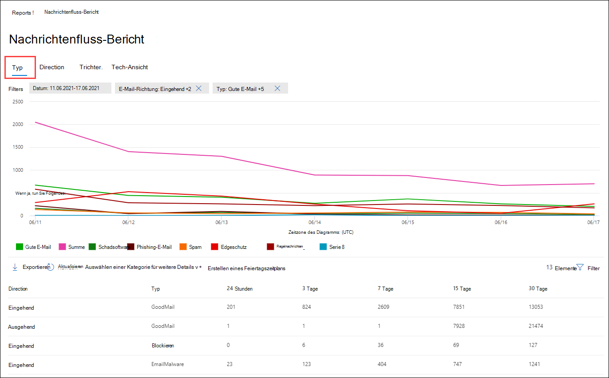

# Anzeigen von Nachrichtenfluss Berichten im Dashboard "Berichte" im Security & Compliance CenterView mail flow reports in the Reports dashboard in Security & Compliance Center

Zusätzlich zu den Nachrichtenfluss Berichten, die im [Nachrichtenfluss-Dashboard](mail-flow-insights-v2.md) im Security & Compliance Center zur Verfügung stehen, stehen im Dashboard Berichte eine Vielzahl zusätzlicher Nachrichtenübermittlungs Berichte zur Verfügung, mit denen Sie Ihre Microsoft 365-Organisation überwachen können.In addition to the mail flow reports that are available in the [Mail flow dashboard](mail-flow-insights-v2.md) in the Security & Compliance Center, a variety of additional mail flow reports are available in the Reports dashboard to help you monitor your Microsoft 365 organization.

Wenn Sie über die [erforderlichen Berechtigungen](#what-permissions-are-needed-to-view-these-reports)verfügen, können Sie diese Berichte im [Security & Compliance Center](https://office.protection.com) anzeigen, indem Sie zum **Reports** \> **Dashboard**Berichte wechseln.If you have the [necessary permissions](#what-permissions-are-needed-to-view-these-reports), you can view these reports in the [Security & Compliance Center](https://office.protection.com) by going to **Reports** \> **Dashboard**. Wenn Sie direkt zum Dashboard Berichte wechseln möchten, öffnen Sie <https://office.protection.office.com/insightdashboard> .To go directly to the Reports dashboard, open <https://office.protection.office.com/insightdashboard>.

## Connector-BerichtConnector report

Der **Bericht Connector** zeigt die Nachrichtenfluss Aktivität für die [eingehenden und ausgehenden Connectors](https://docs.microsoft.com/Exchange/mail-flow-best-practices/use-connectors-to-configure-mail-flow/use-connectors-to-configure-mail-flow) an, die für Ihre Organisation konfiguriert sind.The **Connector report** shows mail flow activity on the [inbound and outbound connectors](https://docs.microsoft.com/Exchange/mail-flow-best-practices/use-connectors-to-configure-mail-flow/use-connectors-to-configure-mail-flow) that are configured for your organization.

Öffnen Sie zum Anzeigen des Berichts das [Security & Compliance Center](https://protection.office.com), wechseln Sie **Reports** zum \> **Dashboard** Berichte, und wählen Sie **connectorbericht**aus.To view the report, open the [Security & Compliance Center](https://protection.office.com), go to **Reports** \> **Dashboard** and select **Connector report**. Wenn Sie direkt zum Bericht wechseln möchten, öffnen Sie <https://protection.office.com/reportv2?id=ConnectorReport> .To go directly to the report, open <https://protection.office.com/reportv2?id=ConnectorReport>.

### Berichtsansicht für den connectorberichtReport view for the Connector report

Die folgenden Diagramme stehen in der Berichtsansicht zur Verfügung:The following charts are available in report view:

- **Anzeigen von Daten nach: Nachrichtenfluss**: Dieses Diagramm zeigt die Anzahl der eingehenden und ausgehenden Nachrichten, die von organisiert werden:**View data by: Mail flow**: This chart shows the number of inbound and outbound messages organized by:

  - **Total****Total**
  - **Aus dem Internet ohne Connector****From the internet without a connector**
  - **An das Internet ohne Connector****To the internet without a connector**
  - Einen bestimmten Connector, den Sie konfiguriert haben.A specific connector that you've configured.
  
  Um die Daten im Diagramm zu isolieren, verwenden Sie die Option **Daten für** SteuerelementAnzeigen, um eine dieser Optionen oder den **gesamten Nachrichtenfluss**auszuwählen.To isolate the data in the chart, use the **Show data for** control to select one of these options or **All mail flow**.

  

- **Daten nach: TLS Usage**: in diesem Diagramm wird der prozentuale Anteil der TLS-Version (Transport Layer Security) für den Nachrichtenfluss angezeigt.**View data by: TLS usage**: This chart shows the percentage of Transport Layer Security (TLS) version usage for mail flow.

  Um die Daten im Diagramm zu isolieren, wählen Sie mithilfe des Steuerelements **Daten anzeigen für** eine der folgenden Optionen aus:To isolate the data in the chart, use the **Show data for** control to select one of the following options:

  - **Gesamter Nachrichtenfluss****All mail flow**
  - **Aus dem Internet ohne Connector****From the internet without a connector**
  - **An das Internet ohne Connector****To the internet without a connector**
  - Einen bestimmten Connector, den Sie konfiguriert haben.A specific connector that you've configured.

  

Wenn Sie in einer Berichtsansicht auf **Filter** klicken, können Sie einen Datumsbereich mit **anfangs** -und **Enddatum**angeben.If you click **Filters** in a report view, you can specify a date range with **Start date** and **End date**.

### Detailtabellen Ansicht für den connectorberichtDetails table view for the Connector report

Wenn Sie in einer Berichtsansicht auf **Detailtabelle anzeigen** klicken, werden die folgenden Informationen angezeigt:If you click **View details table** in a report view, the following information is shown:

- **Date****Date**
- **Verbindungsrichtung und-Name****Connector direction and name**
- **Connectortyp****Connector type**
- **Forced TLS?**: der Wert **true** oder **false**.**Forced TLS?**: The value **True** or **False**.
- **Kein TLS** (Prozentsatz)**No TLS** (percentage)
- **TLS 1,0** (Prozentsatz)**TLS 1.0** (percentage)
- **TLS 1,1** (Prozentsatz)**TLS 1.1** (percentage)
- **TLS 1,2** (Prozentsatz)**TLS 1.2** (percentage)
- **Volume**: die Anzahl der Nachrichten.**Volume**: The number of messages.

Wenn Sie in einer Detailtabellen Ansicht auf **Filter** klicken, können Sie einen Datumsbereich mit **anfangs** -und **Enddatum**angeben.If you click **Filters** in a details table view, you can specify a date range with **Start date** and **End date**.

Klicken Sie auf **Bericht anzeigen**, um zur Berichtsansicht zurückzukehren.To go back to the report view, click **View report**.

## Exchange-Transportregel BerichtExchange transport rule report

Der **Exchange-Transportregel Bericht** zeigt die Auswirkungen von Nachrichtenfluss Regeln (auch als Transportregeln bezeichnet) auf ein-und ausgehende Nachrichten in Ihrer Organisation.The **Exchange transport rule report** shows the effect of mail flow rules (also known as transport rules) on incoming and outgoing messages in your organization.

Öffnen Sie zum Anzeigen des Berichts das [Security & Compliance Center](https://protection.office.com), wechseln Sie **Reports** zum \> **Dashboard** Berichte, und wählen Sie **Exchange-Transport Regel**aus.To view the report, open the [Security & Compliance Center](https://protection.office.com), go to **Reports** \> **Dashboard** and select **Exchange Transport rule**. Wenn Sie direkt zum Bericht wechseln möchten, öffnen Sie <https://protection.office.com/reportv2?id=ETRRuleReport> .To go directly to the report, open <https://protection.office.com/reportv2?id=ETRRuleReport>.

### Berichtsansicht für den Exchange-Transportregel BerichtReport view for the Exchange transport rule report

Die folgenden Diagramme stehen in der Berichtsansicht zur Verfügung:The following charts are available in report view:

- **Anzeigen von Daten nach: Exchange-Transportregeln** \> **Aufschlüsseln nach: Direction**: Dieses Diagramm zeigt die Anzahl der **eingehenden** und **ausgehenden** Nachrichten, die von Transportregeln betroffen waren.**View data by: Exchange transport rules** \> **Break down by: Direction**: This chart shows the number of **Inbound** and **Outbound** messages that were affected by transport rules.

- **Anzeigen von Daten nach: Exchange-Transportregeln** \> **Aufschlüsseln nach: Severity**: Dieses Diagramm zeigt die Anzahl der Nachrichten mit **hohem schwere** Grad und **mittlerem**Schweregrad sowie Nachrichten mit **niedrigem Schweregrad** .**View data by: Exchange transport rules** \> **Break down by: Severity**: This chart shows the number of **High severity** and **Medium severity**, and **Low severity** messages. Sie legen den Schweregrad als Aktion in der Regel fest (**Überwachen Sie diese Regel mit schwere** Grad oder _SetAuditSeverity_).You set the severity level as an action in the rule (**Audit this rule with severity level** or _SetAuditSeverity_). Weitere Informationen finden Sie unter [Aktionen für Nachrichtenfluss Regeln in Exchange Online](https://docs.microsoft.com//Exchange/security-and-compliance/mail-flow-rules/mail-flow-rule-actions).For more information, see [Mail flow rule actions in Exchange Online](https://docs.microsoft.com//Exchange/security-and-compliance/mail-flow-rules/mail-flow-rule-actions).

- **Daten anzeigen nach: DLP Exchange-Transportregeln** \> **Aufschlüsseln nach: Direction**: Dieses Diagramm zeigt die Anzahl der **eingehenden** und **ausgehenden** Nachrichten, die von den DLP-Transportregeln (Data Loss Prevention, Verhinderung von Datenverlust) betroffen waren.**View data by: DLP Exchange transport rules** \> **Break down by: Direction**: This chart shows the number of **Inbound** and **Outbound** messages that were affected by data loss prevention (DLP) transport rules. Sie können das Diagramm weiter verfeinern, indem Sie eine der folgenden Optionen auswählen:You can further refine the chart by selecting on of the following options:

  - **Daten anzeigen für: alle DLP-Transportregeln****Show data for: All DLP transport rules**
  - **Daten anzeigen für: kompromittierte Benutzer****Show data for: Compromised users**
  - **Daten anzeigen für: geringes Inhaltsvolumen erkannter US-Patriot Act****Show data for: Low volume of content detected U.S. Patriot Act**

- **Daten anzeigen nach: DLP Exchange-Transportregeln** \> **Aufschlüsseln nach: Direction**: in dieser Ansicht wird die Anzahl der Nachrichten mit **hohem schwere** Grad und **mittlerem Schweregrad**sowie Nachrichten mit **niedrigem Schweregrad** angezeigt, die von den DLP-Transportregeln betroffen waren.**View data by: DLP Exchange transport rules** \> **Break down by: Direction**: This view shows the number of **High severity** and **Medium severity**, and **Low severity** messages that were affected by DLP transport rules. Sie können das Diagramm weiter verfeinern, indem Sie eine der folgenden Optionen auswählen:You can further refine the chart by selecting on of the following options:

  - **Daten anzeigen für: alle DLP-Transportregeln****Show data for: All DLP transport rules**
  - **Daten anzeigen für: kompromittierte Benutzer****Show data for: Compromised users**
  - **Daten anzeigen für: geringes Inhaltsvolumen erkannter US-Patriot Act****Show data for: Low volume of content detected U.S. Patriot Act**

Wenn Sie in einer Berichtsansicht auf **Filter** klicken, können Sie die Ergebnisse mit den folgenden Filtern ändern:If you click **Filters** in a report view, you can modify the results with the following filters::

- **Start Datum** und **Enddatum****Start date** and **End date**
- RichtungswerteDirection values
- SchweregradwerteSeverity values

### Detailtabellen Ansicht für den Exchange-Transportregel BerichtDetails table view for the Exchange transport rule report

Wenn Sie auf **Detailtabelle anzeigen**klicken, hängt die Anzeige der angezeigten Informationen von dem Diagramm ab, das Sie gesucht haben:If you click **View details table**, the information that's shown depends on the chart you were looking at:

- **Anzeigen von Daten nach: Exchange-Transport Regeln**:**View data by: Exchange Transport rules**:

  - **Date****Date**
  - **Transport Regel****Transport rule**
  - **Betreff****Subject**
  - **Absenderadresse****Sender address**
  - **Empfängeradresse****Recipient address**
  - **Schweregrad****Severity**
  - **Richtung****Direction**

- **Anzeigen von Daten nach: DLP Exchange-Transportregeln**:**View data by: DLP Exchange transport rules**:

  - **Date****Date**
  - **DLP-Richtlinie****DLP policy**
  - **Transport Regel****Transport rule**
  - **Betreff****Subject**
  - **Absenderadresse****Sender address**
  - **Empfängeradresse****Recipient address**
  - **Schweregrad****Severity**
  - **Richtung****Direction**

Wenn Sie in einer Detailtabellen Ansicht auf **Filter** klicken, können Sie die Ergebnisse mit den folgenden Filtern ändern:If you click **Filters** in a details table view, you can modify the results with the following filters:

- **Start Datum** und **Enddatum****Start date** and **End date**
- RichtungswerteDirection values
- SchweregradwerteSeverity values

Klicken Sie auf **Bericht anzeigen**, um zur Berichtsansicht zurückzukehren.To go back to the report view, click **View report**.

## Weiterleitungs BerichtForwarding report

Der **Weiterleitungs Bericht** zeigt die automatisch weitergeleiteten Nachrichten Ihrer Organisation von Exchange Online Postfächern an externe Domänen an.The **Forwarding report** shows your organization's automatically forwarded messages to external domains from Exchange Online mailboxes. Weitergeleitete Nachrichten können ein Sicherheits-oder Konformitäts Risiko darstellen und möglicherweise auf ein kompromittiertes Konto hindeuten.Forwarded messages can pose a security or compliance risk, and might indicate a compromised account.

Öffnen Sie zum Anzeigen des Berichts das [Security & Compliance Center](https://protection.office.com), wechseln Sie **Reports** zum \> **Dashboard** Berichte, und wählen Sie **weiter Leitungs Bericht**aus.To view the report, open the [Security & Compliance Center](https://protection.office.com), go to **Reports** \> **Dashboard** and select **Forwarding report**. Wenn Sie direkt zum Bericht wechseln möchten, öffnen Sie <https://protection.office.com/reportv2?id=MailFlowForwarding> .To go directly to the report, open <https://protection.office.com/reportv2?id=MailFlowForwarding>.

### Berichtsansicht für den Weiterleitungs BerichtReport view for the Forwarding report

Die folgenden Diagramme stehen in der Berichtsansicht zur Verfügung:The following charts are available in the report view:

- **Daten anzeigen für: Weiterleitungs Methoden**: die folgenden Methoden werden angezeigt:**Show data for: Forwarding methods**: The following methods are shown:

  - **Transport Regel**: auch als [Nachrichtenfluss Regeln](https://docs.microsoft.com/Exchange/security-and-compliance/mail-flow-rules/mail-flow-rules)bezeichnet.**Transport rule**: Also known as [mail flow rules](https://docs.microsoft.com/Exchange/security-and-compliance/mail-flow-rules/mail-flow-rules).
  - **Postfachregel**: auch [Posteingangsregeln](https://support.microsoft.com/office/c24f5dea-9465-4df4-ad17-a50704d66c59)genannt.**Mailbox rule**: Also known as [Inbox rules](https://support.microsoft.com/office/c24f5dea-9465-4df4-ad17-a50704d66c59).

  

- **Daten anzeigen für: Forwarding Domains**: Diese Ansicht zeigt die Empfängerdomänen an, die die Ziele für die Weiterleitung darstellen.**Show data for: Forwarding domains**: This view shows the recipient domains that are the destinations for forwarding.

  

- **Daten anzeigen für: Forwarder**: die folgenden Weiterleitungen werden angezeigt:**Show data for: Forwarders**: The following forwarders are shown:

  - **Transport Regel****Transport rule**
  - Das Postfach, das die Posteingangsregel für die Weiterleitung enthält.The mailbox that contains the forwarding Inbox rule.

  

Wenn Sie in einer Berichtsansicht auf **Filter** klicken, können Sie einen Datumsbereich mit **anfangs** -und **Enddatum**angeben.If you click **Filters** in a report view, you can specify a date range with **Start date** and **End date**.

### Detailtabellen Ansicht für den Weiterleitungs BerichtDetails table view for the Forwarding report

Wenn Sie in einer Berichtsansicht auf **Detailtabelle anzeigen** klicken, werden die folgenden Informationen angezeigt:If you click **View details table** in a report view, the following information is shown:

- **Weiterleitungen**: die Wert **Transport Regel** oder das Postfach, das die Posteingangsregel "Weiterleiten" enthält.**Forwarders**: The value **Transport rule** or the mailbox that contains the forwarding Inbox rule.
- **Weiterleitungs**: der Wert für die **Postfachregel** oder die **Transport Regel**.**Forwarding type**: The value **Mailbox rule** or **Transport rule**.
- **Empfängername****Recipient name**
- **Empfängerdomäne****Recipient domain**
- **Details**: Dies ist der GUID-Wert der Nachrichtenfluss Regel oder der RuleIdentity-Wert der Posteingangsregel.**Details**: This is the GUID value of the mail flow rule, or the RuleIdentity value of the Inbox rule.
- **Count****Count**
- **Erstes Termin Datum****First forward date**

Wenn Sie in einer Detailtabellen Ansicht auf **Filter** klicken, können Sie einen Datumsbereich mit **anfangs** -und **Enddatum**angeben.If you click **Filters** in a details table view, you can specify a date range with **Start date** and **End date**.

Klicken Sie auf **Bericht anzeigen**, um zur Ansicht Berichte zurückzukehren.To go back to the reports view, click **View report**.

## Nachrichtenfluss-StatusberichtMailflow status report

Der **Nachrichtenfluss-Statusbericht** ähnelt dem [gesendeten und empfangenen e-Mail-Bericht](#sent-and-received-email-report), wobei zusätzliche Informationen zu e-Mail-Nachrichten zugelassen oder am Edge blockiert werden.The **Mailflow status report** is similar to the [Sent and received email report](#sent-and-received-email-report), with additional information about email allowed or blocked on the edge. Dies ist der einzige Bericht, der Informationen zum Edge-Schutz enthält, und zeigt, wie viele e-Mails blockiert werden, bevor Sie in den Dienst zur Evaluierung durch Exchange Online Protection (EoP) zugelassen werden.This is the only report that contains edge protection information, and shows just how much email is blocked before being allowed into the service for evaluation by Exchange Online Protection (EOP).

Öffnen Sie zum Anzeigen des Berichts das [Security & Compliance Center](https://protection.office.com), wechseln Sie **Reports** zum \> **Dashboard** Berichte, und wählen Sie **Nachrichtenflussstatus Bericht**aus.To view the report, open the [Security & Compliance Center](https://protection.office.com), go to **Reports** \> **Dashboard** and select **Mailflow status report**. Wenn Sie direkt zum **Nachrichtenflussstatus Bericht**wechseln möchten, öffnen Sie <https://protection.office.com/mailflowStatusReport> .To go directly to the **Mail flow status report**, open <https://protection.office.com/mailflowStatusReport>.

### Typansicht für den Nachrichtenfluss-StatusberichtType view for the Mailflow status report

Wenn Sie den Bericht öffnen, ist die Registerkarte **Typ** standardmäßig aktiviert.When you open the report, the **Type** tab is selected by default. Diese Ansicht enthält standardmäßig ein Diagramm und eine Datentabelle, die mit den folgenden Filtern konfiguriert ist:By default, this view contains a chart and a data table that's configured with the following filters:

- **Datum**: die letzten 7 Tage.**Date**: The last 7 days.
- **Richtung**:**Direction**:

  - **Eingehende****Inbound**
  - **Ausgehende****Outbound**
  - **Intra-org** (wird getrennt von einem **eingehenden** und **ausgehenden**gezählt)**Intra-org** (counted separately from **Inbound** and **Outbound**)

- **Geben**Sie Folgendes ein:**Type**:

  - **Gute e-Mail****Good mail**
  - **Schadsoftware****Malware**
  - **Spam****Spam**
  - **Kantenschutz****Edge protection**
  - **Regel Nachrichten****Rule messages**
  - **Phishing-E-Mail****Phishing email**

Das Diagramm wird nach den **Typwerten** sortiert.The chart is organized by the **Type** values.

Sie können diese Filter ändern, indem Sie auf **Filter** klicken oder auf einen Wert in der Diagrammlegende klicken.You can changes these filters by clicking **Filter** or by clicking a value in the chart legend.

Die Datentabelle enthält die folgenden Informationen:The data table contains the following information:

- **Richtung****Direction**
- **Typ****Type**
- **24 Stunden****24 hours**
- **3 Tage****3 days**
- **7 Tage****7 days**
- **15 Tage****15 days**
- **30 Tage****30 days**

Wenn Sie auf **Kategorie auswählen klicken, um weitere Informationen zu**erhalten, können Sie aus den folgenden Werten auswählen:If you click **Choose a category for more details**, you can select from the following values:

- **Phishing-e-Mails**: mit dieser Auswahl gelangen Sie zum [Threat Protection-Statusbericht](view-email-security-reports.md#threat-protection-status-report).**Phishing email**: This selection takes you to the [Threat protection status report](view-email-security-reports.md#threat-protection-status-report).
- **Schadsoftware in e-Mails**: mit dieser Auswahl gelangen Sie zum [Threat Protection-Statusbericht](view-email-security-reports.md#threat-protection-status-report).**Malware in email**: This selection takes you to the [Threat protection status report](view-email-security-reports.md#threat-protection-status-report).
- **Spamerkennungen**: Diese Auswahl führt Sie zum [Spam Erkennungs Bericht](view-email-security-reports.md#spam-detections-report).**Spam detections**: This selection takes you to the [Spam Detections report](view-email-security-reports.md#spam-detections-report).
- **Spam blockierter Edge**: mit dieser Auswahl gelangen Sie zum [Spam Erkennungs Bericht](view-email-security-reports.md#spam-detections-report).**Edge blocked spam**: This selection takes you to the [Spam Detections report](view-email-security-reports.md#spam-detections-report).

**Export**:**Export**:

Für die Detailansicht können Sie nur Daten für einen Tag exportieren.For the detail view, you can only export data for one day. Wenn Sie also Daten für 7 Tage exportieren möchten, müssen Sie 7 verschiedene Exportaktionen durchführen.So, if you want to export data for 7 days, you need to do 7 different export actions.

Jede exportierte CSV-Datei ist auf 150.000 Zeilen limitiert.Each exported .csv file is limited to 150,000 rows. Wenn die Daten für diesen Tag mehr als 150.000 Zeilen enthalten, werden mehrere CSV-Dateien erstellt.If the data for that day contains more than 150,000 rows, then multiple .csv files will be created.

### Richtungs Ansicht für den Nachrichtenfluss-StatusberichtDirection view for the Mailflow status report

Wenn Sie auf die Registerkarte **Richtung** klicken, werden die gleichen Standardfilter aus der **Typansicht verwendet** .If you click the **Direction** tab, the same default filters from the **Type** view are used.

Das Diagramm ist nach **Richtungs** Werten angeordnet.The chart is organized by **Direction** values.

Sie können diese Filter ändern, indem Sie auf **Filter** klicken oder auf einen Wert in der Diagrammlegende klicken.You can change these filters by clicking **Filter** or by clicking a value in the chart legend. In der **Typansicht werden** dieselben Filter verwendet.The same filters from the **Type** view are used.

Die Datentabelle enthält dieselben Informationen aus der **Typen** Ansicht.The data table contains same information from the **Type** view.

Die **Kategorie Choose a category for More Details** available Selections and Behavior sind identisch mit der **Type** -Ansicht.The **Choose a category for more details** available selections and behavior are the same as the **Type** view.

**Export**:**Export**:

Für die Detailansicht können Sie nur Daten für einen Tag exportieren.For the detail view, you can only export data for one day. Wenn Sie also Daten für 7 Tage exportieren möchten, müssen Sie 7 verschiedene Exportaktionen durchführen.So, if you want to export data for 7 days, you need to do 7 different export actions.

Jede exportierte CSV-Datei ist auf 150.000 Zeilen limitiert.Each exported .csv file is limited to 150,000 rows. Wenn die Daten für diesen Tag mehr als 150.000 Zeilen enthalten, werden mehrere CSV-Dateien erstellt.If the data for that day contains more than 150,000 rows, then multiple .csv files will be created.

## Gesendete und empfangene e-Mail-BerichteSent and received email report

Der Bericht **gesendeten und empfangenen e-Mail-Nachrichten** ist ein intelligenter Bericht, in dem Informationen zu eingehenden und ausgehenden e-Mails angezeigt werden, einschließlich Spamerkennungen, Schadsoftware und als "gut" identifizierte e-Mails.The **Sent and received email** report is a smart report that shows information about incoming and outgoing email, including spam detections, malware, and email identified as "good." Der Unterschied zwischen diesem Bericht und dem Nachrichten [Fluss Statusbericht](#mailflow-status-report) lautet: dieser Bericht enthält keine Daten zu Nachrichten, die durch den Edge-Schutz blockiert wurden.The difference between this report and the [Mailflow status report](#mailflow-status-report) is: this report doesn't include data about messages blocked by edge protection.

Die Aggregatansicht und die Detailansicht des Berichts erlauben eine Filterung von 90 Tagen.The aggregate view and the detail view of the report allow for 90 days of filtering.

Öffnen Sie zum Anzeigen des Berichts das [Security & Compliance Center](https://protection.office.com), wechseln Sie **Reports** zum \> **Dashboard** Berichte, und wählen Sie **gesendete und empfangene e-Mails**aus.To view the report, open the [Security & Compliance Center](https://protection.office.com), go to **Reports** \> **Dashboard** and select **Sent and received email**. Wenn Sie direkt zum Bericht wechseln möchten, öffnen Sie <https://protection.office.com/reportv2?id=SentAndReceivedMailATP> .To go directly to the report, open <https://protection.office.com/reportv2?id=SentAndReceivedMailATP>.

### Berichtsansicht für den gesendeten und empfangenen e-Mail-BerichtReport view for the Sent and received email report

Die folgenden Diagramme stehen in der Berichtsansicht zur Verfügung:The following charts are available in the report view:

- **Aufschlüsseln nach: Typ**: das Diagramm zeigt alle verfügbaren Kategorien:**Break down by: Type**: The chart shows all available categories:

  - **Total****Total**
  - **Gute e-Mail****Good mail**
  - **Schadsoftware (Anti-Malware)** (EoP)**Malware (anti-malware)** (EOP)
  - **Spamerkennungen****Spam detections**
  - **Regel Nachrichten****Rule messages**
  - **Erweiterte Schadsoftware** (Office 365 ATP)**Advanced malware** (Office 365 ATP)

  Wenn Sie auf einen Tag (Datenpunkt) im Diagramm zeigen, werden Details für diesen Tag angezeigt.When you hover over a day (data point) in the chart, you can see details for that day.

  

- **Aufschlüsseln nach: Direction**: das Diagramm zeigt **Gesamt**-, **eingehende**und **ausgehende** Daten.**Break down by: Direction**: The chart shows **Total**, **Inbound**, and **Outbound** data. Wenn Sie auf einen Tag (Datenpunkt) im Diagramm zeigen, werden Details für diesen Tag angezeigt.When you hover over a day (data point) in the chart, you can see details for that day.

  

- **Drilldown nach** \> **Schadsoftware (Anti-Malware)**: mit dieser Auswahl gelangen Sie zur [Malware Erkennung in e-Mail-Bericht](view-email-security-reports.md#malware-detections-in-email-report).**Drill down by** \> **Malware (anti-malware)**: This selection takes you to the [Malware detections in email report](view-email-security-reports.md#malware-detections-in-email-report).

- **Drilldown nach** \> **Spamerkennungen)**: mit dieser Auswahl gelangen Sie zum [Spam Erkennungs Bericht](view-email-security-reports.md#spam-detections-report).**Drill down by** \> **Spam detections)**: This selection takes you to the [Spam Detections report](view-email-security-reports.md#spam-detections-report).

Wenn Sie in einer Berichtsansicht auf **Filter** klicken, können Sie die Ergebnisse mit den folgenden Filtern ändern:If you click **Filters** in a report view, you can modify the results with the following filters:

- **Start Datum** und **Enddatum****Start date** and **End date**
- RichtungswerteDirection values
- Type-WerteType values

Klicken Sie auf **Bericht anzeigen**, um zur Berichtsansicht zurückzukehren.To go back to the report view, click **View report**.

### Detailtabellen Ansicht für den gesendeten und empfangenen e-Mail-BerichtDetails table view for the Sent and received email report

Wenn Sie auf **Tabelle Details anzeigen** in der Ansicht **aufschlüsseln nach: Richtung** oder **aufschlüsseln nach: Richtungs** Ansicht klicken, werden die folgenden Informationen angezeigt:If you click **View details table** in the **Break down by: Direction** or **Break down by: Direction** view, the following information is shown:

- **Datum (UTC)****Date (UTC)**
- **Typ****Type**
- **Richtung****Direction**
- **Nachrichtenanzahl****Message count**

Wenn Sie in einer Detailtabellen Ansicht auf **Filter** klicken, können Sie die Ergebnisse mit den folgenden Filtern ändern:If you click **Filters** in a details table view, you can modify the results with the following filters:

- **Start Datum** und **Enddatum****Start date** and **End date**
- RichtungswerteDirection values
- Type-WerteType values

Klicken Sie auf **Bericht anzeigen**, um zur Berichtsansicht zurückzukehren.To go back to the report view, click **View report**.

## Bericht über die häufigsten Absender und EmpfängerTop senders and recipients report

Der Bericht " **oberster Absender und Empfänger** " ist ein Kreisdiagramm, in dem Ihre oberen e-Mail-Absender und Empfänger angezeigt werden.The **Top senders and recipients** report is a pie chart showing your top email senders and recipients.

Wenn Sie den Bericht anzeigen möchten, öffnen Sie das [Security & Compliance Center](https://protection.office.com), wechseln Sie zu **Berichte** - \> **Dashboard** , und wählen Sie **oberste Absender und Empfänger**aus.To view the report, open the [Security & Compliance Center](https://protection.office.com), go to **Reports** \> **Dashboard** and select **Top senders and recipients**. Wenn Sie direkt zum Bericht wechseln möchten, öffnen Sie <https://protection.office.com/reportv2?id=TopSenderRecipientsATP> .To go directly to the report, open <https://protection.office.com/reportv2?id=TopSenderRecipientsATP>.

### Berichtsansicht für den oberen Absender und EmpfängerberichtReport view for the Top senders and recipient report

Die folgenden Diagramme stehen in der Berichtsansicht zur Verfügung:The following charts are available in the report view:

- **Anzeigen von Daten für \> Top-e-Mail-Absender****Show data for \> Top mail senders**
- **Anzeigen von Daten für \> Top-e-Mail-Empfänger****Show data for \> Top mail recipients**
- **Anzeigen von Daten für \> Top-Spamempfänger****Show data for \> Top spam recipients**
- **Daten anzeigen für \> Top-Schadsoftware-Empfänger** (EoP)**Show data for \> Top malware recipients** (EOP)
- **Daten anzeigen für \> Top Malware Recipients (ATP)** (Office 365 ATP)**Show data for \> Top malware recipients (ATP)** (Office 365 ATP)

Die Zusammensetzung des Kreisdiagramms ändert sich basierend auf diesen Auswahlmöglichkeiten.The composition of the pie chart changes based on these selections.

Wenn Sie mit dem Mauszeiger auf einen Keil im Kreisdiagramm zeigen, wird die Anzahl der gesendeten oder empfangenen Nachrichten angezeigt.When you hover over a wedge in the pie chart, you can see a count of messages sent or received.

Wenn Sie in einer Berichtsansicht auf **Filter** klicken, können Sie einen Datumsbereich mit **anfangs** -und **Enddatum**angeben.If you click **Filters** in a report view, you can specify a date range with **Start date** and **End date**.

### Detailtabellen Ansicht für den oberen Absender und EmpfängerberichtDetails table view for the Top senders and recipient report

Wenn Sie auf **Detailtabelle anzeigen**klicken, hängt die Anzeige der angezeigten Informationen von dem Diagramm ab, das Sie gesucht haben:If you click **View details table**, the information that's shown depends on the chart you were looking at:

- **Anzeigen von Daten für \> Top-e-Mail-Absender****Show data for \> Top mail senders**

  - **Top-e-Mail-Absender****Top mail senders**
  - **Count****Count**

- **Anzeigen von Daten für \> Top-e-Mail-Empfänger****Show data for \> Top mail recipients**

  - **Top-e-Mail-Empfänger****Top mail recipients**
  - **Count****Count**

- **Anzeigen von Daten für \> Top-Spamempfänger****Show data for \> Top spam recipients**

  - **Top-Spamempfänger****Top spam recipients**
  - **Count****Count**

- **Daten anzeigen für \> Top-Schadsoftware-Empfänger** (EoP)**Show data for \> Top malware recipients** (EOP)

  - **Top-Schadsoftware-Empfänger****Top malware recipients**
  - **Count****Count**

- **Daten anzeigen für \> Top Malware Recipients (ATP)** (Office 365 ATP)**Show data for \> Top malware recipients (ATP)** (Office 365 ATP)

  - **Top-Malware Empfänger (ATP)****Top malware recipients (ATP)**
  - **Count****Count**

Wenn Sie in einer Detailtabellen Ansicht auf **Filter** klicken, können Sie einen Datumsbereich mit **anfangs** -und **Enddatum**angeben.If you click **Filters** in a details table view, you can specify a date range with **Start date** and **End date**.

Klicken Sie auf **Bericht anzeigen**, um zur Berichtsansicht zurückzukehren.To go back to the report view, click **View report**.

## Welche Berechtigungen sind zum Anzeigen dieser Berichte erforderlich?What permissions are needed to view these reports?

Zum Anzeigen und Verwenden der Berichte müssen Sie Mitglied der angegebenen Rollengruppe im Security & Compliance Center **und** in Exchange Online sein.To view and use the reports, you need to be a member of the specified role group in the Security & Compliance Center **and** in Exchange Online.

- Im Security & Compliance Center müssen Sie Mitglied einer der folgenden Rollengruppen sein:In the Security & Compliance Center, you need to be a member of one of the following role groups:

  -Organisationsverwaltung-Sicherheits Administrator (Dies können Sie auch im [Azure Active Directory Admin Center](https://aad.portal.azure.com) – Sicherheits Leser-Organization Management -Security Administrator (you can also do this in the [Azure Active Directory admin center](https://aad.portal.azure.com) -Security Reader

  Weitere Informationen finden Sie unter [Berechtigungen im Security & Compliance Center](https://docs.microsoft.com/microsoft-365/security/office-365-security/permissions-in-the-security-and-compliance-center).For more information, see [Permissions in the Security & Compliance Center](https://docs.microsoft.com/microsoft-365/security/office-365-security/permissions-in-the-security-and-compliance-center).

- In Exchange Online müssen Sie Mitglied einer der folgenden Rollengruppen sein:In Exchange Online, you need to be a member of one of the following role groups:

  -Organisationsverwaltung-nur Ansichts Organisationsverwaltung-nur Empfänger – Compliance-Management-Organization Management -View-only Organization Management -View-Only Recipients -Compliance Management

Weitere Informationen finden Sie unter [Berechtigungen in Exchange Online](https://docs.microsoft.com/Exchange/permissions-exo/permissions-exo) und [Verwalten von Rollengruppen in Exchange Online](https://docs.microsoft.com/Exchange/permissions-exo/role-groups).For more information, see [Permissions in Exchange Online](https://docs.microsoft.com/Exchange/permissions-exo/permissions-exo) and [Manage role groups in Exchange Online](https://docs.microsoft.com/Exchange/permissions-exo/role-groups).

## Verwandte ThemenRelated topics

[Intelligente Berichte und Einblicke im Security & Compliance CenterSmart reports and insights in the Security & Compliance Center](reports-and-insights-in-security-and-compliance.md)

[Nachrichtenübermittlung und Einblicke im Security & Compliance CenterMail flow insights in the Security & Compliance Center](mail-flow-insights-v2.md)

[Anzeigen von E-Mail-Sicherheitsberichten im Security & Compliance CenterView email security reports in the Security & Compliance Center](view-email-security-reports.md)

[Anzeigen von Berichten für Office 365 Advanced Threat ProtectionView reports for Office 365 Advanced Threat Protection](view-reports-for-atp.md)
