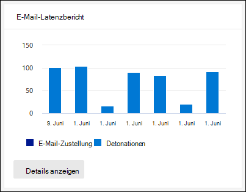

# Anzeigen von Defender für Office 365 Berichte im Dashboard "Berichte" im Security & Compliance Center

[!INCLUDE [Microsoft 365 Defender rebranding](../includes/microsoft-defender-for-office.md)]

Microsoft Defender für Office 365 Organisationen (beispielsweise Microsoft 365 E5-Abonnements oder Microsoft Defender für Office 365 Plan 1 oder Microsoft Defender für Office 365 Plan 2-Add-ons) enthält eine Reihe von sicherheitsbezogenen Berichten. Wenn Sie über die [erforderlichen Berechtigungen](#what-permissions-are-needed-to-view-the-defender-for-office-365-reports)verfügen, können Sie diese Berichte im Security & Compliance Center anzeigen, indem Sie  zum \> **Dashboard** Berichte wechseln. Wenn Sie direkt zum Dashboard Berichte wechseln möchten, öffnen Sie <https://protection.office.com/insightdashboard> .

## Defender für Office 365-Bericht zu Dateitypen

Der Bericht **Defender for Office 365 File Types Report** zeigt Ihnen den Typ der Dateien an, die von [sicheren Anlagen](atp-safe-attachments.md)als schädlich erkannt wurden.

 Die aggregierte Ansicht des Berichts ermöglicht eine Filterung von 90 Tagen, während in der Detailansicht nur 10 Tage Filterung zulässig ist.

Öffnen Sie zum Anzeigen des Berichts das [Security & Compliance Center](https://protection.office.com), wechseln Sie  zum \> **Dashboard** Berichte, und wählen Sie **Defender für Office 365 Dateitypen** aus. Wenn Sie direkt zum Bericht wechseln möchten, öffnen Sie <https://protection.office.com/reportv2?id=ATPFileReport> .

> [!NOTE]
> Die Informationen in diesem Bericht sind auch im [Defender für Office 365 Bericht zur Nachrichten Disposition](#defender-for-office-365-message-disposition-report)verfügbar.

### Berichtsansicht für den Verteidiger für Office 365 Dateitypen Bericht

Die folgenden Ansichten sind verfügbar:

- **Daten nach: File anzeigen**: das Diagramm enthält die folgenden Informationen:

  - **Böswillige Excel-Anlagen**
  - **Böswillige Flash-Anlagen**
  - **Böswillige PDF-Anlagen**
  - **Böswillige PowerPoint-Anlagen**
  - **Böswillige URLs**
  - **Böswillige Word-Anlagen**
  - **Böswillige ausführbare Anlagen**
  - **Sonstige**

  Wenn Sie den Mauszeiger über einen bestimmten Tag (Datenpunkt) bewegen, sehen Sie die Aufschlüsselung der Typen von bösartigen Dateien, die durch [sichere Anlagen](atp-safe-attachments.md) und [Schutz vor Schadsoftware in EoP](anti-malware-protection.md)erkannt wurden.

  

  Wenn Sie auf **Filter** klicken, können Sie den Bericht mit den folgenden Filtern ändern:

  - **Start Datum** und **Enddatum**
  - Die gleichen Dateityp Werte, die im Diagramm sichtbar sind.

- **Daten anzeigen nach: Nachricht**: das Diagramm enthält die folgenden Informationen:

  - **Zugriff blockieren**
  - **Ersetzte Nachrichten**
  - **Überwachte Nachrichten**
  - **Durch dynamische e-Mail-Zustellung ersetzt**: Weitere Informationen finden Sie unter [Dynamic Delivery in Policies for Safe Attachments](atp-safe-attachments.md#dynamic-delivery-in-safe-attachments-policies).

  

  Wenn Sie auf **Filter** klicken, können Sie den Bericht mit den folgenden Filtern ändern:

  - **Start Datum** und **Enddatum**
  - Dieselben Nachrichten Dispositions Werte, die im Diagramm zur Verfügung stehen, und der Wert der zusätzlichen **Nachrichten** , die übergeben wurden.

### Detailtabellen Ansicht für den Verteidiger für Office 365 Dateitypen Bericht

Wenn Sie auf **Detailtabelle anzeigen** klicken, bietet der Bericht eine nahezu Echtzeitansicht aller Klicks, die innerhalb der Organisation für die letzten 10 Tage stattfinden. Die angezeigten Informationen hängen von dem Diagramm ab, das Sie untersucht haben:

- **Daten nach: File anzeigen**:

  - **Date**
  - **Empfängeradresse**
  - **Absenderadresse**
  - **Nachrichten-ID**: verfügbar im Kopfzeilenfeld nach **richten-ID** im Nachrichtenkopf und sollte eindeutig sein. Ein Beispielwert ist `<08f1e0f6806a47b4ac103961109ae6ef@server.domain>` (Beachten Sie die spitzen Klammern).
  - **Datei**

  Wenn Sie auf **Filter** klicken, können Sie den Bericht mit den folgenden Filtern ändern:

  - **Start Datum** und **Enddatum**
  - Die gleichen Dateityp Werte, die im Diagramm sichtbar sind.

- **Anzeigen von Daten nach: Nachricht**:

  - **Date**
  - **Empfängeradresse**
  - **Absenderadresse**
  - **Nachrichten-ID**
  - **Datei**
  - **Betreff**

  Wenn Sie auf **Filter** klicken, können Sie die Ergebnisse mit den folgenden Filtern ändern:

  - **Start Datum** und **Enddatum**
  - Dieselben Nachrichten Dispositions Werte, die im Diagramm zur Verfügung stehen, und der Wert der zusätzlichen **Nachrichten** , die übergeben wurden.

Klicken Sie auf **Bericht anzeigen**, um wieder zur Berichtsansicht zu gelangen.

## Defender für Office 365-Bericht zum Nachrichtenstatus

Der Bericht " **ATP-Nachrichten Disposition** " zeigt die Aktionen an, die für e-Mail-Nachrichten durchgeführt wurden, die als schädliche Inhalte erkannt wurden.

Öffnen Sie zum Anzeigen des Berichts das [Security & Compliance Center](https://protection.office.com), wechseln Sie  zum \> **Dashboard** Berichte, und wählen Sie **Defender für Office 365 Nachrichten Disposition** aus. Wenn Sie direkt zum Bericht wechseln möchten, öffnen Sie <https://protection.office.com/reportv2?id=ATPMessageReport> .

> [!NOTE]
> Die Informationen in diesem Bericht stehen auch im [Defender für Office 365 Dateitypen Bericht](#defender-for-office-365-file-types-report)zur Verfügung.

### Berichtsansicht für den Verteidiger für Office 365 Bericht zur Nachrichten Disposition

Die folgenden Ansichten sind verfügbar:

- **Daten anzeigen nach: Nachricht**: das Diagramm enthält die folgenden Informationen:

  - **Zugriff blockieren**
  - **Ersetzte Nachrichten**
  - **Überwachte Nachrichten**
  - **Durch dynamische e-Mail-Zustellung ersetzt**: Weitere Informationen finden Sie unter [Dynamic Delivery in Policies for Safe Attachments](atp-safe-attachments.md#dynamic-delivery-in-safe-attachments-policies).

  

  Wenn Sie auf **Filter** klicken, können Sie den Bericht mit den folgenden Filtern ändern:

  - **Start Datum** und **Enddatum**
  - Dieselben Nachrichten Dispositions Werte, die im Diagramm zur Verfügung stehen, und der Wert der zusätzlichen **Nachrichten** , die übergeben wurden.

- **Daten nach: File anzeigen**: das Diagramm enthält die folgenden Informationen:

  - **Böswillige Excel-Anlagen**
  - **Böswillige Flash-Anlagen**
  - **Böswillige PDF-Anlagen**
  - **Böswillige PowerPoint-Anlagen**
  - **Böswillige URLs**
  - **Böswillige Word-Anlagen**
  - **Böswillige ausführbare Anlagen**
  - **Sonstige**

  Wenn Sie den Mauszeiger über einen bestimmten Tag (Datenpunkt) bewegen, sehen Sie die Aufschlüsselung der Typen von bösartigen Dateien, die durch [sichere Anlagen](atp-safe-attachments.md) und [Schutz vor Schadsoftware in EoP](anti-malware-protection.md)erkannt wurden.

  

  Wenn Sie auf **Filter** klicken, können Sie den Bericht mit den folgenden Filtern ändern:

  - **Start Datum** und **Enddatum**
  - Die gleichen Dateityp Werte, die im Diagramm sichtbar sind.

### Detailtabellen Ansicht für den Verteidiger für Office 365 Bericht zur Nachrichten Disposition

Wenn Sie auf **Detailtabelle anzeigen** klicken, bietet der Bericht eine nahezu Echtzeitansicht aller Klicks, die innerhalb der Organisation für die letzten 10 Tage stattfinden. Die angezeigten Informationen hängen von dem Diagramm ab, das Sie untersucht haben:

- **Anzeigen von Daten nach: Nachricht**:

  - **Date**
  - **Empfängeradresse**
  - **Absenderadresse**
  - **Nachrichten-ID**
  - **Datei**
  - **Betreff**

  Wenn Sie auf **Filter** klicken, können Sie die Ergebnisse mit den folgenden Filtern ändern:

  - **Start Datum** und **Enddatum**
  - Dieselben Nachrichten Dispositions Werte, die im Diagramm zur Verfügung stehen, und der Wert der zusätzlichen **Nachrichten** , die übergeben wurden.

- **Daten nach: File anzeigen**:

  - **Date**
  - **Empfängeradresse**
  - **Absenderadresse**
  - **Nachrichten-ID**
  - **Datei**

  Wenn Sie auf **Filter** klicken, können Sie den Bericht mit den folgenden Filtern ändern:

  - **Start Datum** und **Enddatum**
  - Die gleichen Dateityp Werte, die im Diagramm sichtbar sind.

Klicken Sie auf **Bericht anzeigen**, um wieder zur Berichtsansicht zu gelangen.

## Bericht über die e-Mail-Wartezeit

Der **Bericht über die e-Mail-Wartezeit** zeigt eine aggregierte Ansicht der in Ihrer Organisation erlebten e-Mail-Zustellung und der detonations Wartezeit. E-Mail-Zustellungszeiten im Dienst sind von einer Reihe von Faktoren betroffen, und die absolute Lieferzeit in Sekunden ist oft kein guter Indikator für Erfolg oder ein Problem. Eine langsame Lieferzeit an einem Tag kann als durchschnittliche Zustellungszeit an einem anderen Tag betrachtet werden oder umgekehrt. Der **Bericht über die e-Mail-Wartezeit** versucht, die Nachrichtenzustellung basierend auf statistischen Daten über die beobachteten Zustellungszeiten anderer Nachrichten zu qualifizieren:

- **50. Perzentil**: Dies ist die Mitte für Nachrichten Zustellungszeiten. Sie können diesen Wert als durchschnittliche Zustellungsdauer ansehen.
- **90. Perzentil**: Dies deutet auf eine hohe Wartezeit für die Nachrichtenzustellung hin. Nur 10% der Nachrichten dauerte länger als dieser Wert zu liefern.
- **99th Perzentil**: Dies gibt die höchste Wartezeit für die Nachrichtenzustellung an.

Client seitige und Netzwerkwartezeit sind nicht enthalten.

Öffnen Sie zum Anzeigen des Berichts das [Security & Compliance Center](https://protection.office.com), wechseln Sie zu **Berichte** - \> **Dashboard** , und wählen Sie **e-Mail-Latenz Bericht** aus. Wenn Sie direkt zum Bericht wechseln möchten, öffnen Sie <https://protection.office.com/mailLatencyReport?viewid=P50> .

### Berichtsansicht für den Bericht über die e-Mail-Wartezeit

Wenn Sie den Bericht öffnen, ist die Registerkarte **50% Perzentil** standardmäßig aktiviert.

Diese Ansicht enthält standardmäßig ein Diagramm, das mit den folgenden Filtern konfiguriert ist:

- **Datum**: die letzten 7 Tage
- **Nachrichtenansicht**:
  - Gezündete Nachrichten

In diesem Diagramm werden Nachrichten angezeigt, die in die folgenden Kategorien aufgeteilt sind:

- **E-Mail-Zustellungs Wartezeit**
- **Detonations Wartezeit**

Wenn Sie mit dem Mauszeiger auf eine Kategorie im Diagramm zeigen, wird eine Aufschlüsselung der Wartezeit in jeder Kategorie angezeigt.

Wenn Sie in der Berichtsansicht auf **Filter** klicken, können Sie die Ergebnisse mit den folgenden Filtern ändern:

- Alle Nachrichten
- Nachrichten, die Anlagen oder URLs enthalten

Wenn Sie auf die Registerkarte **90% Perzentil** oder auf die Registerkarte **99th Perzentil** klicken, werden die gleichen Standardfilter aus der Ansicht **50% Perzentil** verwendet.

### Detailtabellen Ansicht für den Bericht über die e-Mail-Wartezeit

Die folgenden Informationen werden in der Detailtabellen Ansicht angezeigt:

- **Date**
- **Quantile**
- **Nachrichtenanzahl**
- **Gesamtwartezeit**

Das obige zeigt, dass die durchschnittliche Wartezeit für alle zugestellten und gezündeten Nachrichten am 14. November **108,033** Sekunden betrug.

Die Detailtabelle enthält dieselben Informationen auf jeder Registerkarte.

## Threat Protection-Statusbericht

Der **Statusbericht "Threat Protection** " ist eine einzelne Ansicht, in der Informationen zu böswilligen Inhalten und böswilligen e-Mails, die von [Exchange Online Protection](exchange-online-protection-overview.md) (EoP) und Microsoft Defender für Office 365 erkannt und blockiert wurden, zusammengeführt werden. Weitere Informationen finden Sie unter [Threat Protection-Statusbericht](view-email-security-reports.md#threat-protection-status-report).

## URL-Bedrohungsschutz Bericht

Der **Bericht über den URL-Bedrohungsschutz** bietet zusammenfassende und Trend Ansichten für erkannte Bedrohungen und Aktionen, die bei URL-Klicks im Rahmen von [sicheren Links](atp-safe-links.md)ausgeführt werden. In diesem Bericht werden keine klickdaten von Benutzern angezeigt, bei denen die Richtlinie für sichere Links angewendet die Option **Benutzerklicks nicht nachverfolgen** aktiviert hat.

Öffnen Sie zum Anzeigen des Berichts das [Security & Compliance Center](https://protection.office.com), wechseln Sie  zum \> **Dashboard** Berichte, und wählen Sie **URL-Schutzbericht** aus. Wenn Sie direkt zum Bericht wechseln möchten, öffnen Sie <https://protection.office.com/reportv2?id=URLProtectionActionReport> .

> [!NOTE]
> Hierbei handelt es sich um einen *Schutz Trendbericht*, was bedeutet, dass Datentrends in einem größeren DataSet darstellen. Daher sind die Daten in der Aggregatansicht hier nicht in Echtzeit verfügbar, aber die Daten in der Detailtabellen Ansicht sind möglicherweise geringfügig Diskrepanz zwischen den beiden Ansichten angezeigt.

### Berichtsansicht für den URL-Bedrohungsschutz Bericht

Der **URL Threat Protection** -Bericht enthält zwei aggregierte Ansichten, die einmal alle vier Stunden aktualisiert werden, sodass Daten für die letzten 90 Tage angezeigt werden:

- **Aktion zum Schutz vor URLs**: zeigt die Anzahl der URL-Klicks von Benutzern in der Organisation und die Ergebnisse des Klick Vorgangs an:

  - **Blockiert** (der Benutzer wurde für die Navigation zur URL gesperrt)
  - **Blockiert und durchgeklickt**
  - **Durch Klicken während der Überprüfung**

  Ein Klick gibt an, dass der Benutzer auf die Seite blockieren zur böswilligen Website geklickt hat (Administratoren können durch Klicken auf Richtlinien für sichere Links deaktivieren).

  Wenn Sie auf **Filter** klicken, können Sie den Bericht mit den folgenden Filtern ändern:

  - **Start Datum** und **Enddatum**
  - Die verfügbaren Klick Schutzaktionen sowie den **zulässigen** Wert (der Benutzer durfte zur URL navigieren).

  

- **URL-Klick nach Anwendung**: zeigt die Anzahl der URL-Klicks von Anwendungen an, die sichere Links unterstützen:

  - **E-Mail-Client**
  - **PowerPoint**
  - **Word**
  - **Excel**
  - **OneNote**
  - **Visio**
  - **Teams**
  - **Other**

  Wenn Sie auf **Filter** klicken, können Sie den Bericht mit den folgenden Filtern ändern:

  - **Start Datum** und **Enddatum**
  - Die verfügbaren Anwendungen.

### Detailtabellen Ansicht für den URL Threat Protection-Bericht

Wenn Sie auf **Details-Tabelle anzeigen** klicken, bietet der Bericht eine nahezu Echtzeitansicht aller Klicks, die innerhalb der Organisation für die letzten 7 Tage mit den folgenden Details geschehen:

- **Klicken Sie auf Zeit**
- **Benutzende**
- **URL**
- **Aktion**
- **App**

Wenn Sie in der Detailtabellen Ansicht auf **Filter** klicken, können Sie nach denselben Kriterien wie in der Berichtsansicht filtern, auch nach **Domänen** oder **Empfängern** , die durch Kommas getrennt sind.

Klicken Sie auf **Bericht anzeigen**, um wieder zur Berichtsansicht zu gelangen.

## Zusätzliche Berichte zur Anzeige

Zusätzlich zu den in diesem Artikel beschriebenen Berichten stehen verschiedene andere Berichte zur Verfügung, wie in der folgenden Tabelle beschrieben:

****

|Bericht|Thema|
|---|---|
|**Explorer** (Microsoft Defender für Office 365 Plan 2) oder **Echtzeiterkennung** (Microsoft Defender für Office 365 Plan 1)|[Sicherheitsrisiken-Explorer (und Echtzeit-Erkennung)](threat-explorer.md)|
|**E-Mail-Sicherheitsberichte** wie der Bericht über die häufigsten Absender und Empfänger, der Bericht "Spoof-e-Mail" und der Spam Erkennungs Bericht.|[Anzeigen von E-Mail-Sicherheitsberichten im Security & Compliance Center](view-email-security-reports.md)|
|**Nachrichtenfluss Berichte**, wie der Weiterleitungs Bericht, der e-Mail-Fluss Statusbericht und der Bericht über die obersten Absender und Empfänger.|[Anzeigen von Nachrichtenfluss Berichten im Security & Compliance Center](view-mail-flow-reports.md)|
|**URL-Ablaufverfolgung für sichere Links** (nur PowerShell). Die Ausgabe dieses Cmdlets zeigt die Ergebnisse von Aktionen für sichere Links in den letzten sieben Tagen an.|[Get-UrlTrace](https://docs.microsoft.com/powershell/module/exchange/get-urltrace)|
|**Ergebnisse des e-Mail-Verkehrs für EoP und Microsoft Defender für Office 365** (nur PowerShell). Die Ausgabe dieses Cmdlets enthält Informationen zu Domäne, Datum, Ereignistyp, Richtung, Aktion und Nachrichtenanzahl.|[Get-MailTrafficATPReport](https://docs.microsoft.com/powershell/module/exchange/get-mailtrafficatpreport)|
|**E-Mail-Detailberichte für EoP und Defender für Office 365 Erkennungen** (nur PowerShell). Die Ausgabe dieses Cmdlets enthält Details zu bösartigen Dateien oder URLs, Phishing-versuchen, Identitätswechsel und anderen potenziellen Bedrohungen in e-Mails oder Dateien.|[Get-MailDetailATPReport](https://docs.microsoft.com/powershell/module/exchange/get-maildetailatpreport)|
|

## Welche Berechtigungen sind erforderlich, um den Verteidiger für Office 365 Berichte anzuzeigen?

Damit Sie die in diesem Artikel beschriebenen Berichte anzeigen und verwenden können, müssen Sie Mitglied einer der folgenden Rollengruppen im Security & Compliance Center sein:

- **Organisationsverwaltung**
- **Sicherheits Administrator**
- **Sicherheits Leser**
- **Globaler Leser**

Weitere Informationen finden Sie unter [Berechtigungen im Security & Compliance Center](permissions-in-the-security-and-compliance-center.md).

**Hinweis**: beim Hinzufügen von Benutzern zur entsprechenden Azure Active Directory-Rolle im Microsoft 365 Admin Center erhalten Benutzer die erforderlichen Berechtigungen im Security & Compliance Center _und_ Berechtigungen für andere Features in Microsoft 365. Weitere Informationen finden Sie unter [Informationen zu Administratorrollen](https://docs.microsoft.com/microsoft-365/admin/add-users/about-admin-roles).

## Was geschieht, wenn die Berichte keine Daten anzeigen?

Wenn für Office 365 Berichte keine Daten in Ihrem Defender angezeigt werden, überprüfen Sie, ob Ihre Richtlinien ordnungsgemäß eingerichtet sind. In Ihrer Organisation müssen [Richtlinien für sichere Links](set-up-atp-safe-links-policies.md) und Richt [Linien für sichere Anlagen](set-up-atp-safe-attachments-policies.md) definiert sein, damit der Verteidiger Office 365 Schutz gewährleistet ist. Siehe auch [Anti-Spam and Anti-Malware Protection](anti-spam-and-anti-malware-protection.md).

## Verwandte Themen

[Intelligente Berichte und Einblicke im Security & Compliance Center](reports-and-insights-in-security-and-compliance.md)

[Rollen Berechtigungen (Azure Active Directory](https://docs.microsoft.com/azure/active-directory/users-groups-roles/directory-assign-admin-roles#role-permissions)
