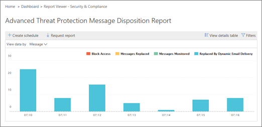

# Anzeigen von Berichten für Office 365 Advanced Threat Protection

Wenn Ihre Organisation über [Office 365 Advanced Threat Protection](office-365-atp.md) (ATP) verfügt und Sie über die [erforderlichen Berechtigungen](#what-permissions-are-needed-to-view-the-atp-reports)verfügen, können Sie mehrere ATP-Berichte im Security &amp; Compliance Center verwenden. (Wechseln Sie zu **Berichte** \> **Dashboard**.)

Zu den ATP-Berichten zählen folgende:

- [Threat Protection-Statusbericht](#threat-protection-status-report)
- [ATP-Dateitypenbericht](#atp-file-types-report)
- [ATP-Bericht zum Nachrichtenstatus](#atp-message-disposition-report)
- entweder [Echtzeiterkennung oder Explorer](threat-explorer.md) (je nachdem, ob Sie Office 365 ATP-Plan 1 oder 2 haben)
- ... [und vieles mehr](#additional-reports-to-view).

Lesen Sie diesen Artikel, um eine Übersicht über ATP-Berichte und deren Verwendung zu erhalten.

## Threat Protection-Statusbericht

Der **Status Bericht "Threat Protection** " ist eine einzelne Ansicht, in der Informationen zu böswilligen Inhalten und böswilligen e-Mails zusammengefasst werden, die durch [Exchange Online Schutz](exchange-online-protection-overview.md) (EoP) und [Office 365 ATP](office-365-atp.md)erkannt und blockiert wurden. Dieser Bericht eignet sich zum Anzeigen von Erkennungen im Laufe der Zeit (bis zu 90 Tage) und ermöglicht es Sicherheitsadministratoren, Trends zu identifizieren oder zu bestimmen, ob Richtlinien angepasst werden müssen.

Der Bericht enthält eine aggregierte Anzahl von eindeutigen e-Mail-Nachrichten mit bösartigen Inhalten, wie Dateien oder Websiteadressen (URLs), die durch das Anti-Malware-Modul, die [Zero-Hour-automatische Bereinigung (AUTOPURGE)](zero-hour-auto-purge.md)und ATP-Features wie [ATP-sichere Links](atp-safe-links.md), [ATP-sichere Anlagen](atp-safe-attachments.md)und [ATP-Anti-Phishing](set-up-anti-phishing-policies.md)blockiert wurden.

Filter und Aufschlüsselung der Informationen ermöglichen eine granularere Kategorisierung der Informationen in diesem Bericht. Insbesondere gibt es ein "Aufteilen von"-Menü für **e-Mail-** \> **Phishing** -und **e-Mail** - \> **Malware Ansichten**. Die Daten werden in folgendem aufgeschlüsselt:

|||
|---|---|
|Nach Erkennungstyp|Welche Richtlinien haben dazu beigetragen, diese Bedrohungen zu erfassen?|
|Nach Erkennungstechnologie|Welche zugrunde liegende Microsoft-Technologie hat die Bedrohung erfasst?|
|Nach Zustellungsstatus|Was geschah mit den e-Mail-Nachrichten, die als Bedrohungen erkannt wurden?|
|

> [!TIP]
> Sowohl die e-Mail-> Phishing | Schadsoftware-Ansichten weisen eine granulare Aufschlüsselung der angezeigten Erkennungstechnologien auf, wobei Kategorien wie *ATP-generierte dateireputation*, *Datei Detonation*, *URL-Detonation*, *Antispoofing: DMARC-Fehler*hilfreich ist, um genau zu ermitteln, welche Funktion Ihre Organisation veranlasst hat, Bedrohungen einzufangen.

Diese Ansichten bieten Ihnen die Möglichkeit, über einen Mausklick (in **e-Mail-** \> **Phishing**, **e-Mail-** \> **Schadsoftware**und **Content** \> **Malware** Ansichten für Inhalte) zu exportieren. Die aggregierten Daten, die auf Ihren Computer exportiert werden, können in Excel geöffnet werden.

**Hinweis**: die maximale Anzahl von Einträgen, die für **Phishing** und **Schadsoftware** exportiert werden können, liegt bei knapp 10000. Wenn Sie eine Ansicht exportieren, werden nur die letzten 10000-Einträge exportiert.

In den Ansichten Übersicht und e-Mails werden Informationen innerhalb von Stunden nach der Verarbeitung und nicht in 24 Stunden angezeigt (Demand Re. erhöhte Geschwindigkeiten hier war ein deutliches Signal)!

> [!NOTE]
> Ein Status Bericht über den Bedrohungsschutz steht Kunden zur Verfügung, die entweder [Office 365 ATP](office-365-atp.md) oder [Exchange Online Protection](exchange-online-protection-overview.md)) (EoP) haben. die Informationen, die im Threat Protection-Status Bericht für ATP-Kunden angezeigt werden, enthalten jedoch wahrscheinlich unterschiedliche Daten, als EoP-Kunden möglicherweise sehen. Der Threat Protection-Status Bericht für ATP-Kunden enthält beispielsweise Informationen zu [schädlichen Dateien, die in SharePoint Online, OneDrive oder Microsoft Teams erkannt](atp-for-spo-odb-and-teams.md)wurden. Solche Informationen gelten nur für ATP, sodass Kunden, die über EoP, aber nicht ATP verfügen, diese Details nicht in Ihrem Threat Protection-Status Bericht sehen.

Wechseln Sie zum Anzeigen des Statusberichts für den Bedrohungsschutz im [Security &amp; Compliance Center](https://protection.office.com)zu **Reports** \> **Dashboard** \> **Threat Protection Status**.

Wenn Sie einen detaillierten Status für einen Tag erhalten möchten, zeigen Sie mit der Maus auf das Diagramm.

Standardmäßig zeigt der Status Bericht zum Bedrohungsschutz Daten für die letzten sieben Tage an. Sie können jedoch **Filter** auswählen und den Datumsbereich ändern, um Daten für bis zu 90 Tage anzuzeigen. (Wenn Sie ein Testabonnement verwenden, sind die Daten möglicherweise auf 30 Tage eingeschränkt.)

Sie können auch das Menü " **Daten anzeigen nach** " verwenden, um zu ändern, welche Informationen im Bericht angezeigt werden.

## Status Bericht über den URL-Schutz

In diesem Bericht werden gesammelte Daten und erkannte Bedrohungen pro Klick erstellt (während die meisten anderen e-Mail-Bedrohungs bezogenen Berichte pro Nachrichtendaten sind). Dieser Bericht dient zum Anzeigen von Bedrohungen, die durch Hyperlinks in e-Mail-Nachrichten und Dokumenten pro Klick entstehen. Es gibt zwei Ansichten:

|||
|---|---|
|Aktion "URL-Klick Schutz"|Sehen Sie sich die Anzahl der blockierten URLs an, die mit einem Mausklick durch einen Benutzer außer Kraft gesetzt, aber mit einem Mausklick durch einen Benutzer überschrieben und zulässig sind.|
|URL-Klick nach Anwendung|Sehen Sie sich die Anwendung an, auf die die URL geklickt hat.|
|

In der Detailtabelle können Sie weitere Informationen zu Klick Zeiten und Benutzerinformationen anzeigen. Denken Sie daran, dass der Status Bericht über den URL-Schutz den Schutz vor dem Feature für ATP-sichere Links anzeigt, sodass nur Kunden, die ATP-sichere Links aktiviert haben, Daten in diesem Bericht anzeigen können.

> [!NOTE]
> Hierbei handelt es sich um einen *Schutz Trendbericht*, was bedeutet, dass Datentrends in einem größeren DataSet darstellen. Daher sind die Daten in der Aggregatansicht hier nicht in Echtzeit verfügbar, aber die Daten in der Detailtabellen Ansicht sind möglicherweise geringfügig Diskrepanz zwischen den beiden Ansichten angezeigt.

## ATP-Dateitypenbericht

Der Bericht " **ATP-Dateitypen** " zeigt Ihnen den Typ der Dateien, die von [ATP-Safe-Anlagen](atp-safe-attachments.md)als bösartig erkannt wurden.

Um diesen Bericht anzuzeigen, wechseln Sie im [Security &amp; Compliance Center](https://protection.office.com)zu **Reports** \> **Dashboard** \> **ATP-Dateitypen**.

  
Wenn Sie den Mauszeiger über einen bestimmten Tag bewegen, sehen Sie die Aufschlüsselung der Typen von bösartigen Dateien, die durch [ATP-sichere Anlagen](atp-safe-attachments.md) und [Anti-Spam- &amp; Schutz vor Schadsoftware](anti-spam-and-anti-malware-protection.md)erkannt wurden.
  

## ATP-Bericht zum Nachrichtenstatus

Der Bericht " **ATP-Nachrichten Disposition** " zeigt die Aktionen an, die für e-Mail-Nachrichten durchgeführt wurden, die als schädliche Inhalte erkannt wurden.

Um diesen Bericht anzuzeigen, wechseln Sie im [Security &amp; Compliance Center](https://protection.office.com)zu **Berichte** - \> **Dashboard** \> **ATP-Nachrichten Disposition**.

Wenn Sie mit dem Mauszeiger auf einen Balken im Diagramm zeigen, können Sie sehen, welche Aktionen für erkannte e-Mails an diesem Tag ausgeführt wurden.

## Zusätzliche Berichte zur Anzeige

Zusätzlich zu den in diesem Artikel beschriebenen ATP-Berichten stehen verschiedene andere Berichte zur Verfügung, wie in der folgenden Tabelle beschrieben:

|||
|---|---|
|**Bericht (e)**|**Details**|
|**Explorer** oder **Echt Zeit Erkennungen**: (Office 365 ATP-Plan 2-Kunden haben Explorer; Office 365 ATP-Plan 1 haben Kunden Echt Zeit Erkennungen.)|[Sicherheitsrisiken-Explorer (und Echtzeit-Erkennung)](threat-explorer.md)|
|**E-Mail-Sicherheitsberichte**wie ein Bericht über die wichtigsten Absender und Empfänger, ein spoof-e-Mail-Bericht und ein Spam Erkennungs Bericht.|[Anzeigen von e-Mail-Sicherheitsberichten im Security &amp; Compliance Center](view-email-security-reports.md)|
|**URL-Ablaufverfolgung für ATP-sichere Links**: (Dies ist ein Bericht, den Sie mithilfe von PowerShell generieren.) In diesem Bericht werden die Ergebnisse der Aktionen für ATP-sichere Links in den letzten sieben (7) Tagen dargestellt.|[Get-UrlTrace-Cmdlet-Referenz](https://docs.microsoft.com/powershell/module/exchange/get-urltrace)|
|**EoP und ATP-Ergebnisse**: (Dies ist ein benutzerdefinierter Bericht, den Sie mithilfe von PowerShell generieren). Dieser Bericht enthält Informationen wie Domäne, Datum, Ereignistyp, Richtung, Aktion und Nachrichtenanzahl.|[Get-MailTrafficATPReport-Cmdlet-Referenz](https://docs.microsoft.com/powershell/module/exchange/get-mailtrafficatpreport)|
|**EoP und ATP-Erkennungen**: (Dies ist ein benutzerdefinierter Bericht, den Sie mithilfe von PowerShell generieren). Dieser Bericht enthält Details zu bösartigen Dateien oder URLs, Phishing-versuchen, Identitätswechsel und anderen potenziellen Bedrohungen in e-Mails oder Dateien.|[Get-MailDetailATPReport-Cmdlet-Referenz](https://docs.microsoft.com/powershell/module/exchange/get-maildetailatpreport)|
|

## Welche Berechtigungen sind zum Anzeigen der ATP-Berichte erforderlich?

Damit Sie die in diesem Artikel beschriebenen Berichte anzeigen und verwenden können, **muss Ihnen eine entsprechende Rolle sowohl für das Security &amp; Compliance Center als auch für das Exchange Admin Center zugewiesen sein**.

- Für das Security &amp; Compliance Center müssen Sie eine der folgenden Rollen zugewiesen haben:

  - Organisationsverwaltung
  - Sicherheits Administrator (Dies kann im Azure Active Directory Admin Center zugewiesen werden ( [https://aad.portal.azure.com](https://aad.portal.azure.com) ))
  - Sicherheits Operator (Dies kann im Azure Active Directory Admin Center zugewiesen werden ( [https://aad.portal.azure.com](https://aad.portal.azure.com) ))
  - Sicherheitsleseberechtigter

- Für Exchange Online müssen Sie eine der folgenden Rollen entweder in der Exchange-Verwaltungskonsole ( [https://outlook.office365.com/ecp](https://outlook.office365.com/ecp) ) oder mit PowerShell-Cmdlets zugewiesen haben (siehe [Exchange Online PowerShell](https://docs.microsoft.com/powershell/exchange/exchange-online/exchange-online-powershell)):

  - Organisationsverwaltung
  - Organisationsverwaltung mit Leserechten
  - Rolle „Empfänger mit Leserechten“
  - Verwaltung der Richtlinientreue

Weitere Informationen hierzu finden Sie in den folgenden Ressourcen:

- [Berechtigungen im Security &amp; Compliance Center](permissions-in-the-security-and-compliance-center.md)

- [Featureberechtigungen in Exchange Online](https://docs.microsoft.com/exchange/permissions-exo/feature-permissions)

## Was geschieht, wenn die Berichte keine Daten anzeigen?

Wenn Sie keine Daten in ihren ATP-Berichten sehen, überprüfen Sie, ob Ihre Richtlinien ordnungsgemäß eingerichtet sind. In Ihrer Organisation müssen Richtlinien für [ATP-sichere Links](set-up-atp-safe-links-policies.md) und [ATP-Richtlinien für sichere Anlagen](set-up-atp-safe-attachments-policies.md) definiert sein, damit ATP-Schutz vorhanden ist. Weitere Informationen finden Sie unter [Anti-Spam and Anti-Malware Protection in Office 365](anti-spam-and-anti-malware-protection.md).

## Verwandte Themen

[Berichte und Einblicke im Security &amp; Compliance Center](reports-and-insights-in-security-and-compliance.md)
  
[Erstellen eines Zeitplans für einen Bericht im Security &amp; Compliance Center](create-a-schedule-for-a-report.md)

[Einrichten und Herunterladen eines benutzerdefinierten Berichts im Security &amp; Compliance Center](set-up-and-download-a-custom-report.md)

[Rollen Berechtigungen (Azure Active Directory](https://docs.microsoft.com/azure/active-directory/users-groups-roles/directory-assign-admin-roles#role-permissions)
