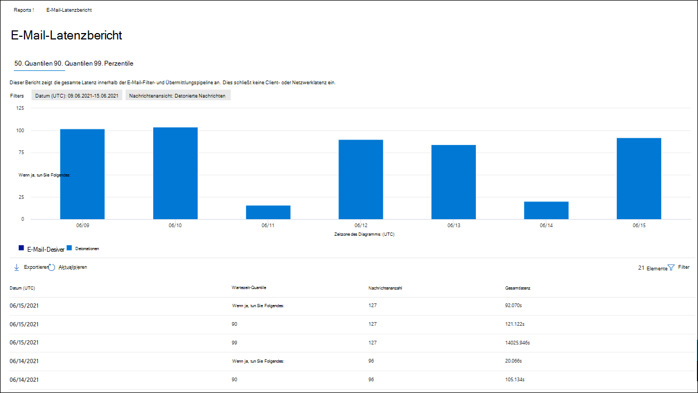
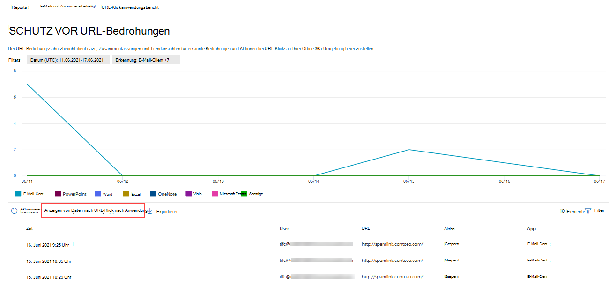

# Anzeigen von Defender für Office 365 Berichte im Microsoft 365 Defender Portal

[!INCLUDE [Microsoft 365 Defender rebranding](../includes/microsoft-defender-for-office.md)]

**Gilt für**
- [Microsoft Defender für Office 365 Plan 1 und Plan 2](defender-for-office-365.md)
- [Microsoft 365 Defender](../defender/microsoft-365-defender.md)

Microsoft Defender für Office 365 Organisationen (z. B. Microsoft 365 E5-Abonnements oder Microsoft Defender für Office 365 Plan 1 oder Microsoft Defender für Office 365 Plan 2-Add-Ons) enthalten eine Vielzahl von sicherheitsrelevanten Berichten. Wenn Sie über die [erforderlichen Berechtigungen](#what-permissions-are-needed-to-view-the-defender-for-office-365-reports)verfügen, können Sie diese Berichte im Microsoft 365 Defender Portal anzeigen, indem Sie zu  \> **E-Mail-Berichte &** \> **Zusammenarbeit E-Mail & Zusammenarbeitsberichte** wechseln. To go directly to the **Email & collaboration reports** page, open <https://security.microsoft.com/emailandcollabreport> .

> [!NOTE]
>
> E-Mail-Sicherheitsberichte, für die Defender nicht für Office 365 erforderlich ist, werden in [den E-Mail-Sicherheitsberichten im Microsoft 365 Defender Portal](view-email-security-reports.md)beschrieben.
>
> Berichte, die sich auf den Nachrichtenfluss beziehen, befinden sich jetzt im Exchange Admin Center (EAC). Weitere Informationen zu diesen Berichten finden Sie unter [Nachrichtenflussberichte im neuen Exchange Admin Center.](/exchange/monitoring/mail-flow-reports/mail-flow-reports)

## Tresor Anlagendateitypenbericht

> [!NOTE]
> Der **Bericht Tresor Dateitypen "Anlagen"** wird schließlich entfernt. Die gleichen Informationen sind im [Bedrohungsschutzstatusbericht](#threat-protection-status-report)verfügbar.

## Tresor Dispositionsbericht über Anlagennachrichten

> [!NOTE]
> Der **Bericht Tresor Anlagen zur Nachrichtendisposition** wird schließlich entfernt. Die gleichen Informationen sind im [Bedrohungsschutzstatusbericht](#threat-protection-status-report)verfügbar.

## E-Mail-Latenzbericht

Der **E-Mail-Latenzbericht** zeigt Ihnen eine aggregierte Ansicht der E-Mail-Zustellungs- und Detonationslatenz in Ihrer Organisation. Die E-Mail-Zustellungszeiten im Dienst werden von einer Reihe von Faktoren beeinflusst, und die absolute Zustellzeit in Sekunden ist häufig kein guter Indikator für Erfolg oder Problem. Eine langsame Zustellungszeit an einem Tag kann als durchschnittliche Zustellzeit an einem anderen Tag betrachtet werden oder umgekehrt. Dadurch wird versucht, die Nachrichtenübermittlung basierend auf statistischen Daten über die beobachteten Zustellungszeiten anderer Nachrichten zu qualifizieren.

Clientseitige und Netzwerklatenz sind nicht enthalten.

Um den Bericht anzuzeigen, öffnen Sie das [portal Microsoft 365 Defender](https://security.microsoft.com), wechseln Sie zu **Berichte** \> **E-Mail & Zusammenarbeit** \> **E-Mail & Zusammenarbeitsberichte.** Suchen Sie auf der Seite **"E-Mail-& Zusammenarbeitsberichte"** den **Bericht "E-Mail-Latenz",** und klicken Sie dann auf **"Details anzeigen".** Um direkt zum Bericht zu wechseln, öffnen Sie <https://security.microsoft.com/mailLatencyReport> .

Auf der Seite **"E-Mail-Latenzbericht"** sind die folgenden Registerkarten auf der Seite **"E-Mail-Latenzbericht"** verfügbar:

- **50. Quantil:** Dies ist die Mitte für die Nachrichtenübermittlungszeiten. Sie können diesen Wert als durchschnittliche Lieferzeit betrachten. Diese Registerkarte ist standardmäßig ausgewählt.
- **90. Perzentil:** Dies weist auf eine hohe Latenz für die Nachrichtenübermittlung hin. Nur 10 % der Nachrichten dauerten länger als dieser Wert für die Übermittlung.
- **99. Perzentil:** Gibt die höchste Latenz für die Nachrichtenübermittlung an.

Unabhängig von der ausgewählten Registerkarte zeigt das Diagramm Nachrichten in den folgenden Kategorien an:

- **E-Mail-Zustellungslatenz**
- **Detonationen**

Wenn Sie mit dem Mauszeiger auf eine Kategorie im Diagramm zeigen, sehen Sie eine Aufschlüsselung der Latenz in jeder Kategorie.

Wenn Sie auf **"Filtern"** klicken, können Sie sowohl das Diagramm als auch die Detailtabelle nach den folgenden Werten filtern:

- **Datum (UTC):** **Startdatum** und **Enddatum**
- **Nachrichtenansicht:** Einer der folgenden Werte:
  - **Alle Nachrichten**
  - **Nachrichten, die Anlagen oder URLs enthalten**
  - **Detonierte Nachrichten**

Wenn Sie die Konfiguration der Filter abgeschlossen haben, klicken Sie auf **"Anwenden",** **"Abbrechen"** oder **"Filter löschen".**

In der Detailtabelle unterhalb des Diagramms sind die folgenden Informationen verfügbar:

- **Datum (UTC)**
- **Perzentile:** **50**, **90** oder **99**
- **Nachrichtenanzahl**
- **Gesamtlatenz**

## Threat Protection-Statusbericht

Der **Statusbericht zum Bedrohungsschutz** ist eine einzelne Ansicht, die Informationen zu schädlichen Inhalten und schädlichen E-Mails zusammenführt, die von [Exchange Online Protection](exchange-online-protection-overview.md) (EOP) und Microsoft Defender für Office 365 erkannt und blockiert wurden. Weitere Informationen finden Sie unter [Bedrohungsschutzstatusbericht.](view-email-security-reports.md#threat-protection-status-report)

## URL-Bedrohungsschutzbericht

Der **Bericht zum URL-Bedrohungsschutz** enthält Zusammenfassungen und Trendansichten für erkannte Bedrohungen und Aktionen, die bei URL-Klicks im Rahmen [Tresor Links](safe-links.md)ausgeführt werden. In diesem Bericht werden keine Klickdaten von Benutzern angezeigt, bei denen für die angewendete richtlinie Tresor Links die Option **"Benutzerklicks nicht nachverfolgen"** ausgewählt ist.

Um den Bericht anzuzeigen, öffnen Sie das [portal Microsoft 365 Defender](https://security.microsoft.com), wechseln Sie zu **Berichte** \> **E-Mail & Zusammenarbeit** \> **E-Mail & Zusammenarbeitsberichte.** Suchen Sie auf der Seite **"E-Mail & Zusammenarbeitsberichte"** nach der **URL-Schutzseite,** und klicken Sie dann auf **"Details anzeigen".** Um direkt zum Bericht zu wechseln, öffnen Sie <https://security.microsoft.com/reports/URLProtectionActionReport> .

Die verfügbaren Ansichten auf der Berichtsseite zum **URL-Bedrohungsschutz** werden in den folgenden Abschnitten beschrieben.

> [!NOTE]
> Dies ist ein *Schutztrendbericht,* d. h. Daten stellen Trends in einem größeren Dataset dar. Daher sind die Daten in den Diagrammen hier nicht in Echtzeit verfügbar, die Daten in der Detailtabelle sind jedoch so, dass eine geringfügige Abweichung zwischen den beiden angezeigt wird. Die Diagramme werden alle vier Stunden aktualisiert und enthalten Daten für die letzten 90 Tage.

### Anzeigen von Daten nach URL-Klickschutzaktion

Die Aktionsansicht **"Daten nach URL anzeigen" zeigt** die Anzahl der URL-Klicks von Benutzern in der Organisation und die Ergebnisse des Klicks an:

- **Zulässig:** Der Benutzer konnte zur URL navigieren.
- **Blockiert:** Der Benutzer wurde am Navigieren zur URL gehindert.
- **Blockiert und durchgeklickt:** Der Benutzer hat sich entschieden, weiter zur URL zu navigieren.
- **Während des Scans durchgeklickt:** Der Benutzer hat auf den Link geklickt, bevor die Überprüfung abgeschlossen war.

Ein Klick gibt an, dass der Benutzer durch die Blockierungsseite zur schädlichen Website geklickt hat (Administratoren können click through in Tresor Links policies deaktivieren).

Wenn Sie auf **Filter** klicken, können Sie den Bericht und die Detailtabelle ändern, indem Sie einen oder mehrere der folgenden Werte im angezeigten Flyout auswählen:

- **Datum (UTC):** **Startdatum** und **Enddatum**
- **Erkennung:**
  - **Zulässig**
  - **Gesperrt**
  - **Blockiert und durchgeklickt**
  - **Während des Scans durchgeklickt**
- **Domänen:** Die in den Berichtergebnissen aufgeführten URL-Domänen.
- **Empfänger**

Wenn Sie die Konfiguration der Filter abgeschlossen haben, klicken Sie auf **"Anwenden",** **"Abbrechen"** oder **"Filter löschen".**

Die Detailtabelle unterhalb des Diagramms bietet die folgende Nahezu-Echtzeit-Ansicht aller Klicks, die in der Organisation während der letzten 7 Tage aufgetreten sind:

- **Klickzeit**
- **Benutzer**
- **URL**
- **Action**
- **App**

### Anzeigen von Daten nach URL-Klick nach Anwendung

Die **Ansichtsdaten nach URL klicken nach Anwendungsansicht** zeigt die Anzahl der URL-Klicks von Apps an, die Tresor Links unterstützen:

- **E-Mail-Client**
- **PowerPoint**
- **Word**
- **Excel**
- **OneNote**
- **Visio**
- **Microsoft Teams**
- **Sonstige**

Wenn Sie auf **Filter** klicken, können Sie den Bericht und die Detailtabelle ändern, indem Sie einen oder mehrere der folgenden Werte im angezeigten Flyout auswählen:

- **Datum (UTC):** **Startdatum** und **Enddatum**
- **Erkennung:** Verfügbare Apps aus dem Diagramm.
- **Domänen:** Die in den Berichtergebnissen aufgeführten URL-Domänen.
- **Empfänger**

Wenn Sie die Konfiguration der Filter abgeschlossen haben, klicken Sie auf **"Anwenden",** **"Abbrechen"** oder **"Filter löschen".**

Die Detailtabelle unterhalb des Diagramms bietet die folgende Nahezu-Echtzeit-Ansicht aller Klicks, die in der Organisation während der letzten 7 Tage aufgetreten sind:

- **Klickzeit**
- **Benutzer**
- **URL**
- **Action**
- **App**

## Weitere anzuzeigende Berichte

Zusätzlich zu den in diesem Artikel beschriebenen Berichten stehen weitere Berichte zur Verfügung, wie in der folgenden Tabelle beschrieben:

 

****

|Bericht|Thema|
|---|---|
|**Explorer** (Microsoft Defender für Office 365 Plan 2) oder **Echtzeiterkennungen** (Microsoft Defender für Office 365 Plan 1)|[Sicherheitsrisiken-Explorer (und Echtzeit-Erkennung)](threat-explorer.md)|
|**E-Mail-Sicherheitsberichte,** z. B. der Bericht "Häufigste Absender und Empfänger", der Spoof-E-Mail-Bericht und der Spamerkennungsbericht.|[Anzeigen von E-Mail-Sicherheitsberichten im Microsoft 365 Defender Portal](view-email-security-reports.md)|
|**Nachrichtenflussberichte,** z. B. der Weiterleitungsbericht, der E-Mailflow-Statusbericht und der Bericht "Häufigste Absender und Empfänger".|[Nachrichtenflussberichte im neuen Exchange Admin Center](/exchange/monitoring/mail-flow-reports/mail-flow-reports)|
|**URL-Ablaufverfolgung für Tresor Links** (nur PowerShell). Die Ausgabe dieses Cmdlets zeigt ihnen die Ergebnisse der aktionen Tresor Links in den letzten sieben Tagen.|[Get-UrlTrace](/powershell/module/exchange/get-urltrace)|
|**E-Mail-Datenverkehrsergebnisse für EOP und Microsoft Defender für Office 365** (nur PowerShell). Die Ausgabe dieses Cmdlets enthält Informationen zu Domäne, Datum, Ereignistyp, Richtung, Aktion und Nachrichtenanzahl.|[Get-MailTrafficATPReport](/powershell/module/exchange/get-mailtrafficatpreport)|
|**E-Mail-Detailberichte für EOP und Defender für Office 365 Erkennungen** (nur PowerShell). Die Ausgabe dieses Cmdlets enthält Details zu schädlichen Dateien oder URLs, Phishingversuchen, Identitätswechsel und anderen potenziellen Bedrohungen in E-Mails oder Dateien.|[Get-MailDetailATPReport](/powershell/module/exchange/get-maildetailatpreport)|
|

## Welche Berechtigungen sind erforderlich, um den Defender für Office 365 Berichte anzuzeigen?

Um die in diesem Artikel beschriebenen Berichte anzuzeigen und zu verwenden, müssen Sie Mitglied einer der folgenden Rollengruppen im Microsoft 365 Defender Portal sein:

- **Organisationsverwaltung**
- **Sicherheitsadministrator**
- **Sicherheitsleseberechtigter**
- **Globaler Leser**

Weitere Informationen finden Sie unter [Berechtigungen im Microsoft 365 Defender-Portal](permissions-microsoft-365-security-center.md).

**Hinweis:** Das Hinzufügen von Benutzern zur entsprechenden Azure Active Directory Rolle im Microsoft 365 Admin Center bietet Benutzern die erforderlichen Berechtigungen im Microsoft 365 Defender-Portal _und_ Berechtigungen für andere Features in Microsoft 365. Weitere Informationen finden Sie unter [Informationen zu Administratorrollen](../../admin/add-users/about-admin-roles.md).

## Was geschieht, wenn in den Berichten keine Daten angezeigt werden?

Wenn in Ihrem Defender keine Daten für Office 365-Berichte angezeigt werden, überprüfen Sie, ob Ihre Richtlinien ordnungsgemäß eingerichtet sind. In Ihrer Organisation müssen [Tresor Verknüpfungsrichtlinien](set-up-safe-links-policies.md) und [Tresor Anlagenrichtlinien](set-up-safe-attachments-policies.md) definiert sein, damit Defender für Office 365 Schutz vorhanden ist. Siehe auch [Antispam- und Antischadsoftwareschutz.](anti-spam-and-anti-malware-protection.md)

## Ähnliche Themen

[Intelligente Berichte und Einblicke im Microsoft 365 Defender-Portal](reports-and-insights-in-security-and-compliance.md)

[Rollenberechtigungen (Azure Active Directory](/azure/active-directory/users-groups-roles/directory-assign-admin-roles#role-permissions)
